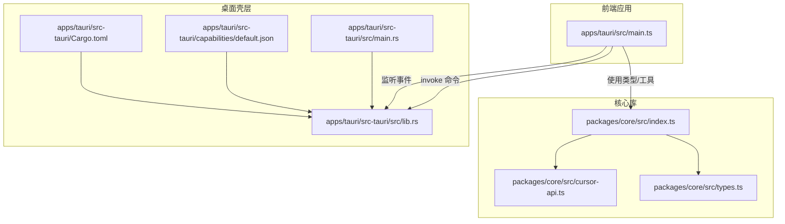
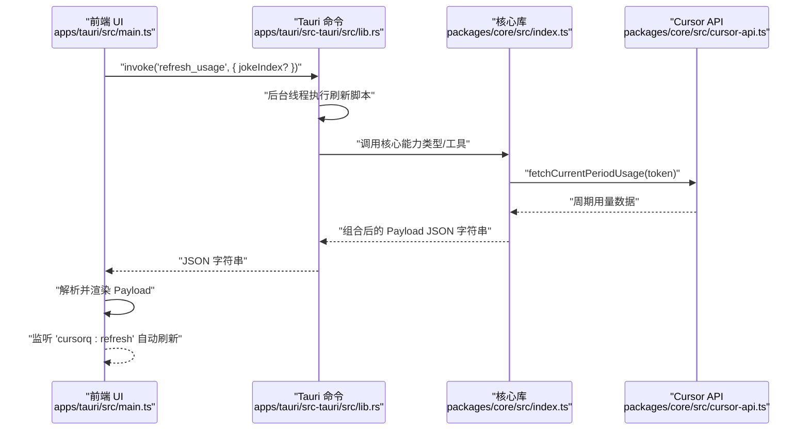
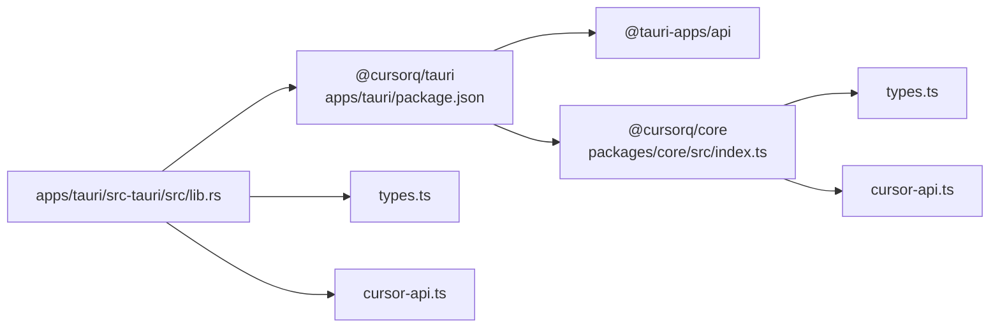

# API 参考

<cite>
**本文引用的文件**
- [apps/tauri/src/main.ts](file://apps/tauri/src/main.ts)
- [apps/tauri/src-tauri/src/lib.rs](file://apps/tauri/src-tauri/src/lib.rs)
- [apps/tauri/src-tauri/src/main.rs](file://apps/tauri/src-tauri/src/main.rs)
- [apps/tauri/src-tauri/Cargo.toml](file://apps/tauri/src-tauri/Cargo.toml)
- [apps/tauri/package.json](file://apps/tauri/package.json)
- [packages/core/src/index.ts](file://packages/core/src/index.ts)
- [packages/core/src/cursor-api.ts](file://packages/core/src/cursor-api.ts)
- [packages/core/src/types.ts](file://packages/core/src/types.ts)
- [apps/tauri/src-tauri/capabilities/default.json](file://apps/tauri/src-tauri/capabilities/default.json)
</cite>

## 目录
1. [简介](#简介)
2. [项目结构](#项目结构)
3. [核心组件](#核心组件)
4. [架构总览](#架构总览)
5. [详细组件分析](#详细组件分析)
6. [依赖关系分析](#依赖关系分析)
7. [性能考量](#性能考量)
8. [故障排查指南](#故障排查指南)
9. [结论](#结论)
10. [附录](#附录)

## 简介
本文件为 CursorQ 的完整 API 参考文档，覆盖以下方面：
- Cursor API 集成：认证授权、请求与响应格式、错误处理策略
- Tauri 命令接口：Rust → TypeScript 的命令封装、参数校验、返回值规范
- 内部 API 接口：命令清单、调用约定、状态管理
- 每个 API 的参数说明、返回值格式、错误码定义与使用示例
- API 版本管理、向后兼容性与迁移指南
- 客户端实现最佳实践与性能优化建议

## 项目结构
CursorQ 采用多包/多应用的组织方式：
- packages/core：通用业务与类型定义、Cursor API 访问工具
- apps/tauri：前端渲染与交互（TypeScript/Vue/Vite），以及 Tauri 桌面壳层（Rust）
- apps/tauri/src-tauri：Tauri 命令注册、系统集成与窗口/托盘逻辑
- apps/tauri/src：前端主程序，通过 @tauri-apps/api 调用 Rust 命令，接收事件并渲染 UI

图表来源
- [apps/tauri/src/main.ts:1-711](file://apps/tauri/src/main.ts#L1-L711)
- [apps/tauri/src-tauri/src/lib.rs:1-800](file://apps/tauri/src-tauri/src/lib.rs#L1-L800)
- [apps/tauri/src-tauri/src/main.rs:1-6](file://apps/tauri/src-tauri/src/main.rs#L1-L6)
- [packages/core/src/index.ts:1-35](file://packages/core/src/index.ts#L1-L35)
- [packages/core/src/cursor-api.ts:1-251](file://packages/core/src/cursor-api.ts#L1-L251)
- [packages/core/src/types.ts:1-140](file://packages/core/src/types.ts#L1-L140)
- [apps/tauri/src-tauri/capabilities/default.json:1-22](file://apps/tauri/src-tauri/capabilities/default.json#L1-L22)
- [apps/tauri/src-tauri/Cargo.toml:1-37](file://apps/tauri/src-tauri/Cargo.toml#L1-L37)

章节来源
- [apps/tauri/src/main.ts:1-711](file://apps/tauri/src/main.ts#L1-L711)
- [apps/tauri/src-tauri/src/lib.rs:1-800](file://apps/tauri/src-tauri/src/lib.rs#L1-L800)
- [packages/core/src/index.ts:1-35](file://packages/core/src/index.ts#L1-L35)

## 核心组件
- 前端主程序（apps/tauri/src/main.ts）
  - 通过 @tauri-apps/api 的 invoke 调用 Rust 命令
  - 监听 cursorq:* 事件以驱动 UI 更新
  - 维护渲染负载（Payload）与 UI 状态（展开/收起、笑话索引等）

- 核心库（packages/core）
  - 导出 Cursor API 工具函数与类型定义
  - 提供预算、进度条、调试场景、复制文案、存储等能力

- Tauri 壳层（apps/tauri/src-tauri/src/lib.rs）
  - 注册命令集，执行系统级操作（窗口、托盘、文件、网络）
  - 后台线程运行外部脚本以刷新数据，避免阻塞 UI

- 类型系统（packages/core/src/types.ts）
  - 统一定义计划、周期用量、指标、进度绘制、应用状态等数据模型

章节来源
- [apps/tauri/src/main.ts:1-711](file://apps/tauri/src/main.ts#L1-L711)
- [packages/core/src/index.ts:1-35](file://packages/core/src/index.ts#L1-L35)
- [packages/core/src/types.ts:1-140](file://packages/core/src/types.ts#L1-L140)

## 架构总览
下图展示前端、核心库与 Tauri 壳层之间的交互关系，以及 Cursor API 的数据流。

图表来源
- [apps/tauri/src/main.ts:526-560](file://apps/tauri/src/main.ts#L526-L560)
- [apps/tauri/src-tauri/src/lib.rs:617-639](file://apps/tauri/src-tauri/src/lib.rs#L617-L639)
- [packages/core/src/index.ts:1-35](file://packages/core/src/index.ts#L1-L35)
- [packages/core/src/cursor-api.ts:173-217](file://packages/core/src/cursor-api.ts#L173-L217)

## 详细组件分析

### Cursor API 集成
- 目标与职责
  - 获取当前周期用量与计划信息
  - 处理认证（Bearer Token）与会话 Cookie
  - 提供降级与对齐策略（Connect API 与 Dashboard 数据合并）

- 关键函数与行为
  - 获取当前周期用量：优先 Connect 协议，失败则回退到 REST 接口，并与 Dashboard 数据对齐
  - 获取计划信息：Connect 协议兜底为默认值
  - 会话 Cookie 构造：从 JWT 解析用户标识，拼装会话 Cookie

- 请求与响应
  - Connect 协议：POST /aiserver.v1.DashboardService/GetCurrentPeriodUsage 与 GetPlanInfo
  - REST 兜底：/api/dashboard/get-current-period-usage 与 /api/usage-summary
  - 响应字段映射：周期开始/结束时间、计划用量、百分比、自动桶模型、显示消息等

- 错误处理
  - 非 2xx 响应抛出带状态码与摘要文本的错误
  - 多源聚合时，保留主源与备源错误信息以便诊断

- 使用示例（路径）
  - [packages/core/src/cursor-api.ts:173-217](file://packages/core/src/cursor-api.ts#L173-L217)
  - [packages/core/src/cursor-api.ts:228-250](file://packages/core/src/cursor-api.ts#L228-L250)

- 数据模型（节选）
  - 周期用量：billingCycleStart/billingCycleEnd/planUsage/displayMessage/autoBucketModels
  - 计划用量：totalSpend/includedSpend/remaining/limit/totalPercentUsed/apiPercentUsed/autoPercentUsed
  - 计划信息：planName/includedAmountCents/price/billingCycleEnd

- 版本与兼容
  - Connect 协议版本头：Connect-Protocol-Version
  - 对齐策略：优先 Connect 数值，Dashboard 的 includedSpend/percentUsed 作为补充

章节来源
- [packages/core/src/cursor-api.ts:1-251](file://packages/core/src/cursor-api.ts#L1-L251)
- [packages/core/src/types.ts:17-31](file://packages/core/src/types.ts#L17-L31)

### Tauri 命令接口（Rust → TypeScript）
- 命令清单与职责
  - 刷新用量：后台线程执行刷新脚本，返回 JSON 字符串
  - 窗口控制：设置大小、拖拽、显示/隐藏、置顶、焦点
  - 托盘与菜单：状态切换、语言、开机启动、立即刷新、同步内容
  - 动图资源：枚举、占位图、按名称解析、data URL 生成
  - 远程配置与内容同步：拉取远程配置、触发内容更新与刷新事件
  - 应用路径查询：根目录、数据、日志、内容、复制、动图目录与便携布局标记

- 参数与返回值规范
  - refresh_usage(app, joke_index?)
    - 参数：可选整数（笑话索引）
    - 返回：字符串（JSON）
    - 错误：字符串错误描述
  - get_capsule_visible/set_capsule_visible_cmd(app, visible)
    - 返回：布尔/空
  - start_drag_capsule/app
    - 返回：空或错误
  - list_mascot_gifs/app
    - 返回：字符串数组
  - mascot_placeholder_path/mascot_placeholder_anim_path
    - 返回：可选字符串
  - mascot_gif_path(name)/mascot_asset_data_url(asset)
    - 参数：字符串（名称或资产标识）
    - 返回：字符串（绝对路径或 data URL）
    - 错误：字符串错误
  - get_remote_config/sync_remote_content(app)
    - 返回：结构化对象（含 updated/message 等）
  - get_app_paths
    - 返回：JSON 对象（路径与便携布局标记）

- 事件机制
  - cursorq:refresh：触发刷新
  - cursorq:content-updated：内容更新后通知
  - cursorq:fix-chrome：修复窗口 Chrome
  - cursorq:window-shown：窗口显示

- 权限与能力
  - 默认能力包含窗口、自动启动、Shell 打开等权限
  - 前端通过 @tauri-apps/api 的 invoke 与 listen 调用命令与监听事件

- 使用示例（路径）
  - [apps/tauri/src/main.ts:531-533](file://apps/tauri/src/main.ts#L531-L533)
  - [apps/tauri/src/main.ts:700-710](file://apps/tauri/src/main.ts#L700-L710)
  - [apps/tauri/src-tauri/src/lib.rs:720-736](file://apps/tauri/src-tauri/src/lib.rs#L720-L736)
  - [apps/tauri/src-tauri/capabilities/default.json:1-22](file://apps/tauri/src-tauri/capabilities/default.json#L1-L22)

- 错误码与语义
  - 命令返回字符串错误时，前端统一捕获并渲染“刷新失败”提示
  - refresh_usage 失败时记录日志并返回错误字符串

章节来源
- [apps/tauri/src-tauri/src/lib.rs:1-800](file://apps/tauri/src-tauri/src/lib.rs#L1-L800)
- [apps/tauri/src/main.ts:526-560](file://apps/tauri/src/main.ts#L526-L560)
- [apps/tauri/src-tauri/capabilities/default.json:1-22](file://apps/tauri/src-tauri/capabilities/default.json#L1-L22)

### 内部 API 接口（命令列表、调用约定、状态管理）
- 命令列表
  - refresh_usage：刷新用量（后台线程）
  - tune_window_dwm：调整窗口 DWM（Windows）
  - sync_window_shape：同步窗口形状
  - show_main_inactive/get_capsule_visible/set_capsule_visible_cmd：窗口可见性控制
  - start_drag_capsule：开始拖拽胶囊
  - list_mascot_gifs/mascot_placeholder_path/mascot_placeholder_anim_path/mascot_gif_path/mascot_asset_data_url：动图资源
  - get_remote_config/sync_remote_content：远程配置与内容同步
  - get_app_paths：应用路径查询

- 调用约定
  - 前端使用 invoke 调用，参数与返回值遵循各命令定义
  - 事件命名空间 cursorq:*，避免与系统事件冲突
  - 后台线程执行耗时任务，避免阻塞 UI

- 状态管理
  - 前端维护 Payload 结构（copy/progress/detail/locale/jokePool/jokeIndex/error）
  - 窗口布局状态（逻辑宽高、半径、胶囊模式）持久化在 Rust 侧
  - 应用状态（locale、笑话索引、surplusBank 等）保存在本地 JSON 文件

- 使用示例（路径）
  - [apps/tauri/src/main.ts:430-461](file://apps/tauri/src/main.ts#L430-L461)
  - [apps/tauri/src-tauri/src/lib.rs:204-213](file://apps/tauri/src-tauri/src/lib.rs#L204-L213)
  - [apps/tauri/src-tauri/src/lib.rs:153-184](file://apps/tauri/src-tauri/src/lib.rs#L153-L184)

章节来源
- [apps/tauri/src-tauri/src/lib.rs:1-800](file://apps/tauri/src-tauri/src/lib.rs#L1-L800)
- [apps/tauri/src/main.ts:430-461](file://apps/tauri/src/main.ts#L430-L461)

## 依赖关系分析
- 包与模块依赖
  - apps/tauri 依赖 @cursorq/core 与 @tauri-apps/api
  - packages/core 导出类型与工具，供 apps/tauri 使用
  - apps/tauri/src-tauri 依赖 tauri、reqwest、serde 等

- 前后端通信
  - 前端通过 @tauri-apps/api.invoke 调用 Rust 命令
  - 前端通过 @tauri-apps/api.listen 监听事件

图表来源
- [apps/tauri/package.json:1-22](file://apps/tauri/package.json#L1-L22)
- [packages/core/src/index.ts:1-35](file://packages/core/src/index.ts#L1-L35)
- [packages/core/src/types.ts:1-140](file://packages/core/src/types.ts#L1-L140)
- [packages/core/src/cursor-api.ts:1-251](file://packages/core/src/cursor-api.ts#L1-L251)
- [apps/tauri/src-tauri/src/lib.rs:1-800](file://apps/tauri/src-tauri/src/lib.rs#L1-L800)

章节来源
- [apps/tauri/package.json:1-22](file://apps/tauri/package.json#L1-L22)
- [apps/tauri/src-tauri/Cargo.toml:1-37](file://apps/tauri/src-tauri/Cargo.toml#L1-L37)

## 性能考量
- 异步与后台线程
  - 刷新用量通过后台线程执行，避免阻塞 UI
  - 窗口 Chrome 修复采用定时器分阶段触发，减少抖动

- 网络与缓存
  - Cursor API 优先 Connect 协议，失败回退 REST 并对齐 Dashboard 数据
  - 建议前端在短时间内重复刷新时进行去抖/节流

- 渲染与布局
  - 窗口尺寸与圆角状态在 Rust 侧持久化，前端仅做最终应用
  - 展开/收起面板时测量高度并一次性设置，避免滚动动画导致白边

- 资源加载
  - 动图资源通过 data URL 直接加载，避免 asset:// 在某些环境的兼容问题

章节来源
- [apps/tauri/src-tauri/src/lib.rs:616-639](file://apps/tauri/src-tauri/src/lib.rs#L616-L639)
- [apps/tauri/src/main.ts:290-317](file://apps/tauri/src/main.ts#L290-L317)
- [apps/tauri/src/main.ts:463-488](file://apps/tauri/src/main.ts#L463-L488)

## 故障排查指南
- 常见错误与定位
  - 刷新失败：前端捕获异常并显示“刷新失败”，同时截取错误片段
  - 未登录：后端返回 error 字段为“not_logged_in”，前端渲染提示“请先登录”
  - 命令失败：命令返回字符串错误，检查日志与参数合法性

- 事件与状态
  - 监听 cursorq:refresh 与 cursorq:content-updated，确认刷新链路是否正常
  - 检查 cursorq:fix-chrome 是否被触发，确保窗口 Chrome 修复流程

- 参数校验
  - 动图相关命令对名称进行非法字符过滤
  - 窗口命令对布局参数进行范围与类型约束

- 日志与诊断
  - 命令执行前后记录日志，便于定位失败原因

章节来源
- [apps/tauri/src/main.ts:549-559](file://apps/tauri/src/main.ts#L549-L559)
- [apps/tauri/src/main.ts:535-538](file://apps/tauri/src/main.ts#L535-L538)
- [apps/tauri/src-tauri/src/lib.rs:616-639](file://apps/tauri/src-tauri/src/lib.rs#L616-L639)
- [apps/tauri/src-tauri/src/lib.rs:616-639](file://apps/tauri/src-tauri/src/lib.rs#L616-L639)

## 结论
本参考文档梳理了 CursorQ 的前端、核心库与 Tauri 壳层之间的 API 边界与交互契约，明确了 Cursor API 的集成方式、Tauri 命令的参数与返回规范、内部状态管理与事件机制。建议在客户端实现中遵循：
- 使用 @tauri-apps/api 的 invoke 与 listen 进行命令调用与事件监听
- 对 Cursor API 的错误进行分类处理与降级回退
- 在刷新与资源加载上采用异步与后台线程策略
- 严格校验命令参数并记录日志，便于排障

## 附录

### API 版本管理、向后兼容与迁移
- Connect 协议版本
  - 请求头包含 Connect-Protocol-Version，确保服务端正确路由
- 兼容策略
  - 当 Connect 接口不可用时，自动回退到 REST 接口
  - 对齐 Dashboard 数据，优先使用 Connect 数值，补充 includedSpend/percentUsed
- 迁移建议
  - 新增字段时保持向后兼容，旧字段不删除
  - 命令参数新增可选字段，避免破坏既有调用方

章节来源
- [packages/core/src/cursor-api.ts:24-43](file://packages/core/src/cursor-api.ts#L24-L43)
- [packages/core/src/cursor-api.ts:173-217](file://packages/core/src/cursor-api.ts#L173-L217)

### 客户端实现最佳实践
- 命令调用
  - 使用 invoke 调用命令，对返回字符串进行 JSON 解析
  - 对可能失败的命令进行 try/catch 并优雅降级
- 事件监听
  - 监听 cursorq:refresh 与 cursorq:content-updated，驱动 UI 刷新
- 错误处理
  - 对 error 字段为“not_logged_in”的情况进行引导登录
  - 对未知错误进行短文本提示并记录日志
- 性能优化
  - 刷新与资源加载使用后台线程
  - 展开/收起面板时一次性设置尺寸，避免多次重排

章节来源
- [apps/tauri/src/main.ts:526-560](file://apps/tauri/src/main.ts#L526-L560)
- [apps/tauri/src/main.ts:700-710](file://apps/tauri/src/main.ts#L700-L710)