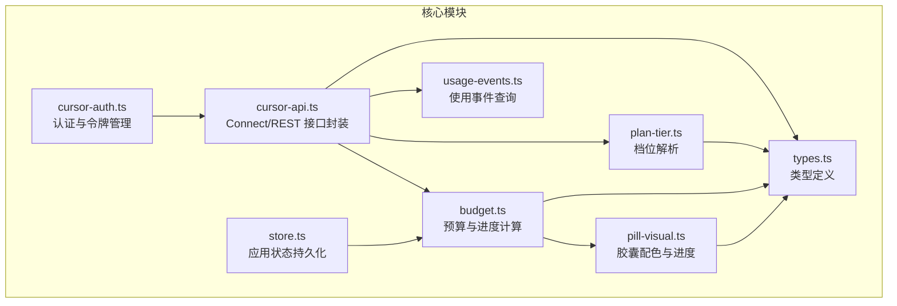
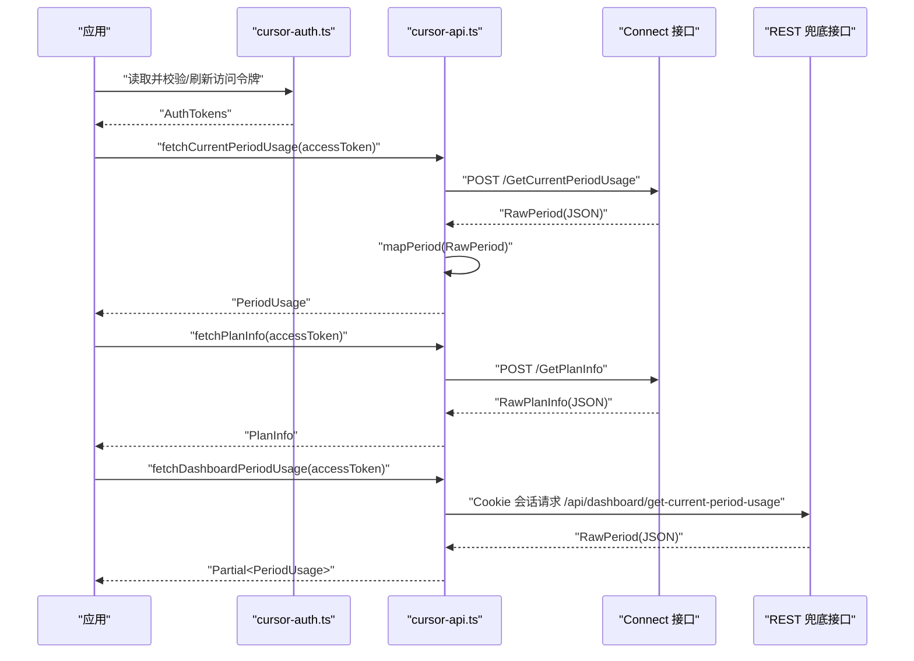
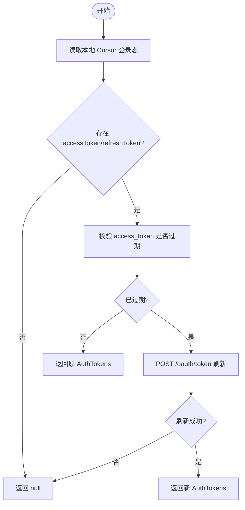
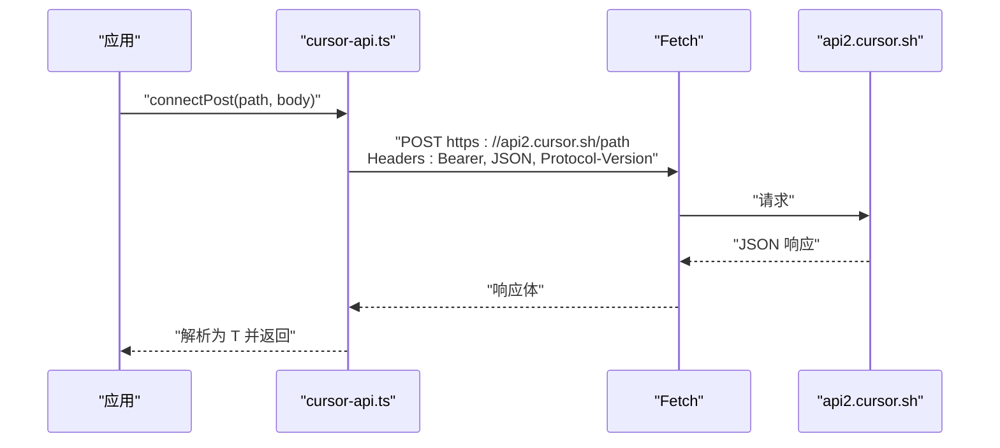
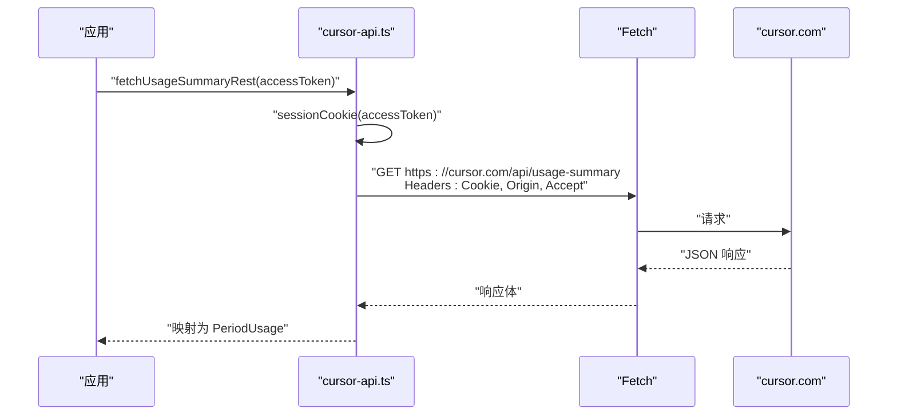
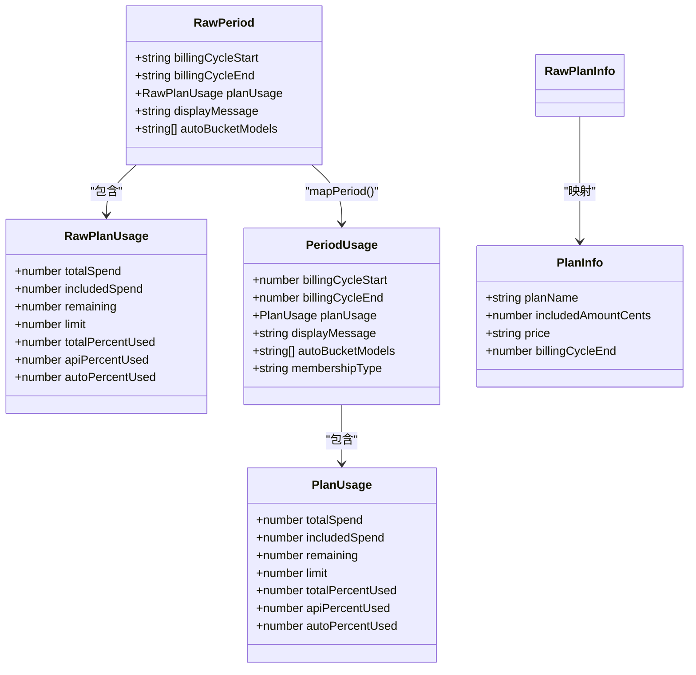
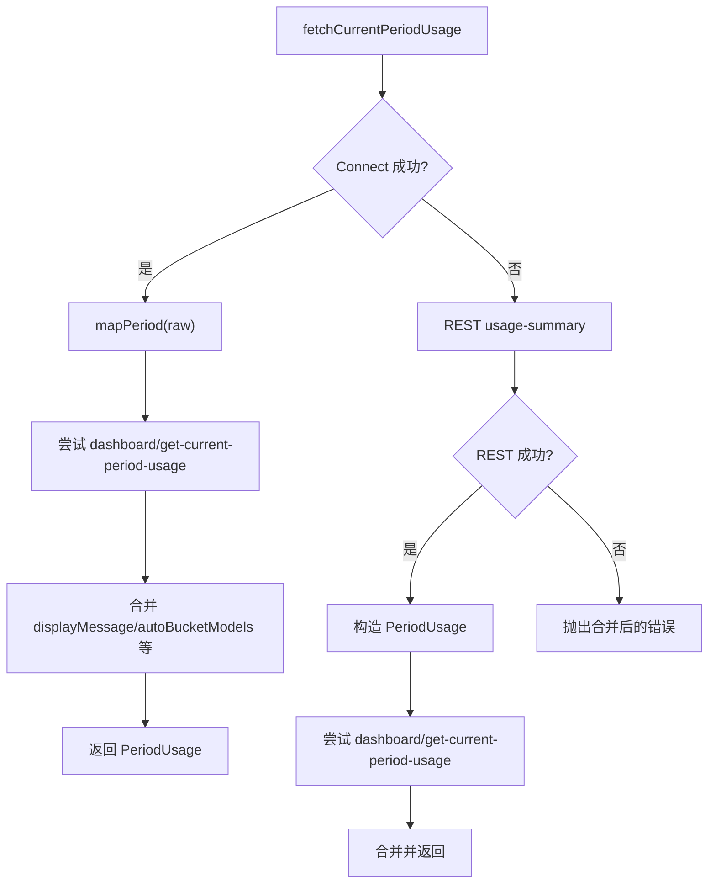
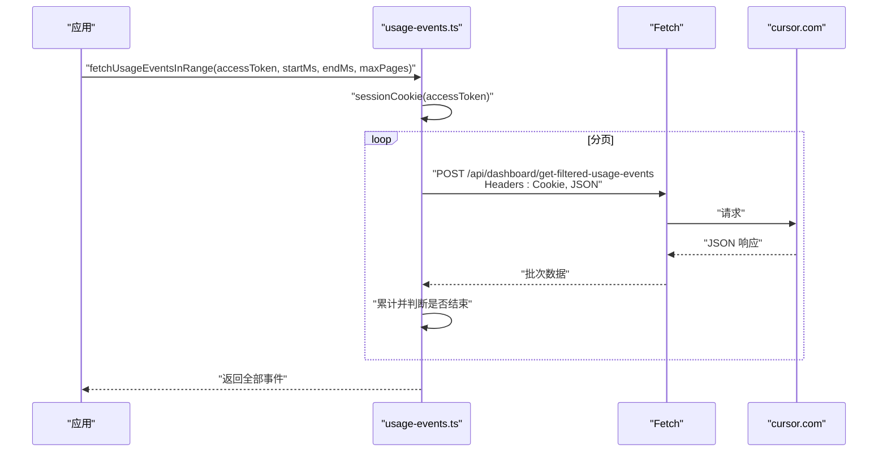
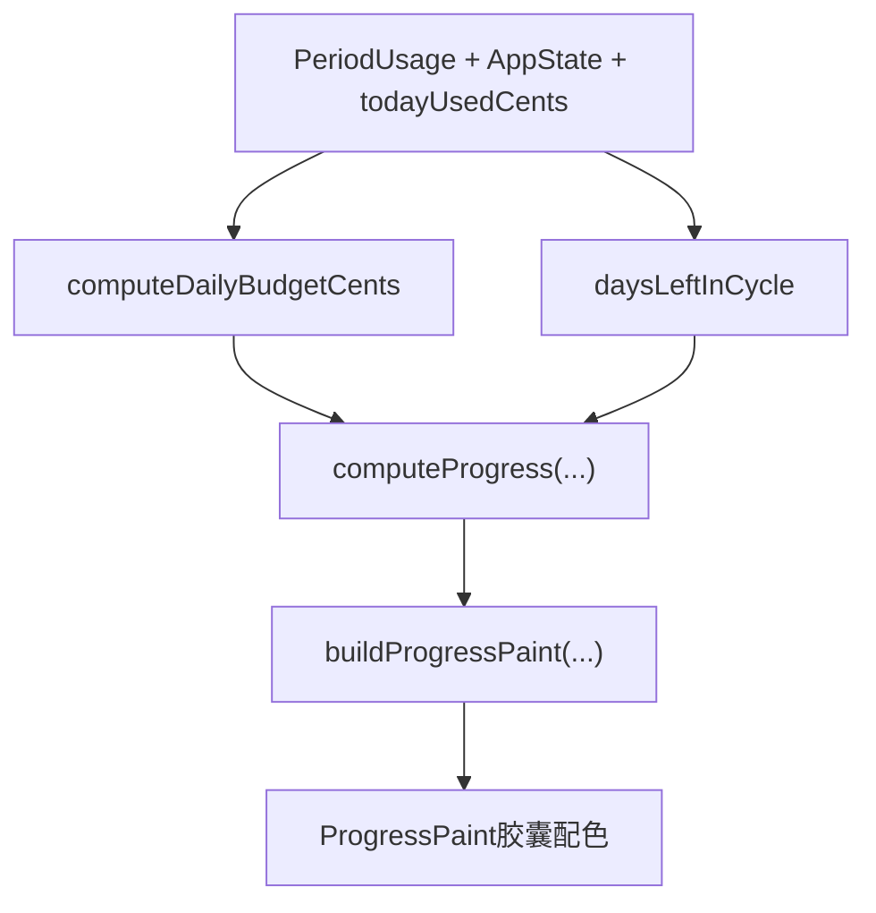
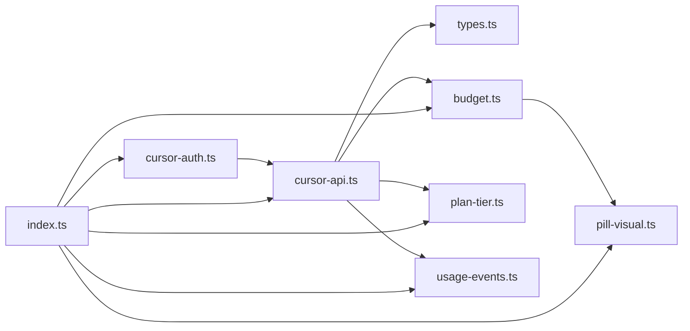

# Cursor API 集成

<cite>
**本文引用的文件**
- [cursor-api.ts](file://packages/core/src/cursor-api.ts)
- [cursor-auth.ts](file://packages/core/src/cursor-auth.ts)
- [types.ts](file://packages/core/src/types.ts)
- [budget.ts](file://packages/core/src/budget.ts)
- [pill-visual.ts](file://packages/core/src/pill-visual.ts)
- [plan-tier.ts](file://packages/core/src/plan-tier.ts)
- [store.ts](file://packages/core/src/store.ts)
- [index.ts](file://packages/core/src/index.ts)
- [usage-events.ts](file://packages/core/src/usage-events.ts)
- [README.md](file://README.md)
</cite>

## 目录
1. [简介](#简介)
2. [项目结构](#项目结构)
3. [核心组件](#核心组件)
4. [架构总览](#架构总览)
5. [详细组件分析](#详细组件分析)
6. [依赖分析](#依赖分析)
7. [性能考虑](#性能考虑)
8. [故障排查指南](#故障排查指南)
9. [结论](#结论)
10. [附录](#附录)

## 简介
本文件面向 Cursor API 集成的开发者与使用者，系统性梳理与 Cursor 官方 API 的交互方式，涵盖认证授权机制（Bearer Token、会话 Cookie 构造）、使用统计查询接口（当前周期用量与计划信息）、REST API 兜底机制、请求头规范、响应数据映射关系、错误处理策略与重试机制，并提供最佳实践与使用示例路径。

## 项目结构
核心实现位于 packages/core/src 目录，围绕“认证—查询—映射—可视化”的流程组织模块：
- 认证与授权：cursor-auth.ts 提供从本地 Cursor 登录态读取令牌、刷新与校验逻辑
- API 查询：cursor-api.ts 封装 Connect 协议与 REST 兜底接口
- 类型定义：types.ts 统一数据结构
- 预算与可视化：budget.ts、pill-visual.ts、plan-tier.ts 提供周期预算、进度计算与档位展示
- 应用状态持久化：store.ts 提供 app-state.json 的读写
- 使用事件：usage-events.ts 提供使用事件查询（与 Cookie 会话配合）

**图表来源**
- [cursor-auth.ts:101-162](file://packages/core/src/cursor-auth.ts#L101-L162)
- [cursor-api.ts:24-251](file://packages/core/src/cursor-api.ts#L24-L251)
- [types.ts:1-140](file://packages/core/src/types.ts#L1-L140)
- [budget.ts:243-274](file://packages/core/src/budget.ts#L243-L274)
- [pill-visual.ts:29-79](file://packages/core/src/pill-visual.ts#L29-L79)
- [plan-tier.ts:4-27](file://packages/core/src/plan-tier.ts#L4-L27)
- [store.ts:10-55](file://packages/core/src/store.ts#L10-L55)
- [usage-events.ts:123-178](file://packages/core/src/usage-events.ts#L123-L178)

**章节来源**
- [README.md:1-30](file://README.md#L1-L30)
- [index.ts:1-35](file://packages/core/src/index.ts#L1-L35)

## 核心组件
- 认证与授权
  - 从本地 Cursor 登录态数据库读取访问令牌与刷新令牌
  - 校验 JWT 过期时间，必要时通过刷新接口获取新访问令牌
- 使用统计查询
  - Connect 协议接口：当前周期用量、计划信息
  - REST 兜底接口：网页端使用摘要与当前周期用量
- 数据映射与可视化
  - 将原始响应映射为统一的 PeriodUsage/PlanInfo 结构
  - 计算周期预算、今日用量、胶囊配色与档位展示

**章节来源**
- [cursor-auth.ts:101-162](file://packages/core/src/cursor-auth.ts#L101-L162)
- [cursor-api.ts:24-251](file://packages/core/src/cursor-api.ts#L24-L251)
- [types.ts:7-31](file://packages/core/src/types.ts#L7-L31)

## 架构总览
整体调用链路如下：应用通过 cursor-auth.ts 获取有效访问令牌，随后调用 cursor-api.ts 的 Connect/REST 接口获取周期用量与计划信息，再经由 budget.ts、pill-visual.ts、plan-tier.ts 进行预算与可视化处理。

**图表来源**
- [cursor-auth.ts:155-162](file://packages/core/src/cursor-auth.ts#L155-L162)
- [cursor-api.ts:173-217](file://packages/core/src/cursor-api.ts#L173-L217)
- [cursor-api.ts:228-250](file://packages/core/src/cursor-api.ts#L228-L250)
- [cursor-api.ts:153-171](file://packages/core/src/cursor-api.ts#L153-L171)

## 详细组件分析

### 认证与授权（Bearer Token 与会话 Cookie）
- 本地读取
  - 从 Cursor Windows 登录态数据库读取 accessToken、refreshToken、email
  - 读取失败或缺少关键字段则返回空
- 令牌校验
  - 解析 JWT payload 的 exp 字段，支持容差秒数
- 令牌刷新
  - 使用刷新令牌向 https://api2.cursor.sh/oauth/token 发起刷新请求
  - 返回新 access_token 或标记需要登出
- 会话 Cookie 构造
  - 从 JWT payload 的 sub 提取用户 ID，拼接 WorkosCursorSessionToken Cookie
  - 失败时返回空字符串，后续 REST 请求将直接失败

**图表来源**
- [cursor-auth.ts:101-162](file://packages/core/src/cursor-auth.ts#L101-L162)

**章节来源**
- [cursor-auth.ts:101-162](file://packages/core/src/cursor-auth.ts#L101-L162)

### Connect 协议接口（Bearer Token）
- 基础地址：https://api2.cursor.sh
- 公共请求头
  - Authorization: Bearer <access_token>
  - Content-Type: application/json
  - Connect-Protocol-Version: 1
- 接口列表
  - GetCurrentPeriodUsage
    - 方法：POST
    - 路径：/aiserver.v1.DashboardService/GetCurrentPeriodUsage
    - 参数：无
    - 返回：RawPeriod（内部映射为 PeriodUsage）
  - GetPlanInfo
    - 方法：POST
    - 路径：/aiserver.v1.DashboardService/GetPlanInfo
    - 参数：无
    - 返回：RawPlanInfo（内部映射为 PlanInfo）

**图表来源**
- [cursor-api.ts:24-43](file://packages/core/src/cursor-api.ts#L24-L43)

**章节来源**
- [cursor-api.ts:24-43](file://packages/core/src/cursor-api.ts#L24-L43)
- [cursor-api.ts:173-217](file://packages/core/src/cursor-api.ts#L173-L217)
- [cursor-api.ts:228-250](file://packages/core/src/cursor-api.ts#L228-L250)

### REST 兜底接口（会话 Cookie）
- 适用场景
  - Connect 接口不可用时的降级方案
  - 与网页端保持一致的数据来源
- Cookie 会话
  - 通过 sessionCookie(accessToken) 构造 WorkosCursorSessionToken
  - 缺失或解析失败时抛出错误
- 接口列表
  - /api/usage-summary
    - 方法：GET
    - 请求头：Cookie、Origin: https://cursor.com、Accept: application/json
    - 返回：兼容字段的周期用量与计划信息（映射为 PeriodUsage）
  - /api/dashboard/get-current-period-usage
    - 方法：GET
    - 请求头：Cookie、Origin: https://cursor.com、Accept: application/json
    - 返回：RawPeriod（映射为 Partial<PeriodUsage>）

**图表来源**
- [cursor-api.ts:87-150](file://packages/core/src/cursor-api.ts#L87-L150)
- [cursor-api.ts:153-171](file://packages/core/src/cursor-api.ts#L153-L171)

**章节来源**
- [cursor-api.ts:87-150](file://packages/core/src/cursor-api.ts#L87-L150)
- [cursor-api.ts:153-171](file://packages/core/src/cursor-api.ts#L153-L171)

### 数据结构与映射
- 周期用量 PeriodUsage
  - billingCycleStart/End: 时间戳（毫秒）
  - planUsage: 包含 totalSpend、includedSpend、remaining、limit、totalPercentUsed、apiPercentUsed、autoPercentUsed
  - displayMessage、autoBucketModels、membershipType（来自 REST）
- 计划信息 PlanInfo
  - planName、includedAmountCents、price、billingCycleEnd
- 映射规则
  - Connect 响应优先，REST 响应作为补充与兜底
  - 时间字段统一转换为毫秒数值

**图表来源**
- [types.ts:7-31](file://packages/core/src/types.ts#L7-L31)
- [cursor-api.ts:45-84](file://packages/core/src/cursor-api.ts#L45-L84)
- [cursor-api.ts:219-250](file://packages/core/src/cursor-api.ts#L219-L250)

**章节来源**
- [types.ts:7-31](file://packages/core/src/types.ts#L7-L31)
- [cursor-api.ts:63-84](file://packages/core/src/cursor-api.ts#L63-L84)
- [cursor-api.ts:219-250](file://packages/core/src/cursor-api.ts#L219-L250)

### 使用统计查询流程与重试机制
- 主流程
  - 优先调用 Connect GetCurrentPeriodUsage
  - 失败时回退到 REST usage-summary
  - 成功后尝试调用 REST dashboard/get-current-period-usage，合并显示信息与模型分桶
- 错误处理
  - Connect 失败：捕获异常并尝试 REST
  - REST 失败：返回空对象或抛出错误
  - 合并阶段失败：忽略，保证主流程可用
- 重试建议
  - 当前实现未内置指数退避重试，建议上层调用者在业务侧按需添加

**图表来源**
- [cursor-api.ts:173-217](file://packages/core/src/cursor-api.ts#L173-L217)

**章节来源**
- [cursor-api.ts:173-217](file://packages/core/src/cursor-api.ts#L173-L217)

### 使用事件查询（与 Cookie 会话配合）
- 会话构造
  - 使用 sessionCookie(accessToken) 生成 Cookie
- 接口
  - /api/dashboard/get-filtered-usage-events
    - 方法：POST
    - 请求头：Cookie、Origin、Accept、Content-Type
    - 请求体：startDate、endDate、page、pageSize
    - 返回：分页的使用事件列表
- 分页策略
  - 每页固定大小，循环请求直至总数或不足一页

**图表来源**
- [usage-events.ts:123-178](file://packages/core/src/usage-events.ts#L123-L178)

**章节来源**
- [usage-events.ts:123-178](file://packages/core/src/usage-events.ts#L123-L178)

### 可视化与预算计算
- 预算与进度
  - 计算公平日预算、剩余天数、节奏压力等指标
  - 今日用量 ≥ 2× 日预算 时胶囊变为红色
- 档位展示
  - 根据计划名称与限额推导档位（Ultra/Pro+/Pro/Teams 等）

**图表来源**
- [budget.ts:243-274](file://packages/core/src/budget.ts#L243-L274)
- [pill-visual.ts:29-79](file://packages/core/src/pill-visual.ts#L29-L79)
- [plan-tier.ts:4-27](file://packages/core/src/plan-tier.ts#L4-L27)

**章节来源**
- [budget.ts:243-274](file://packages/core/src/budget.ts#L243-L274)
- [pill-visual.ts:29-79](file://packages/core/src/pill-visual.ts#L29-L79)
- [plan-tier.ts:4-27](file://packages/core/src/plan-tier.ts#L4-L27)

## 依赖分析
- 模块耦合
  - cursor-api.ts 依赖 types.ts 的数据结构
  - budget.ts、pill-visual.ts、plan-tier.ts 依赖 types.ts
  - usage-events.ts 依赖 cursor-api.ts 的会话构造函数
  - index.ts 导出上述模块，便于上层统一引入
- 外部依赖
  - Fetch API（浏览器/Node 环境）
  - sql.js（用于读取本地 Cursor 登录态数据库）

**图表来源**
- [index.ts:1-35](file://packages/core/src/index.ts#L1-L35)
- [cursor-api.ts:1-2](file://packages/core/src/cursor-api.ts#L1-L2)
- [budget.ts:1-2](file://packages/core/src/budget.ts#L1-L2)
- [pill-visual.ts:10-11](file://packages/core/src/pill-visual.ts#L10-L11)
- [plan-tier.ts:1-2](file://packages/core/src/plan-tier.ts#L1-L2)
- [usage-events.ts:1-1](file://packages/core/src/usage-events.ts#L1-L1)

**章节来源**
- [index.ts:1-35](file://packages/core/src/index.ts#L1-L35)

## 性能考虑
- Connect 协议优先：减少跨域与会话构造开销
- REST 兜底：仅在 Connect 失败时启用，避免不必要的网络往返
- 分页请求：使用固定页大小与终止条件，控制内存占用
- 本地状态：通过 store.ts 持久化 app-state.json，减少重复计算

## 故障排查指南
- 无法构造会话 Cookie
  - 检查 accessToken 是否为合法 JWT，sub 字段是否存在
  - 若解析失败，sessionCookie 返回空，REST 请求将失败
- Connect 接口返回错误
  - 查看错误消息中的状态码与响应片段
  - 确认 Authorization、Content-Type、Connect-Protocol-Version 是否正确设置
- REST 接口返回错误
  - 确认 Cookie 是否有效且来自同一会话
  - 检查 Origin 与 Accept 头
- 令牌过期
  - 使用 isJwtExpired 校验，必要时调用 refreshAccessToken 获取新令牌
- 数据不一致
  - Connect 与 REST 的数据来源不同，以 Connect 为主，REST 仅作补充

**章节来源**
- [cursor-api.ts:11-22](file://packages/core/src/cursor-api.ts#L11-L22)
- [cursor-api.ts:38-42](file://packages/core/src/cursor-api.ts#L38-L42)
- [cursor-auth.ts:143-162](file://packages/core/src/cursor-auth.ts#L143-L162)

## 结论
本集成方案以 Connect 协议为核心，结合 REST 兜底与本地会话 Cookie，确保在多种环境下稳定获取 Cursor 的周期用量与计划信息。通过统一的数据结构与可视化模块，实现从数据到界面的一致体验。建议在生产环境中为 Connect 失败场景增加重试与告警策略，并持续监控 REST 接口的稳定性。

## 附录

### API 版本与请求头规范
- Connect-Protocol-Version: 1
- Content-Type: application/json
- Authorization: Bearer <access_token>
- Origin: https://cursor.com（REST 接口）

**章节来源**
- [cursor-api.ts:31-35](file://packages/core/src/cursor-api.ts#L31-L35)

### 使用示例与最佳实践
- 获取有效访问令牌
  - 使用 getValidAccessToken 从本地 Cursor 读取并自动刷新
- 查询当前周期用量
  - 调用 fetchCurrentPeriodUsage，优先 Connect，失败回退 REST
- 查询计划信息
  - 调用 fetchPlanInfo，Connect 失败时返回默认值
- 查询使用事件
  - 使用 fetchUsageEventsInRange，按日期范围分页拉取
- 最佳实践
  - 在应用启动时先获取令牌，再进行数据查询
  - 对 Connect 失败进行日志记录与告警
  - 合理设置缓存与刷新频率，避免频繁请求

**章节来源**
- [cursor-auth.ts:155-162](file://packages/core/src/cursor-auth.ts#L155-L162)
- [cursor-api.ts:173-217](file://packages/core/src/cursor-api.ts#L173-L217)
- [cursor-api.ts:228-250](file://packages/core/src/cursor-api.ts#L228-L250)
- [usage-events.ts:166-178](file://packages/core/src/usage-events.ts#L166-L178)