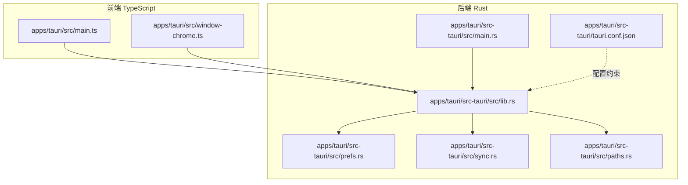
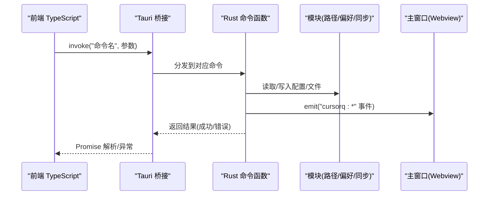
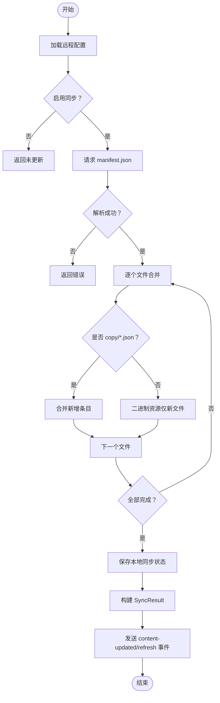
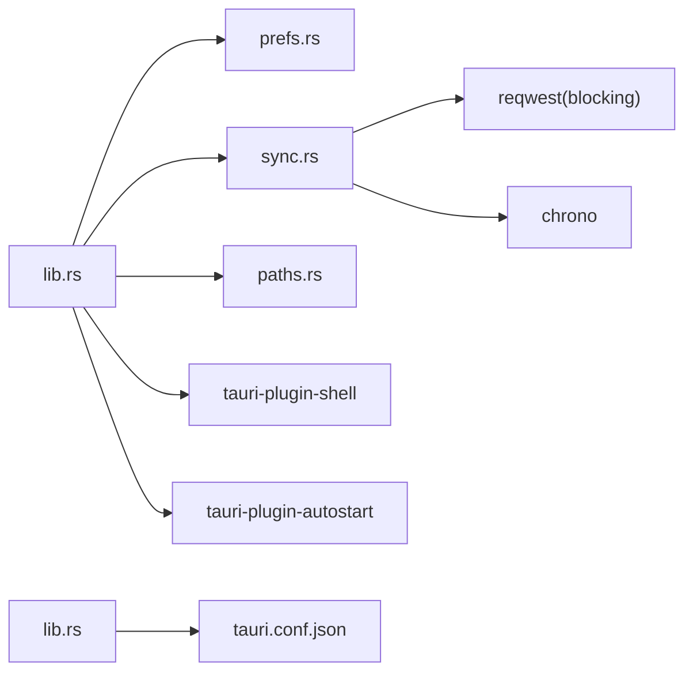

# Tauri 命令接口

<cite>
**本文引用的文件**
- [apps/tauri/src-tauri/src/lib.rs](file://apps/tauri/src-tauri/src/lib.rs)
- [apps/tauri/src-tauri/src/prefs.rs](file://apps/tauri/src-tauri/src/prefs.rs)
- [apps/tauri/src-tauri/src/sync.rs](file://apps/tauri/src-tauri/src/sync.rs)
- [apps/tauri/src-tauri/src/paths.rs](file://apps/tauri/src-tauri/src/paths.rs)
- [apps/tauri/src-tauri/src/main.rs](file://apps/tauri/src-tauri/src/main.rs)
- [apps/tauri/src-tauri/Cargo.toml](file://apps/tauri/src-tauri/Cargo.toml)
- [apps/tauri/src-tauri/tauri.conf.json](file://apps/tauri/src-tauri/tauri.conf.json)
- [apps/tauri/src/main.ts](file://apps/tauri/src/main.ts)
- [apps/tauri/src/window-chrome.ts](file://apps/tauri/src/window-chrome.ts)
</cite>

## 目录
1. [简介](#简介)
2. [项目结构](#项目结构)
3. [核心组件](#核心组件)
4. [架构总览](#架构总览)
5. [详细组件分析](#详细组件分析)
6. [依赖关系分析](#依赖关系分析)
7. [性能考量](#性能考量)
8. [故障排查指南](#故障排查指南)
9. [结论](#结论)
10. [附录](#附录)

## 简介
本文件为 CursorQ 桌面应用的 Tauri 命令接口完整 API 文档，聚焦 Rust 后端与 TypeScript 前端之间的命令通信机制。文档覆盖命令定义规范、参数校验规则、返回值格式约定，并按功能域划分为：系统集成命令（文件系统访问、路径管理、配置读写）、应用管理命令（偏好设置、启动参数、运行时配置）、资源同步命令（内容更新、资源加载）。同时提供每个命令的调用示例、错误码说明、性能与安全注意事项。

## 项目结构
- 后端（Rust）
  - 命令注册与实现位于 [apps/tauri/src-tauri/src/lib.rs](file://apps/tauri/src-tauri/src/lib.rs)，通过 tauri::Builder 的 invoke_handler 注册。
  - 偏好设置与启动项逻辑位于 [apps/tauri/src-tauri/src/prefs.rs](file://apps/tauri/src-tauri/src/prefs.rs)。
  - 资源同步与远程配置位于 [apps/tauri/src-tauri/src/sync.rs](file://apps/tauri/src-tauri/src/sync.rs)。
  - 路径解析与目录布局位于 [apps/tauri/src-tauri/src/paths.rs](file://apps/tauri/src-tauri/src/paths.rs)。
  - 应用入口与插件初始化位于 [apps/tauri/src-tauri/src/main.rs](file://apps/tauri/src-tauri/src/main.rs)。
  - 构建与依赖声明位于 [apps/tauri/src-tauri/Cargo.toml](file://apps/tauri/src-tauri/Cargo.toml)。
  - 安全策略与窗口配置位于 [apps/tauri/src-tauri/tauri.conf.json](file://apps/tauri/src-tauri/tauri.conf.json)。
- 前端（TypeScript）
  - 主入口与命令调用示例位于 [apps/tauri/src/main.ts](file://apps/tauri/src/main.ts)。
  - 窗口外观与形状同步调用位于 [apps/tauri/src/window-chrome.ts](file://apps/tauri/src/window-chrome.ts)。

图表来源
- [apps/tauri/src-tauri/src/lib.rs:716-736](file://apps/tauri/src-tauri/src/lib.rs#L716-L736)
- [apps/tauri/src-tauri/src/main.rs:1-6](file://apps/tauri/src-tauri/src/main.rs#L1-L6)
- [apps/tauri/src-tauri/tauri.conf.json:31-37](file://apps/tauri/src-tauri/tauri.conf.json#L31-L37)

章节来源
- [apps/tauri/src-tauri/src/lib.rs:716-736](file://apps/tauri/src-tauri/src/lib.rs#L716-L736)
- [apps/tauri/src-tauri/src/main.rs:1-6](file://apps/tauri/src-tauri/src/main.rs#L1-L6)
- [apps/tauri/src-tauri/tauri.conf.json:31-37](file://apps/tauri/src-tauri/tauri.conf.json#L31-L37)

## 核心组件
- 命令注册器
  - 通过 tauri::Builder::invoke_handler 将命令集合注册到前端调用通道。
  - 已注册命令清单见“命令定义与签名”一节。
- 偏好设置模块
  - 提供 always-on-top、开机自启、胶囊可见性等状态读取与切换。
- 资源同步模块
  - 远程配置加载、内容清单拉取、增量合并、本地缓存与版本控制。
- 路径解析模块
  - 统一解析应用根目录、数据目录、日志目录、内容目录、远程配置路径等。
- 前端调用示例
  - 主入口与窗口外观脚本展示了 invoke 的典型用法与事件监听。

章节来源
- [apps/tauri/src-tauri/src/lib.rs:716-736](file://apps/tauri/src-tauri/src/lib.rs#L716-L736)
- [apps/tauri/src-tauri/src/prefs.rs:1-145](file://apps/tauri/src-tauri/src/prefs.rs#L1-L145)
- [apps/tauri/src-tauri/src/sync.rs:12-56](file://apps/tauri/src-tauri/src/sync.rs#L12-L56)
- [apps/tauri/src-tauri/src/paths.rs:1-142](file://apps/tauri/src-tauri/src/paths.rs#L1-L142)
- [apps/tauri/src/main.ts:580-711](file://apps/tauri/src/main.ts#L580-L711)
- [apps/tauri/src/window-chrome.ts:55-99](file://apps/tauri/src/window-chrome.ts#L55-L99)

## 架构总览
命令调用链路从前端发起 invoke，经由 Tauri 桥接到后端命令函数，执行业务逻辑后返回结果或触发前端事件。窗口外观与形状调整、资源同步、偏好设置等均通过该机制完成。

图表来源
- [apps/tauri/src-tauri/src/lib.rs:716-736](file://apps/tauri/src-tauri/src/lib.rs#L716-L736)
- [apps/tauri/src-tauri/src/sync.rs:127-138](file://apps/tauri/src-tauri/src/sync.rs#L127-L138)

## 详细组件分析

### 命令定义与签名
以下命令在后端统一注册并通过 invoke 调用；每个命令包含参数列表、返回值类型、错误处理与安全要点。

- 刷新使用数据
  - 名称: refresh_usage
  - 参数: app: AppHandle, joke_index?: number
  - 返回: Promise<string> 成功返回 JSON 字符串，失败返回错误字符串
  - 错误: spawn 失败、子进程非零退出、IO 错误
  - 安全: 通过后台线程执行，避免阻塞 UI；严格限制环境变量注入
  - 性能: 使用异步运行时与线程池，超时控制
  - 前端示例: [apps/tauri/src/main.ts:580-589](file://apps/tauri/src/main.ts#L580-L589)

- DWM 窗口优化
  - 名称: tune_window_dwm
  - 参数: app: AppHandle
  - 返回: Promise<void> 成功/失败
  - 错误: 平台不支持时返回空成功
  - 安全: 仅在 Windows 生效，其他平台无操作
  - 前端示例: [apps/tauri/src/window-chrome.ts:61-62](file://apps/tauri/src/window-chrome.ts#L61-L62)

- 同步窗口形状
  - 名称: sync_window_shape
  - 参数: app: AppHandle, logical_w: number, logical_h: number, radius: number, capsule_only: boolean
  - 返回: Promise<void> 成功/失败
  - 错误: 平台不支持时返回空成功
  - 安全: 仅在 Windows 生效，其他平台无操作
  - 前端示例: [apps/tauri/src/window-chrome.ts:63-68](file://apps/tauri/src/window-chrome.ts#L63-L68)

- 显示主窗口（非激活）
  - 名称: show_main_inactive
  - 参数: app: AppHandle
  - 返回: Promise<void> 成功/失败
  - 错误: 无显式错误路径
  - 前端示例: [apps/tauri/src/main.ts:681-682](file://apps/tauri/src/main.ts#L681-L682)

- 获取胶囊可见状态
  - 名称: get_capsule_visible
  - 参数: 无
  - 返回: Promise<boolean>
  - 错误: 无
  - 前端示例: [apps/tauri/src/main.ts:678](file://apps/tauri/src/main.ts#L678)

- 设置胶囊可见状态
  - 名称: set_capsule_visible_cmd
  - 参数: app: AppHandle, visible: boolean
  - 返回: Promise<void> 成功/失败
  - 错误: 隐藏失败时记录日志
  - 前端示例: [apps/tauri/src/main.ts:688-689](file://apps/tauri/src/main.ts#L688-L689)

- 开始拖拽胶囊
  - 名称: start_drag_capsule
  - 参数: app: AppHandle
  - 返回: Promise<void> 成功/失败
  - 错误: 拖拽失败回退到原生拖拽
  - 前端示例: [apps/tauri/src/main.ts:584-585](file://apps/tauri/src/main.ts#L584-L585)

- 列出吉祥物 GIF
  - 名称: list_mascot_gifs
  - 参数: 无
  - 返回: Promise<string[]> 文件名数组
  - 错误: 目录不存在返回空数组
  - 安全: 过滤隐藏文件与媒体类型
  - 前端示例: [apps/tauri/src/main.ts:695](file://apps/tauri/src/main.ts#L695)

- 获取占位图路径
  - 名称: mascot_placeholder_path
  - 参数: 无
  - 返回: Promise<string?>
  - 错误: 无
  - 前端示例: [apps/tauri/src/main.ts:695](file://apps/tauri/src/main.ts#L695)

- 获取占位动画路径
  - 名称: mascot_placeholder_anim_path
  - 参数: 无
  - 返回: Promise<string?>
  - 错误: 无
  - 前端示例: [apps/tauri/src/main.ts:695](file://apps/tauri/src/main.ts#L695)

- 获取指定 GIF 路径
  - 名称: mascot_gif_path
  - 参数: name: string
  - 返回: Promise<string> 成功/失败
  - 错误: 非法名称或文件不存在
  - 安全: 防止路径遍历（禁止 .. / \）
  - 前端示例: [apps/tauri/src/main.ts:695](file://apps/tauri/src/main.ts#L695)

- 生成吉祥物资源 data URL
  - 名称: mascot_asset_data_url
  - 参数: asset: string ("placeholder_anim"|"placeholder"| "gif:文件名")
  - 返回: Promise<string> data URL
  - 错误: 资源不存在或非法名称
  - 安全: 防止路径遍历；根据扩展名推断 MIME
  - 前端示例: [apps/tauri/src/main.ts:695](file://apps/tauri/src/main.ts#L695)

- 获取远程配置
  - 名称: get_remote_config
  - 参数: 无
  - 返回: RemoteConfig 对象
  - 错误: 无
  - 结构: enabled: boolean, content_base_url: string, sync_delay_ms: number
  - 前端示例: [apps/tauri/src/main.ts:700-703](file://apps/tauri/src/main.ts#L700-L703)

- 同步远程内容
  - 名称: sync_remote_content
  - 参数: app: AppHandle
  - 返回: SyncResult 对象
  - 错误: HTTP 请求失败、JSON 解析失败、IO 错误
  - 结果事件: 更新时向前端发出 "cursorq:content-updated" 与 "cursorq:refresh"
  - 前端示例: [apps/tauri/src/main.ts:700-703](file://apps/tauri/src/main.ts#L700-L703)

- 获取应用路径
  - 名称: get_app_paths
  - 参数: 无
  - 返回: JSON 对象（root/data/logs/content/copy/mascotGifs/portable）
  - 错误: 无
  - 前端示例: [apps/tauri/src/main.ts:695](file://apps/tauri/src/main.ts#L695)

章节来源
- [apps/tauri/src-tauri/src/lib.rs:31-151](file://apps/tauri/src-tauri/src/lib.rs#L31-L151)
- [apps/tauri/src-tauri/src/lib.rs:127-138](file://apps/tauri/src-tauri/src/lib.rs#L127-L138)
- [apps/tauri/src-tauri/src/lib.rs:140-151](file://apps/tauri/src-tauri/src/lib.rs#L140-L151)
- [apps/tauri/src-tauri/src/lib.rs:411-426](file://apps/tauri/src-tauri/src/lib.rs#L411-L426)
- [apps/tauri/src-tauri/src/lib.rs:428-449](file://apps/tauri/src-tauri/src/lib.rs#L428-L449)
- [apps/tauri/src-tauri/src/lib.rs:459-468](file://apps/tauri/src-tauri/src/lib.rs#L459-L468)
- [apps/tauri/src-tauri/src/lib.rs:470-494](file://apps/tauri/src-tauri/src/lib.rs#L470-L494)
- [apps/tauri/src-tauri/src/lib.rs:617-639](file://apps/tauri/src-tauri/src/lib.rs#L617-L639)

### 数据模型与返回值约定
- RemoteConfig
  - enabled: boolean
  - content_base_url: string
  - sync_delay_ms: number
- SyncResult
  - ok: boolean
  - updated: boolean
  - files: string[]
  - message: string

章节来源
- [apps/tauri/src-tauri/src/sync.rs:12-56](file://apps/tauri/src-tauri/src/sync.rs#L12-L56)

### 参数验证与安全
- 路径遍历防护
  - 在 mascot_gif_path 与 mascot_asset_data_url 中，对输入名称进行过滤，拒绝包含 ".."、"/"、"\" 的非法字符。
- MIME 类型推断
  - 根据文件扩展名选择 image/* 或 application/octet-stream，避免错误的资源解释。
- 平台条件执行
  - 窗口形状与 DWM 相关命令仅在 Windows 生效，其他平台无操作。
- 日志与错误传播
  - 所有命令错误均以字符串形式返回，便于前端统一处理。

章节来源
- [apps/tauri/src-tauri/src/lib.rs:62-72](file://apps/tauri/src-tauri/src/lib.rs#L62-L72)
- [apps/tauri/src-tauri/src/lib.rs:100-120](file://apps/tauri/src-tauri/src/lib.rs#L100-L120)
- [apps/tauri/src-tauri/src/lib.rs:411-426](file://apps/tauri/src-tauri/src/lib.rs#L411-L426)
- [apps/tauri/src-tauri/src/lib.rs:428-449](file://apps/tauri/src-tauri/src/lib.rs#L428-L449)

### 资源同步流程

图表来源
- [apps/tauri/src-tauri/src/sync.rs:261-367](file://apps/tauri/src-tauri/src/sync.rs#L261-L367)
- [apps/tauri/src-tauri/src/lib.rs:127-138](file://apps/tauri/src-tauri/src/lib.rs#L127-L138)

## 依赖关系分析
- 插件与能力
  - tauri-plugin-shell: 提供 shell 命令能力（用于 refresh_usage 调用外部脚本）。
  - tauri-plugin-autostart: 管理开机自启动。
- 外部库
  - reqwest(blocking): HTTP 客户端，用于远程内容同步。
  - chrono: 时间戳序列化。
  - which/base64: 可执行文件查找与资源编码。
- 安全策略
  - asset 协议启用，范围可配置；窗口透明、无装饰、不可聚焦，降低攻击面。

图表来源
- [apps/tauri/src-tauri/src/lib.rs:16-21](file://apps/tauri/src-tauri/src/lib.rs#L16-L21)
- [apps/tauri/src-tauri/Cargo.toml:15-24](file://apps/tauri/src-tauri/Cargo.toml#L15-L24)
- [apps/tauri/src-tauri/tauri.conf.json:31-37](file://apps/tauri/src-tauri/tauri.conf.json#L31-L37)

章节来源
- [apps/tauri/src-tauri/Cargo.toml:15-24](file://apps/tauri/src-tauri/Cargo.toml#L15-L24)
- [apps/tauri/src-tauri/tauri.conf.json:31-37](file://apps/tauri/src-tauri/tauri.conf.json#L31-L37)

## 性能考量
- 异步执行
  - refresh_usage 使用异步运行时与线程池，避免阻塞主线程。
- 窗口外观修复
  - 稳定化流程采用多次重试与 RAF 间隔，确保跨平台一致性。
- 资源同步
  - 仅在文件缺失时下载二进制资源，copy/*.json 采用去重合并策略，减少 IO 与网络开销。
- 窗口属性
  - 透明、无阴影、不可聚焦，降低渲染与输入处理成本。

章节来源
- [apps/tauri/src-tauri/src/lib.rs:617-639](file://apps/tauri/src-tauri/src/lib.rs#L617-L639)
- [apps/tauri/src/window-chrome.ts:55-99](file://apps/tauri/src/window-chrome.ts#L55-L99)
- [apps/tauri/src-tauri/src/sync.rs:167-187](file://apps/tauri/src-tauri/src/sync.rs#L167-L187)

## 故障排查指南
- 常见错误与定位
  - 资源不存在: mascot_gif_path 与 mascot_asset_data_url 在文件不存在时返回错误信息，检查 content/mascot/gifs 下文件名与扩展名。
  - 路径遍历: 输入名称包含非法字符将被拒绝，确保仅传入纯文件名。
  - 同步失败: sync_remote_content 返回错误消息，检查 content_base_url 是否正确、网络连通性与 manifest.json 格式。
  - 脚本执行: refresh_usage spawn 失败或非零退出，检查 scripts/refresh-usage.mjs 存在性与 Node 环境。
- 日志位置
  - 日志文件位于 data/logs/cursorq.log，便于追踪错误堆栈与状态变更。
- 事件监听
  - 前端通过 listen("cursorq:content-updated"/"cursorq:refresh"/"cursorq:fix-chrome") 响应后端事件。

章节来源
- [apps/tauri/src-tauri/src/lib.rs:62-72](file://apps/tauri/src-tauri/src/lib.rs#L62-L72)
- [apps/tauri/src-tauri/src/lib.rs:100-120](file://apps/tauri/src-tauri/src/lib.rs#L100-L120)
- [apps/tauri/src-tauri/src/sync.rs:261-367](file://apps/tauri/src-tauri/src/sync.rs#L261-L367)
- [apps/tauri/src-tauri/src/log_util.rs:1-16](file://apps/tauri/src-tauri/src/log_util.rs#L1-L16)
- [apps/tauri/src/main.ts:700-709](file://apps/tauri/src/main.ts#L700-L709)

## 结论
本命令接口以清晰的职责划分与严格的参数校验保障了跨语言通信的稳定性与安全性。通过事件驱动与异步执行，实现了流畅的用户体验与可靠的后台任务处理。建议在生产环境中持续监控日志与网络状态，确保资源同步与窗口外观修复的可靠性。

## 附录

### 命令调用示例（路径引用）
- 刷新使用数据
  - [apps/tauri/src/main.ts:580-589](file://apps/tauri/src/main.ts#L580-L589)
- 窗口外观与形状
  - [apps/tauri/src/window-chrome.ts:61-72](file://apps/tauri/src/window-chrome.ts#L61-L72)
- 显示/隐藏胶囊
  - [apps/tauri/src/main.ts:678-693](file://apps/tauri/src/main.ts#L678-L693)
- 拖拽胶囊
  - [apps/tauri/src/main.ts:584-589](file://apps/tauri/src/main.ts#L584-L589)
- 吉祥物资源
  - [apps/tauri/src/main.ts:695](file://apps/tauri/src/main.ts#L695)