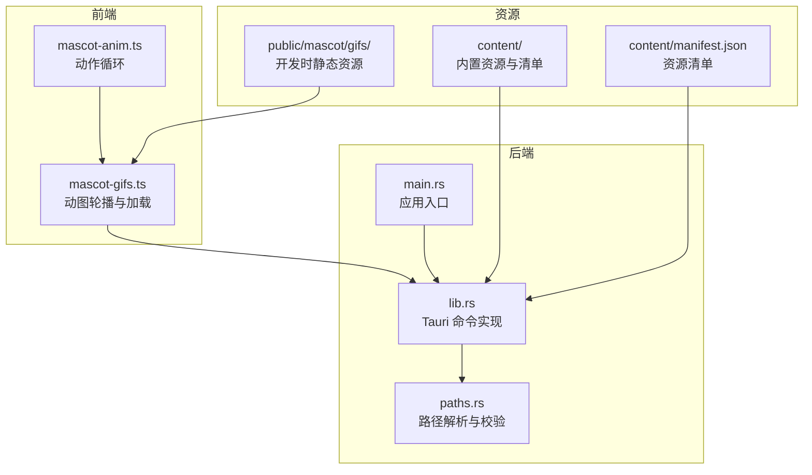
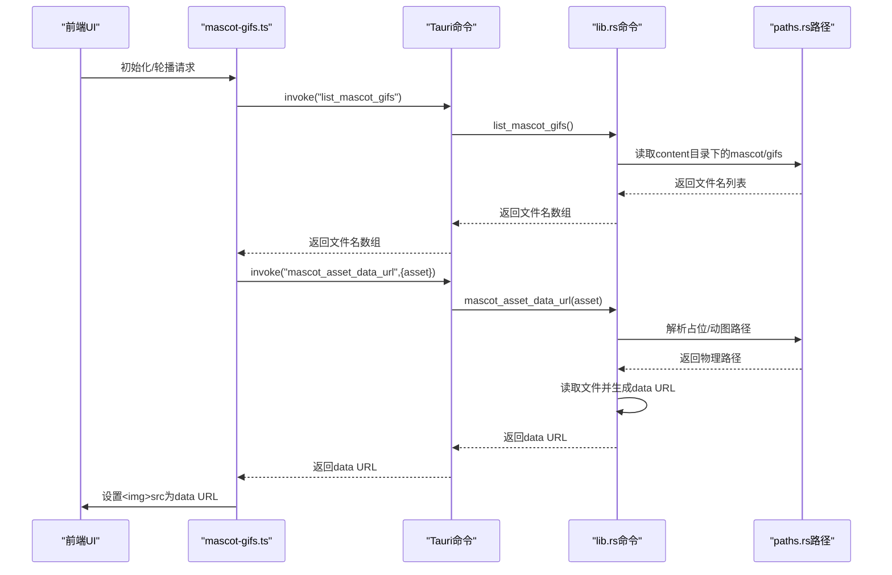
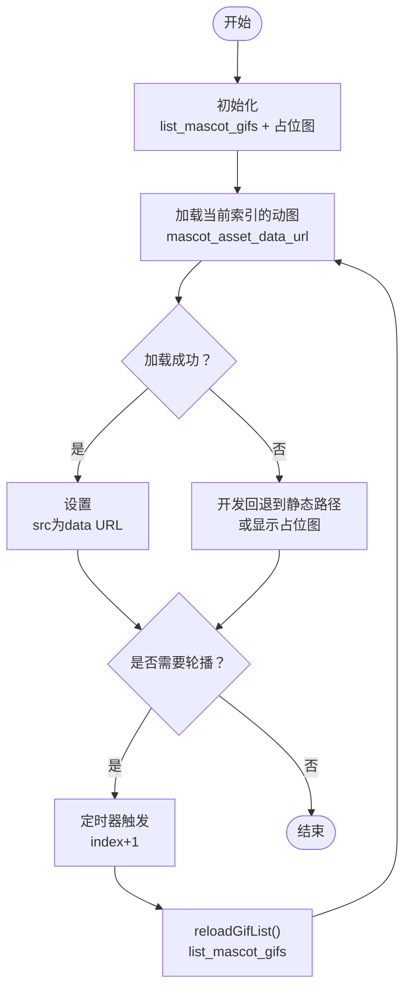
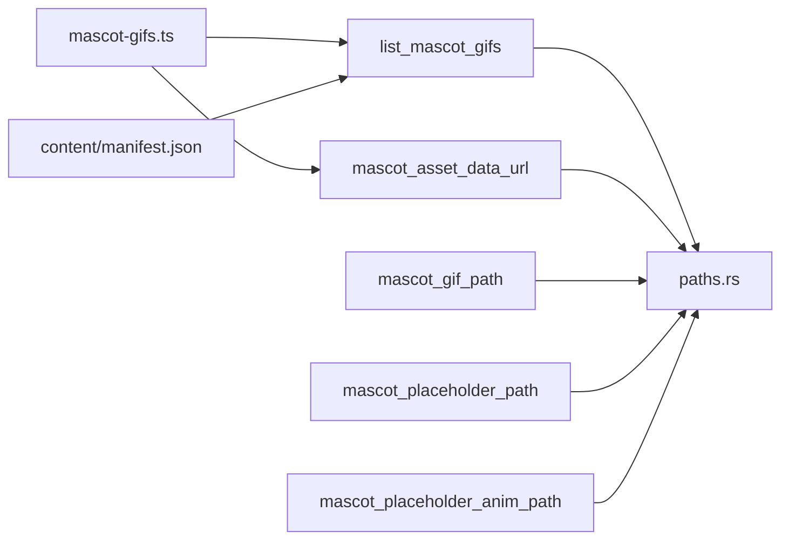

# 动物角色命令

<cite>
**本文引用的文件**
- [mascot-gifs.ts](file://apps/tauri/src/mascot-gifs.ts)
- [mascot-anim.ts](file://apps/tauri/src/mascot-anim.ts)
- [lib.rs](file://apps/tauri/src-tauri/src/lib.rs)
- [paths.rs](file://apps/tauri/src-tauri/src/paths.rs)
- [README.txt](file://apps/tauri/public/mascot/gifs/README.txt)
- [manifest.json](file://content/manifest.json)
- [main.rs](file://apps/tauri/src-tauri/src/main.rs)
</cite>

## 目录
1. [简介](#简介)
2. [项目结构](#项目结构)
3. [核心组件](#核心组件)
4. [架构总览](#架构总览)
5. [详细组件分析](#详细组件分析)
6. [依赖关系分析](#依赖关系分析)
7. [性能考虑](#性能考虑)
8. [故障排除指南](#故障排除指南)
9. [结论](#结论)
10. [附录](#附录)

## 简介
本文件为“动物角色命令”的完整 API 文档，聚焦于动物角色资源管理相关的 Tauri 命令与前端加载机制，包括：
- list_mascot_gifs：列出可播放的动图资源
- mascot_placeholder_path：返回占位静态图路径
- mascot_placeholder_anim_path：返回占位动画路径
- mascot_gif_path：根据名称解析动图物理路径
- mascot_asset_data_url：生成资源的 data URL，供前端直接加载

文档覆盖资源加载流程、数据 URL 生成、文件校验规则、资源缓存策略、调用示例、格式支持、性能优化与错误处理，并解释系统架构与扩展机制。

## 项目结构
动物角色系统由前端 TypeScript 模块与 Rust 后端命令共同组成，资源位于 content 与 public 目录中，清单文件用于声明内置资源。

**图表来源**
- [mascot-gifs.ts:1-164](file://apps/tauri/src/mascot-gifs.ts#L1-L164)
- [mascot-anim.ts:1-29](file://apps/tauri/src/mascot-anim.ts#L1-L29)
- [lib.rs:31-130](file://apps/tauri/src-tauri/src/lib.rs#L31-L130)
- [paths.rs:1-142](file://apps/tauri/src-tauri/src/paths.rs#L1-L142)
- [README.txt:1-10](file://apps/tauri/public/mascot/gifs/README.txt#L1-L10)
- [manifest.json:1-11](file://content/manifest.json#L1-L11)
- [main.rs:1-6](file://apps/tauri/src-tauri/src/main.rs#L1-L6)

**章节来源**
- [mascot-gifs.ts:1-164](file://apps/tauri/src/mascot-gifs.ts#L1-L164)
- [mascot-anim.ts:1-29](file://apps/tauri/src/mascot-anim.ts#L1-L29)
- [lib.rs:31-130](file://apps/tauri/src-tauri/src/lib.rs#L31-L130)
- [paths.rs:1-142](file://apps/tauri/src-tauri/src/paths.rs#L1-L142)
- [README.txt:1-10](file://apps/tauri/public/mascot/gifs/README.txt#L1-L10)
- [manifest.json:1-11](file://content/manifest.json#L1-L11)
- [main.rs:1-6](file://apps/tauri/src-tauri/src/main.rs#L1-L6)

## 核心组件
- 前端动图模块（mascot-gifs.ts）
  - 负责轮播、占位图展示、资源加载与错误回退
  - 通过 Tauri invoke 调用后端命令，生成 data URL 并设置到  元素
- 前端动作模块（mascot-anim.ts）
  - 提供背景图序列帧动画，循环播放多组动作
- 后端命令（lib.rs）
  - 实现 list_mascot_gifs、mascot_placeholder_path、mascot_placeholder_anim_path、mascot_gif_path、mascot_asset_data_url
  - 负责文件存在性校验、路径拼接与 MIME 类型推断
- 路径解析（paths.rs）
  - 解析应用根目录、content 目录、mascot 资源目录与占位资源
- 资源与清单
  - public/mascot/gifs：开发时静态资源目录
  - content/manifest.json：内置资源清单，声明默认占位图与示例动图

**章节来源**
- [mascot-gifs.ts:1-164](file://apps/tauri/src/mascot-gifs.ts#L1-L164)
- [mascot-anim.ts:1-29](file://apps/tauri/src/mascot-anim.ts#L1-L29)
- [lib.rs:31-130](file://apps/tauri/src-tauri/src/lib.rs#L31-L130)
- [paths.rs:1-142](file://apps/tauri/src-tauri/src/paths.rs#L1-L142)
- [README.txt:1-10](file://apps/tauri/public/mascot/gifs/README.txt#L1-L10)
- [manifest.json:1-11](file://content/manifest.json#L1-L11)

## 架构总览
前端通过 Tauri invoke 调用后端命令，后端在安全沙箱内执行文件系统操作，返回路径或 data URL。前端使用 data URL 避免 asset:// 在部分环境中的兼容性问题。

**图表来源**
- [mascot-gifs.ts:86-92](file://apps/tauri/src/mascot-gifs.ts#L86-L92)
- [mascot-gifs.ts:42-49](file://apps/tauri/src/mascot-gifs.ts#L42-L49)
- [lib.rs:31-49](file://apps/tauri/src-tauri/src/lib.rs#L31-L49)
- [lib.rs:100-120](file://apps/tauri/src-tauri/src/lib.rs#L100-L120)
- [paths.rs:96-123](file://apps/tauri/src-tauri/src/paths.rs#L96-L123)

## 详细组件分析

### 命令定义与职责
- list_mascot_gifs
  - 功能：扫描 mascot/gifs 目录，返回按字母排序的文件名列表
  - 安全：仅在 content 目录下进行，不暴露系统路径
  - 错误：异常时返回空数组
- mascot_placeholder_path
  - 功能：返回默认静态占位图路径（优先 default.png，其次 default.svg）
  - 安全：返回 content 目录内的相对路径
- mascot_placeholder_anim_path
  - 功能：返回默认动画占位图路径（animation.gif）
  - 安全：返回 content 目录内的相对路径
- mascot_gif_path(name)
  - 功能：根据名称返回动图物理路径
  - 校验：禁止包含路径分隔符与父目录引用
  - 结果：文件存在则返回绝对路径，否则报错
- mascot_asset_data_url(asset)
  - 功能：根据资产标识生成 data URL
  - 支持标识：
    - "placeholder"：默认静态占位图
    - "placeholder_anim"：默认动画占位图
    - "gif:name"：指定动图文件
  - 校验：对 "gif:" 前缀的名称同样进行路径注入防护
  - MIME：根据扩展名自动推断 image/gif、image/png、image/webp、image/jpeg
  - 失败：抛出错误或在开发模式下回退到静态路径

**章节来源**
- [lib.rs:31-49](file://apps/tauri/src-tauri/src/lib.rs#L31-L49)
- [lib.rs:51-59](file://apps/tauri/src-tauri/src/lib.rs#L51-L59)
- [lib.rs:56-59](file://apps/tauri/src-tauri/src/lib.rs#L56-L59)
- [lib.rs:61-72](file://apps/tauri/src-tauri/src/lib.rs#L61-L72)
- [lib.rs:98-120](file://apps/tauri/src-tauri/src/lib.rs#L98-L120)
- [paths.rs:96-123](file://apps/tauri/src-tauri/src/paths.rs#L96-L123)

### 资源加载与缓存策略
- 前端加载流程
  - 初始化：调用 list_mascot_gifs 获取文件名列表；调用 mascot_asset_data_url 获取占位图 data URL；设置  src
  - 轮播：启动定时器，每 20 分钟切换一次；每次切换前重新调用 list_mascot_gifs，确保内容更新后能及时生效
  - 缓存与复用：若目标 src 与当前一致，则跳过重复加载
  - 开发回退：开发环境下若 invoke 失败，回退到 public/mascot/gifs 下的静态路径
- 后端 data URL 生成
  - 读取文件二进制内容，按 MIME 类型编码为 base64 data URL
  - 避免跨域与 asset:// 兼容性问题，直接以 data URL 注入 DOM
- 资源清单与内置内容
  - content/manifest.json 声明默认占位图与示例动图，确保离线可用
  - public/mascot/gifs/README.txt 描述开发时放置动图的规范与轮播行为

**图表来源**
- [mascot-gifs.ts:121-125](file://apps/tauri/src/mascot-gifs.ts#L121-L125)
- [mascot-gifs.ts:101-111](file://apps/tauri/src/mascot-gifs.ts#L101-L111)
- [mascot-gifs.ts:86-92](file://apps/tauri/src/mascot-gifs.ts#L86-L92)
- [mascot-gifs.ts:42-49](file://apps/tauri/src/mascot-gifs.ts#L42-L49)

**章节来源**
- [mascot-gifs.ts:1-164](file://apps/tauri/src/mascot-gifs.ts#L1-L164)
- [README.txt:1-10](file://apps/tauri/public/mascot/gifs/README.txt#L1-L10)
- [manifest.json:1-11](file://content/manifest.json#L1-L11)

### 数据 URL 生成与 MIME 推断
- MIME 映射
  - .gif → image/gif
  - .png → image/png
  - .webp → image/webp
  - .jpg/.jpeg → image/jpeg
  - 其他 → application/octet-stream
- 编码方式：Base64
- 生成位置：后端命令内部完成文件读取与编码

**章节来源**
- [lib.rs:74-96](file://apps/tauri/src-tauri/src/lib.rs#L74-L96)

### 文件验证规则
- 路径注入防护
  - 对所有外部输入（如 "gif:name"）进行字符过滤，禁止包含 ".."、"/"、"\\" 等危险字符
- 存在性检查
  - 仅当文件为真实存在的常规文件时才返回路径或 data URL
- 目录范围限制
  - 所有资源限定在 content/mascot 与 content/mascot/gifs 目录内

**章节来源**
- [lib.rs:61-72](file://apps/tauri/src-tauri/src/lib.rs#L61-L72)
- [lib.rs:104-115](file://apps/tauri/src-tauri/src/lib.rs#L104-L115)
- [paths.rs:96-98](file://apps/tauri/src-tauri/src/paths.rs#L96-L98)

### 资源格式支持
- 动图格式：.gif、.webp、.png
- 静态占位图：.png、.svg（优先 png）
- 轮播规则：按文件名字母序轮播；启动后 1 分钟开始轮播，每 20 分钟切换一次

**章节来源**
- [README.txt:1-10](file://apps/tauri/public/mascot/gifs/README.txt#L1-L10)
- [manifest.json:6-10](file://content/manifest.json#L6-L10)

### 命令调用示例
以下为常见调用场景（以伪代码形式描述参数与预期结果）：
- 列出动图
  - 输入：无
  - 输出：字符串数组（文件名列表，按字母排序）
  - 异常：调用失败时返回空数组
- 获取占位图路径
  - 输入：无
  - 输出：字符串（占位图绝对路径，若不存在则返回空值）
- 获取占位动画路径
  - 输入：无
  - 输出：字符串（动画文件绝对路径，若不存在则返回空值）
- 获取指定动图路径
  - 输入：name（文件名）
  - 输出：字符串（绝对路径）
  - 异常：name 包含非法字符或文件不存在时抛出错误
- 生成资源 data URL
  - 输入：asset（"placeholder"、"placeholder_anim" 或 "gif:name"）
  - 输出：字符串（data URL）
  - 异常：资源不存在或生成失败时抛出错误；开发模式下可回退到静态路径

**章节来源**
- [mascot-gifs.ts:86-92](file://apps/tauri/src/mascot-gifs.ts#L86-L92)
- [mascot-gifs.ts:42-49](file://apps/tauri/src/mascot-gifs.ts#L42-L49)
- [lib.rs:51-59](file://apps/tauri/src-tauri/src/lib.rs#L51-L59)
- [lib.rs:56-59](file://apps/tauri/src-tauri/src/lib.rs#L56-L59)
- [lib.rs:61-72](file://apps/tauri/src-tauri/src/lib.rs#L61-L72)
- [lib.rs:100-120](file://apps/tauri/src-tauri/src/lib.rs#L100-L120)

### 错误处理方案
- 前端
  - invoke 失败时：开发模式回退到静态路径；生产模式抛出错误
  - 图片加载失败：回退到占位图
  - 轮播期间：捕获异常并保持 UI 稳定
- 后端
  - 文件读取失败：返回错误信息
  - 名称非法或文件不存在：返回错误信息
  - 调用失败：前端捕获并按策略回退

**章节来源**
- [mascot-gifs.ts:42-49](file://apps/tauri/src/mascot-gifs.ts#L42-L49)
- [mascot-gifs.ts:51-59](file://apps/tauri/src/mascot-gifs.ts#L51-L59)
- [mascot-gifs.ts:71-84](file://apps/tauri/src/mascot-gifs.ts#L71-L84)
- [lib.rs:61-72](file://apps/tauri/src-tauri/src/lib.rs#L61-L72)
- [lib.rs:100-120](file://apps/tauri/src-tauri/src/lib.rs#L100-L120)

### 性能优化建议
- 减少不必要的重载
  - 若目标 src 与当前一致，避免重复设置
- 控制轮播频率
  - 当前轮播间隔较长（20 分钟），适合静态展示；如需更频繁切换，可在前端调整常量
- 预热与延迟启动
  - 启动后 1 分钟再开始轮播，降低首屏压力
- 资源体积控制
  - 动图为 GIF/WebP/PNG，建议压缩尺寸与帧率，减少带宽与内存占用
- 缓存策略
  - data URL 由后端生成，前端无需额外缓存；可通过浏览器缓存机制提升重复访问性能

**章节来源**
- [mascot-gifs.ts:3-7](file://apps/tauri/src/mascot-gifs.ts#L3-L7)
- [mascot-gifs.ts:26-40](file://apps/tauri/src/mascot-gifs.ts#L26-L40)
- [mascot-gifs.ts:101-111](file://apps/tauri/src/mascot-gifs.ts#L101-L111)

### 架构设计与扩展机制
- 分层设计
  - 前端负责交互与展示，后端负责安全的文件系统访问
  - 命令接口清晰，职责单一，便于测试与维护
- 安全性
  - 所有路径均在 content 目录内解析，防止路径穿越
  - 对外部输入进行严格校验
- 可扩展性
  - 新增资源类型：在后端命令中扩展资产标识与 MIME 映射
  - 新增轮播策略：在前端模块中调整定时器与切换逻辑
  - 新增占位资源：在 content/mascot 下新增文件，并在清单中声明

**章节来源**
- [lib.rs:74-96](file://apps/tauri/src-tauri/src/lib.rs#L74-L96)
- [paths.rs:96-123](file://apps/tauri/src-tauri/src/paths.rs#L96-L123)
- [manifest.json:1-11](file://content/manifest.json#L1-L11)

## 依赖关系分析
- 前端依赖后端命令
  - mascot-gifs.ts 依赖 list_mascot_gifs、mascot_asset_data_url
- 后端命令依赖路径解析
  - list_mascot_gifs、mascot_gif_path、mascot_placeholder_path、mascot_placeholder_anim_path、mascot_asset_data_url 依赖 paths.rs
- 资源依赖清单
  - content/manifest.json 声明内置资源，保障离线可用

**图表来源**
- [mascot-gifs.ts:86-92](file://apps/tauri/src/mascot-gifs.ts#L86-L92)
- [mascot-gifs.ts:42-49](file://apps/tauri/src/mascot-gifs.ts#L42-L49)
- [lib.rs:31-49](file://apps/tauri/src-tauri/src/lib.rs#L31-L49)
- [lib.rs:51-59](file://apps/tauri/src-tauri/src/lib.rs#L51-L59)
- [lib.rs:56-59](file://apps/tauri/src-tauri/src/lib.rs#L56-L59)
- [lib.rs:61-72](file://apps/tauri/src-tauri/src/lib.rs#L61-L72)
- [lib.rs:100-120](file://apps/tauri/src-tauri/src/lib.rs#L100-L120)
- [paths.rs:96-123](file://apps/tauri/src-tauri/src/paths.rs#L96-L123)
- [manifest.json:1-11](file://content/manifest.json#L1-L11)

**章节来源**
- [mascot-gifs.ts:1-164](file://apps/tauri/src/mascot-gifs.ts#L1-L164)
- [lib.rs:31-130](file://apps/tauri/src-tauri/src/lib.rs#L31-L130)
- [paths.rs:1-142](file://apps/tauri/src-tauri/src/paths.rs#L1-L142)
- [manifest.json:1-11](file://content/manifest.json#L1-L11)

## 性能考虑
- 资源加载
  - 使用 data URL 避免 asset:// 兼容性问题，但会增加内存占用；建议控制动图尺寸与帧数
- 轮播策略
  - 20 分钟间隔较短，适合展示类场景；如需降低 CPU/内存消耗，可延长间隔
- 预热与延迟
  - 启动后 1 分钟再轮播，减少首次渲染压力
- 缓存利用
  - 浏览器可缓存 data URL，重复访问时减少网络开销

[本节为通用指导，无需特定文件引用]

## 故障排除指南
- 动图无法显示
  - 检查 public/mascot/gifs 下是否存在对应文件
  - 确认文件名符合字母序轮播规则
  - 开发模式下若 invoke 失败，确认 README.txt 中的说明
- 占位图不显示
  - 确认 content/mascot 下存在 default.png 或 default.svg
  - 检查 mascot_placeholder_path 是否返回有效路径
- 调用命令报错
  - 检查输入名称是否包含非法字符（..、/、\）
  - 确认文件确实存在于 mascot/gifs 目录
- 轮播不生效
  - 确认 list_mascot_gifs 返回非空列表
  - 检查定时器是否被正确启动与清理

**章节来源**
- [README.txt:1-10](file://apps/tauri/public/mascot/gifs/README.txt#L1-L10)
- [mascot-gifs.ts:86-92](file://apps/tauri/src/mascot-gifs.ts#L86-L92)
- [lib.rs:61-72](file://apps/tauri/src-tauri/src/lib.rs#L61-L72)
- [lib.rs:100-120](file://apps/tauri/src-tauri/src/lib.rs#L100-L120)

## 结论
动物角色命令通过前后端协作，实现了安全、可控且可扩展的动图资源管理与展示能力。后端命令提供严格的文件校验与 MIME 推断，前端负责轮播与回退策略，结合 data URL 与静态资源回退，兼顾了兼容性与性能。通过清单与内置资源，系统具备良好的离线可用性与可维护性。

[本节为总结，无需特定文件引用]

## 附录
- 关键常量与配置
  - 启动延迟：1 分钟
  - 轮播间隔：20 分钟
  - 占位图优先级：default.png > default.svg
  - 动图格式：.gif、.webp、.png
- 相关文件路径
  - 动图目录：content/mascot/gifs 或 public/mascot/gifs
  - 占位图目录：content/mascot
  - 资源清单：content/manifest.json

**章节来源**
- [mascot-gifs.ts:3-7](file://apps/tauri/src/mascot-gifs.ts#L3-L7)
- [README.txt:1-10](file://apps/tauri/public/mascot/gifs/README.txt#L1-L10)
- [manifest.json:1-11](file://content/manifest.json#L1-L11)