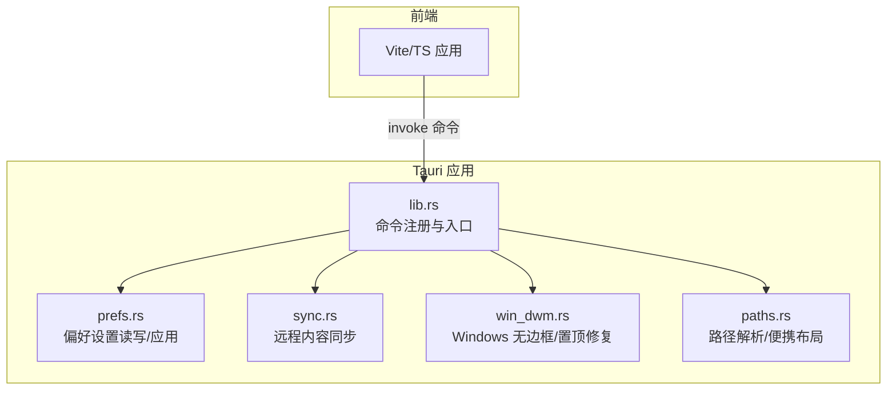
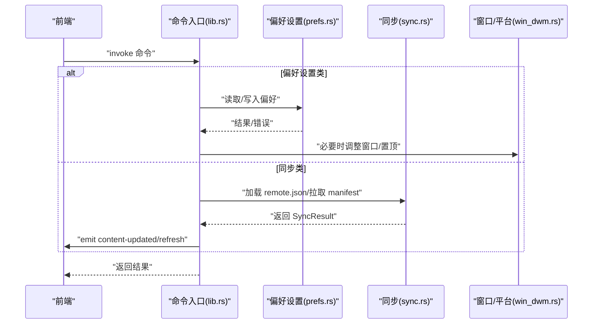
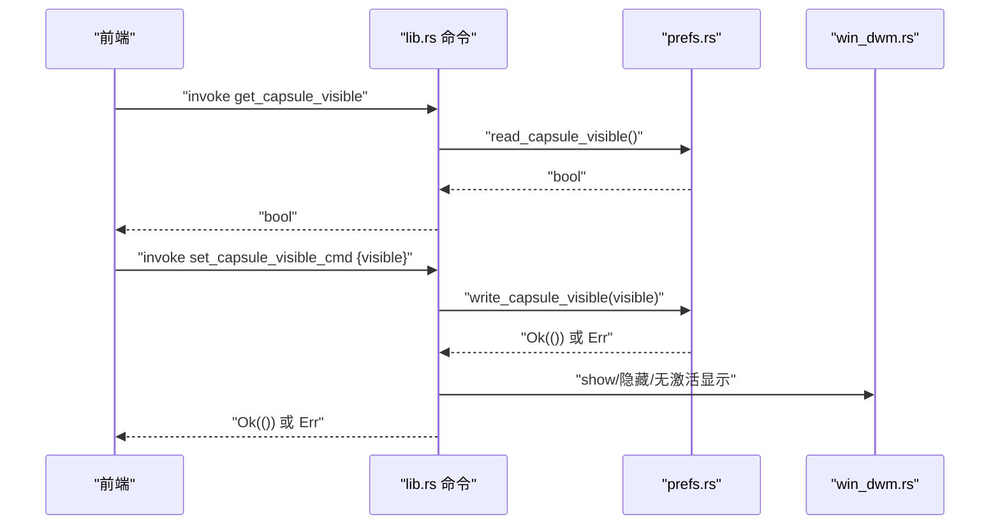
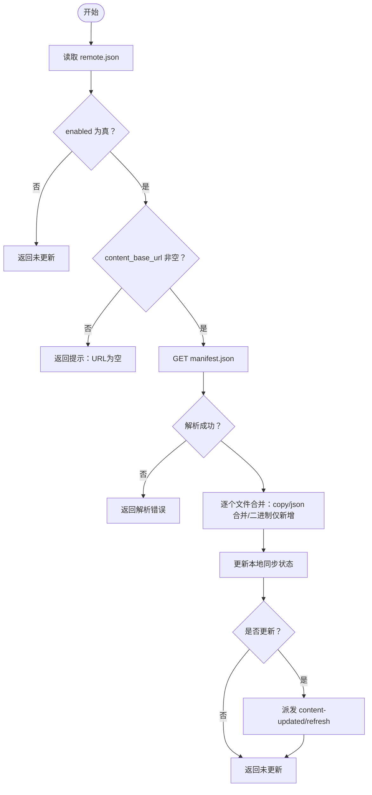
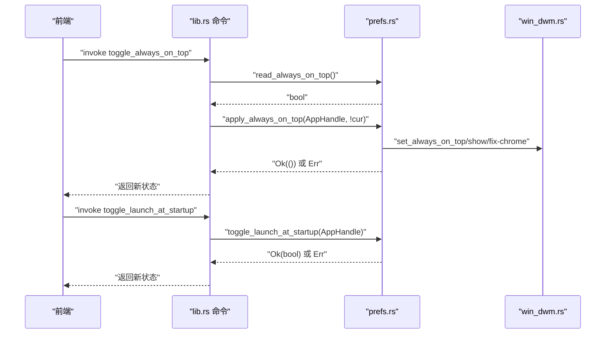
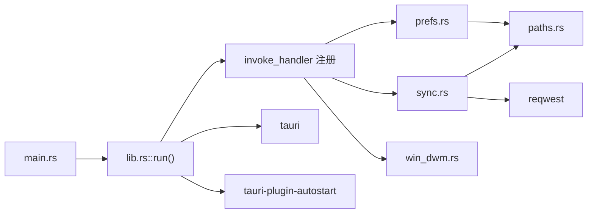

# 应用管理命令

<cite>
**本文引用的文件**
- [apps/tauri/src-tauri/src/lib.rs](file://apps/tauri/src-tauri/src/lib.rs)
- [apps/tauri/src-tauri/src/prefs.rs](file://apps/tauri/src-tauri/src/prefs.rs)
- [apps/tauri/src-tauri/src/sync.rs](file://apps/tauri/src-tauri/src/sync.rs)
- [apps/tauri/src-tauri/src/paths.rs](file://apps/tauri/src-tauri/src/paths.rs)
- [apps/tauri/src-tauri/src/win_dwm.rs](file://apps/tauri/src-tauri/src/win_dwm.rs)
- [apps/tauri/src-tauri/src/main.rs](file://apps/tauri/src-tauri/src/main.rs)
- [apps/tauri/package.json](file://apps/tauri/package.json)
- [apps/tauri/src-tauri/Cargo.toml](file://apps/tauri/src-tauri/Cargo.toml)
</cite>

## 目录
1. [简介](#简介)
2. [项目结构](#项目结构)
3. [核心组件](#核心组件)
4. [架构总览](#架构总览)
5. [详细组件分析](#详细组件分析)
6. [依赖关系分析](#依赖关系分析)
7. [性能考量](#性能考量)
8. [故障排查指南](#故障排查指南)
9. [结论](#结论)
10. [附录](#附录)

## 简介
本文件面向应用管理命令的 API 文档，聚焦以下三类命令：
- 偏好设置管理命令：get_capsule_visible、set_capsule_visible_cmd、show_main_inactive
- 启动参数配置命令：get_remote_config、sync_remote_content
- 运行时配置命令：toggle_always_on_top、toggle_launch_at_startup、apply_prefs_on_startup

文档覆盖命令参数验证规则、状态同步机制、配置持久化策略，并提供调用示例、配置项说明、默认值设置与错误处理方案，最后总结应用生命周期与状态管理最佳实践。

## 项目结构
本项目采用 Tauri 2 架构，桌面端 Rust 逻辑位于 apps/tauri/src-tauri，前端位于 apps/tauri。应用管理命令通过 Tauri 注解导出为可调用的命令，Rust 层负责状态读写、系统集成与事件派发。

图表来源
- [apps/tauri/src-tauri/src/lib.rs:716-800](file://apps/tauri/src-tauri/src/lib.rs#L716-L800)
- [apps/tauri/src-tauri/src/prefs.rs:1-145](file://apps/tauri/src-tauri/src/prefs.rs#L1-L145)
- [apps/tauri/src-tauri/src/sync.rs:1-372](file://apps/tauri/src-tauri/src/sync.rs#L1-L372)
- [apps/tauri/src-tauri/src/win_dwm.rs:1-231](file://apps/tauri/src-tauri/src/win_dwm.rs#L1-L231)
- [apps/tauri/src-tauri/src/paths.rs:1-142](file://apps/tauri/src-tauri/src/paths.rs#L1-L142)

章节来源
- [apps/tauri/src-tauri/src/lib.rs:716-800](file://apps/tauri/src-tauri/src/lib.rs#L716-L800)
- [apps/tauri/src-tauri/src/main.rs:1-6](file://apps/tauri/src-tauri/src/main.rs#L1-L6)
- [apps/tauri/package.json:1-22](file://apps/tauri/package.json#L1-L22)

## 核心组件
- 命令层：通过 #[tauri::command] 注解导出命令，集中于 lib.rs 的 invoke_handler 列表中注册。
- 偏好设置层：封装 app-state.json 的读写与默认值，提供 alwaysOnTop、launchAtStartup、capsuleVisible 等读取/应用方法。
- 同步层：加载 remote.json 配置，拉取 manifest.json 并合并 content/ 文件，记录本地同步状态。
- 平台适配层：Windows 特定的 DWM 无边框/置顶修复与窗口形状应用。
- 路径层：统一解析应用根目录、data/logs/content/config 等目录，支持便携布局。

章节来源
- [apps/tauri/src-tauri/src/lib.rs:31-468](file://apps/tauri/src-tauri/src/lib.rs#L31-L468)
- [apps/tauri/src-tauri/src/prefs.rs:13-132](file://apps/tauri/src-tauri/src/prefs.rs#L13-L132)
- [apps/tauri/src-tauri/src/sync.rs:12-372](file://apps/tauri/src-tauri/src/sync.rs#L12-L372)
- [apps/tauri/src-tauri/src/win_dwm.rs:1-231](file://apps/tauri/src-tauri/src/win_dwm.rs#L1-L231)
- [apps/tauri/src-tauri/src/paths.rs:18-142](file://apps/tauri/src-tauri/src/paths.rs#L18-L142)

## 架构总览
命令调用链路：前端通过 @tauri-apps/api 的 invoke 调用后端命令，Rust 层执行业务逻辑（读写状态、调用系统能力、派发事件），必要时通过线程异步执行耗时操作。

图表来源
- [apps/tauri/src-tauri/src/lib.rs:720-736](file://apps/tauri/src-tauri/src/lib.rs#L720-L736)
- [apps/tauri/src-tauri/src/prefs.rs:78-132](file://apps/tauri/src-tauri/src/prefs.rs#L78-L132)
- [apps/tauri/src-tauri/src/sync.rs:261-367](file://apps/tauri/src-tauri/src/sync.rs#L261-L367)
- [apps/tauri/src-tauri/src/win_dwm.rs:90-231](file://apps/tauri/src-tauri/src/win_dwm.rs#L90-L231)

## 详细组件分析

### 偏好设置管理命令
- get_capsule_visible
  - 功能：读取胶囊可见状态
  - 参数：无
  - 返回：布尔值
  - 默认值：true
  - 实现要点：从 app-state.json 读取 capsuleVisible，不存在时使用默认值
  - 错误处理：无外部 IO，异常情况返回默认值
  - 调用示例：前端调用 invoke("get_capsule_visible")

- set_capsule_visible_cmd
  - 功能：设置胶囊可见状态并应用到窗口
  - 参数：visible: 布尔
  - 返回：Result<(), String>
  - 行为：写入 app-state.json，根据平台对窗口进行 show/隐藏、无激活显示、事件派发等
  - 参数验证：visible 为布尔类型
  - 错误处理：窗口隐藏失败会记录日志
  - 调用示例：invoke("set_capsule_visible_cmd", { visible })

- show_main_inactive
  - 功能：确保主窗口处于“非激活”显示状态（用于托盘双击等场景）
  - 参数：无
  - 返回：Result<(), String>
  - 行为：若胶囊可见则强制显示主窗口
  - 错误处理：主窗口缺失时返回错误字符串
  - 调用示例：invoke("show_main_inactive")

图表来源
- [apps/tauri/src-tauri/src/lib.rs:452-468](file://apps/tauri/src-tauri/src/lib.rs#L452-L468)
- [apps/tauri/src-tauri/src/prefs.rs:53-62](file://apps/tauri/src-tauri/src/prefs.rs#L53-L62)
- [apps/tauri/src-tauri/src/win_dwm.rs:220-231](file://apps/tauri/src-tauri/src/win_dwm.rs#L220-L231)

章节来源
- [apps/tauri/src-tauri/src/lib.rs:452-468](file://apps/tauri/src-tauri/src/lib.rs#L452-L468)
- [apps/tauri/src-tauri/src/prefs.rs:49-62](file://apps/tauri/src-tauri/src/prefs.rs#L49-L62)

### 启动参数配置命令
- get_remote_config
  - 功能：读取远程内容配置
  - 参数：无
  - 返回：RemoteConfig 结构体
  - 字段与默认值：
    - enabled: true
    - content_base_url: ""
    - sync_delay_ms: 30000
  - 实现要点：从 config/remote.json 读取，文件不存在或解析失败时回退默认值
  - 错误处理：读取失败记录日志并返回默认值
  - 调用示例：invoke("get_remote_config")

- sync_remote_content
  - 功能：联网拉取并合并远程内容
  - 参数：AppHandle（内部使用）
  - 返回：SyncResult
  - 行为：当启用且基础 URL 非空时，下载 manifest.json，遍历 files 并合并内容；更新本地同步状态；成功时向窗口派发 content-updated/refresh 事件
  - 参数验证：检查 enabled 与 content_base_url
  - 错误处理：HTTP 请求失败、JSON 解析失败、保存失败均记录日志并返回错误信息
  - 调用示例：invoke("sync_remote_content")

图表来源
- [apps/tauri/src-tauri/src/sync.rs:261-367](file://apps/tauri/src-tauri/src/sync.rs#L261-L367)
- [apps/tauri/src-tauri/src/sync.rs:12-56](file://apps/tauri/src-tauri/src/sync.rs#L12-L56)

章节来源
- [apps/tauri/src-tauri/src/lib.rs:123-138](file://apps/tauri/src-tauri/src/lib.rs#L123-L138)
- [apps/tauri/src-tauri/src/sync.rs:58-70](file://apps/tauri/src-tauri/src/sync.rs#L58-L70)
- [apps/tauri/src-tauri/src/sync.rs:261-367](file://apps/tauri/src-tauri/src/sync.rs#L261-L367)

### 运行时配置命令
- toggle_always_on_top
  - 功能：切换“总在最前”
  - 参数：AppHandle
  - 返回：Result<bool, String>，返回新的状态
  - 行为：读取当前状态，取反后调用 apply_always_on_top，后者设置窗口置顶、必要时修正 Z-order、发出 fix-chrome 事件，并持久化
  - 错误处理：窗口句柄缺失、设置失败返回错误
  - 调用示例：invoke("toggle_always_on_top")

- toggle_launch_at_startup
  - 功能：切换开机自启动
  - 参数：AppHandle
  - 返回：Result<bool, String>
  - 行为：启用/禁用 autostart，校验实际状态一致性，失败时返回错误信息
  - 错误处理：启用/禁用失败或状态不一致返回错误
  - 调用示例：invoke("toggle_launch_at_startup")

- apply_prefs_on_startup
  - 功能：启动时应用偏好设置
  - 参数：AppHandle
  - 返回：Result<(), String>
  - 行为：依次应用 alwaysOnTop 与 launchAtStartup
  - 错误处理：任一步骤失败返回错误
  - 调用示例：invoke("apply_prefs_on_startup")

图表来源
- [apps/tauri/src-tauri/src/lib.rs:689-701](file://apps/tauri/src-tauri/src/lib.rs#L689-L701)
- [apps/tauri/src-tauri/src/prefs.rs:134-144](file://apps/tauri/src-tauri/src/prefs.rs#L134-L144)
- [apps/tauri/src-tauri/src/prefs.rs:78-97](file://apps/tauri/src-tauri/src/prefs.rs#L78-L97)

章节来源
- [apps/tauri/src-tauri/src/lib.rs:689-701](file://apps/tauri/src-tauri/src/lib.rs#L689-L701)
- [apps/tauri/src-tauri/src/prefs.rs:134-144](file://apps/tauri/src-tauri/src/prefs.rs#L134-L144)
- [apps/tauri/src-tauri/src/prefs.rs:128-132](file://apps/tauri/src-tauri/src/prefs.rs#L128-L132)

## 依赖关系分析
- 命令注册：lib.rs 通过 generate_handler 将命令集中注册，main.rs 调用 run() 启动应用。
- 偏好设置：prefs.rs 依赖 paths.rs 提供的数据目录，使用 app-state.json 存储键值。
- 同步：sync.rs 依赖 paths.rs 的 remote.json 与 content-cache.json 路径，使用 reqwest 进行网络请求。
- 平台：win_dwm.rs 仅在 Windows 生效，提供 DWM 属性调整与窗口形状应用。
- 依赖声明：Cargo.toml 明确 tauri、tauri-plugin-autostart、reqwest、chrono、which、base64 等依赖。

图表来源
- [apps/tauri/src-tauri/src/main.rs:3-5](file://apps/tauri/src-tauri/src/main.rs#L3-L5)
- [apps/tauri/src-tauri/src/lib.rs:716-736](file://apps/tauri/src-tauri/src/lib.rs#L716-L736)
- [apps/tauri/src-tauri/src/prefs.rs:1-11](file://apps/tauri/src-tauri/src/prefs.rs#L1-L11)
- [apps/tauri/src-tauri/src/sync.rs:1-10](file://apps/tauri/src-tauri/src/sync.rs#L1-L10)
- [apps/tauri/src-tauri/Cargo.toml:15-33](file://apps/tauri/src-tauri/Cargo.toml#L15-L33)

章节来源
- [apps/tauri/src-tauri/src/main.rs:3-5](file://apps/tauri/src-tauri/src/main.rs#L3-L5)
- [apps/tauri/src-tauri/src/lib.rs:716-736](file://apps/tauri/src-tauri/src/lib.rs#L716-L736)
- [apps/tauri/src-tauri/Cargo.toml:15-33](file://apps/tauri/src-tauri/Cargo.toml#L15-L33)

## 性能考量
- 异步刷新：refresh_usage 使用后台线程执行 Node 脚本，避免阻塞 UI。
- 延迟同步：remote 内容同步通过延时器按配置延迟执行，降低启动时负载。
- 窗口修复：fix-chrome 采用多阶段定时派发，兼顾视觉一致性与性能。
- I/O 合并：app-state.json 与 content-cache.json 采用合并写入，减少频繁磁盘操作。

章节来源
- [apps/tauri/src-tauri/src/lib.rs:618-639](file://apps/tauri/src-tauri/src/lib.rs#L618-L639)
- [apps/tauri/src-tauri/src/lib.rs:650-662](file://apps/tauri/src-tauri/src/lib.rs#L650-L662)
- [apps/tauri/src-tauri/src/lib.rs:587-614](file://apps/tauri/src-tauri/src/lib.rs#L587-L614)
- [apps/tauri/src-tauri/src/prefs.rs:24-39](file://apps/tauri/src-tauri/src/prefs.rs#L24-L39)
- [apps/tauri/src-tauri/src/sync.rs:83-91](file://apps/tauri/src-tauri/src/sync.rs#L83-L91)

## 故障排查指南
- 偏好设置读写
  - 现象：设置无效或重启后恢复默认
  - 排查：确认 app-state.json 是否可写、路径解析是否正确
  - 参考：write_state_merge、read_state_value
- 窗口置顶异常
  - 现象：置顶后被其他窗口遮挡
  - 排查：Windows 平台检查 DWM 设置与 Z-order 调整
  - 参考：apply_topmost_z_order、tune_frameless_window
- 自启动开关不生效
  - 现象：启用/禁用后系统仍按原状态启动
  - 排查：autostart.is_enabled 与期望状态不一致时返回错误
  - 参考：apply_launch_at_startup、sync_launch_at_startup_from_pref
- 远程内容同步失败
  - 现象：无法拉取 manifest 或合并文件
  - 排查：检查 remote.json enabled 与 content_base_url、网络超时、JSON 解析、文件权限
  - 参考：load_remote_config、sync_remote_content
- 日志定位
  - 参考：log_util::append 的使用位置

章节来源
- [apps/tauri/src-tauri/src/prefs.rs:24-39](file://apps/tauri/src-tauri/src/prefs.rs#L24-L39)
- [apps/tauri/src-tauri/src/win_dwm.rs:200-217](file://apps/tauri/src-tauri/src/win_dwm.rs#L200-L217)
- [apps/tauri/src-tauri/src/prefs.rs:99-114](file://apps/tauri/src-tauri/src/prefs.rs#L99-L114)
- [apps/tauri/src-tauri/src/prefs.rs:116-126](file://apps/tauri/src-tauri/src/prefs.rs#L116-L126)
- [apps/tauri/src-tauri/src/sync.rs:58-70](file://apps/tauri/src-tauri/src/sync.rs#L58-L70)
- [apps/tauri/src-tauri/src/sync.rs:261-367](file://apps/tauri/src-tauri/src/sync.rs#L261-L367)

## 结论
本应用管理命令围绕“状态持久化 + 平台能力 + 事件派发”的模式组织，命令参数简单明确、默认值清晰、错误处理稳健。建议在前端统一通过 invoke 调用并在 UI 上及时反映状态变化，同时结合日志与错误返回完善可观测性。

## 附录

### 命令参数与默认值速览
- get_capsule_visible
  - 输入：无
  - 输出：布尔
  - 默认值：true
- set_capsule_visible_cmd
  - 输入：visible: 布尔
  - 输出：Result<(), String>
- show_main_inactive
  - 输入：无
  - 输出：Result<(), String>
- get_remote_config
  - 输入：无
  - 输出：RemoteConfig
  - 默认值：enabled=true, content_base_url="", sync_delay_ms=30000
- sync_remote_content
  - 输入：AppHandle
  - 输出：SyncResult
- toggle_always_on_top
  - 输入：AppHandle
  - 输出：Result<bool, String>
- toggle_launch_at_startup
  - 输入：AppHandle
  - 输出：Result<bool, String>
- apply_prefs_on_startup
  - 输入：AppHandle
  - 输出：Result<(), String>

章节来源
- [apps/tauri/src-tauri/src/lib.rs:452-468](file://apps/tauri/src-tauri/src/lib.rs#L452-L468)
- [apps/tauri/src-tauri/src/lib.rs:123-138](file://apps/tauri/src-tauri/src/lib.rs#L123-L138)
- [apps/tauri/src-tauri/src/prefs.rs:41-51](file://apps/tauri/src-tauri/src/prefs.rs#L41-L51)
- [apps/tauri/src-tauri/src/prefs.rs:134-144](file://apps/tauri/src-tauri/src/prefs.rs#L134-L144)
- [apps/tauri/src-tauri/src/prefs.rs:128-132](file://apps/tauri/src-tauri/src/prefs.rs#L128-L132)