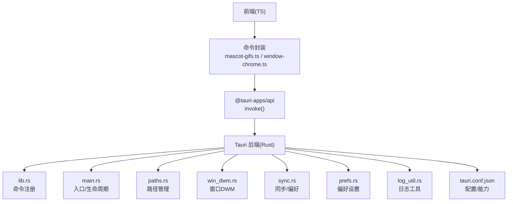
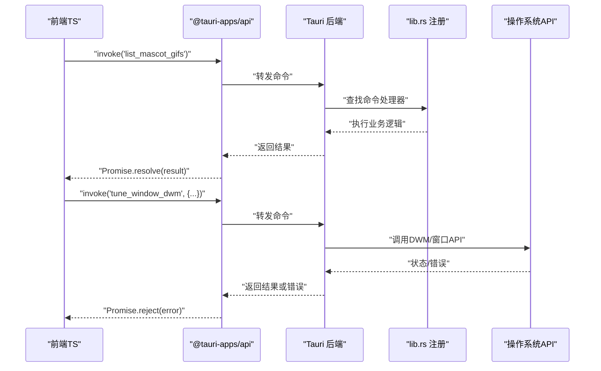
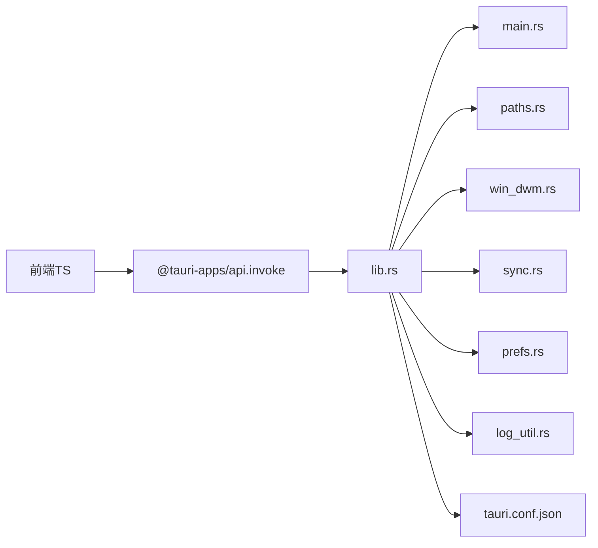

# 系统集成命令

<cite>
**本文引用的文件**
- [apps/tauri/src-tauri/src/main.rs](file://apps/tauri/src-tauri/src/main.rs)
- [apps/tauri/src-tauri/src/lib.rs](file://apps/tauri/src-tauri/src/lib.rs)
- [apps/tauri/src-tauri/src/paths.rs](file://apps/tauri/src-tauri/src/paths.rs)
- [apps/tauri/src-tauri/src/win_dwm.rs](file://apps/tauri/src-tauri/src/win_dwm.rs)
- [apps/tauri/src-tauri/src/sync.rs](file://apps/tauri/src-tauri/src/sync.rs)
- [apps/tauri/src-tauri/src/prefs.rs](file://apps/tauri/src-tauri/src/prefs.rs)
- [apps/tauri/src-tauri/src/log_util.rs](file://apps/tauri/src-tauri/src/log_util.rs)
- [apps/tauri/src-tauri/Cargo.toml](file://apps/tauri/src-tauri/Cargo.toml)
- [apps/tauri/src-tauri/tauri.conf.json](file://apps/tauri/src-tauri/tauri.conf.json)
- [apps/tauri/src/mascot-gifs.ts](file://apps/tauri/src/mascot-gifs.ts)
- [apps/tauri/src/window-chrome.ts](file://apps/tauri/src/window-chrome.ts)
- [apps/tauri/public/mascot/gifs/README.txt](file://apps/tauri/public/mascot/gifs/README.txt)
</cite>

## 目录
1. [简介](#简介)
2. [项目结构](#项目结构)
3. [核心组件](#核心组件)
4. [架构总览](#架构总览)
5. [详细组件分析](#详细组件分析)
6. [依赖关系分析](#依赖关系分析)
7. [性能考量](#性能考量)
8. [故障排查指南](#故障排查指南)
9. [结论](#结论)
10. [附录](#附录)

## 简介
本文件面向系统集成命令的API文档，聚焦以下四类命令：
- 文件系统访问命令：list_mascot_gifs、mascot_asset_data_url、mascot_gif_path
- 路径管理命令：get_app_paths
- 窗口管理命令：tune_window_dwm、sync_window_shape、start_drag_capsule

文档将说明每个命令的参数类型、返回值格式、错误处理机制，并提供调用示例、权限要求、性能考虑以及与操作系统API的交互方式和安全限制。

## 项目结构
该系统基于 Tauri 应用，前端使用 TypeScript，后端 Rust 实现系统级能力。关键位置如下：
- 前端命令封装与调用：apps/tauri/src/mascot-gifs.ts、apps/tauri/src/window-chrome.ts
- 后端命令注册与实现：apps/tauri/src-tauri/src/main.rs、apps/tauri/src-tauri/src/lib.rs
- 路径与窗口管理实现：apps/tauri/src-tauri/src/paths.rs、apps/tauri/src-tauri/src/win_dwm.rs
- 配置与能力声明：apps/tauri/src-tauri/tauri.conf.json、apps/tauri/src-tauri/src-tauri/capabilities/default.json
- 资源文件：apps/tauri/public/mascot/gifs/README.txt

图表来源
- [apps/tauri/src-tauri/src/main.rs](file://apps/tauri/src-tauri/src/main.rs)
- [apps/tauri/src-tauri/src/lib.rs](file://apps/tauri/src-tauri/src/lib.rs)
- [apps/tauri/src-tauri/src/paths.rs](file://apps/tauri/src-tauri/src/paths.rs)
- [apps/tauri/src-tauri/src/win_dwm.rs](file://apps/tauri/src-tauri/src/win_dwm.rs)
- [apps/tauri/src-tauri/src/sync.rs](file://apps/tauri/src-tauri/src/sync.rs)
- [apps/tauri/src-tauri/src/prefs.rs](file://apps/tauri/src-tauri/src/prefs.rs)
- [apps/tauri/src-tauri/src/log_util.rs](file://apps/tauri/src-tauri/src/log_util.rs)
- [apps/tauri/src-tauri/tauri.conf.json](file://apps/tauri/src-tauri/tauri.conf.json)

章节来源
- [apps/tauri/src-tauri/src/main.rs](file://apps/tauri/src-tauri/src/main.rs)
- [apps/tauri/src-tauri/src/lib.rs](file://apps/tauri/src-tauri/src/lib.rs)
- [apps/tauri/src-tauri/tauri.conf.json](file://apps/tauri/src-tauri/tauri.conf.json)

## 核心组件
- 命令注册与生命周期：在后端通过命令注册暴露给前端调用，前端通过 @tauri-apps/api 的 invoke 进行异步调用。
- 路径管理：统一管理应用数据、缓存、资源等路径，确保跨平台一致性。
- 窗口管理：封装 DWM（Desktop Window Manager）相关操作，支持窗口形状同步与拖拽胶囊交互。
- 资源访问：提供动图列表、资产URL生成、动图路径解析等能力，结合静态资源目录进行访问控制。

章节来源
- [apps/tauri/src-tauri/src/main.rs](file://apps/tauri/src-tauri/src/main.rs)
- [apps/tauri/src-tauri/src/lib.rs](file://apps/tauri/src-tauri/src/lib.rs)
- [apps/tauri/src-tauri/src/paths.rs](file://apps/tauri/src-tauri/src/paths.rs)
- [apps/tauri/src-tauri/src/win_dwm.rs](file://apps/tauri/src-tauri/src/win_dwm.rs)

## 架构总览
下图展示从前端到后端再到系统API的调用链路，以及与操作系统窗口管理器的交互。

图表来源
- [apps/tauri/src-tauri/src/lib.rs](file://apps/tauri/src-tauri/src/lib.rs)
- [apps/tauri/src-tauri/src/win_dwm.rs](file://apps/tauri/src-tauri/src/win_dwm.rs)

## 详细组件分析

### 文件系统访问命令

#### list_mascot_gifs
- 功能描述：枚举并返回可用的吉祥物动图文件名列表。
- 参数类型：无
- 返回值格式：字符串数组（文件名列表）
- 错误处理机制：若资源目录不可读或内部IO异常，返回错误对象；前端捕获并记录日志。
- 权限要求：只读访问应用内资源目录；不涉及用户敏感数据。
- 性能考虑：读取静态资源目录，I/O开销极低；建议缓存结果以避免重复读取。
- 平台特定行为：仅在打包后的应用中有效；开发模式下需确保资源已正确构建。
- 安全限制：受限于应用沙箱与资源目录范围，无法访问系统任意路径。
- 调用示例（路径参考）：
  - 前端调用：[apps/tauri/src/mascot-gifs.ts](file://apps/tauri/src/mascot-gifs.ts)
  - 命令注册：[apps/tauri/src-tauri/src/lib.rs](file://apps/tauri/src-tauri/src/lib.rs)
  - 资源目录：[apps/tauri/public/mascot/gifs/README.txt](file://apps/tauri/public/mascot/gifs/README.txt)

章节来源
- [apps/tauri/src-tauri/src/lib.rs](file://apps/tauri/src-tauri/src/lib.rs)
- [apps/tauri/src/mascot-gifs.ts](file://apps/tauri/src/mascot-gifs.ts)
- [apps/tauri/public/mascot/gifs/README.txt](file://apps/tauri/public/mascot/gifs/README.txt)

#### mascot_asset_data_url
- 功能描述：根据动图文件名生成可直接用于等元素的data URL。
- 参数类型：文件名（字符串）
- 返回值格式：字符串（data URL）
- 错误处理机制：当文件不存在或读取失败时返回错误；前端应检查URL有效性。
- 权限要求：只读访问应用内资源目录。
- 性能考虑：读取小体积静态资源，内存占用低；建议对常用资源进行LRU缓存。
- 平台特定行为：跨平台一致；注意不同平台的MIME类型识别差异。
- 安全限制：仅允许访问受控资源目录，防止任意文件读取。
- 调用示例（路径参考）：
  - 前端调用：[apps/tauri/src/mascot-gifs.ts](file://apps/tauri/src/mascot-gifs.ts)
  - 命令注册：[apps/tauri/src-tauri/src/lib.rs](file://apps/tauri/src-tauri/src/lib.rs)

章节来源
- [apps/tauri/src-tauri/src/lib.rs](file://apps/tauri/src-tauri/src/lib.rs)
- [apps/tauri/src/mascot-gifs.ts](file://apps/tauri/src/mascot-gifs.ts)

#### mascot_gif_path
- 功能描述：根据动图文件名解析为应用内资源的绝对路径。
- 参数类型：文件名（字符串）
- 返回值格式：字符串（绝对路径）
- 错误处理机制：当文件名非法或不在受控目录时返回错误。
- 权限要求：只读访问应用内资源目录。
- 性能考虑：路径拼接与校验，开销极低。
- 平台特定行为：跨平台路径分隔符处理；返回路径符合当前平台格式。
- 安全限制：严格限定在应用资源范围内，防止越权访问。
- 调用示例（路径参考）：
  - 前端调用：[apps/tauri/src/mascot-gifs.ts](file://apps/tauri/src/mascot-gifs.ts)
  - 命令注册：[apps/tauri/src-tauri/src/lib.rs](file://apps/tauri/src-tauri/src/lib.rs)

章节来源
- [apps/tauri/src-tauri/src/lib.rs](file://apps/tauri/src-tauri/src/lib.rs)
- [apps/tauri/src/mascot-gifs.ts](file://apps/tauri/src/mascot-gifs.ts)

### 路径管理命令

#### get_app_paths
- 功能描述：返回应用的关键路径集合（如数据目录、缓存目录、资源目录等）。
- 参数类型：无
- 返回值格式：对象（包含各路径键值）
- 错误处理机制：若路径解析失败或权限不足，返回错误；前端应降级处理。
- 权限要求：只读访问应用目录；不涉及系统全局路径。
- 性能考虑：路径查询为常量时间；建议一次性获取并复用。
- 平台特定行为：Windows/macOS/Linux路径风格不同，返回值适配当前平台。
- 安全限制：仅返回受控应用目录，避免泄露系统敏感路径。
- 调用示例（路径参考）：
  - 前端调用：[apps/tauri/src/window-chrome.ts](file://apps/tauri/src/window-chrome.ts)
  - 命令注册：[apps/tauri/src-tauri/src/lib.rs](file://apps/tauri/src-tauri/src/lib.rs)
  - 路径实现：[apps/tauri/src-tauri/src/paths.rs](file://apps/tauri/src-tauri/src/paths.rs)

章节来源
- [apps/tauri/src-tauri/src/lib.rs](file://apps/tauri/src-tauri/src/lib.rs)
- [apps/tauri/src-tauri/src/paths.rs](file://apps/tauri/src-tauri/src/paths.rs)
- [apps/tauri/src/window-chrome.ts](file://apps/tauri/src/window-chrome.ts)

### 窗口管理命令

#### tune_window_dwm
- 功能描述：调整窗口DWM属性（如圆角、阴影、透明度等），提升视觉效果。
- 参数类型：对象（包含DWM相关配置键）
- 返回值格式：布尔或状态对象
- 错误处理机制：若DWM调用失败或参数无效，返回错误；前端回退到默认样式。
- 权限要求：需要窗口句柄与系统窗口管理权限；在某些策略下可能受限。
- 性能考虑：DWM调用可能触发重绘，频繁调用会增加GPU/CPU负载；建议节流。
- 平台特定行为：仅在Windows上有效；其他平台忽略或返回错误。
- 安全限制：仅作用于当前应用窗口；不得越权修改其他进程窗口。
- 调用示例（路径参考）：
  - 前端调用：[apps/tauri/src/window-chrome.ts](file://apps/tauri/src/window-chrome.ts)
  - 命令注册：[apps/tauri/src-tauri/src/lib.rs](file://apps/tauri/src-tauri/src/lib.rs)
  - DWM实现：[apps/tauri/src-tauri/src/win_dwm.rs](file://apps/tauri/src-tauri/src/win_dwm.rs)

章节来源
- [apps/tauri/src-tauri/src/lib.rs](file://apps/tauri/src-tauri/src/lib.rs)
- [apps/tauri/src-tauri/src/win_dwm.rs](file://apps/tauri/src-tauri/src/win_dwm.rs)
- [apps/tauri/src/window-chrome.ts](file://apps/tauri/src/window-chrome.ts)

#### sync_window_shape
- 功能描述：同步窗口形状（如圆角矩形、自定义裁剪区域）到DWM。
- 参数类型：对象（包含形状参数，如半径、路径点集等）
- 返回值格式：布尔或状态对象
- 错误处理机制：若形状参数非法或DWM不支持，返回错误；前端回退到默认矩形。
- 权限要求：需要窗口句柄与DWM权限。
- 性能考虑：形状同步可能触发昂贵的重绘；建议批量更新与去抖。
- 平台特定行为：仅Windows有效；其他平台忽略。
- 安全限制：仅影响当前应用窗口；不得修改系统全局形状。
- 调用示例（路径参考）：
  - 前端调用：[apps/tauri/src/window-chrome.ts](file://apps/tauri/src/window-chrome.ts)
  - 命令注册：[apps/tauri/src-tauri/src/lib.rs](file://apps/tauri/src-tauri/src/lib.rs)
  - DWM实现：[apps/tauri/src-tauri/src/win_dwm.rs](file://apps/tauri/src-tauri/src/win_dwm.rs)

章节来源
- [apps/tauri/src-tauri/src/lib.rs](file://apps/tauri/src-tauri/src/lib.rs)
- [apps/tauri/src-tauri/src/win_dwm.rs](file://apps/tauri/src-tauri/src/win_dwm.rs)
- [apps/tauri/src/window-chrome.ts](file://apps/tauri/src/window-chrome.ts)

#### start_drag_capsule
- 功能描述：启动窗口拖拽胶囊交互（如从标题栏拖拽移动窗口）。
- 参数类型：对象（包含拖拽起始坐标、窗口句柄等）
- 返回值格式：布尔或状态对象
- 错误处理机制：若坐标无效或窗口句柄不存在，返回错误；前端终止拖拽。
- 权限要求：需要窗口句柄与系统输入事件权限。
- 性能考虑：事件监听与回调需轻量化；避免阻塞主线程。
- 平台特定行为：仅Windows有效；其他平台忽略。
- 安全限制：仅作用于当前应用窗口；不得劫持其他应用窗口。
- 调用示例（路径参考）：
  - 前端调用：[apps/tauri/src/window-chrome.ts](file://apps/tauri/src/window-chrome.ts)
  - 命令注册：[apps/tauri/src-tauri/src/lib.rs](file://apps/tauri/src-tauri/src/lib.rs)
  - DWM实现：[apps/tauri/src-tauri/src/win_dwm.rs](file://apps/tauri/src-tauri/src/win_dwm.rs)

章节来源
- [apps/tauri/src-tauri/src/lib.rs](file://apps/tauri/src-tauri/src/lib.rs)
- [apps/tauri/src-tauri/src/win_dwm.rs](file://apps/tauri/src-tauri/src/win_dwm.rs)
- [apps/tauri/src/window-chrome.ts](file://apps/tauri/src/window-chrome.ts)

## 依赖关系分析
- 前端通过 @tauri-apps/api 的 invoke 与后端通信。
- 后端命令在 lib.rs 中注册，main.rs 提供入口与生命周期管理。
- 路径与窗口管理分别由 paths.rs 与 win_dwm.rs 实现。
- 配置文件 tauri.conf.json 声明能力与权限边界。

图表来源
- [apps/tauri/src-tauri/src/lib.rs](file://apps/tauri/src-tauri/src/lib.rs)
- [apps/tauri/src-tauri/src/main.rs](file://apps/tauri/src-tauri/src/main.rs)
- [apps/tauri/src-tauri/src/paths.rs](file://apps/tauri/src-tauri/src/paths.rs)
- [apps/tauri/src-tauri/src/win_dwm.rs](file://apps/tauri/src-tauri/src/win_dwm.rs)
- [apps/tauri/src-tauri/src/sync.rs](file://apps/tauri/src-tauri/src/sync.rs)
- [apps/tauri/src-tauri/src/prefs.rs](file://apps/tauri/src-tauri/src/prefs.rs)
- [apps/tauri/src-tauri/src/log_util.rs](file://apps/tauri/src-tauri/src/log_util.rs)
- [apps/tauri/src-tauri/tauri.conf.json](file://apps/tauri/src-tauri/tauri.conf.json)

章节来源
- [apps/tauri/src-tauri/src/lib.rs](file://apps/tauri/src-tauri/src/lib.rs)
- [apps/tauri/src-tauri/src/main.rs](file://apps/tauri/src-tauri/src/main.rs)
- [apps/tauri/src-tauri/tauri.conf.json](file://apps/tauri/src-tauri/tauri.conf.json)

## 性能考量
- 避免频繁触发DWM重绘：合并窗口形状更新，使用节流/去抖。
- 缓存资源访问结果：动图列表与data URL可缓存，减少重复I/O。
- 控制命令调用频率：窗口交互类命令应限制触发速率，避免卡顿。
- 跨平台兼容性：非Windows平台忽略窗口DWM命令，避免额外开销。

## 故障排查指南
- 命令未注册：确认命令已在 lib.rs 中注册并在 main.rs 中启用。
- 资源访问失败：检查资源目录是否正确打包，路径是否在受控范围内。
- DWM调用失败：确认运行平台为Windows，且具备相应权限；查看日志输出。
- 权限被拒绝：检查 tauri.conf.json 中的能力声明与权限配置。
- 日志定位：使用 log_util.rs 输出调试信息，便于前端与后端联动排查。

章节来源
- [apps/tauri/src-tauri/src/lib.rs](file://apps/tauri/src-tauri/src/lib.rs)
- [apps/tauri/src-tauri/src/log_util.rs](file://apps/tauri/src-tauri/src/log_util.rs)
- [apps/tauri/src-tauri/tauri.conf.json](file://apps/tauri/src-tauri/tauri.conf.json)

## 结论
本文档梳理了系统集成命令的API定义、调用流程与平台差异。通过严格的权限控制与错误处理，确保命令在多平台环境下稳定运行。建议在生产环境中结合缓存与节流策略，优化性能与用户体验。

## 附录
- 前端调用示例路径参考：
  - 动图命令：[apps/tauri/src/mascot-gifs.ts](file://apps/tauri/src/mascot-gifs.ts)
  - 窗口命令：[apps/tauri/src/window-chrome.ts](file://apps/tauri/src/window-chrome.ts)
- 后端实现与注册：
  - 命令注册：[apps/tauri/src-tauri/src/lib.rs](file://apps/tauri/src-tauri/src/lib.rs)
  - 入口与生命周期：[apps/tauri/src-tauri/src/main.rs](file://apps/tauri/src-tauri/src/main.rs)
  - 路径管理：[apps/tauri/src-tauri/src/paths.rs](file://apps/tauri/src-tauri/src/paths.rs)
  - 窗口DWM：[apps/tauri/src-tauri/src/win_dwm.rs](file://apps/tauri/src-tauri/src/win_dwm.rs)
- 配置与能力：
  - 应用配置：[apps/tauri/src-tauri/tauri.conf.json](file://apps/tauri/src-tauri/tauri.conf.json)
  - 能力声明：[apps/tauri/src-tauri/capabilities/default.json](file://apps/tauri/src-tauri/capabilities/default.json)
- 资源目录：
  - 动图资源：[apps/tauri/public/mascot/gifs/README.txt](file://apps/tauri/public/mascot/gifs/README.txt)