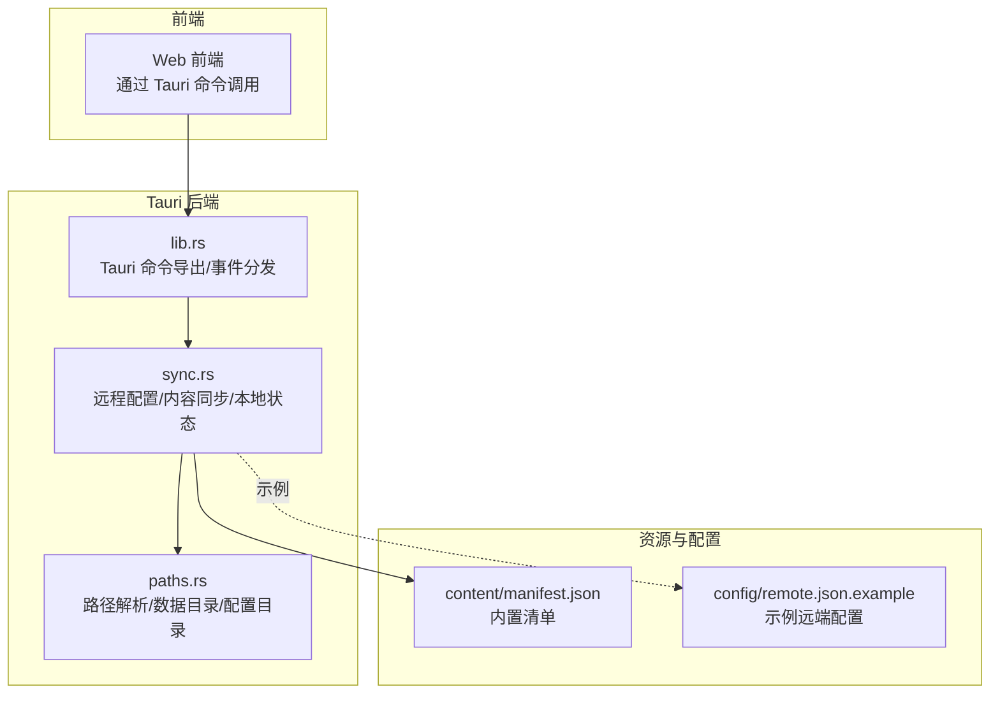
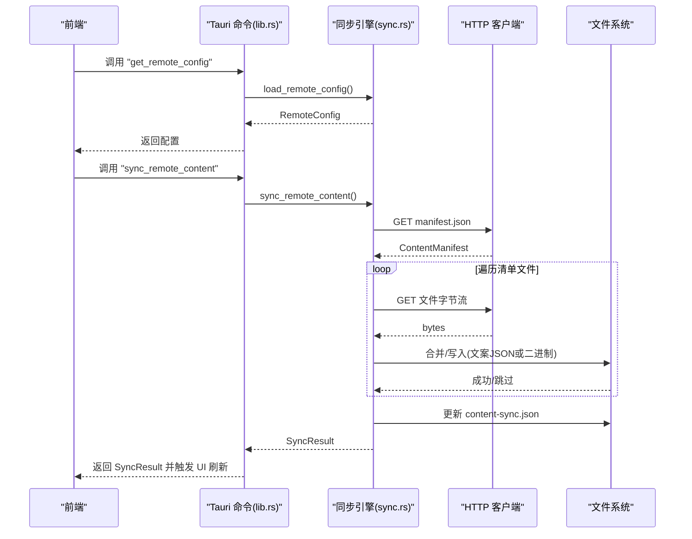
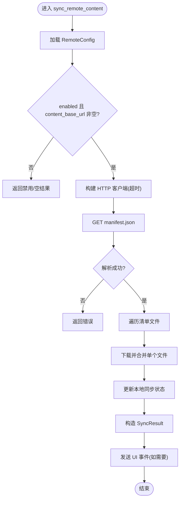
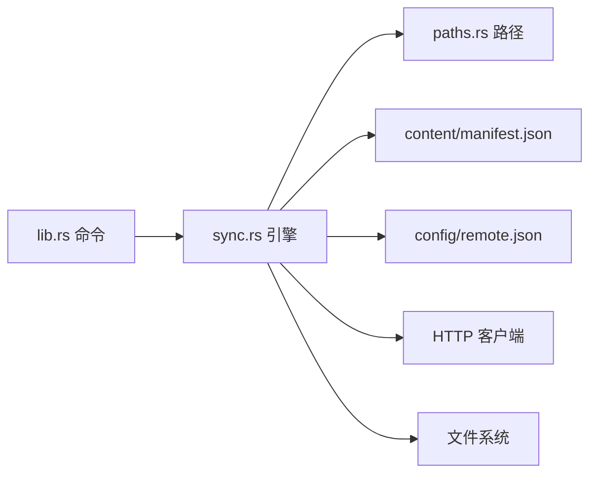

# 资源同步命令

<cite>
**本文引用的文件**
- [apps/tauri/src-tauri/src/sync.rs](file://apps/tauri/src-tauri/src/sync.rs)
- [apps/tauri/src-tauri/src/lib.rs](file://apps/tauri/src-tauri/src/lib.rs)
- [apps/tauri/src-tauri/src/paths.rs](file://apps/tauri/src-tauri/src/paths.rs)
- [content/manifest.json](file://content/manifest.json)
- [config/remote.json.example](file://config/remote.json.example)
- [packages/core/src/copy.ts](file://packages/core/src/copy.ts)
</cite>

## 目录
1. [简介](#简介)
2. [项目结构](#项目结构)
3. [核心组件](#核心组件)
4. [架构总览](#架构总览)
5. [详细组件分析](#详细组件分析)
6. [依赖关系分析](#依赖关系分析)
7. [性能考虑](#性能考虑)
8. [故障排查指南](#故障排查指南)
9. [结论](#结论)
10. [附录](#附录)

## 简介
本文件面向 CursorQ 应用中的“资源同步命令”，系统性梳理以下能力：
- 远程配置获取命令：用于读取远端资源基础地址与同步策略参数
- 内容同步命令：从远端拉取资源清单并进行增量合并，保障本地资源与远端一致
- 本地资源管理命令：提供应用路径查询、动图列表、占位图路径等辅助能力
- 同步策略与增量更新机制：基于清单版本号与本地状态文件的幂等合并
- 冲突解决规则：文案类 JSON 采用去重合并，二进制资源采用“本地优先”策略
- 错误码与重试机制：统一通过返回体的 ok/message 表达错误，结合后台定时重试
- 性能优化与网络异常处理：超时控制、后台线程执行、窗口修复联动
- 版本管理与缓存策略：清单版本号驱动、本地状态文件记录、延迟合并策略

## 项目结构
围绕资源同步的核心代码位于 Tauri 后端模块，前端通过 Tauri 命令调用；资源清单与示例配置位于 content 与 config 目录。

**图表来源**
- [apps/tauri/src-tauri/src/sync.rs:1-372](file://apps/tauri/src-tauri/src/sync.rs#L1-L372)
- [apps/tauri/src-tauri/src/lib.rs:120-140](file://apps/tauri/src-tauri/src/lib.rs#L120-L140)
- [apps/tauri/src-tauri/src/paths.rs:1-142](file://apps/tauri/src-tauri/src/paths.rs#L1-L142)
- [content/manifest.json:1-12](file://content/manifest.json#L1-L12)
- [config/remote.json.example:1-6](file://config/remote.json.example#L1-L6)

**章节来源**
- [apps/tauri/src-tauri/src/sync.rs:1-372](file://apps/tauri/src-tauri/src/sync.rs#L1-L372)
- [apps/tauri/src-tauri/src/lib.rs:120-140](file://apps/tauri/src-tauri/src/lib.rs#L120-L140)
- [apps/tauri/src-tauri/src/paths.rs:1-142](file://apps/tauri/src-tauri/src/paths.rs#L1-L142)
- [content/manifest.json:1-12](file://content/manifest.json#L1-L12)
- [config/remote.json.example:1-6](file://config/remote.json.example#L1-L6)

## 核心组件
- 远程配置模型 RemoteConfig
  - 字段：enabled、content_base_url、sync_delay_ms
  - 默认值：enabled=true、sync_delay_ms=30000、content_base_url=""
- 内容清单 ContentManifest
  - 字段：version、files
- 同步结果 SyncResult
  - 字段：ok、updated、files、message
- 本地同步状态 LocalSyncState
  - 字段：manifest_version、last_sync_iso

上述结构用于描述远端配置、资源清单与同步结果的数据契约。

**章节来源**
- [apps/tauri/src-tauri/src/sync.rs:12-56](file://apps/tauri/src-tauri/src/sync.rs#L12-L56)

## 架构总览
资源同步由“命令层 → 同步引擎 → 文件系统/网络”三层构成：
- 命令层：暴露 get_remote_config、sync_remote_content、get_app_paths 等命令
- 同步引擎：加载远端配置、拉取清单、逐项合并资源、更新本地状态
- 文件系统/网络：读写本地文件、HTTP 请求远端资源

**图表来源**
- [apps/tauri/src-tauri/src/lib.rs:122-138](file://apps/tauri/src-tauri/src/lib.rs#L122-L138)
- [apps/tauri/src-tauri/src/sync.rs:261-367](file://apps/tauri/src-tauri/src/sync.rs#L261-L367)

## 详细组件分析

### 命令：get_remote_config
- 功能：读取并返回当前远端配置（启用开关、基础URL、同步延迟）
- 参数：无
- 返回：RemoteConfig 对象
- 错误：若配置文件不存在或解析失败，返回默认配置并记录日志
- 典型用途：初始化界面、决定是否允许用户手动触发同步

**章节来源**
- [apps/tauri/src-tauri/src/lib.rs:122-125](file://apps/tauri/src-tauri/src/lib.rs#L122-L125)
- [apps/tauri/src-tauri/src/sync.rs:58-70](file://apps/tauri/src-tauri/src/sync.rs#L58-L70)

### 命令：sync_remote_content
- 功能：联网拉取远端清单并增量合并资源
- 触发时机：用户点击托盘菜单“同步文案/动图”或后台定时任务
- 关键流程：
  - 读取 RemoteConfig，若未启用或基础URL为空则直接返回
  - 创建带超时的 HTTP 客户端
  - 拉取 manifest.json，解析为 ContentManifest
  - 遍历清单文件，逐个下载并合并：
    - 文案 JSON（jokes.json、states.json）：按唯一键去重合并，新增条目追加到本地
    - 二进制资源：若本地不存在则写入，存在则跳过（保护用户手动添加的资源）
  - 更新本地同步状态（记录最高版本号与最近同步时间）
  - 返回 SyncResult，包含是否更新、变更文件列表与消息
- UI 通知：当 updated=true 时，向主窗口发送 content-updated 与 refresh 事件
- 后台定时：根据 sync_delay_ms 延迟后自动执行一次同步

**图表来源**
- [apps/tauri/src-tauri/src/sync.rs:261-367](file://apps/tauri/src-tauri/src/sync.rs#L261-L367)
- [apps/tauri/src-tauri/src/lib.rs:127-138](file://apps/tauri/src-tauri/src/lib.rs#L127-L138)

**章节来源**
- [apps/tauri/src-tauri/src/lib.rs:127-138](file://apps/tauri/src-tauri/src/lib.rs#L127-L138)
- [apps/tauri/src-tauri/src/sync.rs:261-367](file://apps/tauri/src-tauri/src/sync.rs#L261-L367)

### 命令：apply_bundled_content（启动时）
- 功能：在不联网的情况下，校验内置 content 的完整性，并初始化本地同步状态
- 触发时机：应用启动时
- 行为：读取内置 manifest.json，检查清单中列出的文件是否存在；若版本号大于本地记录，则更新本地状态

**章节来源**
- [apps/tauri/src-tauri/src/sync.rs:190-258](file://apps/tauri/src-tauri/src/sync.rs#L190-L258)

### 命令：get_app_paths
- 功能：返回应用根目录、数据目录、日志目录、内容目录、复制资源目录、动图目录等路径信息
- 用途：前端调试、资源定位、问题排查

**章节来源**
- [apps/tauri/src-tauri/src/lib.rs:140-151](file://apps/tauri/src-tauri/src/lib.rs#L140-L151)

### 本地资源管理命令（补充）
- 列举动图：list_mascot_gifs
- 获取占位图路径：mascot_placeholder_path、mascot_placeholder_anim_path
- 动态生成资源 data URL：mascot_asset_data_url
- 校验与选择文案：selectCopy（来自 core 包）

**章节来源**
- [apps/tauri/src-tauri/src/lib.rs:31-120](file://apps/tauri/src-tauri/src/lib.rs#L31-L120)
- [packages/core/src/copy.ts:40-77](file://packages/core/src/copy.ts#L40-L77)

## 依赖关系分析
- 命令到同步引擎：get_remote_config、sync_remote_content、get_app_paths 均委托给 sync.rs 实现
- 同步引擎到路径模块：使用 paths.rs 解析 content 目录、数据目录、配置目录与缓存文件路径
- 同步引擎到清单与配置：读取 content/manifest.json 与 config/remote.json
- 同步引擎到网络：使用 reqwest 阻塞客户端发起 HTTP 请求
- 同步引擎到文件系统：读写 JSON、二进制文件与本地状态文件

**图表来源**
- [apps/tauri/src-tauri/src/lib.rs:122-151](file://apps/tauri/src-tauri/src/lib.rs#L122-L151)
- [apps/tauri/src-tauri/src/sync.rs:58-91](file://apps/tauri/src-tauri/src/sync.rs#L58-L91)
- [apps/tauri/src-tauri/src/paths.rs:37-87](file://apps/tauri/src-tauri/src/paths.rs#L37-L87)
- [content/manifest.json:1-12](file://content/manifest.json#L1-L12)
- [config/remote.json.example:1-6](file://config/remote.json.example#L1-L6)

**章节来源**
- [apps/tauri/src-tauri/src/lib.rs:122-151](file://apps/tauri/src-tauri/src/lib.rs#L122-L151)
- [apps/tauri/src-tauri/src/sync.rs:58-91](file://apps/tauri/src-tauri/src/sync.rs#L58-L91)
- [apps/tauri/src-tauri/src/paths.rs:37-87](file://apps/tauri/src-tauri/src/paths.rs#L37-L87)

## 性能考虑
- 超时控制：HTTP 客户端设置超时，避免阻塞 UI
- 后台线程：托盘菜单与定时器均在后台线程执行，防止阻塞主线程
- 增量合并：仅对新增条目或缺失文件进行操作，减少 IO
- 本地优先：二进制资源若本地已存在则跳过，避免覆盖用户手动添加的资源
- 窗口修复联动：同步完成后触发 UI 修复逻辑，提升渲染稳定性

**章节来源**
- [apps/tauri/src-tauri/src/sync.rs:281-295](file://apps/tauri/src-tauri/src/sync.rs#L281-L295)
- [apps/tauri/src-tauri/src/lib.rs:650-662](file://apps/tauri/src-tauri/src/lib.rs#L650-L662)
- [apps/tauri/src-tauri/src/lib.rs:598-614](file://apps/tauri/src-tauri/src/lib.rs#L598-L614)

## 故障排查指南
- 远端配置不可用
  - 现象：返回“remote sync disabled”或“content_base_url empty”
  - 处理：检查 config/remote.json 是否存在且字段有效
- 清单拉取失败
  - 现象：返回“manifest parse/http/request”错误
  - 处理：检查网络连通性、URL 正确性与服务端响应
- 单文件下载失败
  - 现象：日志记录“sync fail {rel}: {e}”
  - 处理：重试或检查该文件是否存在、权限是否正确
- HTTP 客户端构建失败
  - 现象：返回“sync http client”错误
  - 处理：检查运行环境与证书配置
- 本地状态写入失败
  - 现象：返回字符串错误
  - 处理：检查 data 目录可写权限

**章节来源**
- [apps/tauri/src-tauri/src/sync.rs:261-333](file://apps/tauri/src-tauri/src/sync.rs#L261-L333)
- [apps/tauri/src-tauri/src/sync.rs:83-91](file://apps/tauri/src-tauri/src/sync.rs#L83-L91)

## 结论
本资源同步体系以清单驱动的增量合并为核心，兼顾了远端资源的动态扩展与本地用户的自定义保护。通过命令层暴露统一接口、后台线程执行与 UI 事件联动，实现了稳定、可观察且低干扰的资源同步体验。建议在生产环境中：
- 明确 content_base_url 与权限范围
- 使用稳定的镜像源与 CDN 提升可靠性
- 结合业务场景调整 sync_delay_ms 与 UI 通知策略
- 对关键资源建立备份与回滚机制

## 附录

### 命令与参数说明
- get_remote_config
  - 输入：无
  - 输出：RemoteConfig
- sync_remote_content
  - 输入：无
  - 输出：SyncResult
- get_app_paths
  - 输入：无
  - 输出：包含 root/data/logs/content/copy/mascotGifs/portable 的对象

**章节来源**
- [apps/tauri/src-tauri/src/lib.rs:122-151](file://apps/tauri/src-tauri/src/lib.rs#L122-L151)

### 数据结构与字段定义
- RemoteConfig
  - enabled: 布尔，是否启用远端同步
  - content_base_url: 字符串，远端资源基础地址
  - sync_delay_ms: 数值，后台定时延迟（毫秒）
- ContentManifest
  - version: 数值，清单版本号
  - files: 字符串数组，相对路径列表
- SyncResult
  - ok: 布尔，是否成功
  - updated: 布尔，是否有新增/变更
  - files: 字符串数组，本次合并的文件变更说明
  - message: 字符串，简要说明
- LocalSyncState
  - manifest_version: 数值，记录的最高清单版本
  - last_sync_iso: 字符串，ISO 时间戳

**章节来源**
- [apps/tauri/src-tauri/src/sync.rs:12-56](file://apps/tauri/src-tauri/src/sync.rs#L12-L56)

### 同步策略与增量更新机制
- 清单版本号驱动：比较远端与本地版本号，取最大值作为新的本地版本
- 文案 JSON 增量：按唯一键去重合并，仅追加新条目
- 二进制资源：若本地不存在则写入，存在则跳过
- 本地状态文件：保存 manifest_version 与 last_sync_iso

**章节来源**
- [apps/tauri/src-tauri/src/sync.rs:347-353](file://apps/tauri/src-tauri/src/sync.rs#L347-L353)
- [apps/tauri/src-tauri/src/sync.rs:123-187](file://apps/tauri/src-tauri/src/sync.rs#L123-L187)

### 冲突解决规则
- 文案 JSON：以“远端新增+本地保留”为主，避免覆盖用户手动编辑
- 二进制资源：以“本地优先”为主，避免覆盖用户手动添加的动图
- 清单版本：以“取最大值”确保不会回退到旧版本

**章节来源**
- [apps/tauri/src-tauri/src/sync.rs:123-187](file://apps/tauri/src-tauri/src/sync.rs#L123-L187)

### 错误码与重试机制
- 错误表达：统一通过 SyncResult.ok 与 message 描述错误
- 重试机制：通过后台定时器按 sync_delay_ms 周期自动重试
- 手动触发：托盘菜单“同步文案/动图”可立即执行一次同步

**章节来源**
- [apps/tauri/src-tauri/src/sync.rs:369-371](file://apps/tauri/src-tauri/src/sync.rs#L369-L371)
- [apps/tauri/src-tauri/src/lib.rs:650-662](file://apps/tauri/src-tauri/src/lib.rs#L650-L662)
- [apps/tauri/src-tauri/src/lib.rs:669-678](file://apps/tauri/src-tauri/src/lib.rs#L669-L678)

### 资源版本管理与缓存策略
- 版本管理：ContentManifest.version 作为版本依据
- 缓存策略：本地 content-sync.json 记录 manifest_version 与 last_sync_iso，避免重复合并
- 配置缓存：remote.json 作为远端配置缓存，不存在时使用默认值

**章节来源**
- [apps/tauri/src-tauri/src/sync.rs:43-48](file://apps/tauri/src-tauri/src/sync.rs#L43-L48)
- [apps/tauri/src-tauri/src/sync.rs:58-70](file://apps/tauri/src-tauri/src/sync.rs#L58-L70)
- [apps/tauri/src-tauri/src/sync.rs:347-353](file://apps/tauri/src-tauri/src/sync.rs#L347-L353)