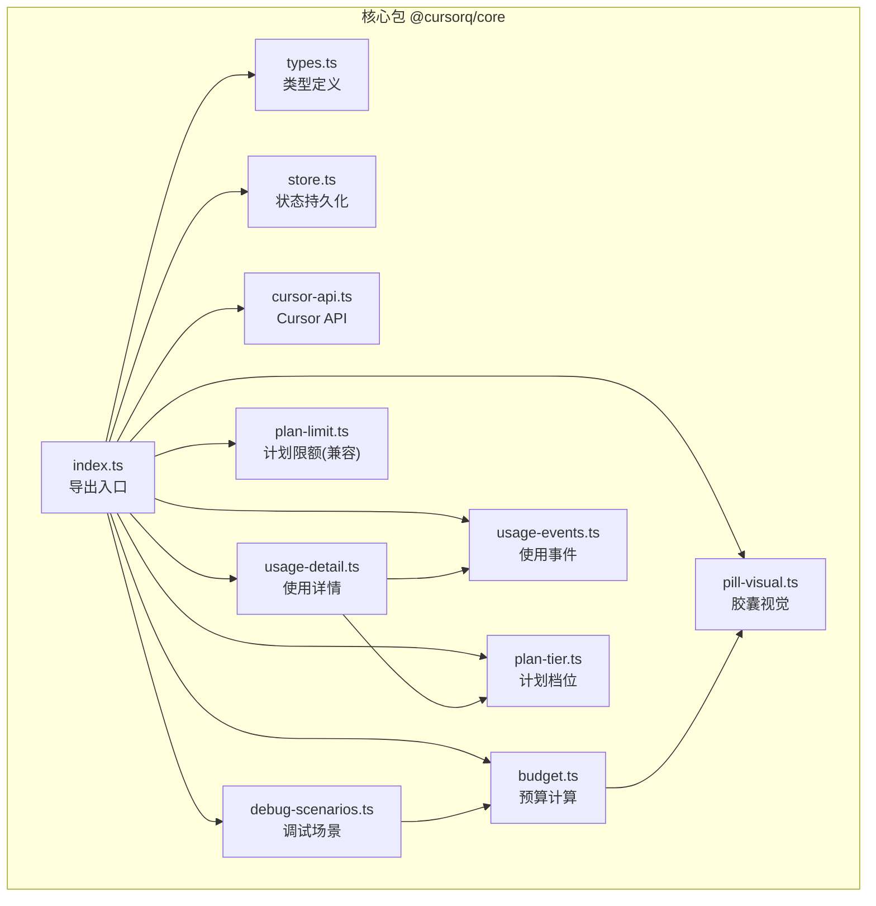
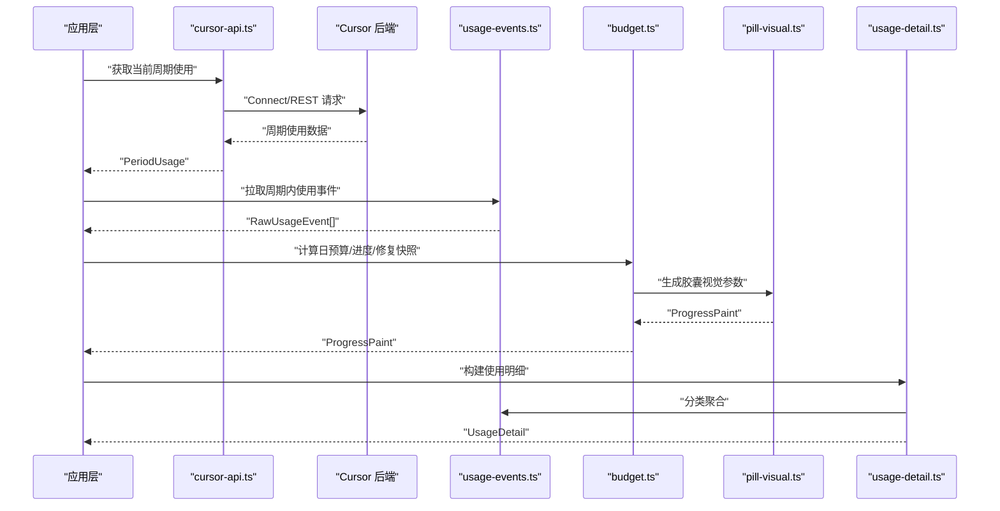
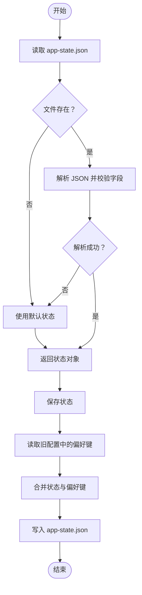
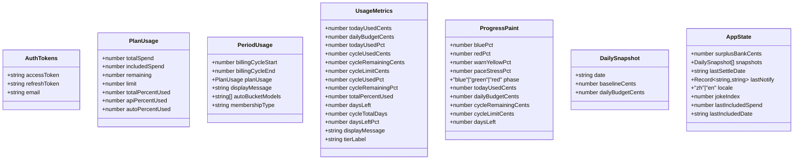
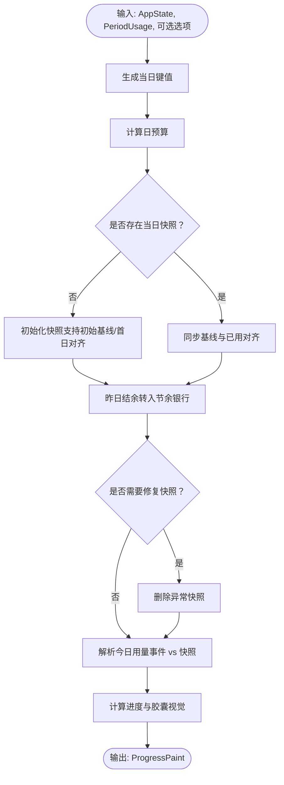
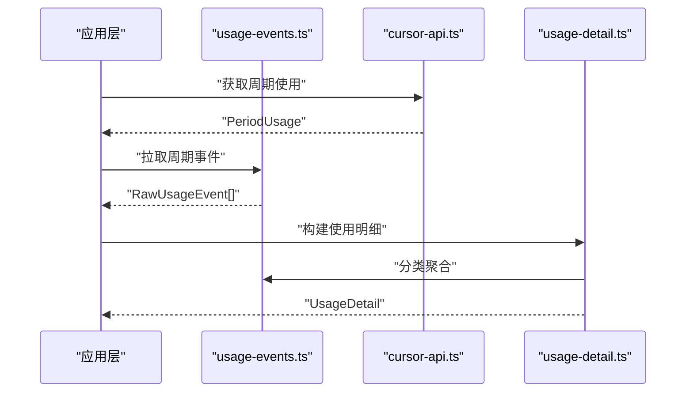
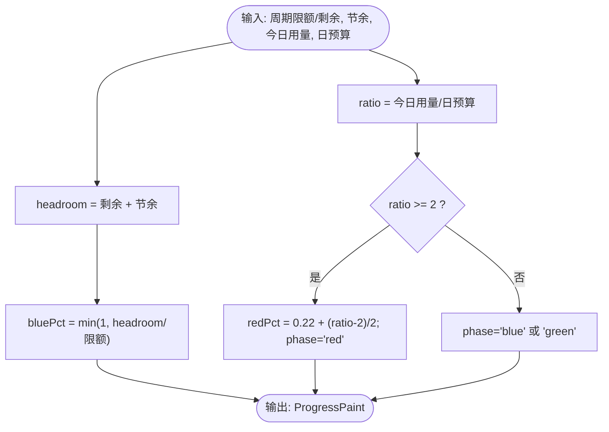
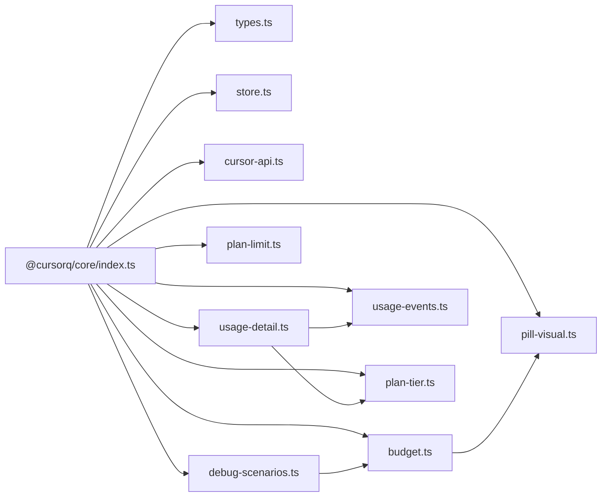

# 内部 API 接口

<cite>
**本文档引用的文件**
- [packages/core/src/index.ts](file://packages/core/src/index.ts)
- [packages/core/src/types.ts](file://packages/core/src/types.ts)
- [packages/core/src/store.ts](file://packages/core/src/store.ts)
- [packages/core/src/budget.ts](file://packages/core/src/budget.ts)
- [packages/core/src/usage-events.ts](file://packages/core/src/usage-events.ts)
- [packages/core/src/cursor-api.ts](file://packages/core/src/cursor-api.ts)
- [packages/core/src/pill-visual.ts](file://packages/core/src/pill-visual.ts)
- [packages/core/src/usage-detail.ts](file://packages/core/src/usage-detail.ts)
- [packages/core/src/plan-tier.ts](file://packages/core/src/plan-tier.ts)
- [packages/core/src/plan-limit.ts](file://packages/core/src/plan-limit.ts)
- [packages/core/src/debug-scenarios.ts](file://packages/core/src/debug-scenarios.ts)
- [packages/core/package.json](file://packages/core/package.json)
</cite>

## 目录
1. [简介](#简介)
2. [项目结构](#项目结构)
3. [核心组件](#核心组件)
4. [架构总览](#架构总览)
5. [详细组件分析](#详细组件分析)
6. [依赖关系分析](#依赖关系分析)
7. [性能考虑](#性能考虑)
8. [故障排除指南](#故障排除指南)
9. [结论](#结论)
10. [附录](#附录)

## 简介
本文件系统性梳理 CursorQ 应用内部使用的公共接口，涵盖以下方面：
- 状态管理接口：应用状态持久化与数据存储恢复
- 类型定义接口：数据模型规范与接口契约
- 核心功能接口：预算计算、使用统计、进度跟踪
- 版本控制、向后兼容性与扩展点说明

目标是为开发者提供清晰的接口规范、调用约定与生命周期管理指导，便于在前端或桌面端（Tauri）中正确集成与扩展。

## 项目结构
@cursorq/core 包采用模块化设计，按功能域划分文件：
- 类型定义：统一的数据模型与接口契约
- 状态管理：应用状态的加载与保存
- 预算计算：周期预算、日预算、进度计算与胶囊视觉
- 使用统计：使用事件抓取、聚合与可视化
- 计划信息：计划档位解析与限额展示
- 调试场景：用于测试与演示的预设场景

**图表来源**
- [packages/core/src/index.ts:1-35](file://packages/core/src/index.ts#L1-L35)
- [packages/core/src/types.ts:1-140](file://packages/core/src/types.ts#L1-L140)
- [packages/core/src/store.ts:1-55](file://packages/core/src/store.ts#L1-L55)
- [packages/core/src/budget.ts:1-274](file://packages/core/src/budget.ts#L1-L274)
- [packages/core/src/usage-events.ts:1-291](file://packages/core/src/usage-events.ts#L1-L291)
- [packages/core/src/cursor-api.ts:1-251](file://packages/core/src/cursor-api.ts#L1-L251)
- [packages/core/src/pill-visual.ts:1-79](file://packages/core/src/pill-visual.ts#L1-L79)
- [packages/core/src/usage-detail.ts:1-185](file://packages/core/src/usage-detail.ts#L1-L185)
- [packages/core/src/plan-tier.ts:1-27](file://packages/core/src/plan-tier.ts#L1-L27)
- [packages/core/src/plan-limit.ts:1-3](file://packages/core/src/plan-limit.ts#L1-L3)
- [packages/core/src/debug-scenarios.ts:1-89](file://packages/core/src/debug-scenarios.ts#L1-L89)

**章节来源**
- [packages/core/src/index.ts:1-35](file://packages/core/src/index.ts#L1-L35)
- [packages/core/src/types.ts:1-140](file://packages/core/src/types.ts#L1-L140)

## 核心组件
本节概述内部 API 的主要模块及其职责：
- 类型定义：统一的接口契约，确保前后端一致性
- 状态管理：应用状态的读取与写入，支持偏好键迁移
- 预算计算：周期预算、日预算、进度与胶囊视觉
- 使用统计：事件抓取、分类聚合与使用明细构建
- 计划信息：计划档位解析与限额展示
- 调试场景：用于验证与演示的预设场景

**章节来源**
- [packages/core/src/store.ts:1-55](file://packages/core/src/store.ts#L1-L55)
- [packages/core/src/budget.ts:1-274](file://packages/core/src/budget.ts#L1-L274)
- [packages/core/src/usage-events.ts:1-291](file://packages/core/src/usage-events.ts#L1-L291)
- [packages/core/src/usage-detail.ts:1-185](file://packages/core/src/usage-detail.ts#L1-L185)
- [packages/core/src/plan-tier.ts:1-27](file://packages/core/src/plan-tier.ts#L1-L27)
- [packages/core/src/debug-scenarios.ts:1-89](file://packages/core/src/debug-scenarios.ts#L1-L89)

## 架构总览
内部 API 的调用链路围绕“周期使用数据 + 事件数据 + 状态数据”展开，通过 Cursor API 获取周期使用情况，结合本地事件与状态进行预算与进度计算，并输出使用明细与胶囊视觉结果。

**图表来源**
- [packages/core/src/cursor-api.ts:173-217](file://packages/core/src/cursor-api.ts#L173-L217)
- [packages/core/src/usage-events.ts:166-186](file://packages/core/src/usage-events.ts#L166-L186)
- [packages/core/src/budget.ts:243-272](file://packages/core/src/budget.ts#L243-L272)
- [packages/core/src/pill-visual.ts:29-63](file://packages/core/src/pill-visual.ts#L29-L63)
- [packages/core/src/usage-detail.ts:104-180](file://packages/core/src/usage-detail.ts#L104-L180)

## 详细组件分析

### 状态管理接口
- 加载应用状态
  - 输入：数据目录路径
  - 输出：应用状态对象（包含节余资金、快照数组等）
  - 行为：若文件不存在或解析失败，回退到默认状态
- 保存应用状态
  - 输入：数据目录路径、状态对象
  - 输出：无（写入文件）
  - 行为：保留指定偏好键，合并新状态写入

**图表来源**
- [packages/core/src/store.ts:10-54](file://packages/core/src/store.ts#L10-L54)

**章节来源**
- [packages/core/src/store.ts:1-55](file://packages/core/src/store.ts#L1-L55)

### 类型定义接口
- 认证令牌：访问令牌、刷新令牌与可选邮箱
- 使用统计：周期使用、计划使用、使用明细、使用指标
- 进度画布：胶囊颜色与阶段、今日用量、日预算、周期剩余等
- 日常快照：日期、基线金额、日预算
- 小部件文案：两行文案与状态标识

**图表来源**
- [packages/core/src/types.ts:1-140](file://packages/core/src/types.ts#L1-L140)

**章节来源**
- [packages/core/src/types.ts:1-140](file://packages/core/src/types.ts#L1-L140)

### 核心功能接口

#### 预算计算接口
- 日期工具
  - 生成当日键值
  - 计算周期剩余天数、周期总天数
  - 计算公平日预算
- 日预算与节奏
  - 基于剩余金额与剩余天数计算日预算
  - 计算节奏压力（仅面板参考）
- 昨日结余
  - 将昨日未超支部分转入节余资金银行
  - 支持周末豁免逻辑
- 快照管理
  - 确保当日快照存在（支持初始基线与首日对齐）
  - 同步当日基线与已用金额对齐
  - 修复异常的当日快照
- 今日用量解析
  - 合并“快照增量”与“当日事件汇总”，在异常情况下优先信任快照
- 进度计算
  - 综合周期剩余、日预算、节余资金与节奏压力，生成胶囊视觉参数

**图表来源**
- [packages/core/src/budget.ts:102-147](file://packages/core/src/budget.ts#L102-L147)
- [packages/core/src/budget.ts:194-236](file://packages/core/src/budget.ts#L194-L236)
- [packages/core/src/budget.ts:243-272](file://packages/core/src/budget.ts#L243-L272)

**章节来源**
- [packages/core/src/budget.ts:1-274](file://packages/core/src/budget.ts#L1-L274)

#### 使用统计接口
- 使用事件抓取
  - 拉取周期内使用事件
  - 拉取当日计费事件（避免整周期汇总偏高）
  - 解析事件时间戳、令牌用量与计费金额
- 分类聚合
  - 自动模型桶识别
  - 按模型聚合令牌用量与权重
  - 按 API/Auto 分类分配百分比
- 使用明细构建
  - 计算使用指标（今日/周期用量、剩余、百分比等）
  - 生成使用明细对象（计划名、周期起止、分类、指标）

**图表来源**
- [packages/core/src/usage-events.ts:166-186](file://packages/core/src/usage-events.ts#L166-L186)
- [packages/core/src/usage-events.ts:192-290](file://packages/core/src/usage-events.ts#L192-L290)
- [packages/core/src/usage-detail.ts:104-180](file://packages/core/src/usage-detail.ts#L104-L180)

**章节来源**
- [packages/core/src/usage-events.ts:1-291](file://packages/core/src/usage-events.ts#L1-L291)
- [packages/core/src/usage-detail.ts:1-185](file://packages/core/src/usage-detail.ts#L1-L185)

#### 胶囊视觉接口
- 胶囊颜色规则
  - 蓝色：剩余 + 节余资金足够覆盖额度
  - 红色：今日用量 ≥ 2 × 日预算
  - 绿色：剩余不足且无超支
- 进度参数
  - 蓝/红比例、节奏压力、阶段、今日用量、日预算、周期剩余、周期限额、剩余天数

**图表来源**
- [packages/core/src/pill-visual.ts:29-63](file://packages/core/src/pill-visual.ts#L29-L63)

**章节来源**
- [packages/core/src/pill-visual.ts:1-79](file://packages/core/src/pill-visual.ts#L1-L79)

#### 计划档位与限额
- 档位解析：根据计划名称、会员类型与限额阈值解析展示档位
- 限额兼容：保留旧导出以维持向后兼容

**章节来源**
- [packages/core/src/plan-tier.ts:1-27](file://packages/core/src/plan-tier.ts#L1-L27)
- [packages/core/src/plan-limit.ts:1-3](file://packages/core/src/plan-limit.ts#L1-L3)

#### 调试场景
- 提供“节日”“完成今日”“超支”三种典型场景
- 固定基准时刻与周期范围，便于测试与演示

**章节来源**
- [packages/core/src/debug-scenarios.ts:1-89](file://packages/core/src/debug-scenarios.ts#L1-L89)

## 依赖关系分析
- 导出入口集中管理各模块导出，便于上层统一导入
- 预算模块依赖胶囊视觉模块生成进度画布
- 使用明细模块依赖使用事件与计划档位模块
- 调试场景模块依赖预算模块进行进度计算

**图表来源**
- [packages/core/src/index.ts:1-35](file://packages/core/src/index.ts#L1-L35)

**章节来源**
- [packages/core/src/index.ts:1-35](file://packages/core/src/index.ts#L1-L35)

## 性能考虑
- 事件拉取分页与最大页数限制，避免一次性请求过大
- 今日用量解析时对异常事件汇总进行保护，优先信任快照
- 日预算基于剩余金额与剩余天数动态计算，减少误差累积
- 使用明细构建支持可选事件拉取，提升刷新速度

[本节为通用建议，无需特定文件来源]

## 故障排除指南
- 状态加载失败
  - 现象：应用启动时状态异常
  - 处理：检查 app-state.json 文件完整性；若损坏则回退默认状态
- 今日用量异常偏高
  - 现象：今日用量远超日预算
  - 处理：启用修复逻辑，移除异常快照并重新对齐
- 胶囊颜色不正确
  - 现象：超支未变红或正常未变蓝
  - 处理：确认日预算与今日用量计算；检查节奏压力与节余资金
- 使用明细为空
  - 现象：分类与指标缺失
  - 处理：尝试禁用事件拉取直接使用 API 百分比；或检查网络与认证

**章节来源**
- [packages/core/src/store.ts:10-28](file://packages/core/src/store.ts#L10-L28)
- [packages/core/src/budget.ts:194-236](file://packages/core/src/budget.ts#L194-L236)
- [packages/core/src/pill-visual.ts:29-63](file://packages/core/src/pill-visual.ts#L29-L63)
- [packages/core/src/usage-detail.ts:104-180](file://packages/core/src/usage-detail.ts#L104-L180)

## 结论
@cursorq/core 内部 API 通过清晰的类型定义与模块化设计，提供了稳定的状态管理、预算计算与使用统计能力。其接口具备良好的扩展性与向后兼容性，适合在桌面端与前端环境中复用。建议在集成时遵循统一的调用顺序与错误处理策略，确保数据一致性与用户体验。

[本节为总结性内容，无需特定文件来源]

## 附录

### 版本控制与兼容性
- 包版本：0.1.0
- 导出入口：标准 ES Module 导出，支持浏览器子路径导出
- 兼容性：保留计划限额导出别名，避免旧导入断链

**章节来源**
- [packages/core/package.json:1-32](file://packages/core/package.json#L1-L32)