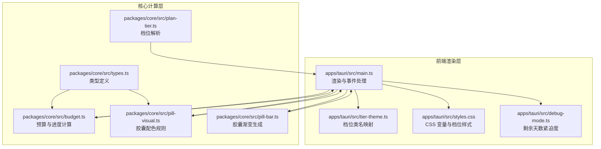
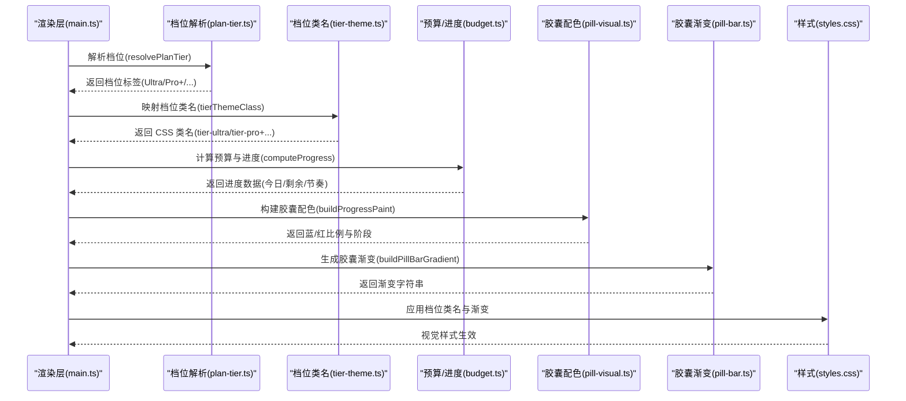
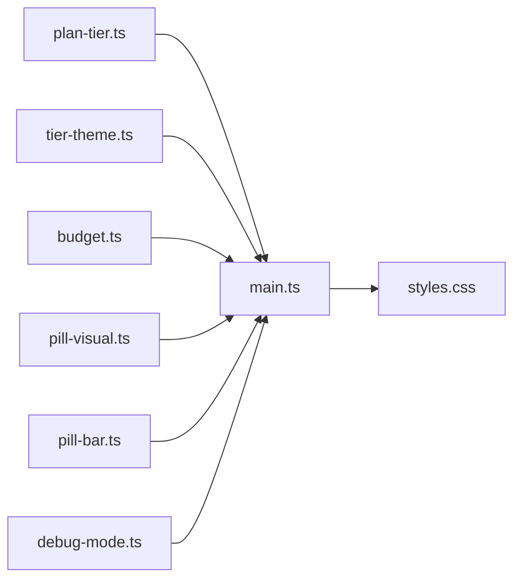

# 主题系统

<cite>
**本文引用的文件**
- [apps/tauri/src/tier-theme.ts](file://apps/tauri/src/tier-theme.ts)
- [packages/core/src/plan-tier.ts](file://packages/core/src/plan-tier.ts)
- [packages/core/src/budget.ts](file://packages/core/src/budget.ts)
- [packages/core/src/pill-visual.ts](file://packages/core/src/pill-visual.ts)
- [packages/core/src/pill-bar.ts](file://packages/core/src/pill-bar.ts)
- [apps/tauri/src/styles.css](file://apps/tauri/src/styles.css)
- [apps/tauri/src/main.ts](file://apps/tauri/src/main.ts)
- [packages/core/src/types.ts](file://packages/core/src/types.ts)
- [apps/tauri/src/debug-mode.ts](file://apps/tauri/src/debug-mode.ts)
</cite>

## 目录
1. [简介](#简介)
2. [项目结构](#项目结构)
3. [核心组件](#核心组件)
4. [架构总览](#架构总览)
5. [组件详解](#组件详解)
6. [依赖关系分析](#依赖关系分析)
7. [性能考量](#性能考量)
8. [故障排查指南](#故障排查指南)
9. [结论](#结论)
10. [附录](#附录)

## 简介
本文件系统化阐述 CursorQ 的“基于计划层级（Tier）的主题颜色系统”。该系统通过“计划档位”映射到统一的 CSS 类名，再结合预算状态、使用进度与紧急程度，实现动态的主题切换与视觉反馈。核心要点包括：
- 基于计划名称与用量限制的档位解析
- 将档位映射为主题类名（如 tier-pro、tier-ultra 等）
- 使用 CSS 变量与线性渐变定义颜色体系
- 结合胶囊进度（蓝/绿/红）与剩余天数紧迫度，形成多维度视觉提示
- 支持响应式布局与可访问性（对比度、阴影、文本阴影等）

## 项目结构
主题系统涉及前端样式层与核心计算层的协作：
- 前端渲染层：负责根据档位类名应用样式，并将预算与进度信息转化为 UI
- 核心计算层：负责档位解析、预算与进度计算、胶囊配色构建
- 样式层：集中管理 CSS 变量与各档位的视觉样式

图表来源
- [apps/tauri/src/main.ts:1-711](file://apps/tauri/src/main.ts#L1-L711)
- [apps/tauri/src/tier-theme.ts:1-14](file://apps/tauri/src/tier-theme.ts#L1-L14)
- [apps/tauri/src/styles.css:1-585](file://apps/tauri/src/styles.css#L1-L585)
- [apps/tauri/src/debug-mode.ts:140-189](file://apps/tauri/src/debug-mode.ts#L140-L189)
- [packages/core/src/plan-tier.ts:1-27](file://packages/core/src/plan-tier.ts#L1-L27)
- [packages/core/src/budget.ts:1-274](file://packages/core/src/budget.ts#L1-L274)
- [packages/core/src/pill-visual.ts:1-79](file://packages/core/src/pill-visual.ts#L1-L79)
- [packages/core/src/pill-bar.ts:1-22](file://packages/core/src/pill-bar.ts#L1-L22)
- [packages/core/src/types.ts:1-140](file://packages/core/src/types.ts#L1-L140)

章节来源
- [apps/tauri/src/main.ts:1-711](file://apps/tauri/src/main.ts#L1-L711)
- [apps/tauri/src/tier-theme.ts:1-14](file://apps/tauri/src/tier-theme.ts#L1-L14)
- [apps/tauri/src/styles.css:1-585](file://apps/tauri/src/styles.css#L1-L585)
- [apps/tauri/src/debug-mode.ts:140-189](file://apps/tauri/src/debug-mode.ts#L140-L189)
- [packages/core/src/plan-tier.ts:1-27](file://packages/core/src/plan-tier.ts#L1-L27)
- [packages/core/src/budget.ts:1-274](file://packages/core/src/budget.ts#L1-L274)
- [packages/core/src/pill-visual.ts:1-79](file://packages/core/src/pill-visual.ts#L1-L79)
- [packages/core/src/pill-bar.ts:1-22](file://packages/core/src/pill-bar.ts#L1-L22)
- [packages/core/src/types.ts:1-140](file://packages/core/src/types.ts#L1-L140)

## 核心组件
- 档位类名映射器：将计划名称字符串标准化并映射为统一的 CSS 类名（如 tier-pro、tier-ultra 等）
- 档位解析器：综合计划名称与用量限制，确定档位标签（如 Ultra、Pro+、Pro、Teams、Enterprise、Hobby）
- 预算与进度计算：计算日预算、剩余天数、周期节奏压力等指标
- 胶囊配色与渐变：根据蓝/红比例与今日超额阈值生成胶囊渐变
- 样式表：集中定义 CSS 变量与各档位的文本色、进度条渐变等

章节来源
- [apps/tauri/src/tier-theme.ts:1-14](file://apps/tauri/src/tier-theme.ts#L1-L14)
- [packages/core/src/plan-tier.ts:1-27](file://packages/core/src/plan-tier.ts#L1-L27)
- [packages/core/src/budget.ts:1-274](file://packages/core/src/budget.ts#L1-L274)
- [packages/core/src/pill-visual.ts:1-79](file://packages/core/src/pill-visual.ts#L1-L79)
- [packages/core/src/pill-bar.ts:1-22](file://packages/core/src/pill-bar.ts#L1-L22)
- [apps/tauri/src/styles.css:1-585](file://apps/tauri/src/styles.css#L1-L585)

## 架构总览
主题系统围绕“档位”这一核心概念，将计划信息与视觉表现解耦：
- 输入：计划名称、会员类型、周期用量、日预算、剩余天数
- 处理：档位解析 → 档位类名映射 → 进度与胶囊配色计算
- 输出：UI 组件应用对应的 CSS 类与渐变，呈现档位专属色彩与紧迫度提示

图表来源
- [apps/tauri/src/main.ts:216-278](file://apps/tauri/src/main.ts#L216-L278)
- [packages/core/src/plan-tier.ts:4-26](file://packages/core/src/plan-tier.ts#L4-L26)
- [apps/tauri/src/tier-theme.ts:2-13](file://apps/tauri/src/tier-theme.ts#L2-L13)
- [packages/core/src/budget.ts:243-272](file://packages/core/src/budget.ts#L243-L272)
- [packages/core/src/pill-visual.ts:29-63](file://packages/core/src/pill-visual.ts#L29-L63)
- [packages/core/src/pill-bar.ts:8-22](file://packages/core/src/pill-bar.ts#L8-L22)
- [apps/tauri/src/styles.css:194-413](file://apps/tauri/src/styles.css#L194-L413)

## 组件详解

### 档位类名映射器（tier-theme.ts）
- 功能：将输入的计划名称标准化后，映射到一组固定的 CSS 类名，确保 UI 侧样式一致性
- 关键行为：
  - 忽略大小写与前后空格
  - 包含关键字的匹配优先级：Ultra > Pro+ > Enterprise > Teams/Business > Pro > Hobby/Free，默认为默认档位
- 典型输出：tier-ultra、tier-proplus、tier-enterprise、tier-teams、tier-pro、tier-hobby、tier-default

章节来源
- [apps/tauri/src/tier-theme.ts:1-14](file://apps/tauri/src/tier-theme.ts#L1-L14)

### 档位解析器（plan-tier.ts）
- 功能：根据计划信息与周期用量，推导出最终的档位标签
- 关键逻辑：
  - 名称关键字匹配（Enterprise、Team/Business、Ultra、Pro+、Hobby/Free、Pro）
  - 若名称无法判定，则依据周期用量上限进行回退判定（Ultra/Pro+/Pro）
- 输出：用于 UI 展示的档位标签字符串

章节来源
- [packages/core/src/plan-tier.ts:1-27](file://packages/core/src/plan-tier.ts#L1-L27)

### 预算与进度计算（budget.ts）
- 功能：提供预算、节奏与进度相关的计算函数
- 关键能力：
  - 日预算计算、剩余天数、周期节奏压力
  - 今日超额判断、快照对齐与修复
  - 与胶囊配色输入（ProgressPaint）对接
- 与主题系统关联：
  - 通过 computeProgress 产出的进度数据决定胶囊渐变与面板条样式

章节来源
- [packages/core/src/budget.ts:1-274](file://packages/core/src/budget.ts#L1-L274)

### 胶囊配色与渐变（pill-visual.ts、pill-bar.ts）
- 功能：定义胶囊的配色规则与渐变生成
- 关键规则：
  - 蓝色比例：由“剩余 + 节余 / 额度”决定
  - 红色阈值：今日用量 ≥ 2 × 日预算 时出现红色
  - 渐变策略：无红时为绿→蓝→白的过渡；有红时为红→橙→绿的过渡
- 与主题系统关联：
  - 胶囊颜色与档位类名共同构成“总量/节奏/日用量”的三维视觉反馈

章节来源
- [packages/core/src/pill-visual.ts:1-79](file://packages/core/src/pill-visual.ts#L1-L79)
- [packages/core/src/pill-bar.ts:1-22](file://packages/core/src/pill-bar.ts#L1-L22)

### 样式组织与档位视觉（styles.css）
- CSS 变量：统一管理尺寸、背景、文字、强调色与渐变
- 档位样式：
  - 文本色：panel-tier.* 定义各档位的文本颜色与阴影
  - 进度条渐变：metric-fill.* 定义各档位的进度条渐变
  - 胶囊条：pill-bar 的背景色与渐变由 JS 动态注入
- 响应式与可访问性：
  - 圆角与剪裁、文本阴影增强可读性
  - 禁用动画与过渡以避免 WebView 重绘问题

章节来源
- [apps/tauri/src/styles.css:1-585](file://apps/tauri/src/styles.css#L1-L585)

### 渲染与动态更新（main.ts）
- 功能：接收后端数据，计算并应用主题样式
- 关键流程：
  - 从 payload 提取档位标签或计划名称
  - 调用 tierThemeClass 生成档位类名
  - 应用到 panel-tier 与各 metric 的进度条
  - 通过 buildPillBarGradient 生成胶囊渐变并应用到 pill-bar
- 与调试模式联动：在调试模式下，使用 debug-mode 的剩余天数紧迫度计算替代真实数据

章节来源
- [apps/tauri/src/main.ts:216-278](file://apps/tauri/src/main.ts#L216-L278)
- [apps/tauri/src/main.ts:430-461](file://apps/tauri/src/main.ts#L430-L461)
- [apps/tauri/src/main.ts:174-188](file://apps/tauri/src/main.ts#L174-L188)

### 剩余天数紧迫度（debug-mode.ts）
- 功能：将“剩余天数占比”转换为“紧迫度百分比”，并映射到不同的进度条样式类别（days-calm/days-mid/days-urgent）
- 与主题系统关联：面板“剩余天数”条采用档位类名与紧迫度样式组合，形成“档位色 + 紧迫度色”的双重提示

章节来源
- [apps/tauri/src/debug-mode.ts:140-189](file://apps/tauri/src/debug-mode.ts#L140-L189)

### 数据模型与类型（types.ts）
- 功能：定义计划、周期用量、进度画布、应用状态等核心类型
- 与主题系统关联：为档位解析、预算计算与渲染提供类型安全的数据契约

章节来源
- [packages/core/src/types.ts:1-140](file://packages/core/src/types.ts#L1-L140)

## 依赖关系分析
- tier-theme.ts 与 plan-tier.ts 的输出共同决定 UI 的档位类名
- main.ts 依赖 tier-theme.ts 与 budget.ts/pill-visual.ts/pill-bar.ts 的计算结果
- styles.css 依赖 main.ts 注入的类名与内联样式
- debug-mode.ts 为 main.ts 在调试场景下的输入提供替代

图表来源
- [packages/core/src/plan-tier.ts:1-27](file://packages/core/src/plan-tier.ts#L1-L27)
- [apps/tauri/src/tier-theme.ts:1-14](file://apps/tauri/src/tier-theme.ts#L1-L14)
- [packages/core/src/budget.ts:1-274](file://packages/core/src/budget.ts#L1-L274)
- [packages/core/src/pill-visual.ts:1-79](file://packages/core/src/pill-visual.ts#L1-L79)
- [packages/core/src/pill-bar.ts:1-22](file://packages/core/src/pill-bar.ts#L1-L22)
- [apps/tauri/src/main.ts:1-711](file://apps/tauri/src/main.ts#L1-L711)
- [apps/tauri/src/styles.css:1-585](file://apps/tauri/src/styles.css#L1-L585)
- [apps/tauri/src/debug-mode.ts:140-189](file://apps/tauri/src/debug-mode.ts#L140-L189)

## 性能考量
- 减少重绘与闪烁：禁用动画与过渡，避免 WebView 在窗口调整时产生白边
- 渐变计算本地化：胶囊渐变在 JS 侧生成并直接注入内联样式，减少 DOM 查询与样式回流
- 选择器简单高效：档位样式通过单一类名组合，便于快速匹配与更新
- 调试模式隔离：调试场景下的计算与渲染与主流程解耦，避免影响生产路径

章节来源
- [apps/tauri/src/styles.css:18-24](file://apps/tauri/src/styles.css#L18-L24)
- [apps/tauri/src/main.ts:174-188](file://apps/tauri/src/main.ts#L174-L188)

## 故障排查指南
- 档位类名未生效
  - 检查输入的计划名称是否包含预期关键字，或是否命中回退逻辑
  - 确认 main.ts 中是否正确调用 tierThemeClass 并应用到元素类名
- 胶囊颜色不符合预期
  - 核对今日用量与日预算的比例是否达到 2 倍阈值
  - 检查蓝/红比例计算与渐变生成逻辑
- 进度条样式异常
  - 确认 metric-fill 的样式类与档位类名是否同时存在
  - 检查 styles.css 中对应档位的渐变定义是否存在
- 调试模式下显示不一致
  - 确认 debug-mode 的 daysUrgencyPct 与 daysUrgencyTone 的映射逻辑

章节来源
- [apps/tauri/src/main.ts:216-278](file://apps/tauri/src/main.ts#L216-L278)
- [packages/core/src/pill-visual.ts:29-63](file://packages/core/src/pill-visual.ts#L29-L63)
- [packages/core/src/pill-bar.ts:8-22](file://packages/core/src/pill-bar.ts#L8-L22)
- [apps/tauri/src/styles.css:390-413](file://apps/tauri/src/styles.css#L390-L413)
- [apps/tauri/src/debug-mode.ts:140-189](file://apps/tauri/src/debug-mode.ts#L140-L189)

## 结论
CursorQ 的主题系统以“档位”为核心纽带，将计划信息、预算状态与紧急程度三者融合，通过统一的 CSS 类名与渐变策略，实现了稳定、直观且富有层次感的视觉反馈。该系统在保证性能与可维护性的同时，兼顾了响应式与可访问性需求，适合在多种终端环境中稳定运行。

## 附录

### 档位与颜色映射速览
- Ultra：panel-tier.tier-ultra（文本色与发光）；metric-fill.tier-ultra（渐变）
- Pro+：panel-tier.tier-proplus；metric-fill.tier-proplus
- Pro：panel-tier.tier-pro；metric-fill.tier-pro
- Teams/Business：panel-tier.tier-teams；metric-fill.tier-teams
- Enterprise：panel-tier.tier-enterprise；metric-fill.tier-enterprise
- Hobby/Free：panel-tier.tier-hobby；metric-fill.tier-hobby
- 默认：panel-tier.tier-default；metric-fill.tier-default

章节来源
- [apps/tauri/src/styles.css:194-413](file://apps/tauri/src/styles.css#L194-L413)

### 代码示例路径（不展示具体代码内容）
- 档位类名映射：[apps/tauri/src/tier-theme.ts:2-13](file://apps/tauri/src/tier-theme.ts#L2-L13)
- 档位解析：[packages/core/src/plan-tier.ts:4-26](file://packages/core/src/plan-tier.ts#L4-L26)
- 预算与进度计算：[packages/core/src/budget.ts:243-272](file://packages/core/src/budget.ts#L243-L272)
- 胶囊配色规则：[packages/core/src/pill-visual.ts:29-63](file://packages/core/src/pill-visual.ts#L29-L63)
- 胶囊渐变生成：[packages/core/src/pill-bar.ts:8-22](file://packages/core/src/pill-bar.ts#L8-L22)
- 渲染与动态样式更新：[apps/tauri/src/main.ts:216-278](file://apps/tauri/src/main.ts#L216-L278)