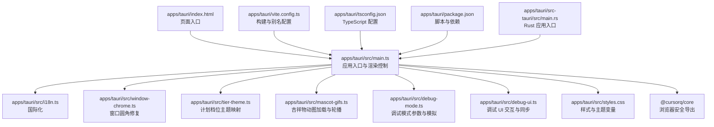
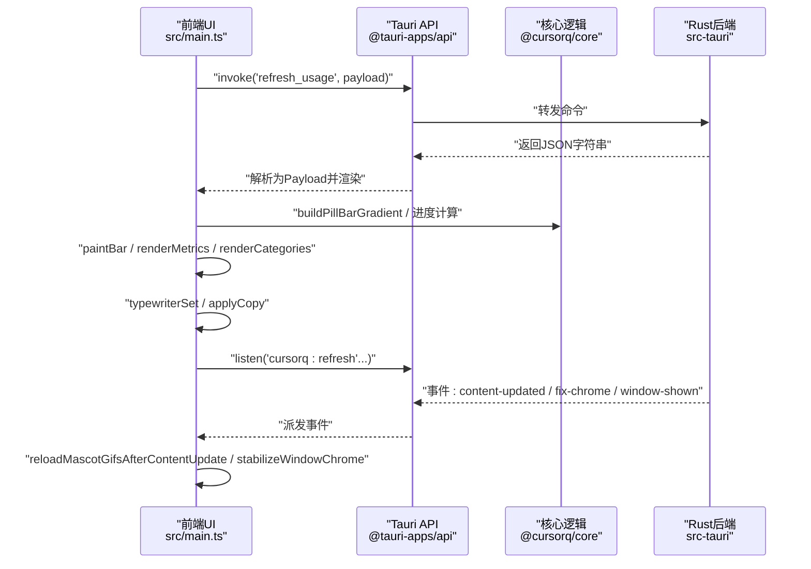
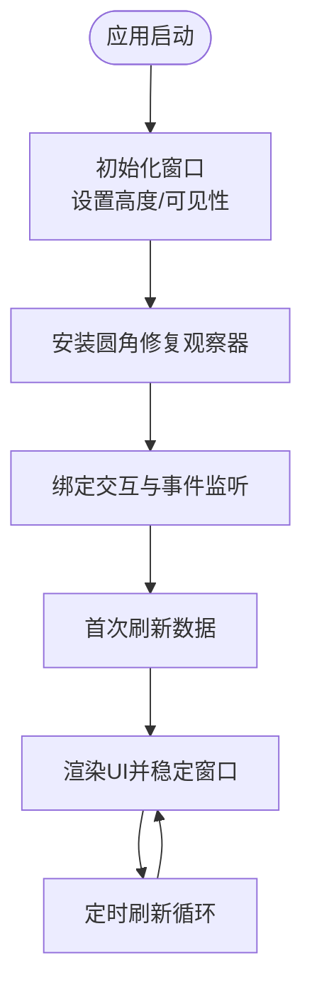
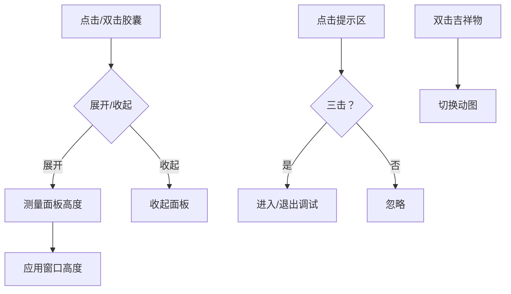
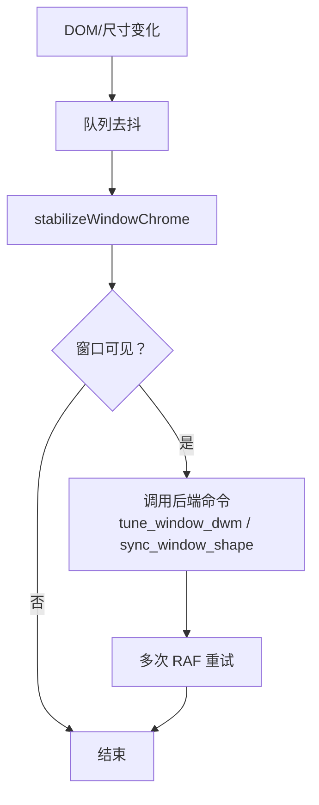
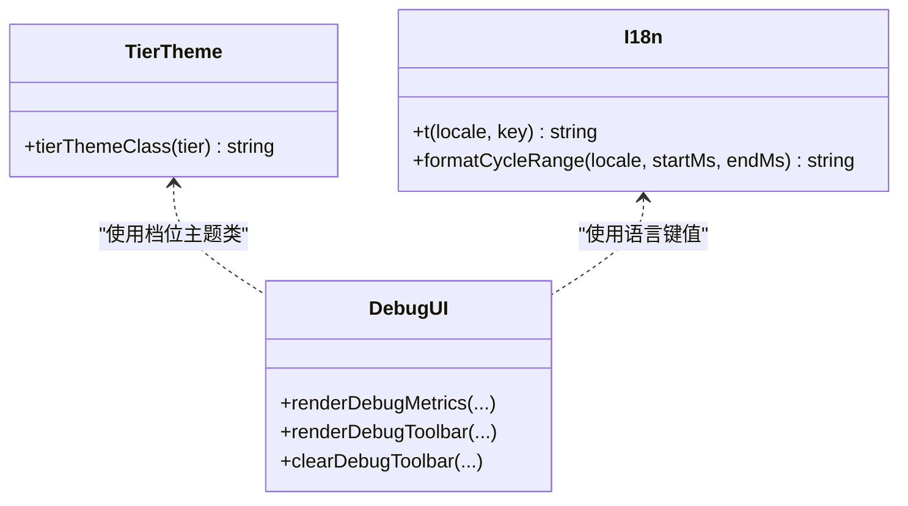
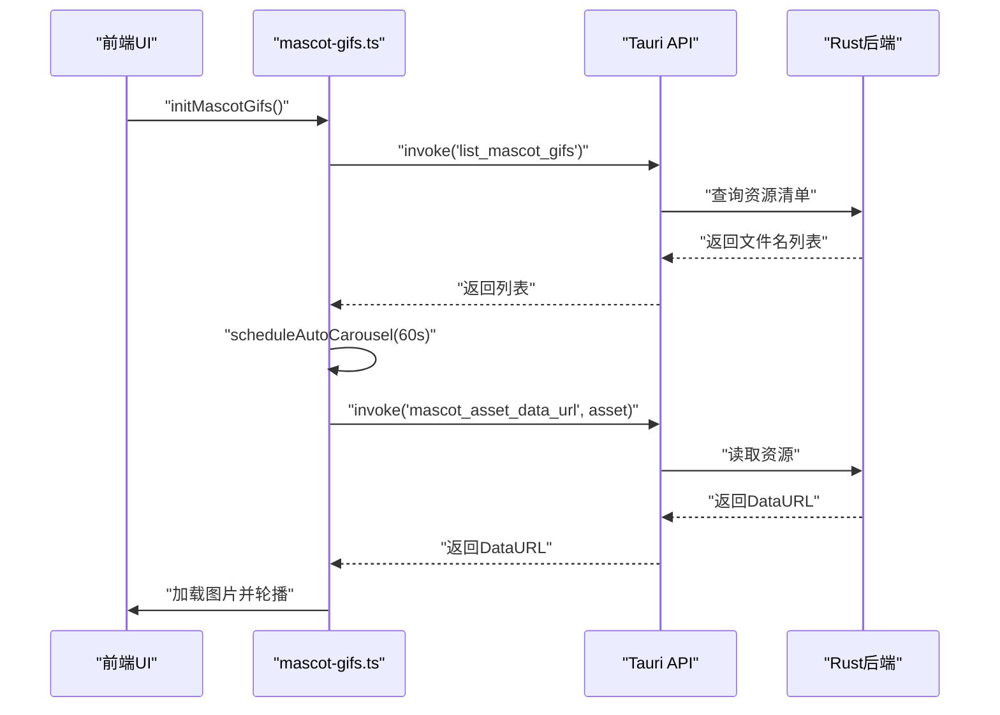
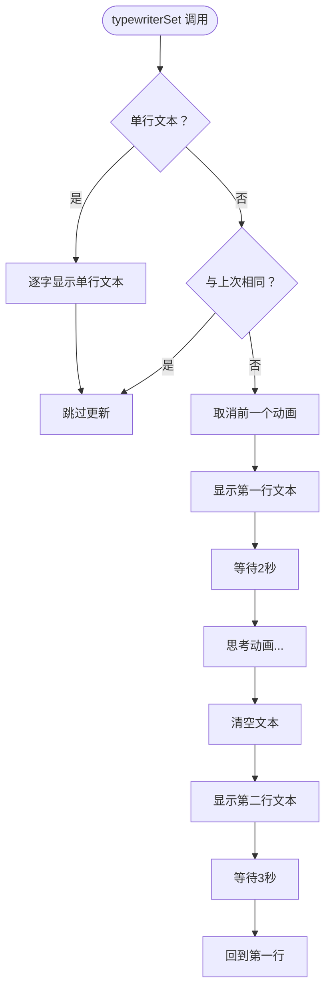
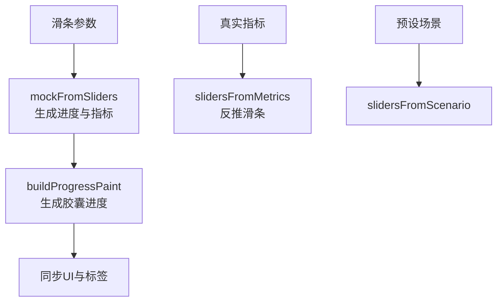
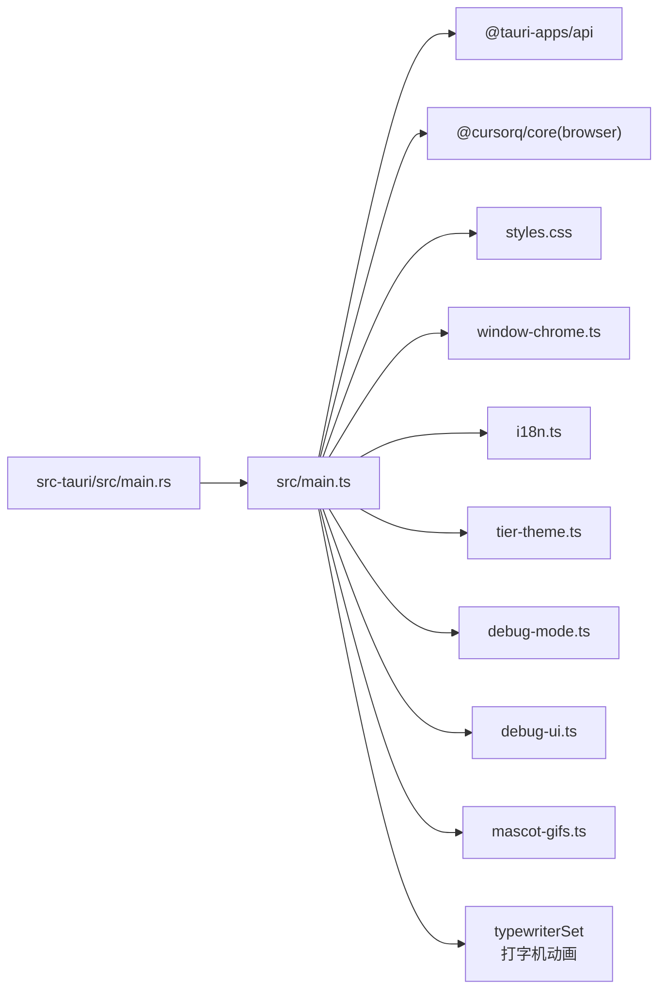

# 前端架构

<cite>
**本文引用的文件**
- [apps/tauri/src/main.ts](file://apps/tauri/src/main.ts)
- [apps/tauri/src/i18n.ts](file://apps/tauri/src/i18n.ts)
- [apps/tauri/src/window-chrome.ts](file://apps/tauri/src/window-chrome.ts)
- [apps/tauri/src/tier-theme.ts](file://apps/tauri/src/tier-theme.ts)
- [apps/tauri/src/styles.css](file://apps/tauri/src/styles.css)
- [apps/tauri/src/mascot-gifs.ts](file://apps/tauri/src/mascot-gifs.ts)
- [apps/tauri/src/debug-mode.ts](file://apps/tauri/src/debug-mode.ts)
- [apps/tauri/src/debug-ui.ts](file://apps/tauri/src/debug-ui.ts)
- [apps/tauri/index.html](file://apps/tauri/index.html)
- [apps/tauri/vite.config.ts](file://apps/tauri/vite.config.ts)
- [apps/tauri/tsconfig.json](file://apps/tauri/tsconfig.json)
- [apps/tauri/package.json](file://apps/tauri/package.json)
- [apps/tauri/src-tauri/src/main.rs](file://apps/tauri/src-tauri/src/main.rs)
- [packages/core/src/index.ts](file://packages/core/src/index.ts)
- [packages/core/src/browser.ts](file://packages/core/src/browser.ts)
</cite>

## 目录
1. [简介](#简介)
2. [项目结构](#项目结构)
3. [核心组件](#核心组件)
4. [架构总览](#架构总览)
5. [组件详解](#组件详解)
6. [依赖关系分析](#依赖关系分析)
7. [性能考量](#性能考量)
8. [故障排查指南](#故障排查指南)
9. [结论](#结论)
10. [附录](#附录)

## 简介
本文件面向 CursorQ 的前端架构，聚焦于基于 Tauri 2 的桌面应用前端实现。内容涵盖应用启动流程、主界面布局、窗口管理机制、主题系统与国际化支持；解释 TypeScript 前端与 Rust 后端通过 Tauri 命令接口的通信方式；阐述状态管理模式、组件设计原则与样式系统；并提供构建配置、资源管理策略与性能优化建议。文中所有技术细节均以仓库源码为依据，并通过"章节来源"与"图表来源"标注具体出处。

## 项目结构
前端位于 apps/tauri，采用 Vite + TypeScript 构建，HTML 入口为 index.html，入口脚本为 src/main.ts。样式集中于 src/styles.css，国际化、窗口圆角修复、主题映射、吉祥物动图等子模块分别在独立文件中实现。核心业务逻辑与浏览器安全导出由 packages/core 提供，前端通过别名 @cursorq/core 引用其 browser 导出。

图表来源
- [apps/tauri/index.html:1-46](file://apps/tauri/index.html#L1-L46)
- [apps/tauri/src/main.ts:1-711](file://apps/tauri/src/main.ts#L1-L711)
- [apps/tauri/src/i18n.ts:1-89](file://apps/tauri/src/i18n.ts#L1-L89)
- [apps/tauri/src/window-chrome.ts:1-99](file://apps/tauri/src/window-chrome.ts#L1-L99)
- [apps/tauri/src/tier-theme.ts:1-14](file://apps/tauri/src/tier-theme.ts#L1-L14)
- [apps/tauri/src/mascot-gifs.ts:1-164](file://apps/tauri/src/mascot-gifs.ts#L1-L164)
- [apps/tauri/src/debug-mode.ts:1-190](file://apps/tauri/src/debug-mode.ts#L1-L190)
- [apps/tauri/src/debug-ui.ts:1-221](file://apps/tauri/src/debug-ui.ts#L1-L221)
- [apps/tauri/src/styles.css:1-585](file://apps/tauri/src/styles.css#L1-L585)
- [apps/tauri/vite.config.ts:1-21](file://apps/tauri/vite.config.ts#L1-L21)
- [apps/tauri/tsconfig.json:1-12](file://apps/tauri/tsconfig.json#L1-L12)
- [apps/tauri/package.json:1-22](file://apps/tauri/package.json#L1-L22)
- [apps/tauri/src-tauri/src/main.rs:1-6](file://apps/tauri/src-tauri/src/main.rs#L1-L6)
- [packages/core/src/index.ts:1-35](file://packages/core/src/index.ts#L1-L35)
- [packages/core/src/browser.ts:1-21](file://packages/core/src/browser.ts#L1-L21)

章节来源
- [apps/tauri/index.html:1-46](file://apps/tauri/index.html#L1-L46)
- [apps/tauri/vite.config.ts:1-21](file://apps/tauri/vite.config.ts#L1-L21)
- [apps/tauri/tsconfig.json:1-12](file://apps/tauri/tsconfig.json#L1-L12)
- [apps/tauri/package.json:1-22](file://apps/tauri/package.json#L1-L22)

## 核心组件
- 应用入口与渲染管线：负责初始化窗口、绑定交互、监听事件、调用后端命令、渲染数据与更新 UI。
- 国际化模块：提供中英文键值映射与日期范围格式化工具。
- 窗口圆角修复：统一处理 WebView/DOM 变化导致的白边问题，保证胶囊窗口视觉一致性。
- 主题映射：根据计划档位动态选择 CSS 类，实现颜色与阴影风格差异化。
- 吉祥物动图：按资源清单异步加载动图，支持开发环境回退与定时轮播。
- **打字机动画系统**：实现逐字显示、思考动画和循环播放的文本渲染效果。
- 调试模式：提供滑条与预设场景，驱动进度条与指标面板的可视化调试。
- 样式系统：以 CSS 变量为中心的主题体系，禁用动画与过渡以避免 WebView 重绘白边。

章节来源
- [apps/tauri/src/main.ts:1-711](file://apps/tauri/src/main.ts#L1-L711)
- [apps/tauri/src/i18n.ts:1-89](file://apps/tauri/src/i18n.ts#L1-L89)
- [apps/tauri/src/window-chrome.ts:1-99](file://apps/tauri/src/window-chrome.ts#L1-L99)
- [apps/tauri/src/tier-theme.ts:1-14](file://apps/tauri/src/tier-theme.ts#L1-L14)
- [apps/tauri/src/mascot-gifs.ts:1-164](file://apps/tauri/src/mascot-gifs.ts#L1-L164)
- [apps/tauri/src/debug-mode.ts:1-190](file://apps/tauri/src/debug-mode.ts#L1-L190)
- [apps/tauri/src/debug-ui.ts:1-221](file://apps/tauri/src/debug-ui.ts#L1-L221)
- [apps/tauri/src/styles.css:1-585](file://apps/tauri/src/styles.css#L1-L585)

## 架构总览
前端通过 Tauri 命令与 Rust 后端通信，使用 invoke 调用后端能力，使用 listen 订阅后端事件。渲染层以 src/main.ts 为核心，结合 @cursorq/core 的浏览器安全导出进行进度计算与可视化。窗口管理由 window-chrome 模块统一修复，样式系统以 CSS 变量与主题类实现。

图表来源
- [apps/tauri/src/main.ts:526-560](file://apps/tauri/src/main.ts#L526-L560)
- [apps/tauri/src/main.ts:700-710](file://apps/tauri/src/main.ts#L700-L710)
- [apps/tauri/src/main.ts:174-188](file://apps/tauri/src/main.ts#L174-L188)
- [apps/tauri/src/main.ts:430-461](file://apps/tauri/src/main.ts#L430-L461)
- [apps/tauri/src/main.ts:701-703](file://apps/tauri/src/main.ts#L701-L703)
- [packages/core/src/browser.ts:1-21](file://packages/core/src/browser.ts#L1-L21)

## 组件详解

### 应用启动与生命周期
- 初始化窗口：隐藏可聚焦、设置初始高度、根据后端可见性决定显示或隐藏，并安装圆角修复观察器。
- 绑定交互：鼠标按下/移动/抬起触发长按拖拽或展开/收起；双击吉祥物切换动图；点击提示区三击进入/退出调试。
- 定时刷新：每间隔固定时间调用后端刷新接口，解析返回的 Payload 并渲染。
- 事件监听：订阅 cursorq:refresh、content-updated、fix-chrome、window-shown 等事件，触发对应 UI 更新。

图表来源
- [apps/tauri/src/main.ts:674-696](file://apps/tauri/src/main.ts#L674-L696)
- [apps/tauri/src/main.ts:562-672](file://apps/tauri/src/main.ts#L562-L672)
- [apps/tauri/src/main.ts:700-710](file://apps/tauri/src/main.ts#L700-L710)
- [apps/tauri/src/window-chrome.ts:89-99](file://apps/tauri/src/window-chrome.ts#L89-L99)

章节来源
- [apps/tauri/src/main.ts:674-696](file://apps/tauri/src/main.ts#L674-L696)
- [apps/tauri/src/main.ts:562-672](file://apps/tauri/src/main.ts#L562-L672)
- [apps/tauri/src/main.ts:700-710](file://apps/tauri/src/main.ts#L700-L710)

### 主界面布局与交互
- 结构组成：胶囊（pill）+ 卷轴面板（panel-reel），展开时胶囊保持完整圆角，面板从底部滑出。
- 交互行为：长按胶囊触发拖拽；单击/双击胶囊展开/收起；点击提示区三击进入调试；点击吉祥物双击切换动图。
- 数据渲染：根据 Payload 更新进度条、指标、使用分类与文案；支持本地笑话池轮换。

图表来源
- [apps/tauri/src/main.ts:493-522](file://apps/tauri/src/main.ts#L493-L522)
- [apps/tauri/src/main.ts:632-648](file://apps/tauri/src/main.ts#L632-L648)
- [apps/tauri/src/main.ts:653-671](file://apps/tauri/src/main.ts#L653-L671)
- [apps/tauri/src/main.ts:625-630](file://apps/tauri/src/main.ts#L625-L630)

章节来源
- [apps/tauri/src/main.ts:493-522](file://apps/tauri/src/main.ts#L493-L522)
- [apps/tauri/src/main.ts:632-648](file://apps/tauri/src/main.ts#L632-L648)
- [apps/tauri/src/main.ts:653-671](file://apps/tauri/src/main.ts#L653-L671)
- [apps/tauri/src/main.ts:625-630](file://apps/tauri/src/main.ts#L625-L630)

### 窗口管理机制（圆角与白边修复）
- 统一修复：通过 MutationObserver 与队列去抖，在 DOM/刷新/菜单等连续变更后统一执行修复。
- 窗口调整：调用后端命令设置阴影、同步窗口形状（逻辑宽高、半径、是否胶囊态），并多次 RAF 保证稳定性。
- 可见性检查：仅在窗口可见时执行修复，避免无效操作。

图表来源
- [apps/tauri/src/window-chrome.ts:36-77](file://apps/tauri/src/window-chrome.ts#L36-L77)
- [apps/tauri/src/window-chrome.ts:89-99](file://apps/tauri/src/window-chrome.ts#L89-L99)

章节来源
- [apps/tauri/src/window-chrome.ts:1-99](file://apps/tauri/src/window-chrome.ts#L1-L99)

### 主题系统与国际化
- 主题映射：根据计划档位字符串匹配 CSS 类后缀，实现不同档位的颜色与阴影风格。
- 国际化：提供中英文键值表与周期范围格式化函数，渲染时根据当前语言选择文案。
- 调试模式提示：根据调试状态切换提示文案与样式。

图表来源
- [apps/tauri/src/tier-theme.ts:1-14](file://apps/tauri/src/tier-theme.ts#L1-L14)
- [apps/tauri/src/i18n.ts:1-89](file://apps/tauri/src/i18n.ts#L1-L89)
- [apps/tauri/src/debug-ui.ts:111-185](file://apps/tauri/src/debug-ui.ts#L111-L185)

章节来源
- [apps/tauri/src/tier-theme.ts:1-14](file://apps/tauri/src/tier-theme.ts#L1-L14)
- [apps/tauri/src/i18n.ts:1-89](file://apps/tauri/src/i18n.ts#L1-L89)
- [apps/tauri/src/debug-ui.ts:111-185](file://apps/tauri/src/debug-ui.ts#L111-L185)

### 吉祥物动图系统
- 资源加载：优先通过后端命令获取动图数据 URL，开发环境回退到静态路径。
- 轮播策略：启动后延迟 1 分钟开始轮播，每 20 分钟切换一张；支持内容更新后的重新加载与索引同步。
- 错误处理：加载失败时回退到占位图，开发环境强制使用本地占位图。

图表来源
- [apps/tauri/src/mascot-gifs.ts:121-125](file://apps/tauri/src/mascot-gifs.ts#L121-L125)
- [apps/tauri/src/mascot-gifs.ts:101-111](file://apps/tauri/src/mascot-gifs.ts#L101-L111)
- [apps/tauri/src/mascot-gifs.ts:127-143](file://apps/tauri/src/mascot-gifs.ts#L127-L143)
- [apps/tauri/src/mascot-gifs.ts:42-49](file://apps/tauri/src/mascot-gifs.ts#L42-L49)

章节来源
- [apps/tauri/src/mascot-gifs.ts:1-164](file://apps/tauri/src/mascot-gifs.ts#L1-L164)

### 打字机动画系统
**更新** 新增打字机动画效果，提供更丰富的文本渲染体验。

- **核心功能**：
  - 逐字显示：`_typeText` 函数实现逐字符显示，支持不同速度的打字效果
  - 思考动画：`_thinkDots` 函数实现三点省略号的循环动画
  - 循环播放：`typewriterSet` 主函数支持单行和双行文本的循环播放
  - 光标闪烁：CSS `::after` 伪元素实现打字时光标的闪烁效果

- **文本渲染流程**：
  - `applyCopy` 函数接收复制数据并调用 `typewriterSet`
  - `render` 函数在每次数据更新时调用 `applyCopy` 更新文案
  - 支持从后端获取的动态文案和本地笑话池轮换

- **动画控制**：
  - 会话管理：使用 `_twSessionId` 确保动画的正确取消和替换
  - 取消机制：`_twCancel` 函数清理动画资源，避免内存泄漏
  - 时间控制：根据文本长度自动调整打字速度（长文本更快）

图表来源
- [apps/tauri/src/main.ts:486-536](file://apps/tauri/src/main.ts#L486-L536)
- [apps/tauri/src/main.ts:538-542](file://apps/tauri/src/main.ts#L538-L542)
- [apps/tauri/src/main.ts:551-558](file://apps/tauri/src/main.ts#L551-L558)

章节来源
- [apps/tauri/src/main.ts:419-536](file://apps/tauri/src/main.ts#L419-L536)
- [apps/tauri/src/main.ts:538-542](file://apps/tauri/src/main.ts#L538-L542)
- [apps/tauri/src/main.ts:551-558](file://apps/tauri/src/main.ts#L551-L558)

### 调试模式与滑条系统
- 参数定义：提供周期使用百分比、今日比例百分比、剩余天数紧迫度与结余金额等滑条。
- 模拟计算：根据滑条生成进度画布与指标，支持从真实指标反推滑条初始值。
- UI 同步：调试面板包含三个指标滑条与预设按钮，输入时实时同步进度条与标签。

图表来源
- [apps/tauri/src/debug-mode.ts:48-92](file://apps/tauri/src/debug-mode.ts#L48-L92)
- [apps/tauri/src/debug-mode.ts:150-187](file://apps/tauri/src/debug-mode.ts#L150-L187)
- [apps/tauri/src/debug-ui.ts:111-185](file://apps/tauri/src/debug-ui.ts#L111-L185)

章节来源
- [apps/tauri/src/debug-mode.ts:1-190](file://apps/tauri/src/debug-mode.ts#L1-L190)
- [apps/tauri/src/debug-ui.ts:1-221](file://apps/tauri/src/debug-ui.ts#L1-L221)

### 样式系统与主题变量
- CSS 变量：统一管理宽度、高度、半径、背景、文本、轨道与渐变色等主题变量。
- 禁用动画：全局禁用动画与过渡，避免 WebView 在重绘时出现白边。
- 档位主题：根据档位类选择不同颜色与阴影，覆盖胶囊与面板指标条。
- 响应式布局：胶囊与面板在展开/收起态切换时，通过类名控制高度与可见性。
- **打字机光标**：`.typing::after` 伪元素实现闪烁光标效果，增强打字机体验。

章节来源
- [apps/tauri/src/styles.css:1-585](file://apps/tauri/src/styles.css#L1-L585)
- [apps/tauri/src/tier-theme.ts:1-14](file://apps/tauri/src/tier-theme.ts#L1-L14)

## 依赖关系分析
- 前端入口依赖 Tauri API 进行命令调用与事件监听，依赖 @cursorq/core 的浏览器安全导出进行进度与可视化计算。
- 样式系统依赖 CSS 变量与主题类，窗口修复模块依赖 Tauri 窗口 API。
- 吉祥物模块依赖 Tauri 命令加载资源，调试模块依赖核心库的进度与场景计算。
- **打字机动画系统**：依赖 CSS 动画和 DOM 操作，通过 `applyCopy` 和 `render` 函数集成到主渲染流程。

图表来源
- [apps/tauri/src/main.ts:1-35](file://apps/tauri/src/main.ts#L1-L35)
- [apps/tauri/src-tauri/src/main.rs:1-6](file://apps/tauri/src-tauri/src/main.rs#L1-L6)
- [packages/core/src/browser.ts:1-21](file://packages/core/src/browser.ts#L1-L21)

章节来源
- [apps/tauri/src/main.ts:1-35](file://apps/tauri/src/main.ts#L1-L35)
- [apps/tauri/src-tauri/src/main.rs:1-6](file://apps/tauri/src-tauri/src/main.rs#L1-L6)
- [packages/core/src/browser.ts:1-21](file://packages/core/src/browser.ts#L1-L21)

## 性能考量
- 禁用动画与过渡：避免 WebView 在尺寸/渐变变化时产生白边与重绘闪烁。
- 去抖与串行修复：通过队列与链式 Promise 避免频繁修复造成的抖动与卡顿。
- 无动画展开：直接设置高度与最大高度，避免滚动动画触发 WebView 白边。
- 构建目标与产物：ES2021/Chrome100 目标，调试模式开启 SourceMap 便于定位问题。
- 资源加载策略：优先使用后端命令获取资源，开发环境回退到静态路径，减少网络与解析成本。
- **打字机动画优化**：使用 `requestAnimationFrame` 和 `setTimeout` 组合，避免阻塞主线程；通过会话ID管理确保动画的正确取消。

章节来源
- [apps/tauri/src/styles.css:18-24](file://apps/tauri/src/styles.css#L18-L24)
- [apps/tauri/src/window-chrome.ts:36-49](file://apps/tauri/src/window-chrome.ts#L36-L49)
- [apps/tauri/src/main.ts:492-522](file://apps/tauri/src/main.ts#L492-L522)
- [apps/tauri/vite.config.ts:15-19](file://apps/tauri/vite.config.ts#L15-L19)
- [apps/tauri/src/mascot-gifs.ts:42-49](file://apps/tauri/src/mascot-gifs.ts#L42-L49)
- [apps/tauri/src/main.ts:419-456](file://apps/tauri/src/main.ts#L419-L456)

## 故障排查指南
- 窗口出现白边：确认已调用窗口修复流程，检查是否在可见状态下执行；关注 DOM/尺寸变更后的队列修复。
- 吉祥物不显示：检查后端资源命令是否可用；开发环境确认静态回退路径存在；查看加载失败回退逻辑。
- 刷新失败：检查后端命令返回的 JSON 是否可解析；关注错误分支的文案渲染。
- 调试模式异常：确认滑条参数范围与预设场景映射正确；检查同步函数是否正确更新 UI 与进度条。
- **打字机动画异常**：检查 `typewriterSet` 函数的调用时机；确认 DOM 元素 `jokeLine` 存在；验证 CSS 动画类 `typing` 的正确应用。

章节来源
- [apps/tauri/src/window-chrome.ts:51-77](file://apps/tauri/src/window-chrome.ts#L51-L77)
- [apps/tauri/src/mascot-gifs.ts:51-59](file://apps/tauri/src/mascot-gifs.ts#L51-L59)
- [apps/tauri/src/main.ts:549-559](file://apps/tauri/src/main.ts#L549-L559)
- [apps/tauri/src/debug-ui.ts:173-182](file://apps/tauri/src/debug-ui.ts#L173-L182)
- [apps/tauri/src/main.ts:486-536](file://apps/tauri/src/main.ts#L486-L536)

## 结论
该前端架构围绕 Tauri 2 实现轻量、可控且高性能的桌面应用体验。通过统一的窗口修复机制、严格的样式约束与清晰的模块职责划分，确保在 WebView 环境下的视觉一致性与流畅性。前后端通过命令接口紧密协作，前端以事件驱动与去抖修复保障稳定性，核心逻辑通过 @cursorq/core 的浏览器安全导出复用，形成高内聚低耦合的前端体系。

**新增的打字机动画系统进一步提升了用户体验**，通过逐字显示、思考动画和循环播放等效果，使应用的文案展示更加生动和富有层次感。配合 CSS 动画和 DOM 操作的优化，确保在 WebView 环境中的流畅表现。

## 附录
- 构建与运行
  - 开发：通过 Vite 提供本地服务，脚本调用开发脚本启动 Tauri。
  - 生产：使用 Tauri CLI 打包，构建目标为 ES2021/Chrome100。
- 资源管理
  - 吉祥物动图优先走后端命令加载，开发环境回退至静态资源目录。
  - 内容更新事件触发资源清单重载与轮播索引同步。
- 最佳实践
  - 避免在 UI 中引入动画与过渡，防止 WebView 白边。
  - 使用队列与串行修复统一处理窗口圆角，减少重复计算。
  - 将主题与文案集中管理，便于扩展与维护。
  - **打字机动画遵循会话管理原则，确保动画的正确取消和资源释放**。

章节来源
- [apps/tauri/package.json:6-11](file://apps/tauri/package.json#L6-L11)
- [apps/tauri/vite.config.ts:15-19](file://apps/tauri/vite.config.ts#L15-L19)
- [apps/tauri/src/mascot-gifs.ts:127-143](file://apps/tauri/src/mascot-gifs.ts#L127-L143)
- [apps/tauri/src/styles.css:18-24](file://apps/tauri/src/styles.css#L18-L24)
- [apps/tauri/src/window-chrome.ts:36-49](file://apps/tauri/src/window-chrome.ts#L36-L49)
- [apps/tauri/src/main.ts:486-536](file://apps/tauri/src/main.ts#L486-L536)