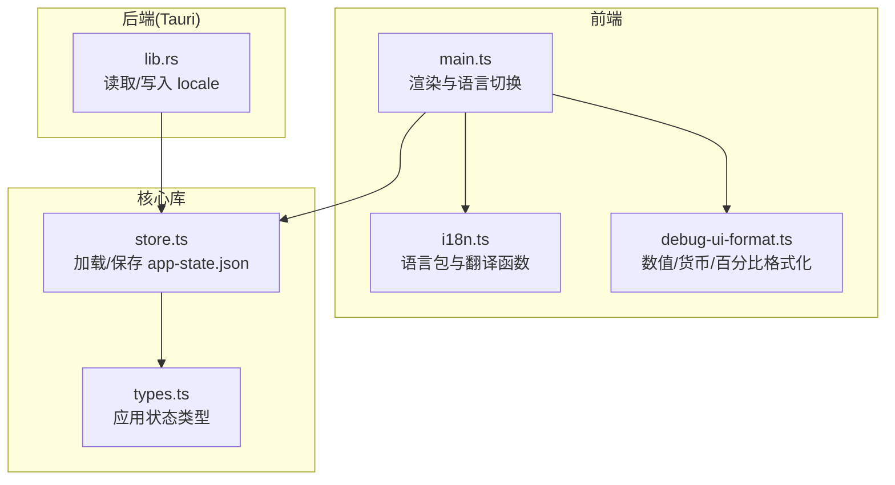
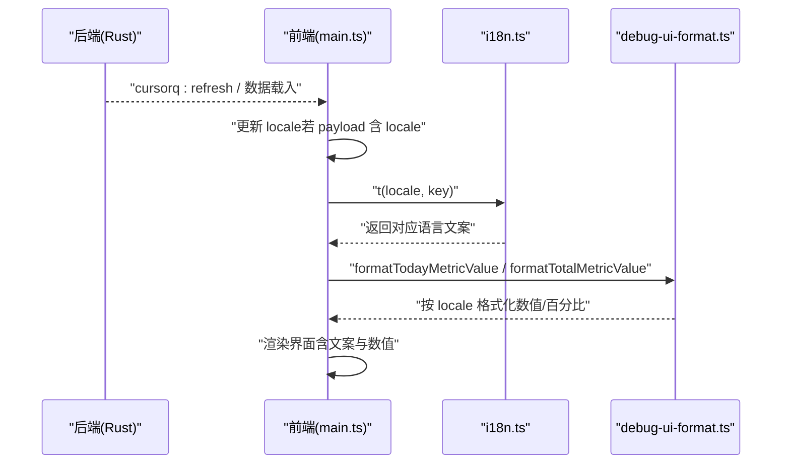
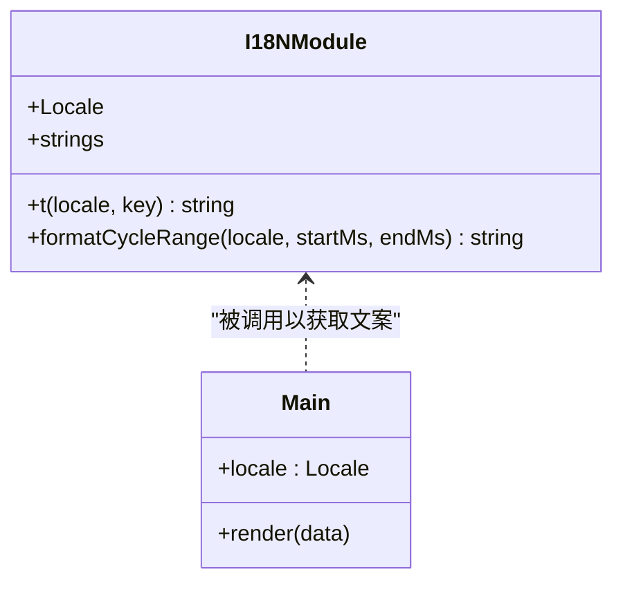
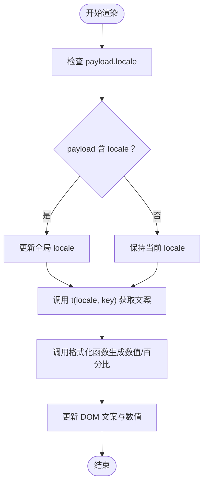
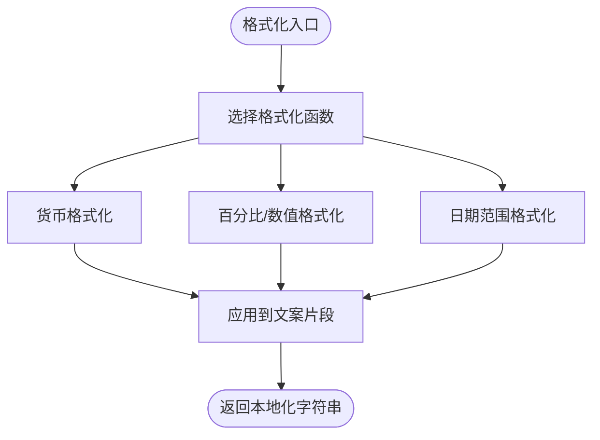
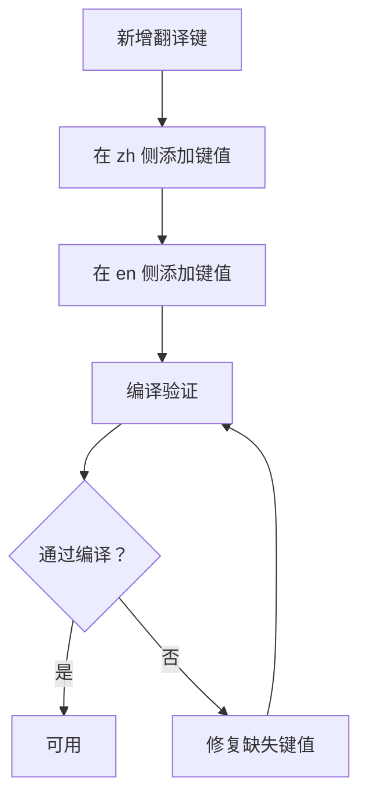
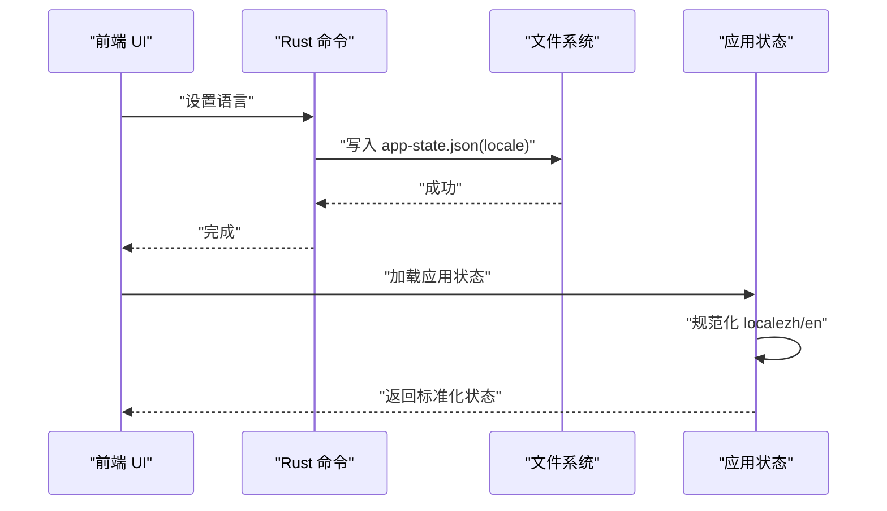
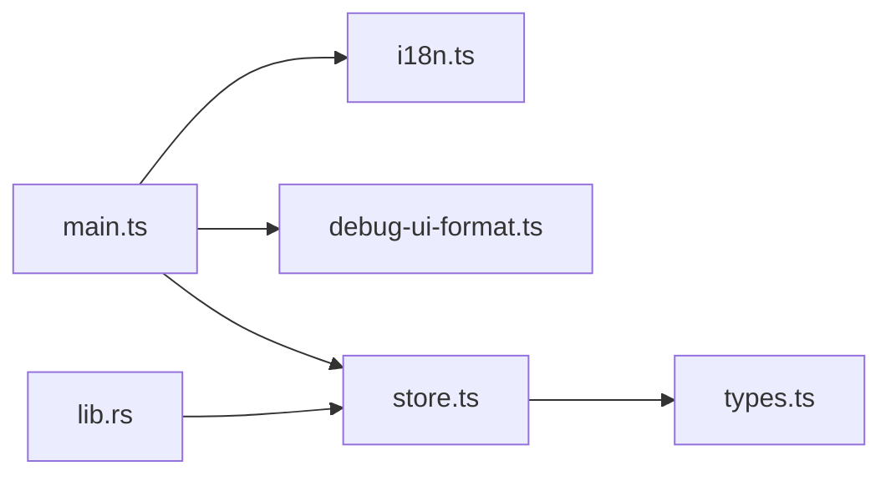

# 国际化支持

<cite>
**本文引用的文件**
- [apps/tauri/src/i18n.ts](file://apps/tauri/src/i18n.ts)
- [apps/tauri/src/main.ts](file://apps/tauri/src/main.ts)
- [apps/tauri/src/debug-ui-format.ts](file://apps/tauri/src/debug-ui-format.ts)
- [apps/tauri/src-tauri/src/lib.rs](file://apps/tauri/src-tauri/src/lib.rs)
- [packages/core/src/store.ts](file://packages/core/src/store.ts)
- [packages/core/src/types.ts](file://packages/core/src/types.ts)
</cite>

## 目录
1. [简介](#简介)
2. [项目结构](#项目结构)
3. [核心组件](#核心组件)
4. [架构总览](#架构总览)
5. [详细组件分析](#详细组件分析)
6. [依赖关系分析](#依赖关系分析)
7. [性能考量](#性能考量)
8. [故障排查指南](#故障排查指南)
9. [结论](#结论)
10. [附录](#附录)

## 简介
本文件系统性阐述 CursorQ 的国际化（i18n）支持方案，聚焦 apps/tauri/src/i18n.ts 中的语言包管理、翻译函数设计与本地化策略，覆盖语言切换机制、文本格式化规则、日期时间本地化处理，以及针对不同语言文本长度变化、排版方向差异与文化适配的工程实践。同时给出翻译键值管理、动态内容更新与回退机制的实现要点，并通过图示与路径指引帮助读者快速定位到具体实现。

## 项目结构
国际化能力主要由前端 i18n 模块与后端（Tauri）状态持久化协同完成：
- 前端 i18n 模块：集中维护语言包与翻译函数，提供日期范围格式化等本地化工具。
- 应用主流程：接收后端传入的当前语言与业务数据，驱动界面渲染与文案更新。
- 后端（Rust）：负责读取/写入用户语言偏好，确保跨会话一致性。
- 核心库（packages/core）：应用状态加载时对语言进行规范化，保证默认值与回退策略一致。

**图表来源**
- [apps/tauri/src/i18n.ts:1-89](file://apps/tauri/src/i18n.ts#L1-L89)
- [apps/tauri/src/main.ts:1-711](file://apps/tauri/src/main.ts#L1-L711)
- [apps/tauri/src-tauri/src/lib.rs:153-167](file://apps/tauri/src-tauri/src/lib.rs#L153-L167)
- [packages/core/src/store.ts:1-54](file://packages/core/src/store.ts#L1-L54)
- [packages/core/src/types.ts](file://packages/core/src/types.ts)

**章节来源**
- [apps/tauri/src/i18n.ts:1-89](file://apps/tauri/src/i18n.ts#L1-L89)
- [apps/tauri/src/main.ts:1-104](file://apps/tauri/src/main.ts#L1-L104)
- [apps/tauri/src-tauri/src/lib.rs:153-167](file://apps/tauri/src-tauri/src/lib.rs#L153-L167)
- [packages/core/src/store.ts:1-54](file://packages/core/src/store.ts#L1-L54)

## 核心组件
- 语言包与键值体系
  - 语言类型限定为 zh/en，键集合通过 TypeScript 映射自 zh 侧键集，确保编译期键值安全。
  - 键值涵盖通用文案、调试提示、交互说明等，统一由翻译函数返回对应语言的字符串。
- 翻译函数与本地化工具
  - 翻译函数接收当前语言与键名，直接从语言包映射返回。
  - 本地化工具函数负责日期范围格式化，依据语言选择区域化选项与区域标识。
- 应用主流程中的语言切换
  - 主流程维护全局 locale 变量，接收后端 payload 中的 locale 字段进行更新。
  - 渲染函数在每次更新时根据当前 locale 决定文案与格式化输出。
- 后端与状态持久化
  - Rust 层提供读取/写入 locale 的命令，从应用数据目录的 app-state.json 中读取/写入。
  - 核心库加载应用状态时对 locale 进行规范化，确保默认值为 zh 或 en。

**章节来源**
- [apps/tauri/src/i18n.ts:1-89](file://apps/tauri/src/i18n.ts#L1-L89)
- [apps/tauri/src/main.ts:46-104](file://apps/tauri/src/main.ts#L46-L104)
- [apps/tauri/src-tauri/src/lib.rs:153-167](file://apps/tauri/src-tauri/src/lib.rs#L153-L167)
- [packages/core/src/store.ts:1-54](file://packages/core/src/store.ts#L1-L54)

## 架构总览
以下序列图展示了“语言切换与动态内容更新”的关键流程：前端接收后端事件或 payload，更新 locale 并重新渲染，期间调用翻译函数与本地化工具生成最终文案。

**图表来源**
- [apps/tauri/src/main.ts:430-461](file://apps/tauri/src/main.ts#L430-L461)
- [apps/tauri/src/i18n.ts:70-72](file://apps/tauri/src/i18n.ts#L70-L72)
- [apps/tauri/src/debug-ui-format.ts:8-33](file://apps/tauri/src/debug-ui-format.ts#L8-L33)

## 详细组件分析

### 语言包与翻译函数
- 语言类型与键值约束
  - 使用联合类型限定语言，键集合通过 TypeScript 映射自 zh 侧键集，确保新增键值时同步在所有语言侧补齐。
- 翻译函数
  - 接收 locale 与键名，直接返回语言包中的对应字符串，实现 O(1) 查找。
- 本地化工具
  - 日期范围格式化函数根据语言选择区域化选项与区域标识，生成本地化日期范围字符串。

**图表来源**
- [apps/tauri/src/i18n.ts:1-89](file://apps/tauri/src/i18n.ts#L1-L89)
- [apps/tauri/src/main.ts:46-104](file://apps/tauri/src/main.ts#L46-L104)

**章节来源**
- [apps/tauri/src/i18n.ts:1-89](file://apps/tauri/src/i18n.ts#L1-L89)

### 语言切换机制与动态更新
- 切换入口
  - 主流程在渲染函数中检查 payload 是否携带 locale，若有则更新全局 locale。
- 动态更新
  - 每次渲染都会基于当前 locale 调用翻译函数与格式化函数，确保界面文案与数值均随语言变化。
- 文案与数值联动
  - 渲染函数中对“剩余天数”等文案采用语言特定的单位后缀，配合数值格式化函数输出统一风格。

**图表来源**
- [apps/tauri/src/main.ts:430-461](file://apps/tauri/src/main.ts#L430-L461)
- [apps/tauri/src/i18n.ts:70-72](file://apps/tauri/src/i18n.ts#L70-L72)

**章节来源**
- [apps/tauri/src/main.ts:430-461](file://apps/tauri/src/main.ts#L430-L461)

### 文本格式化规则与文化适配
- 数值/百分比/货币格式化
  - 数值与百分比格式化函数根据语言环境生成统一风格的显示文本，如使用短横线替代斜杠以控制宽度。
- 日期时间本地化
  - 日期范围格式化函数根据语言选择区域化选项与区域标识，确保日期格式符合当地习惯。
- 文本长度与排版方向
  - 通过统一的格式化函数与固定宽度占位符，减少不同语言导致的布局抖动。
  - 对于 RTL 语言，建议在样式层增加方向性适配（本项目当前未涉及 RTL）。

**图表来源**
- [apps/tauri/src/debug-ui-format.ts:8-33](file://apps/tauri/src/debug-ui-format.ts#L8-L33)
- [apps/tauri/src/i18n.ts:74-88](file://apps/tauri/src/i18n.ts#L74-L88)

**章节来源**
- [apps/tauri/src/debug-ui-format.ts:8-33](file://apps/tauri/src/debug-ui-format.ts#L8-L33)
- [apps/tauri/src/i18n.ts:74-88](file://apps/tauri/src/i18n.ts#L74-L88)

### 翻译键值管理与回退机制
- 键值管理
  - 所有文案键统一来源于语言包，新增键值需在所有语言侧同步添加。
  - 通过 TypeScript 的键集合映射，确保编译期发现缺失键值。
- 回退机制
  - 当语言包中缺少某键值时，TypeScript 将在编译期报错，避免运行时出现空白或异常文案。
  - 应用状态加载时对 locale 进行规范化，确保默认值为 zh 或 en。

**图表来源**
- [apps/tauri/src/i18n.ts:3-68](file://apps/tauri/src/i18n.ts#L3-L68)
- [packages/core/src/store.ts:20](file://packages/core/src/store.ts#L20)

**章节来源**
- [apps/tauri/src/i18n.ts:3-68](file://apps/tauri/src/i18n.ts#L3-L68)
- [packages/core/src/store.ts:20](file://packages/core/src/store.ts#L20)

### 语言偏好持久化与跨会话一致性
- 读取偏好
  - Rust 层从应用数据目录的 app-state.json 中读取 locale，默认返回 zh。
- 写入偏好
  - Rust 层提供写入命令，将用户选择的语言写回 app-state.json。
- 加载与规范化
  - 核心库加载应用状态时对 locale 进行规范化，确保只接受 zh/en。

**图表来源**
- [apps/tauri/src-tauri/src/lib.rs:153-167](file://apps/tauri/src-tauri/src/lib.rs#L153-L167)
- [packages/core/src/store.ts:10-28](file://packages/core/src/store.ts#L10-L28)

**章节来源**
- [apps/tauri/src-tauri/src/lib.rs:153-167](file://apps/tauri/src-tauri/src/lib.rs#L153-L167)
- [packages/core/src/store.ts:10-28](file://packages/core/src/store.ts#L10-L28)

## 依赖关系分析
- 前端渲染依赖翻译模块与格式化模块，二者均依赖 locale。
- 主流程在渲染阶段统一调用翻译与格式化，形成清晰的数据流。
- 后端与核心库负责语言偏好的持久化与规范化，保障跨会话一致性。

**图表来源**
- [apps/tauri/src/main.ts:1-35](file://apps/tauri/src/main.ts#L1-L35)
- [apps/tauri/src/i18n.ts:1-89](file://apps/tauri/src/i18n.ts#L1-L89)
- [apps/tauri/src/debug-ui-format.ts:1-33](file://apps/tauri/src/debug-ui-format.ts#L1-L33)
- [apps/tauri/src-tauri/src/lib.rs:153-167](file://apps/tauri/src-tauri/src/lib.rs#L153-L167)
- [packages/core/src/store.ts:1-54](file://packages/core/src/store.ts#L1-L54)
- [packages/core/src/types.ts](file://packages/core/src/types.ts)

**章节来源**
- [apps/tauri/src/main.ts:1-35](file://apps/tauri/src/main.ts#L1-L35)
- [apps/tauri/src/i18n.ts:1-89](file://apps/tauri/src/i18n.ts#L1-L89)
- [apps/tauri/src/debug-ui-format.ts:1-33](file://apps/tauri/src/debug-ui-format.ts#L1-L33)
- [apps/tauri/src-tauri/src/lib.rs:153-167](file://apps/tauri/src-tauri/src/lib.rs#L153-L167)
- [packages/core/src/store.ts:1-54](file://packages/core/src/store.ts#L1-L54)

## 性能考量
- 翻译查找为常数时间 O(1)，语言包为静态对象，内存占用极低。
- 日期与数值格式化仅在渲染阶段触发，频率可控，且使用浏览器原生 Intl API，性能稳定。
- 建议避免在高频循环中重复创建格式化器实例，当前实现已在模块级复用。

## 故障排查指南
- 编译期缺失键值
  - 现象：新增键值后编译报错。
  - 处理：在所有语言侧补齐键值，确保键集合映射一致。
- 运行期语言不一致
  - 现象：界面部分文案未随语言切换。
  - 处理：确认渲染流程是否在每次更新时使用最新 locale，并调用翻译函数与格式化函数。
- 语言偏好未持久化
  - 现象：重启后语言恢复默认。
  - 处理：检查后端写入命令是否正确执行，以及 app-state.json 是否存在且可写。

**章节来源**
- [apps/tauri/src/i18n.ts:3-68](file://apps/tauri/src/i18n.ts#L3-L68)
- [apps/tauri/src/main.ts:430-461](file://apps/tauri/src/main.ts#L430-L461)
- [apps/tauri/src-tauri/src/lib.rs:153-167](file://apps/tauri/src-tauri/src/lib.rs#L153-L167)
- [packages/core/src/store.ts:10-28](file://packages/core/src/store.ts#L10-L28)

## 结论
CursorQ 的国际化系统以简洁的前端语言包与翻译函数为核心，结合后端持久化与核心库规范化，实现了稳定的多语言支持。通过统一的格式化规则与明确的键值管理策略，系统在保证开发效率的同时兼顾了用户体验与文化适配。未来可在样式层补充 RTL 支持，并持续完善语言包覆盖与测试流程。

## 附录
- 具体使用示例（以路径代替代码）
  - 翻译函数使用：[apps/tauri/src/main.ts:212](file://apps/tauri/src/main.ts#L212)
  - 数值/百分比格式化：[apps/tauri/src/debug-ui-format.ts:9-20](file://apps/tauri/src/debug-ui-format.ts#L9-L20)
  - 日期范围格式化：[apps/tauri/src/i18n.ts:74-88](file://apps/tauri/src/i18n.ts#L74-L88)
  - 语言切换与渲染：[apps/tauri/src/main.ts:430-461](file://apps/tauri/src/main.ts#L430-L461)
  - 语言偏好读取/写入：[apps/tauri/src-tauri/src/lib.rs:153-167](file://apps/tauri/src-tauri/src/lib.rs#L153-L167)
  - 应用状态加载与规范化：[packages/core/src/store.ts:10-28](file://packages/core/src/store.ts#L10-L28)