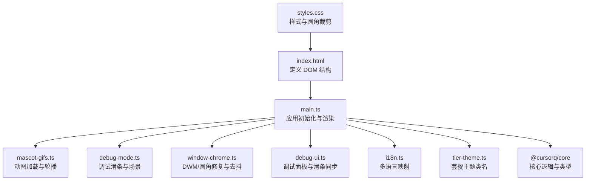
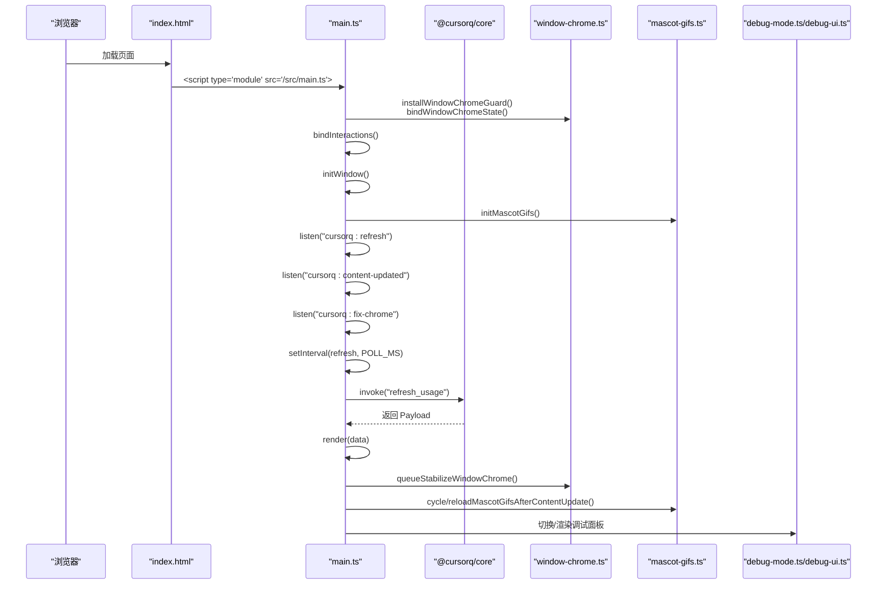
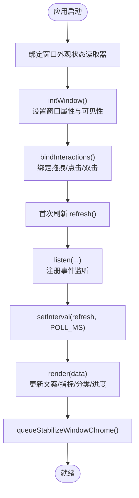
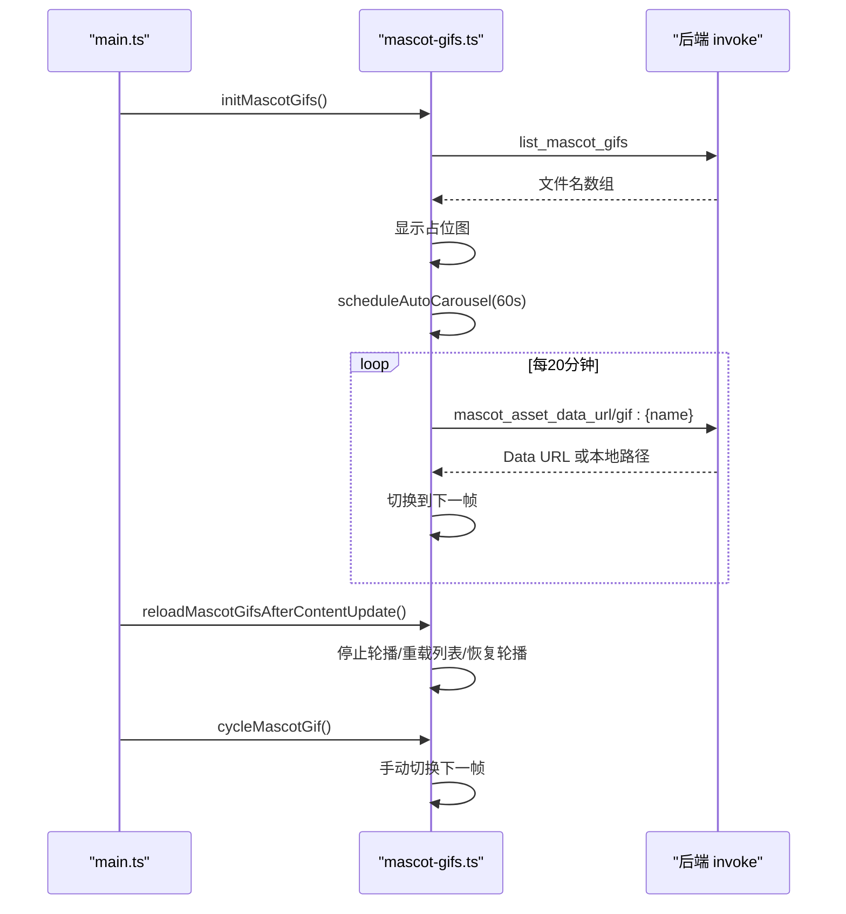
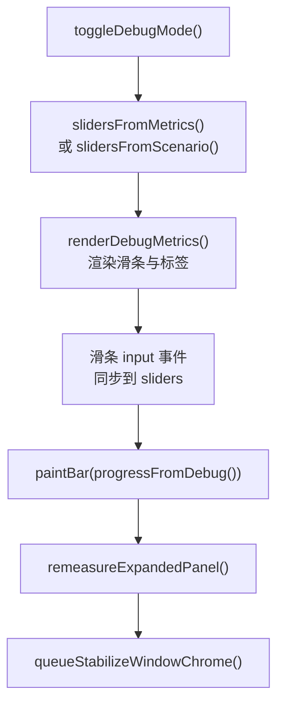
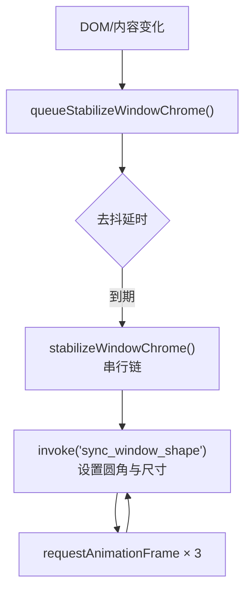
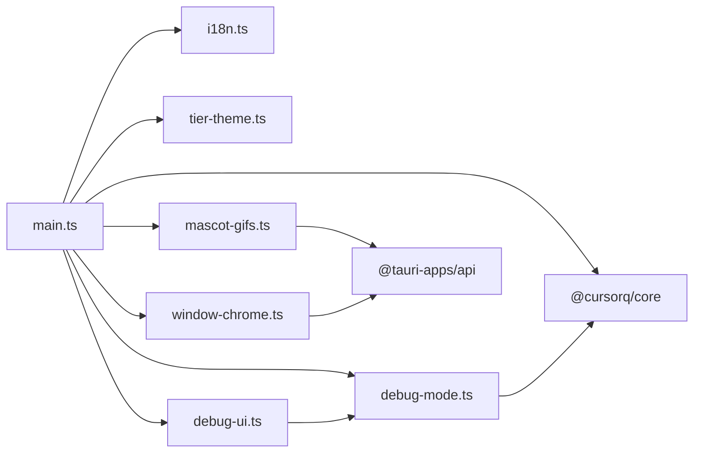

# 应用结构

<cite>
**本文引用的文件**
- [apps/tauri/src/main.ts](file://apps/tauri/src/main.ts)
- [apps/tauri/index.html](file://apps/tauri/index.html)
- [apps/tauri/package.json](file://apps/tauri/package.json)
- [apps/tauri/vite.config.ts](file://apps/tauri/vite.config.ts)
- [apps/tauri/src-tauri/tauri.conf.json](file://apps/tauri/src-tauri/tauri.conf.json)
- [apps/tauri/src/mascot-gifs.ts](file://apps/tauri/src/mascot-gifs.ts)
- [apps/tauri/src/debug-mode.ts](file://apps/tauri/src/debug-mode.ts)
- [apps/tauri/src/window-chrome.ts](file://apps/tauri/src/window-chrome.ts)
- [apps/tauri/src/debug-ui.ts](file://apps/tauri/src/debug-ui.ts)
- [apps/tauri/src/i18n.ts](file://apps/tauri/src/i18n.ts)
- [apps/tauri/src/styles.css](file://apps/tauri/src/styles.css)
- [apps/tauri/src/tier-theme.ts](file://apps/tauri/src/tier-theme.ts)
- [packages/core/src/index.ts](file://packages/core/src/index.ts)
</cite>

## 目录
1. [简介](#简介)
2. [项目结构](#项目结构)
3. [核心组件](#核心组件)
4. [架构总览](#架构总览)
5. [详细组件分析](#详细组件分析)
6. [依赖分析](#依赖分析)
7. [性能考虑](#性能考虑)
8. [故障排查指南](#故障排查指南)
9. [结论](#结论)

## 简介
本文件系统性梳理 CursorQ 基于 Tauri 2 的前端应用架构，聚焦应用启动流程、主入口点、HTML 结构设计与模块组织方式。重点解析 main.ts 中的应用初始化过程，包括全局状态管理、事件监听器绑定、窗口初始化与定时任务设置，并阐述模块化设计原则（如 mascot-gifs、debug-mode、window-chrome 等）及其相互依赖与通信机制。文末提供关键步骤的代码路径指引，帮助开发者快速理解运行时架构。

## 项目结构
CursorQ 的前端应用位于 apps/tauri 目录，采用 Vite + Tauri 的开发与打包模式：
- 入口 HTML：index.html 定义最小化的 DOM 结构，包含胶囊与面板容器，加载 main.ts。
- 主入口脚本：src/main.ts 负责应用初始化、渲染、交互与定时刷新。
- 样式：src/styles.css 提供胶囊与面板的视觉样式与圆角裁剪策略。
- 模块化：按功能拆分为 mascot-gifs、debug-mode、window-chrome、debug-ui、i18n、tier-theme 等独立模块。
- 构建配置：vite.config.ts 配置别名与目标环境；tauri.conf.json 配置窗口属性与开发/构建流程；package.json 定义脚本与依赖。

图表来源
- [apps/tauri/index.html:1-46](file://apps/tauri/index.html#L1-L46)
- [apps/tauri/src/main.ts:1-711](file://apps/tauri/src/main.ts#L1-L711)
- [apps/tauri/src/mascot-gifs.ts:1-164](file://apps/tauri/src/mascot-gifs.ts#L1-L164)
- [apps/tauri/src/debug-mode.ts:1-190](file://apps/tauri/src/debug-mode.ts#L1-L190)
- [apps/tauri/src/window-chrome.ts:1-99](file://apps/tauri/src/window-chrome.ts#L1-L99)
- [apps/tauri/src/debug-ui.ts:1-221](file://apps/tauri/src/debug-ui.ts#L1-L221)
- [apps/tauri/src/i18n.ts:1-89](file://apps/tauri/src/i18n.ts#L1-L89)
- [apps/tauri/src/tier-theme.ts:1-14](file://apps/tauri/src/tier-theme.ts#L1-L14)
- [apps/tauri/src/styles.css:1-585](file://apps/tauri/src/styles.css#L1-L585)
- [packages/core/src/index.ts:1-35](file://packages/core/src/index.ts#L1-L35)

章节来源
- [apps/tauri/index.html:1-46](file://apps/tauri/index.html#L1-L46)
- [apps/tauri/src/main.ts:1-711](file://apps/tauri/src/main.ts#L1-L711)
- [apps/tauri/src/styles.css:1-585](file://apps/tauri/src/styles.css#L1-L585)
- [apps/tauri/vite.config.ts:1-21](file://apps/tauri/vite.config.ts#L1-L21)
- [apps/tauri/src-tauri/tauri.conf.json:1-48](file://apps/tauri/src-tauri/tauri.conf.json#L1-L48)

## 核心组件
- 应用入口与初始化：main.ts 负责绑定交互、初始化窗口、监听事件、定时刷新与渲染。
- 动漫角色模块：mascot-gifs.ts 管理动图列表、占位图、轮播与内容更新后的重载。
- 调试模式模块：debug-mode.ts 定义调试滑条、场景转换与进度计算。
- 窗口外观模块：window-chrome.ts 统一修复透明窗口圆角与白边问题，提供去抖与观察者兜底。
- 调试 UI 模块：debug-ui.ts 渲染调试面板、滑条同步与预设按钮。
- 国际化模块：i18n.ts 提供键值映射与周期范围格式化。
- 主题模块：tier-theme.ts 将套餐名称映射为 CSS 类名。
- 样式模块：styles.css 定义胶囊、面板、滚动与圆角裁剪策略。

章节来源
- [apps/tauri/src/main.ts:1-711](file://apps/tauri/src/main.ts#L1-L711)
- [apps/tauri/src/mascot-gifs.ts:1-164](file://apps/tauri/src/mascot-gifs.ts#L1-L164)
- [apps/tauri/src/debug-mode.ts:1-190](file://apps/tauri/src/debug-mode.ts#L1-L190)
- [apps/tauri/src/window-chrome.ts:1-99](file://apps/tauri/src/window-chrome.ts#L1-L99)
- [apps/tauri/src/debug-ui.ts:1-221](file://apps/tauri/src/debug-ui.ts#L1-L221)
- [apps/tauri/src/i18n.ts:1-89](file://apps/tauri/src/i18n.ts#L1-L89)
- [apps/tauri/src/tier-theme.ts:1-14](file://apps/tauri/src/tier-theme.ts#L1-L14)
- [apps/tauri/src/styles.css:1-585](file://apps/tauri/src/styles.css#L1-L585)

## 架构总览
应用启动流程概览如下：
- 浏览器加载 index.html，执行 main.ts。
- main.ts 初始化窗口、绑定交互、注册事件监听、启动定时刷新。
- 核心渲染函数根据后端返回的数据更新胶囊与面板内容。
- 窗口外观通过 window-chrome.ts 进行统一修复，避免 WebView 白边。
- 动漫角色由 mascot-gifs.ts 管理，支持轮播与内容更新后的重载。
- 调试模式通过 debug-mode.ts 与 debug-ui.ts 提供可视化调试能力。

图表来源
- [apps/tauri/index.html:1-46](file://apps/tauri/index.html#L1-L46)
- [apps/tauri/src/main.ts:674-711](file://apps/tauri/src/main.ts#L674-L711)
- [apps/tauri/src/mascot-gifs.ts:121-164](file://apps/tauri/src/mascot-gifs.ts#L121-L164)
- [apps/tauri/src/window-chrome.ts:89-99](file://apps/tauri/src/window-chrome.ts#L89-L99)
- [apps/tauri/src/debug-mode.ts:1-190](file://apps/tauri/src/debug-mode.ts#L1-L190)
- [apps/tauri/src/debug-ui.ts:1-221](file://apps/tauri/src/debug-ui.ts#L1-L221)
- [packages/core/src/index.ts:1-35](file://packages/core/src/index.ts#L1-L35)

## 详细组件分析

### 主入口 main.ts 初始化流程
- 全局状态与常量
  - 定义窗口尺寸、面板高度范围、轮询间隔等常量。
  - 维护本地状态：locale、expanded、jokeIndex、openCats、lastPayload、debugMode、debugSliders。
- 模块导入与绑定
  - 导入 @cursorq/core、@tauri-apps/api、国际化、主题、动图、调试、窗口外观等模块。
  - 通过 window-chrome 的状态读取器绑定当前窗口逻辑高度与展开状态。
- 渲染与交互
  - render 函数负责更新文案、指标、分类与进度条。
  - bindInteractions 绑定拖拽、点击、双击、提示区点击等交互。
  - setExpanded 控制胶囊展开/收起与窗口高度调整。
  - refresh 通过 invoke 触发后端刷新，解析返回的 Payload 并渲染。
- 窗口初始化
  - initWindow 设置窗口不可聚焦、初始高度、可见性与显示/隐藏逻辑。
  - 初始化动图模块，安装上下文菜单禁用与窗口外观修复。
- 事件监听与定时任务
  - 监听 cursorq:refresh、cursorq:content-updated、cursorq:fix-chrome、cursorq:window-shown 等事件。
  - 每隔 POLL_MS 自动刷新。

图表来源
- [apps/tauri/src/main.ts:674-711](file://apps/tauri/src/main.ts#L674-L711)

章节来源
- [apps/tauri/src/main.ts:1-711](file://apps/tauri/src/main.ts#L1-L711)

### 动漫角色模块 mascot-gifs.ts
- 功能职责
  - 在开发环境下回退到本地占位图，在生产环境下通过 invoke 获取动图资源。
  - 启动后延迟 1 分钟开始轮播，每 20 分钟切换一张动图。
  - 支持内容更新后的重载与手动切换。
- 关键流程
  - initMascotGifs：加载动图列表、显示占位图、调度轮播。
  - reloadMascotGifsAfterContentUpdate：停止轮播、重载列表、恢复轮播。
  - cycleMascotGif：手动切换下一帧。
- 错误处理
  - 无法获取资源时回退到本地占位图，开发环境直接使用本地路径。

图表来源
- [apps/tauri/src/mascot-gifs.ts:1-164](file://apps/tauri/src/mascot-gifs.ts#L1-L164)

章节来源
- [apps/tauri/src/mascot-gifs.ts:1-164](file://apps/tauri/src/mascot-gifs.ts#L1-L164)

### 调试模式模块 debug-mode.ts 与 debug-ui.ts
- debug-mode.ts
  - 定义调试滑条结构与场景 ID，提供从滑条/场景/指标到进度的转换函数。
  - 计算周期剩余、日预算、今日比例与紧迫度等参数。
- debug-ui.ts
  - 渲染调试面板与滑条，实现滑条输入与进度同步。
  - 提供预设按钮与退出调试按钮，支持一键切换典型状态。
- 交互流程
  - 切换调试模式时，根据当前指标生成初始滑条，渲染调试面板。
  - 滑条变化实时驱动进度条与标签更新，同时调用 paintBar 更新胶囊。

图表来源
- [apps/tauri/src/debug-mode.ts:1-190](file://apps/tauri/src/debug-mode.ts#L1-L190)
- [apps/tauri/src/debug-ui.ts:1-221](file://apps/tauri/src/debug-ui.ts#L1-L221)
- [apps/tauri/src/main.ts:299-317](file://apps/tauri/src/main.ts#L299-L317)

章节来源
- [apps/tauri/src/debug-mode.ts:1-190](file://apps/tauri/src/debug-mode.ts#L1-L190)
- [apps/tauri/src/debug-ui.ts:1-221](file://apps/tauri/src/debug-ui.ts#L1-L221)

### 窗口外观模块 window-chrome.ts
- 设计目标
  - 透明窗口在 DOM/WebView 变化后可能出现白边，统一在此模块修复。
  - 通过 DWM 接口与圆角 HRGN 同步，避免 setSize±1 导致的闪烁。
- 关键机制
  - bindWindowChromeState：注入状态读取器，供稳定化函数读取当前逻辑高度与展开状态。
  - queueStabilizeWindowChrome：去抖，合并连续变更。
  - stabilizeWindowChrome：串行链式执行，确保稳定化顺序。
  - installWindowChromeGuard：MutationObserver 观察关键节点变化，兜底触发稳定化。

图表来源
- [apps/tauri/src/window-chrome.ts:1-99](file://apps/tauri/src/window-chrome.ts#L1-L99)

章节来源
- [apps/tauri/src/window-chrome.ts:1-99](file://apps/tauri/src/window-chrome.ts#L1-L99)

### 国际化与主题模块
- i18n.ts
  - 提供 zh/en 字符串映射与周期范围格式化。
- tier-theme.ts
  - 将套餐名称映射为 CSS 类名，用于面板标题与进度条着色。

章节来源
- [apps/tauri/src/i18n.ts:1-89](file://apps/tauri/src/i18n.ts#L1-L89)
- [apps/tauri/src/tier-theme.ts:1-14](file://apps/tauri/src/tier-theme.ts#L1-L14)

### 样式与布局
- styles.css
  - 使用 CSS 变量统一尺寸与颜色，禁用动画与过渡以避免 WebView 重绘白边。
  - 通过 clip-path 与圆角半径实现胶囊与面板的圆角裁剪。
  - 面板展开/收起通过 max-height 与 .expanded 类控制。

章节来源
- [apps/tauri/src/styles.css:1-585](file://apps/tauri/src/styles.css#L1-L585)

## 依赖分析
- 模块内聚与耦合
  - main.ts 作为中枢，聚合多个模块；与 @cursorq/core 通过 invoke 交互。
  - mascot-gifs.ts 与 window-chrome.ts 通过 invoke 与窗口 API 间接耦合。
  - debug-ui.ts 依赖 debug-mode.ts 的计算结果进行渲染。
- 外部依赖
  - @tauri-apps/api：窗口、事件与命令调用。
  - @cursorq/core：核心业务逻辑与类型导出。
- 构建与运行
  - vite.config.ts 将 @cursorq/core 解析到 packages/core/src/browser.ts。
  - tauri.conf.json 配置开发服务器端口、窗口属性与安全策略。

图表来源
- [apps/tauri/src/main.ts:1-35](file://apps/tauri/src/main.ts#L1-L35)
- [apps/tauri/vite.config.ts:9-13](file://apps/tauri/vite.config.ts#L9-L13)
- [apps/tauri/src-tauri/tauri.conf.json:1-48](file://apps/tauri/src-tauri/tauri.conf.json#L1-L48)
- [packages/core/src/index.ts:1-35](file://packages/core/src/index.ts#L1-L35)

章节来源
- [apps/tauri/src/main.ts:1-35](file://apps/tauri/src/main.ts#L1-L35)
- [apps/tauri/vite.config.ts:1-21](file://apps/tauri/vite.config.ts#L1-L21)
- [apps/tauri/src-tauri/tauri.conf.json:1-48](file://apps/tauri/src-tauri/tauri.conf.json#L1-L48)
- [packages/core/src/index.ts:1-35](file://packages/core/src/index.ts#L1-L35)

## 性能考虑
- 禁用动画与过渡：避免 WebView 重绘导致的白边闪烁。
- 去抖与串行稳定化：减少频繁窗口尺寸/形状变更带来的抖动与闪烁。
- 轮播节流：启动延迟与固定间隔切换，降低资源占用。
- 最小化 DOM 变更：通过队列与观察者统一触发稳定化，避免重复计算。
- 本地回退：开发环境直接使用本地资源，提升加载稳定性。

## 故障排查指南
- 透明窗口出现白边
  - 确认是否调用 queueStabilizeWindowChrome 或 installWindowChromeGuard 是否生效。
  - 检查是否存在 setSize±1 的手动操作，应统一通过稳定化接口。
- 动图不显示或切换异常
  - 检查 invoke("list_mascot_gifs") 与 invoke("mascot_asset_data_url") 是否成功。
  - 开发环境确认本地路径可用，生产环境检查资源 URL。
- 调试面板无效
  - 确认 toggleDebugMode 已正确生成滑条并调用 renderDebugMetrics。
  - 检查滑条 input 事件是否绑定，paintBar 是否被调用。
- 刷新失败
  - 检查 invoke("refresh_usage") 返回的 JSON 是否可解析。
  - 关注错误分支中的提示文案更新逻辑。

章节来源
- [apps/tauri/src/window-chrome.ts:37-99](file://apps/tauri/src/window-chrome.ts#L37-L99)
- [apps/tauri/src/mascot-gifs.ts:42-84](file://apps/tauri/src/mascot-gifs.ts#L42-L84)
- [apps/tauri/src/debug-ui.ts:173-185](file://apps/tauri/src/debug-ui.ts#L173-L185)
- [apps/tauri/src/main.ts:526-560](file://apps/tauri/src/main.ts#L526-L560)

## 结论
CursorQ 的前端架构以 main.ts 为核心，围绕模块化设计将动图、调试、窗口外观等功能解耦，通过 Tauri 的 invoke 与事件系统实现前后端协作。样式层采用圆角裁剪与禁用动画策略，有效规避 WebView 白边问题。整体结构清晰、职责明确，便于扩展与维护。开发者可通过本文提供的路径指引快速定位关键实现，理解应用启动与运行时的核心流程。