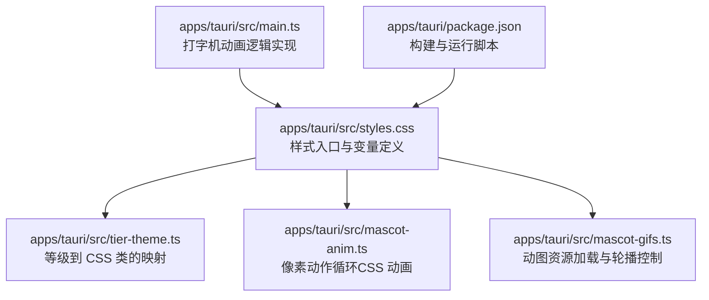
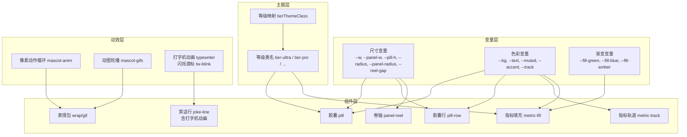
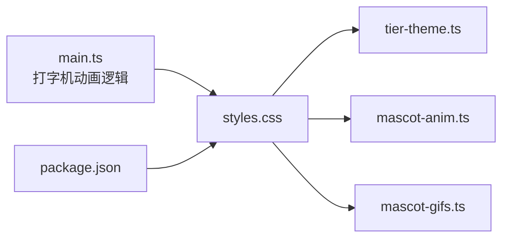

# 样式系统

<cite>
**本文引用的文件**
- [apps/tauri/src/styles.css](file://apps/tauri/src/styles.css)
- [apps/tauri/src/tier-theme.ts](file://apps/tauri/src/tier-theme.ts)
- [apps/tauri/src/mascot-anim.ts](file://apps/tauri/src/mascot-anim.ts)
- [apps/tauri/src/mascot-gifs.ts](file://apps/tauri/src/mascot-gifs.ts)
- [apps/tauri/src/main.ts](file://apps/tauri/src/main.ts)
- [apps/tauri/package.json](file://apps/tauri/package.json)
</cite>

## 更新摘要
**变更内容**
- 新增打字机动画效果的CSS实现说明
- 添加 .joke-line.typing 类和打字机动画关键帧定义
- 补充打字机游标闪烁效果的技术细节
- 更新动画与过渡效果章节以包含新的打字机功能

## 目录
1. [简介](#简介)
2. [项目结构](#项目结构)
3. [核心组件](#核心组件)
4. [架构总览](#架构总览)
5. [详细组件分析](#详细组件分析)
6. [依赖关系分析](#依赖关系分析)
7. [性能考量](#性能考量)
8. [故障排查指南](#故障排查指南)
9. [结论](#结论)
10. [附录](#附录)

## 简介
本文件系统性梳理 CursorQ 的样式系统，重点覆盖以下方面：
- CSS 架构设计：变量体系、选择器命名规范、组件样式隔离策略
- 响应式设计：断点与弹性布局、移动端适配思路
- 动画与过渡：进度条动画、展开收起动画、交互反馈、**新增：打字机动画效果**
- 主题与变量：CSS 变量的统一管理、按等级主题映射
- 性能优化：禁用动画的权衡、渲染优化与资源加载策略
- 实战示例：关键样式类路径、动画实现路径、响应式配置路径

## 项目结构
CursorQ 的样式系统集中在 Tauri 应用的样式入口文件中，并通过少量工具函数实现主题映射与动效控制。整体采用"变量驱动 + 类名约定 + 最小化动画"的策略，确保在 WebView 环境下的稳定与高性能。

**图表来源**
- [apps/tauri/src/styles.css](file://apps/tauri/src/styles.css)
- [apps/tauri/src/tier-theme.ts](file://apps/tauri/src/tier-theme.ts)
- [apps/tauri/src/mascot-anim.ts](file://apps/tauri/src/mascot-anim.ts)
- [apps/tauri/src/mascot-gifs.ts](file://apps/tauri/src/mascot-gifs.ts)
- [apps/tauri/src/main.ts](file://apps/tauri/src/main.ts)
- [apps/tauri/package.json](file://apps/tauri/package.json)

**章节来源**
- [apps/tauri/src/styles.css](file://apps/tauri/src/styles.css)
- [apps/tauri/src/tier-theme.ts](file://apps/tauri/src/tier-theme.ts)
- [apps/tauri/src/mascot-anim.ts](file://apps/tauri/src/mascot-anim.ts)
- [apps/tauri/src/mascot-gifs.ts](file://apps/tauri/src/mascot-gifs.ts)
- [apps/tauri/src/main.ts](file://apps/tauri/src/main.ts)
- [apps/tauri/package.json](file://apps/tauri/package.json)

## 核心组件
- 变量与根样式
  - 使用 CSS 自定义属性集中管理尺寸、颜色与渐变，便于主题切换与一致性维护。
  - 全局重置与字体平滑，统一容器尺寸与滚动行为，避免默认样式干扰。
- 胶囊（Pill）与卷轴（Panel Reel）
  - 胶囊作为悬浮窗体主体，固定宽高与圆角；卷轴为展开面板，采用"从底部滑出"的视觉与交互。
- 指标与进度条
  - 使用轨道与填充层实现进度条，支持多色与按等级定制。
- 主题映射
  - 将计划等级映射为 CSS 类名，驱动颜色与阴影等视觉差异。
- 动画与动图
  - 禁用全局过渡与动画以规避 WebView 重绘问题；通过像素动作循环与动图轮播实现轻量动效。
- **新增：打字机动画效果**
  - 实现逐字显示的打字机效果，包含闪烁游标和自动循环播放功能。

**章节来源**
- [apps/tauri/src/styles.css](file://apps/tauri/src/styles.css)
- [apps/tauri/src/tier-theme.ts](file://apps/tauri/src/tier-theme.ts)
- [apps/tauri/src/main.ts](file://apps/tauri/src/main.ts)

## 架构总览
样式系统围绕"变量 → 组件 → 主题 → 动效"四层展开，形成可维护、可扩展且性能友好的前端样式基座。

**图表来源**
- [apps/tauri/src/styles.css](file://apps/tauri/src/styles.css)
- [apps/tauri/src/tier-theme.ts](file://apps/tauri/src/tier-theme.ts)
- [apps/tauri/src/mascot-anim.ts](file://apps/tauri/src/mascot-anim.ts)
- [apps/tauri/src/mascot-gifs.ts](file://apps/tauri/src/mascot-gifs.ts)
- [apps/tauri/src/main.ts](file://apps/tauri/src/main.ts)

## 详细组件分析

### 变量与根样式
- 设计要点
  - 使用自定义属性集中管理尺寸与色彩，便于主题切换与一致性维护。
  - 全局重置与字体平滑，统一容器尺寸与滚动行为，避免默认样式干扰。
  - 针对 WebView 的圆角裁切问题，提供双重遮罩策略（clip-path 与 HRGN），保证视觉连续性。
- 关键路径
  - 变量定义与全局样式：[apps/tauri/src/styles.css](file://apps/tauri/src/styles.css)
  - 圆角遮罩与 WebView 适配：[apps/tauri/src/styles.css](file://apps/tauri/src/styles.css)

**章节来源**
- [apps/tauri/src/styles.css](file://apps/tauri/src/styles.css)

### 胶囊（Pill）与卷轴（Panel Reel）
- 设计要点
  - 胶囊固定宽高与圆角，支持拖拽移动与触摸禁用；内部行布局承载表情包、文本与指示器。
  - 卷轴与胶囊分离，宽度略窄，从底部滑出；通过最大高度与变换实现展开/收起。
- 关键路径
  - 胶囊与行布局：[apps/tauri/src/styles.css](file://apps/tauri/src/styles.css)
  - 卷轴与展开逻辑：[apps/tauri/src/styles.css](file://apps/tauri/src/styles.css)

**章节来源**
- [apps/tauri/src/styles.css](file://apps/tauri/src/styles.css)

### 指标与进度条
- 设计要点
  - 指标轨道与填充分离，轨道负责背景与圆角裁剪，填充负责进度与渐变。
  - 支持多色填充与按等级定制，同时提供"剩余天数"等场景化样式。
- 关键路径
  - 指标轨道与填充：[apps/tauri/src/styles.css](file://apps/tauri/src/styles.css)

**章节来源**
- [apps/tauri/src/styles.css](file://apps/tauri/src/styles.css)

### 主题映射与等级样式
- 设计要点
  - 将计划等级字符串映射为 CSS 类名，驱动颜色与阴影等视觉差异。
  - 提供默认等级兜底，确保未知等级也能正确渲染。
- 关键路径
  - 等级映射函数：[apps/tauri/src/tier-theme.ts](file://apps/tauri/src/tier-theme.ts)
  - 等级类名在样式中的应用位置：[apps/tauri/src/styles.css](file://apps/tauri/src/styles.css)

**章节来源**
- [apps/tauri/src/tier-theme.ts](file://apps/tauri/src/tier-theme.ts)
- [apps/tauri/src/styles.css](file://apps/tauri/src/styles.css)

### 动画与动图
- 设计要点
  - 全局禁用过渡与动画，避免 WebView 在重绘时出现异常；通过像素动作循环与动图轮播实现轻量动效。
  - 像素动作循环以步骤动画方式播放，周期性切换不同动作序列。
  - 动图轮播支持占位图、延迟启动、错误回退与内容更新后的状态恢复。
- 关键路径
  - 像素动作循环实现：[apps/tauri/src/mascot-anim.ts](file://apps/tauri/src/mascot-anim.ts)
  - 动图轮播与资源加载：[apps/tauri/src/mascot-gifs.ts](file://apps/tauri/src/mascot-gifs.ts)

**章节来源**
- [apps/tauri/src/mascot-anim.ts](file://apps/tauri/src/mascot-anim.ts)
- [apps/tauri/src/mascot-gifs.ts](file://apps/tauri/src/mascot-gifs.ts)

### 打字机动画效果
- 设计要点
  - 实现逐字显示的打字机效果，通过 JavaScript 控制字符逐个显示，配合 CSS 闪烁游标增强真实感。
  - 支持单行和双行内容的智能切换，包含思考动画（三个点）和自动循环播放功能。
  - 使用 `requestAnimationFrame` 和 `setTimeout` 实现精确的时间控制，避免动画卡顿。
- 关键路径
  - 打字机动画逻辑：[apps/tauri/src/main.ts](file://apps/tauri/src/main.ts)
  - 闪烁游标 CSS 实现：[apps/tauri/src/styles.css](file://apps/tauri/src/styles.css)
  - 关键帧定义：[apps/tauri/src/styles.css](file://apps/tauri/src/styles.css)

**章节来源**
- [apps/tauri/src/main.ts](file://apps/tauri/src/main.ts)
- [apps/tauri/src/styles.css](file://apps/tauri/src/styles.css)

### 响应式设计与移动端适配
- 设计要点
  - 容器尺寸由变量统一控制，通过媒体查询或运行时注入变量可实现不同设备的适配。
  - 弹性布局与网格布局结合，保证在不同窗口尺寸下仍保持紧凑与可读性。
  - 移动端优先的交互设计：触摸禁用、拖拽移动、紧凑字号与间距。
- 关键路径
  - 容器尺寸与布局：[apps/tauri/src/styles.css](file://apps/tauri/src/styles.css)

**章节来源**
- [apps/tauri/src/styles.css](file://apps/tauri/src/styles.css)

### 选择器命名规范与样式隔离
- 设计要点
  - 采用扁平化命名，避免深层嵌套；通过语义化类名表达组件角色（如 pill、panel、metric、joke-line）。
  - 使用"组件 + 子元素 + 修饰"的组合，减少冲突并提升可读性。
  - 通过容器隔离与层级控制，避免跨组件样式污染。
- 关键路径
  - 选择器与隔离策略：[apps/tauri/src/styles.css](file://apps/tauri/src/styles.css)

**章节来源**
- [apps/tauri/src/styles.css](file://apps/tauri/src/styles.css)

## 依赖关系分析
- 样式入口依赖主题映射与动效模块，形成"样式定义 → 主题应用 → 动效驱动"的闭环。
- 构建脚本负责打包与运行，确保样式与脚本在开发与生产环境的一致性。
- **新增：打字机动画依赖于主逻辑模块，通过类名切换触发 CSS 动画效果。**

**图表来源**
- [apps/tauri/src/styles.css](file://apps/tauri/src/styles.css)
- [apps/tauri/src/tier-theme.ts](file://apps/tauri/src/tier-theme.ts)
- [apps/tauri/src/mascot-anim.ts](file://apps/tauri/src/mascot-anim.ts)
- [apps/tauri/src/mascot-gifs.ts](file://apps/tauri/src/mascot-gifs.ts)
- [apps/tauri/src/main.ts](file://apps/tauri/src/main.ts)
- [apps/tauri/package.json](file://apps/tauri/package.json)

**章节来源**
- [apps/tauri/src/styles.css](file://apps/tauri/src/styles.css)
- [apps/tauri/src/tier-theme.ts](file://apps/tauri/src/tier-theme.ts)
- [apps/tauri/src/mascot-anim.ts](file://apps/tauri/src/mascot-anim.ts)
- [apps/tauri/src/mascot-gifs.ts](file://apps/tauri/src/mascot-gifs.ts)
- [apps/tauri/src/main.ts](file://apps/tauri/src/main.ts)
- [apps/tauri/package.json](file://apps/tauri/package.json)

## 性能考量
- 禁用全局动画与过渡
  - 为避免 WebView 在重绘时出现异常，全局禁用动画与过渡，仅在必要元素上启用局部动画。
  - 展开收起与进度条动画采用最小化过渡，降低重排与重绘成本。
  - **新增：打字机动画使用高效的 `requestAnimationFrame`，避免阻塞主线程。**
- 渲染优化
  - 使用 will-change 与 transform 优化关键路径渲染，减少不必要的合成层抖动。
  - 图像渲染与拖拽禁用，避免用户操作引发的额外重绘。
  - **新增：打字机动画支持会话取消，防止动画冲突和内存泄漏。**
- 资源加载与缓存
  - 动图轮播支持占位图与错误回退，确保在资源不可用时仍能维持体验。
  - 延迟启动轮播，降低初始加载压力。

**章节来源**
- [apps/tauri/src/styles.css](file://apps/tauri/src/styles.css)
- [apps/tauri/src/mascot-gifs.ts](file://apps/tauri/src/mascot-gifs.ts)
- [apps/tauri/src/main.ts](file://apps/tauri/src/main.ts)

## 故障排查指南
- WebView 圆角裁切异常
  - 症状：圆角处出现白色边缘。
  - 处理：确认已启用双重遮罩策略（clip-path 与 HRGN），并检查容器尺寸与圆角半径是否匹配。
  - 参考路径：[apps/tauri/src/styles.css](file://apps/tauri/src/styles.css)
- 进度条不更新
  - 症状：进度值变化但 UI 无变化。
  - 处理：确认填充层宽度更新逻辑与过渡禁用策略，检查等级类名是否正确应用。
  - 参考路径：[apps/tauri/src/styles.css](file://apps/tauri/src/styles.css)
- 动图不播放或卡顿
  - 症状：动图无法加载或播放不流畅。
  - 处理：检查资源路径与数据 URL 回退机制，确认轮播定时器与索引状态。
  - 参考路径：[apps/tauri/src/mascot-gifs.ts](file://apps/tauri/src/mascot-gifs.ts)
- 像素动作循环不切换
  - 症状：动作序列固定不动。
  - 处理：确认背景图切换与步骤动画重新触发逻辑，检查循环间隔与当前动作索引。
  - 参考路径：[apps/tauri/src/mascot-anim.ts](file://apps/tauri/src/mascot-anim.ts)
- **新增：打字机动画不工作**
  - 症状：文字不逐字显示或闪烁游标不出现。
  - 处理：检查 `.joke-line.typing` 类是否正确添加，确认 `tw-blink` 关键帧动画是否生效，验证打字机逻辑是否正常执行。
  - 参考路径：[apps/tauri/src/main.ts](file://apps/tauri/src/main.ts), [apps/tauri/src/styles.css](file://apps/tauri/src/styles.css)

**章节来源**
- [apps/tauri/src/styles.css](file://apps/tauri/src/styles.css)
- [apps/tauri/src/mascot-gifs.ts](file://apps/tauri/src/mascot-gifs.ts)
- [apps/tauri/src/mascot-anim.ts](file://apps/tauri/src/mascot-anim.ts)
- [apps/tauri/src/main.ts](file://apps/tauri/src/main.ts)

## 结论
CursorQ 的样式系统以变量驱动为核心，配合清晰的类名约定与最小化动画策略，在 WebView 环境下实现了稳定、可维护且高性能的界面表现。通过等级映射与动效模块的解耦，系统具备良好的扩展性与可演进性。**新增的打字机动画效果进一步增强了用户体验的真实感和动态性，通过精确的时间控制和优雅的视觉反馈，为用户提供了更加生动的交互体验。**

## 附录
- 关键样式类与动画实现路径
  - 变量与根样式：[apps/tauri/src/styles.css](file://apps/tauri/src/styles.css)
  - 胶囊与卷轴：[apps/tauri/src/styles.css](file://apps/tauri/src/styles.css)
  - 指标与进度条：[apps/tauri/src/styles.css](file://apps/tauri/src/styles.css)
  - 等级映射函数：[apps/tauri/src/tier-theme.ts](file://apps/tauri/src/tier-theme.ts)
  - 像素动作循环：[apps/tauri/src/mascot-anim.ts](file://apps/tauri/src/mascot-anim.ts)
  - 动图轮播与资源加载：[apps/tauri/src/mascot-gifs.ts](file://apps/tauri/src/mascot-gifs.ts)
  - **新增：打字机动画逻辑**：[apps/tauri/src/main.ts](file://apps/tauri/src/main.ts)
  - **新增：闪烁游标 CSS 实现**：[apps/tauri/src/styles.css](file://apps/tauri/src/styles.css)
- 构建与运行脚本
  - 开发与构建命令：[apps/tauri/package.json](file://apps/tauri/package.json)