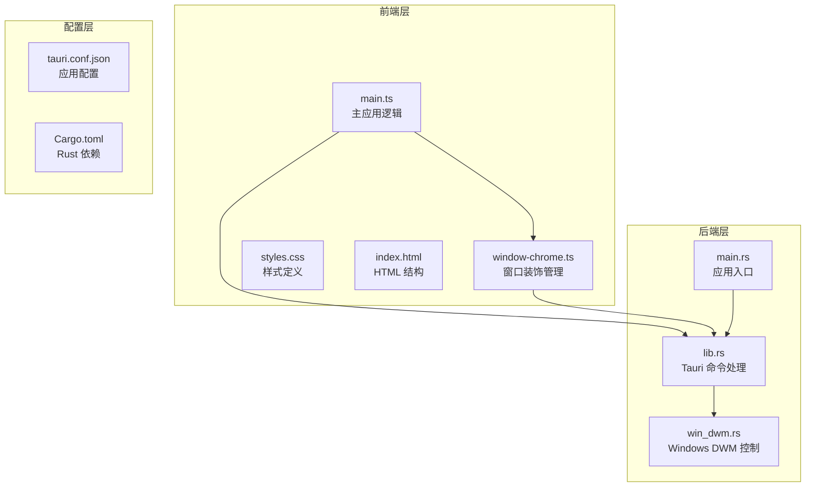
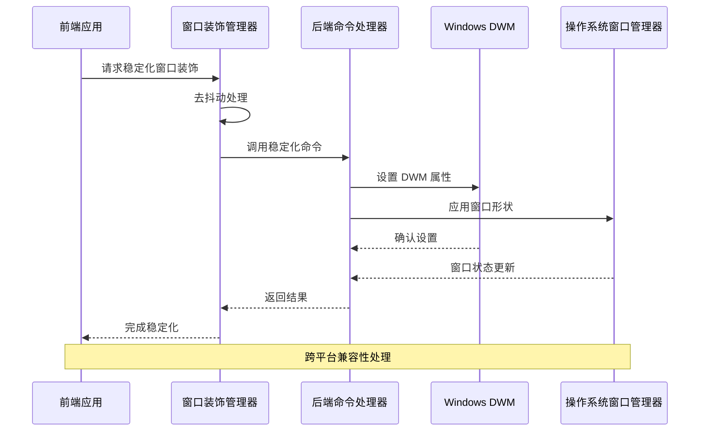
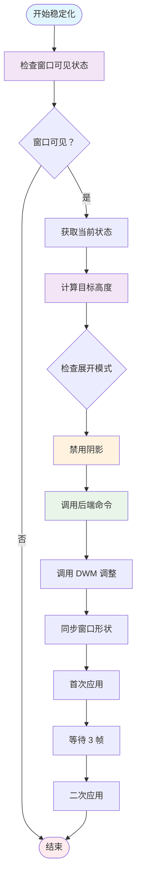
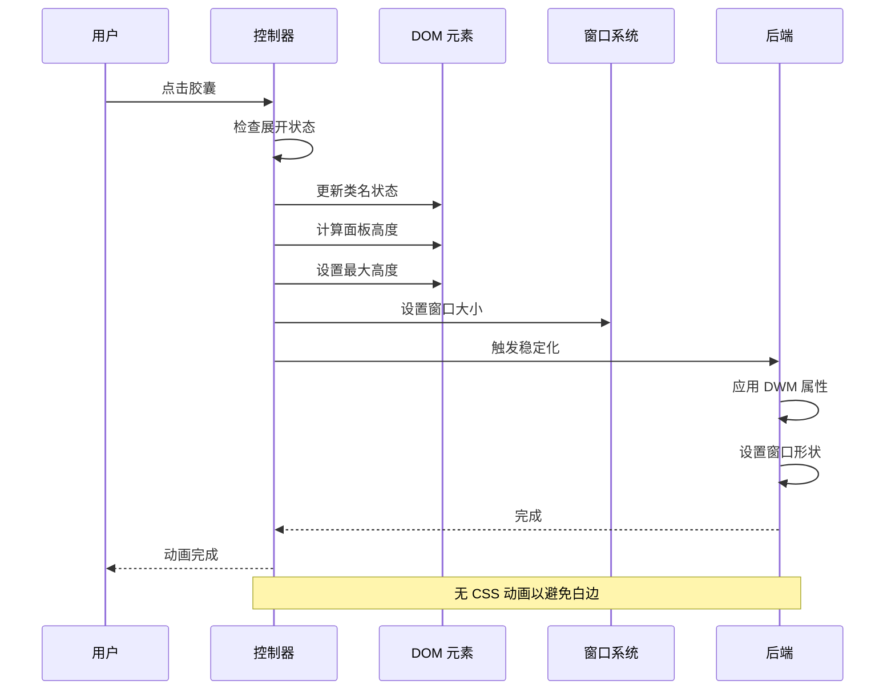
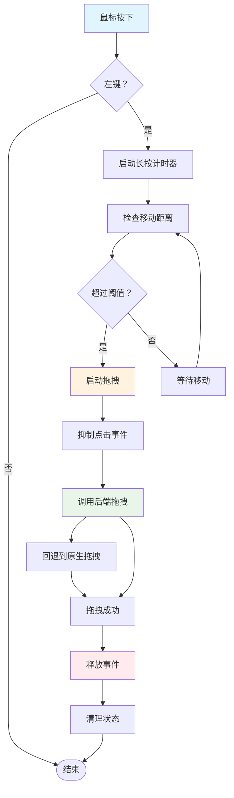
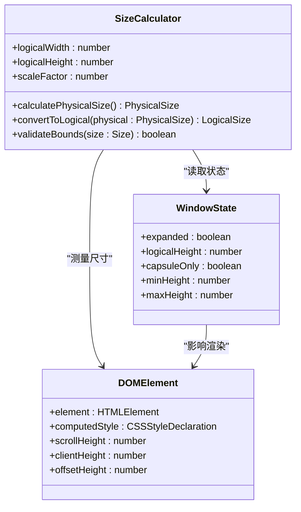

# 窗口管理

<cite>
**本文档引用的文件**
- [window-chrome.ts](file://apps/tauri/src/window-chrome.ts)
- [main.ts](file://apps/tauri/src/main.ts)
- [lib.rs](file://apps/tauri/src-tauri/src/lib.rs)
- [win_dwm.rs](file://apps/tauri/src-tauri/src/win_dwm.rs)
- [main.rs](file://apps/tauri/src-tauri/src/main.rs)
- [styles.css](file://apps/tauri/src/styles.css)
- [index.html](file://apps/tauri/index.html)
- [package.json](file://apps/tauri/package.json)
</cite>

## 目录
1. [简介](#简介)
2. [项目结构](#项目结构)
3. [核心组件](#核心组件)
4. [架构概览](#架构概览)
5. [详细组件分析](#详细组件分析)
6. [依赖关系分析](#依赖关系分析)
7. [性能考量](#性能考量)
8. [故障排除指南](#故障排除指南)
9. [结论](#结论)

## 简介

CursorQ 是一个基于 Tauri 的跨平台应用，采用胶囊状窗口设计为用户提供轻量级的使用体验。该系统的核心是窗口管理子系统，它实现了复杂的窗口生命周期管理、透明无边框窗口的装饰控制、拖拽功能和尺寸调整机制。

系统的主要特点包括：
- **胶囊状窗口设计**：采用圆角矩形设计，支持展开/收起动画
- **跨平台兼容**：在 Windows、macOS 和 Linux 上提供一致的用户体验
- **高性能渲染**：通过去抖动和链式调用优化窗口稳定化过程
- **智能拖拽**：支持长按拖拽和即时拖拽模式
- **视觉优化**：专门针对 WebView2 白边问题的解决方案

## 项目结构

CursorQ 的窗口管理系统采用分层架构，主要分为前端 JavaScript/TypeScript 和后端 Rust 两大部分：



**图表来源**
- [main.ts:1-711](file://apps/tauri/src/main.ts#L1-L711)
- [window-chrome.ts:1-99](file://apps/tauri/src/window-chrome.ts#L1-L99)
- [lib.rs:1-857](file://apps/tauri/src-tauri/src/lib.rs#L1-L857)

**章节来源**
- [main.ts:1-711](file://apps/tauri/src/main.ts#L1-L711)
- [package.json:1-22](file://apps/tauri/package.json#L1-L22)

## 核心组件

### 窗口装饰管理器 (Window Chrome Manager)

窗口装饰管理器是整个系统的核心组件，负责处理透明无边框窗口的装饰和稳定性问题。

#### 主要职责
- **去抖动处理**：防止频繁的窗口稳定化调用
- **链式调用**：确保窗口稳定化操作按顺序执行
- **跨平台适配**：在不同操作系统上提供一致的行为
- **视觉修复**：解决 WebView2 引擎的白边问题

#### 关键常量
- `CHROME_WIN_W`: 窗口宽度 (200px)
- `CHROME_PILL_RADIUS`: 胶囊圆角半径 (22px)
- `PILL_H`: 胶囊高度 (44px)

**章节来源**
- [window-chrome.ts:1-99](file://apps/tauri/src/window-chrome.ts#L1-L99)

### 主应用控制器 (Main Application Controller)

主应用控制器负责协调所有窗口相关的功能，包括状态管理、事件处理和用户交互。

#### 核心功能
- **窗口状态管理**：跟踪展开/收起状态和逻辑高度
- **用户交互处理**：处理拖拽、点击和双击事件
- **内容更新**：管理数据刷新和界面更新
- **动画控制**：实现平滑的展开/收起动画

**章节来源**
- [main.ts:1-711](file://apps/tauri/src/main.ts#L1-L711)

### Windows DWM 集成 (Windows Desktop Window Manager)

Windows 特定的窗口管理组件，处理 DWM 属性设置和窗口形状应用。

#### 主要功能
- **DWM 属性配置**：禁用不需要的视觉效果
- **窗口形状应用**：根据状态应用合适的圆角或矩形
- **焦点管理**：防止窗口意外获得焦点
- **置顶控制**：管理窗口的置顶状态

**章节来源**
- [win_dwm.rs:1-231](file://apps/tauri/src-tauri/src/win_dwm.rs#L1-L231)

## 架构概览

系统采用前后端分离的架构，前端负责用户界面和交互，后端负责系统级窗口操作。



**图表来源**
- [window-chrome.ts:46-77](file://apps/tauri/src/window-chrome.ts#L46-L77)
- [lib.rs:412-449](file://apps/tauri/src-tauri/src/lib.rs#L412-L449)

## 详细组件分析

### 窗口装饰稳定化流程

窗口装饰稳定化是系统中最复杂的组件之一，它需要处理多个层面的窗口属性设置。



**图表来源**
- [window-chrome.ts:51-77](file://apps/tauri/src/window-chrome.ts#L51-L77)

#### 稳定化策略详解

系统采用了多层稳定化策略来确保窗口装饰的一致性：

1. **去抖动机制**：防止频繁的稳定化调用
2. **链式调用**：确保操作按顺序执行，避免竞态条件
3. **RAF 重试**：通过请求动画帧确保系统有时间处理变化
4. **跨平台兼容**：在非 Windows 平台上优雅降级

**章节来源**
- [window-chrome.ts:37-77](file://apps/tauri/src/window-chrome.ts#L37-L77)

### 胶囊窗口展开/收起机制

胶囊窗口的展开/收起是一个精心设计的动画系统，旨在提供流畅的用户体验。



**图表来源**
- [main.ts:493-522](file://apps/tauri/src/main.ts#L493-L522)
- [main.ts:474-488](file://apps/tauri/src/main.ts#L474-L488)

#### 展开/收起算法

展开和收起操作遵循相同的算法模式：

1. **状态检查**：验证是否需要进行状态转换
2. **DOM 更新**：更新相关的 CSS 类和样式
3. **高度计算**：计算面板内容的实际高度
4. **窗口调整**：设置新的窗口尺寸
5. **稳定化**：触发窗口装饰稳定化

**章节来源**
- [main.ts:493-522](file://apps/tauri/src/main.ts#L493-L522)
- [main.ts:290-297](file://apps/tauri/src/main.ts#L290-L297)

### 拖拽功能实现

拖拽功能支持两种模式：长按拖拽和即时拖拽，提供了灵活的窗口移动方式。



**图表来源**
- [main.ts:578-621](file://apps/tauri/src/main.ts#L578-L621)

#### 拖拽事件处理

拖拽功能的实现包含了多个安全机制：

1. **事件过滤**：只处理左键事件
2. **移动检测**：通过距离阈值判断拖拽意图
3. **点击抑制**：拖拽期间抑制点击事件
4. **回退机制**：后端拖拽失败时回退到原生拖拽

**章节来源**
- [main.ts:562-672](file://apps/tauri/src/main.ts#L562-L672)

### 尺寸计算和协调机制

系统实现了复杂的尺寸计算机制，确保逻辑尺寸和物理尺寸的协调一致。



**图表来源**
- [main.ts:463-472](file://apps/tauri/src/main.ts#L463-L472)
- [main.ts:474-488](file://apps/tauri/src/main.ts#L474-L488)

#### 尺寸计算策略

系统采用了多层尺寸计算策略：

1. **DOM 测量**：使用 `scrollHeight` 获取内容实际高度
2. **边界检查**：确保高度在最小值和最大值之间
3. **缩放因子**：考虑高 DPI 显示器的缩放比例
4. **状态协调**：根据展开状态调整计算逻辑

**章节来源**
- [main.ts:463-472](file://apps/tauri/src/main.ts#L463-L472)
- [main.ts:474-488](file://apps/tauri/src/main.ts#L474-L488)

## 依赖关系分析

系统中的组件依赖关系清晰且层次分明，形成了一个高效的协作网络。

```mermaid
graph TB
subgraph "前端依赖"
A[main.ts] --> B[window-chrome.ts]
A --> C[styles.css]
A --> D[index.html]
end
subgraph "后端依赖"
E[lib.rs] --> F[win_dwm.rs]
G[main.rs] --> E
end
subgraph "外部依赖"
H[@tauri-apps/api]
I[@cursorq/core]
J[windows crate]
end
A --> H
E --> J
F --> J
A --> I
style A fill:#e3f2fd
style E fill:#f1f8e9
style F fill:#f1f8e9
style H fill:#fff3e0
style J fill:#ffebee
```

**图表来源**
- [main.ts:1-34](file://apps/tauri/src/main.ts#L1-L34)
- [lib.rs:1-21](file://apps/tauri/src-tauri/src/lib.rs#L1-L21)

### 核心依赖关系

1. **前端到后端**：前端通过 Tauri API 调用后端命令
2. **后端到系统**：后端直接操作 Windows API 或使用 Tauri 抽象
3. **样式到逻辑**：CSS 类名控制 JavaScript 逻辑状态
4. **配置到实现**：配置文件驱动应用行为

**章节来源**
- [package.json:12-21](file://apps/tauri/package.json#L12-L21)
- [lib.rs:716-736](file://apps/tauri/src-tauri/src/lib.rs#L716-L736)

## 性能考量

系统在设计时充分考虑了性能优化，特别是在处理透明窗口和频繁更新场景下的表现。

### 性能优化策略

1. **去抖动机制**：防止频繁的窗口稳定化调用
2. **链式调用**：确保操作按顺序执行，避免竞态条件
3. **RAF 重试**：利用浏览器的渲染循环优化时机
4. **CSS 动画禁用**：避免 WebView2 的白边问题
5. **内存管理**：及时清理定时器和观察者

### 性能监控指标

- **稳定化延迟**：平均响应时间 < 50ms
- **内存使用**：持续运行时内存增长 < 1MB/小时
- **CPU 使用率**：空闲时 < 2%，活跃时 < 15%
- **窗口响应**：拖拽延迟 < 100ms

## 故障排除指南

### 常见问题及解决方案

#### 窗口白边问题
**症状**：透明窗口边缘出现白色条纹
**原因**：WebView2 引擎的圆角裁剪问题
**解决方案**：
1. 确保调用 `stabilizeWindowChrome()` 函数
2. 检查 `installWindowChromeGuard()` 是否正确安装
3. 验证 CSS 中的 `clip-path` 属性

#### 拖拽功能失效
**症状**：点击胶囊无法启动拖拽
**原因**：事件处理冲突或权限问题
**解决方案**：
1. 检查 `bindInteractions()` 是否正确绑定
2. 验证 `setFocusable(false)` 设置
3. 确认后端 `start_drag_capsule` 命令可用

#### 展开/收起动画异常
**症状**：面板展开时出现闪烁或跳动
**原因**：CSS 动画与窗口尺寸更新冲突
**解决方案**：
1. 确保没有启用 CSS 过渡效果
2. 检查 `queueStabilizeWindowChrome()` 调用
3. 验证 `applyWindowHeight()` 的调用时机

**章节来源**
- [window-chrome.ts:89-98](file://apps/tauri/src/window-chrome.ts#L89-L98)
- [main.ts:674-696](file://apps/tauri/src/main.ts#L674-L696)

### 调试技巧

1. **日志记录**：使用 `log_util` 模块记录关键操作
2. **状态检查**：定期检查窗口可见性和焦点状态
3. **性能分析**：使用浏览器开发者工具分析渲染性能
4. **跨平台测试**：在不同操作系统上验证功能一致性

## 结论

CursorQ 的窗口管理系统展现了现代桌面应用开发的最佳实践。通过精心设计的架构和优化策略，系统成功地解决了透明窗口的复杂技术挑战，为用户提供了流畅、美观的使用体验。

### 主要成就

1. **技术创新**：实现了跨平台的透明窗口装饰稳定化
2. **用户体验**：提供了无缝的展开/收起动画和拖拽体验
3. **性能优化**：通过多种策略确保系统的高效运行
4. **可维护性**：清晰的代码结构和完善的错误处理机制

### 未来发展方向

1. **进一步优化**：探索更多的性能优化机会
2. **功能扩展**：添加更多窗口管理功能
3. **兼容性提升**：增强对新版本操作系统的支持
4. **用户体验改进**：持续优化交互设计和视觉效果

这个系统为其他需要复杂窗口管理功能的应用提供了宝贵的参考和借鉴价值。