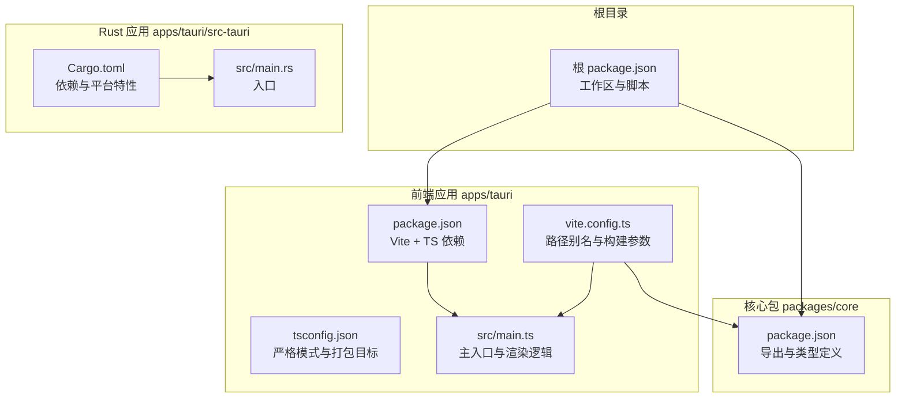
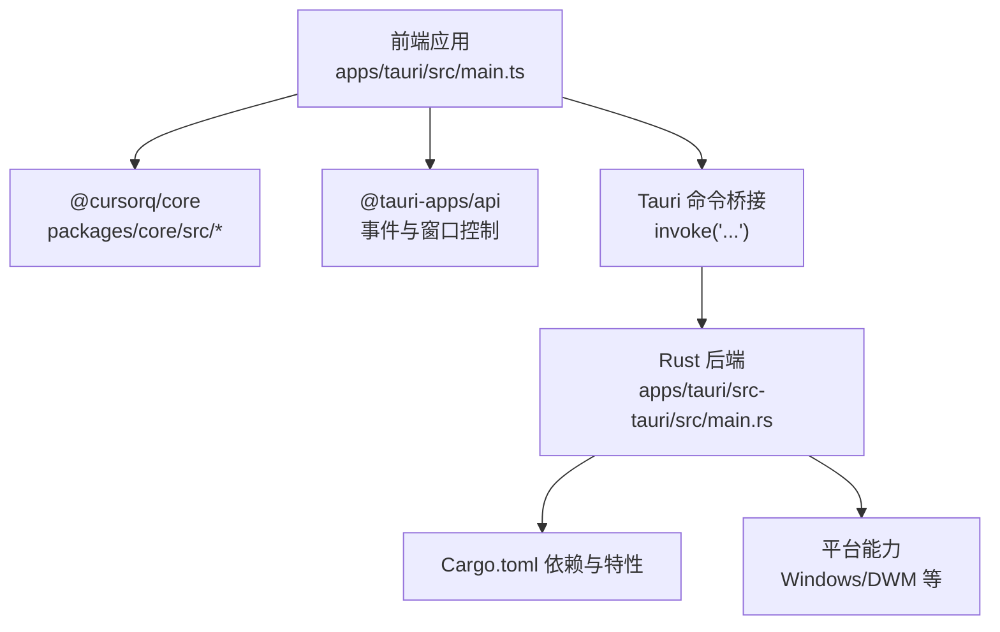
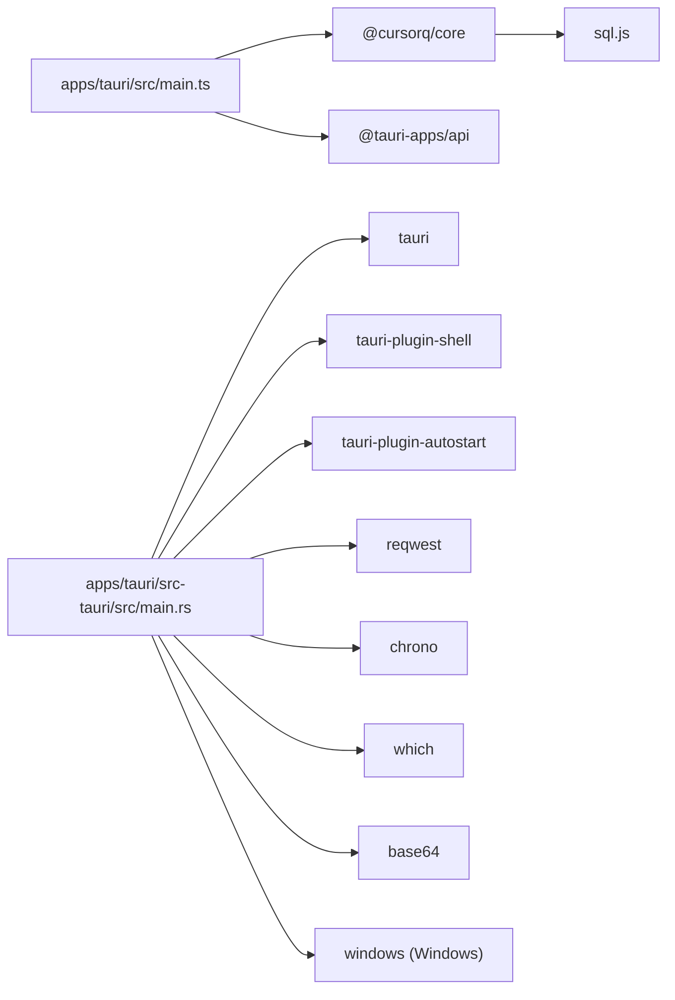

# 代码规范与风格

<cite>
**本文引用的文件**
- [package.json](file://package.json)
- [apps/tauri/package.json](file://apps/tauri/package.json)
- [packages/core/package.json](file://packages/core/package.json)
- [apps/tauri/tsconfig.json](file://apps/tauri/tsconfig.json)
- [apps/tauri/vite.config.ts](file://apps/tauri/vite.config.ts)
- [apps/tauri/src/main.ts](file://apps/tauri/src/main.ts)
- [apps/tauri/src-tauri/Cargo.toml](file://apps/tauri/src-tauri/Cargo.toml)
- [apps/tauri/src-tauri/src/main.rs](file://apps/tauri/src-tauri/src/main.rs)
</cite>

## 目录
1. [引言](#引言)
2. [项目结构](#项目结构)
3. [核心组件](#核心组件)
4. [架构总览](#架构总览)
5. [详细组件分析](#详细组件分析)
6. [依赖分析](#依赖分析)
7. [性能考虑](#性能考虑)
8. [故障排查指南](#故障排查指南)
9. [结论](#结论)
10. [附录](#附录)

## 引言
本指南旨在为 CursorQ 项目建立统一的代码规范与风格，覆盖 TypeScript 前端与 Rust 后端（Tauri）的编码标准、命名约定、缩进与注释规范、文件组织结构，并明确格式化工具的配置与使用方式。同时提供代码审查检查清单、质量门禁标准、Git 提交信息规范、分支命名约定与合并策略，以及文档注释与 API 文档生成建议，帮助团队在协作中保持一致的代码风格与高质量交付。

## 项目结构
CursorQ 采用多包工作区（monorepo）结构，核心模块位于 packages/core，桌面应用位于 apps/tauri，前端使用 Vite + TypeScript，后端使用 Tauri + Rust。根目录通过 npm 工作区管理脚本与版本，前端通过别名指向核心包源码以支持开发时热更新与类型提示。

图表来源
- [package.json:1-25](file://package.json#L1-L25)
- [apps/tauri/package.json:1-22](file://apps/tauri/package.json#L1-L22)
- [packages/core/package.json:1-32](file://packages/core/package.json#L1-L32)
- [apps/tauri/tsconfig.json:1-12](file://apps/tauri/tsconfig.json#L1-L12)
- [apps/tauri/vite.config.ts:1-21](file://apps/tauri/vite.config.ts#L1-L21)
- [apps/tauri/src/main.ts:1-711](file://apps/tauri/src/main.ts#L1-L711)
- [apps/tauri/src-tauri/Cargo.toml:1-37](file://apps/tauri/src-tauri/Cargo.toml#L1-L37)
- [apps/tauri/src-tauri/src/main.rs:1-6](file://apps/tauri/src-tauri/src/main.rs#L1-L6)

章节来源
- [package.json:1-25](file://package.json#L1-L25)
- [apps/tauri/package.json:1-22](file://apps/tauri/package.json#L1-L22)
- [packages/core/package.json:1-32](file://packages/core/package.json#L1-L32)
- [apps/tauri/tsconfig.json:1-12](file://apps/tauri/tsconfig.json#L1-L12)
- [apps/tauri/vite.config.ts:1-21](file://apps/tauri/vite.config.ts#L1-L21)

## 核心组件
- 根工作区与脚本
  - 使用 npm 工作区统一管理 packages/core 与 apps/tauri 的构建与测试脚本，确保跨包一致性与可复用性。
- 前端应用（apps/tauri）
  - 使用 Vite 进行开发与构建，TypeScript 编译器选项启用严格模式，打包目标面向现代浏览器。
  - 通过路径别名将 @cursorq/core 指向核心包源码，便于开发调试与类型推断。
- 核心包（packages/core）
  - 通过 TypeScript 构建输出类型声明与 JS 文件，提供浏览器与 Node 环境下的导出入口。
- Rust 应用（apps/tauri/src-tauri）
  - 使用 Cargo 管理依赖，启用必要的 Tauri 插件与 TLS 配置；按需引入 Windows 平台特性。

章节来源
- [package.json:10-23](file://package.json#L10-L23)
- [apps/tauri/package.json:6-20](file://apps/tauri/package.json#L6-L20)
- [packages/core/package.json:8-17](file://packages/core/package.json#L8-L17)
- [apps/tauri/tsconfig.json:2-9](file://apps/tauri/tsconfig.json#L2-L9)
- [apps/tauri/vite.config.ts:10-13](file://apps/tauri/vite.config.ts#L10-L13)
- [apps/tauri/src-tauri/Cargo.toml:15-25](file://apps/tauri/src-tauri/Cargo.toml#L15-L25)

## 架构总览
前端通过 Tauri 调用 Rust 后端能力，Rust 侧负责系统集成、网络请求与平台特性访问；前端负责 UI 渲染与交互逻辑。核心包提供共享的业务与 UI 组件能力，前端通过别名直接消费其源码以获得最佳开发体验。

图表来源
- [apps/tauri/src/main.ts:1-34](file://apps/tauri/src/main.ts#L1-L34)
- [apps/tauri/src-tauri/src/main.rs:1-6](file://apps/tauri/src-tauri/src/main.rs#L1-L6)
- [apps/tauri/src-tauri/Cargo.toml:15-33](file://apps/tauri/src-tauri/Cargo.toml#L15-L33)

## 详细组件分析

### TypeScript 规范与风格
- 命名约定
  - 变量与函数：采用小驼峰命名，语义清晰且避免缩写。
  - 接口与类型：采用大驼峰命名，接口名以“Interface”或“Type”结尾可选，但需保持一致性。
  - 常量：全大写下划线分隔，用于全局常量与枚举值。
  - 文件：功能模块使用小驼峰或分层目录组织，避免单文件过大。
- 缩进与空格
  - 统一使用 2 空格缩进，禁止混用 Tab 与空格。
  - 行尾不保留多余空格，文件末尾保留一个空行。
- 注释规范
  - 单行注释使用 //，块注释使用 /* ... */。
  - 函数与复杂逻辑前添加简要注释说明用途与输入输出。
  - TODO/FIXME 使用统一标记并在后续迭代中清理。
- 类型与严格性
  - 编译器选项启用严格模式，避免隐式 any。
  - 明确返回值类型与参数类型，必要时使用类型守卫。
- 导入与别名
  - 使用相对路径与绝对别名（如 @cursorq/core），避免深层相对路径。
  - 优先使用具名导入与默认导入分离，减少命名冲突。
- 文件组织
  - 按功能拆分模块，公共工具与类型集中于 core 包。
  - 组件与样式分离，事件监听与副作用集中在入口文件。

章节来源
- [apps/tauri/tsconfig.json:2-9](file://apps/tauri/tsconfig.json#L2-L9)
- [apps/tauri/vite.config.ts:10-13](file://apps/tauri/vite.config.ts#L10-L13)
- [apps/tauri/src/main.ts:54-103](file://apps/tauri/src/main.ts#L54-L103)

### Rust 规范与风格
- 命名约定
  - 模块与文件：蛇形命名（snake_case），与 Cargo 默认一致。
  - 结构体与枚举：帕斯卡命名（PascalCase），字段使用 snake_case。
  - 常量：SCREAMING_SNAKE_CASE。
  - 宏与过程宏：遵循 Rust 社区惯例，必要时添加文档注释。
- 缩进与空格
  - 使用 4 空格缩进，保持一致的视觉层级。
- 注释规范
  - 公共 API 使用文档注释（/// 或 /** ... */），描述行为、错误与使用示例。
  - 内部实现使用行内注释，避免过度注释。
- 依赖与特性
  - 明确启用所需特性，避免启用不必要的默认特性。
  - 平台相关依赖仅在对应平台启用，减少跨平台编译负担。
- 错误处理
  - 使用 Result<T, E> 表达可能失败的操作，错误传播使用 ?。
  - 对外暴露错误时提供上下文信息，便于定位问题。

章节来源
- [apps/tauri/src-tauri/Cargo.toml:15-33](file://apps/tauri/src-tauri/Cargo.toml#L15-L33)
- [apps/tauri/src-tauri/src/main.rs:1-6](file://apps/tauri/src-tauri/src/main.rs#L1-L6)

### 格式化工具与配置
- TypeScript/Vite
  - 使用 TypeScript 编译器严格模式与目标 ESNext，结合 Vite 别名与打包目标，保证产物兼容性与体积可控。
  - 建议在本地与 CI 中统一执行类型检查与构建命令，确保一致性。
- Rust
  - 使用 rustfmt 作为默认格式化工具，遵循社区默认风格。
  - 在 CI 中加入格式化检查与 clippy 警告检查，避免引入风格与潜在问题。
- 前端别名与路径解析
  - 通过 Vite 配置 @cursorq/core 指向核心包源码，提升开发效率与类型准确性。

章节来源
- [apps/tauri/tsconfig.json:2-9](file://apps/tauri/tsconfig.json#L2-L9)
- [apps/tauri/vite.config.ts:10-13](file://apps/tauri/vite.config.ts#L10-L13)
- [packages/core/package.json:8-17](file://packages/core/package.json#L8-L17)

### 代码审查检查清单
- TypeScript
  - 是否启用严格模式？类型是否完整？
  - 是否存在未使用的变量/导入？是否使用了合适的类型守卫？
  - 是否有重复的事件监听注册？是否在组件卸载时清理？
  - 是否使用了统一的命名与注释规范？
- Rust
  - 是否使用了合适的错误处理模式（Result）？
  - 是否启用了必要的特性与平台条件编译？
  - 是否对公共 API 添加了文档注释？
- 通用
  - 是否通过了类型检查与构建流程？
  - 是否满足性能与内存占用要求（避免频繁重排与阻塞主线程）？

章节来源
- [apps/tauri/src/main.ts:562-672](file://apps/tauri/src/main.ts#L562-L672)
- [apps/tauri/src-tauri/Cargo.toml:15-33](file://apps/tauri/src-tauri/Cargo.toml#L15-L33)

### 质量门禁标准
- 必须通过的检查
  - TypeScript：类型检查通过、构建成功、无严重 ESLint 警告。
  - Rust：rustfmt 通过、clippy 无警告、单元测试通过。
- 建议的检查
  - 前端：最小化与 SourceMap 开关符合开发/生产环境预期。
  - 后端：跨平台编译通过，平台特性按需启用。

章节来源
- [apps/tauri/vite.config.ts:15-19](file://apps/tauri/vite.config.ts#L15-L19)
- [apps/tauri/src-tauri/Cargo.toml:35-37](file://apps/tauri/src-tauri/Cargo.toml#L35-L37)

### Git 提交信息规范、分支命名与合并策略
- 提交信息规范
  - 类型：feat、fix、docs、style、refactor、perf、test、build、ci、chore、revert
  - 格式：type(scope): subject
  - 示例：feat(core): 添加预算计算模块
- 分支命名
  - 功能分支：feature/任务描述
  - 修复分支：fix/问题描述
  - 文档分支：docs/更新内容
  - 热修复：hotfix/紧急修复
- 合并策略
  - 使用 Pull Request 进行代码审查，确保至少一名维护者批准。
  - 合并前必须通过所有自动化检查（类型检查、构建、测试、格式化）。

[本节为通用实践建议，不直接分析具体文件，故不附“章节来源”]

### 文档注释与 API 文档生成
- TypeScript
  - 使用 JSDoc 风格注释，描述参数、返回值与异常场景。
  - 对外导出的函数与类型补充简要说明，便于自动生成 API 文档。
- Rust
  - 使用文档注释（///）描述公共 API 的用途、行为与注意事项。
  - 为枚举与结构体提供使用示例，提升可读性。
- 生成建议
  - TypeScript：可结合 typedoc 生成静态 API 文档。
  - Rust：使用 rustdoc 生成 HTML 文档，发布到文档托管服务。

[本节为通用实践建议，不直接分析具体文件，故不附“章节来源”]

## 依赖分析
前端应用依赖核心包与 Tauri API，核心包提供共享类型与业务逻辑；Rust 应用依赖 Tauri 生态与平台特性，按需启用 Windows 相关模块。

图表来源
- [apps/tauri/src/main.ts:1-34](file://apps/tauri/src/main.ts#L1-L34)
- [packages/core/package.json:24-26](file://packages/core/package.json#L24-L26)
- [apps/tauri/src-tauri/Cargo.toml:15-33](file://apps/tauri/src-tauri/Cargo.toml#L15-L33)

章节来源
- [apps/tauri/package.json:12-19](file://apps/tauri/package.json#L12-L19)
- [packages/core/package.json:24-26](file://packages/core/package.json#L24-L26)
- [apps/tauri/src-tauri/Cargo.toml:15-33](file://apps/tauri/src-tauri/Cargo.toml#L15-L33)

## 性能考虑
- 前端
  - 避免在渲染循环中进行昂贵操作，使用防抖与节流处理高频事件。
  - 控制 DOM 更新范围，合理使用虚拟滚动与懒加载。
  - 严格区分开发与生产构建，开启压缩与 SourceMap 以平衡调试与性能。
- 后端
  - 合理使用 TLS 与阻塞调用，避免长时间阻塞事件循环。
  - 平台特性仅在需要时启用，减少不必要的系统调用。

[本节提供一般性指导，不直接分析具体文件，故不附“章节来源”]

## 故障排查指南
- 前端常见问题
  - 事件未解绑导致内存泄漏：检查组件卸载逻辑，确保移除监听器与定时器。
  - 类型错误：确认 tsconfig 严格模式与类型导入完整。
- 后端常见问题
  - 平台特性缺失：检查平台条件编译与 Cargo.toml 特性开关。
  - 网络请求失败：确认 TLS 配置与超时设置，避免阻塞主线程。

章节来源
- [apps/tauri/src/main.ts:562-672](file://apps/tauri/src/main.ts#L562-L672)
- [apps/tauri/src-tauri/Cargo.toml:26-33](file://apps/tauri/src-tauri/Cargo.toml#L26-L33)

## 结论
通过统一的 TypeScript 与 Rust 编码规范、严格的类型与错误处理、完善的格式化与审查流程，以及清晰的 Git 工作流与文档标准，CursorQ 项目能够在多语言混合开发中保持高质量与高可维护性。建议团队在日常协作中持续遵循本指南，并根据实际演进适时调整。

[本节为总结性内容，不直接分析具体文件，故不附“章节来源”]

## 附录
- 关键文件速览
  - 根工作区与脚本：[package.json:10-23](file://package.json#L10-L23)
  - 前端依赖与构建：[apps/tauri/package.json:12-20](file://apps/tauri/package.json#L12-L20)
  - 核心包导出与类型：[packages/core/package.json:8-17](file://packages/core/package.json#L8-L17)
  - TypeScript 编译选项：[apps/tauri/tsconfig.json:2-9](file://apps/tauri/tsconfig.json#L2-L9)
  - Vite 别名与构建参数：[apps/tauri/vite.config.ts:10-19](file://apps/tauri/vite.config.ts#L10-L19)
  - 前端主入口与交互：[apps/tauri/src/main.ts:562-711](file://apps/tauri/src/main.ts#L562-L711)
  - Rust 依赖与平台特性：[apps/tauri/src-tauri/Cargo.toml:15-33](file://apps/tauri/src-tauri/Cargo.toml#L15-L33)
  - Rust 入口：[apps/tauri/src-tauri/src/main.rs:1-6](file://apps/tauri/src-tauri/src/main.rs#L1-L6)

[本节为索引性内容，不直接分析具体文件，故不附“章节来源”]