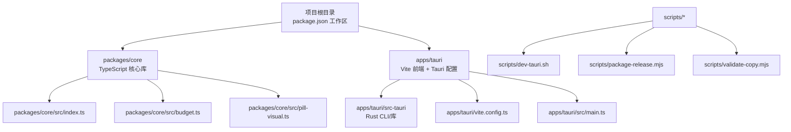
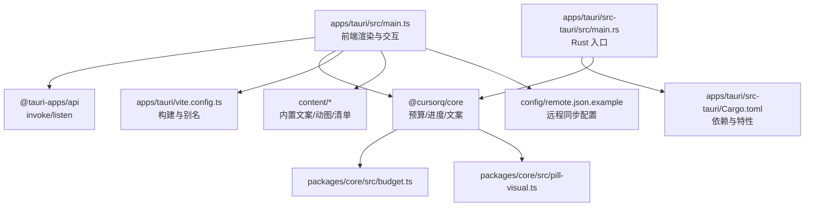
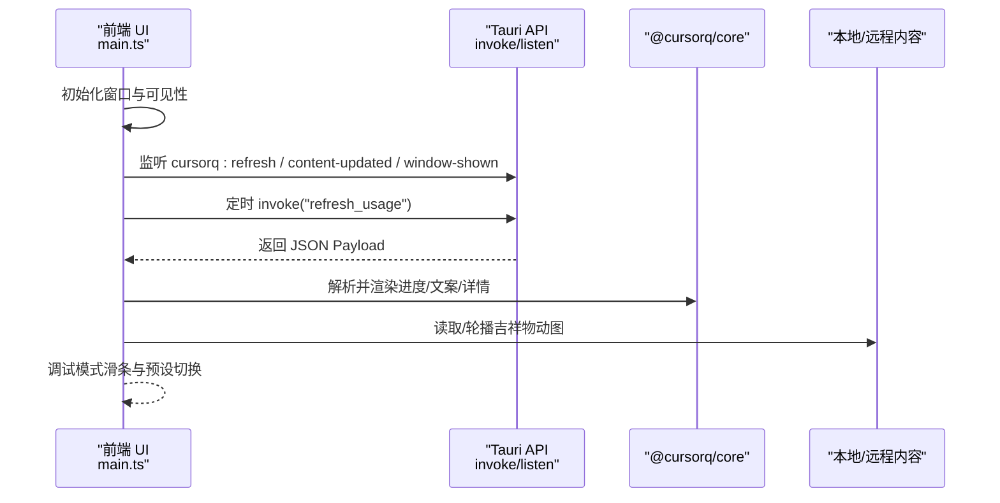
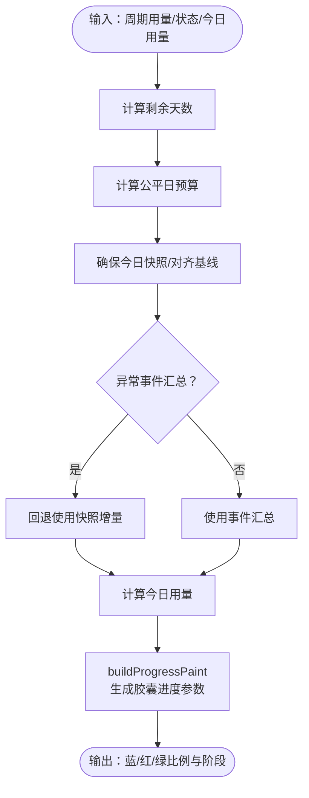
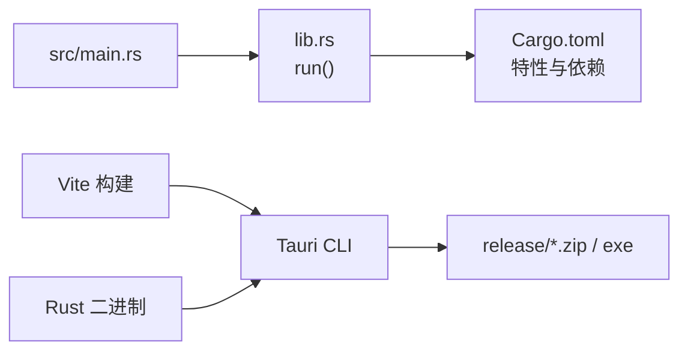
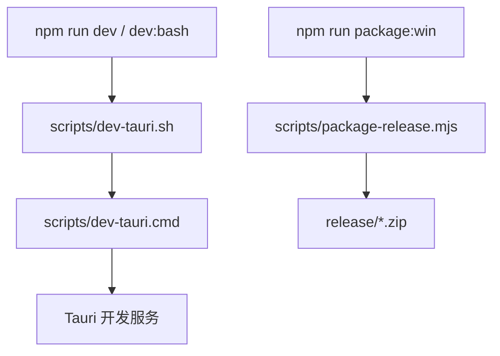
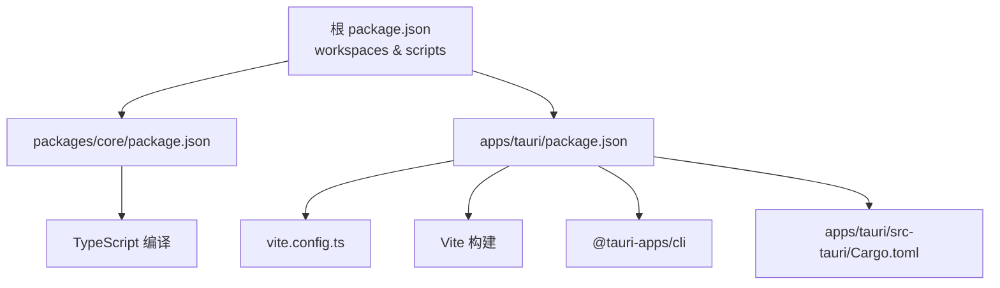

# 开发指南

<cite>
**本文引用的文件**
- [README.md](file://README.md)
- [package.json](file://package.json)
- [apps/tauri/package.json](file://apps/tauri/package.json)
- [packages/core/package.json](file://packages/core/package.json)
- [apps/tauri/src/main.ts](file://apps/tauri/src/main.ts)
- [apps/tauri/vite.config.ts](file://apps/tauri/vite.config.ts)
- [apps/tauri/src-tauri/Cargo.toml](file://apps/tauri/src-tauri/Cargo.toml)
- [apps/tauri/src-tauri/src/main.rs](file://apps/tauri/src-tauri/src/main.rs)
- [packages/core/src/index.ts](file://packages/core/src/index.ts)
- [packages/core/src/budget.ts](file://packages/core/src/budget.ts)
- [packages/core/src/pill-visual.ts](file://packages/core/src/pill-visual.ts)
- [scripts/dev-tauri.sh](file://scripts/dev-tauri.sh)
- [scripts/package-release.mjs](file://scripts/package-release.mjs)
- [scripts/validate-copy.mjs](file://scripts/validate-copy.mjs)
- [docs/TAURI_DEV_SETUP.md](file://docs/TAURI_DEV_SETUP.md)
- [docs/GITHUB_PREP.md](file://docs/GITHUB_PREP.md)
</cite>

## 目录
1. [简介](#简介)
2. [项目结构](#项目结构)
3. [核心组件](#核心组件)
4. [架构总览](#架构总览)
5. [详细组件分析](#详细组件分析)
6. [依赖关系分析](#依赖关系分析)
7. [性能考虑](#性能考虑)
8. [故障排除指南](#故障排除指南)
9. [结论](#结论)
10. [附录](#附录)

## 简介
本开发指南面向新加入的开发者，提供 CursorQ 项目的开发环境配置、代码规范与风格、测试策略与质量保证流程、构建与发布、版本管理与持续集成建议、代码审查与提交规范、分支管理策略、调试与性能分析方法以及贡献指南与问题报告模板。项目采用 Tauri 2 + Vite + TypeScript + Rust 的混合架构，核心逻辑位于 packages/core，UI 与托盘交互位于 apps/tauri。

## 项目结构
- 根目录包含工作区配置与顶层脚本，分别指向 packages/* 与 apps/*
- apps/tauri 为主程序，包含前端（Vite + TypeScript）、Tauri 配置与 Rust 后端
- packages/core 为核心业务逻辑（预算、进度计算、文案、存储等）
- scripts 提供开发与打包脚本
- content 与 config 提供内置内容与远程同步配置模板
- docs 提供开发与发布准备说明

图表来源
- [package.json:1-25](file://package.json#L1-L25)
- [apps/tauri/package.json:1-22](file://apps/tauri/package.json#L1-L22)
- [apps/tauri/vite.config.ts:1-21](file://apps/tauri/vite.config.ts#L1-L21)
- [apps/tauri/src/main.ts:1-711](file://apps/tauri/src/main.ts#L1-L711)
- [apps/tauri/src-tauri/Cargo.toml:1-37](file://apps/tauri/src-tauri/Cargo.toml#L1-L37)
- [packages/core/src/index.ts:1-35](file://packages/core/src/index.ts#L1-L35)
- [packages/core/src/budget.ts:1-274](file://packages/core/src/budget.ts#L1-L274)
- [packages/core/src/pill-visual.ts:1-79](file://packages/core/src/pill-visual.ts#L1-L79)
- [scripts/dev-tauri.sh:1-25](file://scripts/dev-tauri.sh#L1-L25)
- [scripts/package-release.mjs:1-136](file://scripts/package-release.mjs#L1-L136)
- [scripts/validate-copy.mjs:1-36](file://scripts/validate-copy.mjs#L1-L36)

章节来源
- [README.md:98-109](file://README.md#L98-L109)
- [package.json:6-9](file://package.json#L6-L9)
- [apps/tauri/package.json:1-22](file://apps/tauri/package.json#L1-L22)
- [packages/core/package.json:1-32](file://packages/core/package.json#L1-L32)

## 核心组件
- 核心库（packages/core）
  - 导出类型、鉴权、Cursor API、预算与节余银行、进度绘制、文案、存储、用量明细与计划等级/限额等
  - 关键模块：预算计算（budget.ts）、胶囊视觉（pill-visual.ts）、入口导出（index.ts）
- 前端应用（apps/tauri）
  - 主入口（main.ts）负责渲染 UI、处理交互、调用后端能力、监听事件、定时刷新
  - Vite 配置（vite.config.ts）提供别名与构建目标
- 后端（apps/tauri/src-tauri）
  - Rust 入口（main.rs）与 Cargo.toml 依赖（Tauri、autostart、shell、reqwest、windows 等）

章节来源
- [packages/core/src/index.ts:1-35](file://packages/core/src/index.ts#L1-L35)
- [packages/core/src/budget.ts:1-274](file://packages/core/src/budget.ts#L1-L274)
- [packages/core/src/pill-visual.ts:1-79](file://packages/core/src/pill-visual.ts#L1-L79)
- [apps/tauri/src/main.ts:1-711](file://apps/tauri/src/main.ts#L1-L711)
- [apps/tauri/vite.config.ts:1-21](file://apps/tauri/vite.config.ts#L1-L21)
- [apps/tauri/src-tauri/src/main.rs:1-6](file://apps/tauri/src-tauri/src/main.rs#L1-L6)
- [apps/tauri/src-tauri/Cargo.toml:1-37](file://apps/tauri/src-tauri/Cargo.toml#L1-L37)

## 架构总览
前端通过 Tauri 暴露的能力调用后端，后端通过 Cursor 本地状态与 API 获取用量数据，并结合本地内容与远程内容进行渲染与展示。

图表来源
- [apps/tauri/src/main.ts:1-711](file://apps/tauri/src/main.ts#L1-L711)
- [apps/tauri/vite.config.ts:1-21](file://apps/tauri/vite.config.ts#L1-L21)
- [apps/tauri/src-tauri/src/main.rs:1-6](file://apps/tauri/src-tauri/src/main.rs#L1-L6)
- [apps/tauri/src-tauri/Cargo.toml:1-37](file://apps/tauri/src-tauri/Cargo.toml#L1-L37)
- [packages/core/src/index.ts:1-35](file://packages/core/src/index.ts#L1-L35)
- [packages/core/src/budget.ts:1-274](file://packages/core/src/budget.ts#L1-L274)
- [packages/core/src/pill-visual.ts:1-79](file://packages/core/src/pill-visual.ts#L1-L79)

## 详细组件分析

### 前端主流程（apps/tauri/src/main.ts）
- 职责
  - 渲染胶囊与详情面板、处理拖拽与点击交互、定时刷新、监听后端事件、调试模式切换与滑条模拟
  - 调用后端能力（如刷新用量、拖拽、显示/隐藏胶囊）
- 关键流程
  - 初始化窗口与托盘可见性
  - 注册事件监听（刷新、内容更新、窗口显示）
  - 定时任务定期刷新
  - 交互处理（拖拽、双击、点击文案、调试提示行）

图表来源
- [apps/tauri/src/main.ts:524-560](file://apps/tauri/src/main.ts#L524-L560)
- [apps/tauri/src/main.ts:698-711](file://apps/tauri/src/main.ts#L698-L711)
- [apps/tauri/src/main.ts:299-317](file://apps/tauri/src/main.ts#L299-L317)

章节来源
- [apps/tauri/src/main.ts:1-711](file://apps/tauri/src/main.ts#L1-L711)

### 预算与进度计算（packages/core）
- 预算模块（budget.ts）
  - 计算周期剩余天数、公平日预算、节余银行结算、今日快照、对齐基线、修复异常快照、解析今日用量
- 胶囊视觉（pill-visual.ts）
  - 将预算与用量转换为胶囊进度绘制参数（蓝/红/绿阶段、比例等）

图表来源
- [packages/core/src/budget.ts:102-147](file://packages/core/src/budget.ts#L102-L147)
- [packages/core/src/budget.ts:194-236](file://packages/core/src/budget.ts#L194-L236)
- [packages/core/src/budget.ts:243-272](file://packages/core/src/budget.ts#L243-L272)
- [packages/core/src/pill-visual.ts:29-63](file://packages/core/src/pill-visual.ts#L29-L63)

章节来源
- [packages/core/src/budget.ts:1-274](file://packages/core/src/budget.ts#L1-L274)
- [packages/core/src/pill-visual.ts:1-79](file://packages/core/src/pill-visual.ts#L1-L79)

### Rust 后端与构建（apps/tauri/src-tauri）
- 入口与特性
  - main.rs 调用库 run()，Cargo.toml 启用协议资产、托盘图标、autostart、shell、reqwest、windows 等
- 开发与打包
  - 通过 Tauri CLI 与 Vite 构建前端，Rust 编译后端，最终打包为 Windows 便携包

图表来源
- [apps/tauri/src-tauri/src/main.rs:1-6](file://apps/tauri/src-tauri/src/main.rs#L1-L6)
- [apps/tauri/src-tauri/Cargo.toml:1-37](file://apps/tauri/src-tauri/Cargo.toml#L1-L37)

章节来源
- [apps/tauri/src-tauri/src/main.rs:1-6](file://apps/tauri/src-tauri/src/main.rs#L1-L6)
- [apps/tauri/src-tauri/Cargo.toml:1-37](file://apps/tauri/src-tauri/Cargo.toml#L1-L37)

### 构建与发布（scripts）
- 开发启动
  - Git Bash：scripts/dev-tauri.sh → dev-tauri.cmd（自动走 MSVC + cargo）
- 打包发布（Windows 便携包）
  - scripts/package-release.mjs：构建 core、前端、Rust，组装 content/config/data/scripts，压缩为 zip
- 文案校验
  - scripts/validate-copy.mjs：检查 jokes.json 与 states.json 行宽限制

图表来源
- [scripts/dev-tauri.sh:1-25](file://scripts/dev-tauri.sh#L1-L25)
- [scripts/package-release.mjs:1-136](file://scripts/package-release.mjs#L1-L136)

章节来源
- [scripts/dev-tauri.sh:1-25](file://scripts/dev-tauri.sh#L1-L25)
- [scripts/package-release.mjs:1-136](file://scripts/package-release.mjs#L1-L136)
- [scripts/validate-copy.mjs:1-36](file://scripts/validate-copy.mjs#L1-L36)

## 依赖关系分析
- 工作区与脚本
  - 根 package.json 定义工作区与脚本（构建 core、开发、打包、类型检查、文案校验）
  - apps/tauri/package.json 定义前端脚本与依赖（Vite、TypeScript、@tauri-apps/api）
  - packages/core/package.json 定义核心库构建与测试（TypeScript、sql.js）
- 前端别名与构建目标
  - vite.config.ts 将 @cursorq/core 指向 packages/core/src/browser.ts，构建目标 es2021/chrome100
- Rust 依赖
  - Cargo.toml 引入 tauri、tauri-plugin-*、reqwest、chrono、windows 等

图表来源
- [package.json:1-25](file://package.json#L1-L25)
- [apps/tauri/package.json:1-22](file://apps/tauri/package.json#L1-L22)
- [apps/tauri/vite.config.ts:1-21](file://apps/tauri/vite.config.ts#L1-L21)
- [packages/core/package.json:1-32](file://packages/core/package.json#L1-L32)
- [apps/tauri/src-tauri/Cargo.toml:1-37](file://apps/tauri/src-tauri/Cargo.toml#L1-L37)

章节来源
- [package.json:1-25](file://package.json#L1-L25)
- [apps/tauri/package.json:1-22](file://apps/tauri/package.json#L1-L22)
- [apps/tauri/vite.config.ts:1-21](file://apps/tauri/vite.config.ts#L1-L21)
- [packages/core/package.json:1-32](file://packages/core/package.json#L1-L32)
- [apps/tauri/src-tauri/Cargo.toml:1-37](file://apps/tauri/src-tauri/Cargo.toml#L1-L37)

## 性能考虑
- 前端渲染
  - 避免滚动动画触发 WebView 白边：展开/收起时直接设定高度
  - 定时刷新间隔较长（30 分钟），减少网络与渲染压力
- Rust 后端
  - Windows 平台启用 DWM 相关特性，优化窗口边缘与透明效果
- 构建与打包
  - 前端构建目标针对现代浏览器，生产环境可开启压缩与 SourceMap 控制
  - 打包脚本最小化 node_modules，仅复制必要依赖（如 sql.js 的 wasm）

章节来源
- [apps/tauri/src/main.ts:492-522](file://apps/tauri/src/main.ts#L492-L522)
- [apps/tauri/src/main.ts:710-711](file://apps/tauri/src/main.ts#L710-L711)
- [apps/tauri/src-tauri/Cargo.toml:26-33](file://apps/tauri/src-tauri/Cargo.toml#L26-L33)
- [apps/tauri/vite.config.ts:15-19](file://apps/tauri/vite.config.ts#L15-L19)
- [scripts/package-release.mjs:101-122](file://scripts/package-release.mjs#L101-L122)

## 故障排除指南
- 开发环境自检
  - 参考 docs/TAURI_DEV_SETUP.md 的自检命令与期望结果，确保 MSVC 工具链、WebView2、Tauri CLI 可用
- 常见问题
  - MSVC 链接失败：确认 rustup 默认工具链为 stable-x86_64-pc-windows-msvc，安装 VS 构建工具
  - WebView2 缺失：安装 WebView2 Evergreen Bootstrapper
  - Git Bash 启动：使用 scripts/dev-tauri.sh 或配置 cqdev 命令
- 文案校验失败
  - 使用 scripts/validate-copy.mjs 校验 jokes.json 与 states.json 的行宽限制
- 发布包缺失
  - 确认 Rust 与 Vite 构建成功后再执行打包脚本

章节来源
- [docs/TAURI_DEV_SETUP.md:96-126](file://docs/TAURI_DEV_SETUP.md#L96-L126)
- [scripts/validate-copy.mjs:18-35](file://scripts/validate-copy.mjs#L18-L35)
- [scripts/package-release.mjs:54-66](file://scripts/package-release.mjs#L54-L66)

## 结论
本指南提供了从环境搭建、开发流程、核心组件、构建发布到故障排除的完整指引。建议团队遵循统一的脚本与配置，保持前后端职责清晰，通过脚本自动化提升一致性与可重复性。

## 附录

### 开发环境配置
- 环境要求
  - Windows 10+、Node.js 20+、Rust（MSVC 工具链）、WebView2
- 必要安装与修改
  - Visual Studio C++ 构建工具（MSVC + Windows SDK）
  - WebView2 运行时
  - 切换 Rust 工具链为 MSVC
  - 使用项目内 @tauri-apps/cli，避免 cargo install tauri-cli
- Git Bash 配置
  - 安装 bash hook，获得 cqdev / cq 命令
- 自检与冒烟编译
  - 执行自检命令，验证工具链与版本
  - 在临时目录进行冒烟编译

章节来源
- [README.md:14-19](file://README.md#L14-L19)
- [docs/TAURI_DEV_SETUP.md:1-143](file://docs/TAURI_DEV_SETUP.md#L1-L143)

### 代码规范与风格
- TypeScript
  - 使用 TypeScript 5，遵循 packages/core 与 apps/tauri 的类型定义
  - 前端构建目标 es2021/chrome100，生产环境可控制压缩与 SourceMap
- Rust
  - 使用 MSVC 工具链，启用所需特性（tray-icon、autostart、shell 等）
- 文案
  - 使用 scripts/validate-copy.mjs 校验 jokes.json 与 states.json 的显示宽度

章节来源
- [packages/core/package.json:27-30](file://packages/core/package.json#L27-L30)
- [apps/tauri/package.json:16-20](file://apps/tauri/package.json#L16-L20)
- [apps/tauri/vite.config.ts:15-19](file://apps/tauri/vite.config.ts#L15-L19)
- [apps/tauri/src-tauri/Cargo.toml:15-25](file://apps/tauri/src-tauri/Cargo.toml#L15-L25)
- [scripts/validate-copy.mjs:7-16](file://scripts/validate-copy.mjs#L7-L16)

### 测试策略与质量保证
- 类型检查
  - 在 packages/core 执行类型检查脚本
- 单元测试
  - packages/core 提供测试脚本，构建后执行 dist/*.test.js
- 文案校验
  - 使用 scripts/validate-copy.mjs 校验内置文案
- 质量门禁建议
  - 在 CI 中执行类型检查、单元测试与文案校验

章节来源
- [packages/core/package.json:18-23](file://packages/core/package.json#L18-L23)
- [scripts/validate-copy.mjs:1-36](file://scripts/validate-copy.mjs#L1-L36)

### 构建与发布流程
- 开发
  - npm install → npm run build → npm run dev
  - Git Bash：npm run dev:bash 或 cqdev 命令
- 打包（Windows 便携包）
  - npm run package:win → 生成 release/cursorq-<version>-win64.zip
- 发布前检查
  - 参考 docs/GITHUB_PREP.md，确保仓库内容与忽略项正确

章节来源
- [README.md:21-28](file://README.md#L21-L28)
- [README.md:111-119](file://README.md#L111-L119)
- [scripts/package-release.mjs:1-136](file://scripts/package-release.mjs#L1-L136)
- [docs/GITHUB_PREP.md:1-67](file://docs/GITHUB_PREP.md#L1-L67)

### 版本管理与持续集成
- 版本来源
  - Windows 可执行文件版本来自 apps/tauri/src-tauri/tauri.conf.json（脚本读取）
- 建议
  - 使用语义化版本，变更 content/manifest.json 的 version 并提交
  - 在 CI 中执行构建、测试与打包脚本，生成发布包

章节来源
- [scripts/package-release.mjs:14-16](file://scripts/package-release.mjs#L14-L16)
- [docs/GITHUB_PREP.md:42-62](file://docs/GITHUB_PREP.md#L42-L62)

### 代码审查与提交规范
- 建议
  - 提交信息清晰描述变更目的与影响
  - 代码审查关注：功能正确性、性能影响、错误处理、可维护性
  - 保持脚本与配置的一致性（Vite、Cargo、package.json）

章节来源
- [scripts/package-release.mjs:101-122](file://scripts/package-release.mjs#L101-L122)
- [apps/tauri/vite.config.ts:1-21](file://apps/tauri/vite.config.ts#L1-L21)
- [apps/tauri/src-tauri/Cargo.toml:1-37](file://apps/tauri/src-tauri/Cargo.toml#L1-L37)

### 分支管理策略
- 建议
  - main 分支用于发布，功能开发在特性分支，变更内容通过 PR 合并
  - 发布前在 docs/GITHUB_PREP.md 的清单基础上核对仓库内容

章节来源
- [docs/GITHUB_PREP.md:38-53](file://docs/GITHUB_PREP.md#L38-L53)

### 调试技巧与性能分析
- 调试模式
  - 在详情面板提示行连点三下进入调试模式，使用滑条模拟不同用量状态
- 性能分析
  - 前端：利用浏览器开发者工具观察渲染与网络请求
  - 后端：通过日志定位网络与系统调用问题

章节来源
- [README.md:62-64](file://README.md#L62-L64)
- [apps/tauri/src/main.ts:299-317](file://apps/tauri/src/main.ts#L299-L317)

### 贡献指南与问题报告模板
- 贡献方式
  - Fork 仓库，创建特性分支，提交 PR
- 问题报告
  - 描述环境信息（Node/Rust/Tauri 版本、平台）
  - 复现步骤、预期行为与实际行为
  - 相关日志与截图（注意敏感信息）

章节来源
- [docs/GITHUB_PREP.md:19-37](file://docs/GITHUB_PREP.md#L19-L37)