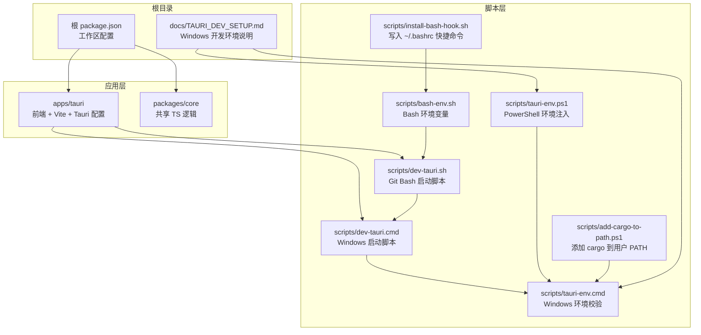
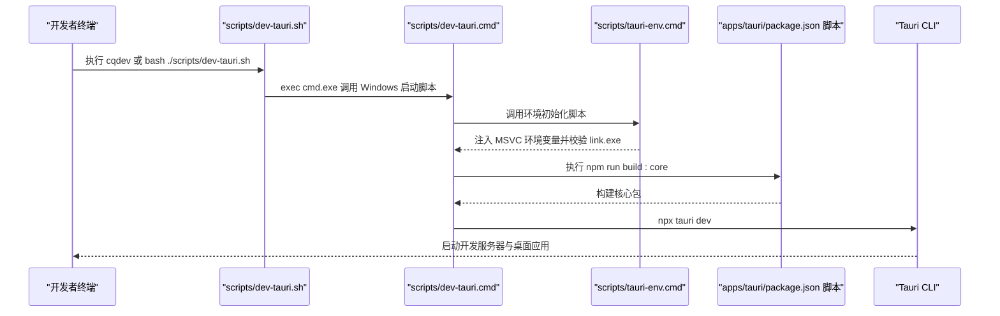
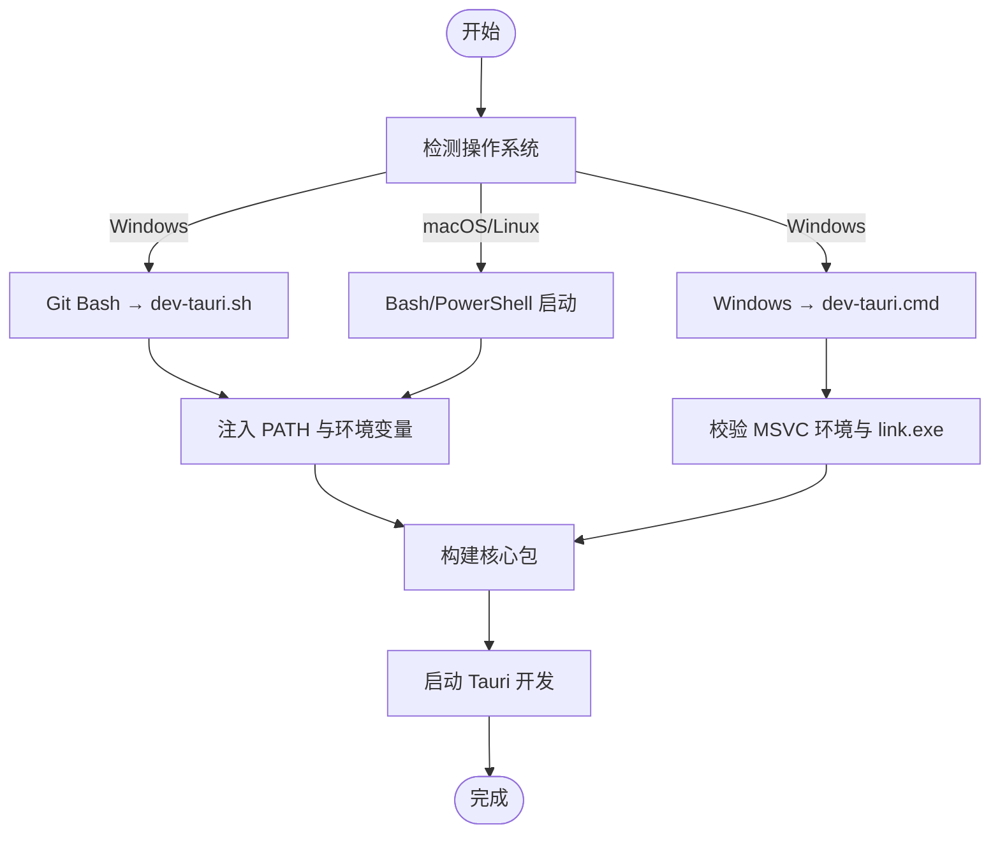
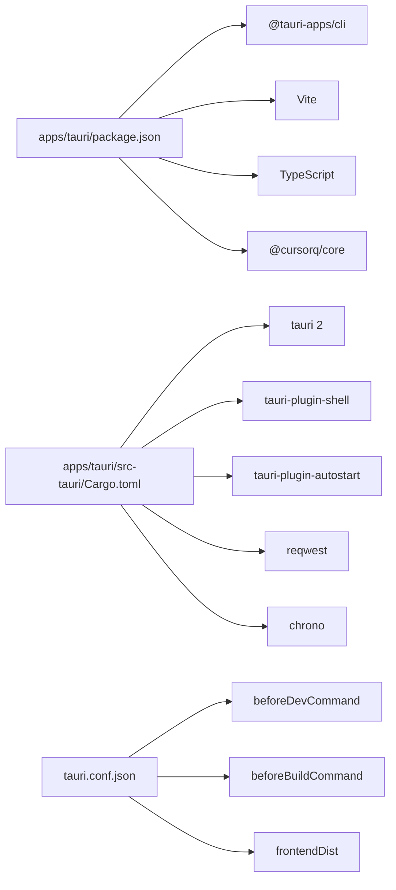

# 开发环境配置

<cite>
**本文引用的文件**
- [docs/TAURI_DEV_SETUP.md](file://docs/TAURI_DEV_SETUP.md)
- [apps/tauri/package.json](file://apps/tauri/package.json)
- [apps/tauri/vite.config.ts](file://apps/tauri/vite.config.ts)
- [apps/tauri/tsconfig.json](file://apps/tauri/tsconfig.json)
- [apps/tauri/src/main.ts](file://apps/tauri/src/main.ts)
- [apps/tauri/src-tauri/Cargo.toml](file://apps/tauri/src-tauri/Cargo.toml)
- [apps/tauri/src-tauri/tauri.conf.json](file://apps/tauri/src-tauri/tauri.conf.json)
- [apps/tauri/src-tauri/src/main.rs](file://apps/tauri/src-tauri/src/main.rs)
- [scripts/dev-tauri.sh](file://scripts/dev-tauri.sh)
- [scripts/dev-tauri.cmd](file://scripts/dev-tauri.cmd)
- [scripts/tauri-env.ps1](file://scripts/tauri-env.ps1)
- [scripts/tauri-env.cmd](file://scripts/tauri-env.cmd)
- [scripts/add-cargo-to-path.ps1](file://scripts/add-cargo-to-path.ps1)
- [scripts/install-bash-hook.sh](file://scripts/install-bash-hook.sh)
- [scripts/bash-env.sh](file://scripts/bash-env.sh)
- [package.json](file://package.json)
</cite>

## 目录
1. [简介](#简介)
2. [项目结构](#项目结构)
3. [核心组件](#核心组件)
4. [架构总览](#架构总览)
5. [详细组件分析](#详细组件分析)
6. [依赖关系分析](#依赖关系分析)
7. [性能考虑](#性能考虑)
8. [故障排除指南](#故障排除指南)
9. [结论](#结论)
10. [附录](#附录)

## 简介
本文件面向新加入的开发者，提供 CursorQ（基于 Tauri 2）的完整开发环境配置指南。内容覆盖 Windows、macOS、Linux 的安装与配置要点，解释开发工具链（Node.js、Rust 工具链、MSVC/SDK）、IDE 推荐与调试配置、环境变量与路径设置，并给出常见问题排查与自检清单，帮助快速搭建稳定可靠的本地开发环境。

## 项目结构
CursorQ 采用多工作区（monorepo）组织方式，核心模块包括：
- apps/tauri：Tauri 2 桌面应用前端与构建配置
- packages/core：共享的 TypeScript 核心逻辑（用量、文案、鉴权等）
- scripts：开发与环境配置脚本（PowerShell、Bash、批处理）
- docs：开发环境与准备文档

图表来源
- [package.json:10-20](file://package.json#L10-L20)
- [apps/tauri/package.json:6-11](file://apps/tauri/package.json#L6-L11)
- [scripts/dev-tauri.sh:1-25](file://scripts/dev-tauri.sh#L1-L25)
- [scripts/dev-tauri.cmd:1-17](file://scripts/dev-tauri.cmd#L1-L17)
- [scripts/tauri-env.ps1:1-19](file://scripts/tauri-env.ps1#L1-L19)
- [scripts/tauri-env.cmd:1-9](file://scripts/tauri-env.cmd#L1-L9)
- [scripts/add-cargo-to-path.ps1:1-72](file://scripts/add-cargo-to-path.ps1#L1-L72)
- [scripts/install-bash-hook.sh:1-41](file://scripts/install-bash-hook.sh#L1-L41)
- [scripts/bash-env.sh:1-21](file://scripts/bash-env.sh#L1-L21)
- [docs/TAURI_DEV_SETUP.md:1-143](file://docs/TAURI_DEV_SETUP.md#L1-L143)

章节来源
- [package.json:6-24](file://package.json#L6-L24)
- [apps/tauri/package.json:1-22](file://apps/tauri/package.json#L1-L22)

## 核心组件
- Node.js 与包管理：项目使用 npm 工作区，Node 版本要求 ≥ 20；前端使用 Vite，TypeScript 严格模式。
- Rust 工具链：Tauri 2 需要 MSVC 工具链（Windows），并确保 cargo 可用。
- Tauri CLI：通过 npm 安装的 @tauri-apps/cli，避免直接使用 cargo 安装。
- 开发启动流程：通过根脚本或 Bash/PowerShell 脚本统一进入开发模式，自动注入 MSVC 环境与 PATH。

章节来源
- [apps/tauri/package.json:6-20](file://apps/tauri/package.json#L6-L20)
- [apps/tauri/tsconfig.json:2-9](file://apps/tauri/tsconfig.json#L2-L9)
- [apps/tauri/vite.config.ts:7-20](file://apps/tauri/vite.config.ts#L7-L20)
- [apps/tauri/src-tauri/Cargo.toml:15-25](file://apps/tauri/src-tauri/Cargo.toml#L15-L25)
- [package.json:10-20](file://package.json#L10-L20)

## 架构总览
下图展示从终端到应用启动的关键调用链，涵盖环境注入、脚本转发与 Tauri CLI 调用：

图表来源
- [scripts/dev-tauri.sh:1-25](file://scripts/dev-tauri.sh#L1-L25)
- [scripts/dev-tauri.cmd:1-17](file://scripts/dev-tauri.cmd#L1-L17)
- [scripts/tauri-env.cmd:1-9](file://scripts/tauri-env.cmd#L1-L9)
- [apps/tauri/package.json:6-11](file://apps/tauri/package.json#L6-L11)

## 详细组件分析

### Windows 开发环境配置
- 必备组件
  - Node.js 20+、npm
  - Visual Studio C++ 构建工具（含 MSVC v143 与 Windows SDK）
  - WebView2 运行时（若系统未自带）
  - Rust（切换到 MSVC 工具链）
- 环境注入与校验
  - PowerShell 环境脚本会注入 cargo bin 并加载 MSVC 环境变量，随后打印当前工具链与 link.exe 路径用于核对。
  - Windows 批处理脚本会调用 vcvars64.bat 并校验 link.exe 是否来自 MSVC。
- PATH 永久配置
  - 提供 PowerShell 脚本自动将用户级 %USERPROFILE%\.cargo\bin 写入用户 PATH，并清理无效条目。
- 开发启动
  - Git Bash：执行安装脚本写入 ~/.bashrc，提供 cqdev、cq 等快捷命令；或直接执行 scripts/dev-tauri.sh。
  - Windows：执行 scripts/dev-tauri.cmd，内部会先注入环境再启动 Tauri 开发。

章节来源
- [docs/TAURI_DEV_SETUP.md:3-44](file://docs/TAURI_DEV_SETUP.md#L3-L44)
- [docs/TAURI_DEV_SETUP.md:53-67](file://docs/TAURI_DEV_SETUP.md#L53-L67)
- [docs/TAURI_DEV_SETUP.md:68-93](file://docs/TAURI_DEV_SETUP.md#L68-L93)
- [scripts/tauri-env.ps1:1-19](file://scripts/tauri-env.ps1#L1-L19)
- [scripts/tauri-env.cmd:1-9](file://scripts/tauri-env.cmd#L1-L9)
- [scripts/add-cargo-to-path.ps1:1-72](file://scripts/add-cargo-to-path.ps1#L1-L72)
- [scripts/install-bash-hook.sh:1-41](file://scripts/install-bash-hook.sh#L1-L41)
- [scripts/dev-tauri.sh:1-25](file://scripts/dev-tauri.sh#L1-L25)
- [scripts/dev-tauri.cmd:1-17](file://scripts/dev-tauri.cmd#L1-L17)

### macOS/Linux 开发环境配置
- Node.js 与 npm：满足版本要求，使用 npm 工作区管理。
- Rust 工具链：建议使用 rustup，默认工具链为 stable（非 GNU）。虽然仓库文档主要针对 Windows，但 macOS/Linux 仍需确保 Rust 可用且 PATH 正确。
- Tauri CLI：通过 npm 安装的 @tauri-apps/cli，避免直接 cargo install。
- 开发启动：在 Bash/PowerShell 环境下，使用根脚本或 apps/tauri 的脚本进入开发模式。

章节来源
- [apps/tauri/package.json:16-20](file://apps/tauri/package.json#L16-L20)
- [package.json:10-20](file://package.json#L10-L20)

### IDE 与编辑器配置（VS Code）
- 推荐扩展
  - TypeScript Vue Plugin（支持 Volar/Vue 类型）
  - ESLint/Prettier（保持一致风格）
  - Rust（rls/rust-analyzer）
  - Tauri 相关语言服务（如需要）
- 调试配置
  - 使用 VS Code 启动配置分别调试前端（Vite）与后端（Rust/Tauri）。
  - 建议在根目录创建 launch.json，包含前端调试与后端调试任务。
- 项目设置
  - 将工作区根目录作为 VS Code 项目根，启用 TypeScript 严格模式与路径别名解析。

章节来源
- [apps/tauri/vite.config.ts:7-20](file://apps/tauri/vite.config.ts#L7-L20)
- [apps/tauri/tsconfig.json:2-9](file://apps/tauri/tsconfig.json#L2-L9)

### 环境变量与路径设置
- 用户 PATH 注入
  - PowerShell 脚本会将 %USERPROFILE%\.cargo\bin 写入用户级 PATH，并广播环境变更通知。
- Bash 环境
  - Bash Hook 会在 ~/.bashrc 写入环境注入与快捷命令；Bash 独立脚本提供 cqdev、cq 函数。
- Tauri 开发端口
  - Vite 默认监听 1420 端口，可在开发环境中保持不变。

章节来源
- [scripts/add-cargo-to-path.ps1:12-49](file://scripts/add-cargo-to-path.ps1#L12-L49)
- [scripts/install-bash-hook.sh:25-32](file://scripts/install-bash-hook.sh#L25-L32)
- [scripts/bash-env.sh:12-21](file://scripts/bash-env.sh#L12-L21)
- [apps/tauri/vite.config.ts:14](file://apps/tauri/vite.config.ts#L14)

### 开发启动流程与控制流
- Git Bash 启动
  - dev-tauri.sh 会注入 PATH 并将项目根转换为 Windows 风格路径，然后调用 dev-tauri.cmd。
- Windows 启动
  - dev-tauri.cmd 先调用 tauri-env.cmd 注入 MSVC 环境并校验，再构建核心包，最后启动 Tauri 开发。
- Tauri 配置
  - tauri.conf.json 指定开发前/构建前命令、前端打包输出目录与窗口透明无框等特性。

图表来源
- [scripts/dev-tauri.sh:8-24](file://scripts/dev-tauri.sh#L8-L24)
- [scripts/dev-tauri.cmd:3-12](file://scripts/dev-tauri.cmd#L3-L12)
- [scripts/tauri-env.cmd:3-8](file://scripts/tauri-env.cmd#L3-L8)
- [apps/tauri/src-tauri/tauri.conf.json:6-11](file://apps/tauri/src-tauri/tauri.conf.json#L6-L11)

章节来源
- [scripts/dev-tauri.sh:1-25](file://scripts/dev-tauri.sh#L1-L25)
- [scripts/dev-tauri.cmd:1-17](file://scripts/dev-tauri.cmd#L1-L17)
- [scripts/tauri-env.cmd:1-9](file://scripts/tauri-env.cmd#L1-L9)
- [apps/tauri/src-tauri/tauri.conf.json:1-48](file://apps/tauri/src-tauri/tauri.conf.json#L1-L48)

## 依赖关系分析
- 应用层依赖
  - apps/tauri 依赖 @tauri-apps/cli、Vite、TypeScript，以及 packages/core。
  - Rust 侧依赖 tauri 2、tauri-plugin-*、reqwest、chrono 等。
- 构建与运行
  - tauri.conf.json 定义了 beforeDevCommand、beforeBuildCommand 与前端打包输出目录。
  - src/main.ts 作为前端入口，调用 Tauri API 与核心逻辑。

图表来源
- [apps/tauri/package.json:12-20](file://apps/tauri/package.json#L12-L20)
- [apps/tauri/src-tauri/Cargo.toml:15-25](file://apps/tauri/src-tauri/Cargo.toml#L15-L25)
- [apps/tauri/src-tauri/tauri.conf.json:6-11](file://apps/tauri/src-tauri/tauri.conf.json#L6-L11)

章节来源
- [apps/tauri/package.json:1-22](file://apps/tauri/package.json#L1-L22)
- [apps/tauri/src-tauri/Cargo.toml:1-37](file://apps/tauri/src-tauri/Cargo.toml#L1-L37)
- [apps/tauri/src-tauri/tauri.conf.json:1-48](file://apps/tauri/src-tauri/tauri.conf.json#L1-L48)

## 性能考虑
- 首次 Rust 构建时间较长：首次在新机器或全新工具链环境下进行 Rust 构建可能需要 5–15 分钟，请耐心等待。
- 开发服务器端口固定：Vite 监听 1420 端口，避免与其他项目冲突。
- 透明窗口与最小化渲染：Tauri 配置为透明窗口与无装饰，减少不必要的绘制开销。

章节来源
- [scripts/dev-tauri.sh:23](file://scripts/dev-tauri.sh#L23)
- [apps/tauri/vite.config.ts:14](file://apps/tauri/vite.config.ts#L14)
- [apps/tauri/src-tauri/tauri.conf.json:13-30](file://apps/tauri/src-tauri/tauri.conf.json#L13-L30)

## 故障排除指南
- Rust 链接器找不到（link.exe）
  - 症状：提示找不到 link.exe 或链接失败。
  - 解决：安装 Visual Studio Build Tools（含 MSVC v143 与 Windows SDK），并在 PowerShell 中切换到 MSVC 工具链。
- WebView2 运行时缺失
  - 症状：tauri dev 报 WebView2 相关错误。
  - 解决：安装 Microsoft Edge WebView2 运行时。
- cargo 不在 PATH
  - 症状：终端执行 cargo -V 失败。
  - 解决：运行 PowerShell 脚本将用户级 %USERPROFILE%\.cargo\bin 写入 PATH，并重新打开终端。
- 环境变量未生效
  - 症状：rustup 或 link 路径不对。
  - 解决：使用 tauri-env.ps1/tauri-env.cmd 显式注入并校验环境；必要时重启终端或系统。

章节来源
- [docs/TAURI_DEV_SETUP.md:15-44](file://docs/TAURI_DEV_SETUP.md#L15-L44)
- [docs/TAURI_DEV_SETUP.md:96-125](file://docs/TAURI_DEV_SETUP.md#L96-L125)
- [scripts/tauri-env.ps1:17-18](file://scripts/tauri-env.ps1#L17-L18)
- [scripts/tauri-env.cmd:4-7](file://scripts/tauri-env.cmd#L4-L7)
- [scripts/add-cargo-to-path.ps1:7-10](file://scripts/add-cargo-to-path.ps1#L7-L10)

## 结论
通过本指南，您可以在 Windows/macOS/Linux 上完成 Tauri 2 开发环境的搭建与验证。重点在于：
- Windows：正确安装 MSVC + Windows SDK，切换 Rust 到 MSVC 工具链，注入 PATH 并校验环境。
- macOS/Linux：确保 Node 与 Rust 可用，使用 npm 工作区与 @tauri-apps/cli。
- 使用提供的脚本与配置，统一开发启动流程，减少环境差异带来的问题。

## 附录

### 环境自检清单（Windows）
- Node.js 与 npm：版本满足要求
- Rust 工具链：当前为 MSVC（stable-x86_64-pc-windows-msvc）
- MSVC 链接器：where link 输出指向 Microsoft Visual Studio
- Tauri CLI：cargo tauri --version 为 2.x.x
- PATH：包含 %USERPROFILE%\.cargo\bin
- WebView2：系统自带或已安装运行时

章节来源
- [docs/TAURI_DEV_SETUP.md:96-115](file://docs/TAURI_DEV_SETUP.md#L96-L115)

### 开发启动命令参考
- Windows（PowerShell/Bash）：使用根脚本或 apps/tauri 的脚本进入开发模式
- Git Bash：执行安装脚本写入 ~/.bashrc 后，使用 cqdev 或 npm run dev:bash
- macOS/Linux：在 Bash/PowerShell 中执行根脚本或 apps/tauri 的脚本

章节来源
- [package.json:13-16](file://package.json#L13-L16)
- [apps/tauri/package.json:6-11](file://apps/tauri/package.json#L6-L11)
- [scripts/install-bash-hook.sh:36-40](file://scripts/install-bash-hook.sh#L36-L40)