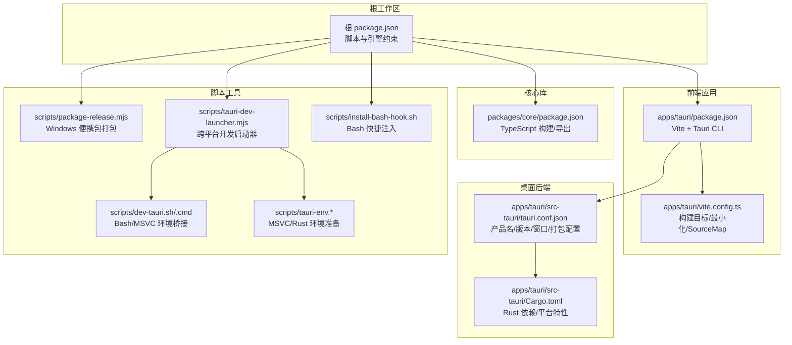
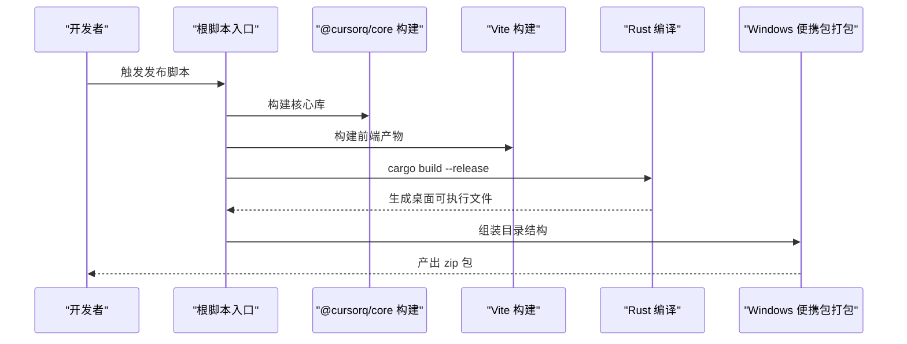
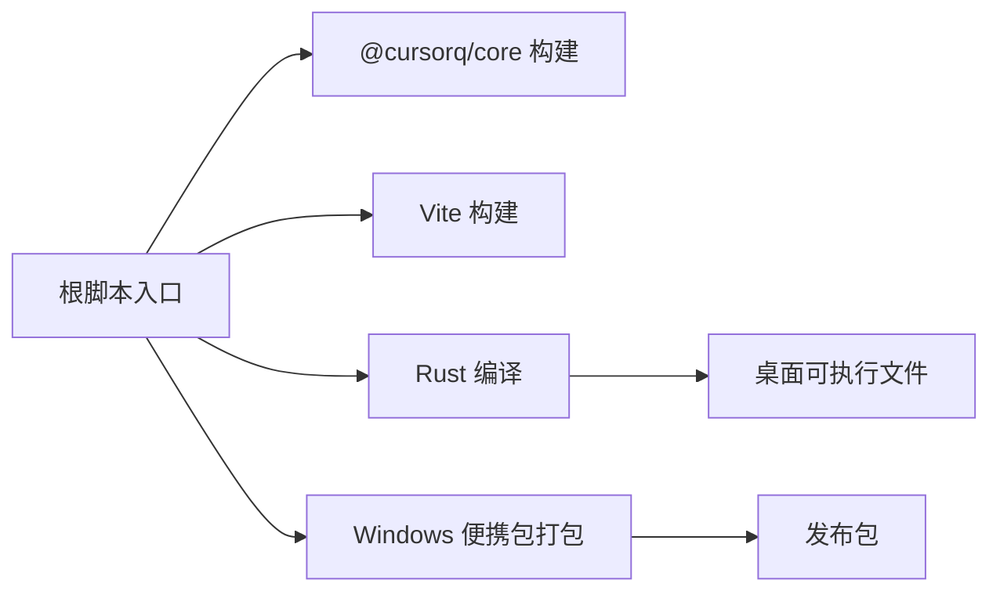

# 构建与发布流程

<cite>
**本文引用的文件**
- [apps/tauri/package.json](file://apps/tauri/package.json)
- [apps/tauri/src-tauri/Cargo.toml](file://apps/tauri/src-tauri/Cargo.toml)
- [apps/tauri/src-tauri/tauri.conf.json](file://apps/tauri/src-tauri/tauri.conf.json)
- [apps/tauri/vite.config.ts](file://apps/tauri/vite.config.ts)
- [packages/core/package.json](file://packages/core/package.json)
- [package.json](file://package.json)
- [scripts/package-release.mjs](file://scripts/package-release.mjs)
- [scripts/tauri-dev-launcher.mjs](file://scripts/tauri-dev-launcher.mjs)
- [scripts/dev-tauri.sh](file://scripts/dev-tauri.sh)
- [scripts/dev-tauri.cmd](file://scripts/dev-tauri.cmd)
- [scripts/bash-env.sh](file://scripts/bash-env.sh)
- [scripts/tauri-env.cmd](file://scripts/tauri-env.cmd)
- [scripts/tauri-env.ps1](file://scripts/tauri-env.ps1)
- [scripts/install-bash-hook.sh](file://scripts/install-bash-hook.sh)
- [release/README.md](file://release/README.md)
</cite>

## 目录
1. [引言](#引言)
2. [项目结构](#项目结构)
3. [核心组件](#核心组件)
4. [架构总览](#架构总览)
5. [详细组件分析](#详细组件分析)
6. [依赖关系分析](#依赖关系分析)
7. [性能考量](#性能考量)
8. [故障排查指南](#故障排查指南)
9. [结论](#结论)
10. [附录](#附录)

## 引言
本文件面向 DevOps 团队与维护者，系统化制定 CursorQ 项目的构建与发布流程规范，覆盖多平台（Windows、macOS、Linux）构建配置、自动化脚本使用与自定义参数、版本管理与发布标签策略、持续集成与部署流水线建议、应用签名与安全加固、发布前质量检查清单与回滚机制，并提供完整操作手册。

## 项目结构
CursorQ 采用多工作区（monorepo）组织方式，核心由前端 Vite 应用与 Tauri/Rust 后端组成，配合独立的 TypeScript 核心库与一组发布与开发辅助脚本。

图表来源
- [package.json:1-25](file://package.json#L1-L25)
- [apps/tauri/package.json:1-22](file://apps/tauri/package.json#L1-L22)
- [apps/tauri/vite.config.ts:1-21](file://apps/tauri/vite.config.ts#L1-L21)
- [apps/tauri/src-tauri/tauri.conf.json:1-48](file://apps/tauri/src-tauri/tauri.conf.json#L1-L48)
- [apps/tauri/src-tauri/Cargo.toml:1-37](file://apps/tauri/src-tauri/Cargo.toml#L1-L37)
- [packages/core/package.json:1-32](file://packages/core/package.json#L1-L32)
- [scripts/package-release.mjs:1-136](file://scripts/package-release.mjs#L1-L136)
- [scripts/tauri-dev-launcher.mjs:1-61](file://scripts/tauri-dev-launcher.mjs#L1-L61)
- [scripts/dev-tauri.sh:1-25](file://scripts/dev-tauri.sh#L1-L25)
- [scripts/dev-tauri.cmd:1-17](file://scripts/dev-tauri.cmd#L1-L17)
- [scripts/tauri-env.cmd:1-9](file://scripts/tauri-env.cmd#L1-L9)
- [scripts/tauri-env.ps1:1-19](file://scripts/tauri-env.ps1#L1-L19)
- [scripts/install-bash-hook.sh:1-41](file://scripts/install-bash-hook.sh#L1-L41)

章节来源
- [package.json:1-25](file://package.json#L1-L25)
- [apps/tauri/package.json:1-22](file://apps/tauri/package.json#L1-L22)
- [apps/tauri/src-tauri/tauri.conf.json:1-48](file://apps/tauri/src-tauri/tauri.conf.json#L1-L48)
- [apps/tauri/src-tauri/Cargo.toml:1-37](file://apps/tauri/src-tauri/Cargo.toml#L1-L37)
- [apps/tauri/vite.config.ts:1-21](file://apps/tauri/vite.config.ts#L1-L21)
- [packages/core/package.json:1-32](file://packages/core/package.json#L1-L32)
- [scripts/package-release.mjs:1-136](file://scripts/package-release.mjs#L1-L136)
- [scripts/tauri-dev-launcher.mjs:1-61](file://scripts/tauri-dev-launcher.mjs#L1-L61)
- [scripts/dev-tauri.sh:1-25](file://scripts/dev-tauri.sh#L1-L25)
- [scripts/dev-tauri.cmd:1-17](file://scripts/dev-tauri.cmd#L1-L17)
- [scripts/tauri-env.cmd:1-9](file://scripts/tauri-env.cmd#L1-L9)
- [scripts/tauri-env.ps1:1-19](file://scripts/tauri-env.ps1#L1-L19)
- [scripts/install-bash-hook.sh:1-41](file://scripts/install-bash-hook.sh#L1-L41)

## 核心组件
- 根工作区与脚本入口：统一管理 Node 引擎版本、工作区脚本与快捷命令。
- 前端应用（Vite + Tauri）：负责界面与交互，通过 Tauri 暴露系统能力。
- 桌面后端（Tauri/Rust）：负责系统集成、窗口与托盘、平台特定功能。
- 核心库（@cursorq/core）：共享逻辑与类型，供前端与后端复用。
- 发布与开发脚本：封装跨平台构建、打包、开发环境准备与快捷注入。

章节来源
- [package.json:10-20](file://package.json#L10-L20)
- [apps/tauri/package.json:6-11](file://apps/tauri/package.json#L6-L11)
- [packages/core/package.json:18-23](file://packages/core/package.json#L18-L23)
- [scripts/package-release.mjs:54-62](file://scripts/package-release.mjs#L54-L62)
- [scripts/tauri-dev-launcher.mjs:35-59](file://scripts/tauri-dev-launcher.mjs#L35-L59)

## 架构总览
下图展示从源码到可分发产物的端到端流程，涵盖前端构建、Rust 编译、资源打包与压缩。

图表来源
- [package.json:19](file://package.json#L19)
- [scripts/package-release.mjs:54-62](file://scripts/package-release.mjs#L54-L62)
- [scripts/package-release.mjs:68-133](file://scripts/package-release.mjs#L68-L133)

## 详细组件分析

### 多平台构建配置与编译设置
- Windows
  - 开发环境：通过批处理与 PowerShell 辅助脚本准备 MSVC 与 Rust 工具链，确保链接器可用。
  - 构建流程：先构建核心库与前端，再进行 Rust Release 编译，最后打包为便携 zip。
  - 关键路径参考：
    - [scripts/tauri-env.cmd:1-9](file://scripts/tauri-env.cmd#L1-L9)
    - [scripts/tauri-env.ps1:1-19](file://scripts/tauri-env.ps1#L1-L19)
    - [scripts/dev-tauri.cmd:1-17](file://scripts/dev-tauri.cmd#L1-L17)
    - [scripts/dev-tauri.sh:1-25](file://scripts/dev-tauri.sh#L1-L25)
    - [scripts/package-release.mjs:54-62](file://scripts/package-release.mjs#L54-L62)
- macOS/Linux
  - 开发环境：通过 Bash/MSYS2 环境桥接，自动注入 Cargo 路径并调用 npm 脚本启动开发。
  - 构建流程：与 Windows 类似，但最终产物按平台打包（当前仓库脚本聚焦 Windows 便携包）。
  - 关键路径参考：
    - [scripts/tauri-dev-launcher.mjs:35-60](file://scripts/tauri-dev-launcher.mjs#L35-L60)
    - [scripts/bash-env.sh:1-21](file://scripts/bash-env.sh#L1-L21)
    - [scripts/install-bash-hook.sh:1-41](file://scripts/install-bash-hook.sh#L1-L41)

章节来源
- [scripts/tauri-env.cmd:1-9](file://scripts/tauri-env.cmd#L1-L9)
- [scripts/tauri-env.ps1:1-19](file://scripts/tauri-env.ps1#L1-L19)
- [scripts/dev-tauri.cmd:1-17](file://scripts/dev-tauri.cmd#L1-L17)
- [scripts/dev-tauri.sh:1-25](file://scripts/dev-tauri.sh#L1-L25)
- [scripts/tauri-dev-launcher.mjs:35-60](file://scripts/tauri-dev-launcher.mjs#L35-L60)
- [scripts/bash-env.sh:1-21](file://scripts/bash-env.sh#L1-L21)
- [scripts/install-bash-hook.sh:1-41](file://scripts/install-bash-hook.sh#L1-L41)

### 自动化构建脚本与自定义配置
- 发布脚本（Windows 便携包）
  - 功能：构建核心库与前端，编译 Rust Release，组装目录结构，复制必要资源与最小化 node_modules，最终压缩为 zip。
  - 关键步骤与产物：
    - [scripts/package-release.mjs:54-62](file://scripts/package-release.mjs#L54-L62)
    - [scripts/package-release.mjs:68-133](file://scripts/package-release.mjs#L68-L133)
    - [release/README.md:1-37](file://release/README.md#L1-L37)
  - 版本来源：从 Tauri 配置中读取版本号用于命名输出包。
    - [scripts/package-release.mjs:14-16](file://scripts/package-release.mjs#L14-L16)
    - [apps/tauri/src-tauri/tauri.conf.json:3-4](file://apps/tauri/src-tauri/tauri.conf.json#L3-L4)
- 开发启动器
  - 功能：根据平台选择 Bash/MSVC 或直接 npm 启动开发。
  - 关键路径：
    - [scripts/tauri-dev-launcher.mjs:35-60](file://scripts/tauri-dev-launcher.mjs#L35-L60)
    - [scripts/dev-tauri.sh:1-25](file://scripts/dev-tauri.sh#L1-L25)
    - [scripts/dev-tauri.cmd:1-17](file://scripts/dev-tauri.cmd#L1-L17)
- 前端构建配置
  - 目标浏览器与最小化策略受环境变量控制，便于调试与发布切换。
  - 关键路径：
    - [apps/tauri/vite.config.ts:15-19](file://apps/tauri/vite.config.ts#L15-L19)

章节来源
- [scripts/package-release.mjs:54-62](file://scripts/package-release.mjs#L54-L62)
- [scripts/package-release.mjs:68-133](file://scripts/package-release.mjs#L68-L133)
- [release/README.md:1-37](file://release/README.md#L1-L37)
- [scripts/package-release.mjs:14-16](file://scripts/package-release.mjs#L14-L16)
- [apps/tauri/src-tauri/tauri.conf.json:3-4](file://apps/tauri/src-tauri/tauri.conf.json#L3-L4)
- [scripts/tauri-dev-launcher.mjs:35-60](file://scripts/tauri-dev-launcher.mjs#L35-L60)
- [scripts/dev-tauri.sh:1-25](file://scripts/dev-tauri.sh#L1-L25)
- [scripts/dev-tauri.cmd:1-17](file://scripts/dev-tauri.cmd#L1-L17)
- [apps/tauri/vite.config.ts:15-19](file://apps/tauri/vite.config.ts#L15-L19)

### 版本管理策略与发布标签规范
- 当前版本来源
  - 前端与桌面配置均使用固定版本号，便于一致性与可追溯性。
  - 参考：
    - [apps/tauri/package.json:3](file://apps/tauri/package.json#L3)
    - [apps/tauri/src-tauri/Cargo.toml:3](file://apps/tauri/src-tauri/Cargo.toml#L3)
    - [apps/tauri/src-tauri/tauri.conf.json:4](file://apps/tauri/src-tauri/tauri.conf.json#L4)
    - [packages/core/package.json:3](file://packages/core/package.json#L3)
    - [package.json:3](file://package.json#L3)
- 语义化版本控制建议
  - 采用主.次.补丁格式，遵循变更影响范围决定版本号递增层级。
  - 重大破坏性变更：主版本号递增；新增向后兼容功能：次版本号递增；修复向后兼容问题：补丁版本号递增。
- 发布标签规范
  - 建议使用 v{主}.{次}.{补丁} 形式，如 v0.1.0。
  - 对应发布包命名：cursorq-{version}-{platform}.zip（当前 Windows 便携包命名规则见发布脚本）。
  - 参考：
    - [scripts/package-release.mjs:22](file://scripts/package-release.mjs#L22)

章节来源
- [apps/tauri/package.json:3](file://apps/tauri/package.json#L3)
- [apps/tauri/src-tauri/Cargo.toml:3](file://apps/tauri/src-tauri/Cargo.toml#L3)
- [apps/tauri/src-tauri/tauri.conf.json:4](file://apps/tauri/src-tauri/tauri.conf.json#L4)
- [packages/core/package.json:3](file://packages/core/package.json#L3)
- [package.json:3](file://package.json#L3)
- [scripts/package-release.mjs:22](file://scripts/package-release.mjs#L22)

### 持续集成与自动化测试
- 建议流水线阶段
  - 安装 Node（满足引擎要求）、Rust 工具链与 MSVC（Windows）或对应编译链（macOS/Linux）。
  - 运行类型检查与单元测试（核心库与前端）。
  - 执行构建与打包（Windows 便携包），生成产物与校验和。
  - 上传制品并创建发布标签（遵循语义化版本）。
- 测试与验证
  - 类型检查与核心库测试脚本可作为 CI 步骤的一部分。
  - 参考：
    - [packages/core/package.json:21](file://packages/core/package.json#L21)
    - [package.json:17-18](file://package.json#L17-L18)

章节来源
- [packages/core/package.json:21](file://packages/core/package.json#L21)
- [package.json:17-18](file://package.json#L17-L18)

### 应用签名、代码混淆与资源优化
- 应用签名
  - Windows：为可执行文件与安装包配置代码签名证书，确保可信来源。
  - macOS：为 DMG 与应用包配置 Developer ID，启用公证。
  - Linux：提供 AppImage 或 DEB 包时，建议使用项目签名以增强信任。
- 代码混淆与资源优化
  - 前端最小化与 SourceMap：通过 Vite 配置在调试与发布间切换。
    - [apps/tauri/vite.config.ts:17-18](file://apps/tauri/vite.config.ts#L17-L18)
  - 资源裁剪：仅打包必要内容与 Wasm 资源，避免冗余 node_modules。
    - [scripts/package-release.mjs:101-122](file://scripts/package-release.mjs#L101-L122)
- 安全加固
  - CSP 与协议作用域：当前配置允许资产协议访问，建议在生产中收紧策略。
    - [apps/tauri/src-tauri/tauri.conf.json:31-37](file://apps/tauri/src-tauri/tauri.conf.json#L31-L37)

章节来源
- [apps/tauri/vite.config.ts:17-18](file://apps/tauri/vite.config.ts#L17-L18)
- [scripts/package-release.mjs:101-122](file://scripts/package-release.mjs#L101-L122)
- [apps/tauri/src-tauri/tauri.conf.json:31-37](file://apps/tauri/src-tauri/tauri.conf.json#L31-L37)

### 发布前质量检查清单
- 版本核对
  - 确认各模块版本一致且符合语义化版本策略。
  - 参考：
    - [apps/tauri/src-tauri/tauri.conf.json:3-4](file://apps/tauri/src-tauri/tauri.conf.json#L3-L4)
- 构建产物
  - Windows：确认便携包内含 CursorQ.exe、content、data、config、logs、scripts、node_modules。
  - 参考：
    - [scripts/package-release.mjs:68-100](file://scripts/package-release.mjs#L68-L100)
    - [release/README.md:5-22](file://release/README.md#L5-L22)
- 功能验证
  - 启动验证、离线可用性、远程合并（可选）。
  - 参考：
    - [release/README.md:24-34](file://release/README.md#L24-L34)
- 安全与合规
  - 签名证书有效性、最小权限原则、CSP 收紧建议。

章节来源
- [apps/tauri/src-tauri/tauri.conf.json:3-4](file://apps/tauri/src-tauri/tauri.conf.json#L3-L4)
- [scripts/package-release.mjs:68-100](file://scripts/package-release.mjs#L68-L100)
- [release/README.md:5-22](file://release/README.md#L5-L22)
- [release/README.md:24-34](file://release/README.md#L24-L34)

### 回滚机制
- 版本回退
  - 通过标签与制品管理，快速回退到上一个稳定版本。
- 配置回滚
  - 远程配置（可选）支持关闭或恢复默认，确保离线可用。
  - 参考：
    - [release/README.md:15-16](file://release/README.md#L15-L16)

章节来源
- [release/README.md:15-16](file://release/README.md#L15-L16)

## 依赖关系分析
- 组件耦合
  - 根脚本驱动核心库、前端与 Rust 后端的构建顺序。
  - 发布脚本依赖 Tauri 配置中的版本号与产物路径。
- 外部依赖
  - Node 引擎版本约束、Rust 工具链与 MSVC（Windows）。
- 潜在风险
  - 平台差异导致的环境准备失败；前端/后端版本不一致；打包遗漏关键资源。

图表来源
- [package.json:10-20](file://package.json#L10-L20)
- [scripts/package-release.mjs:54-62](file://scripts/package-release.mjs#L54-L62)
- [scripts/package-release.mjs:68-133](file://scripts/package-release.mjs#L68-L133)

章节来源
- [package.json:10-20](file://package.json#L10-L20)
- [scripts/package-release.mjs:54-62](file://scripts/package-release.mjs#L54-L62)
- [scripts/package-release.mjs:68-133](file://scripts/package-release.mjs#L68-L133)

## 性能考量
- 构建时间优化
  - 首次 Rust 编译耗时较长，建议缓存 Cargo registry 与工具链。
  - 前端最小化与 SourceMap 在调试与发布间切换，减少不必要的处理开销。
- 产物体积优化
  - 仅复制必要 node_modules 与 Wasm 资源，避免冗余。
  - 参考：
    - [scripts/package-release.mjs:101-122](file://scripts/package-release.mjs#L101-L122)

章节来源
- [apps/tauri/vite.config.ts:17-18](file://apps/tauri/vite.config.ts#L17-L18)
- [scripts/package-release.mjs:101-122](file://scripts/package-release.mjs#L101-L122)

## 故障排查指南
- 环境准备失败（Windows）
  - 症状：找不到 MSVC 链接器。
  - 处理：安装 Visual Studio Build Tools 并加载 vcvars64。
  - 参考：
    - [scripts/tauri-env.cmd:4-7](file://scripts/tauri-env.cmd#L4-L7)
    - [scripts/tauri-env.ps1:9-15](file://scripts/tauri-env.ps1#L9-L15)
- 开发启动异常
  - 症状：Bash/MSVC 环境桥接失败或路径缺失。
  - 处理：注入 Cargo 路径，使用快捷脚本 cqdev/cq。
  - 参考：
    - [scripts/bash-env.sh:12](file://scripts/bash-env.sh#L12)
    - [scripts/install-bash-hook.sh:28-30](file://scripts/install-bash-hook.sh#L28-L30)
- 构建产物缺失
  - 症状：便携包缺少 CursorQ.exe 或关键资源。
  - 处理：确认核心库与前端构建成功，检查内容目录存在性。
  - 参考：
    - [scripts/package-release.mjs:63-66](file://scripts/package-release.mjs#L63-L66)
    - [scripts/package-release.mjs:74-78](file://scripts/package-release.mjs#L74-L78)

章节来源
- [scripts/tauri-env.cmd:4-7](file://scripts/tauri-env.cmd#L4-L7)
- [scripts/tauri-env.ps1:9-15](file://scripts/tauri-env.ps1#L9-L15)
- [scripts/bash-env.sh:12](file://scripts/bash-env.sh#L12)
- [scripts/install-bash-hook.sh:28-30](file://scripts/install-bash-hook.sh#L28-L30)
- [scripts/package-release.mjs:63-66](file://scripts/package-release.mjs#L63-L66)
- [scripts/package-release.mjs:74-78](file://scripts/package-release.mjs#L74-L78)

## 结论
本规范基于现有脚本与配置，明确了 CursorQ 的构建与发布流程、版本策略与安全加固要点，并提供了跨平台环境准备与故障排查方法。建议在 CI 中固化上述流程，确保一致性与可重复性。

## 附录
- 操作手册（Windows）
  - 准备：安装 Node、Rust、VS Build Tools，确保 link 可用。
  - 开发：使用快捷命令 cqdev 启动开发。
  - 发布：执行根脚本触发 Windows 便携包打包，产物位于 release 目录。
  - 参考：
    - [scripts/tauri-env.cmd:1-9](file://scripts/tauri-env.cmd#L1-L9)
    - [scripts/tauri-env.ps1:1-19](file://scripts/tauri-env.ps1#L1-L19)
    - [scripts/install-bash-hook.sh:28-30](file://scripts/install-bash-hook.sh#L28-L30)
    - [package.json:19](file://package.json#L19)
    - [release/README.md:1-37](file://release/README.md#L1-L37)

章节来源
- [scripts/tauri-env.cmd:1-9](file://scripts/tauri-env.cmd#L1-L9)
- [scripts/tauri-env.ps1:1-19](file://scripts/tauri-env.ps1#L1-L19)
- [scripts/install-bash-hook.sh:28-30](file://scripts/install-bash-hook.sh#L28-L30)
- [package.json:19](file://package.json#L19)
- [release/README.md:1-37](file://release/README.md#L1-L37)