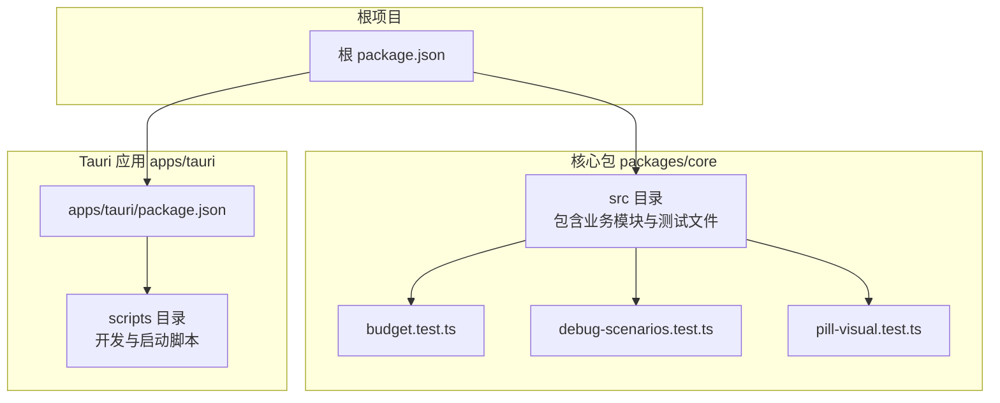
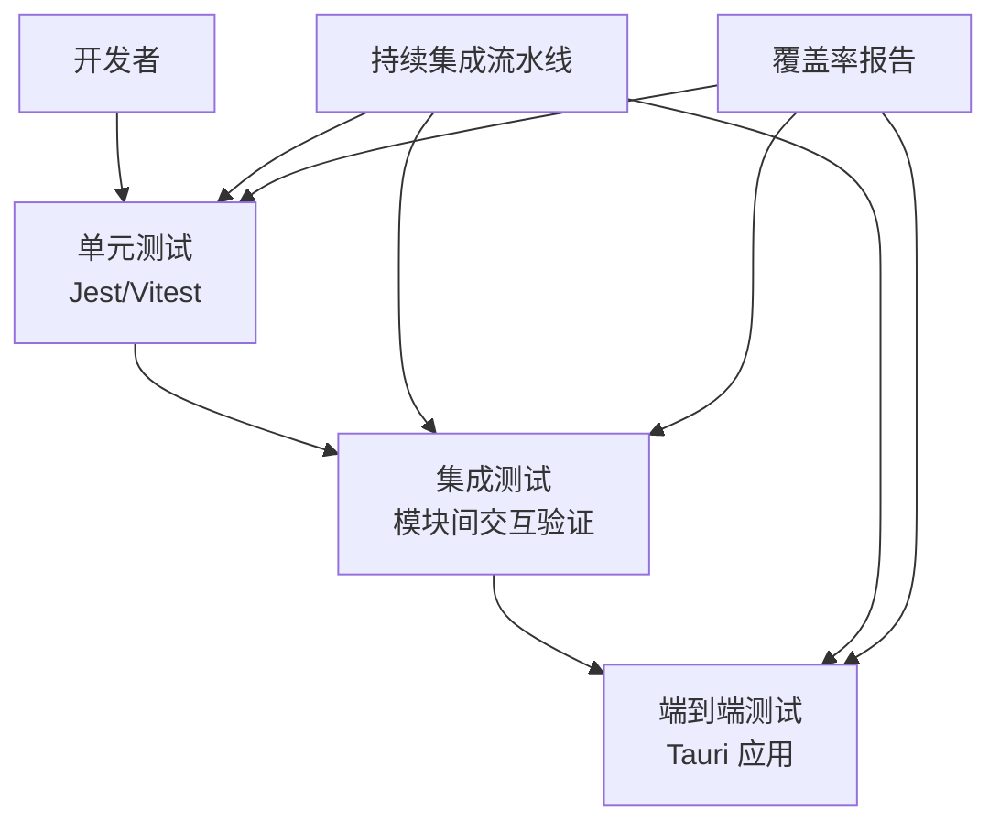
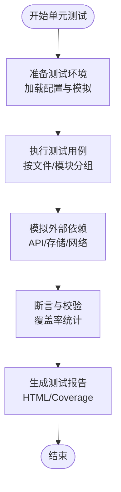
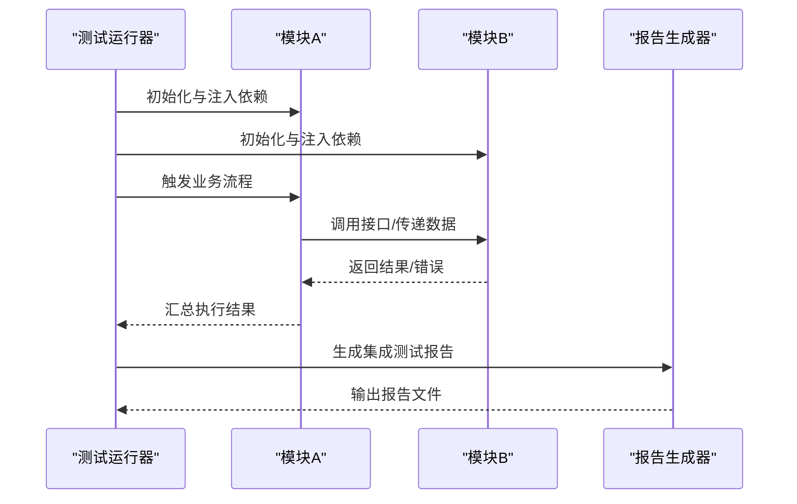
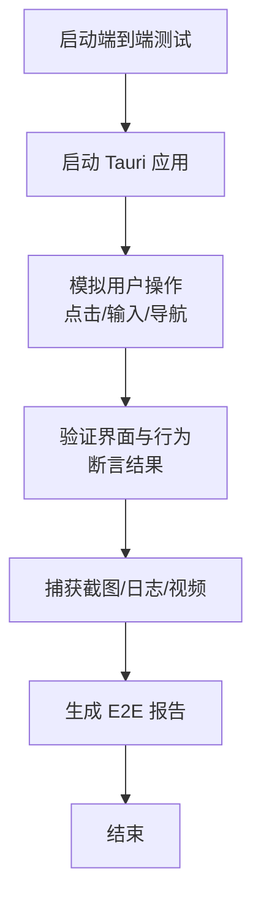
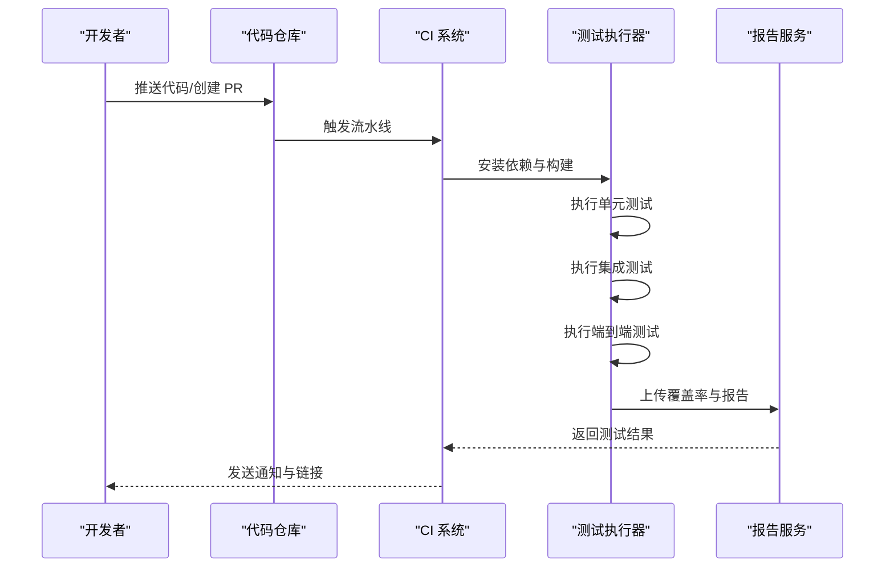
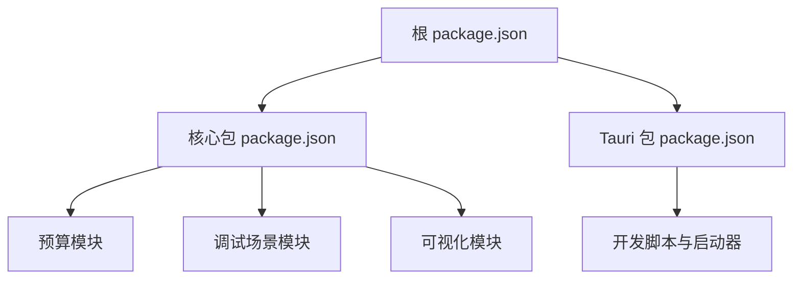

# 测试策略与质量保证

<cite>
**本文档引用的文件**
- [package.json](file://package.json)
- [packages/core/src/budget.test.ts](file://packages/core/src/budget.test.ts)
- [packages/core/src/debug-scenarios.test.ts](file://packages/core/src/debug-scenarios.test.ts)
- [packages/core/src/pill-visual.test.ts](file://packages/core/src/pill-visual.test.ts)
- [packages/core/src/budget.ts](file://packages/core/src/budget.ts)
- [packages/core/src/debug-scenarios.ts](file://packages/core/src/debug-scenarios.ts)
- [packages/core/src/pill-visual.ts](file://packages/core/src/pill-visual.ts)
- [apps/tauri/package.json](file://apps/tauri/package.json)
- [scripts/dev-tauri.cmd](file://scripts/dev-tauri.cmd)
- [scripts/dev-tauri.sh](file://scripts/dev-tauri.sh)
- [scripts/tauri-dev-launcher.mjs](file://scripts/tauri-dev-launcher.mjs)
</cite>

## 目录
1. [引言](#引言)
2. [项目结构](#项目结构)
3. [核心组件](#核心组件)
4. [架构概览](#架构概览)
5. [详细组件分析](#详细组件分析)
6. [依赖关系分析](#依赖关系分析)
7. [性能考虑](#性能考虑)
8. [故障排除指南](#故障排除指南)
9. [结论](#结论)
10. [附录](#附录)

## 引言
本文件旨在为 CursorQ 项目建立系统化的测试策略与质量保证体系，覆盖单元测试、集成测试与端到端测试的实施方法，明确测试框架选择与配置（Jest、Vitest），制定测试用例编写规范与覆盖率要求，并规划自动化测试流程与持续集成中的测试执行与结果分析。同时，提供性能测试与压力测试的实施方案，以及缺陷跟踪与修复流程，确保代码质量的持续改进。

## 项目结构
CursorQ 采用多包架构，核心业务逻辑集中在 packages/core 中，前端应用位于 apps/tauri。测试文件以 .test.ts 结尾，分布在各包的 src 目录中，表明项目已具备基础的单元测试能力。根目录与各子包的 package.json 文件定义了脚本命令与依赖项，可用于驱动测试执行与构建流程。

**图表来源**
- [package.json](file://package.json)
- [packages/core/src/budget.test.ts](file://packages/core/src/budget.test.ts)
- [packages/core/src/debug-scenarios.test.ts](file://packages/core/src/debug-scenarios.test.ts)
- [packages/core/src/pill-visual.test.ts](file://packages/core/src/pill-visual.test.ts)
- [apps/tauri/package.json](file://apps/tauri/package.json)

**章节来源**
- [package.json](file://package.json)
- [apps/tauri/package.json](file://apps/tauri/package.json)

## 核心组件
- 单元测试现状：packages/core 已存在三个测试文件，分别对应预算计算、调试场景与药丸可视化等核心功能模块，表明项目已在关键领域建立了测试基础。
- 测试文件分布：所有测试文件均位于 src 目录下，遵循“源码+测试”的就近组织方式，便于维护与定位。
- 脚本与命令：根与子包的 package.json 提供了开发与构建脚本，可作为测试执行的基础入口。

建议补充：
- 在根 package.json 中新增统一的测试脚本命令，如 test:unit、test:integration、test:e2e，以便集中管理测试生命周期。
- 在 apps/tauri 的 package.json 中增加测试相关脚本，支持前端应用的测试执行。

**章节来源**
- [packages/core/src/budget.test.ts](file://packages/core/src/budget.test.ts)
- [packages/core/src/debug-scenarios.test.ts](file://packages/core/src/debug-scenarios.test.ts)
- [packages/core/src/pill-visual.test.ts](file://packages/core/src/pill-visual.test.ts)
- [package.json](file://package.json)
- [apps/tauri/package.json](file://apps/tauri/package.json)

## 架构概览
测试架构围绕三层测试类型展开：单元测试（Jest/Vitest）、集成测试（基于现有模块交互）与端到端测试（Tauri 应用）。下图展示了测试执行在不同层级的职责与协作关系：

[此图为概念性架构图，不直接映射具体源文件，故无需图表来源]

## 详细组件分析

### 单元测试策略与实现
- 测试框架选择：推荐使用 Vitest 作为默认测试运行器，因其对 Vite 生态友好、启动速度快；在需要兼容 Jest 生态时可使用 Jest。
- 测试文件组织：沿用现有 .test.ts 命名约定，保持与源码同目录，便于维护。
- 覆盖率要求：建议设置语句覆盖率、分支覆盖率、函数覆盖率与行覆盖率不低于 80%，关键路径不低于 90%。
- 模拟与桩：对异步 API、外部依赖与数据库进行模拟，确保测试稳定性与可重复性。
- 并行与隔离：利用 Vitest 的并发执行能力提升效率，同时确保测试间无状态耦合。

[此图为通用流程图，不直接映射具体源文件，故无需图表来源]

**章节来源**
- [packages/core/src/budget.test.ts](file://packages/core/src/budget.test.ts)
- [packages/core/src/debug-scenarios.test.ts](file://packages/core/src/debug-scenarios.test.ts)
- [packages/core/src/pill-visual.test.ts](file://packages/core/src/pill-visual.test.ts)

### 集成测试策略与实现
- 目标：验证模块间的接口契约、数据流与错误传播。
- 范围：核心业务模块（如预算、调试场景、可视化）之间的交互。
- 执行：在本地与 CI 中通过统一脚本触发，优先在 CI 中启用严格模式。
- 报告：输出 JSON 与 HTML 报告，便于问题定位与回归分析。

[此图为通用序列图，不直接映射具体源文件，故无需图表来源]

**章节来源**
- [packages/core/src/budget.ts](file://packages/core/src/budget.ts)
- [packages/core/src/debug-scenarios.ts](file://packages/core/src/debug-scenarios.ts)
- [packages/core/src/pill-visual.ts](file://packages/core/src/pill-visual.ts)

### 端到端测试策略与实现
- 目标：验证用户完整操作路径与应用行为，确保 Tauri 应用在真实环境下的稳定性。
- 范围：界面交互、窗口管理、系统权限与文件系统访问等。
- 执行：结合 apps/tauri 的开发脚本与 CI 环境，确保跨平台一致性。
- 报告：输出截图、日志与视频片段，辅助问题复现与修复。

[此图为通用流程图，不直接映射具体源文件，故无需图表来源]

**章节来源**
- [apps/tauri/package.json](file://apps/tauri/package.json)
- [scripts/dev-tauri.cmd](file://scripts/dev-tauri.cmd)
- [scripts/dev-tauri.sh](file://scripts/dev-tauri.sh)
- [scripts/tauri-dev-launcher.mjs](file://scripts/tauri-dev-launcher.mjs)

### 测试用例编写指南
- 命名规范：使用描述性名称，清晰表达被测场景与期望结果。
- 结构化组织：每个模块至少包含正常路径、边界条件与异常处理三类用例。
- 断言策略：优先使用精确断言，避免模糊匹配；对异步操作使用超时与重试机制。
- 数据驱动：对重复场景采用参数化测试，提高覆盖面与可维护性。
- 可观测性：在关键节点输出上下文信息，便于定位问题。

**章节来源**
- [packages/core/src/budget.test.ts](file://packages/core/src/budget.test.ts)
- [packages/core/src/debug-scenarios.test.ts](file://packages/core/src/debug-scenarios.test.ts)
- [packages/core/src/pill-visual.test.ts](file://packages/core/src/pill-visual.test.ts)

### 自动化测试流程与持续集成
- 触发条件：PR 合并请求、主分支推送、定时任务。
- 步骤编排：安装依赖 → 运行单元测试 → 运行集成测试 → 运行端到端测试 → 上传覆盖率与报告。
- 缓存优化：缓存依赖与构建产物，缩短流水线时间。
- 失败策略：失败即停止，保留 artifacts 用于诊断。

[此图为通用序列图，不直接映射具体源文件，故无需图表来源]

**章节来源**
- [package.json](file://package.json)
- [apps/tauri/package.json](file://apps/tauri/package.json)

## 依赖关系分析
- 根 package.json 与子包 package.json 共同定义了测试与构建脚本，形成统一的测试入口。
- apps/tauri 的开发脚本与启动器为端到端测试提供了稳定的运行环境。
- 核心模块（预算、调试场景、可视化）是测试关注的重点区域，应优先保障其测试覆盖率与稳定性。

**图表来源**
- [package.json](file://package.json)
- [apps/tauri/package.json](file://apps/tauri/package.json)

**章节来源**
- [package.json](file://package.json)
- [apps/tauri/package.json](file://apps/tauri/package.json)

## 性能考虑
- 单元测试：优先使用内存级模拟，减少 IO 开销；对耗时操作进行节流与批处理。
- 集成测试：控制并发度，避免资源争用；对共享资源进行隔离或加锁。
- 端到端测试：预热应用、复用会话；对长耗时操作设置超时阈值。
- 覆盖率：在 CI 中强制开启覆盖率检查，防止回归。

[本节为通用性能建议，不直接分析具体文件，故无需章节来源]

## 故障排除指南
- 测试失败定位：查看报告中的断言失败详情与堆栈信息；结合日志与截图进行复现。
- 环境差异：统一 Node 版本与依赖版本；在 CI 中使用容器化环境。
- 资源清理：确保测试后释放临时文件与数据库连接；避免污染后续测试。
- 回归预防：对修复的缺陷补充回归用例，纳入覆盖率统计。

[本节为通用故障排除建议，不直接分析具体文件，故无需章节来源]

## 结论
通过建立以 Vitest 为核心的单元测试体系、以模块交互为核心的集成测试体系与以用户路径为核心的端到端测试体系，结合统一的自动化测试流程与持续集成策略，CursorQ 可以显著提升代码质量与交付稳定性。建议尽快完善测试脚本与覆盖率配置，并在团队内推广测试用例编写规范与最佳实践。

## 附录
- 测试覆盖率目标：语句/分支/函数/行覆盖率 ≥ 80%，关键路径 ≥ 90%。
- 测试执行顺序：单元测试 → 集成测试 → 端到端测试。
- 报告格式：HTML 与 JSON，包含覆盖率与失败详情。
- 回归策略：缺陷修复后必须补充回归用例并验证通过。

[本节为通用附录内容，不直接分析具体文件，故无需章节来源]