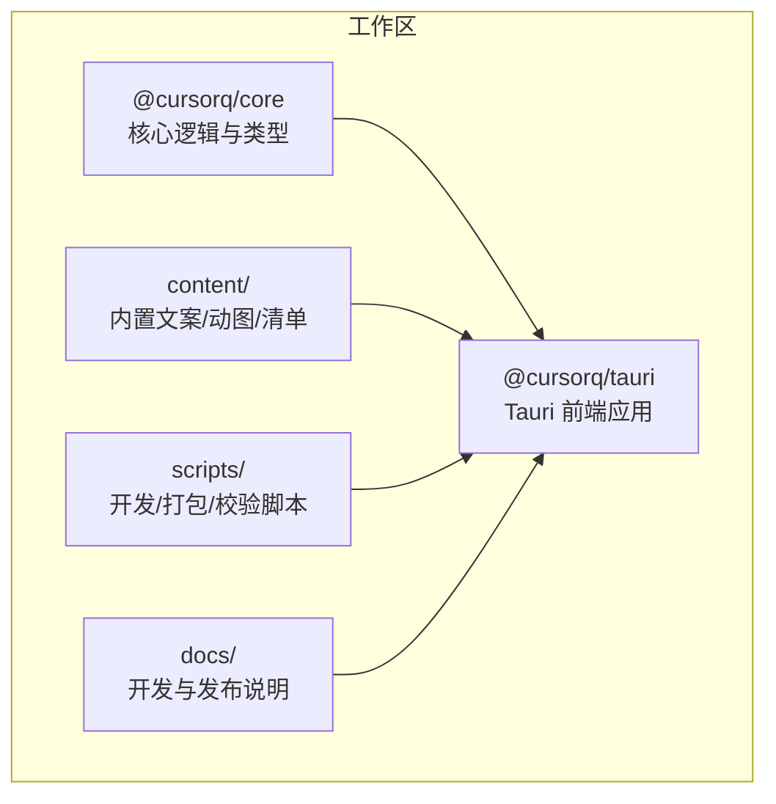
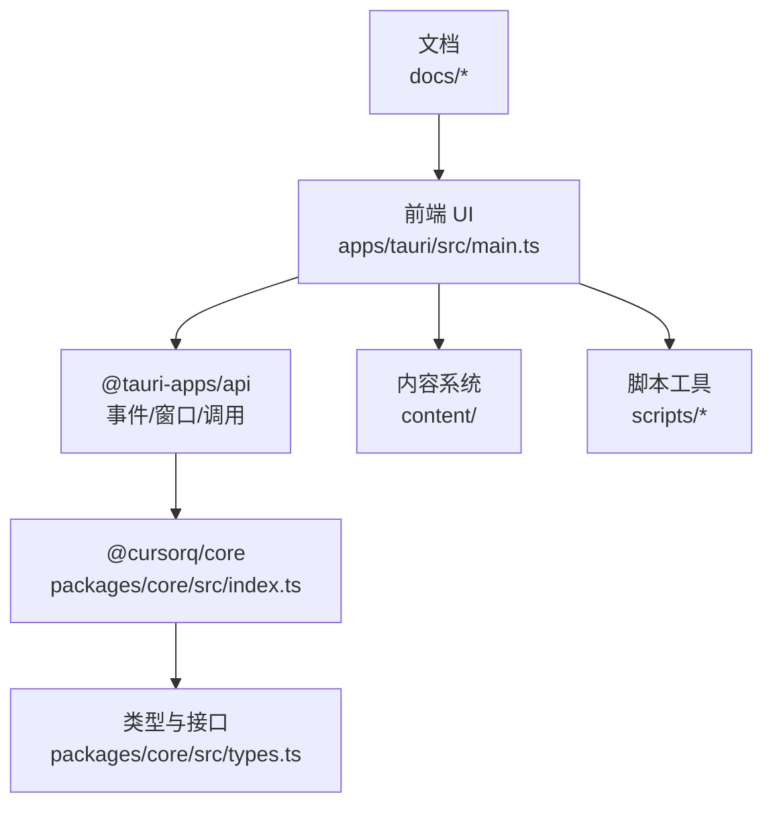
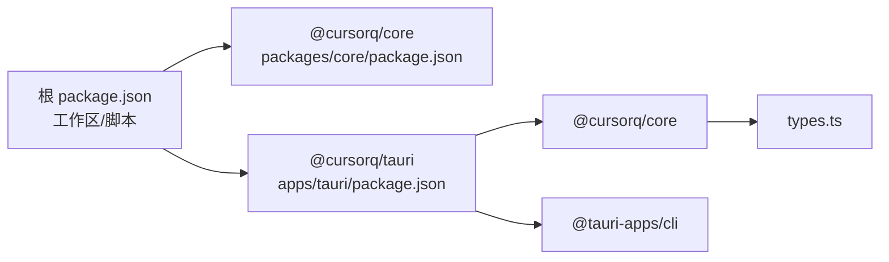
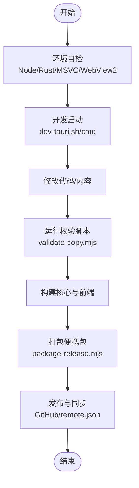

# 贡献指南与社区参与

<cite>
**本文引用的文件**
- [README.md](file://README.md)
- [docs/GITHUB_PREP.md](file://docs/GITHUB_PREP.md)
- [docs/TAURI_DEV_SETUP.md](file://docs/TAURI_DEV_SETUP.md)
- [package.json](file://package.json)
- [apps/tauri/package.json](file://apps/tauri/package.json)
- [scripts/dev-tauri.sh](file://scripts/dev-tauri.sh)
- [scripts/dev-tauri.cmd](file://scripts/dev-tauri.cmd)
- [scripts/validate-copy.mjs](file://scripts/validate-copy.mjs)
- [scripts/package-release.mjs](file://scripts/package-release.mjs)
- [packages/core/src/index.ts](file://packages/core/src/index.ts)
- [packages/core/src/types.ts](file://packages/core/src/types.ts)
- [apps/tauri/src/main.ts](file://apps/tauri/src/main.ts)
- [apps/tauri/src-tauri/src/main.rs](file://apps/tauri/src-tauri/src/main.rs)
</cite>

## 目录
1. [引言](#引言)
2. [项目结构](#项目结构)
3. [核心组件](#核心组件)
4. [架构总览](#架构总览)
5. [详细组件分析](#详细组件分析)
6. [依赖关系分析](#依赖关系分析)
7. [性能考虑](#性能考虑)
8. [故障排查指南](#故障排查指南)
9. [结论](#结论)
10. [附录](#附录)

## 引言
本指南面向希望参与 CursorQ 项目的贡献者，涵盖从环境搭建、首次贡献建议、PR 流程、代码审查标准，到文档与翻译、设计贡献、社区行为准则与沟通规范、项目治理与角色权限、以及参与路径的完整指引。目标是帮助新老贡献者高效协作，共同提升项目质量与社区活力。

## 项目结构
CursorQ 采用多包工作区布局，核心逻辑位于 packages/core，前端主程序位于 apps/tauri，内容资源位于 content，发布与开发脚本位于 scripts，文档位于 docs。整体结构清晰，便于模块化开发与维护。

图表来源
- [package.json:1-25](file://package.json#L1-L25)
- [apps/tauri/package.json:1-22](file://apps/tauri/package.json#L1-L22)

章节来源
- [README.md:98-109](file://README.md#L98-L109)
- [package.json:6-9](file://package.json#L6-L9)
- [apps/tauri/package.json:12-14](file://apps/tauri/package.json#L12-L14)

## 核心组件
- 核心逻辑与类型：提供用量计算、配色方案、文案与状态、计划档位与限额、事件与存储等能力，并统一导出供前端使用。
- 前端应用：基于 Tauri 2 的透明胶囊窗口，负责渲染进度条、文案、用量详情面板、托盘菜单与交互。
- 内容系统：内置文案与动图，支持远程增量同步，保证本地优先与不覆盖策略。
- 开发与发布：提供一键开发启动、Windows 打包、文案校验等脚本，确保一致性与可重复性。

章节来源
- [packages/core/src/index.ts:1-35](file://packages/core/src/index.ts#L1-L35)
- [packages/core/src/types.ts:1-140](file://packages/core/src/types.ts#L1-L140)
- [apps/tauri/src/main.ts:1-711](file://apps/tauri/src/main.ts#L1-L711)
- [README.md:66-96](file://README.md#L66-L96)

## 架构总览
前端通过 Tauri 原生通道调用 Rust 后端能力，拉取 Cursor 登录态与 Dashboard 数据，计算用量与配色，渲染胶囊与详情面板。内容系统支持本地与远程合并，文案与动图可独立更新。

图表来源
- [apps/tauri/src/main.ts:1-35](file://apps/tauri/src/main.ts#L1-L35)
- [packages/core/src/index.ts:1-35](file://packages/core/src/index.ts#L1-L35)
- [packages/core/src/types.ts:1-140](file://packages/core/src/types.ts#L1-L140)

## 详细组件分析

### 开发环境与首次贡献
- 环境要求与准备：Windows、Node.js 20+、Rust MSVC 工具链、WebView2、Visual Studio C++ 构建工具。
- 开发启动：提供 PowerShell/命令行与 Git Bash 启动脚本，自动切换 MSVC 环境并构建核心包。
- 首次贡献建议：从修复小问题、完善文案、补充测试或改进文档入手，逐步熟悉项目结构与流程。

章节来源
- [docs/TAURI_DEV_SETUP.md:1-143](file://docs/TAURI_DEV_SETUP.md#L1-L143)
- [scripts/dev-tauri.sh:1-25](file://scripts/dev-tauri.sh#L1-L25)
- [scripts/dev-tauri.cmd:1-17](file://scripts/dev-tauri.cmd#L1-L17)
- [README.md:14-28](file://README.md#L14-L28)

### 提交与 PR 流程
- 分支与提交：遵循仓库推送前检查清单，确保忽略本地/隐私数据，保持仓库整洁。
- PR 规范：描述变更动机、影响范围与验证方式；关联 Issue；保持最小改动与清晰提交历史。
- 自动化校验：运行文案校验脚本与打包脚本，确保内容与产物符合预期。

章节来源
- [docs/GITHUB_PREP.md:1-67](file://docs/GITHUB_PREP.md#L1-L67)
- [scripts/validate-copy.mjs:1-36](file://scripts/validate-copy.mjs#L1-L36)
- [scripts/package-release.mjs:1-136](file://scripts/package-release.mjs#L1-L136)

### 代码审查标准
- 可读性：函数命名清晰、注释必要、模块职责单一。
- 正确性：类型安全、边界条件处理、错误路径覆盖。
- 性能：避免重复计算与阻塞 UI 的长任务；合理使用缓存与节流。
- 兼容性：遵循 Tauri 2 与平台差异，注意 WebView2 与 DWM 行为。
- 文档与测试：新增功能配套文档与测试，保持覆盖率稳定。

章节来源
- [packages/core/src/types.ts:1-140](file://packages/core/src/types.ts#L1-L140)
- [apps/tauri/src/main.ts:174-188](file://apps/tauri/src/main.ts#L174-L188)

### Issue 报告模板
- 环境信息：操作系统版本、Node/Rust/Tauri 版本、是否使用 MSVC。
- 复现步骤：最小可复现操作序列，截图或日志更佳。
- 预期与实际：明确期望结果与实际结果。
- 附加信息：日志文件位置、相关配置、是否可复现于他人。

章节来源
- [docs/TAURI_DEV_SETUP.md:96-126](file://docs/TAURI_DEV_SETUP.md#L96-L126)
- [README.md:121-125](file://README.md#L121-L125)

### 文档贡献指南
- 文档位置：docs/ 与 content/README.md。
- 质量要求：结构清晰、术语一致、示例可运行、链接有效。
- 更新流程：修改后自检，必要时附带截图或命令输出。

章节来源
- [docs/GITHUB_PREP.md:1-17](file://docs/GITHUB_PREP.md#L1-L17)
- [README.md:119-119](file://README.md#L119-L119)

### 翻译贡献
- 目标：content/copy/*.json 与前端国际化字符串。
- 规范：保持语义一致、长度适配、语气贴合产品定位。
- 校验：使用文案校验脚本，确保显示宽度符合界面约束。

章节来源
- [scripts/validate-copy.mjs:18-30](file://scripts/validate-copy.mjs#L18-L30)
- [README.md:68-71](file://README.md#L68-L71)

### 设计贡献
- 胶囊与面板：关注视觉层次、交互反馈与无障碍。
- 动图与吉祥物：遵循轮播与切换机制，控制文件尺寸与格式。
- 主题与配色：与档位与用量状态一致，避免误导。

章节来源
- [apps/tauri/src/main.ts:216-278](file://apps/tauri/src/main.ts#L216-L278)
- [README.md:73-82](file://README.md#L73-L82)

### 社区行为准则与沟通规范
- 尊重与包容：尊重不同背景与观点，禁止骚扰与歧视。
- 建设性反馈：聚焦问题与改进，避免人身攻击。
- 透明沟通：在 Issue/PR 中及时回复与澄清，使用清晰标题与描述。
- 知识共享：分享经验与最佳实践，帮助新人成长。

（本节为通用规范说明，不直接分析具体文件）

### 项目治理与角色权限
- 维护者：负责代码审查、发布与路线规划，协调社区贡献。
- 贡献者：按流程提交 Issue 与 PR，遵守规范与约定。
- 发布流程：遵循推送前检查清单，确保产物与仓库内容一致。

章节来源
- [docs/GITHUB_PREP.md:38-56](file://docs/GITHUB_PREP.md#L38-L56)
- [README.md:127-129](file://README.md#L127-L129)

## 依赖关系分析
- 工作区依赖：根 package.json 声明工作区与脚本；apps/tauri/package.json 依赖 @cursorq/core。
- 运行时依赖：前端依赖 @tauri-apps/api；核心逻辑提供类型与工具函数。
- 构建链路：开发脚本自动构建核心包与前端，最终由 Rust 二进制与内容资源打包为便携包。

图表来源
- [package.json:6-20](file://package.json#L6-L20)
- [apps/tauri/package.json:12-20](file://apps/tauri/package.json#L12-L20)
- [packages/core/src/types.ts:1-140](file://packages/core/src/types.ts#L1-L140)

章节来源
- [package.json:10-20](file://package.json#L10-L20)
- [apps/tauri/package.json:12-14](file://apps/tauri/package.json#L12-L14)

## 性能考虑
- 渲染优化：胶囊窗口为透明圆角窗，避免频繁重绘；详情面板展开时测量高度并一次性设置尺寸，减少滚动动画引发的白边。
- 数据刷新：默认每 30 分钟自动刷新，支持手动刷新；避免在高频交互中重复触发。
- 资源加载：动图轮播按 20 分钟切换，双击可手动切换；远程内容仅追加，不覆盖本地已有条目，降低冲突与回滚成本。

章节来源
- [apps/tauri/src/main.ts:430-461](file://apps/tauri/src/main.ts#L430-L461)
- [apps/tauri/src/main.ts:492-522](file://apps/tauri/src/main.ts#L492-L522)
- [README.md:80-82](file://README.md#L80-L82)

## 故障排查指南
- 环境自检：核对 Node/Rust/MSVC/WebView2 版本与路径，确保 MSVC 工具链激活。
- 开发启动失败：检查 MSVC 是否就绪、link.exe 来源是否正确、cargo tauri 版本是否匹配。
- 打包产物缺失：确认核心包与前端构建成功，检查内容资源完整性与远程模板拷贝。
- 文案校验失败：检查 jokes.json 与 states.json 的显示宽度与格式。

章节来源
- [docs/TAURI_DEV_SETUP.md:96-126](file://docs/TAURI_DEV_SETUP.md#L96-L126)
- [scripts/package-release.mjs:54-100](file://scripts/package-release.mjs#L54-L100)
- [scripts/validate-copy.mjs:18-30](file://scripts/validate-copy.mjs#L18-L30)

## 结论
通过明确的贡献流程、严格的代码审查标准与完善的文档与脚本支持，CursorQ 希望构建一个开放、协作、可持续发展的社区。欢迎每一位贡献者加入，从文档、翻译、设计到核心功能与基础设施，共同打造更好的 Cursor 用量可视化体验。

## 附录

### 开发与发布流程图

图表来源
- [docs/TAURI_DEV_SETUP.md:96-126](file://docs/TAURI_DEV_SETUP.md#L96-L126)
- [scripts/dev-tauri.sh:1-25](file://scripts/dev-tauri.sh#L1-L25)
- [scripts/validate-copy.mjs:1-36](file://scripts/validate-copy.mjs#L1-L36)
- [scripts/package-release.mjs:1-136](file://scripts/package-release.mjs#L1-L136)