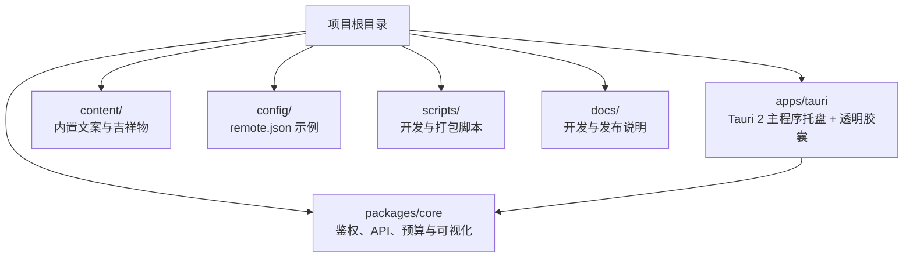
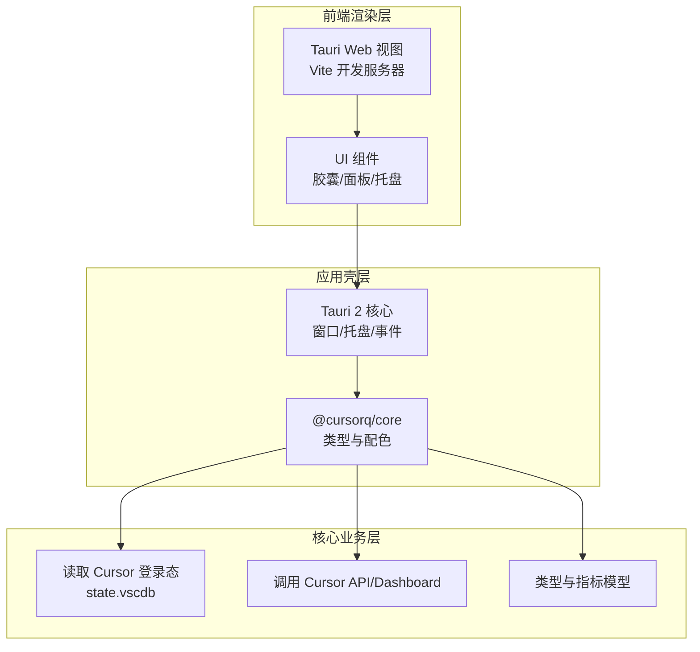
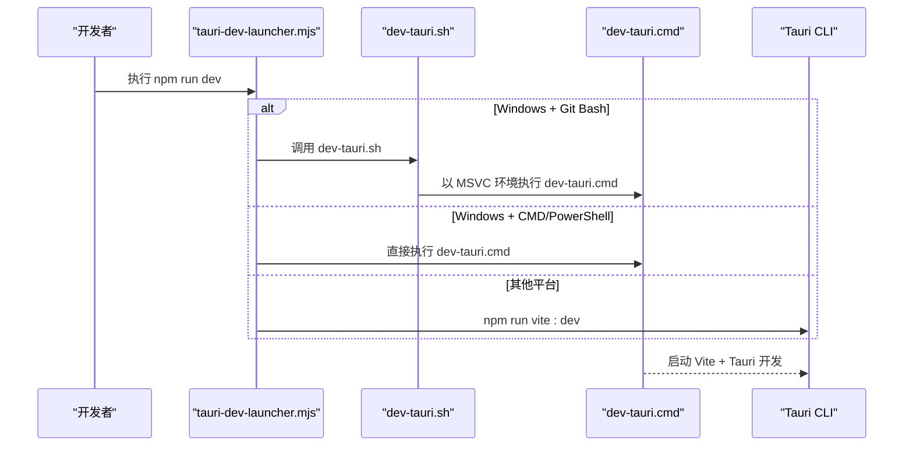
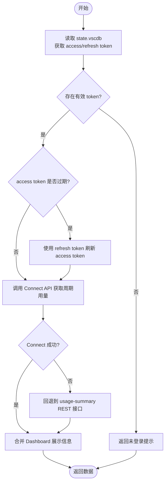
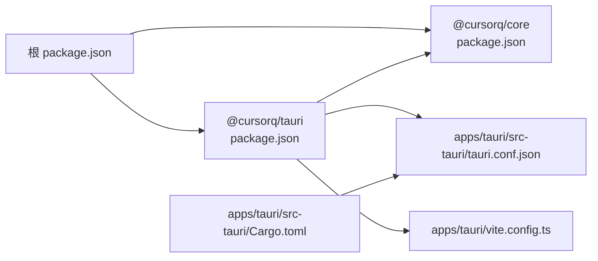

# 快速开始

<cite>
**本文引用的文件**
- [README.md](file://README.md)
- [docs/TAURI_DEV_SETUP.md](file://docs/TAURI_DEV_SETUP.md)
- [package.json](file://package.json)
- [apps/tauri/package.json](file://apps/tauri/package.json)
- [apps/tauri/vite.config.ts](file://apps/tauri/vite.config.ts)
- [apps/tauri/src-tauri/Cargo.toml](file://apps/tauri/src-tauri/Cargo.toml)
- [apps/tauri/src-tauri/tauri.conf.json](file://apps/tauri/src-tauri/tauri.conf.json)
- [scripts/tauri-dev-launcher.mjs](file://scripts/tauri-dev-launcher.mjs)
- [scripts/dev-tauri.sh](file://scripts/dev-tauri.sh)
- [packages/core/src/cursor-auth.ts](file://packages/core/src/cursor-auth.ts)
- [packages/core/src/cursor-api.ts](file://packages/core/src/cursor-api.ts)
- [packages/core/src/types.ts](file://packages/core/src/types.ts)
- [config/remote.json.example](file://config/remote.json.example)
</cite>

## 目录
1. [简介](#简介)
2. [项目结构](#项目结构)
3. [核心组件](#核心组件)
4. [架构总览](#架构总览)
5. [详细组件分析](#详细组件分析)
6. [依赖关系分析](#依赖关系分析)
7. [性能考虑](#性能考虑)
8. [故障排除指南](#故障排除指南)
9. [结论](#结论)
10. [附录](#附录)

## 简介
CursorQ 是一个基于 Tauri 2 的 Windows 桌面胶囊（Floating Widget），用于显示 Cursor 订阅用量信息：周期余量、今日预算与提示文案。它通过读取本机 Cursor 登录态与 Dashboard 数据进行提醒与可视化，不拦截或修改 Cursor 的网络请求。

- 功能亮点：胶囊进度条、轮播文案、用量详情面板、系统托盘、吉祥物动图、远程内容合并等。
- 平台与前置条件：Windows 10+、已登录 Cursor 桌面版、Node.js 20+、Rust MSVC 工具链、WebView2。
- 开发与打包：使用 Vite + Tauri CLI，支持 Windows 打包与便携发布。

**章节来源**
- [README.md:1-130](file://README.md#L1-L130)

## 项目结构
项目采用多工作区组织方式，核心模块与前端应用分离，便于独立开发与构建。

**图表来源**
- [package.json:6-9](file://package.json#L6-L9)
- [apps/tauri/package.json:12-14](file://apps/tauri/package.json#L12-L14)

**章节来源**
- [README.md:98-109](file://README.md#L98-L109)
- [package.json:1-25](file://package.json#L1-L25)
- [apps/tauri/package.json:1-22](file://apps/tauri/package.json#L1-L22)

## 核心组件
- 核心库（packages/core）
  - 负责 Cursor 登录态读取、令牌刷新、用量与计划信息获取、UI 渲染所需的数据结构与配色计算。
- Tauri 应用（apps/tauri）
  - 提供透明胶囊窗口、系统托盘、交互事件、定时刷新、远程内容更新监听等。
- 配置与脚本
  - 开发环境初始化、路径注入、开发启动器、打包脚本等。

**章节来源**
- [packages/core/src/cursor-auth.ts:101-163](file://packages/core/src/cursor-auth.ts#L101-L163)
- [packages/core/src/cursor-api.ts:153-251](file://packages/core/src/cursor-api.ts#L153-L251)
- [apps/tauri/src-tauri/tauri.conf.json:1-48](file://apps/tauri/src-tauri/tauri.conf.json#L1-L48)

## 架构总览
整体架构分为三层：前端渲染层（Vite + Tauri Web 视图）、应用壳层（Tauri 2 + Rust）、核心业务层（@cursorq/core）。数据流从 Cursor 本地数据库与 Dashboard 接口获取，经核心库转换后传递给前端渲染。

**图表来源**
- [apps/tauri/vite.config.ts:7-20](file://apps/tauri/vite.config.ts#L7-L20)
- [apps/tauri/src-tauri/tauri.conf.json:7-11](file://apps/tauri/src-tauri/tauri.conf.json#L7-L11)
- [packages/core/src/cursor-auth.ts:101-163](file://packages/core/src/cursor-auth.ts#L101-L163)
- [packages/core/src/cursor-api.ts:153-251](file://packages/core/src/cursor-api.ts#L153-L251)
- [packages/core/src/types.ts:1-140](file://packages/core/src/types.ts#L1-L140)

## 详细组件分析

### 开发环境设置与安装
- 环境要求
  - Windows 10+
  - 已登录 Cursor 桌面版（读取 %APPDATA%\Cursor\User\globalStorage\state.vscdb）
  - Node.js 20+、Rust MSVC 工具链、WebView2
- 安装步骤
  - 安装 Visual Studio C++ 构建工具（包含 MSVC v143 与 Windows SDK）
  - 安装 WebView2 运行时
  - 将 Rust 默认工具链切换为 MSVC（x86_64-pc-windows-msvc）
  - 安装项目依赖并运行开发脚本
- 常用命令
  - 安装依赖：npm install
  - 构建核心库：npm run build
  - 开发运行：npm run dev
  - Git Bash：npm run dev:bash 或 cqdev
  - 打包 Windows：npm run package:win

**章节来源**
- [README.md:14-28](file://README.md#L14-L28)
- [docs/TAURI_DEV_SETUP.md:1-143](file://docs/TAURI_DEV_SETUP.md#L1-L143)
- [package.json:10-19](file://package.json#L10-L19)
- [apps/tauri/package.json:6-11](file://apps/tauri/package.json#L6-L11)

### 开发启动流程（Windows）
开发启动器会根据当前平台与终端类型，自动选择 PowerShell/MSVC 环境或 Git Bash，并调用相应脚本启动 Tauri 开发服务。

**图表来源**
- [scripts/tauri-dev-launcher.mjs:1-61](file://scripts/tauri-dev-launcher.mjs#L1-L61)
- [scripts/dev-tauri.sh:1-25](file://scripts/dev-tauri.sh#L1-L25)

**章节来源**
- [scripts/tauri-dev-launcher.mjs:1-61](file://scripts/tauri-dev-launcher.mjs#L1-L61)
- [scripts/dev-tauri.sh:1-25](file://scripts/dev-tauri.sh#L1-L25)

### 获取 Cursor 登录状态与 Dashboard 数据
- 登录态来源
  - 从 %APPDATA%\Cursor\User\globalStorage\state.vscdb 读取访问令牌与刷新令牌
  - 若访问令牌过期，使用刷新令牌换取新令牌
- Dashboard 数据
  - 优先调用 Cursor Connect API 获取当前周期用量
  - 失败时回退到网页端 REST 接口
  - 合并 Dashboard 的展示信息与模型分组

**图表来源**
- [packages/core/src/cursor-auth.ts:101-163](file://packages/core/src/cursor-auth.ts#L101-L163)
- [packages/core/src/cursor-api.ts:153-251](file://packages/core/src/cursor-api.ts#L153-L251)

**章节来源**
- [packages/core/src/cursor-auth.ts:101-163](file://packages/core/src/cursor-auth.ts#L101-L163)
- [packages/core/src/cursor-api.ts:153-251](file://packages/core/src/cursor-api.ts#L153-L251)

### 环境变量与远程内容配置
- 环境变量
  - 项目通过读取 APPDATA 环境变量定位 Cursor 数据库路径
- 远程内容配置
  - 复制 config/remote.json.example 为 config/remote.json
  - 配置 enabled、contentBaseUrl、syncDelayMs
  - 启动后先加载内置 content/，随后从远程增量合并（不覆盖本地）

**章节来源**
- [packages/core/src/cursor-auth.ts:29-41](file://packages/core/src/cursor-auth.ts#L29-L41)
- [config/remote.json.example:1-6](file://config/remote.json.example#L1-L6)
- [README.md:84-96](file://README.md#L84-L96)

### 项目构建与运行
- 构建顺序
  - 根目录安装依赖后，先构建 @cursorq/core，再构建 apps/tauri
- 开发运行
  - npm run dev 启动开发服务器与 Tauri
  - Vite 开发服务器地址：http://localhost:1420
- 打包发布（Windows）
  - npm run package:win 生成便携包，包含 exe、content、config 等

**章节来源**
- [package.json:10-19](file://package.json#L10-L19)
- [apps/tauri/package.json:6-11](file://apps/tauri/package.json#L6-L11)
- [apps/tauri/vite.config.ts:14-18](file://apps/tauri/vite.config.ts#L14-L18)
- [apps/tauri/src-tauri/tauri.conf.json:7-11](file://apps/tauri/src-tauri/tauri.conf.json#L7-L11)
- [README.md:111-118](file://README.md#L111-L118)

## 依赖关系分析
- 工作区与依赖
  - 根 package.json 声明 workspaces，统一管理 packages/* 与 apps/*
  - apps/tauri 依赖 @cursorq/core 与 @tauri-apps/api
  - @cursorq/core 依赖 sql.js 用于解析 state.vscdb
- Rust 与 Tauri
  - apps/tauri/src-tauri/Cargo.toml 引入 tauri、reqwest、chrono 等依赖
  - Windows 平台引入 windows crate 以支持 DWM 窗口处理
- 前端构建
  - apps/tauri/vite.config.ts 指定别名与目标浏览器版本
  - tauri.conf.json 配置开发前命令、前端构建输出与窗口属性

**图表来源**
- [package.json:6-9](file://package.json#L6-L9)
- [apps/tauri/package.json:12-14](file://apps/tauri/package.json#L12-L14)
- [apps/tauri/src-tauri/Cargo.toml:15-25](file://apps/tauri/src-tauri/Cargo.toml#L15-L25)
- [apps/tauri/vite.config.ts:9-13](file://apps/tauri/vite.config.ts#L9-L13)
- [apps/tauri/src-tauri/tauri.conf.json:7-11](file://apps/tauri/src-tauri/tauri.conf.json#L7-L11)

**章节来源**
- [package.json:1-25](file://package.json#L1-L25)
- [apps/tauri/package.json:1-22](file://apps/tauri/package.json#L1-L22)
- [apps/tauri/src-tauri/Cargo.toml:1-37](file://apps/tauri/src-tauri/Cargo.toml#L1-L37)
- [apps/tauri/vite.config.ts:1-21](file://apps/tauri/vite.config.ts#L1-L21)
- [apps/tauri/src-tauri/tauri.conf.json:1-48](file://apps/tauri/src-tauri/tauri.conf.json#L1-L48)

## 性能考虑
- 首次 Rust 构建时间较长（约 5–15 分钟），后续增量构建较快
- WebView2 初始化与窗口透明渲染可能受系统图形驱动影响，建议保持驱动更新
- 用量刷新间隔为 30 分钟，避免频繁请求接口
- 远程内容同步采用增量合并策略，减少重复下载

[本节为通用建议，无需特定文件引用]

## 故障排除指南
- Rust MSVC 工具链未就绪
  - 症状：cargo build/link 失败或找不到 link.exe
  - 处理：安装 Visual Studio Build Tools（含 MSVC v143 与 Windows SDK），切换默认工具链为 stable-x86_64-pc-windows-msvc
- WebView2 缺失
  - 症状：tauri dev 报 WebView2 相关错误
  - 处理：安装 WebView2 Evergreen Bootstrapper
- PATH 未包含 cargo
  - 处理：执行 npm run setup:path 注入用户 PATH，重启终端后验证 cargo -V
- Git Bash 启动异常
  - 处理：执行 bash scripts/install-bash-hook.sh，使用 cqdev 或 cq 命令
- Cursor 未登录或数据不可读
  - 症状：提示“请先登录 Cursor”
  - 处理：确保已登录 Cursor 桌面版，检查 %APPDATA%\Cursor\User\globalStorage\state.vscdb 是否存在
- API 接口变更导致数据异常
  - 处理：项目会自动回退到 REST 接口；若仍失败，请关注仓库更新

**章节来源**
- [docs/TAURI_DEV_SETUP.md:139-143](file://docs/TAURI_DEV_SETUP.md#L139-L143)
- [README.md:14-19](file://README.md#L14-L19)
- [packages/core/src/cursor-auth.ts:101-118](file://packages/core/src/cursor-auth.ts#L101-L118)

## 结论
按照本指南完成环境准备与安装后，您可以在 Windows 上快速运行 CursorQ。项目通过读取本机 Cursor 登录态与 Dashboard 数据，实现轻量、非侵入式的用量可视化。遇到问题时，可依据故障排除章节逐一排查。

[本节为总结性内容，无需特定文件引用]

## 附录

### 常用命令清单
- 安装依赖：npm install
- 构建核心库：npm run build
- 开发运行：npm run dev
- Git Bash：npm run dev:bash 或 cqdev
- 打包 Windows：npm run package:win

**章节来源**
- [README.md:21-28](file://README.md#L21-L28)
- [package.json:10-19](file://package.json#L10-L19)

### 数据模型要点（核心类型）
- 认证令牌：accessToken、refreshToken、email
- 计划用量：totalSpend、includedSpend、remaining、limit、百分比
- 周期用量：billingCycleStart、billingCycleEnd、displayMessage、autoBucketModels
- UI 指标：todayUsedCents、dailyBudgetCents、cycleUsedPct、daysLeft、tierLabel 等

**章节来源**
- [packages/core/src/types.ts:1-140](file://packages/core/src/types.ts#L1-L140)