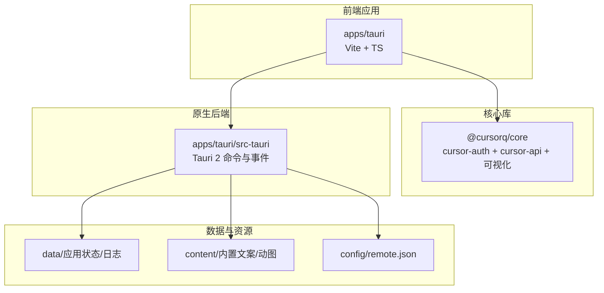
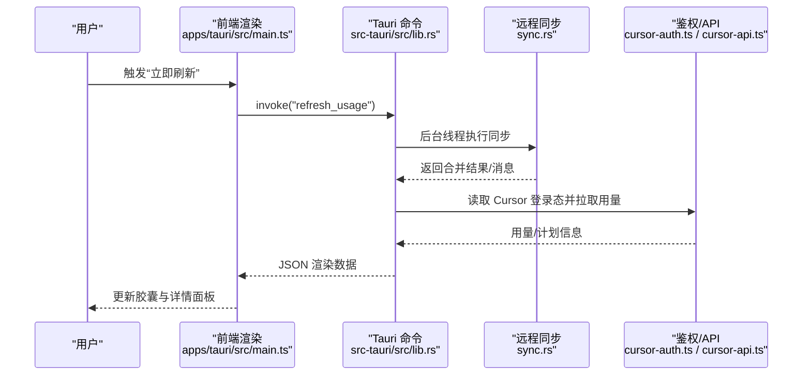
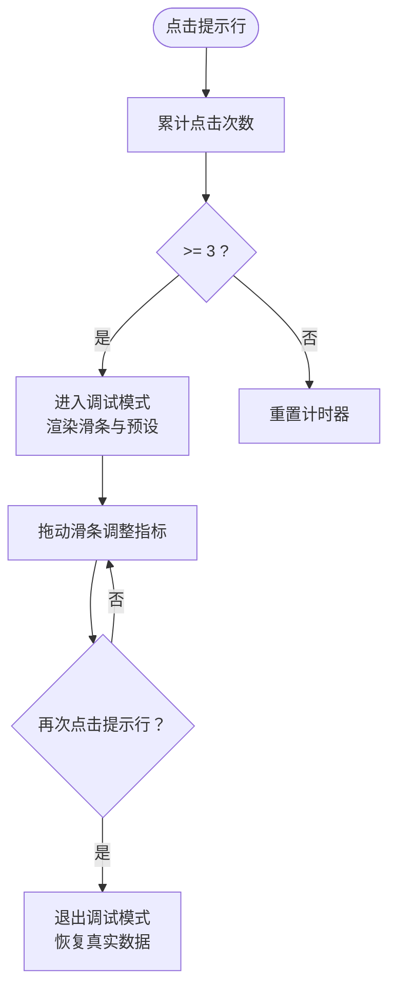
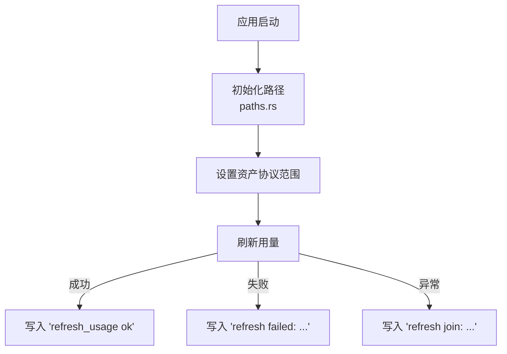
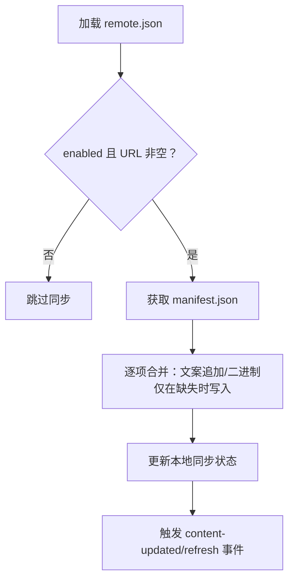
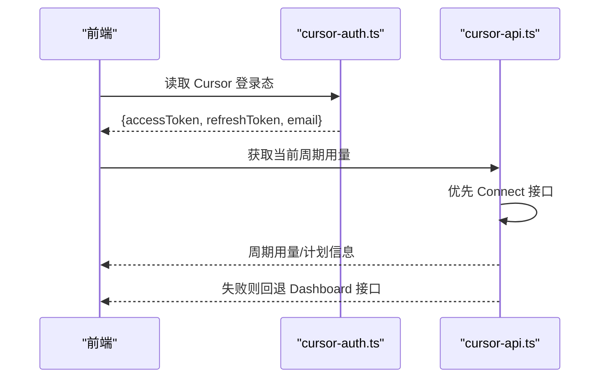
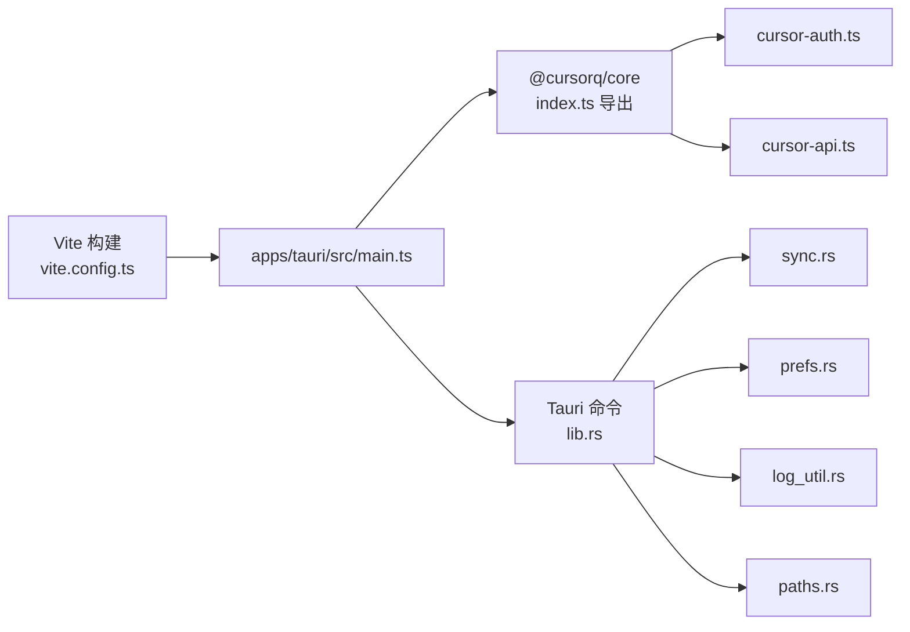

# 故障排除

<cite>
**本文引用的文件**
- [README.md](file://README.md)
- [apps/tauri/src/main.ts](file://apps/tauri/src/main.ts)
- [apps/tauri/src/debug-mode.ts](file://apps/tauri/src/debug-mode.ts)
- [apps/tauri/src-tauri/src/lib.rs](file://apps/tauri/src-tauri/src/lib.rs)
- [apps/tauri/src-tauri/src/log_util.rs](file://apps/tauri/src-tauri/src/log_util.rs)
- [apps/tauri/src-tauri/src/sync.rs](file://apps/tauri/src-tauri/src/sync.rs)
- [apps/tauri/src-tauri/src/prefs.rs](file://apps/tauri/src-tauri/src/prefs.rs)
- [apps/tauri/src-tauri/src/paths.rs](file://apps/tauri/src-tauri/src/paths.rs)
- [apps/tauri/src-tauri/src/main.rs](file://apps/tauri/src-tauri/src/main.rs)
- [apps/tauri/src-tauri/Cargo.toml](file://apps/tauri/src-tauri/Cargo.toml)
- [apps/tauri/package.json](file://apps/tauri/package.json)
- [packages/core/src/index.ts](file://packages/core/src/index.ts)
- [packages/core/src/cursor-api.ts](file://packages/core/src/cursor-api.ts)
- [packages/core/src/cursor-auth.ts](file://packages/core/src/cursor-auth.ts)
- [docs/TAURI_DEV_SETUP.md](file://docs/TAURI_DEV_SETUP.md)
- [scripts/dev-tauri.cmd](file://scripts/dev-tauri.cmd)
- [scripts/package-release.mjs](file://scripts/package-release.mjs)
- [apps/tauri/vite.config.ts](file://apps/tauri/vite.config.ts)
</cite>

## 目录
1. [简介](#简介)
2. [项目结构](#项目结构)
3. [核心组件](#核心组件)
4. [架构总览](#架构总览)
5. [详细组件分析](#详细组件分析)
6. [依赖关系分析](#依赖关系分析)
7. [性能考虑](#性能考虑)
8. [故障排除指南](#故障排除指南)
9. [结论](#结论)
10. [附录](#附录)

## 简介
本指南面向 CursorQ 用户与维护者，提供从安装配置、运行时错误、性能问题到兼容性问题的系统化排障流程。内容涵盖调试模式使用、日志记录机制、诊断工具、系统集成与网络连接问题排查、权限相关问题处理，以及开发与生产环境的应急处置建议。所有建议均基于仓库实际实现与文档。

## 项目结构
CursorQ 采用“核心库 + Tauri 应用”的分层设计：
- packages/core：封装 Cursor 鉴权、API、预算与可视化逻辑
- apps/tauri：Tauri 2 前端（托盘 + 透明胶囊窗），调用 Rust 后端能力
- scripts：开发与打包脚本
- content/config：内置内容与远程同步配置
- docs：开发与发布说明

图表来源
- [apps/tauri/src/main.ts:1-711](file://apps/tauri/src/main.ts#L1-L711)
- [packages/core/src/index.ts:1-35](file://packages/core/src/index.ts#L1-L35)
- [apps/tauri/src-tauri/src/lib.rs:716-800](file://apps/tauri/src-tauri/src/lib.rs#L716-L800)
- [apps/tauri/src-tauri/src/paths.rs:37-87](file://apps/tauri/src-tauri/src/paths.rs#L37-L87)

章节来源
- [README.md:98-120](file://README.md#L98-L120)
- [apps/tauri/src/main.ts:1-120](file://apps/tauri/src/main.ts#L1-L120)
- [packages/core/src/index.ts:1-35](file://packages/core/src/index.ts#L1-L35)
- [apps/tauri/src-tauri/src/paths.rs:37-87](file://apps/tauri/src-tauri/src/paths.rs#L37-L87)

## 核心组件
- 调试模式：通过连点提示行进入/退出，滑条模拟用量状态，与正式渲染共享同一进度计算逻辑
- 日志系统：Rust 后端统一写入日志文件，便于定位刷新失败、路径解析、网络请求等问题
- 远程同步：按清单合并远程内容，仅追加不覆盖，支持延迟策略
- 鉴权与 API：读取 Cursor 登录态，调用 Dashboard 接口获取用量与计划信息
- 窗口与托盘：透明胶囊窗、DWM 形状修复、托盘菜单与快捷操作

章节来源
- [apps/tauri/src/main.ts:299-317](file://apps/tauri/src/main.ts#L299-L317)
- [apps/tauri/src-tauri/src/log_util.rs:8-15](file://apps/tauri/src-tauri/src/log_util.rs#L8-L15)
- [apps/tauri/src-tauri/src/sync.rs:261-367](file://apps/tauri/src-tauri/src/sync.rs#L261-L367)
- [packages/core/src/cursor-auth.ts:101-118](file://packages/core/src/cursor-auth.ts#L101-L118)
- [packages/core/src/cursor-api.ts:173-217](file://packages/core/core/src/cursor-api.ts#L173-L217)

## 架构总览
前端通过 Tauri 命令调用 Rust 后端，Rust 后端负责系统集成（托盘、窗口、路径、日志）、远程同步与 Node 子进程刷新。核心库提供统一的用量与可视化逻辑。

图表来源
- [apps/tauri/src/main.ts:526-560](file://apps/tauri/src/main.ts#L526-L560)
- [apps/tauri/src-tauri/src/lib.rs:618-639](file://apps/tauri/src-tauri/src/lib.rs#L618-L639)
- [apps/tauri/src-tauri/src/sync.rs:261-367](file://apps/tauri/src-tauri/src/sync.rs#L261-L367)
- [packages/core/src/cursor-auth.ts:101-118](file://packages/core/src/cursor-auth.ts#L101-L118)
- [packages/core/src/cursor-api.ts:173-217](file://packages/core/src/cursor-api.ts#L173-L217)

## 详细组件分析

### 调试模式
- 触发方式：详情面板提示行连点三次进入调试模式，再次点击提示行退出
- 交互：滑条实时驱动胶囊进度与面板指标，便于验证边界场景
- 退出：回到正常渲染，恢复上次真实数据

图表来源
- [apps/tauri/src/main.ts:650-671](file://apps/tauri/src/main.ts#L650-L671)
- [apps/tauri/src/debug-mode.ts:1-190](file://apps/tauri/src/debug-mode.ts#L1-L190)

章节来源
- [README.md:62-64](file://README.md#L62-L64)
- [apps/tauri/src/main.ts:299-317](file://apps/tauri/src/main.ts#L299-L317)

### 日志记录与诊断
- 日志位置：应用数据目录下的 logs/cursorq.log（Windows）
- 写入方式：Rust 后端统一 append，包含时间戳与上下文信息
- 关键事件：启动、路径初始化、资产协议范围、刷新开始/成功/失败、远程同步、窗口修复等
- 诊断要点：结合前端错误提示与日志定位具体阶段

图表来源
- [apps/tauri/src-tauri/src/lib.rs:737-753](file://apps/tauri/src-tauri/src/lib.rs#L737-L753)
- [apps/tauri/src-tauri/src/lib.rs:622-639](file://apps/tauri/src-tauri/src/lib.rs#L622-L639)
- [apps/tauri/src-tauri/src/log_util.rs:8-15](file://apps/tauri/src-tauri/src/log_util.rs#L8-L15)

章节来源
- [README.md:123-124](file://README.md#L123-L124)
- [apps/tauri/src-tauri/src/log_util.rs:8-15](file://apps/tauri/src-tauri/src/log_util.rs#L8-L15)

### 远程内容同步
- 配置：启用开关、基础 URL、同步延迟
- 合并策略：仅追加远程新条目，不覆盖本地既有文案/动图
- 启动时应用内置内容清单，确保离线可用
- 结果：更新时触发前端刷新与窗口修复事件

图表来源
- [apps/tauri/src-tauri/src/sync.rs:58-70](file://apps/tauri/src-tauri/src/sync.rs#L58-L70)
- [apps/tauri/src-tauri/src/sync.rs:261-367](file://apps/tauri/src-tauri/src/sync.rs#L261-L367)
- [apps/tauri/src-tauri/src/lib.rs:127-138](file://apps/tauri/src-tauri/src/lib.rs#L127-L138)

章节来源
- [README.md:84-96](file://README.md#L84-L96)
- [apps/tauri/src-tauri/src/sync.rs:123-165](file://apps/tauri/src-tauri/src/sync.rs#L123-L165)

### 鉴权与 API
- 登录态来源：读取 Cursor 桌面版本地数据库 token
- 认证流程：优先使用有效 AccessToken，必要时用 RefreshToken 换取新 Token
- API 调用：优先使用 Connect 协议接口，失败回退到 Dashboard Cookie 接口
- 错误处理：返回错误信息供前端展示或记录日志

图表来源
- [packages/core/src/cursor-auth.ts:101-118](file://packages/core/src/cursor-auth.ts#L101-L118)
- [packages/core/src/cursor-auth.ts:122-141](file://packages/core/src/cursor-auth.ts#L122-L141)
- [packages/core/src/cursor-api.ts:173-217](file://packages/core/src/cursor-api.ts#L173-L217)

章节来源
- [README.md:16-18](file://README.md#L16-L18)
- [packages/core/src/cursor-auth.ts:29-41](file://packages/core/src/cursor-auth.ts#L29-L41)

### 窗口与托盘
- 透明胶囊窗：禁用装饰与阴影，设置背景透明，Windows 下通过 DWM 调整形状
- 托盘菜单：显示/隐藏胶囊、中英切换、置顶、开机启动、立即刷新、同步内容、退出
- 事件：窗口显示、内容更新、修复 Chrome 白边等事件驱动前端重绘与布局

章节来源
- [apps/tauri/src-tauri/src/lib.rs:282-368](file://apps/tauri/src-tauri/src/lib.rs#L282-L368)
- [apps/tauri/src-tauri/src/lib.rs:411-449](file://apps/tauri/src-tauri/src/lib.rs#L411-L449)
- [apps/tauri/src/main.ts:674-710](file://apps/tauri/src/main.ts#L674-L710)

## 依赖关系分析
- 前端依赖 @cursorq/core 提供统一类型与核心逻辑
- Rust 依赖 reqwest、serde、windows 等，负责网络、序列化与 Windows 平台特性
- 构建与运行：Vite、Tauri CLI、Node 环境

图表来源
- [apps/tauri/vite.config.ts:7-20](file://apps/tauri/vite.config.ts#L7-L20)
- [packages/core/src/index.ts:1-35](file://packages/core/src/index.ts#L1-L35)
- [apps/tauri/src-tauri/src/lib.rs:716-736](file://apps/tauri/src-tauri/src/lib.rs#L716-L736)
- [apps/tauri/src-tauri/Cargo.toml:15-33](file://apps/tauri/src-tauri/Cargo.toml#L15-L33)

章节来源
- [apps/tauri/package.json:12-21](file://apps/tauri/package.json#L12-L21)
- [apps/tauri/src-tauri/Cargo.toml:15-33](file://apps/tauri/src-tauri/Cargo.toml#L15-L33)

## 性能考虑
- 刷新频率：默认每 30 分钟自动刷新，可通过托盘“立即刷新”触发
- 异步刷新：后台线程执行 Node 刷新，避免阻塞 UI
- 窗口修复：定时与事件触发修复 DWM 白边，减少重绘抖动
- 资源加载：动图为 data URL，避免 asset:// 在部分环境失败

章节来源
- [apps/tauri/src/main.ts:43-43](file://apps/tauri/src/main.ts#L43-L43)
- [apps/tauri/src-tauri/src/lib.rs:617-639](file://apps/tauri/src-tauri/src/lib.rs#L617-L639)
- [apps/tauri/src-tauri/src/lib.rs:587-614](file://apps/tauri/src-tauri/src/lib.rs#L587-L614)

## 故障排除指南

### 一、安装与环境问题
- 环境要求
  - Windows 10+，已安装并登录 Cursor 桌面版
  - Node.js 20+、Rust（MSVC 工具链）、WebView2
- 常见症状
  - tauri dev 报 WebView2 缺失
  - Rust 链接失败或找不到 link.exe
  - cargo tauri 版本不符
- 解决步骤
  - 安装/勾选 Visual Studio C++ 构建工具（MSVC + Windows SDK）
  - 安装 WebView2 运行时
  - 切换到 MSVC 工具链并添加目标
  - 使用项目内 @tauri-apps/cli，避免 cargo install
  - 自检命令与期望结果见开发文档

章节来源
- [README.md:14-19](file://README.md#L14-L19)
- [docs/TAURI_DEV_SETUP.md:13-45](file://docs/TAURI_DEV_SETUP.md#L13-L45)
- [docs/TAURI_DEV_SETUP.md:96-126](file://docs/TAURI_DEV_SETUP.md#L96-L126)

### 二、运行时错误
- 现象
  - “请先登录 Cursor”提示
  - 刷新失败/白屏/进度条异常
  - 托盘菜单点击无效或闪烁
- 排查步骤
  - 确认 Cursor 已登录，检查登录态读取路径
  - 查看日志文件定位失败阶段（刷新、网络、路径）
  - 尝试“立即刷新”，观察前端错误提示
  - Windows 下触发“修复 Chrome”事件，或重启应用
- 诊断要点
  - 登录态缺失：前端收到“not_logged_in”错误
  - 刷新失败：查看日志中“refresh failed: ...”
  - 托盘闪烁：触发菜单动作后短暂忽略后续事件

章节来源
- [apps/tauri/src/main.ts:535-538](file://apps/tauri/src/main.ts#L535-L538)
- [apps/tauri/src-tauri/src/lib.rs:531-542](file://apps/tauri/src-tauri/src/lib.rs#L531-L542)
- [apps/tauri/src-tauri/src/lib.rs:186-230](file://apps/tauri/src-tauri/src/lib.rs#L186-L230)

### 三、性能问题
- 症状
  - 刷新卡顿、界面闪烁、白边
- 优化建议
  - 使用“立即刷新”替代频繁自动刷新
  - 关闭不必要的置顶/开机启动，减少系统开销
  - 确保 WebView2 与驱动更新
  - 如遇白边，等待或手动触发“修复 Chrome”

章节来源
- [apps/tauri/src-tauri/src/lib.rs:587-614](file://apps/tauri/src-tauri/src/lib.rs#L587-L614)
- [apps/tauri/src-tauri/src/lib.rs:690-701](file://apps/tauri/src-tauri/src/lib.rs#L690-L701)

### 四、兼容性问题
- Windows DWM 白边
  - 现象：胶囊边缘出现白色底色
  - 处理：触发“修复 Chrome”事件，或等待定时修复
- 透明窗与焦点
  - 窗口禁用装饰与阴影，避免系统主题影响
- WebView2
  - 确保运行时版本匹配

章节来源
- [apps/tauri/src-tauri/src/lib.rs:411-449](file://apps/tauri/src-tauri/src/lib.rs#L411-L449)
- [apps/tauri/src-tauri/src/lib.rs:758-770](file://apps/tauri/src-tauri/src/lib.rs#L758-L770)
- [docs/TAURI_DEV_SETUP.md:26-30](file://docs/TAURI_DEV_SETUP.md#L26-L30)

### 五、网络连接问题
- 症状
  - 远程同步失败、文案/动图未更新
- 排查步骤
  - 检查 remote.json 是否启用且 URL 非空
  - 确认网络可达与超时设置
  - 查看日志中 manifest 请求与解析错误
- 临时方案
  - 保持本地内置内容（content/）可用
  - 离线模式下仅使用内置资源

章节来源
- [apps/tauri/src-tauri/src/sync.rs:261-367](file://apps/tauri/src-tauri/src/sync.rs#L261-L367)
- [apps/tauri/src-tauri/src/sync.rs:58-70](file://apps/tauri/src-tauri/src/sync.rs#L58-L70)
- [README.md:84-96](file://README.md#L84-L96)

### 六、权限与路径问题
- 症状
  - 日志目录不可写、路径解析失败
  - 便携包 data/logs/config 目录不存在
- 排查步骤
  - 检查 data/logs/config 目录是否存在并可写
  - 便携布局：exe 同级应有 config、data、logs
  - 路径初始化失败时查看日志中的“asset scope”与“root/portable”信息
- 修复建议
  - 手动创建缺失目录
  - 使用便携包标准目录结构

章节来源
- [apps/tauri/src-tauri/src/paths.rs:54-79](file://apps/tauri/src-tauri/src/paths.rs#L54-L79)
- [apps/tauri/src-tauri/src/lib.rs:737-753](file://apps/tauri/src-tauri/src/lib.rs#L737-L753)
- [scripts/package-release.mjs:68-95](file://scripts/package-release.mjs#L68-L95)

### 七、系统集成问题
- 托盘菜单
  - 点击后立即显示/隐藏：受“菜单动作保护期”影响，短时间忽略重复事件
  - 置顶/开机启动：状态写入 app-state.json，重启后生效
- 窗口行为
  - 显示/隐藏胶囊：通过命令控制，同时更新托盘提示
  - 修复 Chrome：定时与事件触发，Windows 下调用 DWM

章节来源
- [apps/tauri/src-tauri/src/lib.rs:186-230](file://apps/tauri/src-tauri/src/lib.rs#L186-L230)
- [apps/tauri/src-tauri/src/prefs.rs:128-132](file://apps/tauri/src-tauri/src/prefs.rs#L128-L132)
- [apps/tauri/src-tauri/src/lib.rs:587-614](file://apps/tauri/src-tauri/src/lib.rs#L587-L614)

### 八、开发环境特有问题
- 开发命令
  - 使用项目内脚本启动开发：dev-tauri.cmd 或 dev-tauri.sh
  - 首次构建 Rust 可能耗时较长（5-15 分钟）
- 构建产物
  - 前端构建输出至 apps/tauri/dist
  - 原生库构建输出至 apps/tauri/src-tauri/target

章节来源
- [scripts/dev-tauri.cmd:1-17](file://scripts/dev-tauri.cmd#L1-L17)
- [apps/tauri/package.json:6-11](file://apps/tauri/package.json#L6-L11)

### 九、生产环境应急处理
- 快速恢复
  - 重启应用，触发“修复 Chrome”事件
  - 手动执行“立即刷新”，检查网络与登录态
- 日志定位
  - 查看 logs/cursorq.log，定位失败阶段与错误信息
- 远程同步
  - 检查 remote.json 配置，必要时暂时禁用远程同步
- 便携包
  - 确保 config/data/logs 目录齐全，避免路径缺失导致功能异常

章节来源
- [README.md:123-124](file://README.md#L123-L124)
- [apps/tauri/src-tauri/src/sync.rs:261-279](file://apps/tauri/src-tauri/src/sync.rs#L261-L279)
- [scripts/package-release.mjs:68-95](file://scripts/package-release.mjs#L68-L95)

## 结论
本指南提供了从安装到运行、从调试到生产的全链路排障路径。建议优先使用调试模式与日志定位问题，结合远程同步与便携包结构进行快速恢复。对于开发与生产环境，分别遵循自检与应急流程，确保最小化停机时间。

## 附录

### A. 常用命令与路径
- 开发启动
  - Windows：scripts\dev-tauri.cmd
  - Linux/macOS：npm run dev:bash 或 ./scripts/dev-tauri.sh
- 构建与打包
  - npm run build（前端）
  - cargo build --release（原生）
  - node scripts/package-release.mjs（便携包）

章节来源
- [scripts/dev-tauri.cmd:1-17](file://scripts/dev-tauri.cmd#L1-L17)
- [scripts/package-release.mjs:54-62](file://scripts/package-release.mjs#L54-L62)

### B. 关键日志关键词
- 启动与路径：CursorQ started、root=...、portable=...
- 刷新：refresh_usage start/ok/error/join
- 远程同步：manifest request/json/parse、merge、updated
- 窗口修复：fix-chrome、tune_window_dwm、apply_window_shape

章节来源
- [apps/tauri/src-tauri/src/lib.rs:737-753](file://apps/tauri/src-tauri/src/lib.rs#L737-L753)
- [apps/tauri/src-tauri/src/lib.rs:622-639](file://apps/tauri/src-tauri/src/lib.rs#L622-L639)
- [apps/tauri/src-tauri/src/sync.rs:297-333](file://apps/tauri/src-tauri/src/sync.rs#L297-L333)