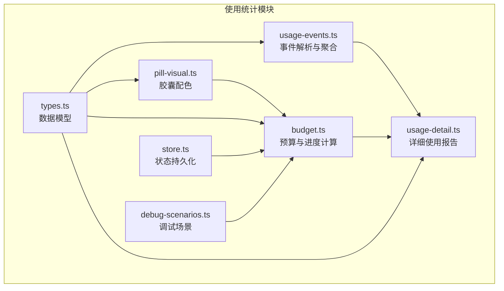
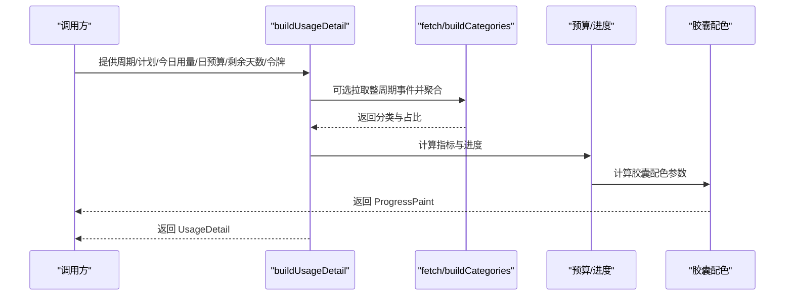
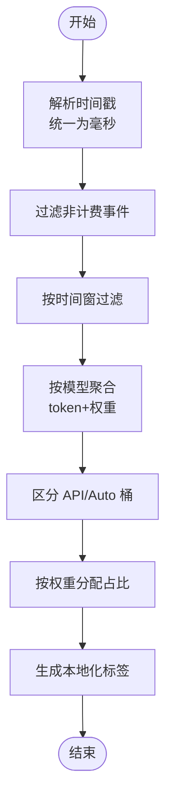
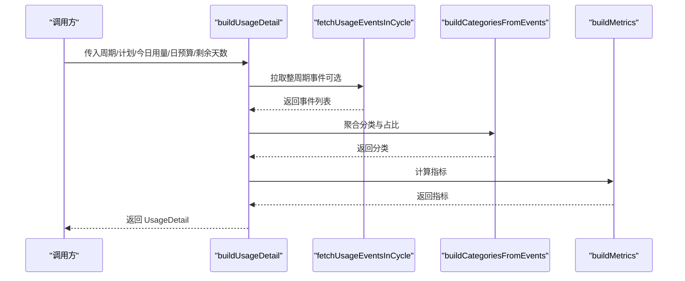
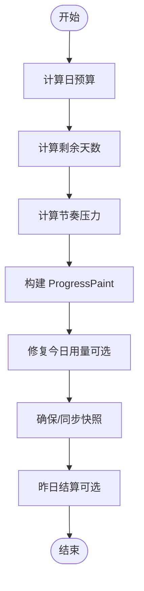
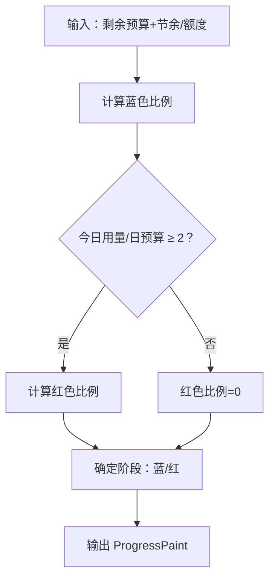
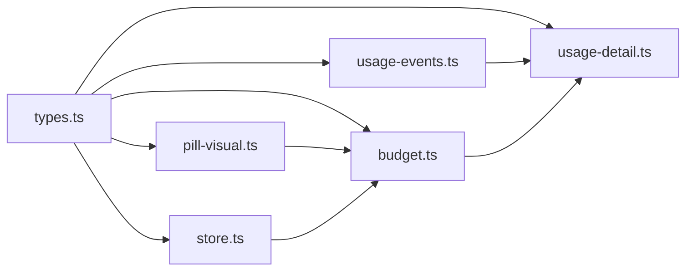
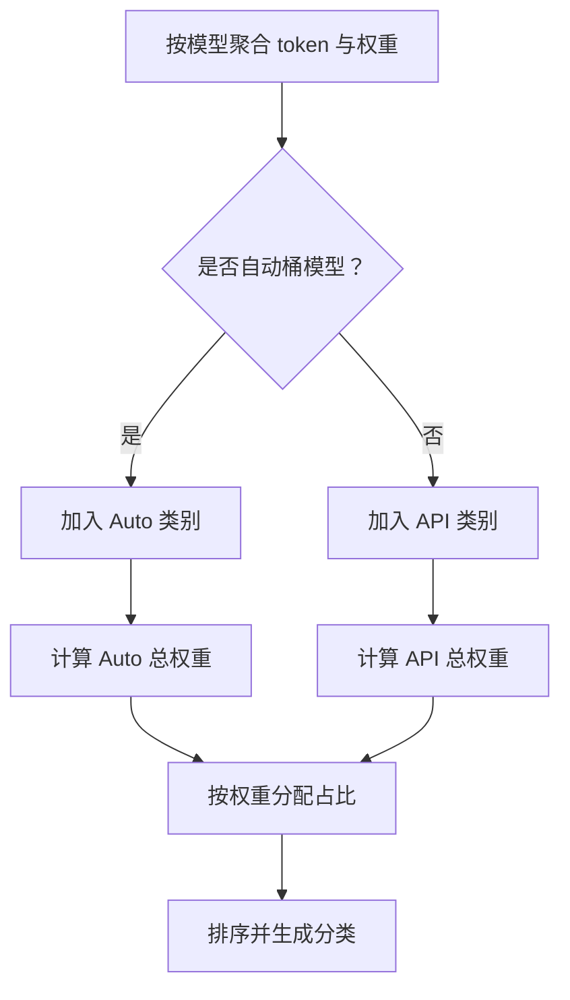

# 使用统计模块

<cite>
**本文引用的文件**
- [packages/core/src/usage-events.ts](file://packages/core/src/usage-events.ts)
- [packages/core/src/usage-detail.ts](file://packages/core/src/usage-detail.ts)
- [packages/core/src/budget.ts](file://packages/core/src/budget.ts)
- [packages/core/src/pill-visual.ts](file://packages/core/src/pill-visual.ts)
- [packages/core/src/types.ts](file://packages/core/src/types.ts)
- [packages/core/src/store.ts](file://packages/core/src/store.ts)
- [packages/core/src/debug-scenarios.ts](file://packages/core/src/debug-scenarios.ts)
</cite>

## 目录
1. [简介](#简介)
2. [项目结构](#项目结构)
3. [核心组件](#核心组件)
4. [架构总览](#架构总览)
5. [详细组件分析](#详细组件分析)
6. [依赖关系分析](#依赖关系分析)
7. [性能考量](#性能考量)
8. [故障排查指南](#故障排查指南)
9. [结论](#结论)
10. [附录](#附录)

## 简介
本文件系统性阐述 CursorQ 的“使用统计模块”，围绕以下目标展开：
- 使用事件解析算法（UsageEvents）：原始事件格式、事件类型分类、时间范围过滤与数据清洗。
- 统计数据聚合逻辑：按模型与类别（API/Auto）聚合 token 与权重，分配使用占比。
- 进度计算方法：基于周期预算、日预算、剩余天数与“公平日预算”的综合进度与警示。
- 详细使用报告生成：构建 UsageDetail 结构，包含分类、指标与历史快照。
- 预算系统集成：与预算模块联动，确保“今日用量”与“周期进度”的稳健计算。
- UI 驱动与预警：通过 ProgressPaint 与 UsageDetail 驱动界面状态与警示。

## 项目结构
使用统计模块主要由以下文件构成：
- usage-events.ts：原始使用事件解析、时间范围过滤、聚合与分类。
- usage-detail.ts：整合事件与预算信息，生成详细使用报告。
- budget.ts：预算计算、进度计算、快照管理与异常修复。
- pill-visual.ts：胶囊光带配色与阶段判定。
- types.ts：数据模型定义。
- store.ts：应用状态持久化。
- debug-scenarios.ts：调试场景与进度推演。

图表来源
- [packages/core/src/usage-events.ts:1-291](file://packages/core/src/usage-events.ts#L1-L291)
- [packages/core/src/usage-detail.ts:1-185](file://packages/core/src/usage-detail.ts#L1-L185)
- [packages/core/src/budget.ts:1-274](file://packages/core/src/budget.ts#L1-L274)
- [packages/core/src/pill-visual.ts:1-79](file://packages/core/src/pill-visual.ts#L1-L79)
- [packages/core/src/types.ts:1-140](file://packages/core/src/types.ts#L1-L140)
- [packages/core/src/store.ts:1-55](file://packages/core/src/store.ts#L1-L55)
- [packages/core/src/debug-scenarios.ts:1-88](file://packages/core/src/debug-scenarios.ts#L1-L88)

章节来源
- [packages/core/src/usage-events.ts:1-291](file://packages/core/src/usage-events.ts#L1-L291)
- [packages/core/src/usage-detail.ts:1-185](file://packages/core/src/usage-detail.ts#L1-L185)
- [packages/core/src/budget.ts:1-274](file://packages/core/src/budget.ts#L1-L274)
- [packages/core/src/pill-visual.ts:1-79](file://packages/core/src/pill-visual.ts#L1-L79)
- [packages/core/src/types.ts:1-140](file://packages/core/src/types.ts#L1-L140)
- [packages/core/src/store.ts:1-55](file://packages/core/src/store.ts#L1-L55)
- [packages/core/src/debug-scenarios.ts:1-88](file://packages/core/src/debug-scenarios.ts#L1-L88)

## 核心组件
- 原始使用事件（RawUsageEvent）
  - 字段：时间戳、是否计费、模型名、请求成本、计费金额、token 使用明细（输入/输出/缓存读/缓存写）。
  - 解析与清洗：统一时间戳格式、过滤非计费事件、剔除非法数值。
- 事件聚合与分类（buildCategoriesFromEvents）
  - 按模型聚合 token 与权重（优先使用计费金额，其次请求成本，最后 token 数）。
  - 自动桶模型识别（Auto/AutoComposer/Default/Composer 等）。
  - 分类占比分配：API 与 Auto 类别分别按权重分配使用占比，并排序。
- 详细使用报告（buildUsageDetail）
  - 可选拉取整周期事件或复用预取事件。
  - 构建 UsageDetail：计划名称、周期起止、总量占比、今日用量、日预算、剩余天数、分类与指标。
- 预算与进度（computeProgress）
  - 基于剩余预算、日预算、剩余天数与“公平日预算”计算进度与警示。
  - 修复异常事件汇总导致的今日基线偏差。
- 胶囊配色（buildProgressPaint）
  - 蓝色代表剩余+节余预算占比；当今日用量 ≥ 2×日预算 时转红。
- 应用状态与快照（ensure/syncTodaySnapshot、repairCorruptTodaySnapshot）
  - 维护每日快照（baseline/dailyBudget），支持跨日结算与节余银行。

章节来源
- [packages/core/src/usage-events.ts:3-16](file://packages/core/src/usage-events.ts#L3-L16)
- [packages/core/src/usage-events.ts:31-43](file://packages/core/src/usage-events.ts#L31-L43)
- [packages/core/src/usage-events.ts:192-290](file://packages/core/src/usage-events.ts#L192-L290)
- [packages/core/src/usage-detail.ts:104-180](file://packages/core/src/usage-detail.ts#L104-L180)
- [packages/core/src/budget.ts:243-272](file://packages/core/src/budget.ts#L243-L272)
- [packages/core/src/pill-visual.ts:29-63](file://packages/core/src/pill-visual.ts#L29-L63)
- [packages/core/src/budget.ts:102-147](file://packages/core/src/budget.ts#L102-L147)
- [packages/core/src/budget.ts:194-207](file://packages/core/src/budget.ts#L194-L207)

## 架构总览
使用统计模块的端到端流程如下：

图表来源
- [packages/core/src/usage-detail.ts:104-180](file://packages/core/src/usage-detail.ts#L104-L180)
- [packages/core/src/usage-events.ts:166-186](file://packages/core/src/usage-events.ts#L166-L186)
- [packages/core/src/usage-events.ts:192-290](file://packages/core/src/usage-events.ts#L192-L290)
- [packages/core/src/budget.ts:243-272](file://packages/core/src/budget.ts#L243-L272)
- [packages/core/src/pill-visual.ts:29-63](file://packages/core/src/pill-visual.ts#L29-L63)

## 详细组件分析

### 使用事件解析与聚合（UsageEvents）
- 原始事件格式
  - 时间戳：支持字符串或数字，自动转换为毫秒；若小于 1e12 视为秒并乘以 1000。
  - 计费字段：优先使用 chargedCents，其次 requestsCosts，最后 token 数总和。
  - 模型名：去除空白，排除 default/auto/unknown 等无效值。
- 时间范围过滤
  - 支持按“今日”或“账期”过滤事件，仅保留计费且在时间窗内的事件。
- 聚合与分类
  - 按模型聚合 token 与权重，区分 API 与 Auto 类别。
  - 按权重分配使用占比，保留本地化标签（千/万/亿等）。
- 异常处理
  - 当事件拉取失败或为空时，回退到仅使用预算占比的分类。

图表来源
- [packages/core/src/usage-events.ts:45-50](file://packages/core/src/usage-events.ts#L45-L50)
- [packages/core/src/usage-events.ts:69-78](file://packages/core/src/usage-events.ts#L69-L78)
- [packages/core/src/usage-events.ts:192-290](file://packages/core/src/usage-events.ts#L192-L290)

章节来源
- [packages/core/src/usage-events.ts:3-16](file://packages/core/src/usage-events.ts#L3-L16)
- [packages/core/src/usage-events.ts:31-43](file://packages/core/src/usage-events.ts#L31-L43)
- [packages/core/src/usage-events.ts:45-79](file://packages/core/src/usage-events.ts#L45-L79)
- [packages/core/src/usage-events.ts:192-290](file://packages/core/src/usage-events.ts#L192-L290)

### 详细使用报告生成（buildUsageDetail）
- 输入
  - 周期信息（billingCycleStart/end）、计划信息、今日用量（美分）、日预算（美分）、剩余天数。
  - 可选预取事件与开关：是否拉取整周期事件。
- 处理
  - 可选拉取整周期事件；失败则回退为空事件。
  - 调用 buildCategoriesFromEvents 生成分类与占比。
  - 计算指标（今日用量占比、周期已用占比、剩余占比、剩余天数占比、档位标签）。
- 输出
  - UsageDetail：包含计划名、周期时间、总量占比、今日用量、日预算、剩余天数、分类与指标。

图表来源
- [packages/core/src/usage-detail.ts:104-180](file://packages/core/src/usage-detail.ts#L104-L180)
- [packages/core/src/usage-events.ts:166-186](file://packages/core/src/usage-events.ts#L166-L186)
- [packages/core/src/usage-events.ts:192-290](file://packages/core/src/usage-events.ts#L192-L290)

章节来源
- [packages/core/src/usage-detail.ts:99-180](file://packages/core/src/usage-detail.ts#L99-L180)

### 预算系统集成与进度计算（computeProgress）
- 关键函数
  - computeDailyBudgetCents：按剩余预算与剩余天数计算日预算。
  - daysLeftInCycle：计算剩余天数。
  - pacingStressPct：评估“公平日预算 vs 剩余预算/剩余天数”的节奏压力。
  - computeProgress：综合预算、日预算、剩余天数与节奏压力，返回 ProgressPaint。
- 今日用量修复
  - resolveTodayUsedCents：在事件汇总异常偏高时回退到快照用量，避免整周期误计。
  - repairCorruptTodaySnapshot：修复被错误事件写坏的今日基线。
- 快照管理
  - ensureTodaySnapshot：确保今日快照存在并设置 baseline/dailyBudget。
  - syncTodayBaseline：刷新后同步今日 baseline 与 resolved 今日用量对齐。
  - settleYesterdayBank：跨日结算，将昨日结余计入节余银行。

图表来源
- [packages/core/src/budget.ts:51-57](file://packages/core/src/budget.ts#L51-L57)
- [packages/core/src/budget.ts:8-11](file://packages/core/src/budget.ts#L8-L11)
- [packages/core/src/budget.ts:38-49](file://packages/core/src/budget.ts#L38-L49)
- [packages/core/src/budget.ts:243-272](file://packages/core/src/budget.ts#L243-L272)
- [packages/core/src/budget.ts:214-236](file://packages/core/src/budget.ts#L214-L236)
- [packages/core/src/budget.ts:102-147](file://packages/core/src/budget.ts#L102-L147)
- [packages/core/src/budget.ts:65-93](file://packages/core/src/budget.ts#L65-L93)

章节来源
- [packages/core/src/budget.ts:243-272](file://packages/core/src/budget.ts#L243-L272)
- [packages/core/src/budget.ts:214-236](file://packages/core/src/budget.ts#L214-L236)
- [packages/core/src/budget.ts:102-147](file://packages/core/src/budget.ts#L102-L147)
- [packages/core/src/budget.ts:65-93](file://packages/core/src/budget.ts#L65-L93)

### 胶囊配色与阶段判定（pill-visual）
- 胶囊配色规则
  - 蓝色：剩余预算 + 节余银行占额度的比例。
  - 红色：今日用量 ≥ 2×日预算 时触发。
- 输出
  - ProgressPaint：包含 bluePct、redPct、warnYellowPct、paceStressPct、phase、todayUsedCents、dailyBudgetCents、cycleRemainingCents、cycleLimitCents、daysLeft。

图表来源
- [packages/core/src/pill-visual.ts:29-63](file://packages/core/src/pill-visual.ts#L29-L63)

章节来源
- [packages/core/src/pill-visual.ts:12-63](file://packages/core/src/pill-visual.ts#L12-L63)

### 数据模型与状态持久化
- 数据模型
  - PeriodUsage、PlanUsage、UsageDetail、UsageCategoryRow、UsageMetrics、ProgressPaint、AppState 等。
- 应用状态
  - surplusBankCents：节余银行（美分）。
  - snapshots：每日快照（date、baselineCents、dailyBudgetCents）。
  - lastSettleDate：上次结算日期。
  - lastNotify：上次通知记录。
  - locale：语言环境。
  - lastIncludedSpend/lastIncludedDate：上次刷新时的周期 includedSpend 与日期。
- 状态持久化
  - loadAppState/saveAppState：加载/保存应用状态至本地 JSON 文件。

章节来源
- [packages/core/src/types.ts:7-140](file://packages/core/src/types.ts#L7-L140)
- [packages/core/src/types.ts:99-110](file://packages/core/src/types.ts#L99-L110)
- [packages/core/src/store.ts:1-55](file://packages/core/src/store.ts#L1-L55)

### 调试场景与进度推演
- 场景
  - holiday：节余银行与少量今日用量。
  - doneToday：今日用量等于“公平日预算”，周期节奏正常。
  - overPace：今日用量超过 2×日预算，触发胶囊红色。
- 用途
  - 通过固定 asOfMs 推演进度，验证 computeProgress 与 UI 行为一致性。

章节来源
- [packages/core/src/debug-scenarios.ts:1-88](file://packages/core/src/debug-scenarios.ts#L1-L88)

## 依赖关系分析
- usage-events.ts 依赖 types.ts 中的 UsageCategoryRow/UsageModelRow 定义。
- usage-detail.ts 依赖 usage-events.ts 的事件聚合与预算模块的 daysLeftInCycle、计划模块的档位解析。
- budget.ts 依赖 pill-visual.ts 的 ProgressPaint 输入与 meta。
- pill-visual.ts 依赖 types.ts 的 ProgressPaint 定义。
- store.ts 依赖 types.ts 的 AppState 定义。

图表来源
- [packages/core/src/types.ts:1-140](file://packages/core/src/types.ts#L1-L140)
- [packages/core/src/usage-events.ts:1-291](file://packages/core/src/usage-events.ts#L1-L291)
- [packages/core/src/usage-detail.ts:1-185](file://packages/core/src/usage-detail.ts#L1-L185)
- [packages/core/src/budget.ts:1-274](file://packages/core/src/budget.ts#L1-L274)
- [packages/core/src/pill-visual.ts:1-79](file://packages/core/src/pill-visual.ts#L1-L79)
- [packages/core/src/store.ts:1-55](file://packages/core/src/store.ts#L1-L55)

章节来源
- [packages/core/src/types.ts:1-140](file://packages/core/src/types.ts#L1-L140)
- [packages/core/src/usage-events.ts:1-291](file://packages/core/src/usage-events.ts#L1-L291)
- [packages/core/src/usage-detail.ts:1-185](file://packages/core/src/usage-detail.ts#L1-L185)
- [packages/core/src/budget.ts:1-274](file://packages/core/src/budget.ts#L1-L274)
- [packages/core/src/pill-visual.ts:1-79](file://packages/core/src/pill-visual.ts#L1-L79)
- [packages/core/src/store.ts:1-55](file://packages/core/src/store.ts#L1-L55)

## 性能考量
- 事件拉取分页与上限
  - 整周期事件最多拉取 20 页，每页 100 条，避免一次性请求过大。
- 聚合复杂度
  - 按模型聚合为 O(n)，分配占比为 O(m log m)（m 为模型数量），整体线性可控。
- 进度计算
  - 仅涉及简单算术运算与一次数组遍历，开销极低。
- 异常回退
  - 事件拉取失败或空事件时，回退到仅使用预算占比的分类，保证 UI 不中断。

## 故障排查指南
- 今日用量异常偏高
  - 现象：resolveTodayUsedCents 回退到快照用量，避免整周期误计。
  - 处理：检查事件汇总接口响应与时间窗，必要时开启 dayScopedEvents 选项。
- 今日基线被错误事件写坏
  - 现象：repairCorruptTodaySnapshot 清空当日快照，防止后续计算错误。
  - 处理：确认事件汇总逻辑与时间窗，避免跨日数据污染。
- 胶囊未变红但已超支
  - 现象：今日用量尚未达到 2×日预算。
  - 处理：关注进度条与“节奏压力”指标，结合 UI 提醒。
- 跨日结算未生效
  - 现象：昨日结余未计入节余银行。
  - 处理：确认 settleYesterdayBank 的 honorWeekends 与 isWeekend 判断。

章节来源
- [packages/core/src/budget.ts:214-236](file://packages/core/src/budget.ts#L214-L236)
- [packages/core/src/budget.ts:194-207](file://packages/core/src/budget.ts#L194-L207)
- [packages/core/src/budget.ts:65-93](file://packages/core/src/budget.ts#L65-L93)
- [packages/core/src/pill-visual.ts:12-13](file://packages/core/src/pill-visual.ts#L12-L13)

## 结论
使用统计模块通过“事件解析 + 预算集成 + 进度计算 + 胶囊配色”的闭环，实现了稳定、可解释且可调试的使用统计与可视化。其关键优势在于：
- 事件解析与清洗确保数据质量，异常回退保障鲁棒性。
- 预算与进度计算兼顾公平节奏与实时状态，提供可靠 UI 驱动。
- 分类与占比分配清晰反映 API/Auto 使用结构，便于用户理解与优化。

## 附录

### 原始使用事件数据格式与字段说明
- timestamp：Unix 毫秒（字符串或数字），自动转换。
- isChargeable：是否计费。
- model：模型名，需清洗为空白与默认值。
- requestsCosts：请求成本（美分）。
- chargedCents：计费金额（美分）。
- tokenUsage：输入/输出/缓存读/缓存写 token 数。

章节来源
- [packages/core/src/usage-events.ts:3-16](file://packages/core/src/usage-events.ts#L3-L16)

### 事件类型分类与权重策略
- 自动桶模型：auto、composer、default 等。
- 权重优先级：chargedCents > requestsCosts > tokenUsage 总和。
- 分配策略：按权重分配使用占比，保留本地化标签。

章节来源
- [packages/core/src/usage-events.ts:107-115](file://packages/core/src/usage-events.ts#L107-L115)
- [packages/core/src/usage-events.ts:41-43](file://packages/core/src/usage-events.ts#L41-L43)
- [packages/core/src/usage-events.ts:236-242](file://packages/core/src/usage-events.ts#L236-L242)

### 时间范围过滤与数据清洗
- 今日过滤：按本地日历日过滤，避免跨日数据干扰。
- 整周期过滤：限制最大页数与批次大小，避免超大响应。
- 非计费与非法值过滤：跳过 isChargeable=false 或数值非法的事件。

章节来源
- [packages/core/src/usage-events.ts:52-79](file://packages/core/src/usage-events.ts#L52-L79)
- [packages/core/src/usage-events.ts:117-177](file://packages/core/src/usage-events.ts#L117-L177)

### 统计聚合与占比分配流程

图表来源
- [packages/core/src/usage-events.ts:192-290](file://packages/core/src/usage-events.ts#L192-L290)

### 详细使用报告字段说明
- planName、cycleStartMs、cycleEndMs：计划与周期信息。
- totalPercentUsed、includedSpendCents、limitCents、remainingCents：总量与剩余。
- todayUsedCents、dailyBudgetCents、daysLeft：今日与日预算、剩余天数。
- rows：传统占比行（API/Auto/Included）。
- categories：按 API/Auto 分类的模型明细与占比。
- metrics：指标集合（今日/周期/剩余占比、天数占比、档位标签等）。

章节来源
- [packages/core/src/usage-detail.ts:77-91](file://packages/core/src/usage-detail.ts#L77-L91)
- [packages/core/src/usage-detail.ts:22-71](file://packages/core/src/usage-detail.ts#L22-L71)

### 进度计算与胶囊配色关键点
- computeProgress：综合剩余预算、日预算、剩余天数与节奏压力。
- capsule phase：蓝/红两态，红态仅在今日用量 ≥ 2×日预算 时触发。
- UI 驱动：ProgressPaint 与 UsageDetail 驱动面板与胶囊状态。

章节来源
- [packages/core/src/budget.ts:243-272](file://packages/core/src/budget.ts#L243-L272)
- [packages/core/src/pill-visual.ts:29-63](file://packages/core/src/pill-visual.ts#L29-L63)