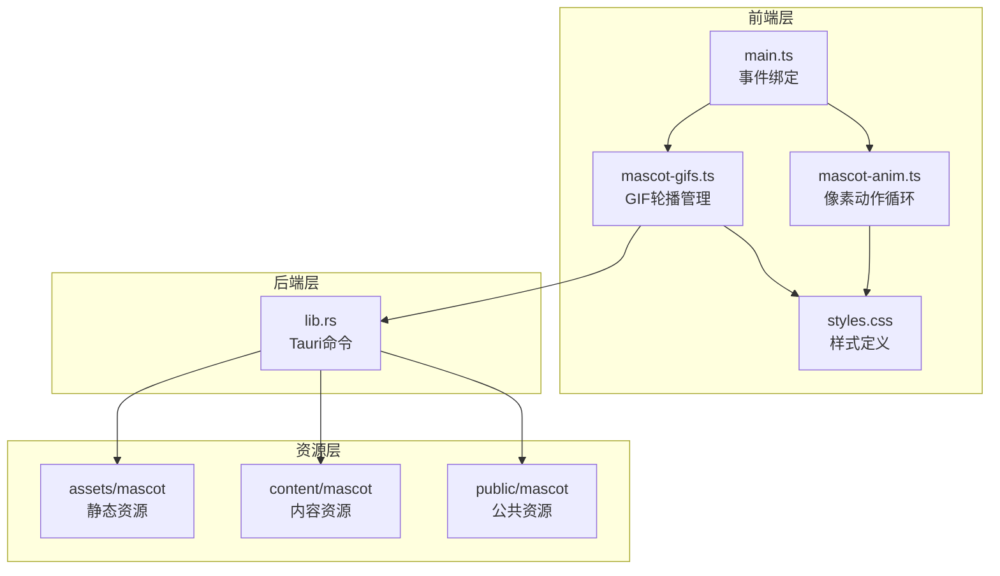
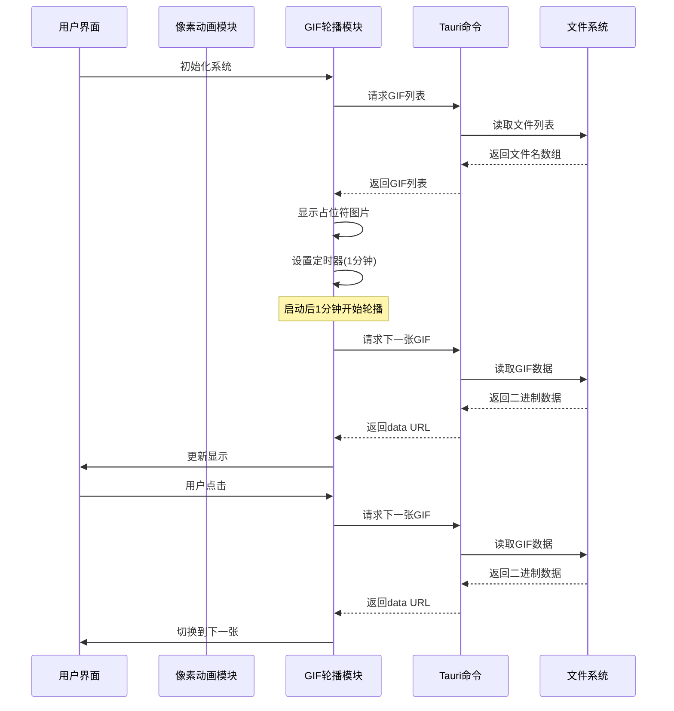
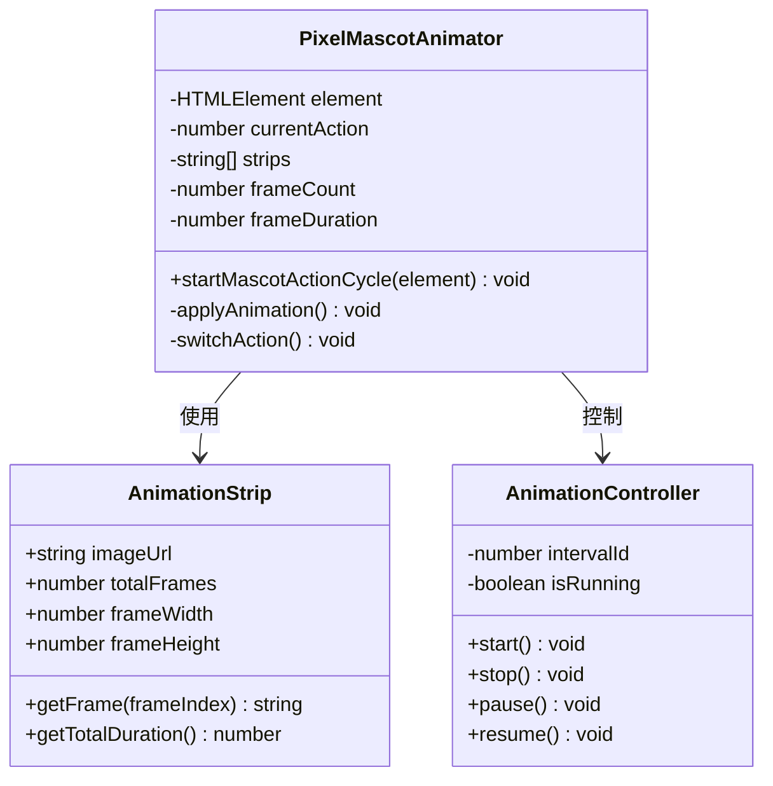
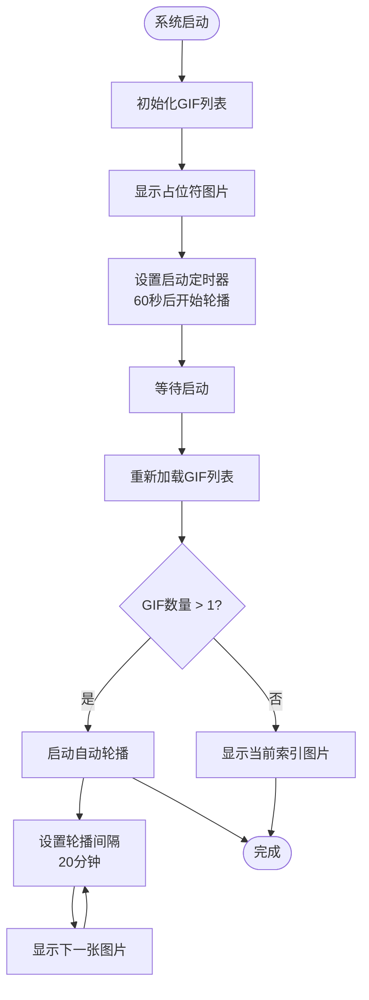
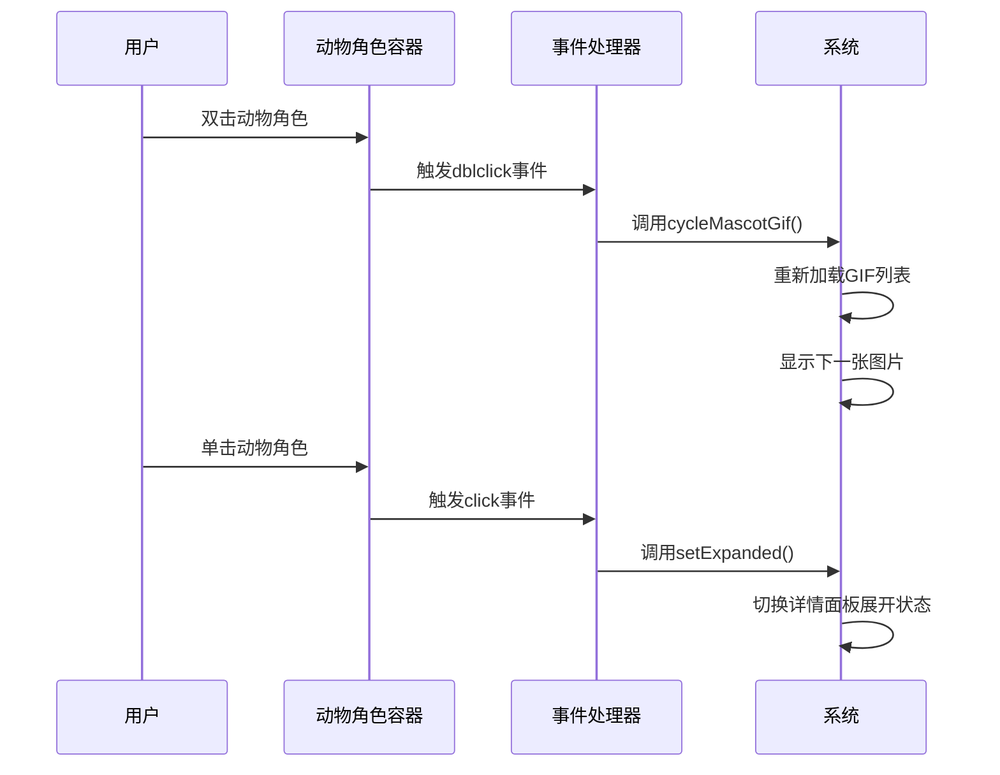
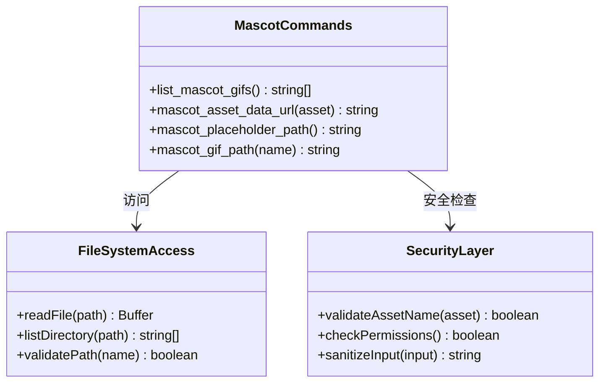
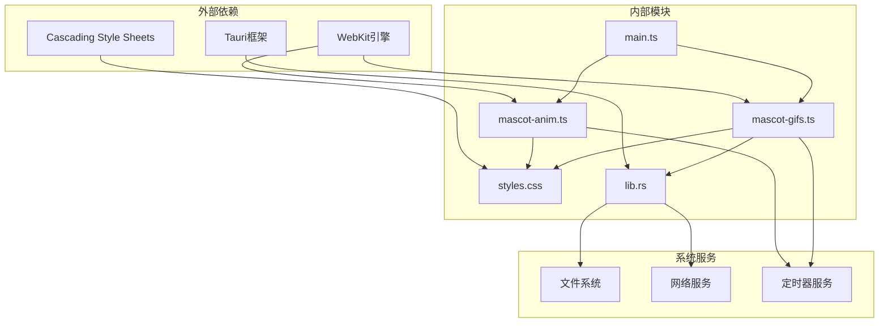

# 动物角色系统

<cite>
**本文档引用的文件**
- [mascot-anim.ts](file://apps/tauri/src/mascot-anim.ts)
- [mascot-gifs.ts](file://apps/tauri/src/mascot-gifs.ts)
- [lib.rs](file://apps/tauri/src-tauri/src/lib.rs)
- [styles.css](file://apps/tauri/src/styles.css)
- [main.ts](file://apps/tauri/src/main.ts)
- [README.txt](file://apps/tauri/public/mascot/gifs/README.txt)
- [manifest.json](file://content/manifest.json)
</cite>

## 目录
1. [简介](#简介)
2. [项目结构](#项目结构)
3. [核心组件](#核心组件)
4. [架构概览](#架构概览)
5. [详细组件分析](#详细组件分析)
6. [依赖关系分析](#依赖关系分析)
7. [性能考虑](#性能考虑)
8. [故障排除指南](#故障排除指南)
9. [结论](#结论)
10. [附录](#附录)

## 简介

CursorQ 的动物角色系统是一个集成了静态动画和动态 GIF 轮播的多媒体展示模块。该系统通过 Tauri 框架实现了跨平台的动物角色展示功能，包括像素风格的动作循环动画和丰富的 GIF 动画轮播。

系统主要由两个核心部分组成：
- **像素动作循环系统**：基于背景精灵图的循环动画，提供流畅的像素风格动画效果
- **GIF 轮播系统**：支持多种格式的动态图片轮播，具备智能缓存和错误处理机制

## 项目结构

动物角色系统在项目中的组织结构如下：

**图表来源**
- [mascot-anim.ts:1-29](file://apps/tauri/src/mascot-anim.ts#L1-L29)
- [mascot-gifs.ts:1-164](file://apps/tauri/src/mascot-gifs.ts#L1-L164)
- [lib.rs:90-120](file://apps/tauri/src-tauri/src/lib.rs#L90-L120)

**章节来源**
- [mascot-anim.ts:1-29](file://apps/tauri/src/mascot-anim.ts#L1-L29)
- [mascot-gifs.ts:1-164](file://apps/tauri/src/mascot-gifs.ts#L1-L164)
- [lib.rs:90-120](file://apps/tauri/src-tauri/src/lib.rs#L90-L120)

## 核心组件

### 像素动作循环系统

像素动作循环系统通过精灵图技术实现流畅的动画效果，具有以下特点：

- **三组动作序列**：每组包含6帧，每帧持续0.5秒
- **自动循环切换**：动作完成后自动切换到下一组
- **CSS 动画驱动**：使用步骤动画实现精确的帧控制
- **内存友好**：单个元素重复使用，避免频繁DOM操作

### GIF 轮播系统

GIF 轮播系统提供了完整的动态图片管理功能：

- **多格式支持**：支持 GIF、WebP、PNG 等格式
- **智能缓存**：首次加载后缓存到内存，提升后续访问速度
- **错误处理**：网络异常时自动降级到本地资源
- **定时轮播**：启动后延迟1分钟开始，每20分钟切换一次

**章节来源**
- [mascot-anim.ts:1-29](file://apps/tauri/src/mascot-anim.ts#L1-L29)
- [mascot-gifs.ts:1-164](file://apps/tauri/src/mascot-gifs.ts#L1-L164)

## 架构概览

动物角色系统的整体架构采用分层设计，确保了良好的可维护性和扩展性：

**图表来源**
- [mascot-gifs.ts:121-125](file://apps/tauri/src/mascot-gifs.ts#L121-L125)
- [lib.rs:90-120](file://apps/tauri/src-tauri/src/lib.rs#L90-L120)

## 详细组件分析

### 像素动作循环组件

像素动作循环组件通过精灵图实现流畅的动画效果，其核心实现原理如下：

**图表来源**
- [mascot-anim.ts:12-28](file://apps/tauri/src/mascot-anim.ts#L12-L28)

#### 动画播放机制

像素动作循环的播放机制采用了创新的CSS动画重置技术：

1. **动画重置策略**：通过设置 `animation: none` 触发动画重置
2. **强制重排**：使用 `offsetHeight` 强制浏览器重新计算布局
3. **重新应用动画**：在重置后重新应用CSS动画属性
4. **循环切换**：定时器触发动作组之间的切换

#### 配置参数详解

| 参数名称 | 值 | 说明 |
|---------|----|------|
| FRAMES | 6 | 每组动作的帧数 |
| FRAME_MS | 500 | 每帧持续时间（毫秒） |
| ACTION_MS | 3000 | 每组动作总时长 |
| STRIPS.length | 3 | 动作组数量 |

**章节来源**
- [mascot-anim.ts:1-29](file://apps/tauri/src/mascot-anim.ts#L1-L29)

### GIF 轮播组件

GIF 轮播组件提供了完整的动态图片管理功能，其核心架构如下：

**图表来源**
- [mascot-gifs.ts:101-111](file://apps/tauri/src/mascot-gifs.ts#L101-L111)

#### 资源加载优化策略

GIF 轮播系统采用了多层次的资源加载优化策略：

1. **延迟加载**：启动后60秒才开始轮播，减少初始加载压力
2. **智能缓存**：Tauri 命令层将文件内容转换为 base64 数据URL
3. **错误降级**：网络异常时自动回退到本地静态资源
4. **预加载机制**：提前加载下一张图片，提升用户体验

#### 内存管理策略

系统实现了完善的内存管理机制：

- **定时器清理**：轮播停止时自动清理所有定时器
- **资源释放**：组件销毁时释放所有事件监听器
- **缓存控制**：合理控制缓存大小，避免内存泄漏
- **垃圾回收**：及时清理不再使用的图片对象

**章节来源**
- [mascot-gifs.ts:1-164](file://apps/tauri/src/mascot-gifs.ts#L1-L164)

### 交互响应组件

用户交互响应系统提供了完整的事件处理机制：

**图表来源**
- [main.ts:625-636](file://apps/tauri/src/main.ts#L625-L636)

#### 事件处理机制

系统采用了防抖和节流相结合的事件处理策略：

- **双击检测**：防止双击事件被误判为普通点击
- **拖拽抑制**：拖拽过程中忽略点击事件
- **时间窗口**：设置事件处理的时间窗口，避免重复触发
- **状态同步**：确保事件处理与应用状态保持一致

**章节来源**
- [main.ts:625-636](file://apps/tauri/src/main.ts#L625-L636)

### Tauri 命令接口

Tauri 命令接口提供了安全的资源访问机制：

**图表来源**
- [lib.rs:90-120](file://apps/tauri/src-tauri/src/lib.rs#L90-L120)

#### 资源访问安全机制

Tauri 命令接口实现了严格的安全控制：

- **路径验证**：防止路径遍历攻击
- **文件类型检查**：限制可访问的文件类型
- **权限控制**：仅允许访问指定的资源目录
- **输入净化**：对用户输入进行严格验证

**章节来源**
- [lib.rs:90-120](file://apps/tauri/src-tauri/src/lib.rs#L90-L120)

## 依赖关系分析

动物角色系统的依赖关系体现了清晰的分层架构：

**图表来源**
- [mascot-anim.ts:1-29](file://apps/tauri/src/mascot-anim.ts#L1-L29)
- [mascot-gifs.ts:1-164](file://apps/tauri/src/mascot-gifs.ts#L1-L164)
- [lib.rs:90-120](file://apps/tauri/src-tauri/src/lib.rs#L90-L120)

### 模块耦合度分析

系统采用了低耦合的设计原则：

- **前端模块独立**：mascot-anim.ts 和 mascot-gifs.ts 相互独立
- **样式模块解耦**：样式定义与业务逻辑分离
- **后端接口抽象**：Tauri 命令提供统一的接口层
- **资源管理分离**：不同类型的资源有不同的管理策略

**章节来源**
- [mascot-anim.ts:1-29](file://apps/tauri/src/mascot-anim.ts#L1-L29)
- [mascot-gifs.ts:1-164](file://apps/tauri/src/mascot-gifs.ts#L1-L164)

## 性能考虑

### 动画性能优化

动物角色系统在性能方面采用了多项优化策略：

#### 像素动画优化

- **硬件加速**：利用 CSS transforms 实现 GPU 加速
- **最小重绘**：通过 animation 和 transform 属性减少重绘
- **内存复用**：单个元素重复使用，避免频繁 DOM 创建
- **帧率控制**：精确的帧率控制，避免过度消耗 CPU

#### GIF 轮播优化

- **懒加载策略**：延迟到需要时才加载资源
- **缓存机制**：将已加载的资源缓存在内存中
- **批量处理**：避免同时处理多个大文件
- **资源压缩**：支持多种图片格式以平衡质量与体积

### 内存管理策略

系统实现了全面的内存管理机制：

- **定时器清理**：组件销毁时自动清理所有定时器
- **事件监听器移除**：防止内存泄漏
- **图片对象管理**：及时释放不再使用的图片资源
- **缓存容量控制**：限制缓存大小，避免内存溢出

### 跨平台兼容性

系统在不同平台上的兼容性考虑：

- **WebKit 兼容性**：针对不同版本的 WebKit 进行适配
- **CSS 动画支持**：提供降级方案以支持旧版浏览器
- **触摸事件处理**：支持移动端的触摸交互
- **高 DPI 支持**：适配不同分辨率的显示设备

## 故障排除指南

### 常见问题及解决方案

#### 动画不播放问题

**问题描述**：像素动画无法正常播放

**可能原因**：
- CSS 动画被全局禁用
- 精灵图路径错误
- 浏览器兼容性问题

**解决方法**：
1. 检查全局 CSS 中的动画禁用规则
2. 验证精灵图的 URL 路径
3. 测试不同浏览器的兼容性

#### GIF 轮播异常

**问题描述**：GIF 图片无法正确显示或轮播

**可能原因**：
- 文件路径配置错误
- 网络连接问题
- 文件格式不支持

**解决方法**：
1. 检查 GIF 文件的存储路径
2. 验证网络连接状态
3. 确认文件格式的兼容性

#### 性能问题

**问题描述**：系统运行缓慢或卡顿

**可能原因**：
- 内存泄漏
- 过多的定时器
- 大量的 DOM 操作

**解决方法**：
1. 检查定时器的清理情况
2. 优化 DOM 操作频率
3. 监控内存使用情况

**章节来源**
- [mascot-anim.ts:12-28](file://apps/tauri/src/mascot-anim.ts#L12-L28)
- [mascot-gifs.ts:26-40](file://apps/tauri/src/mascot-gifs.ts#L26-L40)

## 结论

CursorQ 的动物角色系统通过精心设计的架构实现了高性能、高可用的多媒体展示功能。系统采用了多种优化策略，包括像素动画的硬件加速、GIF 轮播的智能缓存、完善的内存管理和跨平台兼容性考虑。

该系统的主要优势在于：

1. **模块化设计**：清晰的模块划分便于维护和扩展
2. **性能优化**：多项性能优化技术确保流畅的用户体验
3. **安全性**：严格的资源访问控制防止安全漏洞
4. **可扩展性**：灵活的架构支持新功能的添加

未来可以考虑的改进方向包括：

- 增加更多的动画效果和主题
- 优化移动端的交互体验
- 扩展对更多图片格式的支持
- 增强离线模式的功能

## 附录

### 配置指南

#### 添加新的动物角色

1. **准备资源文件**：将新的 GIF 或 PNG 文件放入 `content/mascot/gifs/` 目录
2. **命名规范**：建议使用数字前缀如 `01-角色名.gif`
3. **格式要求**：支持 GIF、WebP、PNG 格式
4. **尺寸建议**：推荐 34x34 像素的正方形图片

#### 自定义动画效果

1. **创建精灵图**：制作包含多帧的精灵图文件
2. **配置参数**：修改 `mascot-anim.ts` 中的帧数和时长参数
3. **更新样式**：调整 CSS 动画相关的样式定义
4. **测试验证**：确保动画效果符合预期

#### 调试工具

系统提供了多种调试工具：

- **开发者工具**：利用浏览器的开发者工具监控性能
- **日志输出**：通过控制台输出详细的运行信息
- **状态监控**：实时监控系统状态和资源使用情况
- **错误报告**：收集和分析系统错误信息

**章节来源**
- [README.txt:1-10](file://apps/tauri/public/mascot/gifs/README.txt#L1-L10)
- [manifest.json:1-11](file://content/manifest.json#L1-L11)