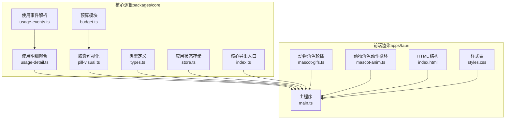
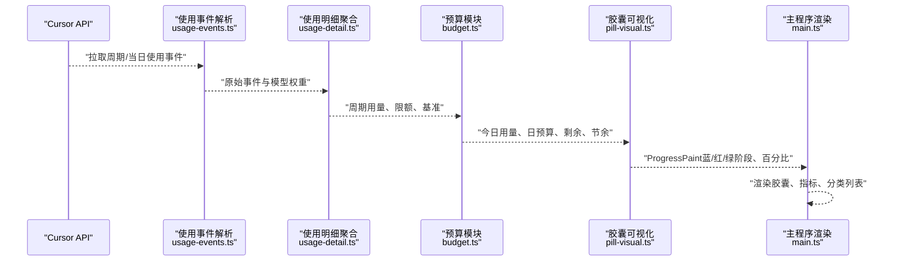
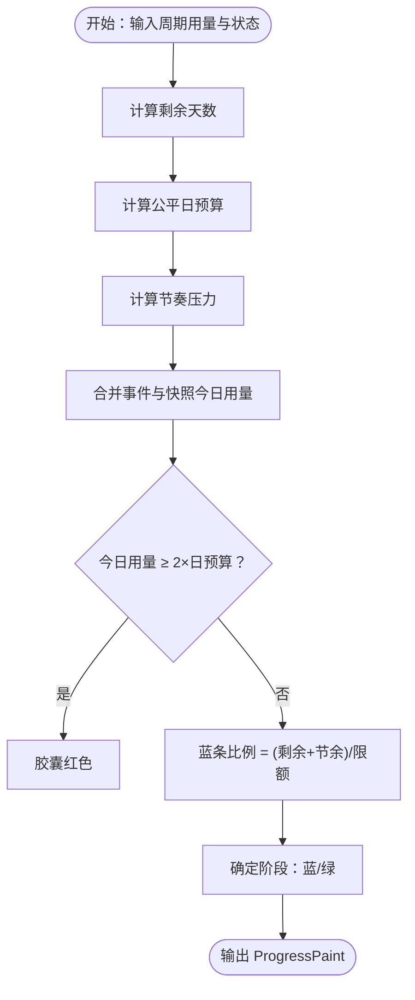
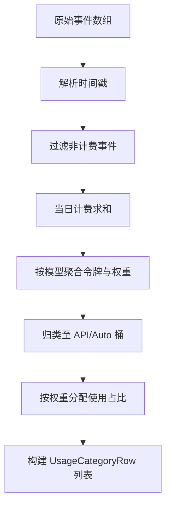
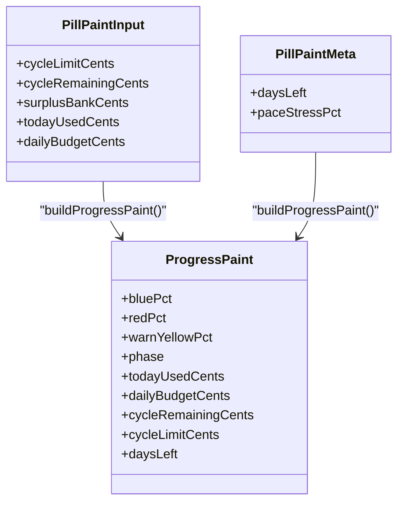
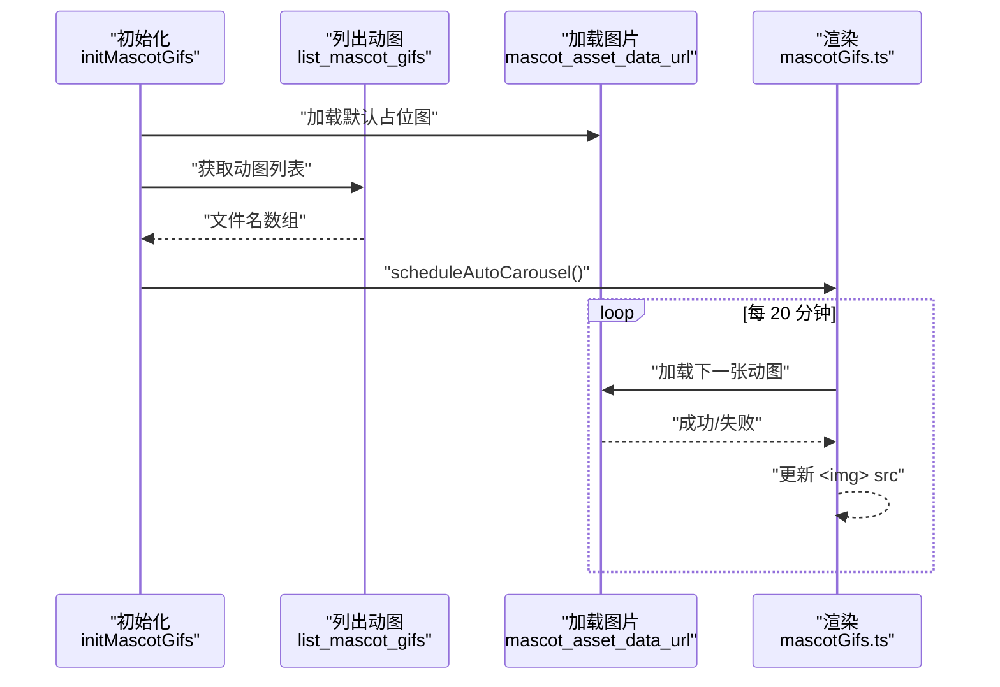
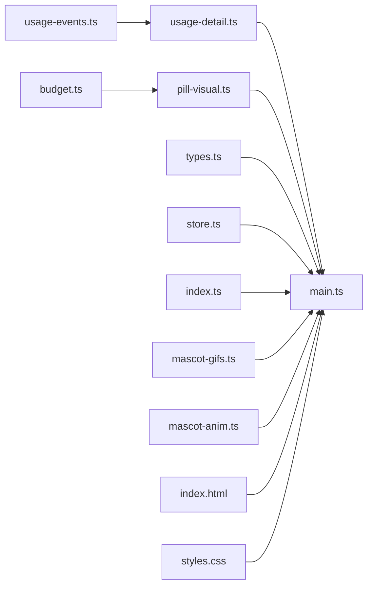

# 核心功能

<cite>
**本文引用的文件**
- [预算模块](file://packages/core/src/budget.ts)
- [使用事件解析](file://packages/core/src/usage-events.ts)
- [胶囊可视化](file://packages/core/src/pill-visual.ts)
- [使用明细聚合](file://packages/core/src/usage-detail.ts)
- [类型定义](file://packages/core/src/types.ts)
- [应用状态存储](file://packages/core/src/store.ts)
- [核心导出入口](file://packages/core/src/index.ts)
- [主程序（前端渲染）](file://apps/tauri/src/main.ts)
- [样式表](file://apps/tauri/src/styles.css)
- [动物角色轮播](file://apps/tauri/src/mascot-gifs.ts)
- [动物角色动作循环](file://apps/tauri/src/mascot-anim.ts)
- [HTML 结构](file://apps/tauri/index.html)
</cite>

## 目录
1. [简介](#简介)
2. [项目结构](#项目结构)
3. [核心组件](#核心组件)
4. [架构总览](#架构总览)
5. [详细组件分析](#详细组件分析)
6. [依赖关系分析](#依赖关系分析)
7. [性能考量](#性能考量)
8. [故障排查指南](#故障排查指南)
9. [结论](#结论)
10. [附录](#附录)

## 简介
本文件面向 CursorQ 的核心功能模块，围绕以下主题进行系统化说明：
- 预算管理系统：日预算计算、周期预算跟踪、超支预警与“节奏压力”指标
- 使用统计模块：使用事件解析、统计数据聚合、进度计算逻辑
- 胶囊界面组件：进度条可视化、状态指示器、交互设计
- 动物角色系统：动画资源管理、轮播控制、用户交互

文档将从实现原理、API 接口、配置选项与使用模式出发，结合代码级图示与实际应用场景，帮助开发者理解模块间的协作关系。

## 项目结构
CursorQ 的核心逻辑集中在 packages/core 中，前端渲染与 UI 交互位于 apps/tauri。核心数据流是：从 Cursor API 获取使用事件 → 解析与聚合 → 计算预算与进度 → 构建 UI 数据结构 → 前端渲染与交互。

图表来源
- [预算模块:1-274](file://packages/core/src/budget.ts#L1-L274)
- [使用事件解析:1-291](file://packages/core/src/usage-events.ts#L1-L291)
- [胶囊可视化:1-79](file://packages/core/src/pill-visual.ts#L1-L79)
- [使用明细聚合:1-185](file://packages/core/src/usage-detail.ts#L1-L185)
- [类型定义:1-140](file://packages/core/src/types.ts#L1-L140)
- [应用状态存储:1-55](file://packages/core/src/store.ts#L1-L55)
- [核心导出入口:1-35](file://packages/core/src/index.ts#L1-L35)
- [主程序（前端渲染）:1-711](file://apps/tauri/src/main.ts#L1-L711)
- [样式表:1-585](file://apps/tauri/src/styles.css#L1-L585)
- [动物角色轮播:1-164](file://apps/tauri/src/mascot-gifs.ts#L1-L164)
- [动物角色动作循环:1-29](file://apps/tauri/src/mascot-anim.ts#L1-L29)
- [HTML 结构:1-46](file://apps/tauri/index.html#L1-L46)

章节来源
- [预算模块:1-274](file://packages/core/src/budget.ts#L1-L274)
- [使用事件解析:1-291](file://packages/core/src/usage-events.ts#L1-L291)
- [胶囊可视化:1-79](file://packages/core/src/pill-visual.ts#L1-L79)
- [使用明细聚合:1-185](file://packages/core/src/usage-detail.ts#L1-L185)
- [类型定义:1-140](file://packages/core/src/types.ts#L1-L140)
- [应用状态存储:1-55](file://packages/core/src/store.ts#L1-L55)
- [核心导出入口:1-35](file://packages/core/src/index.ts#L1-L35)
- [主程序（前端渲染）:1-711](file://apps/tauri/src/main.ts#L1-L711)
- [样式表:1-585](file://apps/tauri/src/styles.css#L1-L585)
- [动物角色轮播:1-164](file://apps/tauri/src/mascot-gifs.ts#L1-L164)
- [动物角色动作循环:1-29](file://apps/tauri/src/mascot-anim.ts#L1-L29)
- [HTML 结构:1-46](file://apps/tauri/index.html#L1-L46)

## 核心组件
- 预算管理：提供日预算、周期剩余天数、公平日预算、节奏压力等指标，并据此生成胶囊配色与状态
- 使用统计：解析 Cursor 使用事件，按模型与类别聚合，支持 API/自动两类模型的权重分配
- 胶囊界面：将预算与进度转化为渐变色条与阶段状态，配合 UI 主题色
- 动物角色：提供默认占位图与动图轮播，支持启动延迟、间隔轮播与 Tauri 原生资源调用

章节来源
- [预算模块:1-274](file://packages/core/src/budget.ts#L1-L274)
- [使用事件解析:1-291](file://packages/core/src/usage-events.ts#L1-L291)
- [胶囊可视化:1-79](file://packages/core/src/pill-visual.ts#L1-L79)
- [使用明细聚合:1-185](file://packages/core/src/usage-detail.ts#L1-L185)
- [动物角色轮播:1-164](file://apps/tauri/src/mascot-gifs.ts#L1-L164)
- [动物角色动作循环:1-29](file://apps/tauri/src/mascot-anim.ts#L1-L29)

## 架构总览
下图展示了从数据采集到 UI 渲染的关键流程，以及各模块间的数据传递与职责边界。

图表来源
- [使用事件解析:117-186](file://packages/core/src/usage-events.ts#L117-L186)
- [使用明细聚合:104-185](file://packages/core/src/usage-detail.ts#L104-L185)
- [预算模块:243-272](file://packages/core/src/budget.ts#L243-L272)
- [胶囊可视化:29-63](file://packages/core/src/pill-visual.ts#L29-L63)
- [主程序（前端渲染）:526-560](file://apps/tauri/src/main.ts#L526-L560)

## 详细组件分析

### 预算管理系统
- 日预算计算：基于剩余预算与剩余天数，确保每日可用额度不低于 1 美分
- 公平日预算：按周期总天数均匀分配，用于衡量“节奏压力”
- 节奏压力（paceStressPct）：比较“剩余预算按剩余天数摊”的日均与“公平日预算”，用于面板参考，不直接驱动胶囊红色
- 今日超额判断：当今日用量 ≥ 2 × 日预算时，胶囊进入红色阶段
- 快照与跨日结算：维护每日快照（baseline/daily），支持周末“结余银行”机制，限制最高节余上限
- 修复异常快照：若事件汇总异常偏高，回退到快照值，避免整周期误计

图表来源
- [预算模块:51-93](file://packages/core/src/budget.ts#L51-L93)
- [预算模块:243-272](file://packages/core/src/budget.ts#L243-L272)
- [胶囊可视化:29-63](file://packages/core/src/pill-visual.ts#L29-L63)

章节来源
- [预算模块:1-274](file://packages/core/src/budget.ts#L1-L274)
- [类型定义:99-124](file://packages/core/src/types.ts#L99-L124)

### 使用统计模块
- 事件解析：支持多种计费字段与令牌用量，统一解析时间戳，过滤非计费事件
- 当日汇总：按本地日历日聚合今日计费，与 Dashboard 行为保持一致
- 类别聚合：将模型归入 API 或 Auto/Composer 两大类，按权重分配使用占比
- 自动桶模型识别：兼容 auto/composer/default 等命名规则
- 模型名称清洗：剔除空串、default、auto、unknown 等无效项

图表来源
- [使用事件解析:58-79](file://packages/core/src/usage-events.ts#L58-L79)
- [使用事件解析:192-290](file://packages/core/src/usage-events.ts#L192-L290)

章节来源
- [使用事件解析:1-291](file://packages/core/src/usage-events.ts#L1-L291)
- [类型定义:39-55](file://packages/core/src/types.ts#L39-L55)

### 胶囊界面组件
- 配色策略：蓝条代表“剩余+节余”占限额的比例；当今日用量 ≥ 2×日预算时转红；否则根据剩余维持蓝或绿
- 进度绘制：将输入参数转换为 ProgressPaint，包含蓝/红/黄三段比例、阶段、今日用量、日预算、剩余等
- UI 渲染：前端通过 buildPillBarGradient 生成渐变，设置胶囊背景色与数据属性，配合样式表实现圆角与主题色

图表来源
- [胶囊可视化:15-63](file://packages/core/src/pill-visual.ts#L15-L63)
- [类型定义:112-124](file://packages/core/src/types.ts#L112-L124)

章节来源
- [胶囊可视化:1-79](file://packages/core/src/pill-visual.ts#L1-L79)
- [主程序（前端渲染）:174-188](file://apps/tauri/src/main.ts#L174-L188)
- [样式表:95-104](file://apps/tauri/src/styles.css#L95-L104)

### 动物角色系统
- 轮播控制：启动后延迟 1 分钟开始轮播，每 20 分钟切换一张动图；支持 Tauri 原生资源与开发环境回退
- 资源加载：优先通过 invoke("list_mascot_gifs") 与 invoke("mascot_asset_data_url") 获取；失败时回退到静态路径
- 动作循环：3 组动作 × 6 帧，每帧 0.5 秒，循环播放；双击可手动切换当前动图

图表来源
- [动物角色轮播:121-164](file://apps/tauri/src/mascot-gifs.ts#L121-L164)
- [动物角色动作循环:12-28](file://apps/tauri/src/mascot-anim.ts#L12-L28)

章节来源
- [动物角色轮播:1-164](file://apps/tauri/src/mascot-gifs.ts#L1-L164)
- [动物角色动作循环:1-29](file://apps/tauri/src/mascot-anim.ts#L1-L29)
- [HTML 结构:14-24](file://apps/tauri/index.html#L14-L24)

## 依赖关系分析
- 使用明细聚合依赖使用事件解析与预算模块提供的周期信息
- 胶囊可视化依赖预算模块计算出的今日用量与日预算
- 前端主程序依赖核心导出的类型与工具函数，负责事件绑定与 UI 更新
- 动物角色系统与前端渲染解耦，通过 Tauri 暴露命令与事件通信

图表来源
- [核心导出入口:1-35](file://packages/core/src/index.ts#L1-L35)
- [主程序（前端渲染）:1-711](file://apps/tauri/src/main.ts#L1-L711)
- [动物角色轮播:1-164](file://apps/tauri/src/mascot-gifs.ts#L1-L164)
- [动物角色动作循环:1-29](file://apps/tauri/src/mascot-anim.ts#L1-L29)
- [HTML 结构:1-46](file://apps/tauri/index.html#L1-L46)
- [样式表:1-585](file://apps/tauri/src/styles.css#L1-L585)

章节来源
- [核心导出入口:1-35](file://packages/core/src/index.ts#L1-L35)
- [主程序（前端渲染）:1-711](file://apps/tauri/src/main.ts#L1-L711)

## 性能考量
- 事件拉取分页与上限：周期事件最多拉取 20 页，当日事件最多 32 页，避免一次性请求过大
- 本地聚合与缓存：使用 Map 聚合模型，减少重复遍历；快照与状态持久化于本地 JSON 文件
- UI 渲染优化：禁用 CSS 动画与过渡，避免 WebView 重绘白边；窗口尺寸按内容动态计算，避免滚动动画引发的视觉问题
- 胶囊配色：仅依赖简单数学运算与阈值判断，计算开销极低

章节来源
- [使用事件解析:117-186](file://packages/core/src/usage-events.ts#L117-L186)
- [应用状态存储:1-55](file://packages/core/src/store.ts#L1-L55)
- [样式表:18-24](file://apps/tauri/src/styles.css#L18-L24)
- [主程序（前端渲染）:463-488](file://apps/tauri/src/main.ts#L463-L488)

## 故障排查指南
- 登录状态异常：前端收到“未登录”错误时，提示用户登录 Cursor
- 动图加载失败：回退到开发环境静态路径；若仍失败，显示默认占位图
- 节余银行异常：检查跨日结算逻辑与周末豁免条件，确认 lastSettleDate 与 snapshots
- 今日用量异常偏高：启用修复逻辑，回退到快照值，避免整周期误计
- 调试模式：点击提示文字三次可开启调试模式，通过滑条模拟不同场景

章节来源
- [主程序（前端渲染）:526-560](file://apps/tauri/src/main.ts#L526-L560)
- [动物角色轮播:51-84](file://apps/tauri/src/mascot-gifs.ts#L51-L84)
- [预算模块:65-93](file://packages/core/src/budget.ts#L65-L93)
- [预算模块:194-207](file://packages/core/src/budget.ts#L194-L207)
- [主程序（前端渲染）:653-671](file://apps/tauri/src/main.ts#L653-L671)

## 结论
本模块以“事件解析 → 明细聚合 → 预算计算 → 可视化渲染”为主线，形成闭环的数据处理链路。预算系统兼顾公平性与实时性，使用统计模块提供多维度的模型洞察，胶囊界面简洁直观地传达关键指标，动物角色系统则增强了产品的亲和力与可玩性。通过合理的分层与解耦，整体具备良好的扩展性与可维护性。

## 附录
- 关键 API 与接口
  - 预算模块
    - computeDailyBudgetCents：基于剩余预算与周期结束时间计算日预算
    - pacingStressPct：计算节奏压力（0–1）
    - computeProgress：综合输入生成 ProgressPaint
    - settleYesterdayBank/syncTodayBaseline/ensureTodaySnapshot：快照与跨日结算
  - 使用事件解析
    - fetchUsageEventsInCycle/fetchUsageEventsForDay：按周期/当日拉取事件
    - sumTodayChargedCents：当日计费汇总
    - buildCategoriesFromEvents：按模型与类别聚合
  - 胶囊可视化
    - buildProgressPaint：生成进度与配色
    - todayRatioPercent/todayBarWidthPct：辅助调试与面板条宽
  - 动物角色
    - initMascotGifs/reloadMascotGifsAfterContentUpdate/cycleMascotGif：轮播控制
    - startMascotActionCycle：动作循环

章节来源
- [预算模块:51-272](file://packages/core/src/budget.ts#L51-L272)
- [使用事件解析:117-290](file://packages/core/src/usage-events.ts#L117-L290)
- [胶囊可视化:29-79](file://packages/core/src/pill-visual.ts#L29-L79)
- [动物角色轮播:121-164](file://apps/tauri/src/mascot-gifs.ts#L121-L164)
- [动物角色动作循环:12-28](file://apps/tauri/src/mascot-anim.ts#L12-L28)