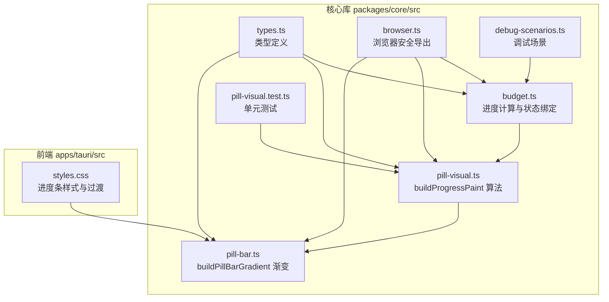
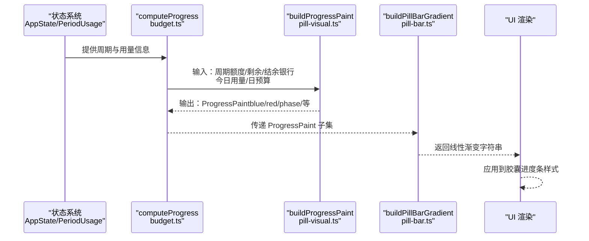
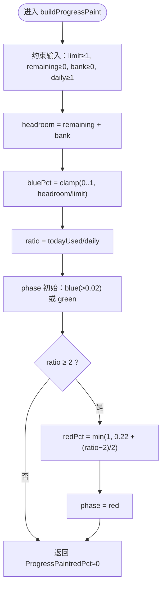
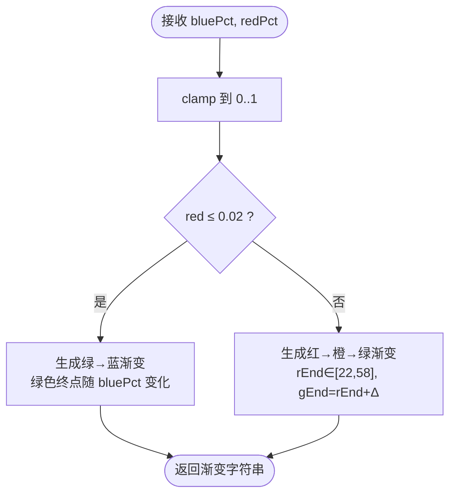
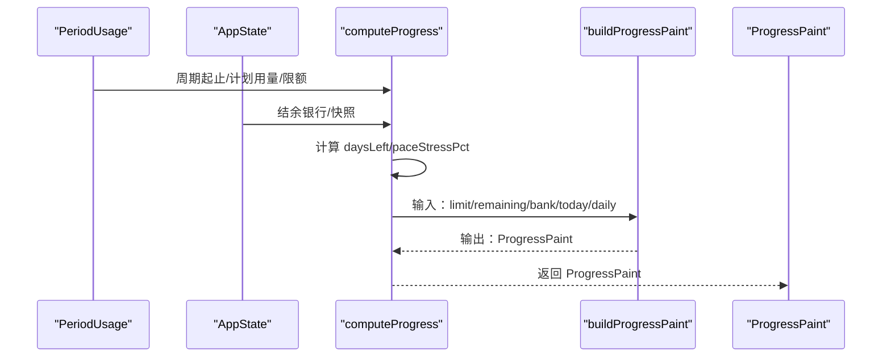
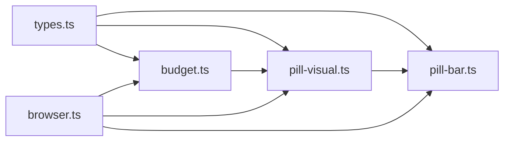

# 进度可视化组件

<cite>
**本文引用的文件**
- [pill-visual.ts](file://packages/core/src/pill-visual.ts)
- [pill-bar.ts](file://packages/core/src/pill-bar.ts)
- [budget.ts](file://packages/core/src/budget.ts)
- [types.ts](file://packages/core/src/types.ts)
- [pill-visual.test.ts](file://packages/core/src/pill-visual.test.ts)
- [debug-scenarios.ts](file://packages/core/src/debug-scenarios.ts)
- [browser.ts](file://packages/core/src/browser.ts)
- [styles.css](file://apps/tauri/src/styles.css)
</cite>

## 目录
1. [简介](#简介)
2. [项目结构](#项目结构)
3. [核心组件](#核心组件)
4. [架构总览](#架构总览)
5. [详细组件分析](#详细组件分析)
6. [依赖关系分析](#依赖关系分析)
7. [性能考虑](#性能考虑)
8. [故障排查指南](#故障排查指南)
9. [结论](#结论)
10. [附录](#附录)

## 简介
本文件聚焦 CursorQ 的进度可视化组件，系统性阐述胶囊进度条的视觉渲染算法（buildProgressPaint）、颜色渐变逻辑、进度指示器设计与状态反馈机制。文档覆盖以下关键点：
- ProgressPaint 数据结构与字段语义
- 蓝色进度（额度剩余）与红色警示（今日超支）的计算公式
- 渐变色生成函数 buildPillBarGradient 的色彩映射规则
- 动画与过渡策略建议（基于现有样式）
- 响应式布局适配思路
- 与状态管理系统（AppState、PeriodUsage）的数据绑定方式
- 性能优化策略与边界条件处理

## 项目结构
进度可视化相关代码位于 packages/core/src 目录，前端样式位于 apps/tauri/src/styles.css。核心模块包括：
- 进度计算与状态绑定：budget.ts、types.ts
- 胶囊进度条渲染：pill-visual.ts、pill-bar.ts
- 浏览器侧导出与调试场景：browser.ts、debug-scenarios.ts
- 单元测试：pill-visual.test.ts

图表来源
- [types.ts:112-124](file://packages/core/src/types.ts#L112-L124)
- [budget.ts:243-272](file://packages/core/src/budget.ts#L243-L272)
- [pill-visual.ts:29-63](file://packages/core/src/pill-visual.ts#L29-L63)
- [pill-bar.ts:8-22](file://packages/core/src/pill-bar.ts#L8-L22)
- [browser.ts:1-20](file://packages/core/src/browser.ts#L1-L20)
- [debug-scenarios.ts:77-86](file://packages/core/src/debug-scenarios.ts#L77-L86)
- [pill-visual.test.ts:1-63](file://packages/core/src/pill-visual.test.ts#L1-L63)
- [styles.css:267-318](file://apps/tauri/src/styles.css#L267-L318)

章节来源
- [types.ts:112-124](file://packages/core/src/types.ts#L112-L124)
- [budget.ts:243-272](file://packages/core/src/budget.ts#L243-L272)
- [pill-visual.ts:29-63](file://packages/core/src/pill-visual.ts#L29-L63)
- [pill-bar.ts:8-22](file://packages/core/src/pill-bar.ts#L8-L22)
- [browser.ts:1-20](file://packages/core/src/browser.ts#L1-L20)
- [debug-scenarios.ts:77-86](file://packages/core/src/debug-scenarios.ts#L77-L86)
- [pill-visual.test.ts:1-63](file://packages/core/src/pill-visual.test.ts#L1-L63)
- [styles.css:267-318](file://apps/tauri/src/styles.css#L267-L318)

## 核心组件
- ProgressPaint：封装胶囊进度条所需的所有视觉参数，包括蓝色/红色占比、阶段（phase）、今日用量、日预算、周期剩余与限制、剩余天数以及节奏紧迫度（仅面板参考）。
- buildProgressPaint：将周期与当日预算状态转换为 ProgressPaint，决定胶囊颜色与占比。
- buildPillBarGradient：将 ProgressPaint 中的 bluePct、redPct 映射为线性渐变字符串，生成绿色到蓝色再到红色的渐变。
- computeProgress：结合 PeriodUsage 与 AppState，调用 buildProgressPaint 产出最终的 ProgressPaint。

章节来源
- [types.ts:112-124](file://packages/core/src/types.ts#L112-L124)
- [pill-visual.ts:29-63](file://packages/core/src/pill-visual.ts#L29-L63)
- [pill-bar.ts:8-22](file://packages/core/src/pill-bar.ts#L8-L22)
- [budget.ts:243-272](file://packages/core/src/budget.ts#L243-L272)

## 架构总览
下图展示了从状态到视觉渲染的整体流程：PeriodUsage 与 AppState 经过 computeProgress 生成 ProgressPaint，再由 buildPillBarGradient 生成 CSS 渐变字符串，最终应用到胶囊进度条。

图表来源
- [budget.ts:243-272](file://packages/core/src/budget.ts#L243-L272)
- [pill-visual.ts:29-63](file://packages/core/src/pill-visual.ts#L29-L63)
- [pill-bar.ts:8-22](file://packages/core/src/pill-bar.ts#L8-L22)

## 详细组件分析

### ProgressPaint 数据结构与字段语义
ProgressPaint 是胶囊进度条的“唯一真相源”，包含：
- bluePct：蓝色占比，反映额度剩余（headroom/limit），越大越蓝
- redPct：红色占比，仅当今日用量 ≥ 2×日预算时启用，越大越红
- warnYellowPct：预留黄色警示占比（当前实现中恒为 0）
- paceStressPct：周期节奏紧迫度（0–1），仅面板参考，不影响胶囊颜色
- phase：胶囊阶段，green/blue/red 三态
- todayUsedCents、dailyBudgetCents、cycleRemainingCents、cycleLimitCents：原始输入的派生值，便于 UI 使用
- daysLeft：剩余天数

章节来源
- [types.ts:112-124](file://packages/core/src/types.ts#L112-L124)

### buildProgressPaint 视觉渲染算法
算法要点：
- 计算蓝色占比 bluePct = min(1, max(0, (剩余+结余)/额度))
- 计算今日比率 ratio = 今日用量/日预算
- 初始阶段 phase 默认为 blue（若 bluePct>0.02）或 green（否则）
- 当 ratio ≥ 2 时，phase 切换为 red，并计算 redPct = min(1, 0.22 + (ratio−2)/2)，使红色随超支程度线性增强
- 返回包含所有字段的 ProgressPaint

图表来源
- [pill-visual.ts:29-63](file://packages/core/src/pill-visual.ts#L29-L63)

章节来源
- [pill-visual.ts:29-63](file://packages/core/src/pill-visual.ts#L29-L63)

### 颜色渐变逻辑与指示器设计
- 无红色时（redPct≤0.02）：生成从绿色到蓝色再到深蓝的渐变，绿色终点位置随 bluePct 线性变化，确保“剩余越多越绿”的直观反馈
- 出现红色时（redPct>0.02）：生成从红棕色到橙色再到绿色的渐变，红色端点 rEnd 在 22–58 区间内随 redPct 线性映射，绿色端点 gEnd 与 rEnd 保持一定差值，形成“警告→危险→缓解”的视觉过渡
- 警示黄（warnYellowPct）：当前恒为 0，保留扩展接口

图表来源
- [pill-bar.ts:8-22](file://packages/core/src/pill-bar.ts#L8-L22)

章节来源
- [pill-bar.ts:8-22](file://packages/core/src/pill-bar.ts#L8-L22)

### 状态反馈机制与数据绑定
- computeProgress 将 PeriodUsage（周期起止、计划用量、限额）与 AppState（结余银行、快照）整合，计算 daysLeft 与 paceStressPct，并调用 buildProgressPaint 产出 ProgressPaint
- 该模式确保 UI 仅消费 ProgressPaint，无需直接访问底层状态，降低耦合
- 调试场景 debug-scenarios 提供固定时间点与典型配置，便于验证算法与 UI 行为一致性

图表来源
- [budget.ts:243-272](file://packages/core/src/budget.ts#L243-L272)
- [pill-visual.ts:29-63](file://packages/core/src/pill-visual.ts#L29-L63)

章节来源
- [budget.ts:243-272](file://packages/core/src/budget.ts#L243-L272)
- [debug-scenarios.ts:77-86](file://packages/core/src/debug-scenarios.ts#L77-L86)

### 动画效果与过渡策略
- 样式层采用 transition: none，避免不必要的动画开销
- 若需添加过渡，可在 UI 层对 width 或 transform 添加过渡，但需注意与渐变字符串切换的时机协调
- 由于渐变字符串是纯 CSS 属性，建议通过类名切换或 CSS 变量驱动，减少频繁重排

章节来源
- [styles.css:277](file://apps/tauri/src/styles.css#L277)

### 响应式布局适配
- 进度条容器高度与圆角在样式中定义，可通过媒体查询或 CSS 自适应单位（rem/vw）进行适配
- 滑块与标签在调试界面中使用相对定位与绝对定位实现覆盖控件，适配小屏时可调整字体大小与间距

章节来源
- [styles.css:267-318](file://apps/tauri/src/styles.css#L267-L318)

### 具体用例与最佳实践
- 根据预算状态生成视觉效果
  - 额度剩余充足：bluePct 接近 1，phase 为 blue，渐变为绿→蓝
  - 今日用量达到日预算：bluePct 仍高，phase 仍为 blue，redPct≈0
  - 今日用量超过 2×日预算：phase 切换为 red，redPct 随比例线性增强
- 处理不同预算级别
  - 使用 fairDailyCents 与 pacingStressPct 评估周期节奏，仅影响面板参考，不改变胶囊颜色
- 实现平滑进度动画
  - 建议在 UI 层对 width 或 transform 添加过渡，避免在 JS 层重复计算渐变
- 响应用户交互
  - 调试滑条 mockFromSliders 与 buildProgressPaint 同步，便于实时预览

章节来源
- [budget.ts:24-49](file://packages/core/src/budget.ts#L24-L49)
- [debug-scenarios.ts:48-86](file://packages/core/src/debug-scenarios.ts#L48-L86)

## 依赖关系分析
- 类型依赖：types.ts 定义 ProgressPaint、AppState、PeriodUsage 等核心类型
- 计算依赖：budget.ts 依赖 pill-visual.ts 的 buildProgressPaint 与常量 PILL_RED_RATIO
- 渲染依赖：pill-bar.ts 依赖 ProgressPaint 的 bluePct、redPct 字段
- 导出依赖：browser.ts 将核心 API 暴露给浏览器环境

图表来源
- [types.ts:112-124](file://packages/core/src/types.ts#L112-L124)
- [budget.ts:243-272](file://packages/core/src/budget.ts#L243-L272)
- [pill-visual.ts:29-63](file://packages/core/src/pill-visual.ts#L29-L63)
- [pill-bar.ts:8-22](file://packages/core/src/pill-bar.ts#L8-L22)
- [browser.ts:1-20](file://packages/core/src/browser.ts#L1-L20)

章节来源
- [types.ts:112-124](file://packages/core/src/types.ts#L112-L124)
- [budget.ts:243-272](file://packages/core/src/budget.ts#L243-L272)
- [pill-visual.ts:29-63](file://packages/core/src/pill-visual.ts#L29-L63)
- [pill-bar.ts:8-22](file://packages/core/src/pill-bar.ts#L8-L22)
- [browser.ts:1-20](file://packages/core/src/browser.ts#L1-L20)

## 性能考虑
- 数学运算轻量：clamp、min/max、除法与加法均为 O(1)，整体复杂度低
- 边界保护：对输入进行最大最小值约束，避免 NaN/无穷大传播
- 无循环与递归：纯函数式计算，适合高频更新
- 渐变字符串复用：buildPillBarGradient 仅依赖 bluePct、redPct，建议缓存相同输入的结果
- UI 层避免强制同步布局：尽量通过类名切换与 CSS 变量驱动，减少回流

## 故障排查指南
- 今日用量未触发红色
  - 检查 ratio 是否达到阈值（≥2），确认 dailyBudgetCents 非 0
  - 参考测试用例：[pill-visual.test.ts:20-33](file://packages/core/src/pill-visual.test.ts#L20-L33)
- 蓝色占比异常
  - 检查 headroom/limit 计算是否正确，确保 limit≥1、remaining≥0、bank≥0
  - 参考测试用例：[pill-visual.test.ts:35-58](file://packages/core/src/pill-visual.test.ts#L35-L58)
- 渐变颜色不符合预期
  - 确认 redPct 是否超过 0.02，否则走绿色渐变路径
  - 参考实现：[pill-bar.ts:14-21](file://packages/core/src/pill-bar.ts#L14-L21)
- 调试场景不一致
  - 使用 debug-scenarios 的固定时间点与配置，核对 computeProgress 的输入
  - 参考实现：[debug-scenarios.ts:77-86](file://packages/core/src/debug-scenarios.ts#L77-L86)

章节来源
- [pill-visual.test.ts:20-33](file://packages/core/src/pill-visual.test.ts#L20-L33)
- [pill-visual.test.ts:35-58](file://packages/core/src/pill-visual.test.ts#L35-L58)
- [pill-bar.ts:14-21](file://packages/core/src/pill-bar.ts#L14-L21)
- [debug-scenarios.ts:77-86](file://packages/core/src/debug-scenarios.ts#L77-L86)

## 结论
进度可视化组件通过清晰的数据结构与纯函数算法，实现了从预算状态到胶囊颜色的稳定映射。buildProgressPaint 与 buildPillBarGradient 分别承担“数值计算”和“视觉表达”的职责，配合 computeProgress 的状态绑定，形成了低耦合、易测试、可调试的体系。在 UI 层，样式与渐变字符串的分离使得动画与响应式适配更加灵活可控。

## 附录
- 浏览器侧导出入口：browser.ts 将 computeProgress、buildPillBarGradient 等能力暴露给 Web 环境
- 调试工具：debug-mode.ts 提供滑条与 mockFromSliders，与 buildProgressPaint 同步，便于快速验证

章节来源
- [browser.ts:1-20](file://packages/core/src/browser.ts#L1-L20)
- [debug-scenarios.ts:48-86](file://packages/core/src/debug-scenarios.ts#L48-L86)