# 预算管理系统

<cite>
**本文引用的文件列表**
- [预算核心实现](file://packages/core/src/budget.ts)
- [预算可视化与胶囊配色](file://packages/core/src/pill-visual.ts)
- [类型定义与数据结构](file://packages/core/src/types.ts)
- [预算单元测试](file://packages/core/src/budget.test.ts)
- [调试场景与用例](file://packages/core/src/debug-scenarios.ts)
- [浏览器端导出](file://packages/core/src/browser.ts)
</cite>

## 目录
1. [简介](#简介)
2. [项目结构](#项目结构)
3. [核心组件](#核心组件)
4. [架构总览](#架构总览)
5. [详细组件分析](#详细组件分析)
6. [依赖关系分析](#依赖关系分析)
7. [性能考量](#性能考量)
8. [故障排查指南](#故障排查指南)
9. [结论](#结论)
10. [附录](#附录)

## 简介
本文件面向 CursorQ 的预算管理系统，系统围绕“日预算计算、周期预算跟踪、剩余天数计算、公平日预算分配、超支预警、盈余银行与昨日结算”等关键能力构建。文档将从数学模型与业务逻辑出发，解释各函数的输入输出、边界条件与异常处理，并提供流程图与类图帮助开发者快速理解实现原理与使用方式。

## 项目结构
预算系统位于 packages/core/src 目录下，核心文件包括：
- 预算核心实现：负责日预算计算、周期预算跟踪、超支预警、盈余银行与昨日结算等
- 可视化与胶囊配色：负责将预算状态映射到 UI 进度条与胶囊颜色
- 类型定义：统一的状态、周期用量、进度画布等数据结构
- 单元测试与调试场景：验证关键函数行为与典型场景

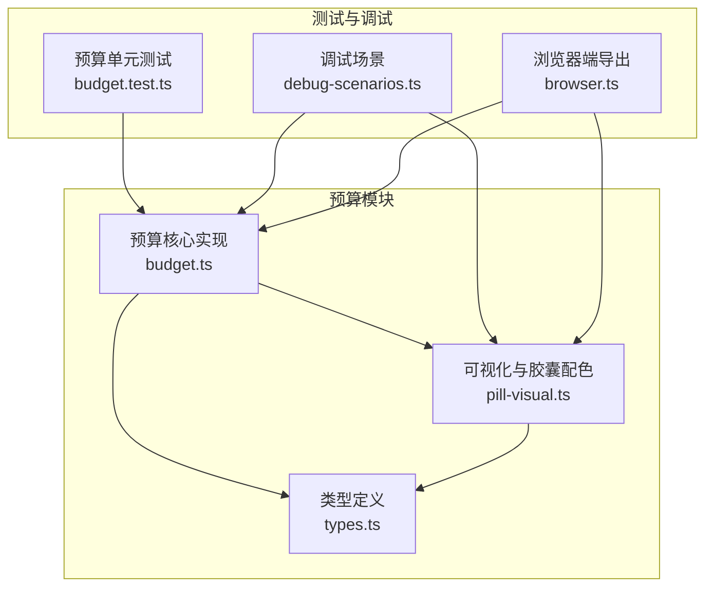

图表来源
- [预算核心实现:1-274](file://packages/core/src/budget.ts#L1-L274)
- [预算可视化与胶囊配色:1-79](file://packages/core/src/pill-visual.ts#L1-L79)
- [类型定义与数据结构:1-140](file://packages/core/src/types.ts#L1-L140)
- [预算单元测试:1-88](file://packages/core/src/budget.test.ts#L1-L88)
- [调试场景与用例:1-88](file://packages/core/src/debug-scenarios.ts#L1-L88)
- [浏览器端导出:1-21](file://packages/core/src/browser.ts#L1-L21)

章节来源
- [预算核心实现:1-274](file://packages/core/src/budget.ts#L1-L274)
- [预算可视化与胶囊配色:1-79](file://packages/core/src/pill-visual.ts#L1-L79)
- [类型定义与数据结构:1-140](file://packages/core/src/types.ts#L1-L140)
- [预算单元测试:1-88](file://packages/core/src/budget.test.ts#L1-L88)
- [调试场景与用例:1-88](file://packages/core/src/debug-scenarios.ts#L1-L88)
- [浏览器端导出:1-21](file://packages/core/src/browser.ts#L1-L21)

## 核心组件
- 日预算计算：基于剩余预算与剩余天数，计算当日可用预算
- 周期预算跟踪：通过快照记录每日基线与日预算，支持跨日同步与修复
- 剩余天数计算：根据周期结束时间与当前时间推导剩余天数
- 公平日预算分配：按周期总天数均匀分配总额度
- 超支预警系统：基于“运行时日预算”与“公平日预算”的对比，给出节奏紧张度
- 盈余银行机制：将昨日未用完的日预算存入银行，上限为 3 日
- 昨日结算逻辑：在满足条件时将昨日结余转入银行，并限制每日结算一次

章节来源
- [预算核心实现:51-93](file://packages/core/src/budget.ts#L51-L93)
- [预算核心实现:102-147](file://packages/core/src/budget.ts#L102-L147)
- [预算核心实现:183-207](file://packages/core/src/budget.ts#L183-L207)
- [预算可视化与胶囊配色:12-63](file://packages/core/src/pill-visual.ts#L12-L63)

## 架构总览
预算系统采用“纯函数 + 状态快照”的设计，核心函数以纯函数形式提供计算能力，状态通过 AppState 与 DailySnapshot 持久化，UI 通过 ProgressPaint 将预算状态可视化。

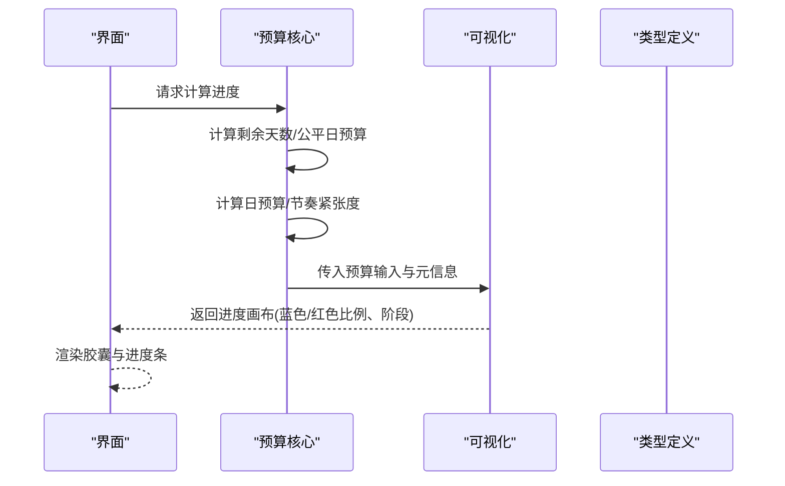

图表来源
- [预算核心实现:243-272](file://packages/core/src/budget.ts#L243-L272)
- [预算可视化与胶囊配色:29-63](file://packages/core/src/pill-visual.ts#L29-L63)

## 详细组件分析

### 日预算计算算法（computeDailyBudgetCents）
- 数学模型
  - 日预算 = max(1, floor(剩余预算 / 剩余天数))
  - 剩余天数由周期结束时间与当前时间推导，向上取整保证最小为 1 天
- 参数与返回
  - 输入：剩余预算（美分）、周期结束时间（毫秒）
  - 输出：当日可用预算（美分）
- 边界条件
  - 剩余预算为 0 时，日预算为 1
  - 剩余天数为 0 时，向上取整为 1
- 异常处理
  - 除零保护：分母至少为 1
  - 结果向下取整，避免预算溢出

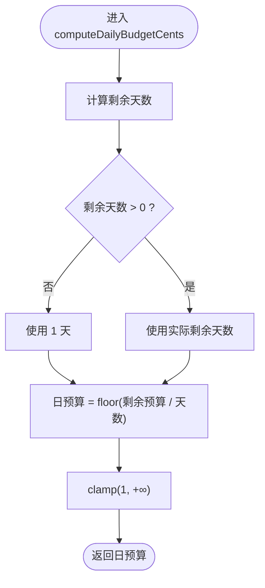

图表来源
- [预算核心实现:51-57](file://packages/core/src/budget.ts#L51-L57)

章节来源
- [预算核心实现:51-57](file://packages/core/src/budget.ts#L51-L57)

### 周期预算跟踪机制
- 快照结构
  - DailySnapshot：包含日期、基线预算（baselineCents）、日预算（dailyBudgetCents）
  - AppState：包含盈余银行余额、快照数组、上次结算日期等
- 快照生成与更新
  - ensureTodaySnapshot：生成或更新今日快照，支持跨日基线与首日对齐
  - syncTodayBaseline：刷新后对齐今日基线与已知用量
  - repairCorruptTodaySnapshot：当事件汇总异常偏高时，回退到快照用量，避免整周期误计
- 数据一致性
  - 快照数组最多保留最近 40 条，避免无限增长
  - 基线预算始终为 includedSpend 与今日用量的差值上限

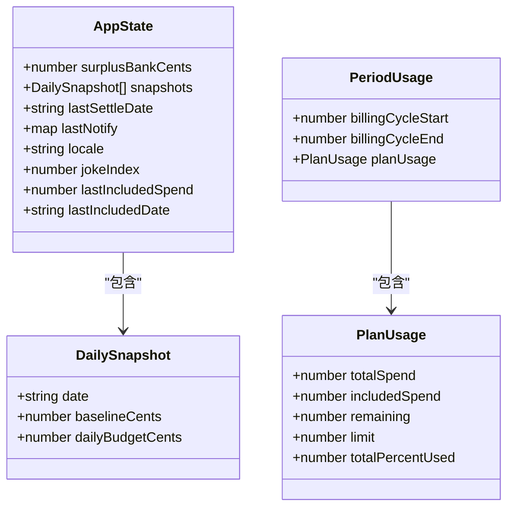

图表来源
- [类型定义与数据结构:93-124](file://packages/core/src/types.ts#L93-L124)
- [类型定义与数据结构:17-24](file://packages/core/src/types.ts#L17-L24)
- [类型定义与数据结构:7-15](file://packages/core/src/types.ts#L7-L15)

章节来源
- [预算核心实现:102-147](file://packages/core/src/budget.ts#L102-L147)
- [预算核心实现:194-207](file://packages/core/src/budget.ts#L194-L207)
- [类型定义与数据结构:93-124](file://packages/core/src/types.ts#L93-L124)

### 剩余天数计算（daysLeftInCycle）
- 数学模型
  - 剩余天数 = ceil((周期结束时间 - 当前时间) / 86400000)
  - 最小值为 1，确保预算不会因时间误差导致除零
- 使用场景
  - 作为日预算与公平日预算的输入
  - 作为“节奏紧张度”的输入之一

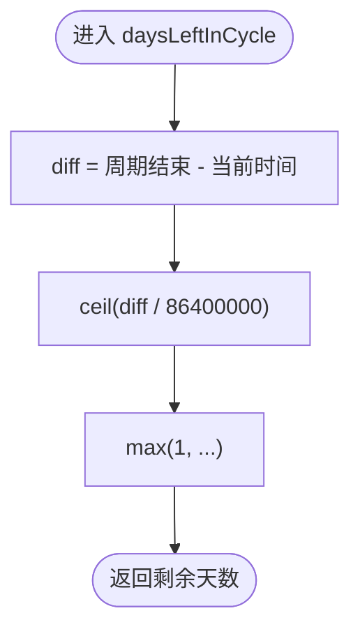

图表来源
- [预算核心实现:8-11](file://packages/core/src/budget.ts#L8-L11)

章节来源
- [预算核心实现:8-11](file://packages/core/src/budget.ts#L8-L11)

### 公平日预算分配（fairDailyCents）
- 数学模型
  - 公平日预算 = floor(总额度 / 周期总天数)
  - 周期总天数 = ceil((周期结束 - 周期开始) / 86400000)，最小为 1
- 作用
  - 衡量“按时间均匀消耗”的目标值
  - 与运行时日预算比较，得到节奏紧张度

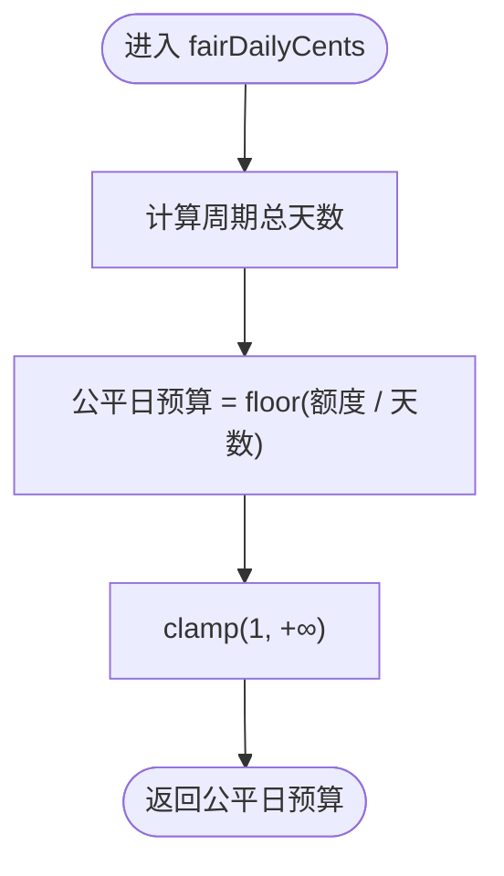

图表来源
- [预算核心实现:13-30](file://packages/core/src/budget.ts#L13-L30)
- [预算核心实现:24-30](file://packages/core/src/budget.ts#L24-L30)

章节来源
- [预算核心实现:13-30](file://packages/core/src/budget.ts#L13-L30)
- [预算核心实现:24-30](file://packages/core/src/budget.ts#L24-L30)

### 超支预警系统（pacingStressPct）
- 数学模型
  - 运行时日预算 = max(1, floor(剩余预算 / max(1, 剩余天数)))
  - 节奏紧张度 = min(1, 1 - (运行时日预算 / 公平日预算))，若运行时日预算 ≥ 公平日预算 则为 0
- 业务含义
  - 衡量“当前节奏是否偏紧”，仅用于面板参考，不直接决定胶囊颜色
- 与胶囊颜色的关系
  - 胶囊颜色由“今日用量 / 日预算”的倍数决定，阈值为 2

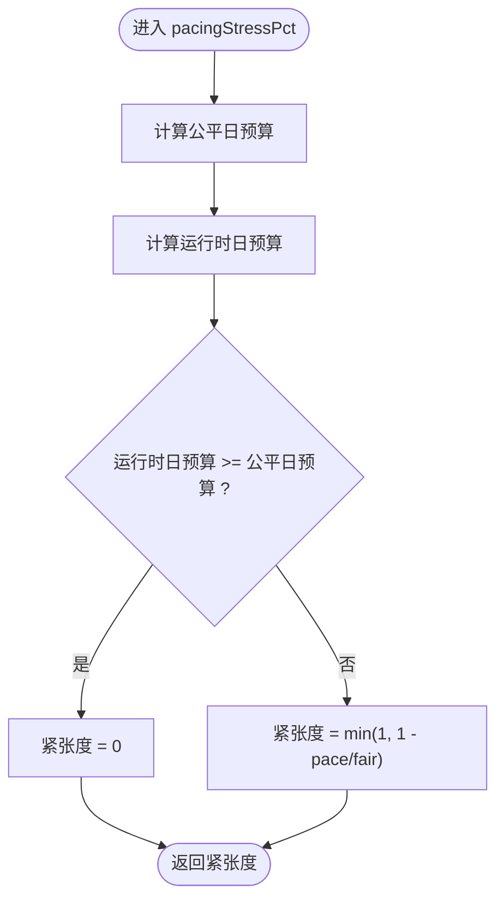

图表来源
- [预算核心实现:38-49](file://packages/core/src/budget.ts#L38-L49)

章节来源
- [预算核心实现:38-49](file://packages/core/src/budget.ts#L38-L49)
- [预算可视化与胶囊配色:12-13](file://packages/core/src/pill-visual.ts#L12-L13)

### 盈余银行机制（surplusBankCents）
- 机制概述
  - 将昨日未用完的日预算存入银行，上限为 3 日
  - 每日仅允许结算一次，防止重复累计
- 触发条件
  - 昨日未用完（yUsed < dailyBudget）
  - 或者在周末且昨日未消费（可选 honorWeekends）
- 结算逻辑
  - saved = dailyBudget（周末且无消费）或 dailyBudget - yUsed
  - nextBank = min(surplusBank + saved, dailyBudget * 3)
  - 更新 lastSettleDate

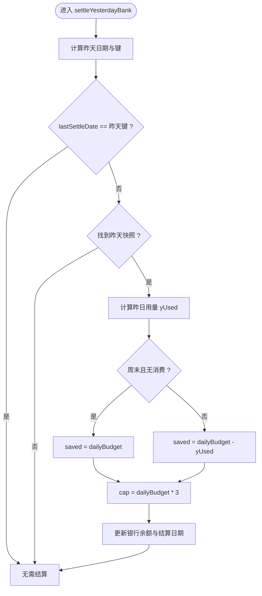

图表来源
- [预算核心实现:65-93](file://packages/core/src/budget.ts#L65-L93)

章节来源
- [预算核心实现:65-93](file://packages/core/src/budget.ts#L65-L93)

### 昨日结算逻辑（settleYesterdayBank）
- 关键点
  - 仅在存在昨天快照时执行
  - 仅在未结算过昨天时执行
  - 支持周末豁免策略（honorWeekends）
- 与“今日用量”的关系
  - settleYesterdayBank 不改变今日用量，仅影响银行余额与后续可用预算

章节来源
- [预算核心实现:65-93](file://packages/core/src/budget.ts#L65-L93)

### 今日用量解析与修复（resolveTodayUsedCents 与 repairCorruptTodaySnapshot）
- 今日用量解析
  - 合并“快照增量”与“事件汇总”，在事件汇总异常偏高时优先信任快照
  - dayScopedEvents 选项用于 Ultra 等高用量场景，避免误判
- 修复逻辑
  - 当今日用量超过 2 倍日预算时，判定快照可能被错误事件汇总污染，直接丢弃该快照

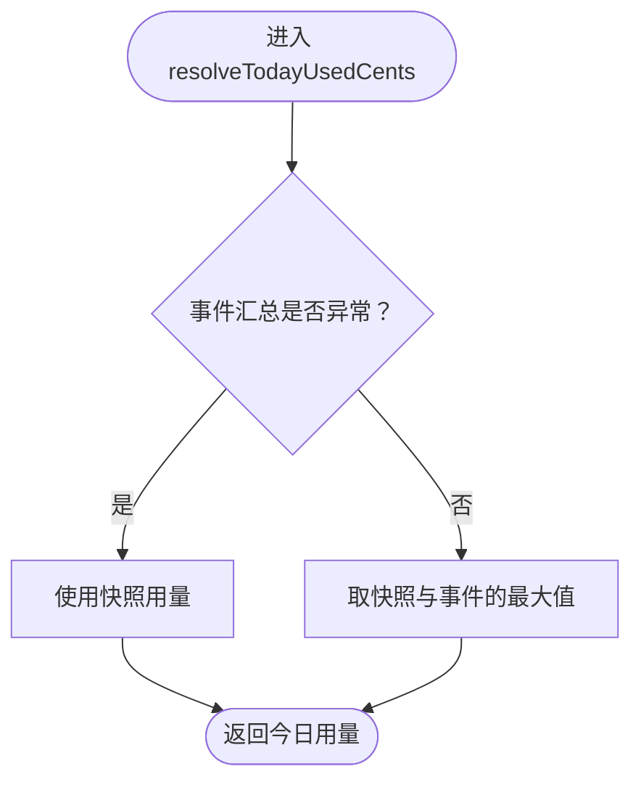

图表来源
- [预算核心实现:214-236](file://packages/core/src/budget.ts#L214-L236)
- [预算核心实现:194-207](file://packages/core/src/budget.ts#L194-L207)

章节来源
- [预算核心实现:214-236](file://packages/core/src/budget.ts#L214-L236)
- [预算核心实现:194-207](file://packages/core/src/budget.ts#L194-L207)

### 进度计算与可视化（computeProgress 与 buildProgressPaint）
- 进度计算
  - 输入：周期用量、当前状态、今日用量、日预算、可选 asOfMs
  - 计算：剩余天数、节奏紧张度、头余（剩余 + 银行）
  - 输出：ProgressPaint（蓝色/红色比例、阶段、天数等）
- 胶囊配色规则
  - 今日用量 ≥ 2 × 日预算 → 红色
  - 否则根据头余占额度的比例显示蓝色/绿色

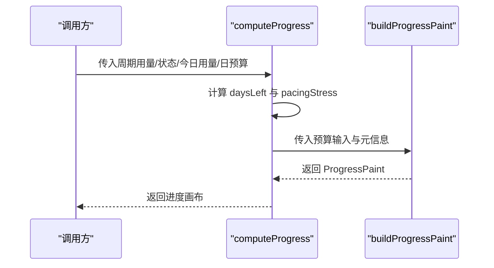

图表来源
- [预算核心实现:243-272](file://packages/core/src/budget.ts#L243-L272)
- [预算可视化与胶囊配色:29-63](file://packages/core/src/pill-visual.ts#L29-L63)

章节来源
- [预算核心实现:243-272](file://packages/core/src/budget.ts#L243-L272)
- [预算可视化与胶囊配色:29-63](file://packages/core/src/pill-visual.ts#L29-L63)

## 依赖关系分析
- 组件耦合
  - budget.ts 依赖 types.ts 提供的数据结构
  - pill-visual.ts 依赖 types.ts 的 ProgressPaint 定义
  - debug-scenarios.ts 依赖 budget.ts 与 pill-visual.ts 进行场景验证
- 外部依赖
  - 浏览器端通过 browser.ts 导出预算相关函数，便于前端使用

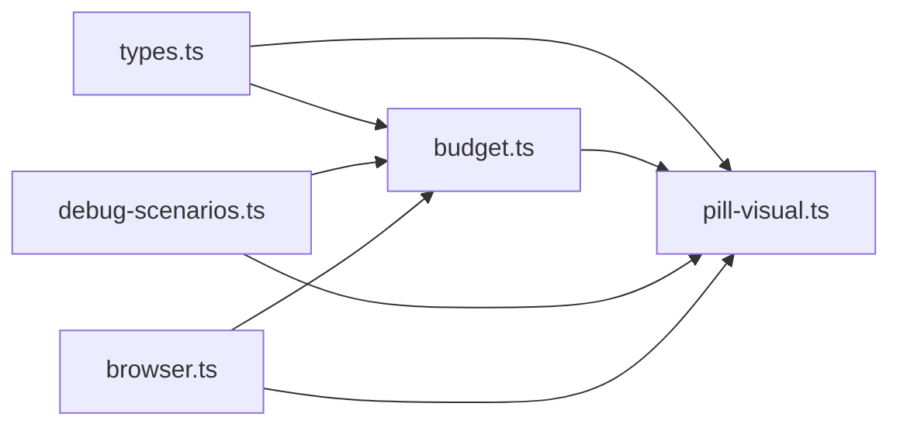

图表来源
- [类型定义与数据结构:1-140](file://packages/core/src/types.ts#L1-L140)
- [预算核心实现:1-274](file://packages/core/src/budget.ts#L1-L274)
- [预算可视化与胶囊配色:1-79](file://packages/core/src/pill-visual.ts#L1-L79)
- [调试场景与用例:1-88](file://packages/core/src/debug-scenarios.ts#L1-L88)
- [浏览器端导出:1-21](file://packages/core/src/browser.ts#L1-L21)

章节来源
- [类型定义与数据结构:1-140](file://packages/core/src/types.ts#L1-L140)
- [预算核心实现:1-274](file://packages/core/src/budget.ts#L1-L274)
- [预算可视化与胶囊配色:1-79](file://packages/core/src/pill-visual.ts#L1-L79)
- [调试场景与用例:1-88](file://packages/core/src/debug-scenarios.ts#L1-L88)
- [浏览器端导出:1-21](file://packages/core/src/browser.ts#L1-L21)

## 性能考量
- 时间复杂度
  - 所有预算函数均为 O(1)，无循环或递归
- 空间复杂度
  - 快照数组最多保留 40 条，空间占用可控
- 优化建议
  - 在高频刷新场景中，尽量复用已计算的 daysLeft 与 fairDailyCents
  - 避免重复计算相同时间窗口内的 pacingStressPct

## 故障排查指南
- 常见问题
  - 今日用量异常偏高：检查 resolveTodayUsedCents 的 dayScopedEvents 选项是否正确设置
  - 快照被误写：使用 repairCorruptTodaySnapshot 自动丢弃异常快照
  - 周末结算未生效：确认 honorWeekends 选项与 isWeekend 判断
- 单元测试参考
  - 使用 budget.test.ts 中的断言验证 isCycleOverPace、pacingStressPct、胶囊颜色阈值等行为
  - 使用 debug-scenarios.ts 的场景验证不同节奏下的进度表现

章节来源
- [预算单元测试:1-88](file://packages/core/src/budget.test.ts#L1-L88)
- [调试场景与用例:1-88](file://packages/core/src/debug-scenarios.ts#L1-L88)
- [预算核心实现:194-207](file://packages/core/src/budget.ts#L194-L207)

## 结论
预算系统通过“日预算计算 + 周期快照 + 节奏紧张度 + 盈余银行 + 昨日结算”的组合，实现了对周期预算的精细化控制与可视化呈现。其数学模型简洁清晰，边界条件处理完善，适合在多种业务场景中稳定运行。建议在集成时关注“事件汇总异常处理”“周末豁免策略”“快照修复”等关键点，以获得更可靠的预算体验。

## 附录
- 关键函数速查
  - computeDailyBudgetCents：日预算计算
  - fairDailyCents：公平日预算
  - pacingStressPct：节奏紧张度
  - settleYesterdayBank：昨日结算
  - ensureTodaySnapshot/syncTodayBaseline/repairCorruptTodaySnapshot：快照管理
  - computeProgress/buildProgressPaint：进度计算与可视化
- 参数与阈值
  - 胶囊红色阈值：2 倍日预算
  - 周末豁免：仅在 honorWeekends 为真且昨日无消费时启用
  - 银行上限：3 日日预算