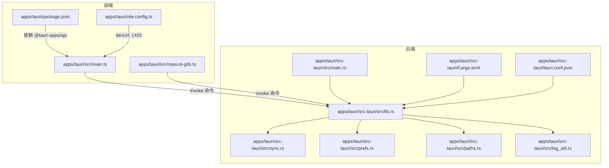
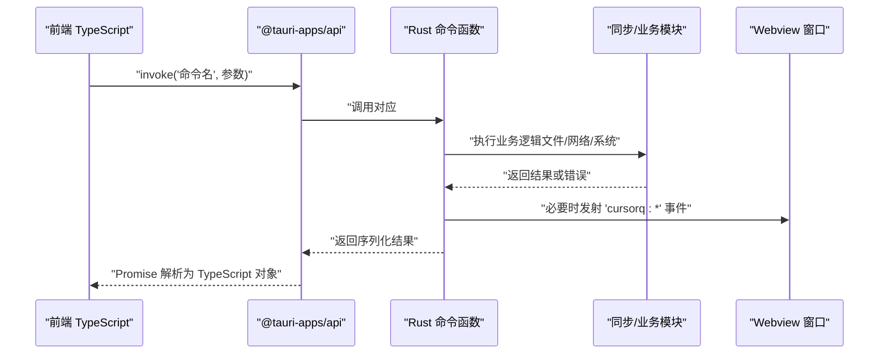
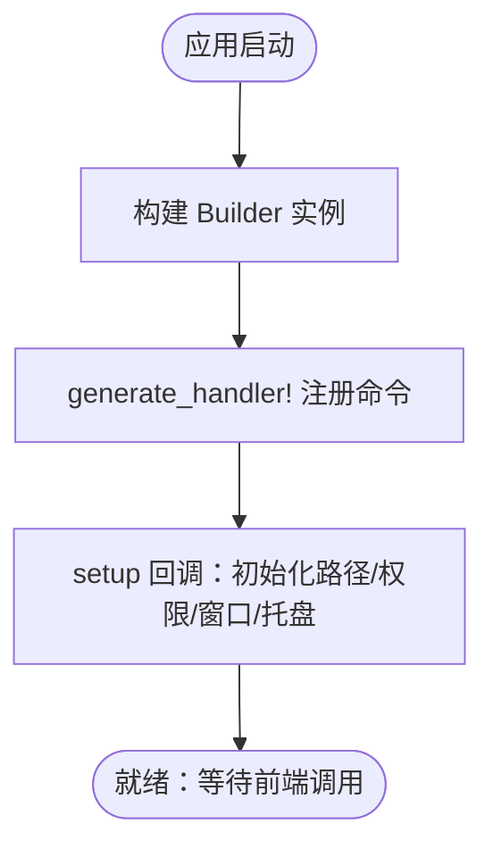
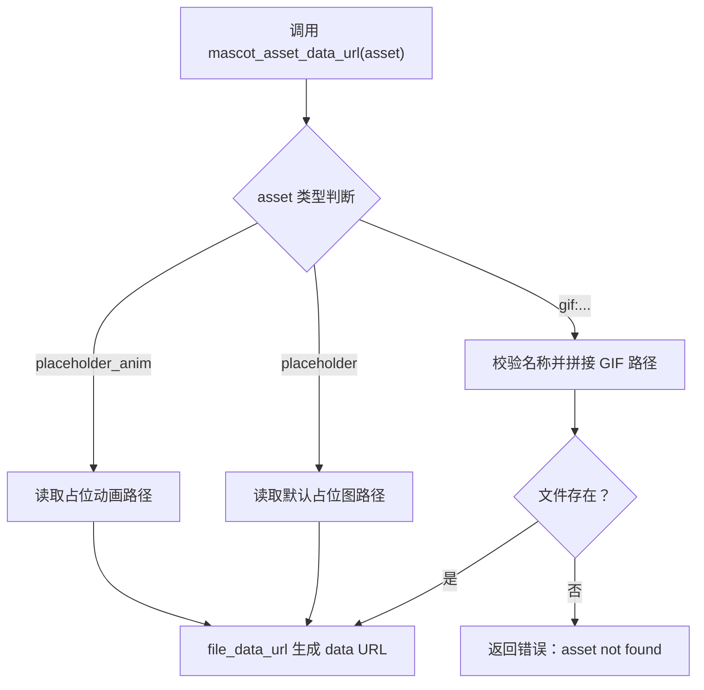
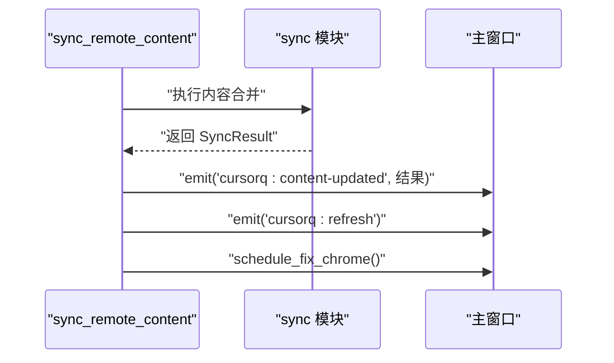
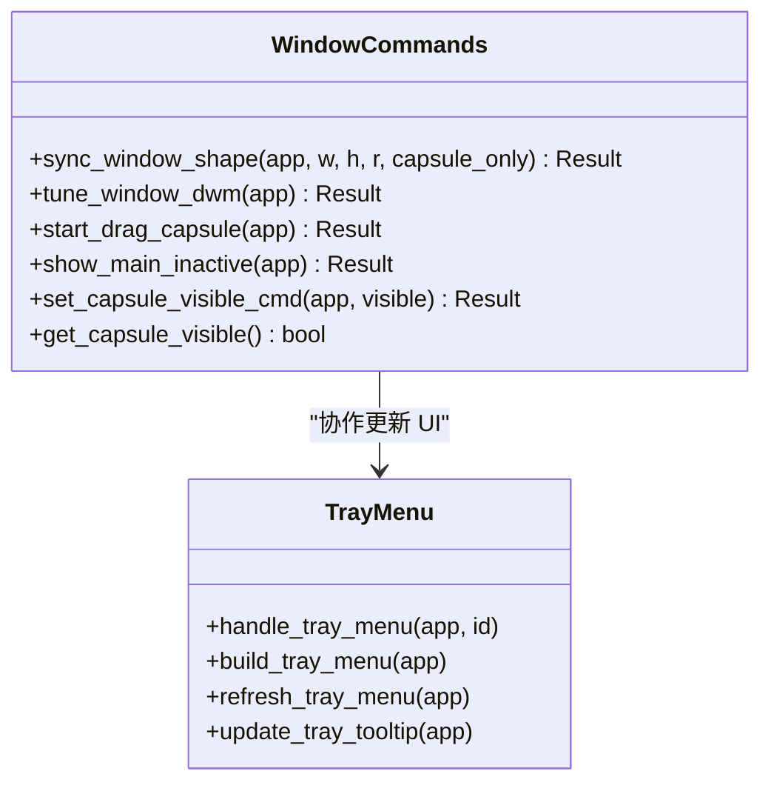
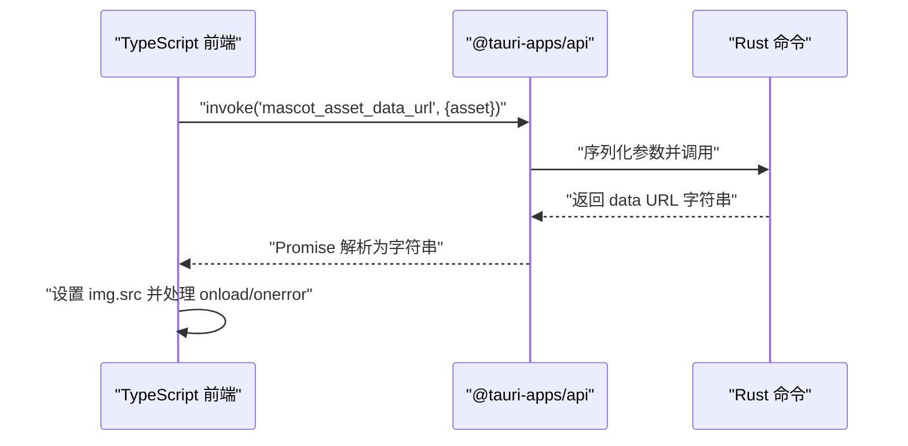
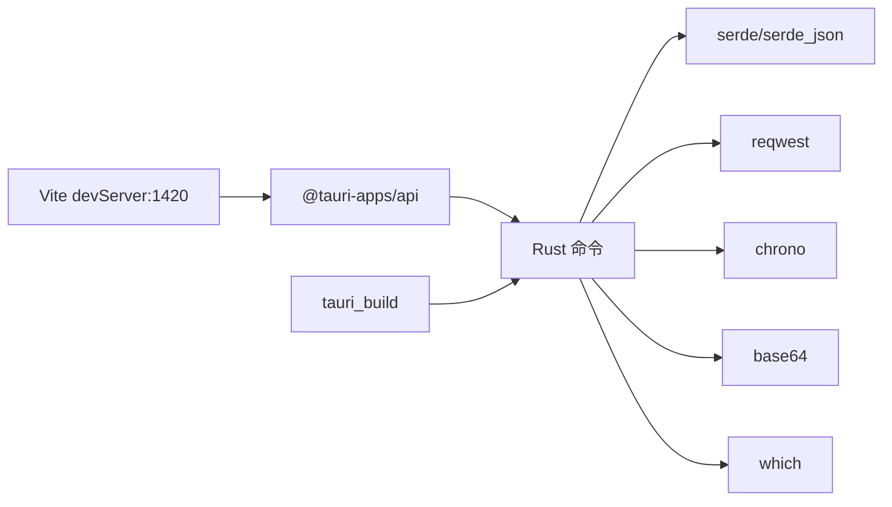

# Tauri 命令接口

<cite>
**本文引用的文件**
- [apps/tauri/src-tauri/src/lib.rs](file://apps/tauri/src-tauri/src/lib.rs)
- [apps/tauri/src-tauri/Cargo.toml](file://apps/tauri/src-tauri/Cargo.toml)
- [apps/tauri/src-tauri/tauri.conf.json](file://apps/tauri/src-tauri/tauri.conf.json)
- [apps/tauri/src-tauri/src/main.rs](file://apps/tauri/src-tauri/src/main.rs)
- [apps/tauri/src-tauri/src/sync.rs](file://apps/tauri/src-tauri/src/sync.rs)
- [apps/tauri/src-tauri/src/prefs.rs](file://apps/tauri/src-tauri/src/prefs.rs)
- [apps/tauri/src-tauri/src/paths.rs](file://apps/tauri/src-tauri/src/paths.rs)
- [apps/tauri/src-tauri/src/log_util.rs](file://apps/tauri/src-tauri/src/log_util.rs)
- [apps/tauri/package.json](file://apps/tauri/package.json)
- [apps/tauri/vite.config.ts](file://apps/tauri/vite.config.ts)
- [apps/tauri/src/mascot-gifs.ts](file://apps/tauri/src/mascot-gifs.ts)
</cite>

## 目录
1. [简介](#简介)
2. [项目结构](#项目结构)
3. [核心组件](#核心组件)
4. [架构总览](#架构总览)
5. [详细组件分析](#详细组件分析)
6. [依赖关系分析](#依赖关系分析)
7. [性能考量](#性能考量)
8. [故障排查指南](#故障排查指南)
9. [结论](#结论)
10. [附录](#附录)

## 简介
本文件面向 CursorQ 桌面应用的 Tauri 命令接口，系统性阐述 Rust 后端如何通过 Tauri 命令系统与前端 TypeScript 进行通信。内容涵盖命令定义、参数与返回值类型、错误处理、命令注册、类型安全、异步调用模式、跨线程通信、以及设计原则与最佳实践。读者可据此理解命令接口的工作原理，并安全地扩展与维护该系统。

## 项目结构
- 后端（Rust）位于 apps/tauri/src-tauri，包含命令实现、路径与偏好设置、内容同步逻辑等模块。
- 前端（TypeScript/Vite）位于 apps/tauri，使用 @tauri-apps/api 与后端交互。
- 构建与运行由 Cargo 和 Vite 协同完成，开发模式下前端服务地址为 http://localhost:1420。



**图表来源**
- [apps/tauri/src-tauri/src/lib.rs:715-736](file://apps/tauri/src-tauri/src/lib.rs#L715-L736)
- [apps/tauri/src-tauri/src/main.rs:1-6](file://apps/tauri/src-tauri/src/main.rs#L1-L6)
- [apps/tauri/src-tauri/Cargo.toml:15-25](file://apps/tauri/src-tauri/Cargo.toml#L15-L25)
- [apps/tauri/src-tauri/tauri.conf.json:6-11](file://apps/tauri/src-tauri/tauri.conf.json#L6-L11)
- [apps/tauri/package.json:12-20](file://apps/tauri/package.json#L12-L20)
- [apps/tauri/vite.config.ts:7-19](file://apps/tauri/vite.config.ts#L7-L19)

**章节来源**
- [apps/tauri/src-tauri/src/lib.rs:715-736](file://apps/tauri/src-tauri/src/lib.rs#L715-L736)
- [apps/tauri/src-tauri/src/main.rs:1-6](file://apps/tauri/src-tauri/src/main.rs#L1-L6)
- [apps/tauri/src-tauri/Cargo.toml:15-25](file://apps/tauri/src-tauri/Cargo.toml#L15-L25)
- [apps/tauri/src-tauri/tauri.conf.json:6-11](file://apps/tauri/src-tauri/tauri.conf.json#L6-L11)
- [apps/tauri/package.json:12-20](file://apps/tauri/package.json#L12-L20)
- [apps/tauri/vite.config.ts:7-19](file://apps/tauri/vite.config.ts#L7-L19)

## 核心组件
- 命令注册器：在应用初始化阶段集中注册所有命令，确保前端可通过统一入口调用。
- 命令实现：以 #[tauri::command] 标注的函数，负责参数解析、业务逻辑、错误处理与返回值序列化。
- 类型安全：通过 serde 序列化/反序列化与强类型返回值，保障前后端契约稳定。
- 异步与并发：使用 async 命令与线程池，避免阻塞 UI；跨线程通过通道或共享状态安全访问。
- 事件发射：通过 AppHandle 获取 Webview 窗口并发射自定义事件，驱动前端更新。

**章节来源**
- [apps/tauri/src-tauri/src/lib.rs:715-736](file://apps/tauri/src-tauri/src/lib.rs#L715-L736)
- [apps/tauri/src-tauri/src/lib.rs:617-639](file://apps/tauri/src-tauri/src/lib.rs#L617-L639)
- [apps/tauri/src-tauri/src/lib.rs:127-138](file://apps/tauri/src-tauri/src/lib.rs#L127-L138)

## 架构总览
Tauri 命令接口采用“前端发起调用 → 后端命令处理 → 返回结果/事件”的单向流程。命令在后端以函数形式实现，经 Builder 注册后暴露给前端；前端通过 @tauri-apps/api 的 invoke 方法调用，返回值自动反序列化为 TypeScript 对象。



**图表来源**
- [apps/tauri/src-tauri/src/lib.rs:715-736](file://apps/tauri/src-tauri/src/lib.rs#L715-L736)
- [apps/tauri/src-tauri/src/lib.rs:127-138](file://apps/tauri/src-tauri/src/lib.rs#L127-L138)
- [apps/tauri/src-tauri/src/lib.rs:617-639](file://apps/tauri/src-tauri/src/lib.rs#L617-L639)

## 详细组件分析

### 命令注册与生命周期
- 应用启动时，Builder::default() 创建实例，随后通过 generate_handler! 将一组命令注册到运行时。
- 注册列表包含刷新、窗口控制、资源查询、配置读取、内容同步等命令。
- 初始化阶段还设置窗口属性、托盘图标与菜单、资产协议作用域等。



**图表来源**
- [apps/tauri/src-tauri/src/lib.rs:715-736](file://apps/tauri/src-tauri/src/lib.rs#L715-L736)
- [apps/tauri/src-tauri/src/lib.rs:737-780](file://apps/tauri/src-tauri/src/lib.rs#L737-L780)

**章节来源**
- [apps/tauri/src-tauri/src/lib.rs:715-736](file://apps/tauri/src-tauri/src/lib.rs#L715-L736)
- [apps/tauri/src-tauri/src/lib.rs:737-780](file://apps/tauri/src-tauri/src/lib.rs#L737-L780)

### 异步命令与跨线程通信
- refresh_usage 是异步命令，内部使用异步运行时的 blocking 线程池执行耗时任务，避免阻塞主线程。
- 通过线程池 join handle 收集结果，再根据成功/失败分支记录日志并决定是否发射事件。
- 该模式适用于需要调用外部进程或执行 IO 密集任务的场景。

```mermaid
flowchart TD
Enter(["调用 refresh_usage"]) --> Spawn["spawn_blocking 执行同步逻辑"]
Spawn --> Await{"等待 join 完成"}
Await --> |Ok(Ok)| Emit["记录日志并调度修复 Chrome 事件"]
Await --> |Ok(Err)| LogErr["记录错误并返回"]
Await --> |Err| JoinErr["记录 join 错误并返回"]
Emit --> Exit(["返回字符串结果"])
LogErr --> Exit
JoinErr --> Exit
```

**图表来源**
- [apps/tauri/src-tauri/src/lib.rs:617-639](file://apps/tauri/src-tauri/src/lib.rs#L617-L639)
- [apps/tauri/src-tauri/src/lib.rs:496-543](file://apps/tauri/src-tauri/src/lib.rs#L496-L543)

**章节来源**
- [apps/tauri/src-tauri/src/lib.rs:617-639](file://apps/tauri/src-tauri/src/lib.rs#L617-L639)
- [apps/tauri/src-tauri/src/lib.rs:496-543](file://apps/tauri/src-tauri/src/lib.rs#L496-L543)

### 资源与路径命令
- 列举吉祥物动图、占位图路径、拼接资源 data URL 等命令，均以 #[tauri::command] 标注，参数与返回值类型明确。
- 资源 data URL 命令对输入进行校验，防止路径穿越；读取文件后以 MIME 类型包装为 data URL，便于前端直接加载。



**图表来源**
- [apps/tauri/src-tauri/src/lib.rs:98-120](file://apps/tauri/src-tauri/src/lib.rs#L98-L120)
- [apps/tauri/src-tauri/src/lib.rs:89-96](file://apps/tauri/src-tauri/src/lib.rs#L89-L96)
- [apps/tauri/src-tauri/src/lib.rs:100-120](file://apps/tauri/src-tauri/src/lib.rs#L100-L120)

**章节来源**
- [apps/tauri/src-tauri/src/lib.rs:31-151](file://apps/tauri/src-tauri/src/lib.rs#L31-L151)

### 内容同步与事件发射
- get_remote_config 与 sync_remote_content 提供远程配置读取与内容合并能力，返回结构化结果。
- 当内容更新时，命令会通过 AppHandle 获取主窗口并发射 "cursorq:content-updated" 与 "cursorq:refresh" 事件，驱动前端刷新。
- 同步完成后还会调度修复 Chrome 的流程，确保窗口渲染一致性。



**图表来源**
- [apps/tauri/src-tauri/src/lib.rs:127-138](file://apps/tauri/src-tauri/src/lib.rs#L127-L138)
- [apps/tauri/src-tauri/src/sync.rs:261-367](file://apps/tauri/src-tauri/src/sync.rs#L261-L367)

**章节来源**
- [apps/tauri/src-tauri/src/lib.rs:127-138](file://apps/tauri/src-tauri/src/lib.rs#L127-L138)
- [apps/tauri/src-tauri/src/sync.rs:12-56](file://apps/tauri/src-tauri/src/sync.rs#L12-L56)

### 窗口与托盘命令
- 窗口形状调整、DWM 调优、拖拽胶囊、显示/隐藏胶囊等命令，均接收 AppHandle 作为首个参数，用于操作窗口与托盘。
- 命令内部通过锁保护共享状态（如窗口布局），并在必要时发射自定义事件通知前端。



**图表来源**
- [apps/tauri/src-tauri/src/lib.rs:428-468](file://apps/tauri/src-tauri/src/lib.rs#L428-L468)
- [apps/tauri/src-tauri/src/lib.rs:664-713](file://apps/tauri/src-tauri/src/lib.rs#L664-L713)

**章节来源**
- [apps/tauri/src-tauri/src/lib.rs:428-468](file://apps/tauri/src-tauri/src/lib.rs#L428-L468)
- [apps/tauri/src-tauri/src/lib.rs:664-713](file://apps/tauri/src-tauri/src/lib.rs#L664-L713)

### 前端调用示例与类型安全
- 前端通过 @tauri-apps/api 的 invoke 方法调用后端命令，返回 Promise，自动反序列化为 TypeScript 对象。
- 前端 mascot-gifs.ts 展示了如何调用资源 data URL 命令并加载图片，体现了命令与 UI 的联动。



**图表来源**
- [apps/tauri/src/mascot-gifs.ts:1-43](file://apps/tauri/src/mascot-gifs.ts#L1-L43)
- [apps/tauri/src-tauri/src/lib.rs:98-120](file://apps/tauri/src-tauri/src/lib.rs#L98-L120)

**章节来源**
- [apps/tauri/src/mascot-gifs.ts:1-43](file://apps/tauri/src/mascot-gifs.ts#L1-L43)
- [apps/tauri/src-tauri/src/lib.rs:98-120](file://apps/tauri/src-tauri/src/lib.rs#L98-L120)

## 依赖关系分析
- 后端依赖 tauri、serde、reqwest、chrono、which、base64 等库，分别用于命令框架、序列化、HTTP、时间、可执行文件查找与编码。
- 前端依赖 @tauri-apps/api，提供 invoke、事件监听等能力。
- 构建阶段通过 tauri_build 生成绑定代码，开发模式由 Vite 提供热更新与代理。



**图表来源**
- [apps/tauri/src-tauri/Cargo.toml:15-25](file://apps/tauri/src-tauri/Cargo.toml#L15-L25)
- [apps/tauri/src-tauri/src/lib.rs:16-21](file://apps/tauri/src-tauri/src/lib.rs#L16-L21)
- [apps/tauri/package.json:12-20](file://apps/tauri/package.json#L12-L20)
- [apps/tauri/vite.config.ts:14-19](file://apps/tauri/vite.config.ts#L14-L19)

**章节来源**
- [apps/tauri/src-tauri/Cargo.toml:15-25](file://apps/tauri/src-tauri/Cargo.toml#L15-L25)
- [apps/tauri/src-tauri/src/lib.rs:16-21](file://apps/tauri/src-tauri/src/lib.rs#L16-L21)
- [apps/tauri/package.json:12-20](file://apps/tauri/package.json#L12-L20)
- [apps/tauri/vite.config.ts:14-19](file://apps/tauri/vite.config.ts#L14-L19)

## 性能考量
- 异步命令：将耗时任务移至线程池，避免阻塞 UI 线程，提升响应性。
- 跨平台差异：Windows 下通过 DWM 调整窗口形状与置顶行为，减少额外绘制开销。
- 事件节流：通过 guard 与定时器策略减少频繁事件导致的抖动。
- 资源加载：优先使用 data URL 直接加载小资源，降低 asset:// 在特定环境下的失败风险。

[本节为通用指导，无需具体文件引用]

## 故障排查指南
- 日志记录：后端通过日志工具写入时间戳与消息，定位命令执行与错误发生点。
- 常见问题
  - 命令未注册：检查 generate_handler! 是否包含目标命令。
  - 资源路径错误：确认 paths 模块返回的目录与文件存在性。
  - 网络同步失败：检查远程配置与网络连通性，查看错误信息中的 HTTP 状态或 JSON 解析失败原因。
  - 托盘菜单异常：确认托盘图标与菜单构建成功，关注最近操作时间门限。

**章节来源**
- [apps/tauri/src-tauri/src/log_util.rs:8-15](file://apps/tauri/src-tauri/src/log_util.rs#L8-L15)
- [apps/tauri/src-tauri/src/lib.rs:737-780](file://apps/tauri/src-tauri/src/lib.rs#L737-L780)
- [apps/tauri/src-tauri/src/sync.rs:261-367](file://apps/tauri/src-tauri/src/sync.rs#L261-L367)

## 结论
CursorQ 的 Tauri 命令接口以清晰的职责划分与类型安全设计，实现了前后端高效稳定的通信。通过集中注册、异步执行、事件驱动与严格的参数校验，系统在功能完整性与可维护性之间取得良好平衡。遵循本文的设计原则与最佳实践，可安全扩展更多命令并保持一致的开发体验。

[本节为总结，无需具体文件引用]

## 附录

### 命令清单与用途概览
- 刷新使用统计：异步执行外部脚本，返回 JSON 字符串。
- 窗口与 DWM：调整窗口形状、启用/禁用阴影、拖拽移动。
- 显示控制：显示/隐藏胶囊、查询可见状态、托盘菜单联动。
- 资源查询：列举动图、占位图路径、生成资源 data URL。
- 配置与同步：读取远程配置、拉取内容清单并合并，支持事件通知。

**章节来源**
- [apps/tauri/src-tauri/src/lib.rs:715-736](file://apps/tauri/src-tauri/src/lib.rs#L715-L736)
- [apps/tauri/src-tauri/src/lib.rs:617-639](file://apps/tauri/src-tauri/src/lib.rs#L617-L639)
- [apps/tauri/src-tauri/src/lib.rs:428-468](file://apps/tauri/src-tauri/src/lib.rs#L428-L468)
- [apps/tauri/src-tauri/src/lib.rs:31-151](file://apps/tauri/src-tauri/src/lib.rs#L31-L151)
- [apps/tauri/src-tauri/src/sync.rs:12-56](file://apps/tauri/src-tauri/src/sync.rs#L12-L56)