# 偏好设置管理

<cite>
**本文档引用的文件**
- [prefs.rs](file://apps/tauri/src-tauri/src/prefs.rs)
- [lib.rs](file://apps/tauri/src-tauri/src/lib.rs)
- [paths.rs](file://apps/tauri/src-tauri/src/paths.rs)
- [sync.rs](file://apps/tauri/src-tauri/src/sync.rs)
- [default.json](file://apps/tauri/src-tauri/capabilities/default.json)
- [remote.json.example](file://config/remote.json.example)
- [main.ts](file://apps/tauri/src/main.ts)
</cite>

## 目录
1. [简介](#简介)
2. [项目结构](#项目结构)
3. [核心组件](#核心组件)
4. [架构概览](#架构概览)
5. [详细组件分析](#详细组件分析)
6. [依赖关系分析](#依赖关系分析)
7. [性能考虑](#性能考虑)
8. [故障排除指南](#故障排除指南)
9. [结论](#结论)
10. [附录](#附录)

## 简介

CursorQ 的偏好设置管理系统是一个基于 Tauri 框架的跨平台应用程序，提供了完整的用户偏好设置读取、写入和同步机制。该系统支持多种偏好选项，包括始终置顶显示、开机自启动、胶囊可见性等，并实现了智能的默认值处理、状态持久化和实时更新功能。

系统采用 JSON 文件作为配置存储格式，通过分层架构设计实现了配置文件的合并策略和错误恢复机制。前端通过事件系统与后端进行实时通信，确保用户界面与系统设置保持同步。

## 项目结构

CursorQ 的偏好设置管理分布在多个模块中，形成了清晰的分层架构：

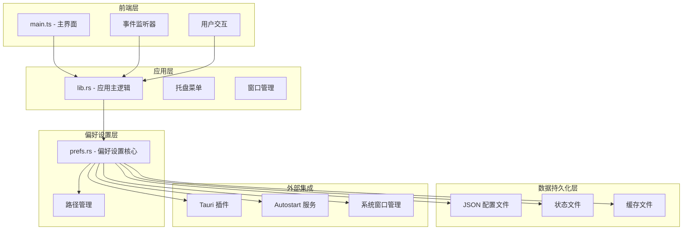

**图表来源**
- [lib.rs:716-800](file://apps/tauri/src-tauri/src/lib.rs#L716-L800)
- [prefs.rs:1-145](file://apps/tauri/src-tauri/src/prefs.rs#L1-L145)
- [paths.rs:1-142](file://apps/tauri/src-tauri/src/paths.rs#L1-L142)

**章节来源**
- [lib.rs:716-800](file://apps/tauri/src-tauri/src/lib.rs#L716-L800)
- [prefs.rs:1-145](file://apps/tauri/src-tauri/src/prefs.rs#L1-L145)
- [paths.rs:1-142](file://apps/tauri/src-tauri/src/paths.rs#L1-L142)

## 核心组件

### 偏好设置核心模块

偏好设置系统的核心功能由 `prefs.rs` 模块提供，包含以下关键组件：

#### 默认值管理
系统为每个偏好设置提供了明确的默认值：
- 始终置顶显示：默认启用
- 开机自启动：默认禁用  
- 胶囊可见性：默认启用

#### 状态持久化
所有偏好设置都存储在 JSON 格式的配置文件中，位于应用数据目录下：
- 主配置文件：`app-state.json`
- 远程配置：`config/remote.json`
- 内容同步状态：`data/content-sync.json`

#### 实时同步机制
系统通过事件驱动的方式实现实时更新：
- 前端监听 `cursorq:refresh` 和 `cursorq:fix-chrome` 事件
- 后端通过 Tauri 事件系统向前端推送状态变更
- 托盘菜单与主界面状态保持同步

**章节来源**
- [prefs.rs:41-51](file://apps/tauri/src-tauri/src/prefs.rs#L41-L51)
- [prefs.rs:13-22](file://apps/tauri/src-tauri/src/prefs.rs#L13-L22)
- [main.ts:700-710](file://apps/tauri/src/main.ts#L700-L710)

### 路径管理模块

`paths.rs` 模块负责管理应用的各种路径，支持便携式和标准安装两种模式：

#### 路径解析策略
- 便携式布局：`exe` 同级目录包含 `config/` 和 `content/copy`
- 标准布局：使用系统数据目录
- 开发模式：自动检测项目根目录

#### 关键路径定义
- 应用根目录：根据运行环境动态确定
- 数据目录：存储用户配置和缓存
- 日志目录：记录系统运行日志
- 配置目录：存储用户配置文件

**章节来源**
- [paths.rs:6-12](file://apps/tauri/src-tauri/src/paths.rs#L6-L12)
- [paths.rs:54-87](file://apps/tauri/src-tauri/src/paths.rs#L54-L87)

### 应用主逻辑模块

`lib.rs` 模块整合了所有功能组件，提供了统一的应用入口点：

#### 命令接口
系统暴露了多个 Tauri 命令供前端调用：
- `refresh_usage` - 刷新使用数据
- `set_capsule_visible_cmd` - 设置胶囊可见性
- `start_drag_capsule` - 开始拖拽胶囊
- `sync_remote_content` - 同步远程内容

#### 托盘菜单集成
托盘菜单提供了快速访问常用功能：
- 胶囊显示/隐藏切换
- 总是置顶开关
- 开机启动开关
- 语言切换（中/英）
- 内容同步

**章节来源**
- [lib.rs:720-736](file://apps/tauri/src-tauri/src/lib.rs#L720-L736)
- [lib.rs:282-368](file://apps/tauri/src-tauri/src/lib.rs#L282-L368)

## 架构概览

### 整体架构设计

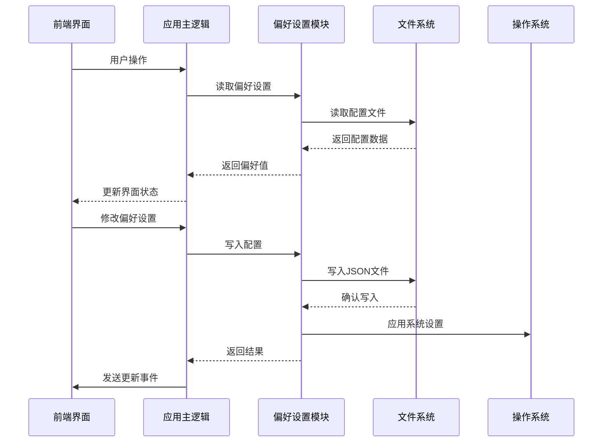

**图表来源**
- [lib.rs:716-800](file://apps/tauri/src-tauri/src/lib.rs#L716-L800)
- [prefs.rs:24-39](file://apps/tauri/src-tauri/src/prefs.rs#L24-L39)

### 数据流架构

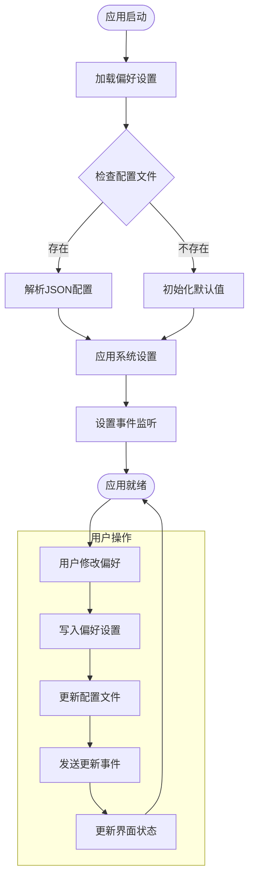

**图表来源**
- [prefs.rs:13-22](file://apps/tauri/src-tauri/src/prefs.rs#L13-L22)
- [lib.rs:770-772](file://apps/tauri/src-tauri/src/lib.rs#L770-L772)

## 详细组件分析

### 偏好设置读取机制

#### 配置文件读取流程

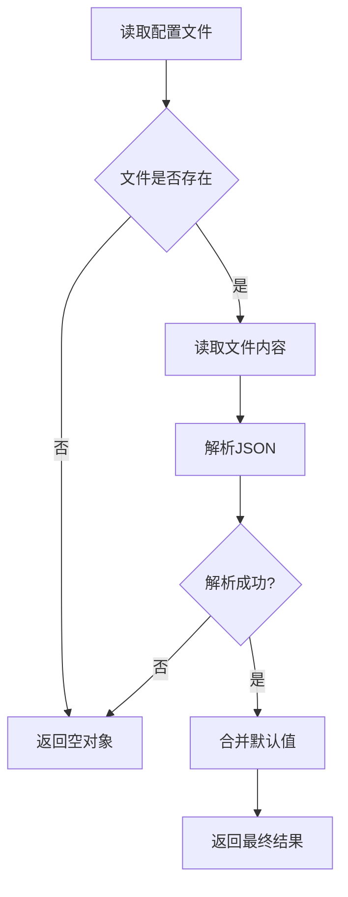

**图表来源**
- [prefs.rs:13-22](file://apps/tauri/src-tauri/src/prefs.rs#L13-L22)

#### 默认值处理策略

系统为每种偏好设置提供了明确的默认值处理策略：

| 偏好设置 | 默认值 | 处理逻辑 |
|---------|--------|----------|
| alwaysOnTop | true | 系统启动时默认置顶 |
| launchAtStartup | false | 需要用户主动启用 |
| capsuleVisible | true | 胶囊默认显示 |

**章节来源**
- [prefs.rs:41-51](file://apps/tauri/src-tauri/src/prefs.rs#L41-L51)
- [prefs.rs:64-76](file://apps/tauri/src-tauri/src/prefs.rs#L64-L76)

### 偏好设置写入机制

#### 状态合并策略

系统采用深度合并策略处理配置更新：

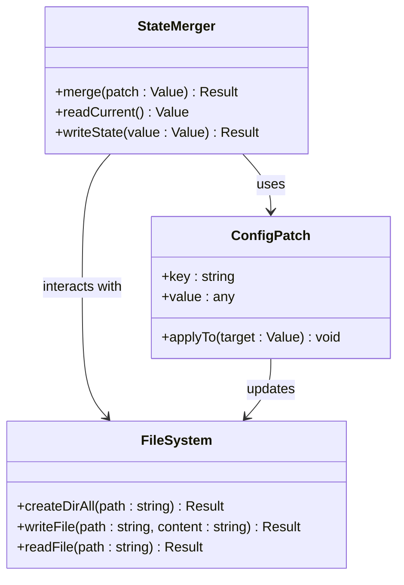

**图表来源**
- [prefs.rs:24-39](file://apps/tauri/src-tauri/src/prefs.rs#L24-L39)

#### 写入流程控制

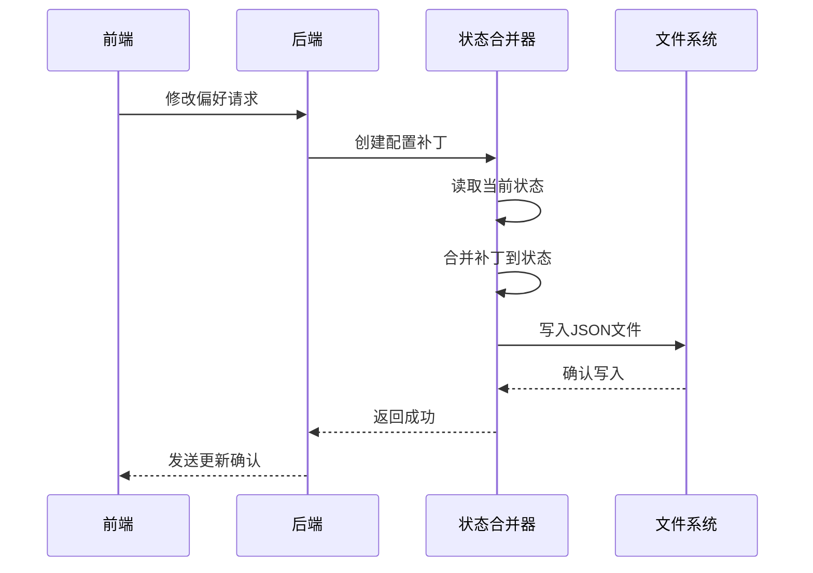

**图表来源**
- [prefs.rs:60-62](file://apps/tauri/src-tauri/src/prefs.rs#L60-L62)
- [prefs.rs:24-39](file://apps/tauri/src-tauri/src/prefs.rs#L24-L39)

**章节来源**
- [prefs.rs:24-39](file://apps/tauri/src-tauri/src/prefs.rs#L24-L39)
- [prefs.rs:60-62](file://apps/tauri/src-tauri/src/prefs.rs#L60-L62)

### 实时更新机制

#### 事件驱动架构

系统通过 Tauri 事件系统实现实时更新：

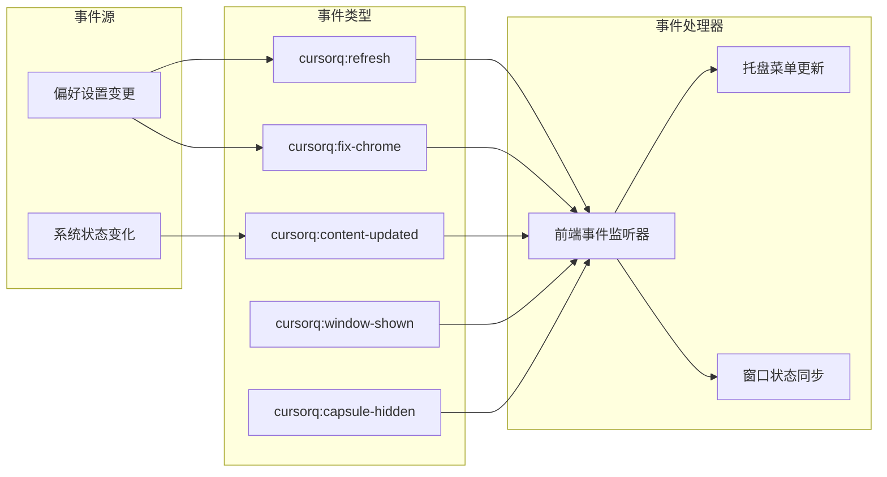

**图表来源**
- [main.ts:700-710](file://apps/tauri/src/main.ts#L700-L710)
- [lib.rs:641-648](file://apps/tauri/src-tauri/src/lib.rs#L641-L648)

#### 窗口状态同步

系统特别关注窗口状态的实时同步：

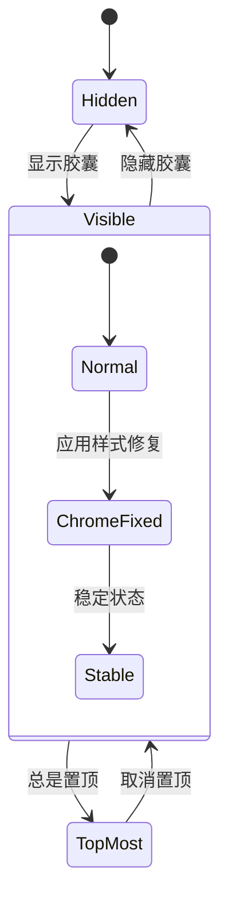

**图表来源**
- [lib.rs:242-273](file://apps/tauri/src-tauri/src/lib.rs#L242-L273)
- [lib.rs:587-614](file://apps/tauri/src-tauri/src/lib.rs#L587-L614)

**章节来源**
- [main.ts:700-710](file://apps/tauri/src/main.ts#L700-L710)
- [lib.rs:587-614](file://apps/tauri/src-tauri/src/lib.rs#L587-L614)

### 配置文件存储格式

#### JSON 配置结构

系统使用标准化的 JSON 格式存储配置信息：

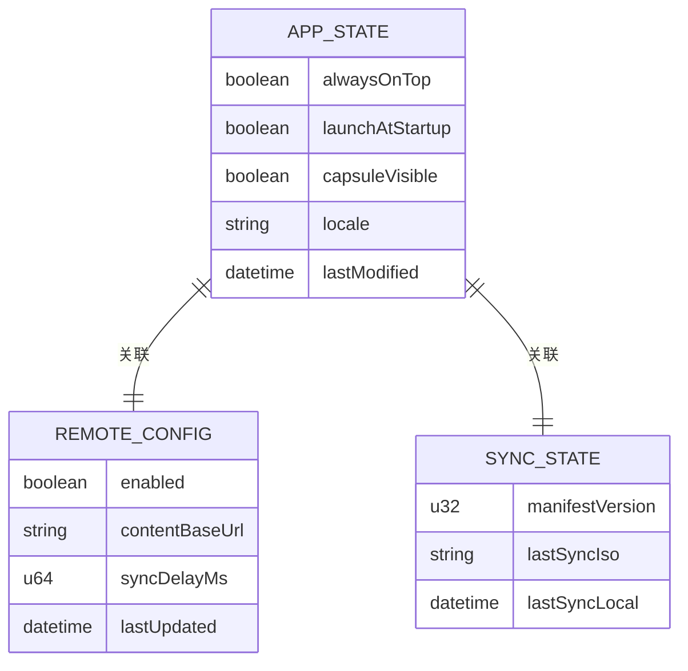

**图表来源**
- [prefs.rs:13-22](file://apps/tauri/src-tauri/src/prefs.rs#L13-L22)
- [sync.rs:12-56](file://apps/tauri/src-tauri/src/sync.rs#L12-L56)

#### 配置文件位置

| 文件类型 | 路径示例 | 用途 |
|---------|----------|------|
| 主配置 | `data/app-state.json` | 存储用户偏好设置 |
| 远程配置 | `config/remote.json` | 配置远程内容同步 |
| 同步状态 | `data/content-sync.json` | 记录内容同步状态 |
| 日志文件 | `logs/cursorq.log` | 记录系统运行日志 |

**章节来源**
- [paths.rs:54-87](file://apps/tauri/src-tauri/src/paths.rs#L54-L87)
- [remote.json.example:1-6](file://config/remote.json.example#L1-L6)

### 错误恢复机制

#### 异常处理策略

系统实现了多层次的错误处理和恢复机制：

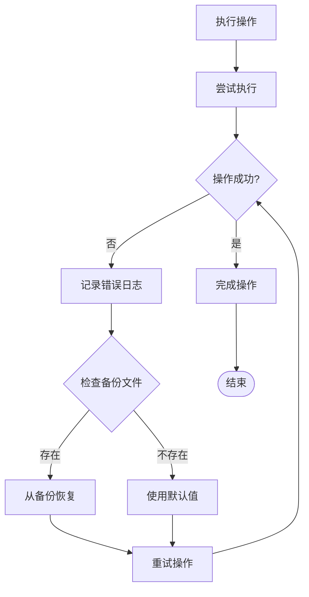

#### 自动恢复流程

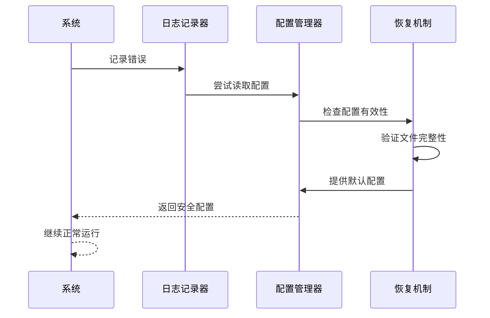

**图表来源**
- [sync.rs:63-69](file://apps/tauri/src-tauri/src/sync.rs#L63-L69)
- [lib.rs:770-772](file://apps/tauri/src-tauri/src/lib.rs#L770-L772)

**章节来源**
- [sync.rs:63-69](file://apps/tauri/src-tauri/src/sync.rs#L63-L69)
- [lib.rs:770-772](file://apps/tauri/src-tauri/src/lib.rs#L770-L772)

## 依赖关系分析

### 外部依赖

系统依赖于多个 Tauri 插件和服务：

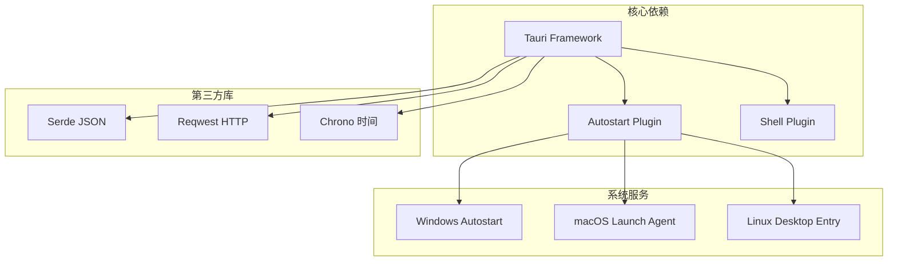

**图表来源**
- [default.json:6-20](file://apps/tauri/src-tauri/capabilities/default.json#L6-L20)

### 权限管理

系统通过能力配置文件管理权限：

| 权限类别 | 具体权限 | 用途描述 |
|---------|----------|----------|
| 核心窗口 | set-size, start-dragging | 窗口尺寸调整和拖拽 |
| 核心窗口 | show, hide, set-focus | 窗口显示控制 |
| 核心窗口 | set-focusable, set-shadow | 窗口属性设置 |
| 核心窗口 | set-always-on-top | 置顶显示功能 |
| 自启动 | enable, disable, is-enabled | 开机自启动管理 |

**章节来源**
- [default.json:6-20](file://apps/tauri/src-tauri/capabilities/default.json#L6-L20)

## 性能考虑

### 内存优化策略

系统采用了多项内存优化技术：

#### 懒加载机制
- 配置文件按需读取，避免不必要的磁盘访问
- 事件监听器延迟初始化，减少启动时间
- 资源文件按需加载，避免内存占用

#### 缓存策略
- 最近布局信息缓存，避免重复计算
- 事件处理结果缓存，提高响应速度
- 路径解析结果缓存，减少路径查找开销

### I/O 性能优化

#### 文件操作优化
- 批量写入操作，减少磁盘 I/O 次数
- 异步文件操作，避免阻塞主线程
- 文件锁定机制，防止并发访问冲突

#### 网络同步优化
- 连接池管理，复用网络连接
- 超时控制，避免长时间等待
- 错误重试机制，提高成功率

## 故障排除指南

### 常见问题诊断

#### 配置文件损坏

**症状表现**：
- 应用启动异常
- 偏好设置丢失
- 功能异常

**解决步骤**：
1. 备份当前配置文件
2. 删除损坏的配置文件
3. 重启应用以生成新的默认配置
4. 重新设置偏好选项

#### 权限不足问题

**症状表现**：
- 开机自启动设置失败
- 窗口置顶功能异常
- 文件写入失败

**解决步骤**：
1. 检查应用权限配置
2. 以管理员身份运行
3. 检查防火墙设置
4. 重新配置系统权限

#### 事件通信异常

**症状表现**：
- 界面状态不同步
- 操作无响应
- 实时更新失效

**解决步骤**：
1. 检查事件监听器状态
2. 重启应用进程
3. 清理事件队列
4. 重新建立连接

**章节来源**
- [lib.rs:770-772](file://apps/tauri/src-tauri/src/lib.rs#L770-L772)
- [prefs.rs:108-111](file://apps/tauri/src-tauri/src/prefs.rs#L108-L111)

### 调试工具使用

#### 日志分析

系统提供了完善的日志记录机制：


#### 性能监控

系统支持性能指标监控：
- 内存使用情况
- CPU 占用率
- 磁盘 I/O 活动
- 网络连接状态

**章节来源**
- [sync.rs:65-69](file://apps/tauri/src-tauri/src/sync.rs#L65-L69)
- [lib.rs:748-753](file://apps/tauri/src-tauri/src/lib.rs#L748-L753)

## 结论

CursorQ 的偏好设置管理系统展现了优秀的软件架构设计，通过模块化的设计实现了功能的高内聚低耦合。系统不仅提供了完整的偏好设置管理功能，还具备良好的扩展性和维护性。

### 主要优势

1. **架构清晰**：分层设计使得各组件职责明确，便于维护和扩展
2. **可靠性强**：完善的错误处理和恢复机制确保系统稳定性
3. **用户体验佳**：实时更新机制和直观的界面设计提升了用户满意度
4. **性能优秀**：优化的内存管理和 I/O 操作保证了系统响应速度

### 技术亮点

- **事件驱动架构**：通过 Tauri 事件系统实现松耦合的组件通信
- **智能默认值处理**：合理的默认值策略减少了用户配置负担
- **多平台兼容**：支持 Windows、macOS、Linux 等多个操作系统
- **配置文件管理**：标准化的 JSON 格式便于配置和迁移

该系统为类似的应用程序提供了优秀的参考模板，展示了如何构建一个功能完整、性能优异的偏好设置管理解决方案。

## 附录

### 使用示例

#### 基本配置示例

```javascript
// 获取当前胶囊可见状态
const isVisible = await invoke('get_capsule_visible');
console.log(`胶囊可见: ${isVisible}`);

// 设置胶囊可见性
await invoke('set_capsule_visible_cmd', { visible: true });

// 切换总是置顶状态
await invoke('toggle_always_on_top');
```

#### 高级配置示例

```javascript
// 获取应用路径信息
const paths = await invoke('get_app_paths');
console.log(`数据目录: ${paths.data}`);
console.log(`内容目录: ${paths.content}`);
```

### 配置指南

#### 远程配置文件

在 `config/remote.json` 中配置远程内容同步：

```json
{
  "enabled": true,
  "contentBaseUrl": "https://example.com/content",
  "syncDelayMs": 30000
}
```

#### 路径配置

系统支持多种部署模式，路径会根据运行环境自动调整：
- 便携式安装：`exe` 同级目录
- 标准安装：系统数据目录
- 开发模式：项目根目录

### 扩展开发

#### 添加新的偏好设置

1. 在 `prefs.rs` 中添加读取和写入函数
2. 在 `lib.rs` 中注册相应的命令
3. 在前端添加对应的 UI 控件
4. 更新托盘菜单和状态同步逻辑

#### 自定义事件处理

```typescript
// 监听自定义事件
listen('cursorq:custom-event', (event) => {
  // 处理事件逻辑
});
```