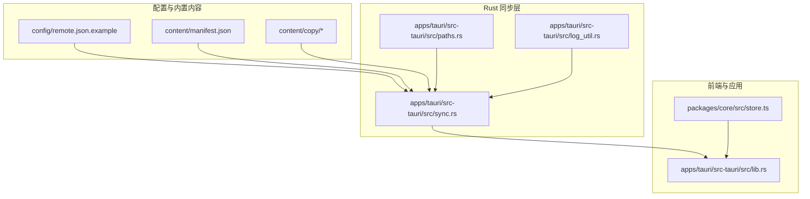
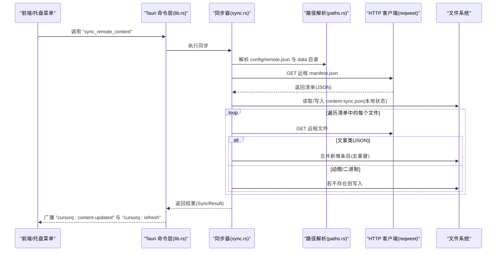
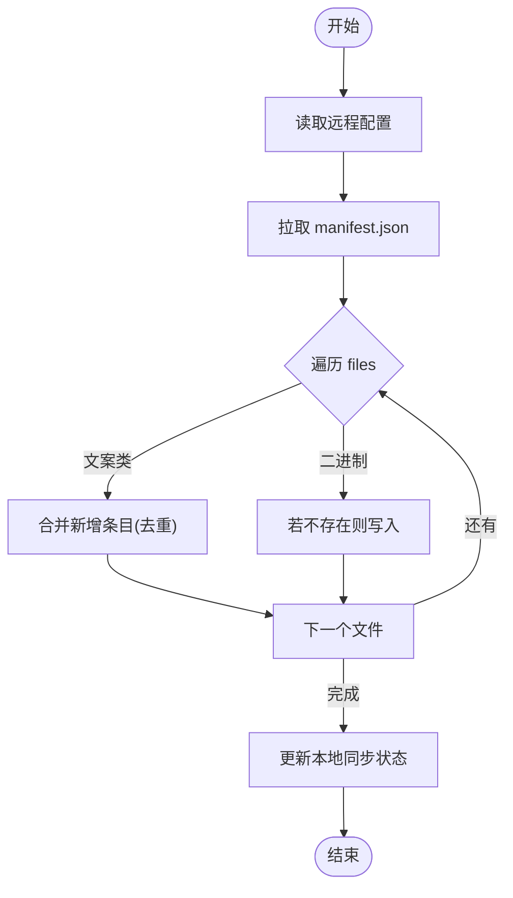
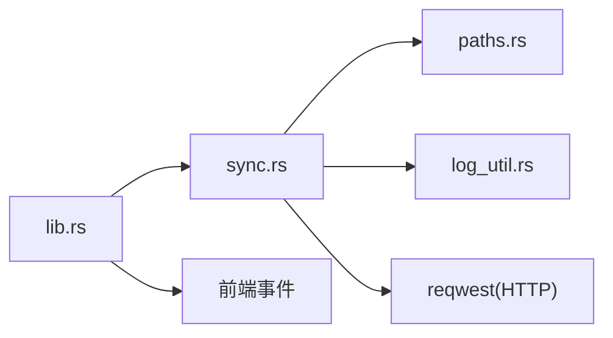

# 内容同步

<cite>
**本文引用的文件**
- [apps/tauri/src-tauri/src/sync.rs](file://apps/tauri/src-tauri/src/sync.rs)
- [apps/tauri/src-tauri/src/lib.rs](file://apps/tauri/src-tauri/src/lib.rs)
- [apps/tauri/src-tauri/src/paths.rs](file://apps/tauri/src-tauri/src/paths.rs)
- [apps/tauri/src-tauri/src/log_util.rs](file://apps/tauri/src-tauri/src/log_util.rs)
- [content/manifest.json](file://content/manifest.json)
- [content/copy/jokes.json](file://content/copy/jokes.json)
- [content/copy/states.json](file://content/copy/states.json)
- [config/remote.json.example](file://config/remote.json.example)
- [packages/core/src/store.ts](file://packages/core/src/store.ts)
</cite>

## 目录
1. [简介](#简介)
2. [项目结构](#项目结构)
3. [核心组件](#核心组件)
4. [架构总览](#架构总览)
5. [详细组件分析](#详细组件分析)
6. [依赖关系分析](#依赖关系分析)
7. [性能考量](#性能考量)
8. [故障排查指南](#故障排查指南)
9. [结论](#结论)
10. [附录](#附录)

## 简介
本文件系统性阐述 CursorQ 的“内容同步”能力，重点解释应用如何在本地与远程资源之间建立并维护一致性：包括版本控制、增量更新策略、冲突处理、缓存管理、网络异常处理、内容验证与完整性检查、以及回滚思路。文档同时给出可操作的同步流程示例与配置项说明，帮助开发者快速掌握最佳实践与扩展方法。

## 项目结构
围绕内容同步的关键目录与文件如下：
- 远程配置：config/remote.json.example
- 内置清单：content/manifest.json
- 内置文案：content/copy/jokes.json、content/copy/states.json
- 同步实现：apps/tauri/src-tauri/src/sync.rs
- 应用入口与命令桥接：apps/tauri/src-tauri/src/lib.rs
- 路径解析与数据目录：apps/tauri/src-tauri/src/paths.rs
- 日志工具：apps/tauri/src-tauri/src/log_util.rs
- 应用状态持久化（与同步相关字段）：packages/core/src/store.ts

**图表来源**
- [apps/tauri/src-tauri/src/sync.rs:1-372](file://apps/tauri/src-tauri/src/sync.rs#L1-L372)
- [apps/tauri/src-tauri/src/lib.rs:1-857](file://apps/tauri/src-tauri/src/lib.rs#L1-L857)
- [apps/tauri/src-tauri/src/paths.rs:1-142](file://apps/tauri/src-tauri/src/paths.rs#L1-L142)
- [apps/tauri/src-tauri/src/log_util.rs:1-16](file://apps/tauri/src-tauri/src/log_util.rs#L1-L16)
- [content/manifest.json:1-12](file://content/manifest.json#L1-L12)
- [content/copy/jokes.json:1-46](file://content/copy/jokes.json#L1-L46)
- [content/copy/states.json:1-14](file://content/copy/states.json#L1-L14)
- [config/remote.json.example:1-6](file://config/remote.json.example#L1-L6)
- [packages/core/src/store.ts:1-55](file://packages/core/src/store.ts#L1-L55)

**章节来源**
- [apps/tauri/src-tauri/src/sync.rs:1-372](file://apps/tauri/src-tauri/src/sync.rs#L1-L372)
- [apps/tauri/src-tauri/src/lib.rs:1-857](file://apps/tauri/src-tauri/src/lib.rs#L1-L857)
- [apps/tauri/src-tauri/src/paths.rs:1-142](file://apps/tauri/src-tauri/src/paths.rs#L1-L142)
- [apps/tauri/src-tauri/src/log_util.rs:1-16](file://apps/tauri/src-tauri/src/log_util.rs#L1-L16)
- [content/manifest.json:1-12](file://content/manifest.json#L1-L12)
- [content/copy/jokes.json:1-46](file://content/copy/jokes.json#L1-L46)
- [content/copy/states.json:1-14](file://content/copy/states.json#L1-L14)
- [config/remote.json.example:1-6](file://config/remote.json.example#L1-L6)
- [packages/core/src/store.ts:1-55](file://packages/core/src/store.ts#L1-L55)

## 核心组件
- 远程配置加载器：从 config/remote.json 读取启用开关、基础地址与同步延迟。
- 内容清单与路径解析：通过 content/manifest.json 获取目标文件列表，并解析本地目标路径。
- 同步执行器：拉取远程清单与文件，按类型进行增量合并或二进制落盘。
- 本地同步状态：记录清单版本与最近同步时间，用于版本控制与幂等判断。
- 前端桥接与事件：通过 Tauri 命令暴露同步接口，并在更新后向前端广播事件。
- 日志与错误处理：统一写入日志文件，便于排障。
- 应用状态持久化：保存应用偏好与状态，影响界面行为与刷新时机。

**章节来源**
- [apps/tauri/src-tauri/src/sync.rs:58-91](file://apps/tauri/src-tauri/src/sync.rs#L58-L91)
- [apps/tauri/src-tauri/src/sync.rs:261-367](file://apps/tauri/src-tauri/src/sync.rs#L261-L367)
- [apps/tauri/src-tauri/src/lib.rs:122-138](file://apps/tauri/src-tauri/src/lib.rs#L122-L138)
- [apps/tauri/src-tauri/src/paths.rs:81-87](file://apps/tauri/src-tauri/src/paths.rs#L81-L87)
- [apps/tauri/src-tauri/src/log_util.rs:8-15](file://apps/tauri/src-tauri/src/log_util.rs#L8-L15)
- [packages/core/src/store.ts:10-54](file://packages/core/src/store.ts#L10-L54)

## 架构总览
下图展示从用户触发到内容落地的完整链路，包括远程配置、清单拉取、文件合并、状态更新与前端通知。

**图表来源**
- [apps/tauri/src-tauri/src/lib.rs:122-138](file://apps/tauri/src-tauri/src/lib.rs#L122-L138)
- [apps/tauri/src-tauri/src/sync.rs:261-367](file://apps/tauri/src-tauri/src/sync.rs#L261-L367)
- [apps/tauri/src-tauri/src/paths.rs:81-87](file://apps/tauri/src-tauri/src/paths.rs#L81-L87)

## 详细组件分析

### 远程配置与同步延迟
- 配置项
  - enabled：是否启用远程同步
  - content_base_url：远程内容根地址
  - sync_delay_ms：后台定时同步延迟
- 默认值与容错：未找到配置时使用默认值；读取失败会记录日志并回退默认。
- 延迟读取：通过 sync_delay_ms() 暴露给调度线程使用。

**章节来源**
- [apps/tauri/src-tauri/src/sync.rs:12-32](file://apps/tauri/src-tauri/src/sync.rs#L12-L32)
- [apps/tauri/src-tauri/src/sync.rs:58-70](file://apps/tauri/src-tauri/src/sync.rs#L58-L70)
- [apps/tauri/src-tauri/src/sync.rs:369-371](file://apps/tauri/src-tauri/src/sync.rs#L369-L371)
- [config/remote.json.example:1-6](file://config/remote.json.example#L1-L6)

### 内容清单与版本控制
- 清单结构：包含 version 与 files 列表。
- 版本语义：以 manifest.version 作为“远程版本”，与本地记录比较决定是否需要更新。
- 幂等保护：若本地版本已达到或超过远程版本，则跳过下载与合并。

**章节来源**
- [apps/tauri/src-tauri/src/sync.rs:34-40](file://apps/tauri/src-tauri/src/sync.rs#L34-L40)
- [apps/tauri/src-tauri/src/sync.rs:347-353](file://apps/tauri/src-tauri/src/sync.rs#L347-L353)
- [content/manifest.json:1-12](file://content/manifest.json#L1-L12)

### 文件类型与合并策略
- 文案类文件（copy/*.json）
  - 合并规则：保留本地与手动条目，仅追加远程新条目；通过复合键去重。
  - 影响范围：jokes.json、states.json。
- 二进制资源（mascot/*.gif 等）
  - 合并规则：若本地不存在则写入；若已存在则跳过（允许用户手动替换）。
- 目标路径映射：根据清单相对路径映射到 content_dir 下的实际位置。

**图表来源**
- [apps/tauri/src-tauri/src/sync.rs:167-187](file://apps/tauri/src-tauri/src/sync.rs#L167-L187)
- [apps/tauri/src-tauri/src/sync.rs:123-153](file://apps/tauri/src-tauri/src/sync.rs#L123-L153)
- [apps/tauri/src-tauri/src/sync.rs:155-165](file://apps/tauri/src-tauri/src/sync.rs#L155-L165)
- [apps/tauri/src-tauri/src/sync.rs:297-345](file://apps/tauri/src-tauri/src/sync.rs#L297-L345)

**章节来源**
- [apps/tauri/src-tauri/src/sync.rs:123-153](file://apps/tauri/src-tauri/src/sync.rs#L123-L153)
- [apps/tauri/src-tauri/src/sync.rs:155-165](file://apps/tauri/src-tauri/src/sync.rs#L155-L165)
- [apps/tauri/src-tauri/src/sync.rs:167-187](file://apps/tauri/src-tauri/src/sync.rs#L167-L187)
- [content/copy/jokes.json:1-46](file://content/copy/jokes.json#L1-L46)
- [content/copy/states.json:1-14](file://content/copy/states.json#L1-L14)

### 本地同步状态与缓存管理
- 状态结构：记录 manifest_version 与 last_sync_iso。
- 存储位置：data 目录下的 content-sync.json。
- 更新时机：每次成功拉取清单后，取远程与本地最大版本，更新时间戳。

**章节来源**
- [apps/tauri/src-tauri/src/sync.rs:42-48](file://apps/tauri/src-tauri/src/sync.rs#L42-L48)
- [apps/tauri/src-tauri/src/sync.rs:83-91](file://apps/tauri/src-tauri/src/sync.rs#L83-L91)
- [apps/tauri/src-tauri/src/sync.rs:347-353](file://apps/tauri/src-tauri/src/sync.rs#L347-L353)
- [apps/tauri/src-tauri/src/paths.rs:85-87](file://apps/tauri/src-tauri/src/paths.rs#L85-L87)

### 前端集成与事件广播
- 命令暴露：提供 sync_remote_content 与 get_remote_config。
- 更新通知：当有新增内容时，向主窗口广播 "cursorq:content-updated" 与 "cursorq:refresh"。
- 触发方式：托盘菜单、手动调用或后台定时任务。

**章节来源**
- [apps/tauri/src-tauri/src/lib.rs:122-138](file://apps/tauri/src-tauri/src/lib.rs#L122-L138)
- [apps/tauri/src-tauri/src/lib.rs:664-713](file://apps/tauri/src-tauri/src/lib.rs#L664-L713)

### 启动时内置内容校验
- 作用：在不联网的情况下确认内置 content/ 可用性，避免运行期缺失。
- 流程：读取内置 manifest.json，检查清单中列出的文件是否都存在；若版本未落后则更新本地状态。
- 结果：返回初始化/就绪信息，便于 UI 提示。

**章节来源**
- [apps/tauri/src-tauri/src/sync.rs:189-258](file://apps/tauri/src-tauri/src/sync.rs#L189-L258)
- [content/manifest.json:1-12](file://content/manifest.json#L1-L12)

### 路径解析与数据目录
- 内置内容目录：优先 content/，否则回退到开发仓库根目录。
- 数据目录：便携布局在 config/data/logs 下，否则在构建产物附近或 .data 子目录。
- 关键路径：remote.json、content-sync.json、mascot 资源目录等。

**章节来源**
- [apps/tauri/src-tauri/src/paths.rs:37-48](file://apps/tauri/src-tauri/src/paths.rs#L37-L48)
- [apps/tauri/src-tauri/src/paths.rs:54-87](file://apps/tauri/src-tauri/src/paths.rs#L54-L87)

### 日志与错误处理
- 统一日志：所有错误与关键事件写入 logs/cursorq.log。
- 失败场景：配置读取失败、HTTP 请求失败、JSON 解析失败、文件写入失败等均会被记录。

**章节来源**
- [apps/tauri/src-tauri/src/log_util.rs:8-15](file://apps/tauri/src-tauri/src/log_util.rs#L8-L15)
- [apps/tauri/src-tauri/src/sync.rs:65-68](file://apps/tauri/src-tauri/src/sync.rs#L65-L68)
- [apps/tauri/src-tauri/src/sync.rs:304-333](file://apps/tauri/src-tauri/src/sync.rs#L304-L333)

### 应用状态与刷新联动
- 应用状态存储：包含 surpluses、snapshots、locale 等字段，影响界面语言与行为。
- 刷新联动：同步完成后触发刷新事件，确保 UI 展示最新文案与动图。

**章节来源**
- [packages/core/src/store.ts:10-54](file://packages/core/src/store.ts#L10-L54)
- [apps/tauri/src-tauri/src/lib.rs:128-138](file://apps/tauri/src-tauri/src/lib.rs#L128-L138)

## 依赖关系分析
- 同步器依赖路径解析模块确定配置与缓存文件位置。
- 同步器依赖 HTTP 客户端拉取远程清单与文件。
- 前端通过命令层调用同步器，并接收更新事件。
- 日志模块贯穿错误与调试信息输出。

**图表来源**
- [apps/tauri/src-tauri/src/sync.rs:1-11](file://apps/tauri/src-tauri/src/sync.rs#L1-L11)
- [apps/tauri/src-tauri/src/lib.rs:122-138](file://apps/tauri/src-tauri/src/lib.rs#L122-L138)

**章节来源**
- [apps/tauri/src-tauri/src/sync.rs:1-11](file://apps/tauri/src-tauri/src/sync.rs#L1-L11)
- [apps/tauri/src-tauri/src/lib.rs:122-138](file://apps/tauri/src-tauri/src/lib.rs#L122-L138)

## 性能考量
- 超时与并发：HTTP 客户端设置超时；清单与文件逐个拉取，无并行批量下载。
- 增量策略：仅对新增文案条目与缺失的二进制资源进行写入，减少 IO。
- 缓存复用：通过本地状态记录版本与时间，避免重复下载。
- 后台调度：支持延迟启动与定时任务，降低对前台体验的影响。

[本节为通用指导，无需具体文件分析]

## 故障排查指南
- 配置问题
  - 检查 config/remote.json 是否存在且格式正确；确认 content_base_url 不为空。
  - 如读取失败，查看 logs/cursorq.log 中的错误行。
- 清单与网络
  - 若 manifest.json 解析失败或 HTTP 错误，检查网络连通性与 URL 正确性。
- 权限与路径
  - 确认 data 目录可写；检查 content-sync.json 是否被外部程序占用。
- 内容未更新
  - 确认本地版本未落后于远程；检查是否启用了同步开关。
- 日志定位
  - 使用日志中的时间戳与上下文定位失败阶段。

**章节来源**
- [apps/tauri/src-tauri/src/sync.rs:58-70](file://apps/tauri/src-tauri/src/sync.rs#L58-L70)
- [apps/tauri/src-tauri/src/sync.rs:297-333](file://apps/tauri/src-tauri/src/sync.rs#L297-L333)
- [apps/tauri/src-tauri/src/log_util.rs:8-15](file://apps/tauri/src-tauri/src/log_util.rs#L8-L15)

## 结论
CursorQ 的内容同步以“清单驱动 + 类型化合并”为核心，通过版本号实现幂等与增量更新，通过本地状态缓存避免重复下载，并在更新后主动通知前端刷新。该设计兼顾了易用性与稳定性，适合在弱网与便携部署场景下可靠运行。开发者可在现有基础上扩展更多文件类型、引入并行下载或更精细的冲突策略。

[本节为总结，无需具体文件分析]

## 附录

### 同步流程示例（手动触发）
- 步骤
  - 用户在托盘菜单选择“同步文案/动图”
  - 前端调用 sync_remote_content 命令
  - 后端拉取远程 manifest.json
  - 逐个文件判断类型并合并
  - 更新本地 content-sync.json
  - 成功后广播更新事件，触发界面刷新

**章节来源**
- [apps/tauri/src-tauri/src/lib.rs:664-713](file://apps/tauri/src-tauri/src/lib.rs#L664-L713)
- [apps/tauri/src-tauri/src/sync.rs:261-367](file://apps/tauri/src-tauri/src/sync.rs#L261-L367)

### 配置选项说明
- enabled：布尔，开启/关闭远程同步
- content_base_url：字符串，远程内容根地址
- sync_delay_ms：整数，后台定时同步延迟（毫秒）

**章节来源**
- [apps/tauri/src-tauri/src/sync.rs:12-32](file://apps/tauri/src-tauri/src/sync.rs#L12-L32)
- [config/remote.json.example:1-6](file://config/remote.json.example#L1-L6)

### 内容验证与完整性检查建议
- 清单校验：确保 files 列表中的路径均可映射到实际文件。
- 二进制校验：对关键动图可增加校验位（如校验和），在合并前比对。
- 回滚思路：当前未实现自动回滚；可在 data 目录下维护“上一版本”快照，必要时回退 content-sync.json 与受影响文件。

[本节为扩展建议，无需具体文件分析]