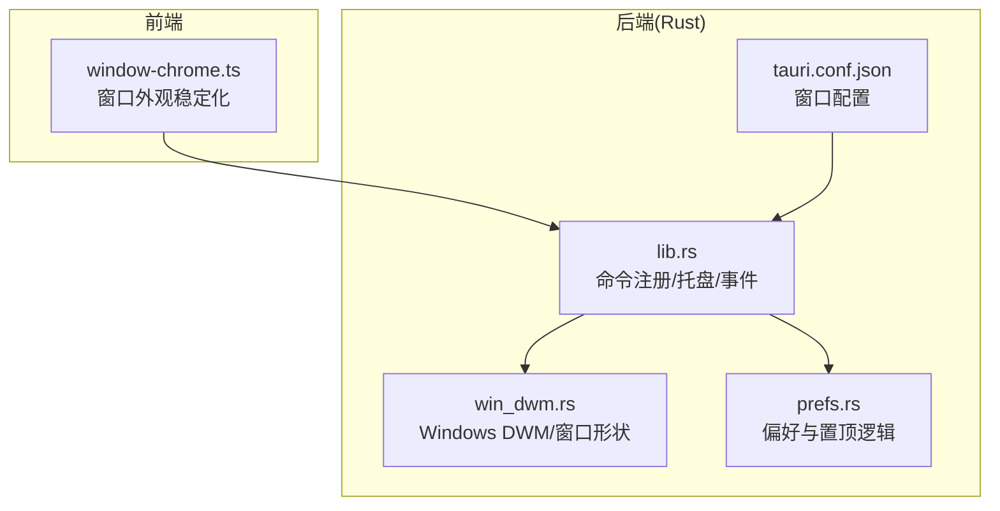
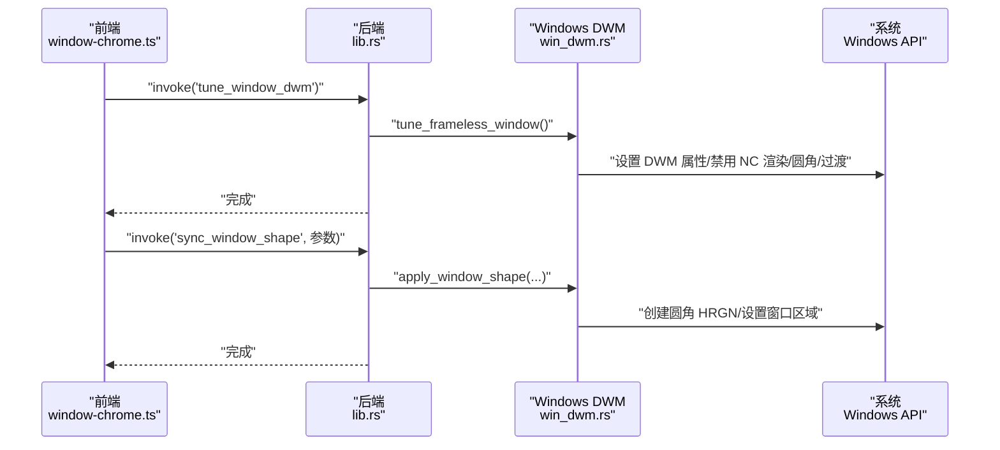
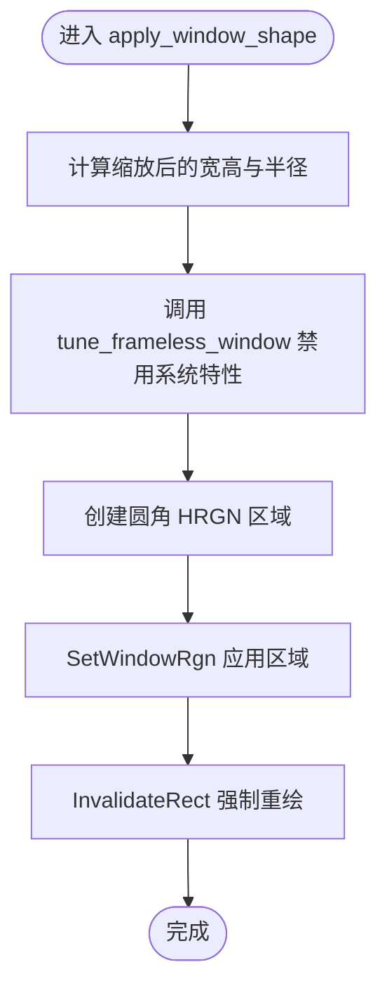
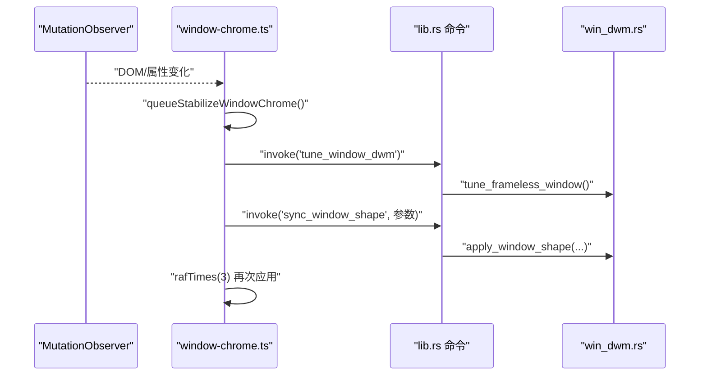
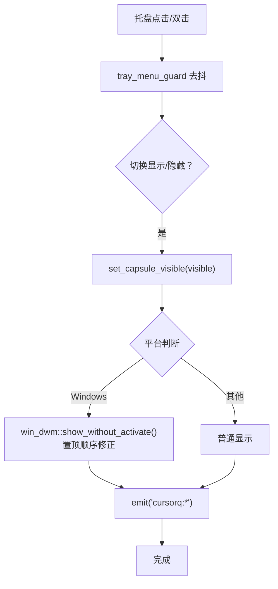
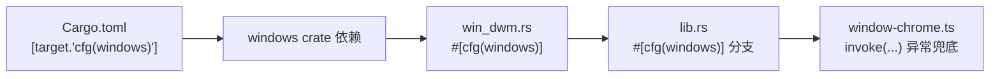
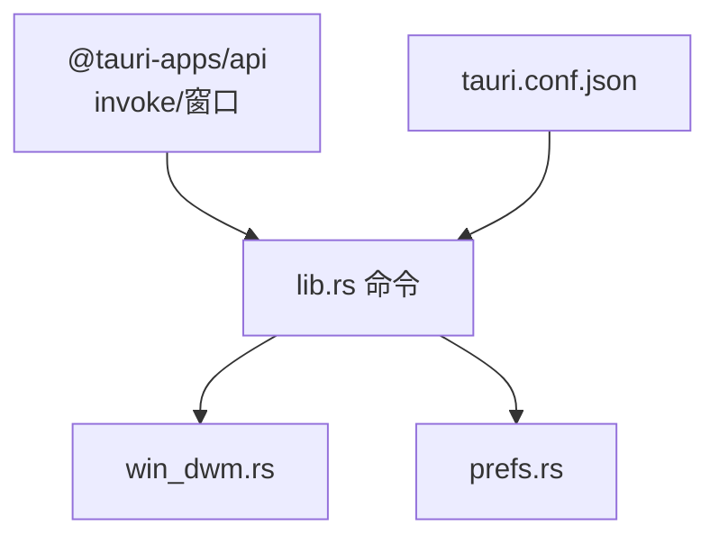

# 平台特定功能

<cite>
**本文引用的文件**
- [win_dwm.rs](file://apps/tauri/src-tauri/src/win_dwm.rs)
- [lib.rs](file://apps/tauri/src-tauri/src/lib.rs)
- [Cargo.toml](file://apps/tauri/src-tauri/Cargo.toml)
- [tauri.conf.json](file://apps/tauri/src-tauri/tauri.conf.json)
- [window-chrome.ts](file://apps/tauri/src/window-chrome.ts)
- [main.rs](file://apps/tauri/src-tauri/src/main.rs)
- [prefs.rs](file://apps/tauri/src-tauri/src/prefs.rs)
</cite>

## 目录
1. [引言](#引言)
2. [项目结构](#项目结构)
3. [核心组件](#核心组件)
4. [架构总览](#架构总览)
5. [详细组件分析](#详细组件分析)
6. [依赖关系分析](#依赖关系分析)
7. [性能考量](#性能考量)
8. [故障排查指南](#故障排查指南)
9. [结论](#结论)
10. [附录](#附录)

## 引言
本文件聚焦 CursorQ 的平台特定功能，尤其是 Windows 平台的 DWM 窗口处理、透明效果与系统集成。文档将系统性阐述跨平台兼容策略、条件编译与平台检测机制，并给出窗口管理、系统托盘与通知处理的具体实现与扩展建议，帮助开发者理解如何在现有基础上扩展其他平台支持。

## 项目结构
CursorQ 的桌面端采用 Tauri v2 架构，前端使用 TypeScript/Vite，后端 Rust 提供命令接口与平台特定能力。平台相关逻辑主要集中在：
- Windows 特定：DWM 窗口属性调整、窗口形状裁剪、置顶与无激活显示等
- 跨平台通用：托盘菜单、窗口事件、命令注册与调用
- 配置层：Tauri 配置定义窗口装饰、透明、置顶、任务栏跳过等行为

图表来源
- [window-chrome.ts:1-99](file://apps/tauri/src/window-chrome.ts#L1-L99)
- [lib.rs:716-800](file://apps/tauri/src-tauri/src/lib.rs#L716-L800)
- [win_dwm.rs:1-231](file://apps/tauri/src-tauri/src/win_dwm.rs#L1-L231)
- [prefs.rs:78-97](file://apps/tauri/src-tauri/src/prefs.rs#L78-L97)
- [tauri.conf.json:13-30](file://apps/tauri/src-tauri/tauri.conf.json#L13-L30)

章节来源
- [tauri.conf.json:13-30](file://apps/tauri/src-tauri/tauri.conf.json#L13-L30)
- [Cargo.toml:26-33](file://apps/tauri/src-tauri/Cargo.toml#L26-L33)

## 核心组件
- Windows DWM 窗口处理模块：负责关闭非客户区渲染、圆角、系统背景、过渡动画等，以消除透明胶囊窗的灰边与白边问题
- 前端窗口外观稳定化模块：统一修复 WebView/DOM/托盘变化导致的白边，避免通过尺寸微调规避
- 托盘与窗口事件：跨平台托盘菜单、窗口可见性切换、置顶与开机自启等偏好
- 条件编译与平台检测：基于 cfg(windows) 的条件编译与平台分支逻辑

章节来源
- [win_dwm.rs:1-231](file://apps/tauri/src-tauri/src/win_dwm.rs#L1-L231)
- [window-chrome.ts:1-99](file://apps/tauri/src/window-chrome.ts#L1-L99)
- [lib.rs:282-387](file://apps/tauri/src-tauri/src/lib.rs#L282-L387)
- [prefs.rs:78-97](file://apps/tauri/src-tauri/src/prefs.rs#L78-L97)

## 架构总览
下图展示从前端到后端的调用链路，以及 Windows 特定路径的介入点：

图表来源
- [window-chrome.ts:46-77](file://apps/tauri/src/window-chrome.ts#L46-L77)
- [lib.rs:412-449](file://apps/tauri/src-tauri/src/lib.rs#L412-L449)
- [win_dwm.rs:90-197](file://apps/tauri/src-tauri/src/win_dwm.rs#L90-L197)

## 详细组件分析

### Windows DWM 窗口处理与透明效果
- 功能目标：解决透明无边框窗口在 Windows 上出现的灰边/白边问题，确保胶囊窗边缘平滑
- 关键策略：
  - 禁用非客户区渲染与圆角，避免系统阴影/圆角叠加
  - 关闭系统背景与过渡动画，减少闪烁
  - 使用 HRGN 圆角裁剪替代 WebView2 默认矩形
  - 无激活显示与置顶顺序修正，避免抢焦点与被压至底层
- 实现要点：
  - 通过 DWM 属性控制窗口阴影、圆角、边框颜色、可见边框厚度、标题栏颜色、宿主画刷与允许 NC 绘制
  - 使用 GDI 创建圆角区域并应用到窗口，随后强制重绘
  - 对置顶状态进行 Win32 SetWindowPos 修正，配合 SW_SHOWNOACTIVATE 显示而不抢焦点

图表来源
- [win_dwm.rs:170-197](file://apps/tauri/src-tauri/src/win_dwm.rs#L170-L197)

章节来源
- [win_dwm.rs:90-197](file://apps/tauri/src-tauri/src/win_dwm.rs#L90-L197)

### 前端窗口外观稳定化
- 目标：在 WebView/DOM/托盘变化后统一修复白边，避免各处自行 resize±1 导致的闪烁
- 机制：
  - 绑定状态读取器，读取当前逻辑高度与展开状态
  - 去抖与串行化执行，保证连续变更只修复一次
  - 先调用后端 DWM 调整，再应用窗口形状，最后通过多次 requestAnimationFrame 稳定
  - 安装 MutationObserver 自动兜底

图表来源
- [window-chrome.ts:36-87](file://apps/tauri/src/window-chrome.ts#L36-L87)
- [lib.rs:412-449](file://apps/tauri/src-tauri/src/lib.rs#L412-L449)
- [win_dwm.rs:170-197](file://apps/tauri/src-tauri/src/win_dwm.rs#L170-L197)

章节来源
- [window-chrome.ts:1-99](file://apps/tauri/src/window-chrome.ts#L1-L99)

### 托盘与窗口事件（跨平台）
- 托盘菜单：
  - 动态构建菜单项，包含显示/隐藏胶囊、语言切换、置顶、开机自启、刷新、同步、退出
  - 处理菜单点击与托盘图标事件，带去抖保护避免 Windows 左键重复触发
- 窗口可见性与置顶：
  - 显示时根据平台选择无激活显示或普通显示
  - 置顶时在 Windows 上调用 DWM 置顶顺序修正与无激活显示
- 事件与通知：
  - 内容更新后向前端发出事件，驱动前端重新修复外观

图表来源
- [lib.rs:242-273](file://apps/tauri/src-tauri/src/lib.rs#L242-L273)
- [lib.rs:664-713](file://apps/tauri/src-tauri/src/lib.rs#L664-L713)
- [prefs.rs:78-97](file://apps/tauri/src-tauri/src/prefs.rs#L78-L97)

章节来源
- [lib.rs:282-387](file://apps/tauri/src-tauri/src/lib.rs#L282-L387)
- [lib.rs:664-713](file://apps/tauri/src-tauri/src/lib.rs#L664-L713)
- [prefs.rs:78-97](file://apps/tauri/src-tauri/src/prefs.rs#L78-L97)

### 条件编译与平台检测
- 条件编译：
  - Windows 专属模块与依赖仅在 Windows 目标下启用
  - 后端命令与偏好逻辑按平台分支执行
- 平台检测：
  - 使用 cfg(windows) 控制编译路径
  - 前端通过后端命令返回值判断是否为 Windows（非 Windows 路径静默）

图表来源
- [Cargo.toml:26-33](file://apps/tauri/src-tauri/Cargo.toml#L26-L33)
- [win_dwm.rs:4-4](file://apps/tauri/src-tauri/src/win_dwm.rs#L4-L4)
- [lib.rs:250-253](file://apps/tauri/src-tauri/src/lib.rs#L250-L253)
- [window-chrome.ts:69-71](file://apps/tauri/src/window-chrome.ts#L69-L71)

章节来源
- [Cargo.toml:26-33](file://apps/tauri/src-tauri/Cargo.toml#L26-L33)
- [win_dwm.rs:4-4](file://apps/tauri/src-tauri/src/win_dwm.rs#L4-L4)
- [lib.rs:250-253](file://apps/tauri/src-tauri/src/lib.rs#L250-L253)
- [window-chrome.ts:69-71](file://apps/tauri/src/window-chrome.ts#L69-L71)

### 窗口配置与系统集成
- 窗口配置：
  - 无装饰、透明、置顶、跳过任务栏、不可聚焦、初始不可见
  - 背景色设为全透明，关闭阴影
- 系统集成：
  - Windows 子系统设置为 GUI（非控制台），避免命令行窗口
  - 托盘图标与菜单、开机自启动插件集成

章节来源
- [tauri.conf.json:13-30](file://apps/tauri/src-tauri/tauri.conf.json#L13-L30)
- [main.rs:1-1](file://apps/tauri/src-tauri/src/main.rs#L1-L1)

## 依赖关系分析
- 后端依赖：
  - tauri 与托盘/自动启动插件
  - windows crate（仅 Windows）
- 前端依赖：
  - @tauri-apps/api（窗口、命令调用）
- 调用关系：
  - 前端通过 invoke 调用后端命令
  - 后端命令在 Windows 下调用 win_dwm.rs 的函数
  - 托盘事件与窗口事件在 lib.rs 中集中处理

图表来源
- [window-chrome.ts:4-6](file://apps/tauri/src/window-chrome.ts#L4-L6)
- [lib.rs:720-736](file://apps/tauri/src-tauri/src/lib.rs#L720-L736)
- [win_dwm.rs:1-231](file://apps/tauri/src-tauri/src/win_dwm.rs#L1-L231)
- [prefs.rs:1-145](file://apps/tauri/src-tauri/src/prefs.rs#L1-L145)
- [tauri.conf.json:1-48](file://apps/tauri/src-tauri/tauri.conf.json#L1-L48)

章节来源
- [lib.rs:716-800](file://apps/tauri/src-tauri/src/lib.rs#L716-L800)
- [Cargo.toml:15-33](file://apps/tauri/src-tauri/Cargo.toml#L15-L33)

## 性能考量
- 去抖与串行化：前端对外观修复进行去抖与串行化，降低频繁重绘与 DWM 设置开销
- 批量修复：通过一次性调用后端命令并配合多次 RAF，减少闪烁与抖动
- 置顶顺序修正：仅在置顶状态变更时进行 Win32 SetWindowPos，避免不必要的系统调用
- 资源释放：HRGN 创建后及时应用并重绘，避免无效资源占用

## 故障排查指南
- 透明胶囊出现白边/灰边
  - 确认前端已调用外观稳定化流程
  - 检查后端命令是否成功（Windows 下不会抛错，非 Windows 会静默）
  - 核对窗口配置是否为透明、无装饰、无阴影
- 点击托盘菜单后立即显示/隐藏失效
  - 检查 tray_menu_guard 是否生效（Windows 左键重复触发保护）
  - 确认菜单事件处理中未过早再次触发显示/隐藏
- 置顶后窗口被压到底层
  - 确认 Windows 下已调用置顶顺序修正与无激活显示
  - 检查窗口 Z-order 设置标志位
- 前端无法加载资源
  - 检查资产协议作用域与路径权限
  - 确认 data URL 方案用于媒体资源加载

章节来源
- [window-chrome.ts:69-71](file://apps/tauri/src/window-chrome.ts#L69-L71)
- [lib.rs:186-230](file://apps/tauri/src-tauri/src/lib.rs#L186-L230)
- [lib.rs:693-700](file://apps/tauri/src-tauri/src/lib.rs#L693-L700)
- [tauri.conf.json:31-37](file://apps/tauri/src-tauri/tauri.conf.json#L31-L37)

## 结论
CursorQ 在 Windows 平台上通过 DWM 属性与 HRGN 裁剪实现了高质量的透明胶囊窗体验，并结合前端外观稳定化与托盘事件去抖，提供了流畅稳定的用户界面。后端采用条件编译与平台分支，既保证了跨平台一致性，又能在 Windows 上进行深度优化。该设计为扩展其他平台提供了清晰的参考路径。

## 附录

### 平台适配示例与配置指南
- 新增平台支持步骤
  - 在后端新增平台模块（如 macos.rs、linux.rs），并在 lib.rs 中按平台分支调用
  - 在 Cargo.toml 中为目标平台添加依赖（如 macOS 使用 tauri-plugin-dialog 等）
  - 在前端通过命令返回值判断平台，决定是否执行平台特定逻辑
- 配置建议
  - 窗口透明与无装饰需在配置中开启
  - 置顶与任务栏跳过需在配置中设置
  - 资产协议作用域需允许内容目录访问
- 注意事项
  - 避免在非 Windows 平台调用 Windows API
  - 所有平台特定逻辑均需通过条件编译隔离
  - 前端兜底异常，避免因平台差异导致崩溃

章节来源
- [Cargo.toml:26-33](file://apps/tauri/src-tauri/Cargo.toml#L26-L33)
- [tauri.conf.json:13-30](file://apps/tauri/src-tauri/tauri.conf.json#L13-L30)
- [window-chrome.ts:69-71](file://apps/tauri/src/window-chrome.ts#L69-L71)