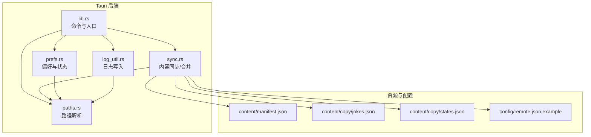
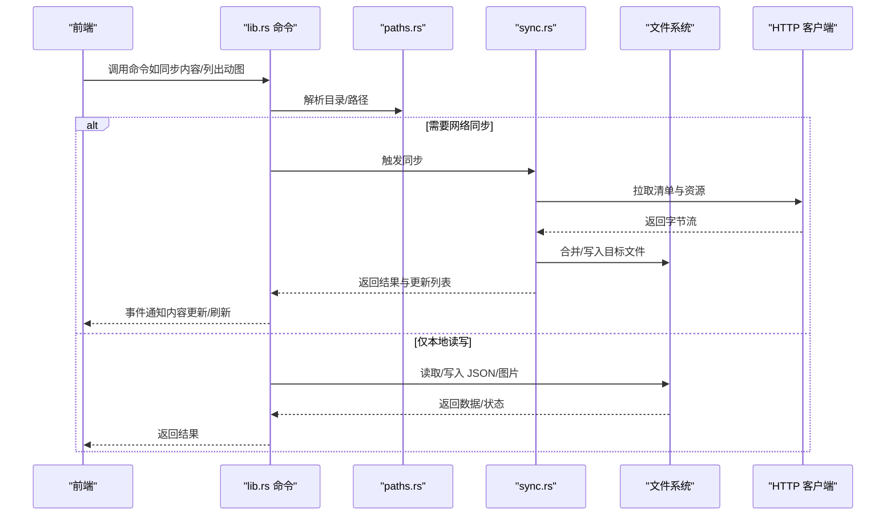
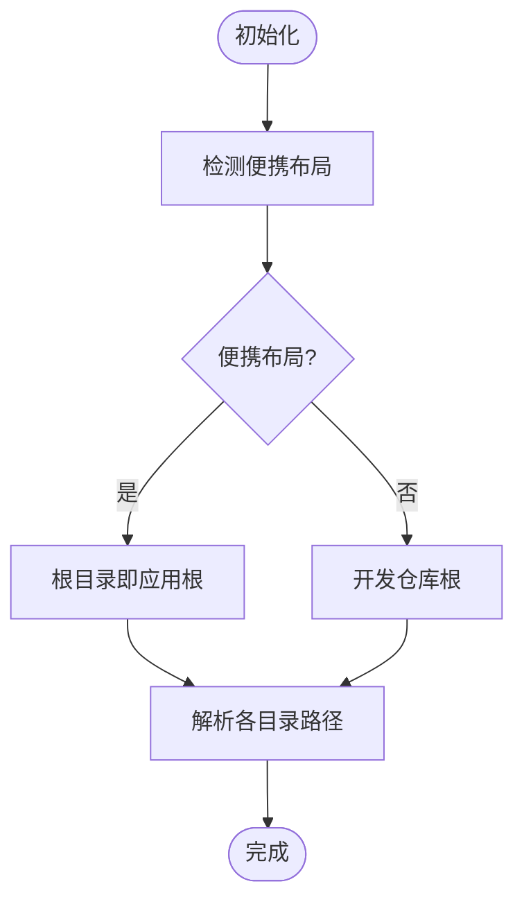
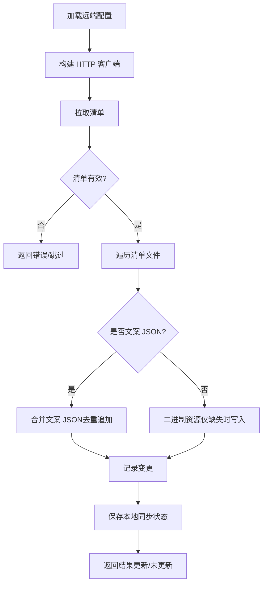
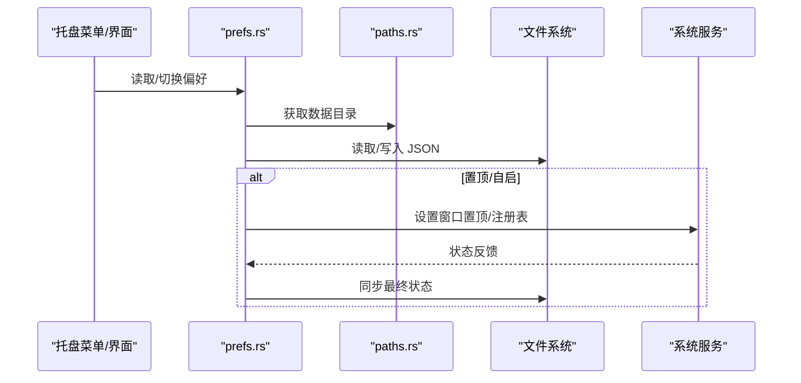
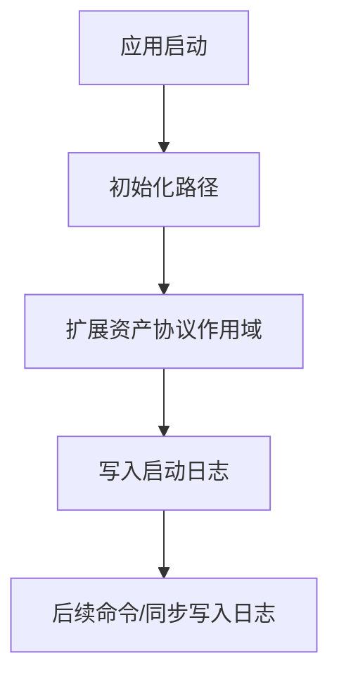
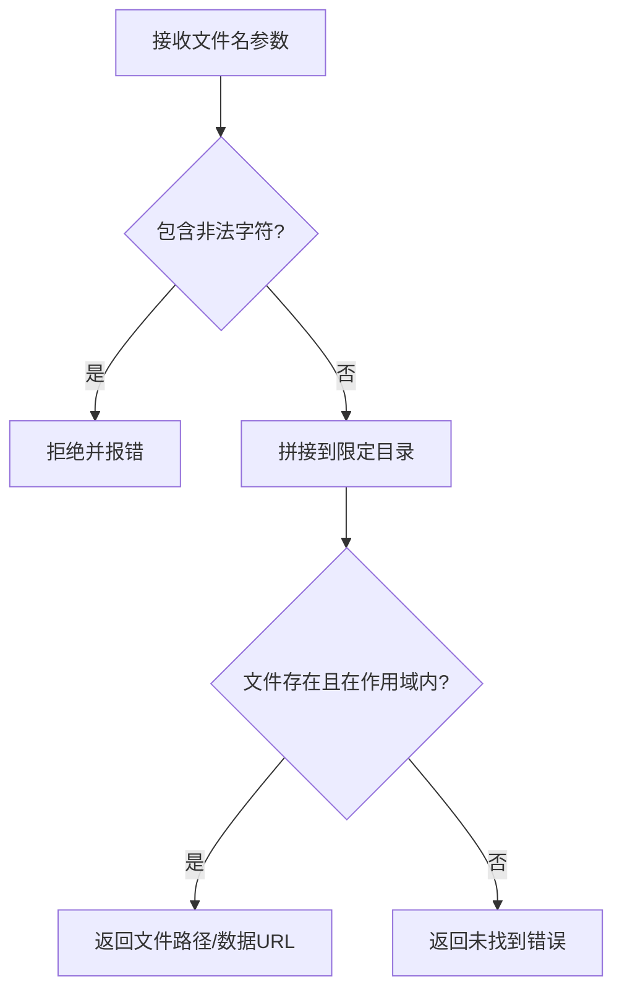
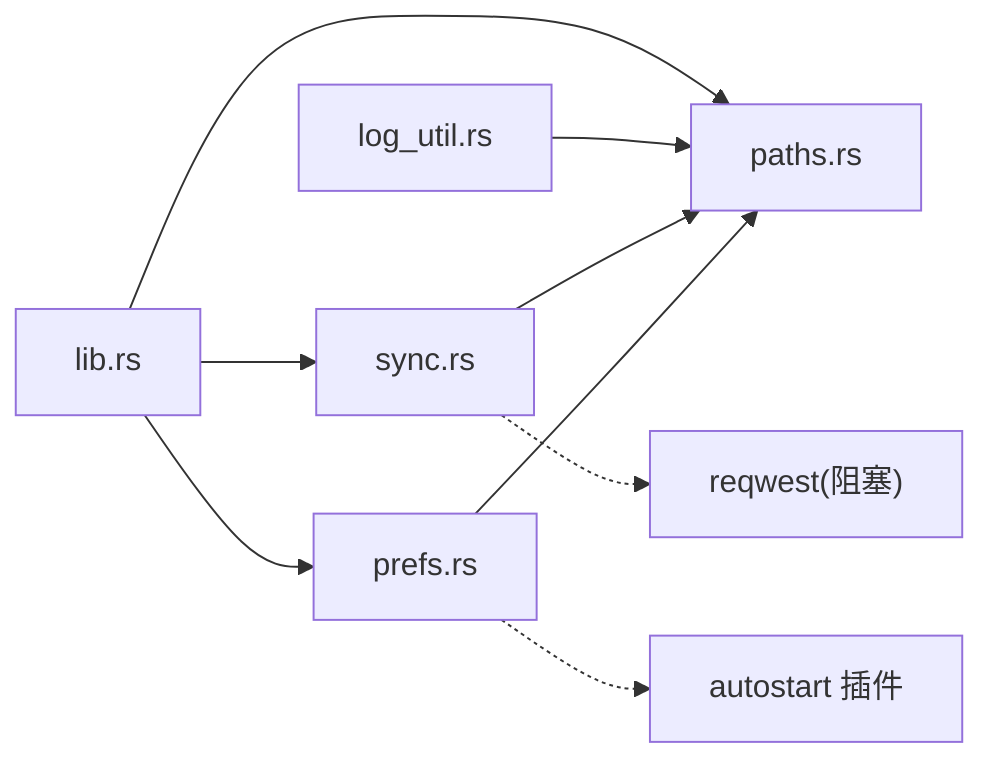

# 文件系统访问

<cite>
**本文引用的文件**
- [apps/tauri/src-tauri/src/paths.rs](file://apps/tauri/src-tauri/src/paths.rs)
- [apps/tauri/src-tauri/src/lib.rs](file://apps/tauri/src-tauri/src/lib.rs)
- [apps/tauri/src-tauri/src/sync.rs](file://apps/tauri/src-tauri/src/sync.rs)
- [apps/tauri/src-tauri/src/prefs.rs](file://apps/tauri/src-tauri/src/prefs.rs)
- [apps/tauri/src-tauri/src/log_util.rs](file://apps/tauri/src-tauri/src/log_util.rs)
- [apps/tauri/src-tauri/Cargo.toml](file://apps/tauri/src-tauri/Cargo.toml)
- [apps/tauri/src-tauri/tauri.conf.json](file://apps/tauri/src-tauri/tauri.conf.json)
- [content/manifest.json](file://content/manifest.json)
- [content/copy/jokes.json](file://content/copy/jokes.json)
- [content/copy/states.json](file://content/copy/states.json)
- [config/remote.json.example](file://config/remote.json.example)
</cite>

## 目录
1. [简介](#简介)
2. [项目结构](#项目结构)
3. [核心组件](#核心组件)
4. [架构总览](#架构总览)
5. [组件详解](#组件详解)
6. [依赖关系分析](#依赖关系分析)
7. [性能考量](#性能考量)
8. [故障排查指南](#故障排查指南)
9. [结论](#结论)
10. [附录](#附录)

## 简介
本文件系统访问文档聚焦 CursorQ 的文件系统能力，涵盖数据目录结构、路径解析与安全校验、跨平台差异处理、内容同步与合并策略、以及日志与状态持久化机制。目标是帮助开发者理解 CursorQ 如何安全、可靠地访问和管理文件系统，并提供可复用的最佳实践与排障建议。

## 项目结构
CursorQ 的文件系统相关实现主要集中在 Tauri 后端模块中，围绕“路径解析”“内容同步”“偏好与状态”“日志”四大子系统协同工作，前端通过命令调用后端接口完成文件系统操作。

图表来源
- [apps/tauri/src-tauri/src/lib.rs:716-800](file://apps/tauri/src-tauri/src/lib.rs#L716-L800)
- [apps/tauri/src-tauri/src/paths.rs:1-142](file://apps/tauri/src-tauri/src/paths.rs#L1-L142)
- [apps/tauri/src-tauri/src/sync.rs:1-372](file://apps/tauri/src-tauri/src/sync.rs#L1-L372)
- [apps/tauri/src-tauri/src/prefs.rs:1-145](file://apps/tauri/src-tauri/src/prefs.rs#L1-L145)
- [apps/tauri/src-tauri/src/log_util.rs:1-16](file://apps/tauri/src-tauri/src/log_util.rs#L1-L16)
- [content/manifest.json:1-12](file://content/manifest.json#L1-L12)
- [content/copy/jokes.json:1-46](file://content/copy/jokes.json#L1-L46)
- [content/copy/states.json:1-14](file://content/copy/states.json#L1-L14)
- [config/remote.json.example:1-6](file://config/remote.json.example#L1-L6)

章节来源
- [apps/tauri/src-tauri/src/lib.rs:716-800](file://apps/tauri/src-tauri/src/lib.rs#L716-L800)
- [apps/tauri/src-tauri/src/paths.rs:1-142](file://apps/tauri/src-tauri/src/paths.rs#L1-L142)
- [apps/tauri/src-tauri/src/sync.rs:1-372](file://apps/tauri/src-tauri/src/sync.rs#L1-L372)
- [apps/tauri/src-tauri/src/prefs.rs:1-145](file://apps/tauri/src-tauri/src/prefs.rs#L1-L145)
- [apps/tauri/src-tauri/src/log_util.rs:1-16](file://apps/tauri/src-tauri/src/log_util.rs#L1-L16)
- [content/manifest.json:1-12](file://content/manifest.json#L1-L12)
- [content/copy/jokes.json:1-46](file://content/copy/jokes.json#L1-L46)
- [content/copy/states.json:1-14](file://content/copy/states.json#L1-L14)
- [config/remote.json.example:1-6](file://config/remote.json.example#L1-L6)

## 核心组件
- 路径解析与目录布局
  - 应用根目录、便携布局识别、内容目录、数据目录、日志目录、配置目录、缓存目录、吉祥物资源目录等均通过统一模块解析，确保跨平台一致性与可移植性。
- 内容同步与合并
  - 从远端拉取清单与资源，按类型进行差异化合并：文案 JSON 采用“追加新项、保留本地”的策略；二进制资源采用“仅在缺失时写入”的策略，避免覆盖用户手动添加的资源。
- 偏好与状态持久化
  - 将用户偏好（如置顶、开机自启、胶囊可见性等）与通用应用状态（如语言）以 JSON 形式写入数据目录，提供读写与合并能力。
- 日志与运行时信息
  - 统一写入日志目录，便于问题诊断与审计。
- 安全与权限控制
  - 通过资产协议作用域限制、命令参数校验、路径规范化与安全检查，降低越权与注入风险。

章节来源
- [apps/tauri/src-tauri/src/paths.rs:1-142](file://apps/tauri/src-tauri/src/paths.rs#L1-L142)
- [apps/tauri/src-tauri/src/sync.rs:1-372](file://apps/tauri/src-tauri/src/sync.rs#L1-L372)
- [apps/tauri/src-tauri/src/prefs.rs:1-145](file://apps/tauri/src-tauri/src/prefs.rs#L1-L145)
- [apps/tauri/src-tauri/src/log_util.rs:1-16](file://apps/tauri/src-tauri/src/log_util.rs#L1-L16)

## 架构总览
下图展示文件系统访问的关键流程：命令入口、路径解析、资源读取/写入、网络同步与事件通知。

图表来源
- [apps/tauri/src-tauri/src/lib.rs:31-151](file://apps/tauri/src-tauri/src/lib.rs#L31-L151)
- [apps/tauri/src-tauri/src/paths.rs:33-98](file://apps/tauri/src-tauri/src/paths.rs#L33-L98)
- [apps/tauri/src-tauri/src/sync.rs:261-367](file://apps/tauri/src-tauri/src/sync.rs#L261-L367)

章节来源
- [apps/tauri/src-tauri/src/lib.rs:31-151](file://apps/tauri/src-tauri/src/lib.rs#L31-L151)
- [apps/tauri/src-tauri/src/paths.rs:33-98](file://apps/tauri/src-tauri/src/paths.rs#L33-L98)
- [apps/tauri/src-tauri/src/sync.rs:261-367](file://apps/tauri/src-tauri/src/sync.rs#L261-L367)

## 组件详解

### 路径解析与目录布局
- 便携布局检测
  - 通过判断根目录是否包含特定子目录组合，决定使用“便携布局”还是“开发仓库布局”，从而确定内容与数据目录位置。
- 目录职责
  - 应用根目录：程序入口与资源根。
  - 内容目录：内置文案与吉祥物资源，支持离线使用。
  - 数据目录：用户偏好、状态、日志、内容同步缓存等。
  - 配置目录：远程配置文件存放处。
  - 日志目录：运行日志输出。
- 跨平台路径处理
  - 使用标准库路径工具进行拼接与规范化，避免硬编码分隔符导致的跨平台问题。

图表来源
- [apps/tauri/src-tauri/src/paths.rs:6-35](file://apps/tauri/src-tauri/src/paths.rs#L6-L35)

章节来源
- [apps/tauri/src-tauri/src/paths.rs:6-98](file://apps/tauri/src-tauri/src/paths.rs#L6-L98)

### 内容同步与合并策略
- 清单与资源
  - 通过清单文件声明需要的资源列表与版本号，确保内置内容完整性与一致性。
- 合并策略
  - 文案 JSON（jokes/states）：仅追加远端新条目，保留本地与手动条目，避免覆盖用户修改。
  - 二进制资源（图片/GIF）：仅在目标不存在时写入，保护用户手动放入的资源。
- 错误处理与日志
  - 对网络请求、JSON 解析、文件读写失败进行降级与记录，保证稳定性。

图表来源
- [apps/tauri/src-tauri/src/sync.rs:58-91](file://apps/tauri/src-tauri/src/sync.rs#L58-L91)
- [apps/tauri/src-tauri/src/sync.rs:122-165](file://apps/tauri/src-tauri/src/sync.rs#L122-L165)
- [apps/tauri/src-tauri/src/sync.rs:261-367](file://apps/tauri/src-tauri/src/sync.rs#L261-L367)
- [content/manifest.json:1-12](file://content/manifest.json#L1-L12)

章节来源
- [apps/tauri/src-tauri/src/sync.rs:122-165](file://apps/tauri/src-tauri/src/sync.rs#L122-L165)
- [apps/tauri/src-tauri/src/sync.rs:261-367](file://apps/tauri/src-tauri/src/sync.rs#L261-L367)
- [content/manifest.json:1-12](file://content/manifest.json#L1-L12)

### 偏好与状态持久化
- 存储位置
  - 用户偏好与通用应用状态统一写入数据目录下的 JSON 文件，支持增量合并与默认值回退。
- 关键行为
  - 读取偏好并应用到窗口属性（如置顶、开机自启）。
  - 读取/写入语言设置，用于界面本地化。
- 平台差异
  - 开机自启通过系统插件进行启用/禁用与状态同步，Windows 下额外进行窗口置顶顺序修正。

图表来源
- [apps/tauri/src-tauri/src/prefs.rs:78-114](file://apps/tauri/src-tauri/src/prefs.rs#L78-L114)
- [apps/tauri/src-tauri/src/prefs.rs:167-184](file://apps/tauri/src-tauri/src/prefs.rs#L167-L184)
- [apps/tauri/src-tauri/src/paths.rs:54-61](file://apps/tauri/src-tauri/src/paths.rs#L54-L61)

章节来源
- [apps/tauri/src-tauri/src/prefs.rs:1-145](file://apps/tauri/src-tauri/src/prefs.rs#L1-L145)
- [apps/tauri/src-tauri/src/paths.rs:54-61](file://apps/tauri/src-tauri/src/paths.rs#L54-L61)

### 日志与运行时信息
- 日志目录
  - 统一写入日志目录，按时间追加，便于问题定位。
- 入口与范围
  - 应用启动时扩展资产协议作用域至内容目录，确保静态资源可被安全访问。

图表来源
- [apps/tauri/src-tauri/src/lib.rs:737-747](file://apps/tauri/src-tauri/src/lib.rs#L737-L747)
- [apps/tauri/src-tauri/src/log_util.rs:8-15](file://apps/tauri/src-tauri/src/log_util.rs#L8-L15)

章节来源
- [apps/tauri/src-tauri/src/lib.rs:737-747](file://apps/tauri/src-tauri/src/lib.rs#L737-L747)
- [apps/tauri/src-tauri/src/log_util.rs:1-16](file://apps/tauri/src-tauri/src/log_util.rs#L1-L16)

### 安全与权限控制
- 参数校验
  - 对前端传入的文件名进行严格校验，禁止路径穿越字符，确保只访问限定目录内的合法文件。
- 资产协议作用域
  - 仅允许访问内容目录及其子树，避免任意文件读取。
- 跨平台差异
  - Windows 下对窗口置顶、焦点与 DWM 属性进行精细调整，避免系统行为影响用户体验与安全性。

图表来源
- [apps/tauri/src-tauri/src/lib.rs:62-72](file://apps/tauri/src-tauri/src/lib.rs#L62-L72)
- [apps/tauri/src-tauri/src/lib.rs:100-120](file://apps/tauri/src-tauri/src/lib.rs#L100-L120)
- [apps/tauri/src-tauri/tauri.conf.json:31-37](file://apps/tauri/src-tauri/tauri.conf.json#L31-L37)

章节来源
- [apps/tauri/src-tauri/src/lib.rs:62-72](file://apps/tauri/src-tauri/src/lib.rs#L62-L72)
- [apps/tauri/src-tauri/src/lib.rs:100-120](file://apps/tauri/src-tauri/src/lib.rs#L100-L120)
- [apps/tauri/src-tauri/tauri.conf.json:31-37](file://apps/tauri/src-tauri/tauri.conf.json#L31-L37)

## 依赖关系分析
- 模块耦合
  - 同步模块依赖路径模块与日志模块；命令入口依赖路径与同步模块；偏好模块依赖路径模块；日志模块依赖路径模块。
- 外部依赖
  - 网络同步使用阻塞 HTTP 客户端；Windows 平台使用系统 DWM API；自动启动通过系统插件集成。

图表来源
- [apps/tauri/src-tauri/src/lib.rs:1-22](file://apps/tauri/src-tauri/src/lib.rs#L1-L22)
- [apps/tauri/src-tauri/src/sync.rs:1-11](file://apps/tauri/src-tauri/src/sync.rs#L1-L11)
- [apps/tauri/src-tauri/Cargo.toml:15-24](file://apps/tauri/src-tauri/Cargo.toml#L15-L24)

章节来源
- [apps/tauri/src-tauri/src/lib.rs:1-22](file://apps/tauri/src-tauri/src/lib.rs#L1-L22)
- [apps/tauri/src-tauri/src/sync.rs:1-11](file://apps/tauri/src-tauri/src/sync.rs#L1-L11)
- [apps/tauri/src-tauri/Cargo.toml:15-24](file://apps/tauri/src-tauri/Cargo.toml#L15-L24)

## 性能考量
- 异步与后台线程
  - 长耗时的外部进程调用（如刷新脚本）在后台线程执行，避免阻塞 UI。
- 网络与 I/O
  - 合理设置超时与重试策略；仅在资源缺失时写入二进制文件，减少磁盘写入。
- 缓存与增量
  - 通过本地同步状态记录清单版本与最后同步时间，避免重复下载与处理。

章节来源
- [apps/tauri/src-tauri/src/lib.rs:617-639](file://apps/tauri/src-tauri/src/lib.rs#L617-L639)
- [apps/tauri/src-tauri/src/sync.rs:347-353](file://apps/tauri/src-tauri/src/sync.rs#L347-L353)

## 故障排查指南
- 常见问题定位
  - 查看日志目录中的运行日志，关注网络请求失败、清单解析错误、文件写入失败等记录。
  - 确认资产协议作用域是否正确扩展至内容目录。
- 配置检查
  - 远程配置文件是否存在且格式正确；内容基础地址是否可访问；同步延迟是否合理。
- 权限与路径
  - 确保数据目录可写；便携布局下各子目录结构完整；路径中不含非法字符。

章节来源
- [apps/tauri/src-tauri/src/log_util.rs:8-15](file://apps/tauri/src-tauri/src/log_util.rs#L8-L15)
- [apps/tauri/src-tauri/src/sync.rs:58-70](file://apps/tauri/src-tauri/src/sync.rs#L58-L70)
- [apps/tauri/src-tauri/tauri.conf.json:31-37](file://apps/tauri/src-tauri/tauri.conf.json#L31-L37)

## 结论
CursorQ 的文件系统访问遵循“路径集中解析、作用域受限访问、差异化合并策略、状态化缓存”的设计原则，在保证安全与稳定的同时兼顾性能与可维护性。通过清晰的目录结构、严格的参数校验与完善的日志体系，开发者可以在此基础上扩展更多文件系统能力。

## 附录

### 目录与文件组织要点
- 内容目录
  - 包含清单与文案、吉祥物资源，支持离线使用。
- 数据目录
  - 存放用户偏好、应用状态、日志、内容同步缓存。
- 配置目录
  - 存放远程配置示例与实际配置文件。
- 脚本与运行时
  - 便携布局下可包含运行时依赖与刷新脚本，提升可移植性。

章节来源
- [apps/tauri/src-tauri/src/paths.rs:38-98](file://apps/tauri/src-tauri/src/paths.rs#L38-L98)
- [content/manifest.json:1-12](file://content/manifest.json#L1-L12)
- [config/remote.json.example:1-6](file://config/remote.json.example#L1-L6)