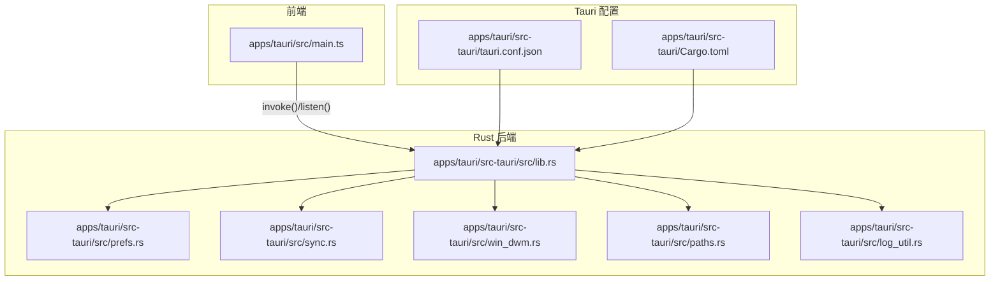
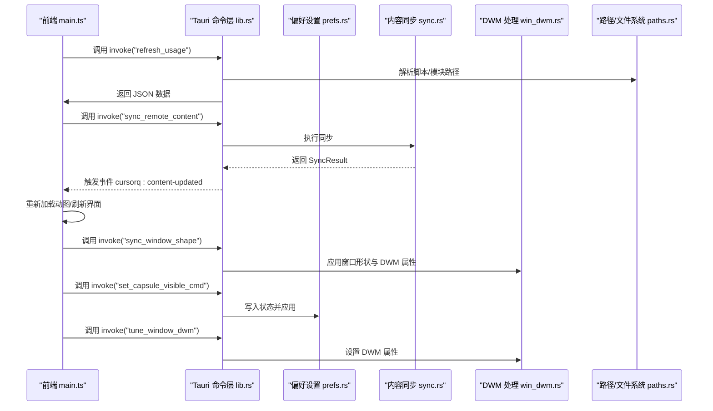
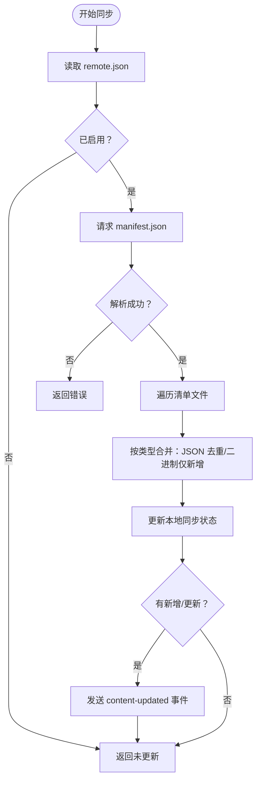
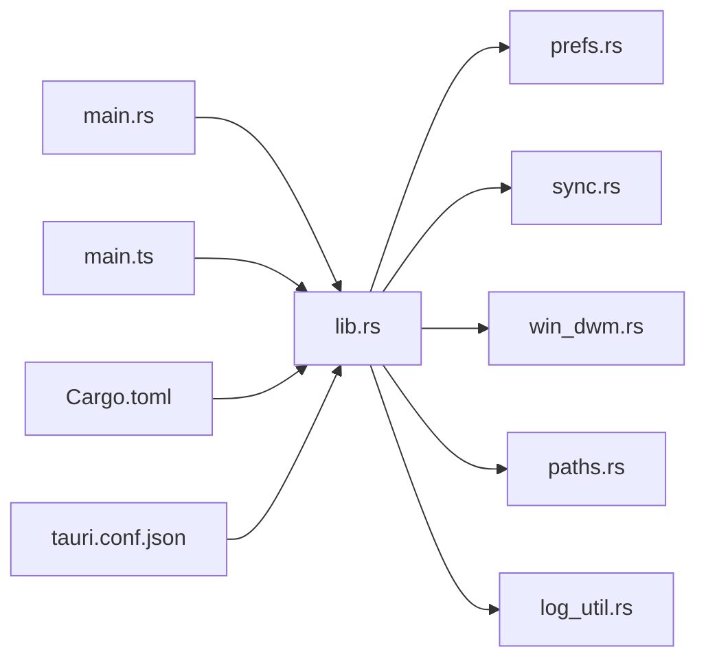

# 系统集成

<cite>
**本文引用的文件**
- [apps/tauri/src-tauri/src/main.rs](file://apps/tauri/src-tauri/src/main.rs)
- [apps/tauri/src-tauri/src/lib.rs](file://apps/tauri/src-tauri/src/lib.rs)
- [apps/tauri/src-tauri/src/prefs.rs](file://apps/tauri/src-tauri/src/prefs.rs)
- [apps/tauri/src-tauri/src/sync.rs](file://apps/tauri/src-tauri/src/sync.rs)
- [apps/tauri/src-tauri/src/win_dwm.rs](file://apps/tauri/src-tauri/src/win_dwm.rs)
- [apps/tauri/src-tauri/src/paths.rs](file://apps/tauri/src-tauri/src/paths.rs)
- [apps/tauri/src-tauri/src/log_util.rs](file://apps/tauri/src-tauri/src/log_util.rs)
- [apps/tauri/src-tauri/Cargo.toml](file://apps/tauri/src-tauri/Cargo.toml)
- [apps/tauri/src-tauri/tauri.conf.json](file://apps/tauri/src-tauri/tauri.conf.json)
- [apps/tauri/src/main.ts](file://apps/tauri/src/main.ts)
- [apps/tauri/package.json](file://apps/tauri/package.json)
</cite>

## 目录
1. [简介](#简介)
2. [项目结构](#项目结构)
3. [核心组件](#核心组件)
4. [架构总览](#架构总览)
5. [组件详解](#组件详解)
6. [依赖关系分析](#依赖关系分析)
7. [性能考量](#性能考量)
8. [故障排查指南](#故障排查指南)
9. [结论](#结论)
10. [附录](#附录)

## 简介
本文件面向 CursorQ 的系统集成功能，围绕 Tauri 命令接口设计与实现、应用偏好设置管理、文件系统访问控制、内容同步机制以及平台特定功能（尤其是 Windows 平台的 DWM 窗口处理、系统托盘集成、自启动配置与跨平台兼容性）进行深入解析。文档同时梳理 Rust 后端模块职责、错误处理与安全考虑，并提供可操作的实现示例与配置指南，帮助开发者快速理解与扩展系统集成功能。

## 项目结构
CursorQ 的桌面端采用 Tauri 2 架构，前端使用 Vite + TypeScript，后端 Rust 提供命令接口与系统能力封装。关键目录与文件如下：
- 应用入口与构建配置：apps/tauri/src-tauri/src/main.rs、apps/tauri/src-tauri/Cargo.toml、apps/tauri/src-tauri/tauri.conf.json
- Rust 后端模块：apps/tauri/src-tauri/src/lib.rs、prefs.rs、sync.rs、win_dwm.rs、paths.rs、log_util.rs
- 前端主程序：apps/tauri/src/main.ts
- 前端依赖与脚本：apps/tauri/package.json

图表来源
- [apps/tauri/src-tauri/src/lib.rs:716-800](file://apps/tauri/src-tauri/src/lib.rs#L716-L800)
- [apps/tauri/src-tauri/tauri.conf.json:1-48](file://apps/tauri/src-tauri/tauri.conf.json#L1-L48)
- [apps/tauri/src-tauri/Cargo.toml:1-37](file://apps/tauri/src-tauri/Cargo.toml#L1-L37)
- [apps/tauri/src/main.ts:1-711](file://apps/tauri/src/main.ts#L1-L711)

章节来源
- [apps/tauri/src-tauri/src/main.rs:1-6](file://apps/tauri/src-tauri/src/main.rs#L1-L6)
- [apps/tauri/src-tauri/src/lib.rs:716-800](file://apps/tauri/src-tauri/src/lib.rs#L716-L800)
- [apps/tauri/src-tauri/tauri.conf.json:1-48](file://apps/tauri/src-tauri/tauri.conf.json#L1-L48)
- [apps/tauri/src-tauri/Cargo.toml:1-37](file://apps/tauri/src-tauri/Cargo.toml#L1-L37)
- [apps/tauri/src/main.ts:1-711](file://apps/tauri/src/main.ts#L1-L711)

## 核心组件
- Tauri 命令接口：通过 #[tauri::command] 注解暴露给前端调用，涵盖内容加载、窗口形状调整、DWM 优化、托盘菜单、偏好设置与内容同步等。
- 偏好设置模块：读写 app-state.json，管理“胶囊可见”“总是置顶”“开机自启动”等状态，并在启动时应用。
- 文件系统与路径模块：统一解析应用根目录、数据目录、日志目录、内容目录、远程配置路径等，支持便携布局与开发模式。
- 内容同步模块：从远端拉取 manifest 与资源，按策略合并本地与远程内容，记录同步状态。
- Windows DWM 模块：针对透明无边框窗口进行 DWM 属性与区域裁剪优化，避免阴影与圆角导致的视觉问题，并处理置顶与焦点行为。
- 日志工具：统一写入日志文件，便于排障。
- 前端集成：通过 @tauri-apps/api 的 invoke 与 listen 与后端通信，驱动窗口尺寸、托盘菜单、内容更新与 Chrome 稳定化流程。

章节来源
- [apps/tauri/src-tauri/src/lib.rs:31-151](file://apps/tauri/src-tauri/src/lib.rs#L31-L151)
- [apps/tauri/src-tauri/src/prefs.rs:1-145](file://apps/tauri/src-tauri/src/prefs.rs#L1-L145)
- [apps/tauri/src-tauri/src/sync.rs:12-91](file://apps/tauri/src-tauri/src/sync.rs#L12-L91)
- [apps/tauri/src-tauri/src/win_dwm.rs:1-231](file://apps/tauri/src-tauri/src/win_dwm.rs#L1-L231)
- [apps/tauri/src-tauri/src/paths.rs:1-142](file://apps/tauri/src-tauri/src/paths.rs#L1-L142)
- [apps/tauri/src-tauri/src/log_util.rs:1-16](file://apps/tauri/src-tauri/src/log_util.rs#L1-L16)
- [apps/tauri/src/main.ts:1-711](file://apps/tauri/src/main.ts#L1-L711)

## 架构总览
下图展示前端、Tauri 命令层、系统能力模块之间的交互关系与数据流。

图表来源
- [apps/tauri/src-tauri/src/lib.rs:617-639](file://apps/tauri/src-tauri/src/lib.rs#L617-L639)
- [apps/tauri/src-tauri/src/sync.rs:261-367](file://apps/tauri/src-tauri/src/sync.rs#L261-L367)
- [apps/tauri/src-tauri/src/win_dwm.rs:90-168](file://apps/tauri/src-tauri/src/win_dwm.rs#L90-L168)
- [apps/tauri/src-tauri/src/prefs.rs:78-97](file://apps/tauri/src-tauri/src/prefs.rs#L78-L97)
- [apps/tauri/src/main.ts:526-560](file://apps/tauri/src/main.ts#L526-L560)

## 组件详解

### Tauri 命令接口设计与实现
- 命令注册：在 run() 中通过 generate_handler! 将多个 #[tauri::command] 函数注册为前端可调用的命令，包括刷新使用数据、窗口 DWM 优化、窗口形状同步、托盘相关、内容路径查询、动图资源访问等。
- 错误处理：命令返回 Result<T, String>，内部捕获 IO/网络/序列化异常并转换为字符串错误，前端统一监听与提示。
- 事件通知：后端通过 emit("cursorq:*") 主动向前端推送状态变更，如内容更新、刷新、修复 Chrome 等。

章节来源
- [apps/tauri/src-tauri/src/lib.rs:716-736](file://apps/tauri/src-tauri/src/lib.rs#L716-L736)
- [apps/tauri/src-tauri/src/lib.rs:127-138](file://apps/tauri/src-tauri/src/lib.rs#L127-L138)
- [apps/tauri/src-tauri/src/lib.rs:641-648](file://apps/tauri/src-tauri/src/lib.rs#L641-L648)

### 应用偏好设置管理
- 存储位置：app-state.json，位于 data_dir() 下，支持便携布局与非便携布局。
- 关键偏好：
  - 胶囊可见：capsuleVisible
  - 总是置顶：alwaysOnTop
  - 开机自启动：launchAtStartup
- 启动应用：apply_prefs_on_startup 在应用启动时读取并应用上述偏好；Windows 下置顶时强制置顶 Z 序列并避免抢焦点。
- 自启动插件：使用 tauri-plugin-autostart，提供 enable/disable/is_enabled 能力，并与偏好状态双向同步。

章节来源
- [apps/tauri/src-tauri/src/prefs.rs:1-145](file://apps/tauri/src-tauri/src/prefs.rs#L1-L145)
- [apps/tauri/src-tauri/src/lib.rs:770-772](file://apps/tauri/src-tauri/src/lib.rs#L770-L772)
- [apps/tauri/src-tauri/src/lib.rs:83-96](file://apps/tauri/src-tauri/src/lib.rs#L83-L96)

### 文件系统访问控制
- 路径解析：paths.rs 统一解析应用根目录、内容目录、数据/日志/配置目录、便携布局检测、脚本与 node_modules 路径等。
- 资源协议作用域：setup 阶段为 content_dir() 设置 asset:// 协议允许范围，确保前端安全访问本地资源。
- 动图与占位资源：提供列出动图、占位图路径、生成 data URL 等命令，避免 asset:// 在某些环境失效的问题。

章节来源
- [apps/tauri/src-tauri/src/paths.rs:1-142](file://apps/tauri/src-tauri/src/paths.rs#L1-L142)
- [apps/tauri/src-tauri/src/lib.rs:737-753](file://apps/tauri/src-tauri/src/lib.rs#L737-L753)
- [apps/tauri/src-tauri/src/lib.rs:31-120](file://apps/tauri/src-tauri/src/lib.rs#L31-L120)

### 内容同步机制
- 远端配置：remote.json 控制是否启用同步、内容基址与同步延迟。
- 清单与合并：
  - manifest.json 描述需要的文件列表与版本号。
  - 合并策略：对 copy/*.json 使用去重合并（基于多字段键），对二进制资源仅在本地不存在时下载，避免覆盖用户手动放入的资源。
- 同步状态：记录本地 manifest 版本与最近同步时间，用于判断是否需要初始化或增量更新。
- 异步刷新：后台线程执行 Node 脚本刷新使用数据，避免阻塞 UI；完成后触发修复 Chrome 流程。

图表来源
- [apps/tauri/src-tauri/src/sync.rs:261-367](file://apps/tauri/src-tauri/src/sync.rs#L261-L367)
- [apps/tauri/src-tauri/src/sync.rs:123-165](file://apps/tauri/src-tauri/src/sync.rs#L123-L165)

章节来源
- [apps/tauri/src-tauri/src/sync.rs:12-91](file://apps/tauri/src-tauri/src/sync.rs#L12-L91)
- [apps/tauri/src-tauri/src/sync.rs:261-367](file://apps/tauri/src-tauri/src/sync.rs#L261-L367)

### Windows 平台 DWM 窗口处理
- 透明无边框窗口的视觉问题：关闭 DWM 的 NC 渲染、圆角、边框颜色、系统背景等属性，避免出现灰边或白角。
- 窗口形状：根据逻辑尺寸与缩放因子创建圆角区域，支持胶囊态与展开态切换。
- 置顶与焦点：置顶时通过 SetWindowPos 拉回前台但不激活，恢复焦点窃取保护，避免打断用户输入。
- 首次显示：使用 SW_SHOWNOACTIVATE 避免抢焦点；必要时恢复之前前台窗口。

章节来源
- [apps/tauri/src-tauri/src/win_dwm.rs:90-168](file://apps/tauri/src-tauri/src/win_dwm.rs#L90-L168)
- [apps/tauri/src-tauri/src/win_dwm.rs:171-197](file://apps/tauri/src-tauri/src/win_dwm.rs#L171-L197)
- [apps/tauri/src-tauri/src/win_dwm.rs:200-217](file://apps/tauri/src-tauri/src/win_dwm.rs#L200-L217)
- [apps/tauri/src-tauri/src/win_dwm.rs:220-231](file://apps/tauri/src-tauri/src/win_dwm.rs#L220-L231)

### 系统托盘集成
- 菜单项：状态指示、显示/隐藏胶囊、语言切换、总是置顶、开机自启动、立即刷新、同步内容、退出。
- 事件处理：双击托盘图标显示胶囊；右键点击触发修复 Chrome；菜单项切换偏好并即时应用。
- 菜单动态刷新：根据当前状态更新勾选与文案；托盘提示根据胶囊可见性变化。

章节来源
- [apps/tauri/src-tauri/src/lib.rs:282-368](file://apps/tauri/src-tauri/src/lib.rs#L282-L368)
- [apps/tauri/src-tauri/src/lib.rs:664-713](file://apps/tauri/src-tauri/src/lib.rs#L664-L713)
- [apps/tauri/src-tauri/src/lib.rs:378-387](file://apps/tauri/src-tauri/src/lib.rs#L378-L387)

### 自启动配置
- 通过 tauri-plugin-autostart 管理开机自启动，支持 enable/disable/is_enabled。
- 启动时与 app-state.json 中的 launchAtStartup 字段双向同步，确保状态一致。

章节来源
- [apps/tauri/src-tauri/src/prefs.rs:99-126](file://apps/tauri/src-tauri/src/prefs.rs#L99-L126)

### 跨平台兼容性处理
- 条件编译：Windows 专用模块 win_dwm.rs，其他平台保持空实现或直接返回。
- 窗口属性：透明、无装饰、不可聚焦、跳过任务栏等在各平台统一配置；Windows 下额外进行 DWM 优化。
- 资源访问：通过 asset:// 协议限定作用域，避免越权访问。

章节来源
- [apps/tauri/src-tauri/src/lib.rs:411-426](file://apps/tauri/src-tauri/src/lib.rs#L411-L426)
- [apps/tauri/src-tauri/src/lib.rs:428-449](file://apps/tauri/src-tauri/src/lib.rs#L428-L449)
- [apps/tauri/src-tauri/tauri.conf.json:13-37](file://apps/tauri/src-tauri/tauri.conf.json#L13-L37)

### 前端集成与事件驱动
- 前端通过 @tauri-apps/api 的 invoke 与 listen 与后端通信，驱动刷新、展开/收起、动图循环、内容更新与 Chrome 稳定化。
- 定时刷新：每间隔固定时间自动刷新使用数据。
- 交互细节：长按/拖拽启动胶囊拖拽；双击/点击控制展开与动图轮换；右键托盘触发修复流程。

章节来源
- [apps/tauri/src/main.ts:526-560](file://apps/tauri/src/main.ts#L526-L560)
- [apps/tauri/src/main.ts:562-672](file://apps/tauri/src/main.ts#L562-L672)
- [apps/tauri/src/main.ts:674-699](file://apps/tauri/src/main.ts#L674-L699)
- [apps/tauri/src/main.ts:700-711](file://apps/tauri/src/main.ts#L700-L711)

## 依赖关系分析

图表来源
- [apps/tauri/src-tauri/src/main.rs:1-6](file://apps/tauri/src-tauri/src/main.rs#L1-L6)
- [apps/tauri/src-tauri/src/lib.rs:1-6](file://apps/tauri/src-tauri/src/lib.rs#L1-L6)
- [apps/tauri/src-tauri/Cargo.toml:15-33](file://apps/tauri/src-tauri/Cargo.toml#L15-L33)
- [apps/tauri/src-tauri/tauri.conf.json:1-48](file://apps/tauri/src-tauri/tauri.conf.json#L1-L48)
- [apps/tauri/src/main.ts:1-711](file://apps/tauri/src/main.ts#L1-L711)

章节来源
- [apps/tauri/src-tauri/src/lib.rs:1-6](file://apps/tauri/src-tauri/src/lib.rs#L1-L6)
- [apps/tauri/src-tauri/Cargo.toml:15-33](file://apps/tauri/src-tauri/Cargo.toml#L15-L33)
- [apps/tauri/src-tauri/tauri.conf.json:1-48](file://apps/tauri/src-tauri/tauri.conf.json#L1-L48)

## 性能考量
- 异步刷新：使用异步运行时与后台线程执行 Node 刷新，避免阻塞 UI。
- 延迟修复：在内容更新后分阶段触发修复 Chrome，减少闪烁与抖动。
- 资源加载：动图与占位资源通过 data URL 直接加载，避免 asset:// 在部分环境的兼容性问题。
- 窗口操作：Windows 下通过 DWM 属性与区域裁剪减少无效绘制，提升透明窗口渲染效率。

## 故障排查指南
- 日志定位：所有关键流程均写入日志文件（logs/cursorq.log），包含同步、HTTP 请求、Node 执行、DWM 调整等。
- 常见问题：
  - 同步失败：检查 remote.json 是否正确、网络连通性、manifest 解析与 HTTP 状态码。
  - Node 执行失败：确认 Node 可执行文件路径、NODE_PATH、CURSORQ_* 环境变量是否正确。
  - Windows 透明窗口出现白边/灰边：确认已调用 tune_window_dwm 与 apply_window_shape。
  - 托盘菜单点击无效：检查菜单构建与事件绑定，确认 TRAY_MENU_GUARD 防抖逻辑未误判。
- 建议步骤：
  - 查看日志文件定位错误点；
  - 在 Windows 下验证 DWM 属性设置与窗口形状；
  - 在前端监听 cursorq:content-updated 与 cursorq:fix-chrome 事件，确认后端事件推送正常。

章节来源
- [apps/tauri/src-tauri/src/log_util.rs:1-16](file://apps/tauri/src-tauri/src/log_util.rs#L1-L16)
- [apps/tauri/src-tauri/src/sync.rs:281-295](file://apps/tauri/src-tauri/src/sync.rs#L281-L295)
- [apps/tauri/src-tauri/src/lib.rs:531-542](file://apps/tauri/src-tauri/src/lib.rs#L531-L542)
- [apps/tauri/src-tauri/src/win_dwm.rs:90-168](file://apps/tauri/src-tauri/src/win_dwm.rs#L90-L168)

## 结论
CursorQ 的系统集成功能以 Tauri 命令接口为核心，结合偏好设置、路径与文件系统、内容同步与 Windows DWM 优化，实现了跨平台的轻量级桌面体验。通过严格的错误处理与日志记录、事件驱动的前端集成以及可配置的远程内容策略，系统在保证稳定性的同时具备良好的扩展性。开发者可在此基础上进一步增强平台特性与内容生态。

## 附录

### 配置指南
- 远程内容配置：编辑 config/remote.json，设置 content_base_url、sync_delay_ms 与 enabled。
- 便携布局：将 config/ 与 content/ 放置于可执行文件同级目录，满足 is_portable_layout 判定。
- 自启动：通过托盘菜单或命令切换“开机自启动”，状态持久化于 app-state.json。

章节来源
- [apps/tauri/src-tauri/src/sync.rs:58-70](file://apps/tauri/src-tauri/src/sync.rs#L58-L70)
- [apps/tauri/src-tauri/src/paths.rs:7-12](file://apps/tauri/src-tauri/src/paths.rs#L7-L12)
- [apps/tauri/src-tauri/src/prefs.rs:99-126](file://apps/tauri/src-tauri/src/prefs.rs#L99-L126)