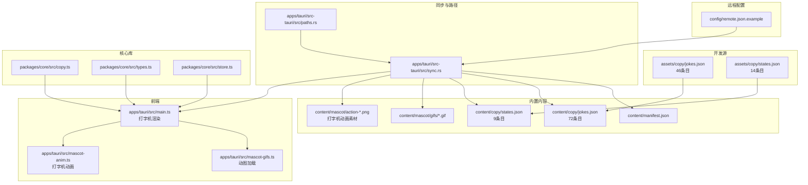
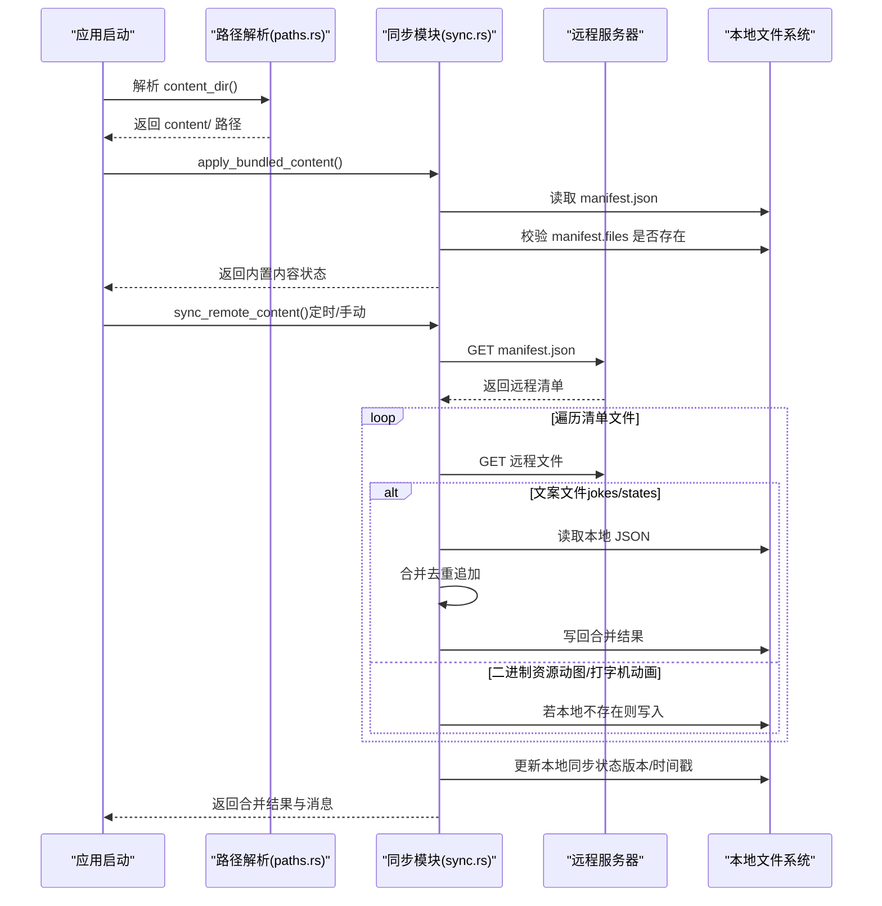
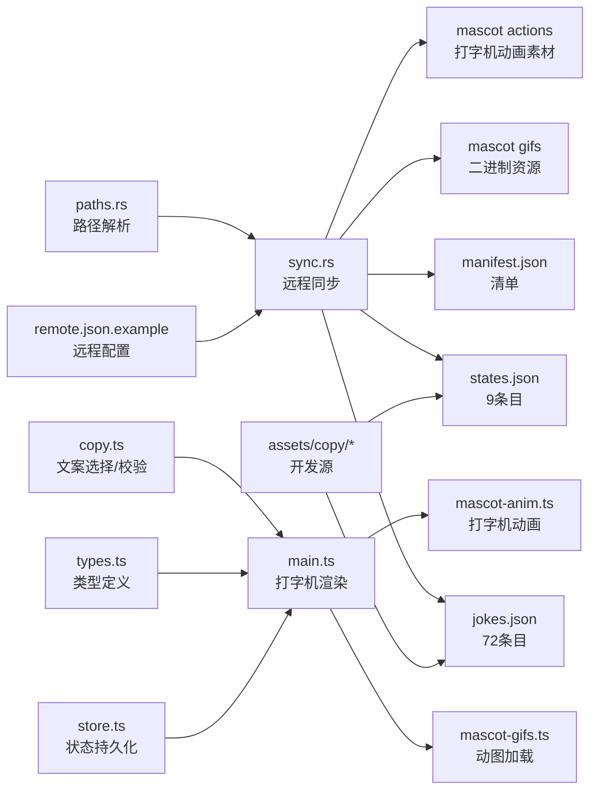
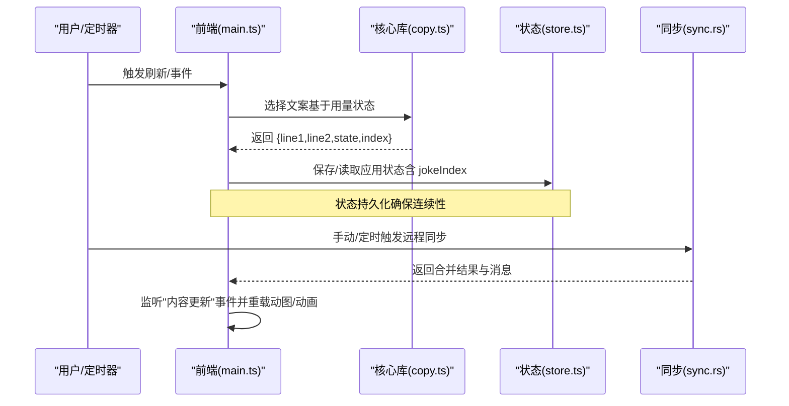

# 内容管理

<cite>
**本文引用的文件**
- [content/manifest.json](file://content/manifest.json)
- [assets/copy/jokes.json](file://assets/copy/jokes.json)
- [assets/copy/states.json](file://assets/copy/states.json)
- [content/copy/jokes.json](file://content/copy/jokes.json)
- [content/copy/states.json](file://content/copy/states.json)
- [packages/core/src/copy.ts](file://packages/core/src/copy.ts)
- [packages/core/src/types.ts](file://packages/core/src/types.ts)
- [packages/core/src/store.ts](file://packages/core/src/store.ts)
- [apps/tauri/src-tauri/src/sync.rs](file://apps/tauri/src-tauri/src/sync.rs)
- [apps/tauri/src-tauri/src/paths.rs](file://apps/tauri/src-tauri/src/paths.rs)
- [apps/tauri/src/main.ts](file://apps/tauri/src/main.ts)
- [apps/tauri/src/mascot-gifs.ts](file://apps/tauri/src/mascot-gifs.ts)
- [apps/tauri/src/mascot-anim.ts](file://apps/tauri/src/mascot-anim.ts)
- [apps/tauri/src/styles.css](file://apps/tauri/src/styles.css)
- [config/remote.json.example](file://config/remote.json.example)
- [scripts/validate-copy.mjs](file://scripts/validate-copy.mjs)
- [README.md](file://README.md)
</cite>

## 更新摘要
**所做更改**
- 更新了 jokes.json 和 states.json 的内容统计，从原有条目数量扩展到新的总数
- 新增了打字机动画效果在内容渲染中的应用说明
- 补充了打字机游标闪烁动画的技术实现细节
- 更新了内容渲染流程中动画效果的描述

## 目录
1. [简介](#简介)
2. [项目结构](#项目结构)
3. [核心组件](#核心组件)
4. [架构总览](#架构总览)
5. [详细组件分析](#详细组件分析)
6. [依赖关系分析](#依赖关系分析)
7. [性能考量](#性能考量)
8. [故障排查指南](#故障排查指南)
9. [结论](#结论)
10. [附录](#附录)

## 简介
本文件面向 CursorQ 的内容管理系统，系统性阐述内置内容与远程同步机制、内容合并规则、版本控制策略与内容更新流程；详解 manifest.json 配置文件的作用、内容文件的组织结构与命名规范、加载优先级；说明 jokes.json 与 states.json 的数据结构、内容验证机制与动态更新策略，并提供内容定制开发指南，包括新增内容、格式规范与最佳实践。

**更新** 本次更新反映了 jokes.json 从23个条目扩展到72个条目，states.json 从8个条目扩展到9个条目的内容扩展，以及新增的打字机动画效果在内容渲染中的应用。

## 项目结构
内容管理涉及以下关键目录与文件：
- content/：内置内容根目录，包含 manifest.json、copy/（jokes.json、states.json）、mascot/（默认图与动图）
- assets/：开发期拷贝源，与 content/ 结构一致，便于本地编辑
- config/：远程配置示例 remote.json.example
- scripts/：内容校验脚本 validate-copy.mjs
- apps/tauri/src-tauri/src/：Rust 同步与路径解析模块（sync.rs、paths.rs）
- apps/tauri/src/：前端主程序与吉祥物动图加载逻辑（main.ts、mascot-gifs.ts、mascot-anim.ts）
- packages/core/src/：内容选择与状态判定、类型定义、应用状态持久化（copy.ts、types.ts、store.ts）

**图表来源**
- [content/manifest.json:1-12](file://content/manifest.json#L1-L12)
- [content/copy/jokes.json:1-73](file://content/copy/jokes.json#L1-L73)
- [content/copy/states.json:1-14](file://content/copy/states.json#L1-L14)
- [config/remote.json.example:1-6](file://config/remote.json.example#L1-L6)
- [apps/tauri/src-tauri/src/sync.rs:1-372](file://apps/tauri/src-tauri/src/sync.rs#L1-L372)
- [apps/tauri/src-tauri/src/paths.rs:1-142](file://apps/tauri/src-tauri/src/paths.rs#L1-L142)
- [apps/tauri/src/main.ts:1-832](file://apps/tauri/src/main.ts#L1-L832)
- [apps/tauri/src/mascot-gifs.ts:1-164](file://apps/tauri/src/mascot-gifs.ts#L1-L164)
- [apps/tauri/src/mascot-anim.ts:1-29](file://apps/tauri/src/mascot-anim.ts#L1-L29)
- [packages/core/src/copy.ts:1-77](file://packages/core/src/copy.ts#L1-L77)
- [packages/core/src/types.ts:1-140](file://packages/core/src/types.ts#L1-L140)
- [packages/core/src/store.ts:1-55](file://packages/core/src/store.ts#L1-L55)

**章节来源**
- [README.md:98-120](file://README.md#L98-L120)

## 核心组件
- 内容清单与加载：content/manifest.json 定义内置文件集合，启动时确认内置 content/ 可用；路径解析模块根据便携布局或开发环境确定 content/ 位置。
- 内容合并与远程同步：Rust 模块负责拉取远程 manifest.json 与文件，按"只追加、不覆盖"策略合并 jokes.json 与 states.json；二进制资源（动图、打字机动画素材）仅在本地不存在时写入。
- 内容选择与渲染：核心库根据用量状态选择文案池，进行宽度校验与循环选择；前端接收渲染数据并展示，包含新增的打字机动画效果。
- 应用状态持久化：应用状态（含 jokeIndex 等）在 data 目录持久化，保证跨重启一致性。
- 吉祥物动图与打字机动画：前端通过 Tauri 命令加载内置动图，支持轮播与手动切换；新增打字机动画效果，内容更新后重载。

**更新** 新增了打字机动画效果的组件说明，包括打字机渲染逻辑和打字机动画素材的管理。

**章节来源**
- [content/manifest.json:1-12](file://content/manifest.json#L1-L12)
- [apps/tauri/src-tauri/src/sync.rs:189-258](file://apps/tauri/src-tauri/src/sync.rs#L189-L258)
- [apps/tauri/src-tauri/src/paths.rs:37-48](file://apps/tauri/src-tauri/src/paths.rs#L37-L48)
- [packages/core/src/copy.ts:40-77](file://packages/core/src/copy.ts#L40-L77)
- [apps/tauri/src/main.ts:417-461](file://apps/tauri/src/main.ts#L417-L461)
- [packages/core/src/store.ts:10-55](file://packages/core/src/store.ts#L10-L55)
- [apps/tauri/src/mascot-gifs.ts:121-164](file://apps/tauri/src/mascot-gifs.ts#L121-L164)
- [apps/tauri/src/mascot-anim.ts:12-28](file://apps/tauri/src/mascot-anim.ts#L12-L28)

## 架构总览
内容管理采用"内置优先 + 远程增量"的双轨策略：启动阶段优先使用内置 content/，随后按配置异步拉取远程内容并合并，确保本地定制不被覆盖。

**图表来源**
- [apps/tauri/src-tauri/src/paths.rs:37-48](file://apps/tauri/src-tauri/src/paths.rs#L37-L48)
- [apps/tauri/src-tauri/src/sync.rs:189-367](file://apps/tauri/src-tauri/src/sync.rs#L189-L367)

## 详细组件分析

### 内容清单与加载优先级
- manifest.json 作用：声明内置内容版本与文件列表，作为"内置内容可用性"的依据。
- 加载优先级：
  - 启动时：优先确认 content/ 下的 manifest.json 与清单文件是否存在，若缺失则记录日志并返回不可用状态。
  - 便携布局：exe 同级 config/ 与 content/ 存在时，优先使用 exe 同级 content/。
  - 开发/发布差异：开发时可回退到仓库根目录 content/，确保构建与运行一致性。
- 版本控制策略：本地同步状态记录 manifest_version 与 last_sync_iso；若远程版本大于本地，则视为需要更新。

**章节来源**
- [content/manifest.json:1-12](file://content/manifest.json#L1-L12)
- [apps/tauri/src-tauri/src/paths.rs:6-48](file://apps/tauri/src-tauri/src/paths.rs#L6-L48)
- [apps/tauri/src-tauri/src/sync.rs:237-258](file://apps/tauri/src-tauri/src/sync.rs#L237-L258)

### 内容合并规则与远程同步
- 合并策略：
  - 文案类（jokes.json、states.json）：只追加远程新条目，不覆盖本地已有条目；通过组合字段生成键值去重。
  - 二进制资源（动图、打字机动画素材等）：仅在本地不存在时写入，避免覆盖用户手动放入的文件。
- 远程配置：
  - enabled：是否启用远程同步。
  - content_base_url：远程内容根地址。
  - sync_delay_ms：首次同步延迟（毫秒）。
- 错误处理：网络异常、解析失败、HTTP 错误均记录日志并返回失败信息；成功后更新本地同步状态。

**更新** 打字机动画素材（action-*.png）作为二进制资源参与合并规则，仅在本地不存在时写入。

**章节来源**
- [apps/tauri/src-tauri/src/sync.rs:122-187](file://apps/tauri/src-tauri/src/sync.rs#L122-L187)
- [apps/tauri/src-tauri/src/sync.rs:261-367](file://apps/tauri/src-tauri/src/sync.rs#L261-L367)
- [config/remote.json.example:1-6](file://config/remote.json.example#L1-L6)

### jokes.json 与 states.json 数据结构
- 公共字段：
  - line1、line2：两行文本，用于展示文案。
  - state：状态标识，用于与用量状态映射。
  - tag：标签，用于分类（如 dry、meme、kao、poetry）。
- 状态映射：
  - 核心库根据用量进度计算 widgetState，选择对应状态池或笑话池。
  - 选择器会过滤掉超出显示宽度限制的条目，保证界面适配。

**更新** jokes.json 已从23个条目扩展到72个条目，states.json 已从8个条目扩展到9个条目，提供了更丰富的文案内容。

**章节来源**
- [content/copy/jokes.json:1-73](file://content/copy/jokes.json#L1-L73)
- [content/copy/states.json:1-14](file://content/copy/states.json#L1-L14)
- [packages/core/src/copy.ts:20-30](file://packages/core/src/copy.ts#L20-L30)
- [packages/core/src/copy.ts:32-38](file://packages/core/src/copy.ts#L32-L38)

### 内容验证机制与动态更新策略
- 显示宽度校验：核心库与校验脚本均基于字符集与半角/全角权重计算显示宽度，限制每行不超过 10 宽度单位。
- 动态更新：
  - 前端监听"内容更新"事件，重新加载吉祥物动图列表并恢复轮播。
  - 应用状态持久化包含 jokeIndex，确保下次刷新沿用上次索引。
- 校验脚本：在 CI 或本地开发时运行，确保 content/copy 下的 jokes.json 与 states.json 符合宽度约束。

**更新** 新增了打字机渲染过程中的动画效果验证，确保打字机动画与内容渲染的协调性。

**章节来源**
- [packages/core/src/copy.ts:3-18](file://packages/core/src/copy.ts#L3-L18)
- [scripts/validate-copy.mjs:7-30](file://scripts/validate-copy.mjs#L7-L30)
- [apps/tauri/src/main.ts:701-703](file://apps/tauri/src/main.ts#L701-L703)
- [packages/core/src/store.ts:10-28](file://packages/core/src/store.ts#L10-L28)

### 吉祥物动图加载与轮播
- 加载策略：
  - 启动后先显示占位图（default.png 或默认 SVG），1 分钟后开始轮播。
  - 轮播间隔：每 20 分钟切换一次；双击吉祥物可手动切换。
  - 资源来源：通过 Tauri 命令从内置 content/mascot/gifs 获取；开发模式下回退到静态路径。
- 更新策略：收到"内容更新"事件后，重新枚举 GIF 列表并恢复轮播。

**更新** 新增了打字机动画效果，通过 mascot-anim.ts 实现打字机动画循环播放。

**章节来源**
- [apps/tauri/src/mascot-gifs.ts:1-164](file://apps/tauri/src/mascot-gifs.ts#L1-L164)
- [apps/tauri/src/main.ts:701-703](file://apps/tauri/src/main.ts#L701-L703)

### 打字机动画效果
- 动画实现：
  - 3组动作 × 6帧，每帧 0.5秒，播完切下一组。
  - 通过 CSS steps() 动画实现逐帧播放效果。
  - 背景图片循环切换实现不同动作序列。
- 应用场景：
  - 在内容渲染过程中，为用户提供视觉反馈。
  - 与打字机文本渲染效果相配合，增强用户体验。
- 更新策略：内容更新后自动重载动画资源。

**新增** 打字机动画效果是本次更新的重要新增功能，为内容渲染提供了更加生动的视觉体验。

**章节来源**
- [apps/tauri/src/mascot-anim.ts:1-29](file://apps/tauri/src/mascot-anim.ts#L1-L29)

### 打字机文本渲染与动画
- 打字机效果：
  - 文本逐字符显示，模拟打字机输入效果。
  - 打字过程中显示闪烁游标，完成后游标消失。
  - 两行内容时，先显示第一行，等待2秒后显示第二行，再等待3秒回到第一行循环。
- 动画实现：
  - 通过 requestAnimationFrame 实现平滑的逐字符动画。
  - CSS @keyframes 实现游标闪烁效果。
  - 字符显示速度根据文本长度动态调整。
- 样式支持：
  - .joke-line.typing::after 伪元素实现游标闪烁。
  - @keyframes tw-blink 定义闪烁动画。

**新增** 打字机文本渲染是本次更新的核心功能，提供了更加生动的内容展示效果。

**章节来源**
- [apps/tauri/src/main.ts:430-536](file://apps/tauri/src/main.ts#L430-L536)
- [apps/tauri/src/styles.css:157-169](file://apps/tauri/src/styles.css#L157-L169)

### 类型与状态定义
- ProgressPaint：用量进度输入，决定 widgetState 选择。
- WidgetState：文案状态集合（idle、surplus_vibe、warn80、done_today、over_cycle）。
- AppState：应用状态持久化字段，包含 jokeIndex、locale、快照等。

**章节来源**
- [packages/core/src/types.ts:112-140](file://packages/core/src/types.ts#L112-L140)
- [packages/core/src/store.ts:5-28](file://packages/core/src/store.ts#L5-L28)

## 依赖关系分析
- Rust 同步模块依赖路径解析模块确定 content/ 与 data/ 位置；依赖远程配置决定同步开关与基址。
- 前端主程序依赖核心库进行文案选择与渲染；依赖吉祥物模块进行动图展示与更新；依赖打字机动画模块提供视觉反馈。
- 核心库依赖类型定义与应用状态持久化模块。

**更新** 新增了打字机动画模块与前端渲染模块的依赖关系。

**图表来源**
- [apps/tauri/src-tauri/src/paths.rs:37-48](file://apps/tauri/src-tauri/src/paths.rs#L37-L48)
- [apps/tauri/src-tauri/src/sync.rs:189-367](file://apps/tauri/src-tauri/src/sync.rs#L189-L367)
- [content/manifest.json:1-12](file://content/manifest.json#L1-L12)
- [packages/core/src/copy.ts:40-77](file://packages/core/src/copy.ts#L40-L77)
- [packages/core/src/types.ts:112-140](file://packages/core/src/types.ts#L112-L140)
- [packages/core/src/store.ts:10-55](file://packages/core/src/store.ts#L10-L55)
- [apps/tauri/src/main.ts:417-461](file://apps/tauri/src/main.ts#L417-L461)
- [apps/tauri/src/mascot-gifs.ts:121-164](file://apps/tauri/src/mascot-gifs.ts#L121-L164)
- [apps/tauri/src/mascot-anim.ts:12-28](file://apps/tauri/src/mascot-anim.ts#L12-L28)

## 性能考量
- 合并算法复杂度：文案合并对每个远程条目计算键值并插入哈希集合，整体近似 O(n)；二进制资源仅在缺失时写入，避免重复 IO。
- 渲染与轮播：前端轮播采用定时器与懒加载，避免阻塞主线程；显示宽度校验在选择阶段完成，减少无效渲染。
- 网络与缓存：远程同步带超时与错误处理；本地同步状态记录版本与时间戳，降低重复下载概率。
- 打字机动画：CSS steps() 动画实现硬件加速，帧率稳定；动画切换采用背景图片替换，避免复杂的DOM操作。

**更新** 新增了打字机动画的性能考量，包括硬件加速和帧率稳定性。

## 故障排查指南
- 内置内容缺失：检查 content/manifest.json 与清单文件是否存在；确认便携布局或开发环境路径解析正确。
- 远程同步失败：检查 remote.json.enabled 与 content_base_url；查看日志中 manifest 请求、解析与 HTTP 错误信息。
- 合并无效果：确认文案合并仅追加新条目；检查本地 jokes.json/states.json 是否存在相同键值导致被去重。
- 吉祥物不显示：确认 mascot 默认图与 gifs 目录存在；开发模式下检查静态回退路径；更新后监听"内容更新"事件并重载。
- 打字机动画异常：检查 mascot 动画素材文件是否存在；确认 CSS 动画定义正确；验证打字机渲染逻辑。
- 宽度校验失败：运行校验脚本，修正 line1/line2 超宽问题。

**更新** 新增了打字机动画相关的故障排查指导。

**章节来源**
- [apps/tauri/src-tauri/src/sync.rs:261-367](file://apps/tauri/src-tauri/src/sync.rs#L261-L367)
- [apps/tauri/src-tauri/src/sync.rs:122-187](file://apps/tauri/src-tauri/src/sync.rs#L122-L187)
- [scripts/validate-copy.mjs:18-30](file://scripts/validate-copy.mjs#L18-L30)
- [apps/tauri/src/mascot-gifs.ts:51-59](file://apps/tauri/src/mascot-gifs.ts#L51-L59)
- [apps/tauri/src/mascot-anim.ts:12-28](file://apps/tauri/src/mascot-anim.ts#L12-L28)

## 结论
CursorQ 的内容管理系统以"内置优先 + 远程增量"为核心设计，通过 manifest.json 统一声明、Rust 同步模块实现安全合并、前端渲染与动图轮播完成最终呈现。其"只追加、不覆盖"的合并策略与严格的显示宽度校验，既保障了内容质量，又尊重本地定制。配合应用状态持久化与事件驱动的动态更新，实现了稳定、可维护的内容生态。

**更新** 本次更新进一步增强了内容管理系统的丰富性和用户体验，通过扩展的文案内容和新增的打字机动画效果，为用户提供了更加生动和多样化的内容展示体验。

## 附录

### manifest.json 配置说明
- 字段
  - version：清单版本号，用于判断是否需要初始化或更新。
  - files：相对路径数组，列出自身 content/ 下应存在的文件。
- 作用：启动时确认内置内容完整性；远程同步后记录本地版本与时间戳。

**章节来源**
- [content/manifest.json:1-12](file://content/manifest.json#L1-L12)
- [apps/tauri/src-tauri/src/sync.rs:237-258](file://apps/tauri/src-tauri/src/sync.rs#L237-L258)

### 内容文件组织结构与命名规范
- 目录
  - content/copy/：文案文件 jokes.json（72条目）、states.json（9条目）
  - content/mascot/：默认图 default.png/default.svg 与 gifs/ 动图目录、action-*.png 打字机动画素材
- 命名规范
  - 文案文件：jokes.json、states.json
  - 动图：支持 .gif/.webp/.png，按文件名排序轮播
  - 打字机动画：action-0.png、action-1.png、action-2.png，每组6帧
- 加载优先级
  - 便携包：exe 同级 config/ 与 content/ 存在时优先
  - 开发/发布：回退到仓库根目录 content/

**更新** 新增了打字机动画素材的命名规范和组织结构说明。

**章节来源**
- [README.md:73-83](file://README.md#L73-L83)
- [apps/tauri/src-tauri/src/paths.rs:6-48](file://apps/tauri/src-tauri/src/paths.rs#L6-L48)

### 数据结构与验证
- jokes.json 条目字段：line1、line2、tag
- states.json 条目字段：line1、line2、state
- 显示宽度校验：每行宽度不超过 10（CJK=1，空白=0，其他≈0.5）
- 打字机动画：3组动作 × 6帧，每帧 0.5秒

**更新** 新增了打字机动画的数据结构说明。

**章节来源**
- [content/copy/jokes.json:1-73](file://content/copy/jokes.json#L1-L73)
- [content/copy/states.json:1-14](file://content/copy/states.json#L1-L14)
- [packages/core/src/copy.ts:3-18](file://packages/core/src/copy.ts#L3-L18)
- [apps/tauri/src/mascot-anim.ts:1-29](file://apps/tauri/src/mascot-anim.ts#L1-L29)

### 内容更新流程（序列图）

**图表来源**
- [apps/tauri/src/main.ts:526-560](file://apps/tauri/src/main.ts#L526-L560)
- [packages/core/src/copy.ts:40-77](file://packages/core/src/copy.ts#L40-L77)
- [packages/core/src/store.ts:32-55](file://packages/core/src/store.ts#L32-L55)
- [apps/tauri/src-tauri/src/sync.rs:261-367](file://apps/tauri/src-tauri/src/sync.rs#L261-L367)

### 内容定制开发指南
- 新增文案
  - 在 content/copy/jokes.json 或 states.json 中添加条目，遵循字段与宽度校验。
  - 开发时可直接编辑 assets/copy/* 以获得即时反馈。
  - jokes.json 已扩展至72个条目，states.json 已扩展至9个条目。
- 新增动图
  - 将 .gif/.webp/.png 放入 content/mascot/gifs/，按文件名排序轮播。
  - 保持文件名简洁，避免特殊字符。
- 新增打字机动画
  - 准备3组动作，每组6帧，命名为 action-0.png、action-1.png、action-2.png。
  - 放入 content/mascot/ 目录，确保每组帧数一致。
- 格式规范
  - 每行显示宽度不超过 10；避免过长或过短导致阅读困难。
  - 状态类文案与状态标识一致，确保用量状态映射正确。
  - 打字机动画帧数需为6帧，动作组数建议为3组。
- 最佳实践
  - 优先追加而非覆盖；避免删除内置条目以免影响默认体验。
  - 使用校验脚本在提交前检查宽度问题。
  - 通过"同步文案/动图"功能验证远程合并效果。
  - 打字机动画素材需保持一致的尺寸和帧率。

**更新** 新增了打字机动画素材的制作规范和最佳实践指导。

**章节来源**
- [README.md:66-97](file://README.md#L66-L97)
- [scripts/validate-copy.mjs:18-30](file://scripts/validate-copy.mjs#L18-L30)
- [apps/tauri/src-tauri/src/sync.rs:122-187](file://apps/tauri/src-tauri/src/sync.rs#L122-L187)
- [apps/tauri/src/mascot-anim.ts:1-29](file://apps/tauri/src/mascot-anim.ts#L1-L29)