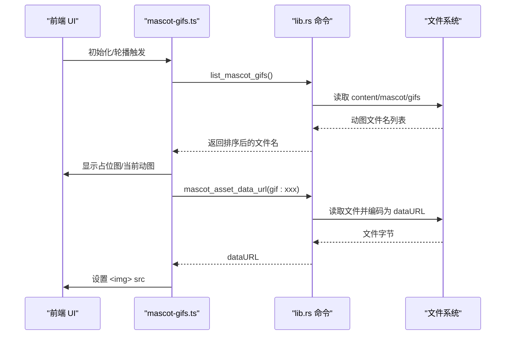
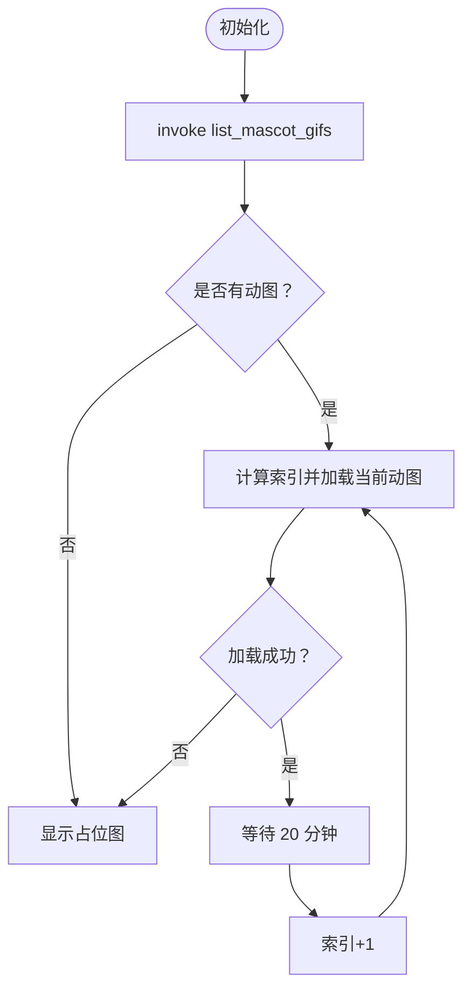
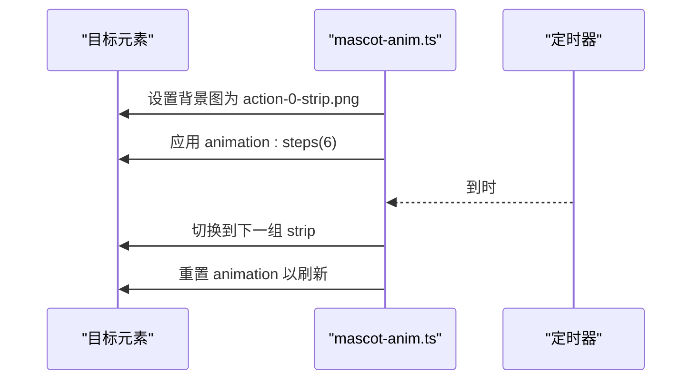
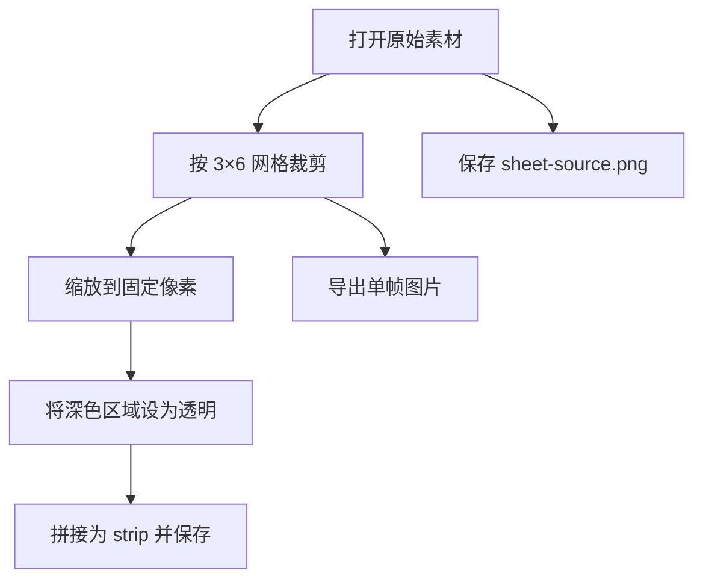
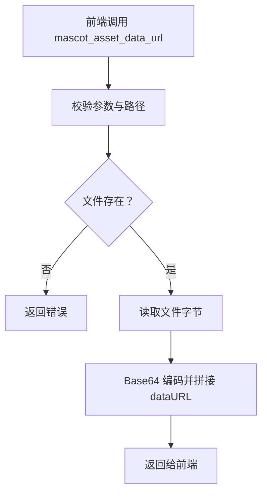
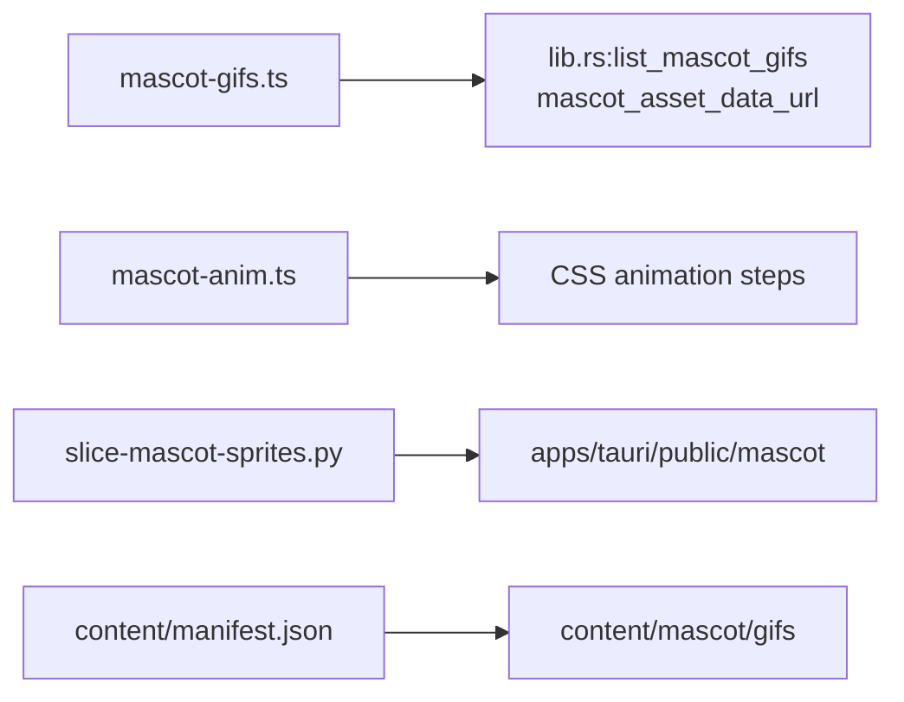

# 动物角色资源

<cite>
**本文引用的文件**
- [mascot-gifs.ts](file://apps/tauri/src/mascot-gifs.ts)
- [mascot-anim.ts](file://apps/tauri/src/mascot-anim.ts)
- [slice-mascot-sprites.py](file://scripts/slice-mascot-sprites.py)
- [README.txt](file://apps/tauri/public/mascot/gifs/README.txt)
- [manifest.json](file://content/manifest.json)
- [lib.rs](file://apps/tauri/src-tauri/src/lib.rs)
</cite>

## 目录
1. [简介](#简介)
2. [项目结构](#项目结构)
3. [核心组件](#核心组件)
4. [架构总览](#架构总览)
5. [详细组件分析](#详细组件分析)
6. [依赖关系分析](#依赖关系分析)
7. [性能考量](#性能考量)
8. [故障排查指南](#故障排查指南)
9. [结论](#结论)
10. [附录](#附录)

## 简介
本文件面向 CursorQ 的“动物角色资源系统”，系统由两部分组成：
- GIF 动画资源：通过 Tauri 后端枚举与读取 content/mascot/gifs 目录中的动图，前端定时轮播展示。
- 静态精灵动画：通过预切分的精灵条带（strip）实现像素风格的动作循环播放。

文档将深入解释资源组织结构、加载与缓存策略、sprite 切片脚本工作原理、动画帧配置与播放控制逻辑，并提供自定义开发指南与最佳实践。

## 项目结构
围绕动物角色资源的关键路径如下：
- 前端资源与脚本
  - apps/tauri/public/mascot/gifs：存放可轮播的 GIF/WebP/PNG 动态资源，支持占位图 default.png。
  - apps/tauri/src/mascot-gifs.ts：GIF 资源加载、占位图显示、定时轮播与手动切换。
  - apps/tauri/src/mascot-anim.ts：精灵动画（strip）播放控制。
  - scripts/slice-mascot-sprites.py：将 3 行×6 列的原始素材切分为 3 组动作、每组 6 帧的 strip。
- 内容与清单
  - content/manifest.json：声明内容文件清单，便于版本化与分发。
  - content/mascot/gifs：内容目录，Tauri 在打包时会将其复制到最终应用中。
- 后端命令
  - apps/tauri/src-tauri/src/lib.rs：提供 list_mascot_gifs、mascot_asset_data_url 等命令，供前端调用以安全地访问资源。

```mermaid
graph TB
subgraph "前端"
UI["HTML 元素<br/>#mascotGif"]
GIFTS["mascot-gifs.ts<br/>GIF 轮播与加载"]
ANIMTS["mascot-anim.ts<br/>精灵动画控制"]
end
subgraph "后端"
LIBRS["lib.rs<br/>Tauri 命令"]
end
subgraph "资源"
PUBGIFS["apps/tauri/public/mascot/gifs<br/>动态资源"]
CONTENT["content/mascot/gifs<br/>内容目录"]
MANIFEST["content/manifest.json<br/>清单"]
SCRIPT["scripts/slice-mascot-sprites.py<br/>切片脚本"]
end
UI <- --> GIFTS
UI <- --> ANIMTS
GIFTS --> LIBRS
ANIMTS --> UI
LIBRS --> PUBGIFS
LIBRS --> CONTENT
SCRIPT --> PUBGIFS
MANIFEST --> CONTENT
```

图表来源
- [mascot-gifs.ts:1-164](file://apps/tauri/src/mascot-gifs.ts#L1-L164)
- [mascot-anim.ts:1-29](file://apps/tauri/src/mascot-anim.ts#L1-L29)
- [lib.rs:31-91](file://apps/tauri/src-tauri/src/lib.rs#L31-L91)
- [README.txt:1-10](file://apps/tauri/public/mascot/gifs/README.txt#L1-L10)
- [manifest.json:1-11](file://content/manifest.json#L1-L11)
- [slice-mascot-sprites.py:1-54](file://scripts/slice-mascot-sprites.py#L1-L54)

章节来源
- [mascot-gifs.ts:1-164](file://apps/tauri/src/mascot-gifs.ts#L1-L164)
- [mascot-anim.ts:1-29](file://apps/tauri/src/mascot-anim.ts#L1-L29)
- [lib.rs:31-91](file://apps/tauri/src-tauri/src/lib.rs#L31-L91)
- [README.txt:1-10](file://apps/tauri/public/mascot/gifs/README.txt#L1-L10)
- [manifest.json:1-11](file://content/manifest.json#L1-L11)
- [slice-mascot-sprites.py:1-54](file://scripts/slice-mascot-sprites.py#L1-L54)

## 核心组件
- GIF 资源管理器（mascot-gifs.ts）
  - 负责：枚举可用动图、占位图加载、延迟启动轮播、定时切换、手动切换、错误回退。
  - 关键常量：启动延迟、轮播间隔、占位图路径。
  - 关键函数：initMascotGifs、reloadMascotGifsAfterContentUpdate、cycleMascotGif、showPlaceholder、showAt、gifSrcAt、loadImage、dataUrl。
- 精灵动画控制器（mascot-anim.ts）
  - 负责：三组动作、每组 6 帧、每帧 0.5 秒的循环播放；通过 CSS steps 实现逐帧切换。
  - 关键常量：动作数、帧数、帧时长、动作周期。
  - 关键函数：startMascotActionCycle。
- 切片脚本（slice-mascot-sprites.py）
  - 负责：将原始素材切分为 6×3 的帧网格，生成 action-0/1/2-strip.png，导出单帧用于调试。
- 后端命令（lib.rs）
  - 负责：列出动图、解析 MIME、生成 dataURL、校验路径安全性。

章节来源
- [mascot-gifs.ts:1-164](file://apps/tauri/src/mascot-gifs.ts#L1-L164)
- [mascot-anim.ts:1-29](file://apps/tauri/src/mascot-anim.ts#L1-L29)
- [slice-mascot-sprites.py:1-54](file://scripts/slice-mascot-sprites.py#L1-L54)
- [lib.rs:31-91](file://apps/tauri/src-tauri/src/lib.rs#L31-L91)

## 架构总览
前端通过 Tauri invoke 调用后端命令，后端从 content/mascot/gifs 目录读取资源或返回 dataURL，前端负责渲染与动画控制。



图表来源
- [mascot-gifs.ts:86-119](file://apps/tauri/src/mascot-gifs.ts#L86-L119)
- [lib.rs:31-91](file://apps/tauri/src-tauri/src/lib.rs#L31-L91)

## 详细组件分析

### GIF 资源系统（mascot-gifs.ts）
- 资源组织
  - 动图位于 apps/tauri/public/mascot/gifs，支持 .gif/.webp/.png 等。
  - 启动时先显示默认占位图 default.png，1 分钟后开始轮播。
  - 轮播间隔为 20 分钟，按文件名字母序循环。
- 加载流程
  - 通过 invoke 调用后端命令获取 dataURL 或直接使用 public 目录路径。
  - 若失败且处于 Vite 开发模式，则回退到本地静态路径。
- 轮播与控制
  - 定时器控制轮播；支持手动切换与内容更新后的索引修复。
  - 当无可用动图时，始终显示占位图。
- 错误处理
  - 加载失败时回退占位图；开发环境异常时也尝试本地回退。



图表来源
- [mascot-gifs.ts:101-119](file://apps/tauri/src/mascot-gifs.ts#L101-L119)
- [mascot-gifs.ts:71-84](file://apps/tauri/src/mascot-gifs.ts#L71-L84)

章节来源
- [mascot-gifs.ts:1-164](file://apps/tauri/src/mascot-gifs.ts#L1-L164)
- [README.txt:1-10](file://apps/tauri/public/mascot/gifs/README.txt#L1-L10)

### 精灵动画系统（mascot-anim.ts）
- 动画结构
  - 三组动作（STRIPS），每组 6 帧，每帧 0.5 秒，动作间无缝衔接。
  - 使用 CSS animation 与 steps 实现逐帧播放。
- 控制逻辑
  - 初始化时应用第一组 strip 并启动定时器，周期性切换下一组动作。
  - 通过重设 animation 触发重绘，避免播放卡顿。



图表来源
- [mascot-anim.ts:12-28](file://apps/tauri/src/mascot-anim.ts#L12-L28)

章节来源
- [mascot-anim.ts:1-29](file://apps/tauri/src/mascot-anim.ts#L1-L29)

### sprite 切片脚本（slice-mascot-sprites.py）
- 输入输出
  - 输入：原始 RGBA 素材（3 行×6 列）。
  - 输出：action-0/1/2-strip.png（每行一组 6 帧）、单帧导出（action{row}_{col:02d}.png）、sheet-source.png。
- 处理流程
  - 计算帧宽高，逐帧裁剪并缩放至固定像素大小。
  - 过滤黑色背景（阈值内）为透明，生成透明 strip。
- 使用场景
  - 开发阶段导出单帧便于检查；发布时使用 strip 进行动画播放。



图表来源
- [slice-mascot-sprites.py:30-47](file://scripts/slice-mascot-sprites.py#L30-L47)

章节来源
- [slice-mascot-sprites.py:1-54](file://scripts/slice-mascot-sprites.py#L1-L54)

### 后端命令与资源访问（lib.rs）
- list_mascot_gifs：扫描 content/mascot/gifs，过滤隐藏文件与非媒体文件，忽略占位动画文件，按字母序返回。
- mascot_asset_data_url：读取文件并以 dataURL 形式返回，避免跨域与路径泄露。
- 路径安全：禁止路径穿越字符，确保只访问允许目录。



图表来源
- [lib.rs:31-91](file://apps/tauri/src-tauri/src/lib.rs#L31-L91)

章节来源
- [lib.rs:31-91](file://apps/tauri/src-tauri/src/lib.rs#L31-L91)

## 依赖关系分析
- 前端依赖
  - mascot-gifs.ts 依赖 Tauri invoke 与 DOM 元素 #mascotGif。
  - mascot-anim.ts 依赖 CSS 动画与定时器。
- 后端依赖
  - lib.rs 依赖文件系统与 MIME 推断。
- 资源依赖
  - public/mascot/gifs 与 content/mascot/gifs 保持一致，manifest.json 管理版本与清单。



图表来源
- [mascot-gifs.ts:1-164](file://apps/tauri/src/mascot-gifs.ts#L1-L164)
- [mascot-anim.ts:1-29](file://apps/tauri/src/mascot-anim.ts#L1-L29)
- [lib.rs:31-91](file://apps/tauri/src-tauri/src/lib.rs#L31-L91)
- [manifest.json:1-11](file://content/manifest.json#L1-L11)
- [slice-mascot-sprites.py:1-54](file://scripts/slice-mascot-sprites.py#L1-L54)

章节来源
- [mascot-gifs.ts:1-164](file://apps/tauri/src/mascot-gifs.ts#L1-L164)
- [mascot-anim.ts:1-29](file://apps/tauri/src/mascot-anim.ts#L1-L29)
- [lib.rs:31-91](file://apps/tauri/src-tauri/src/lib.rs#L31-L91)
- [manifest.json:1-11](file://content/manifest.json#L1-L11)
- [slice-mascot-sprites.py:1-54](file://scripts/slice-mascot-sprites.py#L1-L54)

## 性能考量
- 资源加载
  - 优先使用后端生成的 dataURL，减少网络与跨域问题；开发模式下回退到 public 目录路径。
  - 避免重复设置相同 src，减少不必要的重绘与内存占用。
- 轮播策略
  - 启动延迟 1 分钟，降低首次启动抖动；轮播间隔 20 分钟，避免频繁切换。
  - 当动图数量少于 2 时不启用定时器，节省 CPU。
- 动画播放
  - 精灵动画使用 CSS steps，避免 JavaScript 每帧回调带来的抖动。
  - 切片时统一缩放与透明处理，保证像素风格一致性与渲染效率。
- 文件组织
  - content/manifest.json 管理版本，便于增量更新与缓存控制。

[本节为通用性能建议，不直接分析具体文件]

## 故障排查指南
- 无动图显示
  - 检查 content/mascot/gifs 是否存在有效文件，确认已执行内容更新流程并等待约 1 分钟生效。
  - 确认文件名未被过滤（隐藏文件、非媒体类型、占位动画文件）。
- 开发模式无法加载
  - 确认 public/mascot/gifs 下存在对应文件；若后端命令失败，前端会回退到本地路径。
- 动画不播放
  - 确认目标元素存在且可接收背景图；检查 CSS 动画是否正确应用。
- 切片脚本报错
  - 确保已安装 Pillow；检查输入路径与权限。

章节来源
- [mascot-gifs.ts:51-84](file://apps/tauri/src/mascot-gifs.ts#L51-L84)
- [lib.rs:31-91](file://apps/tauri/src-tauri/src/lib.rs#L31-L91)
- [slice-mascot-sprites.py:5-8](file://scripts/slice-mascot-sprites.py#L5-L8)

## 结论
该系统通过前后端协作实现了稳定的动物角色资源管理：后端负责安全、高效的资源枚举与读取，前端负责直观的展示与交互。GIF 轮播与精灵动画均采用轻量级策略，兼顾性能与可维护性。配合切片脚本与清单管理，开发者可以高效地迭代与发布自定义动物角色资源。

[本节为总结性内容，不直接分析具体文件]

## 附录

### 自定义动物角色开发指南
- 动画制作规范
  - GIF：建议尺寸适中、帧率稳定；WebP/PNG 可作为替代。
  - 精灵：按 3 行×6 列网格准备，确保每帧像素风格一致。
- 资源格式要求
  - 动图：.gif/.webp/.png/.apng。
  - 精灵：提供原始素材，使用切片脚本生成 strip。
- 集成步骤
  - 将动图放入 content/mascot/gifs（或 public/mascot/gifs），命名建议以 01-、02- 等前缀排序。
  - 更新 content/manifest.json 的版本号并推送，用户启动约 1 分钟后生效。
  - 如需精灵动画，准备原始素材并运行切片脚本，将生成的 strip 放入 apps/tauri/public/mascot。
- 最佳实践
  - 开发阶段可使用 public 目录快速验证；生产环境建议通过后端命令访问 content 目录。
  - 控制动图体积与帧率，避免影响轮播流畅度。
  - 使用切片脚本导出单帧进行质量检查，确保像素风格统一。

章节来源
- [README.txt:1-10](file://apps/tauri/public/mascot/gifs/README.txt#L1-L10)
- [manifest.json:1-11](file://content/manifest.json#L1-L11)
- [slice-mascot-sprites.py:1-54](file://scripts/slice-mascot-sprites.py#L1-L54)
- [docs/GITHUB_PREP.md:58-67](file://docs/GITHUB_PREP.md#L58-L67)