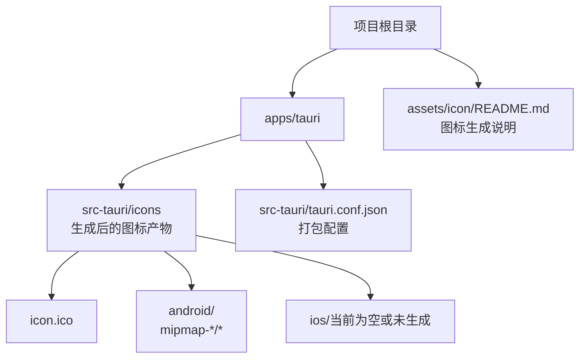
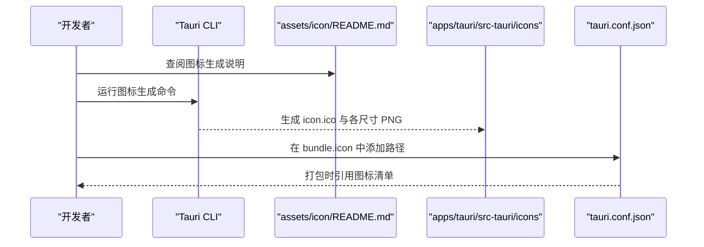
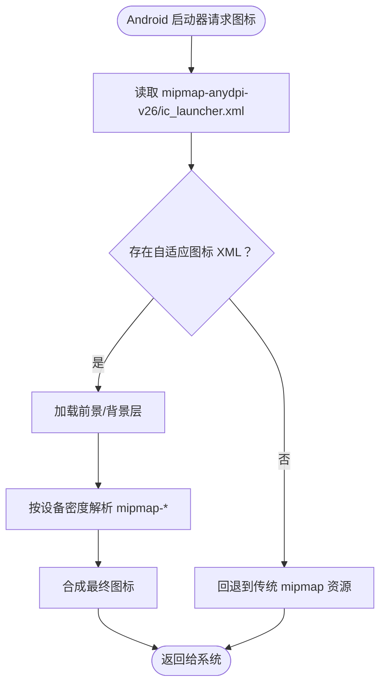
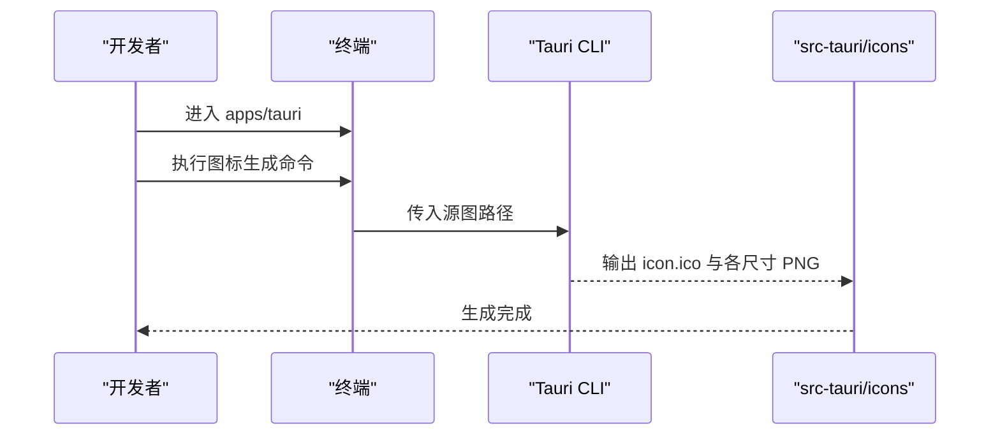
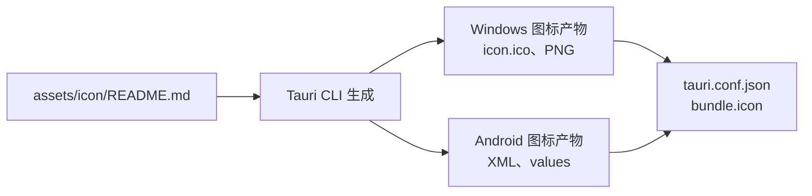

# 图标资源

<cite>
**本文引用的文件**
- [apps/tauri/src-tauri/tauri.conf.json](file://apps/tauri/src-tauri/tauri.conf.json)
- [apps/tauri/package.json](file://apps/tauri/package.json)
- [assets/icon/README.md](file://assets/icon/README.md)
- [apps/tauri/src-tauri/icons/icon.ico](file://apps/tauri/src-tauri/icons/icon.ico)
- [apps/tauri/src-tauri/icons/android/mipmap-anydpi-v26/ic_launcher.xml](file://apps/tauri/src-tauri/icons/android/mipmap-anydpi-v26/ic_launcher.xml)
- [apps/tauri/src-tauri/icons/android/values/ic_launcher_background.xml](file://apps/tauri/src-tauri/icons/android/values/ic_launcher_background.xml)
</cite>

## 目录
1. [简介](#简介)
2. [项目结构](#项目结构)
3. [核心组件](#核心组件)
4. [架构总览](#架构总览)
5. [详细组件分析](#详细组件分析)
6. [依赖关系分析](#依赖关系分析)
7. [性能与质量考量](#性能与质量考量)
8. [故障排查指南](#故障排查指南)
9. [结论](#结论)
10. [附录](#附录)

## 简介
本文件面向 CursorQ 的图标资源系统，聚焦于跨平台图标生成与分发流程，重点覆盖以下方面：
- 多平台适配策略：Windows、Android（含自适应图标）
- 不同尺寸与格式的管理：PNG、ICO、XML 配置
- Android 平台的自适应图标与 mipmap 目录结构
- iOS 平台的图标配置现状与建议
- 命名约定、分辨率要求与质量标准
- 定制化开发指南：矢量图标转换、平台特定优化与发布前检查清单

## 项目结构
图标资源主要位于 Tauri 应用的图标生成与打包配置中，核心位置如下：
- Windows 应用图标与打包清单：apps/tauri/src-tauri/tauri.conf.json 中的 bundle.icon 列表
- 跨平台图标生成脚本与源图说明：assets/icon/README.md
- Android 自适应图标配置：apps/tauri/src-tauri/icons/android 下的 XML 与 values 资源
- Windows 可执行图标：apps/tauri/src-tauri/icons/icon.ico

**图表来源**
- [apps/tauri/src-tauri/tauri.conf.json:39-46](file://apps/tauri/src-tauri/tauri.conf.json#L39-L46)
- [assets/icon/README.md:1-12](file://assets/icon/README.md#L1-L12)
- [apps/tauri/src-tauri/icons/icon.ico](file://apps/tauri/src-tauri/icons/icon.ico)
- [apps/tauri/src-tauri/icons/android/mipmap-anydpi-v26/ic_launcher.xml:1-5](file://apps/tauri/src-tauri/icons/android/mipmap-anydpi-v26/ic_launcher.xml#L1-L5)

**章节来源**
- [apps/tauri/src-tauri/tauri.conf.json:1-48](file://apps/tauri/src-tauri/tauri.conf.json#L1-L48)
- [assets/icon/README.md:1-12](file://assets/icon/README.md#L1-L12)

## 核心组件
- Windows 打包图标清单：通过 tauri.conf.json 的 bundle.icon 指定多个尺寸的 PNG 与 ICO 文件，用于桌面应用商店与系统托盘显示。
- 跨平台图标生成：使用 Tauri CLI 的图标命令，基于 assets/icon/README.md 中提供的源图生成统一的图标集。
- Android 自适应图标：采用 adaptive-icon 结构，包含前景与背景层，并通过 values 资源定义背景色。

**章节来源**
- [apps/tauri/src-tauri/tauri.conf.json:39-46](file://apps/tauri/src-tauri/tauri.conf.json#L39-L46)
- [assets/icon/README.md:1-12](file://assets/icon/README.md#L1-L12)
- [apps/tauri/src-tauri/icons/android/mipmap-anydpi-v26/ic_launcher.xml:1-5](file://apps/tauri/src-tauri/icons/android/mipmap-anydpi-v26/ic_launcher.xml#L1-L5)
- [apps/tauri/src-tauri/icons/android/values/ic_launcher_background.xml:1-4](file://apps/tauri/src-tauri/icons/android/values/ic_launcher_background.xml#L1-L4)

## 架构总览
图标资源从“源图”到“多平台产物”的整体流程如下：

**图表来源**
- [assets/icon/README.md:1-12](file://assets/icon/README.md#L1-L12)
- [apps/tauri/src-tauri/tauri.conf.json:39-46](file://apps/tauri/src-tauri/tauri.conf.json#L39-L46)

## 详细组件分析

### Windows 图标与打包配置
- 作用：定义 Windows 平台的图标清单，供打包器在安装包与系统集成处使用。
- 关键点：
  - 清单路径：apps/tauri/src-tauri/tauri.conf.json 的 bundle.icon 数组
  - 包含的文件：如 32x32.png、128x128.png、icon.ico
  - 生成来源：通过 Tauri CLI 从源图生成
- 建议：
  - 保持清单中的文件与实际生成产物一致
  - 确保 ico 与 png 尺寸覆盖常见显示场景（任务栏、开始菜单、商店等）

**章节来源**
- [apps/tauri/src-tauri/tauri.conf.json:39-46](file://apps/tauri/src-tauri/tauri.conf.json#L39-L46)
- [apps/tauri/package.json:1-22](file://apps/tauri/package.json#L1-L22)

### Android 自适应图标（含 mipmap 目录）
- 结构概览：
  - mipmap-anydpi-v26：放置自适应图标的入口 XML（ic_launcher.xml）
  - values：放置颜色资源（如 ic_launcher_background.xml），用于背景层
  - 其他 mipmap-*：可按密度放置不同分辨率的前景/背景位图（当前仓库仅包含自适应 XML）
- 关键文件：
  - ic_launcher.xml：声明前景与背景层
  - ic_launcher_background.xml：定义背景颜色
- 平台适配要点：
  - 使用自适应图标以兼容不同 Android 版本与 OEM 主题
  - 前景层建议为矢量或高分辨率 PNG，确保缩放清晰
  - 背景色与主题一致，避免透明导致的视觉问题

**图表来源**
- [apps/tauri/src-tauri/icons/android/mipmap-anydpi-v26/ic_launcher.xml:1-5](file://apps/tauri/src-tauri/icons/android/mipmap-anydpi-v26/ic_launcher.xml#L1-L5)
- [apps/tauri/src-tauri/icons/android/values/ic_launcher_background.xml:1-4](file://apps/tauri/src-tauri/icons/android/values/ic_launcher_background.xml#L1-L4)

**章节来源**
- [apps/tauri/src-tauri/icons/android/mipmap-anydpi-v26/ic_launcher.xml:1-5](file://apps/tauri/src-tauri/icons/android/mipmap-anydpi-v26/ic_launcher.xml#L1-L5)
- [apps/tauri/src-tauri/icons/android/values/ic_launcher_background.xml:1-4](file://apps/tauri/src-tauri/icons/android/values/ic_launcher_background.xml#L1-L4)

### iOS 图标配置现状与建议
- 现状：当前仓库未发现 iOS 图标目录（src-tauri/icons/ios）。iOS 图标通常由 Xcode 或打包工具自动生成，但需要明确的源图与配置。
- 建议：
  - 准备方形 1024x1024 源图，满足 App Store 与系统显示需求
  - 在 tauri.conf.json 的 bundle 配置中启用 iOS 平台（若使用 Tauri v2 的 iOS 支持）
  - 如需手动维护，建议按 Apple Human Interface Guidelines 提供的尺寸清单生成

[本节为通用建议，不直接分析具体文件，故无“章节来源”]

### 跨平台图标生成流程
- 源图来源：assets/icon/README.md 中指定的 tray-mascot.png
- 生成步骤：在 apps/tauri 目录下运行 Tauri CLI 的图标命令，生成 icon.ico 与各尺寸 PNG
- 产物位置：apps/tauri/src-tauri/icons/

**图表来源**
- [assets/icon/README.md:1-12](file://assets/icon/README.md#L1-L12)

**章节来源**
- [assets/icon/README.md:1-12](file://assets/icon/README.md#L1-L12)

## 依赖关系分析
- 生成依赖：assets/icon/README.md 提供源图与生成命令；apps/tauri/package.json 提供 Tauri CLI 依赖；apps/tauri/src-tauri/tauri.conf.json 引用生成产物。
- 平台依赖：Android 依赖自适应图标 XML 与 values 资源；Windows 依赖打包配置中的 bundle.icon。

**图表来源**
- [assets/icon/README.md:1-12](file://assets/icon/README.md#L1-L12)
- [apps/tauri/src-tauri/tauri.conf.json:39-46](file://apps/tauri/src-tauri/tauri.conf.json#L39-L46)

**章节来源**
- [apps/tauri/package.json:16-20](file://apps/tauri/package.json#L16-L20)
- [apps/tauri/src-tauri/tauri.conf.json:39-46](file://apps/tauri/src-tauri/tauri.conf.json#L39-L46)

## 性能与质量考量
- 分辨率与尺寸
  - Windows：建议至少包含 32x32、128x128、256x256、512x512 与 1024x1024（用于商店与高 DPI 显示）
  - Android：除自适应图标外，建议保留 mipmap-hdpi、mipmap-xhdpi、mipmap-xxhdpi、mipmap-xxxhdpi 的前景/背景 PNG 以提升兼容性
- 格式与压缩
  - PNG 用于透明背景与高质量缩放
  - ICO 用于 Windows 桌面集成
- 质量标准
  - 前景元素留白充足，避免边缘被裁切
  - 背景色与主题一致，避免透明导致的视觉问题
  - 矢量源图优先，便于生成多分辨率位图

[本节为通用指导，不直接分析具体文件，故无“章节来源”]

## 故障排查指南
- 生成失败
  - 确认已安装 Tauri CLI 依赖
  - 确认源图路径正确且存在
- 产物缺失
  - 检查 tauri.conf.json 的 bundle.icon 是否包含生成的文件路径
  - 确认生成命令执行后目标目录存在对应文件
- Android 启动器显示异常
  - 检查 mipmap-anydpi-v26/ic_launcher.xml 是否正确引用前景与背景
  - 检查 values 中的背景色是否符合预期
- iOS 未生成图标
  - 确认已准备 1024x1024 源图
  - 确认 tauri.conf.json 已启用 iOS 平台（若使用 Tauri v2 的 iOS 支持）

**章节来源**
- [apps/tauri/package.json:16-20](file://apps/tauri/package.json#L16-L20)
- [apps/tauri/src-tauri/tauri.conf.json:39-46](file://apps/tauri/src-tauri/tauri.conf.json#L39-L46)
- [assets/icon/README.md:1-12](file://assets/icon/README.md#L1-L12)

## 结论
CursorQ 的图标资源体系以 Tauri CLI 为核心，结合 tauri.conf.json 的打包配置，实现了跨平台图标的一致生成与分发。Android 采用自适应图标结构，Windows 通过多尺寸 PNG 与 ICO 满足系统显示需求。建议后续完善 iOS 图标生成流程与清单，并持续优化源图与分辨率矩阵，确保在不同密度与主题下的最佳显示效果。

[本节为总结性内容，不直接分析具体文件，故无“章节来源”]

## 附录
- 命名约定
  - Android：自适应图标入口命名为 ic_launcher.xml；背景色资源命名为 ic_launcher_background.xml
  - Windows：统一使用 icon.ico 作为主图标，配合各尺寸 PNG
- 发布前检查清单
  - 源图：1024x1024，矢量优先
  - 生成产物：确认 icon.ico 与各尺寸 PNG 存在
  - 配置清单：确认 tauri.conf.json 的 bundle.icon 包含所有产物
  - 平台验证：Android 自适应图标 XML 正确；Windows 图标在任务栏与商店显示正常

[本节为通用指导，不直接分析具体文件，故无“章节来源”]