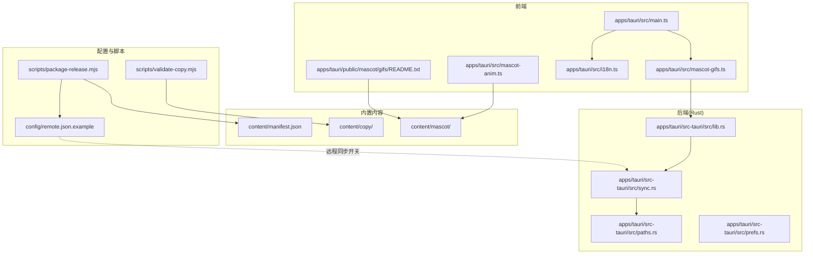
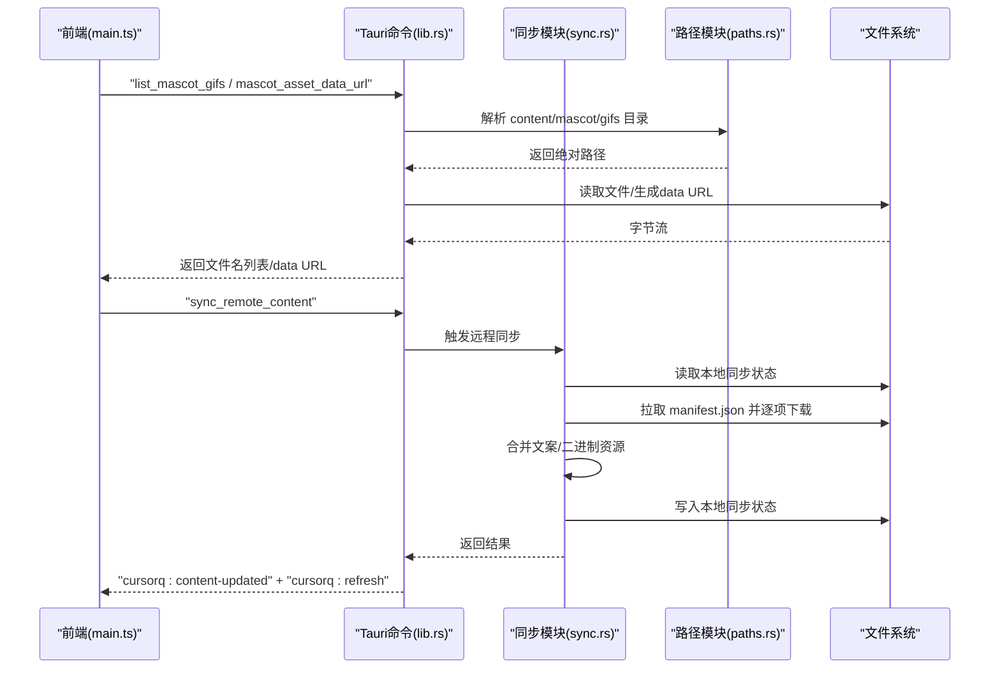
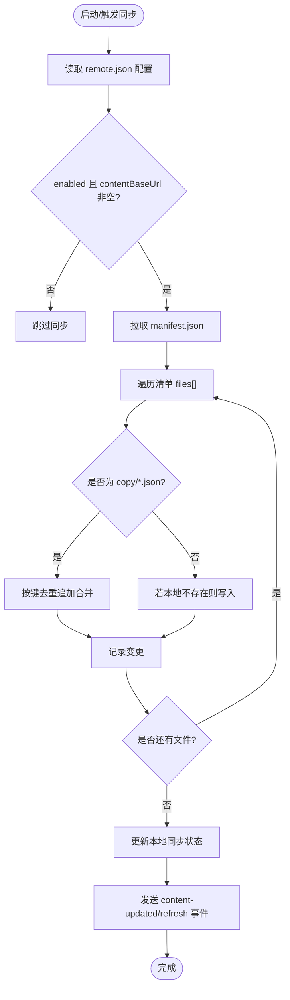
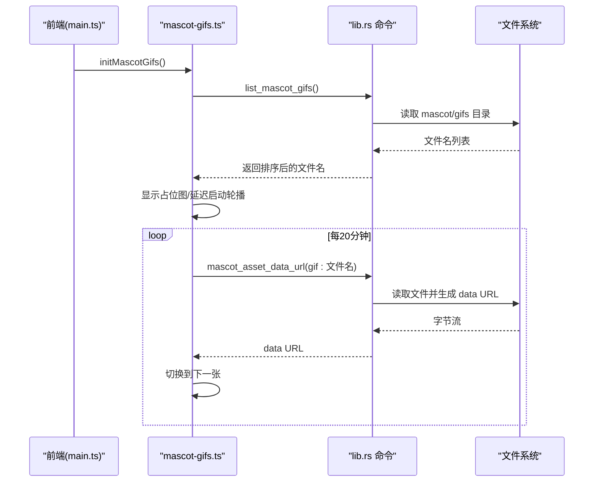
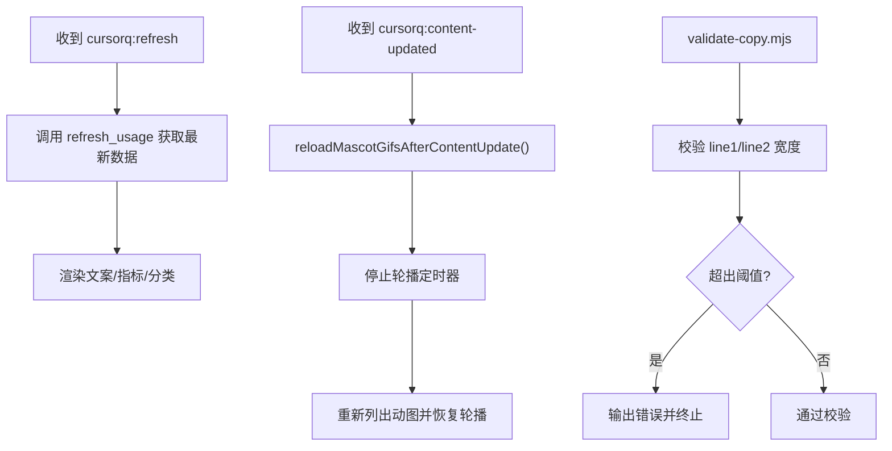
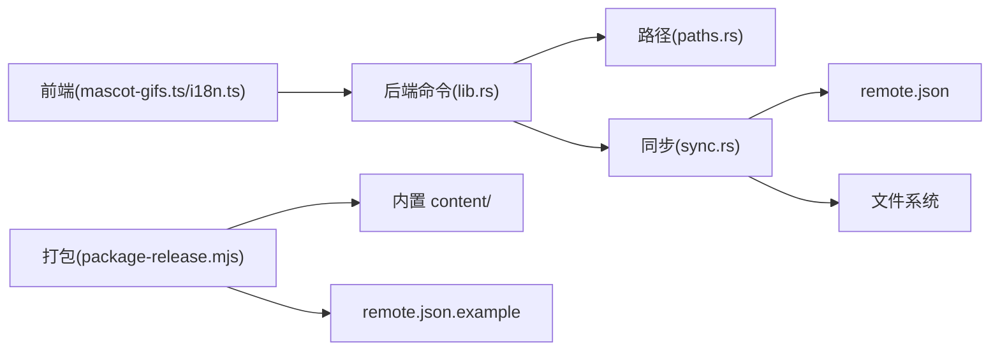

# 资源管理

<cite>
**本文引用的文件**
- [apps/tauri/src/mascot-anim.ts](file://apps/tauri/src/mascot-anim.ts)
- [apps/tauri/src/mascot-gifs.ts](file://apps/tauri/src/mascot-gifs.ts)
- [apps/tauri/src/i18n.ts](file://apps/tauri/src/i18n.ts)
- [apps/tauri/src/main.ts](file://apps/tauri/src/main.ts)
- [apps/tauri/public/mascot/gifs/README.txt](file://apps/tauri/public/mascot/gifs/README.txt)
- [content/manifest.json](file://content/manifest.json)
- [content/copy/jokes.json](file://content/copy/jokes.json)
- [content/copy/states.json](file://content/copy/states.json)
- [config/remote.json.example](file://config/remote.json.example)
- [apps/tauri/src-tauri/src/sync.rs](file://apps/tauri/src-tauri/src/sync.rs)
- [apps/tauri/src-tauri/src/lib.rs](file://apps/tauri/src-tauri/src/lib.rs)
- [apps/tauri/src-tauri/src/paths.rs](file://apps/tauri/src-tauri/src/paths.rs)
- [apps/tauri/src-tauri/src/prefs.rs](file://apps/tauri/src-tauri/src/prefs.rs)
- [scripts/package-release.mjs](file://scripts/package-release.mjs)
- [scripts/validate-copy.mjs](file://scripts/validate-copy.mjs)
</cite>

## 目录
1. [简介](#简介)
2. [项目结构](#项目结构)
3. [核心组件](#核心组件)
4. [架构总览](#架构总览)
5. [详细组件分析](#详细组件分析)
6. [依赖关系分析](#依赖关系分析)
7. [性能考量](#性能考量)
8. [故障排查指南](#故障排查指南)
9. [结论](#结论)
10. [附录](#附录)

## 简介
本文件系统性梳理 CursorQ 的资源管理体系，涵盖内容管理（内置内容与远程同步、合并规则、版本控制）、动物角色资源（GIF 动画与静态图像、加载优化）、文本内容（多语言、动态更新、内容校验）、图标资源管理，以及资源打包、分发与版本管理最佳实践。文档面向开发者与运营人员，既提供高层架构视图，也给出可操作的实现细节与排障建议。

## 项目结构
资源相关的核心位置与职责：
- content/：内置内容目录，包含 manifest.json、文案 copy/ 与 mascot/ 资源
- config/remote.json.example：远程同步配置模板
- apps/tauri/public/mascot/gifs/：开发期静态 GIF 放置区与使用说明
- apps/tauri/src-tauri/src/sync.rs：远程内容拉取与合并逻辑
- apps/tauri/src-tauri/src/paths.rs：应用路径解析（内置 content、data、config 等）
- apps/tauri/src/mascot-gifs.ts 与 mascot-anim.ts：前端吉祥物资源加载与播放控制
- apps/tauri/src/i18n.ts：多语言文案映射
- scripts/package-release.mjs：发布打包脚本（携带内置 content 与配置模板）
- scripts/validate-copy.mjs：文案宽度校验工具

**图表来源**
- [apps/tauri/src/main.ts:1-711](file://apps/tauri/src/main.ts#L1-L711)
- [apps/tauri/src/mascot-gifs.ts:1-164](file://apps/tauri/src/mascot-gifs.ts#L1-L164)
- [apps/tauri/src/mascot-anim.ts:1-29](file://apps/tauri/src/mascot-anim.ts#L1-L29)
- [apps/tauri/src/i18n.ts:1-89](file://apps/tauri/src/i18n.ts#L1-L89)
- [apps/tauri/src-tauri/src/sync.rs:1-372](file://apps/tauri/src-tauri/src/sync.rs#L1-L372)
- [apps/tauri/src-tauri/src/lib.rs:1-857](file://apps/tauri/src-tauri/src/lib.rs#L1-L857)
- [apps/tauri/src-tauri/src/paths.rs:1-142](file://apps/tauri/src-tauri/src/paths.rs#L1-L142)
- [content/manifest.json:1-12](file://content/manifest.json#L1-L12)
- [config/remote.json.example:1-6](file://config/remote.json.example#L1-L6)
- [scripts/package-release.mjs:1-136](file://scripts/package-release.mjs#L1-L136)
- [scripts/validate-copy.mjs:1-36](file://scripts/validate-copy.mjs#L1-L36)

**章节来源**
- [content/manifest.json:1-12](file://content/manifest.json#L1-L12)
- [config/remote.json.example:1-6](file://config/remote.json.example#L1-L6)
- [apps/tauri/public/mascot/gifs/README.txt:1-10](file://apps/tauri/public/mascot/gifs/README.txt#L1-L10)
- [apps/tauri/src-tauri/src/paths.rs:1-142](file://apps/tauri/src-tauri/src/paths.rs#L1-L142)
- [scripts/package-release.mjs:1-136](file://scripts/package-release.mjs#L1-L136)

## 核心组件
- 内容清单与版本控制：通过 content/manifest.json 声明内置资源与版本号，Rust 同步模块据此判断是否需要初始化或更新本地状态
- 远程同步与合并：Rust 模块按清单逐项拉取，对文案采用“追加不覆盖”的合并策略，对二进制资源采用“本地已存在则跳过”的策略
- 文案与多语言：content/copy 下的 jokes.json 与 states.json 提供文案池，i18n.ts 提供多语言映射与格式化函数
- 吉祥物资源：前端通过 Tauri 命令读取本地文件或以 data URL 形式加载，支持占位图、静态图与动图轮播
- 打包与分发：发布脚本将内置 content 与 remote.json.example 打包入便携包，便于离线使用与远程同步启用

**章节来源**
- [apps/tauri/src-tauri/src/sync.rs:122-187](file://apps/tauri/src-tauri/src/sync.rs#L122-L187)
- [apps/tauri/src-tauri/src/lib.rs:31-120](file://apps/tauri/src-tauri/src/lib.rs#L31-L120)
- [apps/tauri/src/i18n.ts:1-89](file://apps/tauri/src/i18n.ts#L1-L89)
- [apps/tauri/src/mascot-gifs.ts:1-164](file://apps/tauri/src/mascot-gifs.ts#L1-L164)
- [scripts/package-release.mjs:74-84](file://scripts/package-release.mjs#L74-L84)

## 架构总览
资源管理由“前端请求—后端命令—路径解析—远程同步—内容合并—事件通知”构成闭环。

**图表来源**
- [apps/tauri/src/main.ts:700-711](file://apps/tauri/src/main.ts#L700-L711)
- [apps/tauri/src-tauri/src/lib.rs:127-138](file://apps/tauri/src-tauri/src/lib.rs#L127-L138)
- [apps/tauri/src-tauri/src/sync.rs:261-367](file://apps/tauri/src-tauri/src/sync.rs#L261-L367)
- [apps/tauri/src-tauri/src/paths.rs:38-107](file://apps/tauri/src-tauri/src/paths.rs#L38-L107)

## 详细组件分析

### 内容管理（内置内容与远程同步、合并规则、版本控制）
- 清单与版本：content/manifest.json 定义版本号与文件清单，Rust 初始化阶段读取清单并检查内置文件是否存在，记录本地同步状态中的 manifest_version 与最后同步时间
- 远程同步：根据 config/remote.json 的 enabled、contentBaseUrl 与 syncDelayMs 配置，按清单逐项拉取远程文件，对非文案类二进制资源直接写入（若本地不存在），对文案类文件执行“追加不重复”的合并策略
- 合并规则
  - 文案合并：以“状态+line1+line2”为键去重，仅追加新增条目，保留本地与手动条目
  - 二进制资源：若目标文件已存在则跳过，避免覆盖用户手动放入的资源
- 版本控制：比较远程 manifest.version 与本地记录，更新本地状态并记录最新同步时间

**图表来源**
- [apps/tauri/src-tauri/src/sync.rs:261-367](file://apps/tauri/src-tauri/src/sync.rs#L261-L367)
- [apps/tauri/src-tauri/src/sync.rs:122-187](file://apps/tauri/src-tauri/src/sync.rs#L122-L187)
- [config/remote.json.example:1-6](file://config/remote.json.example#L1-L6)

**章节来源**
- [apps/tauri/src-tauri/src/sync.rs:12-372](file://apps/tauri/src-tauri/src/sync.rs#L12-L372)
- [content/manifest.json:1-12](file://content/manifest.json#L1-L12)
- [config/remote.json.example:1-6](file://config/remote.json.example#L1-L6)

### 动物角色资源管理（GIF 动画与静态图像、加载优化）
- 资源组织
  - 内置占位图：content/mascot/default.png 或 default.svg
  - 动态轮播：content/mascot/gifs/ 下的 .gif/.webp/.png，按文件名排序轮播
  - 开发期放置区：apps/tauri/public/mascot/gifs/README.txt 提示文件命名与轮播行为
- 加载与播放
  - 前端通过 Tauri 命令列出动图、生成 data URL，避免 asset:// 在部分环境失败
  - 吉祥物动图轮播：启动后先显示占位图，1 分钟后开始轮播，每 20 分钟切换一次
  - 占位动画：content/mascot/gifs/animation.gif 不参与轮播
- 优化策略
  - data URL 直接注入到 img 元素，减少跨域与协议差异问题
  - 轮播定时器与启动定时器分离，避免阻塞
  - 若远程同步触发，前端在重新加载列表后恢复轮播

**图表来源**
- [apps/tauri/src/main.ts:695-696](file://apps/tauri/src/main.ts#L695-L696)
- [apps/tauri/src/mascot-gifs.ts:121-164](file://apps/tauri/src/mascot-gifs.ts#L121-L164)
- [apps/tauri/src-tauri/src/lib.rs:31-120](file://apps/tauri/src-tauri/src/lib.rs#L31-L120)
- [apps/tauri/public/mascot/gifs/README.txt:1-10](file://apps/tauri/public/mascot/gifs/README.txt#L1-L10)

**章节来源**
- [apps/tauri/src/mascot-gifs.ts:1-164](file://apps/tauri/src/mascot-gifs.ts#L1-L164)
- [apps/tauri/src-tauri/src/lib.rs:31-120](file://apps/tauri/src-tauri/src/lib.rs#L31-L120)
- [apps/tauri/public/mascot/gifs/README.txt:1-10](file://apps/tauri/public/mascot/gifs/README.txt#L1-L10)

### 文本内容管理（多语言、动态内容更新、内容验证机制）
- 多语言：i18n.ts 提供 zh/en 两套键值映射，以及日期范围格式化函数
- 动态内容：前端监听 cursorq:refresh 事件进行刷新；监听 cursorq:content-updated 事件在远程同步后重新加载吉祥物列表并稳定窗口渲染
- 内容验证：validate-copy.mjs 对 jokes.json 与 states.json 的每条文案进行显示宽度校验，确保在界面中可完整展示

**图表来源**
- [apps/tauri/src/main.ts:700-711](file://apps/tauri/src/main.ts#L700-L711)
- [apps/tauri/src/mascot-gifs.ts:127-143](file://apps/tauri/src/mascot-gifs.ts#L127-L143)
- [scripts/validate-copy.mjs:1-36](file://scripts/validate-copy.mjs#L1-L36)

**章节来源**
- [apps/tauri/src/i18n.ts:1-89](file://apps/tauri/src/i18n.ts#L1-L89)
- [apps/tauri/src/main.ts:700-711](file://apps/tauri/src/main.ts#L700-L711)
- [scripts/validate-copy.mjs:1-36](file://scripts/validate-copy.mjs#L1-L36)

### 图标资源管理
- 应用图标与平台适配：icons/ 目录包含 Android 与 iOS 的图标资源，用于构建与分发
- 运行时图标：托盘图标与窗口图标在 Rust 初始化阶段设置，并随偏好更新而调整

**章节来源**
- [apps/tauri/src-tauri/src/lib.rs:780-800](file://apps/tauri/src-tauri/src/lib.rs#L780-L800)
- [apps/tauri/src-tauri/src/prefs.rs:78-96](file://apps/tauri/src-tauri/src/prefs.rs#L78-L96)

## 依赖关系分析
- 前端依赖后端命令：mascot-gifs.ts 通过 invoke 调用 list_mascot_gifs 与 mascot_asset_data_url
- 后端依赖路径模块：sync.rs 与 lib.rs 通过 paths.rs 解析 content_dir、data_dir、config_dir 等
- 远程同步依赖网络与配置：基于 remote.json 的 enabled 与 contentBaseUrl
- 打包依赖内置内容：package-release.mjs 将 content 与 remote.json.example 打包入便携包

**图表来源**
- [apps/tauri/src-tauri/src/lib.rs:720-736](file://apps/tauri/src-tauri/src/lib.rs#L720-L736)
- [apps/tauri/src-tauri/src/sync.rs:261-367](file://apps/tauri/src-tauri/src/sync.rs#L261-L367)
- [apps/tauri/src-tauri/src/paths.rs:38-107](file://apps/tauri/src-tauri/src/paths.rs#L38-L107)
- [scripts/package-release.mjs:74-84](file://scripts/package-release.mjs#L74-L84)

**章节来源**
- [apps/tauri/src-tauri/src/lib.rs:720-736](file://apps/tauri/src-tauri/src/lib.rs#L720-L736)
- [apps/tauri/src-tauri/src/sync.rs:261-367](file://apps/tauri/src-tauri/src/sync.rs#L261-L367)
- [apps/tauri/src-tauri/src/paths.rs:38-107](file://apps/tauri/src-tauri/src/paths.rs#L38-L107)
- [scripts/package-release.mjs:74-84](file://scripts/package-release.mjs#L74-L84)

## 性能考量
- 数据加载：优先使用 data URL 直接注入图片，避免 asset:// 在部分环境失败导致的二次加载
- 轮播策略：固定间隔切换，避免频繁 IO；启动前占位图减少首屏等待
- 同步策略：后台线程执行远程同步，避免阻塞 UI；延迟启动远程同步，降低冷启动压力
- 文案合并：去重算法使用哈希集合，时间复杂度 O(n)，适合中等规模文案集
- 打包体积：便携包包含内置 content，减少首次启动网络依赖

[本节为通用指导，无需具体文件分析]

## 故障排查指南
- 远程同步未生效
  - 检查 config/remote.json 是否启用且 contentBaseUrl 正确
  - 查看后端日志（lib.rs 初始化时会记录路径与权限）
- 文案未更新
  - 确认远程 manifest.json 的版本号是否高于本地记录
  - 检查 validate-copy.mjs 是否报错（文案宽度超限）
- 吉祥物动图不显示
  - 确认 content/mascot/gifs/ 下文件名符合要求且未被占位动画占用
  - 检查 mascot-gifs.ts 的 data URL 生成与加载回调
- 打包后资源缺失
  - 确认 package-release.mjs 是否正确复制 content 与 remote.json.example
- 偏好设置异常
  - 检查 data/app-state.json 的 capsuleVisible、alwaysOnTop、launchAtStartup 等字段

**章节来源**
- [config/remote.json.example:1-6](file://config/remote.json.example#L1-L6)
- [apps/tauri/src-tauri/src/lib.rs:737-772](file://apps/tauri/src-tauri/src/lib.rs#L737-L772)
- [scripts/validate-copy.mjs:1-36](file://scripts/validate-copy.mjs#L1-L36)
- [apps/tauri/src/mascot-gifs.ts:42-84](file://apps/tauri/src/mascot-gifs.ts#L42-L84)
- [scripts/package-release.mjs:74-84](file://scripts/package-release.mjs#L74-L84)
- [apps/tauri/src-tauri/src/prefs.rs:53-76](file://apps/tauri/src-tauri/src/prefs.rs#L53-L76)

## 结论
CursorQ 的资源管理以“内置内容 + 远程同步 + 本地合并”为核心，通过严格的合并规则与事件驱动的前端刷新，实现了稳定的离线可用与在线更新能力。吉祥物资源采用 data URL 与定时轮播策略，兼顾兼容性与性能。文案与多语言体系配合校验工具，保障界面呈现质量。发布脚本将内置资源与配置模板打包入便携包，简化部署与运维。

[本节为总结，无需具体文件分析]

## 附录

### 资源文件组织结构与命名规范
- 内置内容
  - content/manifest.json：声明版本与文件清单
  - content/copy/jokes.json、states.json：文案池（含标签/状态字段）
  - content/mascot/default.png 或 default.svg：占位图
  - content/mascot/gifs/：动图轮播目录（支持 .gif/.webp/.png；animation.gif 为占位动画）
- 配置
  - config/remote.json.example：启用远程同步与基础地址、延迟等参数
- 开发期资源
  - apps/tauri/public/mascot/gifs/README.txt：命名与轮播说明

**章节来源**
- [content/manifest.json:1-12](file://content/manifest.json#L1-L12)
- [content/copy/jokes.json:1-46](file://content/copy/jokes.json#L1-L46)
- [content/copy/states.json:1-14](file://content/copy/states.json#L1-L14)
- [apps/tauri/public/mascot/gifs/README.txt:1-10](file://apps/tauri/public/mascot/gifs/README.txt#L1-L10)
- [config/remote.json.example:1-6](file://config/remote.json.example#L1-L6)

### 更新流程与缓存策略
- 更新流程
  - 启动时：Rust 读取内置 manifest.json，检查文件存在性，记录本地同步状态
  - 后台：按 syncDelayMs 延迟执行远程同步，拉取清单并逐项合并
  - 前端：收到 content-updated 事件后重新列出动图并恢复轮播
- 缓存策略
  - 本地同步状态：记录 manifest_version 与 last_sync_iso
  - 文案缓存：本地已存在即跳过，避免覆盖用户手动条目
  - 二进制缓存：本地存在则不覆盖，确保用户自定义资源持久化

**章节来源**
- [apps/tauri/src-tauri/src/sync.rs:237-258](file://apps/tauri/src-tauri/src/sync.rs#L237-L258)
- [apps/tauri/src-tauri/src/sync.rs:347-356](file://apps/tauri/src-tauri/src/sync.rs#L347-L356)
- [apps/tauri/src/main.ts:700-711](file://apps/tauri/src/main.ts#L700-L711)

### 版本管理与发布最佳实践
- 版本管理
  - 通过 content/manifest.json 的 version 字段标识内置内容版本
  - 远程同步时比较远程版本与本地记录，决定是否更新
- 发布打包
  - 使用 scripts/package-release.mjs 将内置 content 与 remote.json.example 打包入便携包
  - 自动复制 @cursorq/core 与必要依赖，确保运行时可用
- 最佳实践
  - 远程同步启用前先在本地验证文案宽度（validate-copy.mjs）
  - 用户自定义资源应放在 content/mascot/gifs/ 下，避免与内置资源冲突
  - 首次启动尽量使用内置 content，待稳定后再启用远程同步

**章节来源**
- [content/manifest.json:1-12](file://content/manifest.json#L1-L12)
- [apps/tauri/src-tauri/src/sync.rs:347-356](file://apps/tauri/src-tauri/src/sync.rs#L347-L356)
- [scripts/package-release.mjs:74-122](file://scripts/package-release.mjs#L74-L122)
- [scripts/validate-copy.mjs:1-36](file://scripts/validate-copy.mjs#L1-L36)

### 自定义内容开发指南
- 文案自定义
  - 在 content/copy/ 下新增或修改 jokes.json、states.json，遵循现有字段结构
  - 使用 validate-copy.mjs 校验显示宽度，避免截断
- 动图自定义
  - 将 .gif/.webp/.png 放入 content/mascot/gifs/，按 01-xxx.gif、02-yyy.gif 命名以便排序
  - 占位动画 animation.gif 不参与轮播，可替换为自定义占位动图
- 多语言扩展
  - 在 apps/tauri/src/i18n.ts 中添加新键值与翻译
  - 前端代码中通过 t(locale, key) 获取对应文案
- 远程同步启用
  - 复制 config/remote.json.example 为 config/remote.json，设置 enabled 与 contentBaseUrl
  - 启动后按 syncDelayMs 延迟执行远程同步，自动合并新增文案与资源

**章节来源**
- [content/copy/jokes.json:1-46](file://content/copy/jokes.json#L1-L46)
- [content/copy/states.json:1-14](file://content/copy/states.json#L1-L14)
- [apps/tauri/public/mascot/gifs/README.txt:1-10](file://apps/tauri/public/mascot/gifs/README.txt#L1-L10)
- [apps/tauri/src/i18n.ts:1-89](file://apps/tauri/src/i18n.ts#L1-L89)
- [config/remote.json.example:1-6](file://config/remote.json.example#L1-L6)