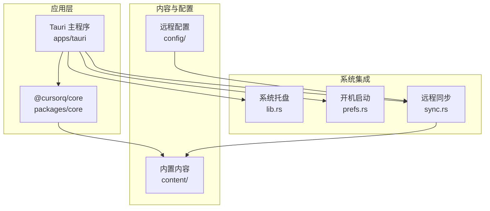
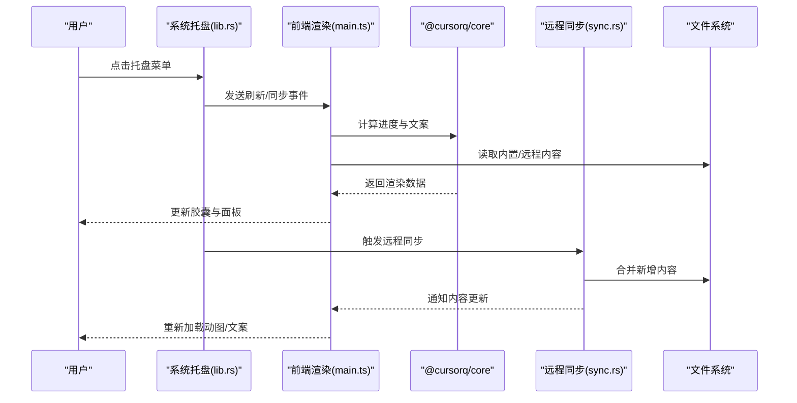
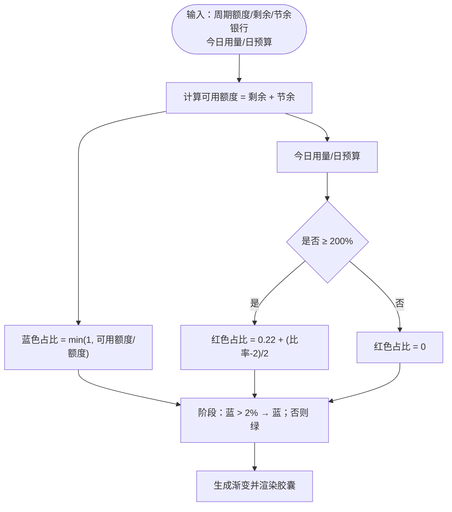
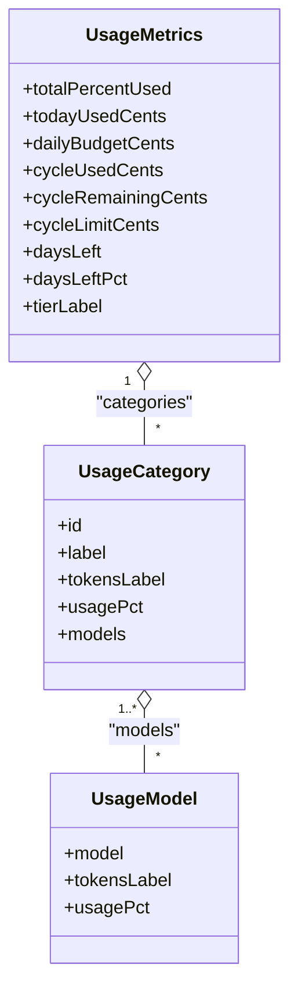
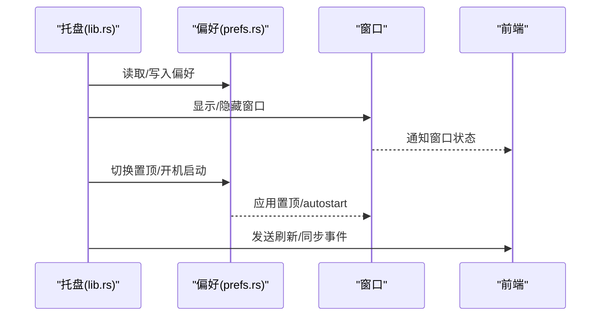
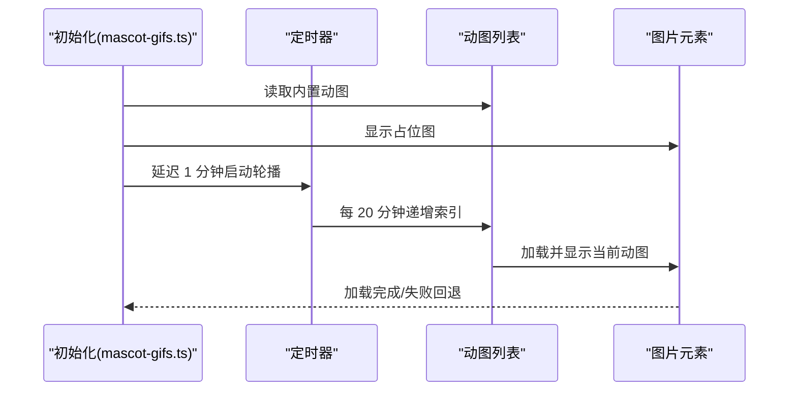
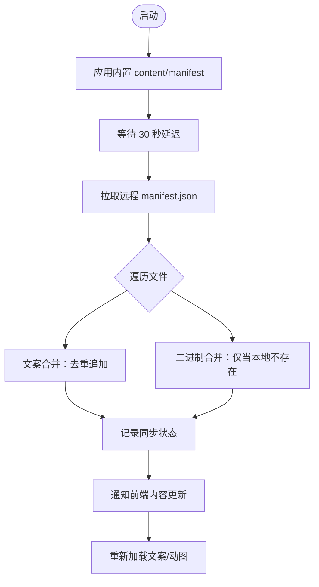
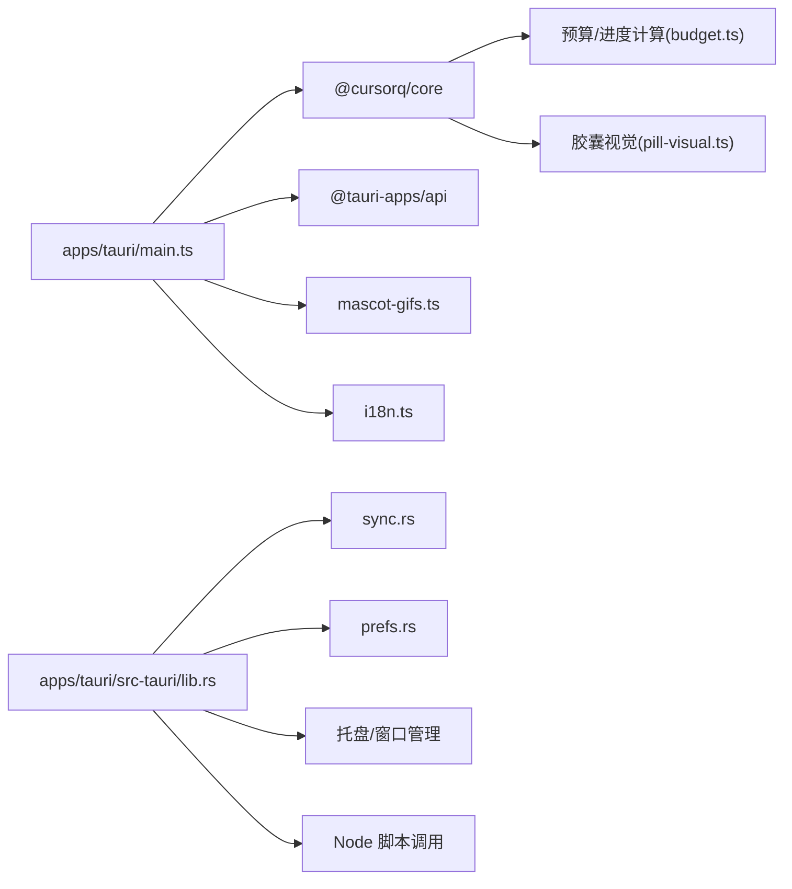

# 应用介绍

<cite>
**本文引用的文件**
- [README.md](file://README.md)
- [main.ts](file://apps/tauri/src/main.ts)
- [lib.rs](file://apps/tauri/src-tauri/src/lib.rs)
- [pill-visual.ts](file://packages/core/src/pill-visual.ts)
- [budget.ts](file://packages/core/src/budget.ts)
- [mascot-gifs.ts](file://apps/tauri/src/mascot-gifs.ts)
- [i18n.ts](file://apps/tauri/src/i18n.ts)
- [sync.rs](file://apps/tauri/src-tauri/src/sync.rs)
- [prefs.rs](file://apps/tauri/src-tauri/src/prefs.rs)
- [manifest.json](file://content/manifest.json)
- [jokes.json](file://content/copy/jokes.json)
- [states.json](file://content/copy/states.json)
- [main.rs](file://apps/tauri/src-tauri/src/main.rs)
- [package.json](file://apps/tauri/package.json)
</cite>

## 目录
1. [简介](#简介)
2. [项目结构](#项目结构)
3. [核心组件](#核心组件)
4. [架构总览](#架构总览)
5. [详细组件分析](#详细组件分析)
6. [依赖关系分析](#依赖关系分析)
7. [性能考量](#性能考量)
8. [故障排查指南](#故障排查指南)
9. [结论](#结论)
10. [附录](#附录)

## 简介
CursorQ 是一款为 Cursor 订阅用量提供桌面胶囊挂件的可视化提醒工具。它在屏幕顶部以胶囊形态显示周期余量、今日预算与趣味文案，不拦截或修改 Cursor 的任何网络请求，仅读取本地登录态与 Dashboard 数据进行提醒与可视化。其核心价值在于：
- 无需离开工作流即可掌握 AI 使用费用与节奏
- 通过直观的颜色与文案提示，帮助用户在日常工作中自然地管理预算
- 保持与 Cursor 原生体验一致，不影响 Cursor 的正常使用

## 项目结构
项目采用多包/模块化组织，前端主程序基于 Tauri 2，核心业务逻辑封装在 @cursorq/core 包中，内容资源（文案、动图）位于 content/ 目录，构建与发布脚本集中在 scripts/。

图表来源
- [lib.rs:716-800](file://apps/tauri/src-tauri/src/lib.rs#L716-L800)
- [main.ts:1-711](file://apps/tauri/src/main.ts#L1-L711)
- [sync.rs:261-372](file://apps/tauri/src-tauri/src/sync.rs#L261-L372)
- [prefs.rs:128-145](file://apps/tauri/src-tauri/src/prefs.rs#L128-L145)

章节来源
- [README.md:98-118](file://README.md#L98-L118)
- [package.json:1-22](file://apps/tauri/package.json#L1-L22)

## 核心组件
- 胶囊进度条与视觉系统：根据周期剩余、节余银行与今日用量计算胶囊颜色与进度，200% 日预算触发红色警示。
- 单行文案轮播：根据用量状态轮播内置/远程的段子与状态文案，支持点击切换。
- 用量详情面板：展示计费周期、今日/周期用量、日预算、剩余天数，并按 API/Auto 分类展开模型明细。
- 系统托盘集成：提供显示/隐藏胶囊、中/英切换、置顶、开机启动、立即刷新、同步内容等控制。
- 吉祥物动图：启动显示占位图，约 1 分钟后轮播 content/mascot/gifs 中的动图，支持双击手动切换。
- 远程内容合并：启动即用内置 content/，约 30 秒后从 GitHub 追加 jokes 与动图，不覆盖本地已有条目。

章节来源
- [README.md:5-12](file://README.md#L5-L12)
- [pill-visual.ts:1-79](file://packages/core/src/pill-visual.ts#L1-L79)
- [main.ts:417-461](file://apps/tauri/src/main.ts#L417-L461)
- [mascot-gifs.ts:121-164](file://apps/tauri/src/mascot-gifs.ts#L121-L164)
- [sync.rs:261-372](file://apps/tauri/src-tauri/src/sync.rs#L261-L372)

## 架构总览
应用采用“前端渲染 + Rust 后端”的 Tauri 架构。前端负责 UI 渲染、交互与定时刷新；后端负责系统托盘、窗口管理、远程同步、偏好存储与 Node 脚本调用。

图表来源
- [lib.rs:664-713](file://apps/tauri/src-tauri/src/lib.rs#L664-L713)
- [main.ts:526-560](file://apps/tauri/src/main.ts#L526-L560)
- [sync.rs:261-372](file://apps/tauri/src-tauri/src/sync.rs#L261-L372)

## 详细组件分析

### 胶囊进度条与视觉系统
- 进度计算：基于周期剩余 + 节余银行占额度的比例决定蓝色区域；当今日用量 ≥ 2× 日预算时，从左侧出现红色警示条。
- 面板参考：总量/周期用量等仅用于详情面板参考，不参与胶囊颜色判断。
- 配色与渐变：通过 buildPillBarGradient 生成胶囊背景渐变，结合 red/blue/warn 比例动态更新。

图表来源
- [pill-visual.ts:29-63](file://packages/core/src/pill-visual.ts#L29-L63)
- [main.ts:174-188](file://apps/tauri/src/main.ts#L174-L188)

章节来源
- [pill-visual.ts:1-79](file://packages/core/src/pill-visual.ts#L1-L79)
- [main.ts:174-188](file://apps/tauri/src/main.ts#L174-L188)

### 用量详情面板
- 面板内容：包含总量（周期已用百分比）、今日已用（含日预算对比）、剩余天数（紧迫度）等指标。
- 分类与模型：按 API/Auto 等桶聚合，支持展开查看各模型的 Tokens 与占比。
- 交互：点击分类行展开/收起；双击胶囊展开/收起详情；点击提示行可进入/退出调试模式。

图表来源
- [main.ts:59-103](file://apps/tauri/src/main.ts#L59-L103)
- [main.ts:319-415](file://apps/tauri/src/main.ts#L319-L415)

章节来源
- [main.ts:216-278](file://apps/tauri/src/main.ts#L216-L278)
- [main.ts:319-415](file://apps/tauri/src/main.ts#L319-L415)

### 系统托盘与偏好
- 菜单项：显示/隐藏胶囊、中/英切换、总是置顶、开机启动、立即刷新、同步文案/动图、退出。
- 偏好存储：胶囊可见性、置顶、开机启动等状态持久化到本地 JSON。
- 窗口行为：托盘点击/双击控制胶囊显示/隐藏；置顶变更时调整窗口层级与 DWM 形状。

图表来源
- [lib.rs:282-387](file://apps/tauri/src-tauri/src/lib.rs#L282-L387)
- [prefs.rs:128-145](file://apps/tauri/src-tauri/src/prefs.rs#L128-L145)

章节来源
- [lib.rs:282-387](file://apps/tauri/src-tauri/src/lib.rs#L282-L387)
- [prefs.rs:1-145](file://apps/tauri/src-tauri/src/prefs.rs#L1-L145)

### 吉祥物动图与轮播
- 启动占位：默认显示 mascot/default.png，约 1 分钟后开始轮播 content/mascot/gifs。
- 轮播策略：每 20 分钟切换一张；双击吉祥物可手动切换；支持 .gif/.webp/.png。
- 资源加载：优先通过 data URL 从内置资源加载，开发环境回退至 public 路径。

图表来源
- [mascot-gifs.ts:121-164](file://apps/tauri/src/mascot-gifs.ts#L121-L164)

章节来源
- [mascot-gifs.ts:1-164](file://apps/tauri/src/mascot-gifs.ts#L1-L164)
- [manifest.json:1-12](file://content/manifest.json#L1-L12)

### 远程内容合并与同步
- 启动即用：应用启动时应用内置 content/（manifest.json 指定文件清单）。
- 延迟同步：约 30 秒后从配置的远程地址拉取 manifest.json 并逐项合并。
- 合并规则：仅追加远程新条目，不覆盖本地已有文案与动图；二进制资源仅在本地不存在时写入。
- 结果通知：内容更新后向前端发出事件，触发重新渲染与动图重载。

图表来源
- [sync.rs:261-372](file://apps/tauri/src-tauri/src/sync.rs#L261-L372)
- [manifest.json:1-12](file://content/manifest.json#L1-L12)

章节来源
- [sync.rs:12-372](file://apps/tauri/src-tauri/src/sync.rs#L12-L372)
- [README.md:84-97](file://README.md#L84-L97)

### 文案与国际化
- 文案池：内置 jokes.json 与 states.json，支持按状态标签分类；可通过远程配置追加。
- 国际化：支持中文/英文，文案与格式化日期均按语言切换。
- 交互提示：提示行显示“数据来自 Cursor dashboard”、“调试模式”等辅助信息。

章节来源
- [i18n.ts:1-89](file://apps/tauri/src/i18n.ts#L1-L89)
- [jokes.json:1-46](file://content/copy/jokes.json#L1-L46)
- [states.json:1-14](file://content/copy/states.json#L1-L14)

## 依赖关系分析
- 前端依赖：@cursorq/core 提供核心业务逻辑（鉴权、API、预算、进度计算、文案与详情面板）；@tauri-apps/api 提供窗口、事件与命令调用能力。
- 后端依赖：Tauri 插件（shell、autostart）、reqwest（HTTP 客户端）、Windows DWM（窗口形状与非激活行为）。
- 构建与运行：Node.js 20+、Rust（MSVC 工具链）、WebView2；开发脚本位于 scripts/。

图表来源
- [main.ts:1-35](file://apps/tauri/src/main.ts#L1-L35)
- [lib.rs:716-800](file://apps/tauri/src-tauri/src/lib.rs#L716-L800)
- [package.json:12-21](file://apps/tauri/package.json#L12-L21)

章节来源
- [package.json:12-21](file://apps/tauri/package.json#L12-L21)
- [main.rs:3-6](file://apps/tauri/src-tauri/src/main.rs#L3-L6)

## 性能考量
- 窗口渲染优化：胶囊与详情面板采用无动画的高度切换，避免 WebView 卷轴动画触发导致的白边问题。
- 资源加载：动图优先使用 data URL，减少跨协议加载失败风险；仅在必要时发起网络请求。
- 后台刷新：托盘“刷新”与远程同步在后台线程执行，避免阻塞 UI。
- 定时策略：默认每 30 分钟自动刷新一次用量数据，亦支持手动刷新。

章节来源
- [main.ts:492-522](file://apps/tauri/src/main.ts#L492-L522)
- [mascot-gifs.ts:42-49](file://apps/tauri/src/mascot-gifs.ts#L42-L49)
- [lib.rs:618-639](file://apps/tauri/src-tauri/src/lib.rs#L618-L639)

## 故障排查指南
- 未登录 Cursor：当检测到未登录时，胶囊会提示“请先登录 Cursor”。请确保已安装并登录 Cursor 桌面版。
- 远程同步失败：检查 remote.json 配置是否启用且 contentBaseUrl 不为空；确认网络可达；查看日志文件定位错误。
- 窗口白边/阴影异常：托盘菜单中“立即刷新”或“同步文案/动图”后，前端会发送“fix-chrome”事件，触发 DWM 形状重调；如仍异常，尝试切换“总是置顶”后恢复。
- 文案/动图未更新：确认远程配置已启用且 manifest.json 可访问；等待约 30 秒后自动合并；也可在托盘菜单中选择“同步文案/动图”。

章节来源
- [main.ts:526-560](file://apps/tauri/src/main.ts#L526-L560)
- [sync.rs:261-372](file://apps/tauri/src-tauri/src/sync.rs#L261-L372)
- [lib.rs:587-614](file://apps/tauri/src-tauri/src/lib.rs#L587-L614)

## 结论
CursorQ 以简洁直观的方式将 Cursor 订阅用量转化为可感知的桌面胶囊提醒，既不干扰 Cursor 的原生体验，又能帮助用户在日常工作中持续关注 AI 使用成本。通过胶囊颜色、文案轮播与详情面板的组合，用户可以在不打断工作流的前提下，获得及时、易懂的用量反馈与节奏提示。配合远程内容合并与系统托盘控制，应用在可用性与可定制性上实现了良好平衡。

## 附录
- 快速上手：安装并登录 Cursor 桌面版后，启动 CursorQ 即可看到胶囊；通过托盘菜单可切换语言、置顶、开机启动与刷新。
- 自定义内容：编辑 content/copy/jokes.json 与 states.json；将动图放入 content/mascot/gifs/ 并重启应用生效。
- 远程同步：复制 config/remote.json.example 为 config/remote.json，配置 enabled 与 contentBaseUrl 后启用远程内容追加。

章节来源
- [README.md:32-97](file://README.md#L32-L97)
- [jokes.json:1-46](file://content/copy/jokes.json#L1-L46)
- [states.json:1-14](file://content/copy/states.json#L1-L14)