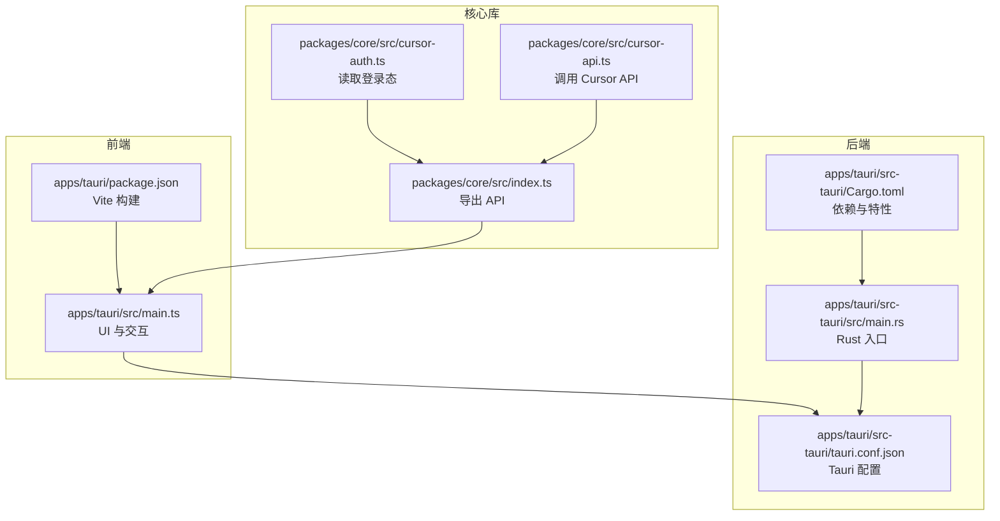
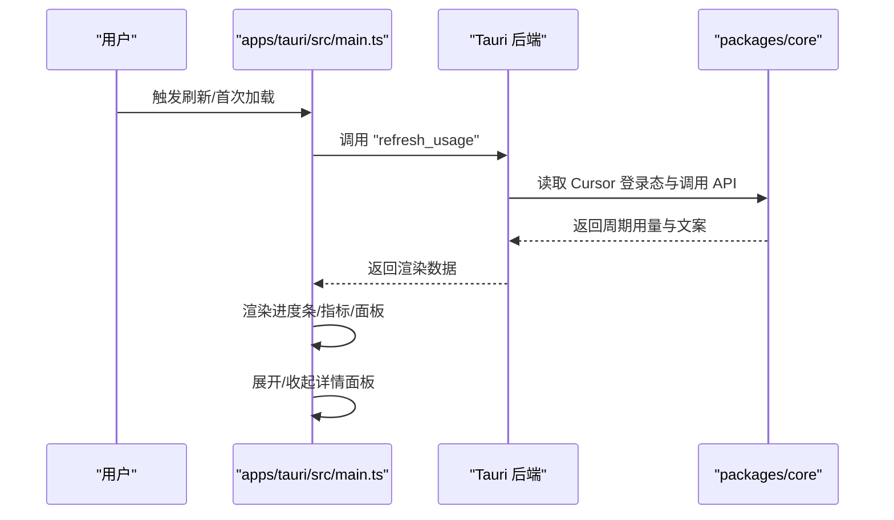
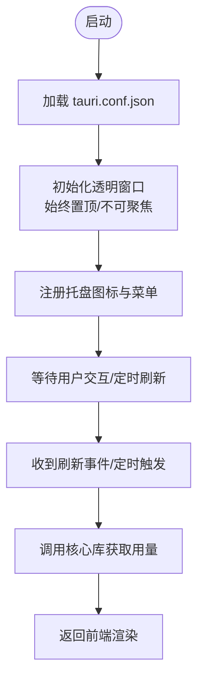
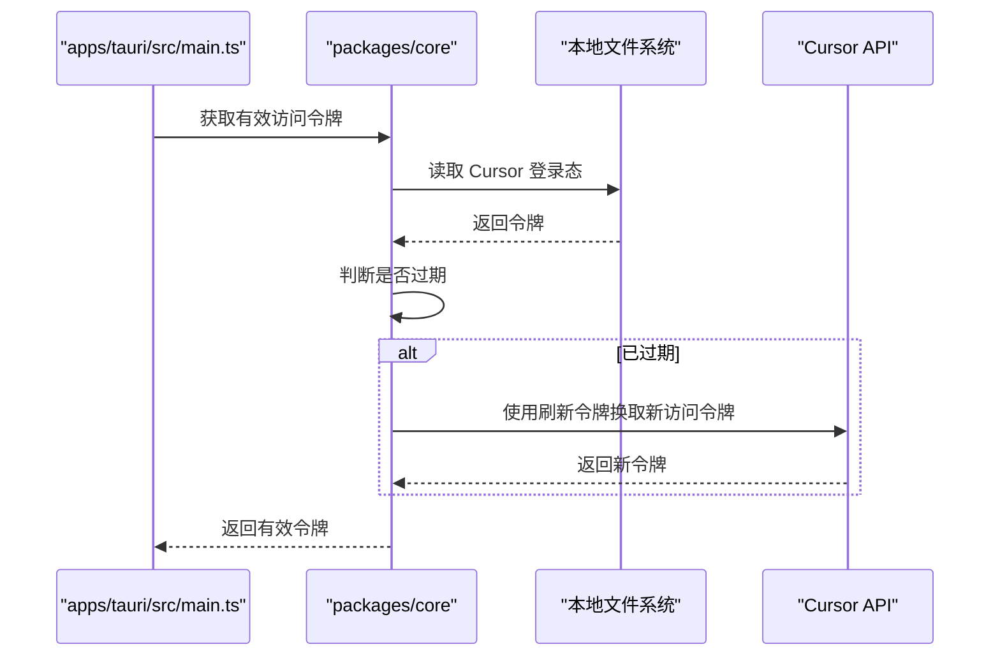
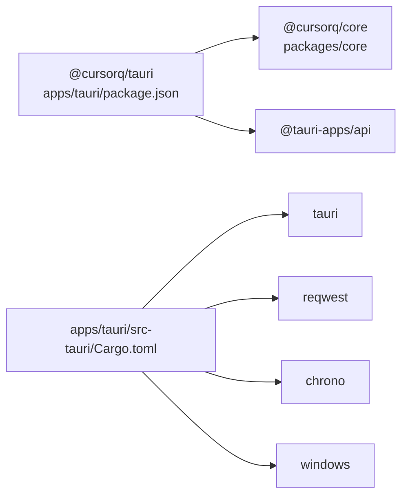

# 快速开始

<cite>
**本文引用的文件**
- [README.md](file://README.md)
- [TAURI_DEV_SETUP.md](file://docs/TAURI_DEV_SETUP.md)
- [package.json](file://apps/tauri/package.json)
- [main.ts](file://apps/tauri/src/main.ts)
- [Cargo.toml](file://apps/tauri/src-tauri/Cargo.toml)
- [tauri.conf.json](file://apps/tauri/src-tauri/tauri.conf.json)
- [dev-tauri.sh](file://scripts/dev-tauri.sh)
- [dev-tauri.cmd](file://scripts/dev-tauri.cmd)
- [tauri-env.cmd](file://scripts/tauri-env.cmd)
- [cursor-auth.ts](file://packages/core/src/cursor-auth.ts)
- [cursor-api.ts](file://packages/core/src/cursor-api.ts)
- [remote.json.example](file://config/remote.json.example)
</cite>

## 目录
1. [简介](#简介)
2. [环境要求](#环境要求)
3. [安装步骤](#安装步骤)
4. [基本使用](#基本使用)
5. [常见配置与个性化](#常见配置与个性化)
6. [架构概览](#架构概览)
7. [详细组件解析](#详细组件解析)
8. [依赖关系分析](#依赖关系分析)
9. [性能与刷新机制](#性能与刷新机制)
10. [故障排除](#故障排除)
11. [结语](#结语)

## 简介
CursorQ 是一个基于 Tauri 2 的桌面胶囊挂件，用于在屏幕顶部显示 Cursor 订阅用量的周期余量、今日预算与状态文案。它不拦截或修改 Cursor 的网络请求，而是通过读取本地 Cursor 登录态与 Dashboard 数据进行提醒与可视化展示。

## 环境要求
- 操作系统：Windows 10 或更高版本
- 必备软件：
  - Node.js 20 或更高版本
  - Rust（必须为 MSVC 工具链）
  - WebView2 运行时
- 运行前提：已安装并登录 Cursor 桌面版（应用将从本地数据库读取 token）

章节来源
- [README.md:14-19](file://README.md#L14-L19)
- [TAURI_DEV_SETUP.md:3-44](file://docs/TAURI_DEV_SETUP.md#L3-L44)

## 安装步骤
以下为从克隆仓库到启动应用的完整流程：

1. 准备环境
   - 安装 Node.js 20+
   - 安装 Visual Studio Build Tools（包含 C++ 桌面开发组件），确保 MSVC + Windows SDK 可用
   - 安装 WebView2 运行时
   - 将 Rust 切换为 MSVC 工具链：在 PowerShell 中执行 `rustup default stable-x86_64-pc-windows-msvc` 并添加目标 `x86_64-pc-windows-msvc`
   - 确认 PATH 包含 cargo（可使用提供的脚本将 cargo 写入用户 PATH）

2. 克隆与安装依赖
   - 在项目根目录执行 `npm install` 安装前端与后端依赖

3. 启动开发环境
   - 使用脚本启动开发：在项目根目录执行 `scripts\dev-tauri.cmd`（Windows）或在 Git Bash 中执行 `./scripts/dev-tauri.sh`
   - 首次构建可能需要 5–15 分钟，请耐心等待

4. 验证运行
   - 应用启动后，若未显示胶囊，可在系统托盘中显示/隐藏胶囊
   - 默认每 30 分钟自动刷新一次用量；也可在托盘中选择“立即刷新”

章节来源
- [TAURI_DEV_SETUP.md:46-52](file://docs/TAURI_DEV_SETUP.md#L46-L52)
- [dev-tauri.cmd:1-17](file://scripts/dev-tauri.cmd#L1-L17)
- [dev-tauri.sh:1-25](file://scripts/dev-tauri.sh#L1-L25)
- [tauri-env.cmd:1-9](file://scripts/tauri-env.cmd#L1-L9)
- [README.md:21-31](file://README.md#L21-L31)

## 基本使用
- 胶囊窗口操作
  - 拖动：长按胶囊约 0.5 秒或移动鼠标后开始拖动，可重新定位胶囊位置
  - 单击吉祥物：展开/收起用量详情面板
  - 双击胶囊：展开/收起详情面板
  - 单击文案行：切换下一条段子/状态文案
  - 双击吉祥物：切换下一张动图
  - 详情面板内点击分类行：展开/收起该分类下的模型列表

- 系统托盘
  - 左键单击：打开菜单
  - 双击：显示胶囊（若已隐藏）
  - 菜单项：显示/隐藏胶囊 · 中文/English · 总是置顶 · 开机启动 · 立即刷新 · 同步文案/动图 · 退出

- 进度条含义
  - 绿 → 蓝：周期剩余 + 节余银行占订阅额度的比例（蓝从右侧随消耗向左收缩）
  - 红（自左向右）：今日用量达到日预算的 200% 及以上

- 调试模式（开发者）
  - 在详情面板底部提示行连点三下，进入调试模式；再次点击提示行可退出

章节来源
- [README.md:32-65](file://README.md#L32-L65)

## 常见配置与个性化
- 段子与状态文案
  - 编辑仓库内的 `content/copy/jokes.json`、`content/copy/states.json`
  - 开发时也可改 `apps/tauri/public/` 下对应资源；发布包以 `content/` 为准

- 吉祥物与动图
  - 启动后先显示 `content/mascot/default.png`，满 1 分钟开始轮播 `content/mascot/gifs/`
  - 每 20 分钟自动切换一张；双击吉祥物可手动切换

- 远程同步（可选）
  - 复制 `config/remote.json.example` 为 `config/remote.json`（开发时在 `apps/tauri/.data/`，便携包在 exe 同级 `config/`）
  - 配置示例：
    ```json
    {
      "enabled": true,
      "contentBaseUrl": "https://raw.githubusercontent.com/<用户>/cursorq/main/content",
      "syncDelayMs": 30000
    }
    ```
  - 合并规则：只追加远程新条目，不覆盖本地已有 jokes / 动图

章节来源
- [README.md:66-97](file://README.md#L66-L97)
- [remote.json.example:1-6](file://config/remote.json.example#L1-L6)

## 架构概览
应用采用前后端分离架构：
- 前端（apps/tauri）：基于 Vite + TypeScript，负责 UI 渲染、交互与事件处理
- 后端（apps/tauri/src-tauri）：基于 Tauri 2 + Rust，负责系统托盘、窗口管理、与 Cursor 登录态与 API 的桥接
- 核心库（packages/core）：封装 Cursor 鉴权、API 请求、预算计算、文案与可视化等通用逻辑



图表来源
- [main.ts:1-711](file://apps/tauri/src/main.ts#L1-L711)
- [tauri.conf.json:1-48](file://apps/tauri/src-tauri/tauri.conf.json#L1-L48)
- [Cargo.toml:1-37](file://apps/tauri/src-tauri/Cargo.toml#L1-L37)
- [index.ts:1-35](file://packages/core/src/index.ts#L1-L35)
- [cursor-auth.ts:1-163](file://packages/core/src/cursor-auth.ts#L1-L163)
- [cursor-api.ts:1-251](file://packages/core/src/cursor-api.ts#L1-L251)

章节来源
- [README.md:98-110](file://README.md#L98-L110)

## 详细组件解析

### 前端核心（apps/tauri/src/main.ts）
- 职责
  - 管理胶囊窗口尺寸与展开/收起逻辑
  - 渲染进度条、用量指标与详情面板
  - 处理用户交互（拖拽、点击、双击）
  - 定时刷新与事件监听（托盘、内容更新、窗口显示）
- 关键流程
  - 初始化窗口与托盘可见性
  - 调用后端刷新用量并渲染
  - 根据用户操作展开/收起详情面板
  - 监听内容更新事件以重载动图



图表来源
- [main.ts:526-560](file://apps/tauri/src/main.ts#L526-L560)
- [cursor-auth.ts:101-118](file://packages/core/src/cursor-auth.ts#L101-L118)
- [cursor-api.ts:173-217](file://packages/core/src/cursor-api.ts#L173-L217)

章节来源
- [main.ts:1-711](file://apps/tauri/src/main.ts#L1-L711)

### 后端与系统集成（apps/tauri/src-tauri）
- Tauri 配置
  - 透明无边框窗口、始终置顶、跳过任务栏
  - 开发前/构建前命令指向 Vite
- Rust 依赖
  - Tauri 2、shell 插件、autostart 插件、reqwest、chrono、windows 等
- 窗口与托盘
  - 通过后端控制胶囊显示/隐藏、开机启动、托盘菜单项



图表来源
- [tauri.conf.json:12-38](file://apps/tauri/src-tauri/tauri.conf.json#L12-L38)
- [Cargo.toml:15-33](file://apps/tauri/src-tauri/Cargo.toml#L15-L33)
- [main.ts:674-696](file://apps/tauri/src/main.ts#L674-L696)

章节来源
- [tauri.conf.json:1-48](file://apps/tauri/src-tauri/tauri.conf.json#L1-L48)
- [Cargo.toml:1-37](file://apps/tauri/src-tauri/Cargo.toml#L1-L37)

### 核心库（packages/core）
- 登录态读取
  - 从 Cursor 本地数据库读取访问令牌与刷新令牌
  - 对 JWT 过期进行判断与刷新
- API 调用
  - 优先使用 Connect 协议接口，失败时回退到网页 REST 接口
  - 合并 Dashboard 数据以完善显示信息



图表来源
- [cursor-auth.ts:101-163](file://packages/core/src/cursor-auth.ts#L101-L163)
- [cursor-api.ts:173-217](file://packages/core/src/cursor-api.ts#L173-L217)

章节来源
- [cursor-auth.ts:1-163](file://packages/core/src/cursor-auth.ts#L1-L163)
- [cursor-api.ts:1-251](file://packages/core/src/cursor-api.ts#L1-L251)

## 依赖关系分析
- 前端依赖
  - @cursorq/core：核心业务逻辑
  - @tauri-apps/api：与后端通信、事件监听
  - Vite：开发与构建
- 后端依赖
  - tauri：窗口、托盘、协议
  - reqwest：HTTP 请求
  - chrono：时间处理
  - windows：DWM 窗口形状处理（Windows）



图表来源
- [package.json:12-21](file://apps/tauri/package.json#L12-L21)
- [Cargo.toml:15-33](file://apps/tauri/src-tauri/Cargo.toml#L15-L33)

章节来源
- [package.json:1-22](file://apps/tauri/package.json#L1-L22)
- [Cargo.toml:1-37](file://apps/tauri/src-tauri/Cargo.toml#L1-L37)

## 性能与刷新机制
- 自动刷新
  - 默认每 30 分钟自动刷新一次用量
  - 也可在托盘菜单中选择“立即刷新”
- 渲染优化
  - 展开/收起详情面板时一次性设定窗口高度，避免 WebView 白边
  - 窗口透明与圆角通过 DWM 处理，减少重绘抖动
- 调试模式
  - 提供滑条模拟不同用量状态，便于开发者调试

章节来源
- [README.md:51-65](file://README.md#L51-L65)
- [main.ts:43-44](file://apps/tauri/src/main.ts#L43-L44)
- [main.ts:492-522](file://apps/tauri/src/main.ts#L492-L522)

## 故障排除
- 环境问题
  - Rust 工具链非 MSVC：请执行 `rustup default stable-x86_64-pc-windows-msvc` 并添加目标
  - 缺少 MSVC 链接器：安装 Visual Studio Build Tools（包含 C++ 桌面开发组件）
  - WebView2 未安装：下载并安装 WebView2 运行时
- 启动失败
  - 首次构建耗时较长：等待 5–15 分钟完成 Rust 编译
  - 确认 PATH 包含 cargo，并在新终端中验证
- 登录态相关
  - 未登录 Cursor：应用会提示“请先登录 Cursor”，请先在桌面版登录
  - 本地数据库读取失败：检查 APPDATA 路径与 Cursor 安装状态

章节来源
- [TAURI_DEV_SETUP.md:96-126](file://docs/TAURI_DEV_SETUP.md#L96-L126)
- [cursor-auth.ts:29-41](file://packages/core/src/cursor-auth.ts#L29-L41)
- [main.ts:526-539](file://apps/tauri/src/main.ts#L526-L539)

## 结语
通过以上步骤，您可以在 Windows 上快速搭建并运行 CursorQ。若遇到问题，可参考“故障排除”部分或查看开发文档中的自检清单。建议在首次使用时启用远程同步，以便获得最新的文案与动图资源。