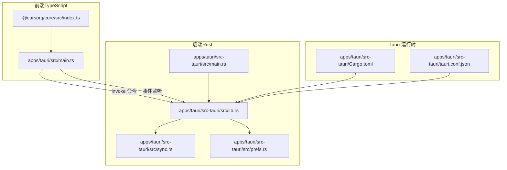
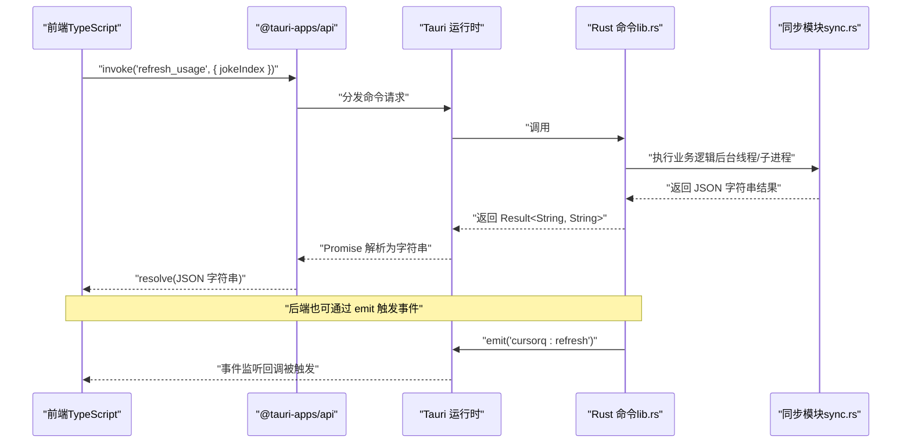
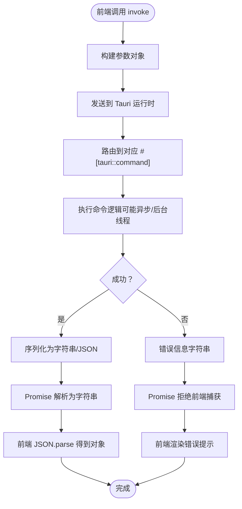
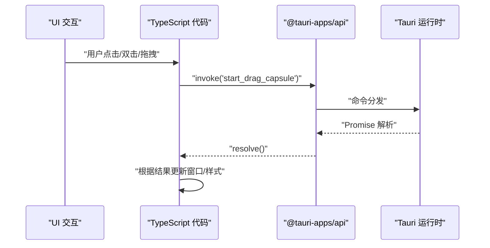
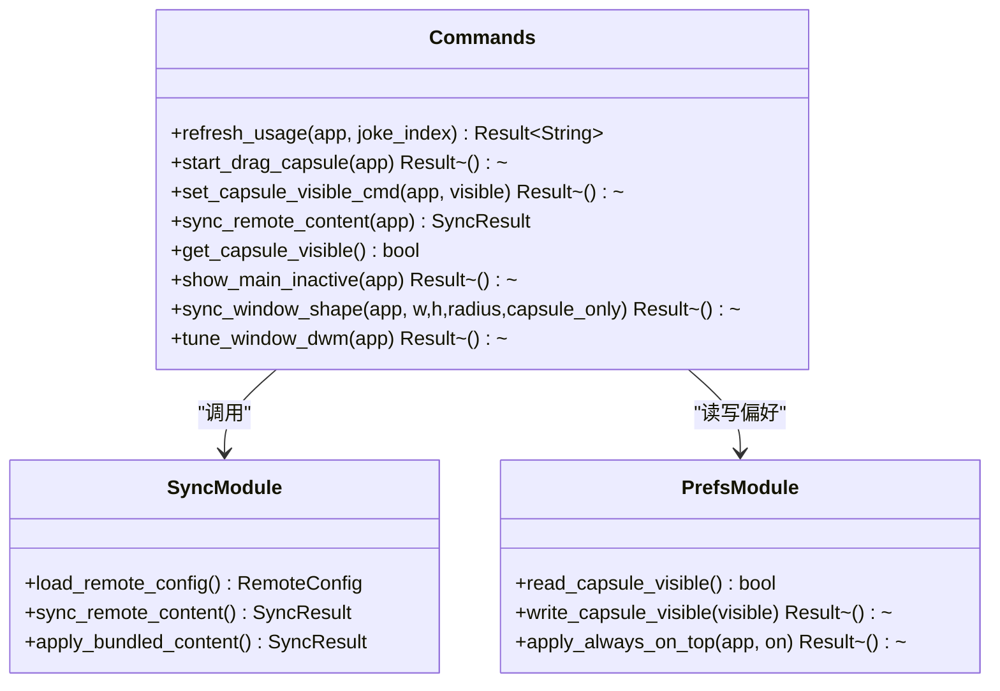
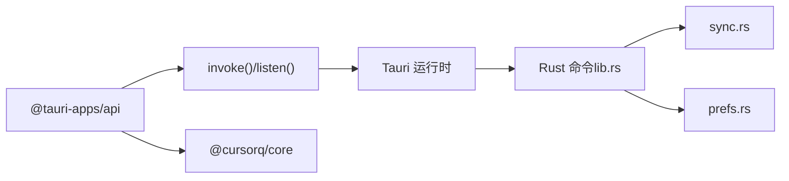

# 前后端协作机制

<cite>
**本文引用的文件**
- [apps/tauri/src/main.ts](file://apps/tauri/src/main.ts)
- [apps/tauri/src-tauri/src/lib.rs](file://apps/tauri/src-tauri/src/lib.rs)
- [apps/tauri/src-tauri/src/main.rs](file://apps/tauri/src-tauri/src/main.rs)
- [apps/tauri/src-tauri/Cargo.toml](file://apps/tauri/src-tauri/Cargo.toml)
- [apps/tauri/package.json](file://apps/tauri/package.json)
- [apps/tauri/src-tauri/tauri.conf.json](file://apps/tauri/src-tauri/tauri.conf.json)
- [apps/tauri/src-tauri/src/sync.rs](file://apps/tauri/src-tauri/src/sync.rs)
- [apps/tauri/src-tauri/src/prefs.rs](file://apps/tauri/src-tauri/src/prefs.rs)
- [packages/core/src/index.ts](file://packages/core/src/index.ts)
</cite>

## 目录
1. [简介](#简介)
2. [项目结构](#项目结构)
3. [核心组件](#核心组件)
4. [架构总览](#架构总览)
5. [详细组件分析](#详细组件分析)
6. [依赖关系分析](#依赖关系分析)
7. [性能考虑](#性能考虑)
8. [故障排查指南](#故障排查指南)
9. [结论](#结论)

## 简介
本文件面向 CursorQ 的 Tauri 2 桌面应用，系统性阐述 Rust 后端与 TypeScript 前端之间的互操作机制，重点解析 Tauri 命令系统在 CursorQ 中的具体实现与使用方式。内容涵盖命令接口的定义、注册与调用流程，参数与返回值的序列化与反序列化策略，错误传播机制，以及前端通过 invoke 调用后端命令的最佳实践。

## 项目结构
CursorQ 的前端位于 apps/tauri，采用 Vite + TypeScript；后端位于 apps/tauri/src-tauri，采用 Rust + Tauri 2。前端通过 @tauri-apps/api 提供的 invoke 与事件监听能力与后端通信；后端通过 #[tauri::command] 定义命令并通过 generate_handler 注册到 Tauri 运行时。

**图表来源**
- [apps/tauri/src/main.ts:1-711](file://apps/tauri/src/main.ts#L1-L711)
- [apps/tauri/src-tauri/src/lib.rs:1-857](file://apps/tauri/src-tauri/src/lib.rs#L1-L857)
- [apps/tauri/src-tauri/src/main.rs:1-6](file://apps/tauri/src-tauri/src/main.rs#L1-L6)
- [apps/tauri/src-tauri/Cargo.toml:1-37](file://apps/tauri/src-tauri/Cargo.toml#L1-L37)
- [apps/tauri/src-tauri/tauri.conf.json:1-48](file://apps/tauri/src-tauri/tauri.conf.json#L1-L48)
- [apps/tauri/src-tauri/src/sync.rs:1-372](file://apps/tauri/src-tauri/src/sync.rs#L1-L372)
- [apps/tauri/src-tauri/src/prefs.rs:1-145](file://apps/tauri/src-tauri/src/prefs.rs#L1-L145)
- [packages/core/src/index.ts:1-35](file://packages/core/src/index.ts#L1-L35)

**章节来源**
- [apps/tauri/src/main.ts:1-711](file://apps/tauri/src/main.ts#L1-L711)
- [apps/tauri/src-tauri/src/lib.rs:1-857](file://apps/tauri/src-tauri/src/lib.rs#L1-L857)
- [apps/tauri/src-tauri/src/main.rs:1-6](file://apps/tauri/src-tauri/src/main.rs#L1-L6)
- [apps/tauri/src-tauri/Cargo.toml:1-37](file://apps/tauri/src-tauri/Cargo.toml#L1-L37)
- [apps/tauri/src-tauri/tauri.conf.json:1-48](file://apps/tauri/src-tauri/tauri.conf.json#L1-L48)
- [apps/tauri/src-tauri/src/sync.rs:1-372](file://apps/tauri/src-tauri/src/sync.rs#L1-L372)
- [apps/tauri/src-tauri/src/prefs.rs:1-145](file://apps/tauri/src-tauri/src/prefs.rs#L1-L145)
- [packages/core/src/index.ts:1-35](file://packages/core/src/index.ts#L1-L35)

## 核心组件
- 前端入口与命令调用
  - 前端通过 @tauri-apps/api 的 invoke 发送命令，如 refresh_usage、start_drag_capsule、show_main_inactive、set_capsule_visible_cmd 等，并通过 listen 订阅后端事件（如 cursorq:refresh、cursorq:content-updated）。
  - 典型调用位置参考：[apps/tauri/src/main.ts:526-560](file://apps/tauri/src/main.ts#L526-L560)、[apps/tauri/src/main.ts:584-589](file://apps/tauri/src/main.ts#L584-L589)、[apps/tauri/src/main.ts:674-696](file://apps/tauri/src/main.ts#L674-L696)。
- 后端命令注册与实现
  - 后端使用 #[tauri::command] 宏声明命令函数，通过 generate_handler 将命令注册到 Tauri 运行时，统一在 run() 中完成 Builder 配置。
  - 注册列表参考：[apps/tauri/src-tauri/src/lib.rs:716-736](file://apps/tauri/src-tauri/src/lib.rs#L716-L736)。
- 数据与配置
  - 前端依赖 @cursorq/core 提供的类型与工具，后端通过 sync.rs 实现远程内容同步，prefs.rs 管理应用偏好与窗口状态。

**章节来源**
- [apps/tauri/src/main.ts:1-711](file://apps/tauri/src/main.ts#L1-L711)
- [apps/tauri/src-tauri/src/lib.rs:1-857](file://apps/tauri/src-tauri/src/lib.rs#L1-L857)
- [packages/core/src/index.ts:1-35](file://packages/core/src/index.ts#L1-L35)

## 架构总览
下图展示了从前端发起命令到后端执行再到事件回传的完整链路，体现 Tauri 2 的命令调用与事件机制。

**图表来源**
- [apps/tauri/src/main.ts:526-560](file://apps/tauri/src/main.ts#L526-L560)
- [apps/tauri/src-tauri/src/lib.rs:617-639](file://apps/tauri/src-tauri/src/lib.rs#L617-L639)
- [apps/tauri/src-tauri/src/sync.rs:261-367](file://apps/tauri/src-tauri/src/sync.rs#L261-L367)

**章节来源**
- [apps/tauri/src/main.ts:1-711](file://apps/tauri/src/main.ts#L1-L711)
- [apps/tauri/src-tauri/src/lib.rs:1-857](file://apps/tauri/src-tauri/src/lib.rs#L1-L857)
- [apps/tauri/src-tauri/src/sync.rs:1-372](file://apps/tauri/src-tauri/src/sync.rs#L1-L372)

## 详细组件分析

### 命令系统工作原理与调用流程
- 命令定义与注册
  - 后端使用 #[tauri::command] 宏标注函数，使其可由前端通过 invoke 调用。例如 refresh_usage、start_drag_capsule、set_capsule_visible_cmd 等。
  - 注册通过 generate_handler 收集并在 run() 中注入到 Builder。
  - 参考：[apps/tauri/src-tauri/src/lib.rs:31-639](file://apps/tauri/src-tauri/src/lib.rs#L31-L639)、[apps/tauri/src-tauri/src/lib.rs:716-736](file://apps/tauri/src-tauri/src/lib.rs#L716-L736)。
- 参数传递与返回值
  - 前端以对象形式传递参数（如 { jokeIndex }），后端命令接收对应参数类型（Option<u32> 等）。返回值通常为 Result<T, String>，其中 T 一般为简单类型或 JSON 字符串。
  - 前端收到字符串后自行 JSON.parse，得到强类型的 Payload 结构体。
  - 参考前端调用与解析：[apps/tauri/src/main.ts:526-560](file://apps/tauri/src/main.ts#L526-L560)。
- 错误传播
  - 后端命令返回 Result，错误路径会转换为字符串并返回给前端；前端捕获异常并渲染错误提示。
  - 参考：[apps/tauri/src-tauri/src/lib.rs:617-639](file://apps/tauri/src-tauri/src/lib.rs#L617-L639)、[apps/tauri/src/main.ts:549-558](file://apps/tauri/src/main.ts#L549-L558)。

**图表来源**
- [apps/tauri/src/main.ts:526-560](file://apps/tauri/src/main.ts#L526-L560)
- [apps/tauri/src-tauri/src/lib.rs:617-639](file://apps/tauri/src-tauri/src/lib.rs#L617-L639)

**章节来源**
- [apps/tauri/src-tauri/src/lib.rs:1-857](file://apps/tauri/src-tauri/src/lib.rs#L1-L857)
- [apps/tauri/src/main.ts:1-711](file://apps/tauri/src/main.ts#L1-L711)

### TypeScript 侧命令调用模式
- 基本调用
  - 使用 invoke('command', payload) 发送命令，await 获取字符串结果，再 JSON.parse 成对象。
  - 示例位置：[apps/tauri/src/main.ts:526-560](file://apps/tauri/src/main.ts#L526-L560)。
- 异常处理
  - try/catch 包裹 invoke，错误时渲染“刷新失败”等提示。
  - 示例位置：[apps/tauri/src/main.ts:549-558](file://apps/tauri/src/main.ts#L549-L558)。
- 事件监听
  - 使用 listen('cursorq:*', handler) 订阅后端事件，实现 UI 自动更新。
  - 示例位置：[apps/tauri/src/main.ts:700-710](file://apps/tauri/src/main.ts#L700-L710)。

**图表来源**
- [apps/tauri/src/main.ts:584-589](file://apps/tauri/src/main.ts#L584-L589)

**章节来源**
- [apps/tauri/src/main.ts:1-711](file://apps/tauri/src/main.ts#L1-L711)

### Rust 侧命令定义与实现
- 命令宏与注册
  - #[tauri::command] 标注函数，生成 handler 注入运行时。
  - 注册清单：[apps/tauri/src-tauri/src/lib.rs:716-736](file://apps/tauri/src-tauri/src/lib.rs#L716-L736)。
- 异步与后台线程
  - refresh_usage 使用 async runtime + spawn_blocking 执行耗时任务，避免阻塞 UI。
  - 参考：[apps/tauri/src-tauri/src/lib.rs:617-639](file://apps/tauri/src-tauri/src/lib.rs#L617-L639)。
- 事件发射
  - 后端通过 app.get_webview_window("main").emit(...) 向前端推送事件，前端通过 listen 订阅。
  - 参考：[apps/tauri/src-tauri/src/lib.rs:128-138](file://apps/tauri/src-tauri/src/lib.rs#L128-L138)、[apps/tauri/src-tauri/src/lib.rs:275-280](file://apps/tauri/src-tauri/src/lib.rs#L275-L280)。

**图表来源**
- [apps/tauri/src-tauri/src/lib.rs:1-857](file://apps/tauri/src-tauri/src/lib.rs#L1-L857)
- [apps/tauri/src-tauri/src/sync.rs:1-372](file://apps/tauri/src-tauri/src/sync.rs#L1-L372)
- [apps/tauri/src-tauri/src/prefs.rs:1-145](file://apps/tauri/src-tauri/src/prefs.rs#L1-L145)

**章节来源**
- [apps/tauri/src-tauri/src/lib.rs:1-857](file://apps/tauri/src-tauri/src/lib.rs#L1-L857)
- [apps/tauri/src-tauri/src/sync.rs:1-372](file://apps/tauri/src-tauri/src/sync.rs#L1-L372)
- [apps/tauri/src-tauri/src/prefs.rs:1-145](file://apps/tauri/src-tauri/src/prefs.rs#L1-L145)

### 数据序列化与类型安全
- JSON 序列化
  - 后端命令返回字符串（通常是 JSON），前端收到后进行 JSON.parse，得到 Payload 类型对象。
  - 参考：[apps/tauri/src/main.ts:531-534](file://apps/tauri/src/main.ts#L531-L534)。
- 类型安全
  - 前端定义 Payload 接口描述数据结构，确保渲染与计算时的类型一致性。
  - 参考：[apps/tauri/src/main.ts:54-103](file://apps/tauri/src/main.ts#L54-L103)。
- 配置与模型
  - 后端通过 serde/serde_json 处理 RemoteConfig、SyncResult 等结构，保证跨语言的数据一致性。
  - 参考：[apps/tauri/src-tauri/src/sync.rs:12-56](file://apps/tauri/src-tauri/src/sync.rs#L12-L56)、[apps/tauri/src-tauri/src/sync.rs:50-56](file://apps/tauri/src-tauri/src/sync.rs#L50-L56)。

**章节来源**
- [apps/tauri/src/main.ts:1-711](file://apps/tauri/src/main.ts#L1-L711)
- [apps/tauri/src-tauri/src/sync.rs:1-372](file://apps/tauri/src-tauri/src/sync.rs#L1-L372)

### 最佳实践与常见模式
- 命令参数设计
  - 将复杂参数封装为对象，便于扩展与类型校验；后端命令接收 Option/具体类型，避免空值问题。
  - 参考：[apps/tauri/src-tauri/src/lib.rs:617-621](file://apps/tauri/src-tauri/src/lib.rs#L617-L621)。
- 异步与后台任务
  - 对外部进程或网络请求使用异步执行，避免阻塞主线程；完成后通过事件通知前端刷新。
  - 参考：[apps/tauri/src-tauri/src/lib.rs:617-639](file://apps/tauri/src-tauri/src/lib.rs#L617-L639)、[apps/tauri/src-tauri/src/lib.rs:128-138](file://apps/tauri/src-tauri/src/lib.rs#L128-L138)。
- 错误处理
  - 统一将错误转换为字符串返回，前端捕获并友好提示；日志记录有助于定位问题。
  - 参考：[apps/tauri/src-tauri/src/lib.rs:630-638](file://apps/tauri/src-tauri/src/lib.rs#L630-L638)、[apps/tauri/src/main.ts:549-558](file://apps/tauri/src/main.ts#L549-L558)。
- 事件驱动更新
  - 后端在关键状态变更时 emit 事件，前端通过 listen 自动刷新界面，减少轮询。
  - 参考：[apps/tauri/src/main.ts:700-710](file://apps/tauri/src/main.ts#L700-L710)。

**章节来源**
- [apps/tauri/src-tauri/src/lib.rs:1-857](file://apps/tauri/src-tauri/src/lib.rs#L1-L857)
- [apps/tauri/src/main.ts:1-711](file://apps/tauri/src/main.ts#L1-L711)

## 依赖关系分析
- 前端依赖
  - @tauri-apps/api 提供 invoke 与事件监听；@cursorq/core 提供共享类型与工具。
  - 参考：[apps/tauri/package.json:12-21](file://apps/tauri/package.json#L12-L21)、[packages/core/src/index.ts:1-35](file://packages/core/src/index.ts#L1-L35)。
- 后端依赖
  - tauri、serde_json、reqwest、which、base64 等 crates 提供命令系统、序列化、HTTP 请求、可执行查找与编码支持。
  - 参考：[apps/tauri/src-tauri/Cargo.toml:15-24](file://apps/tauri/src-tauri/Cargo.toml#L15-L24)。
- 配置与打包
  - tauri.conf.json 定义窗口属性、开发/构建命令与安全策略；Cargo.toml 定义库与插件。
  - 参考：[apps/tauri/src-tauri/tauri.conf.json:1-48](file://apps/tauri/src-tauri/tauri.conf.json#L1-L48)、[apps/tauri/src-tauri/Cargo.toml:1-37](file://apps/tauri/src-tauri/Cargo.toml#L1-L37)。

**图表来源**
- [apps/tauri/src/main.ts:1-711](file://apps/tauri/src/main.ts#L1-L711)
- [apps/tauri/src-tauri/src/lib.rs:1-857](file://apps/tauri/src-tauri/src/lib.rs#L1-L857)
- [apps/tauri/src-tauri/src/sync.rs:1-372](file://apps/tauri/src-tauri/src/sync.rs#L1-L372)
- [apps/tauri/src-tauri/src/prefs.rs:1-145](file://apps/tauri/src-tauri/src/prefs.rs#L1-L145)
- [apps/tauri/package.json:12-21](file://apps/tauri/package.json#L12-L21)
- [packages/core/src/index.ts:1-35](file://packages/core/src/index.ts#L1-L35)

**章节来源**
- [apps/tauri/src/main.ts:1-711](file://apps/tauri/src/main.ts#L1-L711)
- [apps/tauri/src-tauri/src/lib.rs:1-857](file://apps/tauri/src-tauri/src/lib.rs#L1-L857)
- [apps/tauri/src-tauri/src/sync.rs:1-372](file://apps/tauri/src-tauri/src/sync.rs#L1-L372)
- [apps/tauri/src-tauri/src/prefs.rs:1-145](file://apps/tauri/src-tauri/src/prefs.rs#L1-L145)
- [apps/tauri/package.json:12-21](file://apps/tauri/package.json#L12-L21)
- [packages/core/src/index.ts:1-35](file://packages/core/src/index.ts#L1-L35)

## 性能考虑
- 异步与后台线程
  - 对外部脚本执行与网络请求使用异步与后台线程，避免阻塞 UI，提升响应性。
  - 参考：[apps/tauri/src-tauri/src/lib.rs:617-639](file://apps/tauri/src-tauri/src/lib.rs#L617-L639)。
- 事件驱动刷新
  - 通过 emit + listen 替代轮询，降低 CPU 占用与网络压力。
  - 参考：[apps/tauri/src-tauri/src/lib.rs:128-138](file://apps/tauri/src-tauri/src/lib.rs#L128-L138)、[apps/tauri/src/main.ts:700-710](file://apps/tauri/src/main.ts#L700-L710)。
- JSON 解析与缓存
  - 前端对返回的 JSON 字符串进行一次性解析，避免重复解析；后端使用 serde_json 高效序列化。
  - 参考：[apps/tauri/src/main.ts:531-534](file://apps/tauri/src/main.ts#L531-L534)、[apps/tauri/src-tauri/src/sync.rs:58-70](file://apps/tauri/src-tauri/src/sync.rs#L58-L70)。

## 故障排查指南
- 常见错误与处理
  - “未登录”场景：后端返回包含 error 字段的 JSON，前端检测并提示“请先登录 Cursor”。
    - 参考：[apps/tauri/src/main.ts:535-538](file://apps/tauri/src/main.ts#L535-L538)。
  - 刷新失败：前端捕获异常并渲染简短错误提示，便于快速定位问题。
    - 参考：[apps/tauri/src/main.ts:549-558](file://apps/tauri/src/main.ts#L549-L558)。
- 日志与诊断
  - 后端使用日志工具记录命令执行状态与错误详情，辅助定位问题。
  - 参考：[apps/tauri/src-tauri/src/lib.rs:532-542](file://apps/tauri/src-tauri/src/lib.rs#L532-L542)。

**章节来源**
- [apps/tauri/src/main.ts:1-711](file://apps/tauri/src/main.ts#L1-L711)
- [apps/tauri/src-tauri/src/lib.rs:1-857](file://apps/tauri/src-tauri/src/lib.rs#L1-L857)

## 结论
CursorQ 的前后端协作基于 Tauri 2 的命令系统与事件机制，实现了高效、稳定的桌面应用体验。前端通过 invoke 与 listen 与后端通信，后端以 #[tauri::command] 声明命令并通过 generate_handler 注册，结合异步与事件驱动，既保证了性能也提升了可维护性。数据通过 JSON 字符串在边界间传递，配合前端类型定义与错误处理，形成完整的类型安全闭环。