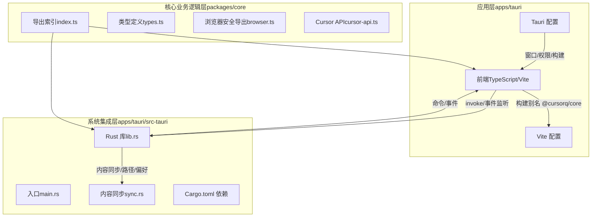
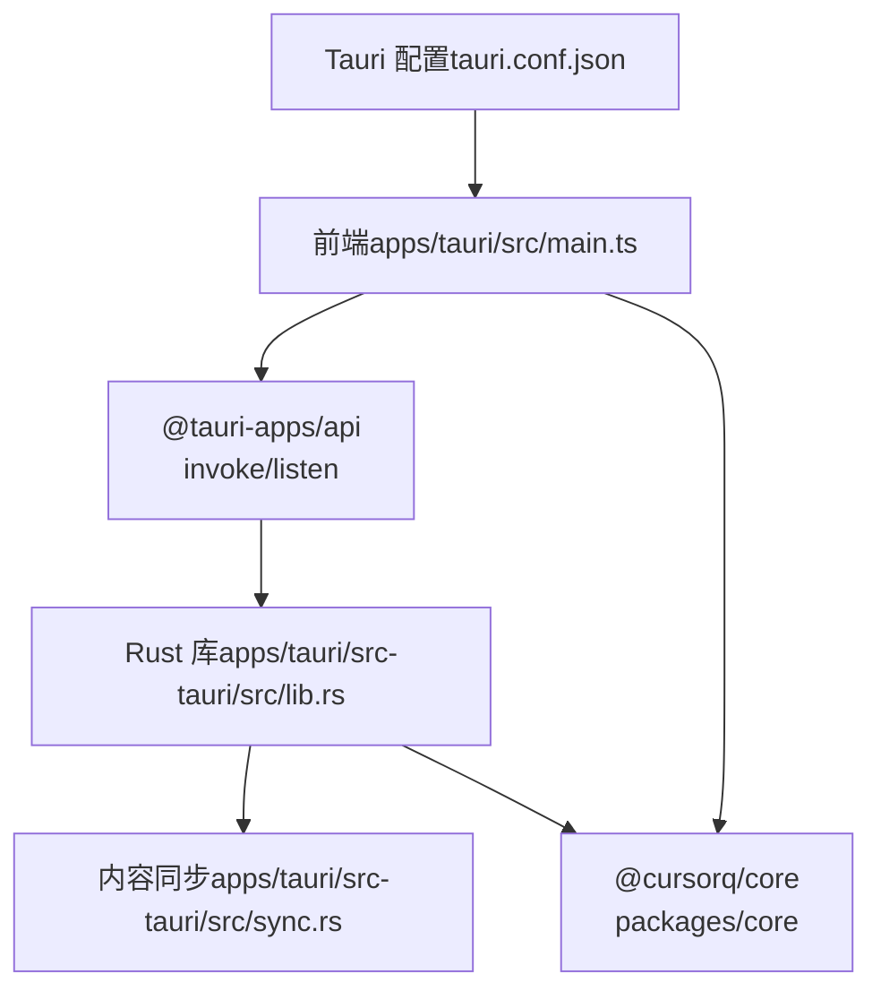
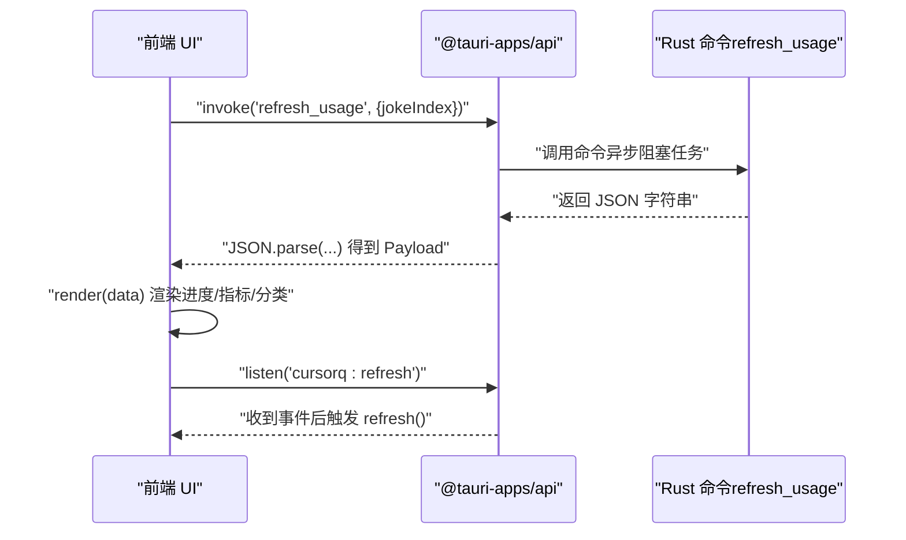
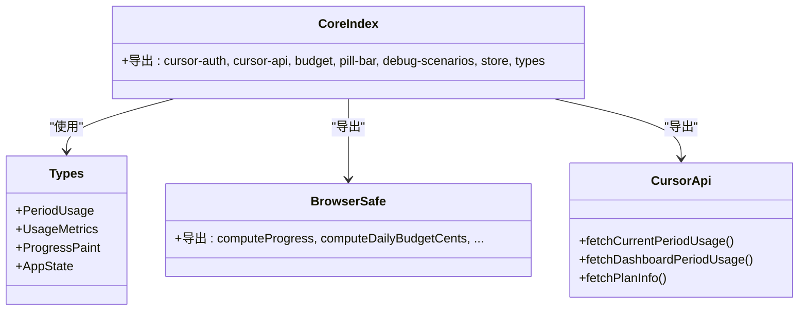
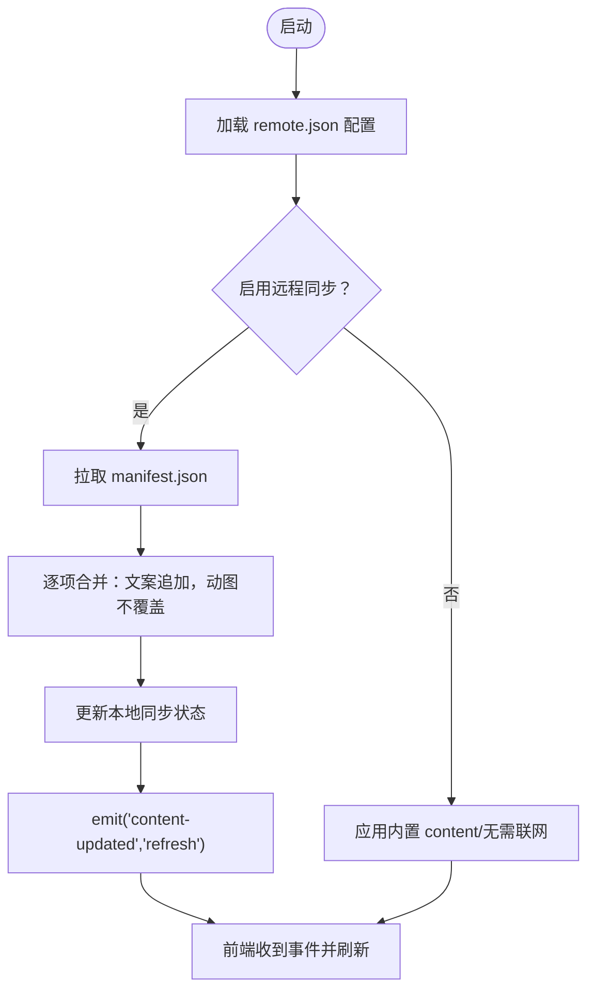
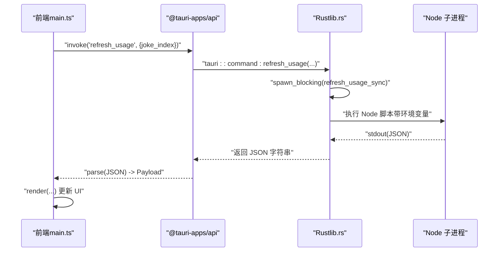
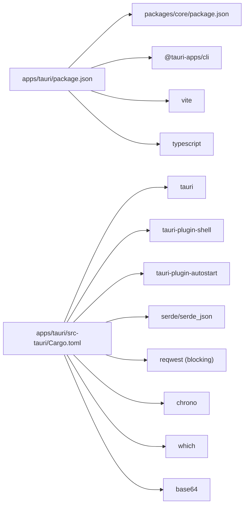

# 技术架构

<cite>
**本文引用的文件**
- [apps/tauri/src/main.ts](file://apps/tauri/src/main.ts)
- [apps/tauri/src/i18n.ts](file://apps/tauri/src/i18n.ts)
- [apps/tauri/vite.config.ts](file://apps/tauri/vite.config.ts)
- [apps/tauri/tsconfig.json](file://apps/tauri/tsconfig.json)
- [apps/tauri/package.json](file://apps/tauri/package.json)
- [apps/tauri/src-tauri/src/main.rs](file://apps/tauri/src-tauri/src/main.rs)
- [apps/tauri/src-tauri/src/lib.rs](file://apps/tauri/src-tauri/src/lib.rs)
- [apps/tauri/src-tauri/Cargo.toml](file://apps/tauri/src-tauri/Cargo.toml)
- [apps/tauri/src-tauri/tauri.conf.json](file://apps/tauri/src-tauri/tauri.conf.json)
- [apps/tauri/src-tauri/src/sync.rs](file://apps/tauri/src-tauri/src/sync.rs)
- [packages/core/src/index.ts](file://packages/core/src/index.ts)
- [packages/core/src/types.ts](file://packages/core/src/types.ts)
- [packages/core/src/browser.ts](file://packages/core/src/browser.ts)
- [packages/core/src/cursor-api.ts](file://packages/core/src/cursor-api.ts)
- [packages/core/package.json](file://packages/core/package.json)
- [README.md](file://README.md)
</cite>

## 目录
1. [引言](#引言)
2. [项目结构](#项目结构)
3. [核心组件](#核心组件)
4. [架构总览](#架构总览)
5. [详细组件分析](#详细组件分析)
6. [依赖分析](#依赖分析)
7. [性能考虑](#性能考虑)
8. [故障排查指南](#故障排查指南)
9. [结论](#结论)
10. [附录](#附录)

## 引言
本项目采用 Tauri 2 构建桌面“胶囊”应用，结合 Rust 后端与 TypeScript 前端，形成清晰的分层架构：前端应用层负责 UI 渲染与用户交互；核心业务逻辑层封装 Cursor 鉴权与用量计算；系统集成层处理托盘、窗口、事件与远程内容同步。Tauri 命令接口实现 JS 与 Rust 的互操作，使前端通过 invoke 调用后端命令，后端通过事件向前端推送状态更新。模块化设计上，packages/core 提供跨平台浏览器安全导出与核心类型，apps/tauri 作为独立应用承载 UI 与系统能力。

## 项目结构
- apps/tauri：Tauri 2 应用，包含前端源码、Vite 配置、TypeScript 类型与 Tauri 配置；Rust 后端位于 src-tauri。
- packages/core：核心业务逻辑与类型定义，提供浏览器安全导出与 Cursor API 封装。
- content/config/assets：内置文案、吉祥物与图标资源。
- scripts/docs/release：开发脚本、打包与文档。

**图表来源**
- [apps/tauri/src/main.ts:1-711](file://apps/tauri/src/main.ts#L1-L711)
- [apps/tauri/src-tauri/src/lib.rs:1-800](file://apps/tauri/src-tauri/src/lib.rs#L1-L800)
- [apps/tauri/src-tauri/src/sync.rs:1-372](file://apps/tauri/src-tauri/src/sync.rs#L1-L372)
- [packages/core/src/index.ts:1-35](file://packages/core/src/index.ts#L1-L35)

**章节来源**
- [README.md:98-129](file://README.md#L98-L129)
- [apps/tauri/package.json:1-22](file://apps/tauri/package.json#L1-L22)
- [packages/core/package.json:1-32](file://packages/core/package.json#L1-L32)

## 核心组件
- 前端应用层（apps/tauri）
  - 主入口与渲染逻辑：负责 UI 组件渲染、交互绑定、定时刷新、国际化与窗口控制。
  - Vite 配置：设置别名为 @cursorq/core，指向 packages/core/src/browser.ts，确保浏览器安全导出。
  - TypeScript 配置：严格类型检查，Bundler 解析策略适配 Tauri。
- 核心业务逻辑层（packages/core）
  - 导出索引：统一导出鉴权、API、预算、进度条、调试场景、存储与类型。
  - 类型定义：明确用量明细、指标、进度绘制、状态等数据结构。
  - 浏览器安全导出：仅暴露可在浏览器运行的函数，避免 Node/sql.js 依赖。
  - Cursor API：封装 Connect 协议与 Dashboard 兜底接口，兼容错误回退。
- 系统集成层（apps/tauri/src-tauri）
  - Rust 命令与事件：提供 refresh_usage、窗口形状、托盘菜单、内容同步等命令。
  - 内容同步：拉取远程 manifest 并合并文案/动图为本地 content 目录，不覆盖本地已有文件。
  - 路径与偏好：管理应用根目录、数据目录、日志、内容目录与便携布局判断。
  - Windows DWM：优化无边框窗口与阴影，避免白边，提升视觉一致性。

**章节来源**
- [apps/tauri/src/main.ts:1-711](file://apps/tauri/src/main.ts#L1-L711)
- [apps/tauri/vite.config.ts:1-21](file://apps/tauri/vite.config.ts#L1-L21)
- [apps/tauri/tsconfig.json:1-12](file://apps/tauri/tsconfig.json#L1-L12)
- [packages/core/src/index.ts:1-35](file://packages/core/src/index.ts#L1-L35)
- [packages/core/src/types.ts:1-140](file://packages/core/src/types.ts#L1-L140)
- [packages/core/src/browser.ts:1-21](file://packages/core/src/browser.ts#L1-L21)
- [packages/core/src/cursor-api.ts:1-251](file://packages/core/src/cursor-api.ts#L1-L251)
- [apps/tauri/src-tauri/src/lib.rs:1-800](file://apps/tauri/src-tauri/src/lib.rs#L1-L800)
- [apps/tauri/src-tauri/src/sync.rs:1-372](file://apps/tauri/src-tauri/src/sync.rs#L1-L372)

## 架构总览
前端通过 @tauri-apps/api 的 invoke 与监听事件与 Rust 后端通信；Rust 后端通过命令注册与事件发射实现系统级能力（窗口、托盘、内容同步）。核心业务逻辑在 packages/core 中复用，既可被前端直接使用，也可在 Rust 后端调用 Node 子进程执行业务脚本。

**图表来源**
- [apps/tauri/src/main.ts:1-711](file://apps/tauri/src/main.ts#L1-L711)
- [apps/tauri/src-tauri/src/lib.rs:715-800](file://apps/tauri/src-tauri/src/lib.rs#L715-L800)
- [apps/tauri/src-tauri/src/sync.rs:260-372](file://apps/tauri/src-tauri/src/sync.rs#L260-L372)
- [apps/tauri/src-tauri/tauri.conf.json:1-48](file://apps/tauri/src-tauri/tauri.conf.json#L1-L48)

## 详细组件分析

### 前端应用层（apps/tauri）
- 交互与渲染
  - 通过 invoke("refresh_usage") 触发刷新，解析返回的 JSON Payload 并渲染进度条、指标与用量分类。
  - 通过 listen 订阅 cursorq:refresh、cursorq:content-updated、cursorq:fix-chrome 等事件，驱动 UI 更新与窗口修复。
  - 国际化字符串与日期格式化由 i18n.ts 提供。
- 窗口与拖拽
  - 通过 invoke("start_drag_capsule") 或原生窗口拖拽实现胶囊拖动；通过 invoke("show_main_inactive") 控制显示。
- 状态与定时
  - 定时器每 30 分钟刷新一次；支持手动点击与双击交互展开/收起详情面板。

**图表来源**
- [apps/tauri/src/main.ts:526-560](file://apps/tauri/src/main.ts#L526-L560)
- [apps/tauri/src-tauri/src/lib.rs:617-639](file://apps/tauri/src-tauri/src/lib.rs#L617-L639)

**章节来源**
- [apps/tauri/src/main.ts:1-711](file://apps/tauri/src/main.ts#L1-L711)
- [apps/tauri/src/i18n.ts:1-89](file://apps/tauri/src/i18n.ts#L1-L89)

### 核心业务逻辑层（packages/core）
- 导出与类型
  - index.ts 统一导出鉴权、API、预算、进度条、调试场景、存储与类型，便于前端与后端共享。
  - types.ts 定义用量明细、指标、进度绘制、状态等核心数据结构。
- 浏览器安全导出
  - browser.ts 仅导出可在浏览器运行的函数，避免 Node/sql.js 依赖，保证在 Vite 构建与 Tauri 环境中可用。
- Cursor API
  - cursor-api.ts 封装 Connect 协议与 Dashboard 兜底接口，优先使用 Connect，失败时回退 REST，确保稳定性。

**图表来源**
- [packages/core/src/index.ts:1-35](file://packages/core/src/index.ts#L1-L35)
- [packages/core/src/types.ts:1-140](file://packages/core/src/types.ts#L1-L140)
- [packages/core/src/browser.ts:1-21](file://packages/core/src/browser.ts#L1-L21)
- [packages/core/src/cursor-api.ts:1-251](file://packages/core/src/cursor-api.ts#L1-L251)

**章节来源**
- [packages/core/src/index.ts:1-35](file://packages/core/src/index.ts#L1-L35)
- [packages/core/src/types.ts:1-140](file://packages/core/src/types.ts#L1-L140)
- [packages/core/src/browser.ts:1-21](file://packages/core/src/browser.ts#L1-L21)
- [packages/core/src/cursor-api.ts:1-251](file://packages/core/src/cursor-api.ts#L1-L251)

### 系统集成层（apps/tauri/src-tauri）
- 命令接口与事件
  - 通过 tauri::command 注册命令，前端通过 generate_handler! 注册到 Tauri Builder。
  - 通过 emit 向前端发送 cursorq:* 事件，驱动 UI 刷新与修复。
- 内容同步
  - 读取 remote.json 配置，拉取 manifest.json 并逐项合并至 content 目录；文案与动图仅追加，不覆盖本地已有文件。
- 路径与偏好
  - 统一管理应用根目录、数据目录、日志、内容目录与便携布局；读写 app-state.json 与偏好设置。
- Windows DWM
  - 优化无边框窗口与阴影，避免白边；在显示/隐藏胶囊时进行窗口修复。

**图表来源**
- [apps/tauri/src-tauri/src/lib.rs:715-800](file://apps/tauri/src-tauri/src/lib.rs#L715-L800)
- [apps/tauri/src-tauri/src/sync.rs:260-372](file://apps/tauri/src-tauri/src/sync.rs#L260-L372)

**章节来源**
- [apps/tauri/src-tauri/src/lib.rs:1-800](file://apps/tauri/src-tauri/src/lib.rs#L1-L800)
- [apps/tauri/src-tauri/src/sync.rs:1-372](file://apps/tauri/src-tauri/src/sync.rs#L1-L372)

### Tauri 命令接口与互操作机制
- 前端调用
  - 使用 @tauri-apps/api 的 invoke 发送命令名与参数，等待返回值；使用 listen 订阅后端事件。
- 后端注册
  - 通过 tauri::command 宏声明命令；在 setup 阶段通过 generate_handler! 注册到 Builder。
- Rust 与 Node 交互
  - refresh_usage 命令在后台线程调用 Node 脚本，避免阻塞 UI；通过环境变量传递路径与参数。
- 事件驱动
  - 内容更新与刷新通过 emit 推送事件，前端统一处理。

**图表来源**
- [apps/tauri/src/main.ts:526-560](file://apps/tauri/src/main.ts#L526-L560)
- [apps/tauri/src-tauri/src/lib.rs:617-639](file://apps/tauri/src-tauri/src/lib.rs#L617-L639)

**章节来源**
- [apps/tauri/src/main.ts:1-711](file://apps/tauri/src/main.ts#L1-L711)
- [apps/tauri/src-tauri/src/lib.rs:715-800](file://apps/tauri/src-tauri/src/lib.rs#L715-L800)

### 模块化设计与复用性
- packages/core 的复用性
  - index.ts 汇总导出，browser.ts 提供浏览器安全版本，types.ts 明确数据契约，便于前后端共享。
  - cursor-api.ts 与预算/进度相关逻辑可被 Rust 后端通过 Node 子进程调用。
- apps/tauri 的独立性
  - 通过 Vite 别名 @cursorq/core 指向 browser.ts，确保前端构建与运行时行为一致。
  - Tauri 配置独立于核心逻辑，便于打包与部署。

**章节来源**
- [packages/core/src/index.ts:1-35](file://packages/core/src/index.ts#L1-L35)
- [packages/core/src/browser.ts:1-21](file://packages/core/src/browser.ts#L1-L21)
- [apps/tauri/vite.config.ts:1-21](file://apps/tauri/vite.config.ts#L1-L21)
- [apps/tauri/package.json:1-22](file://apps/tauri/package.json#L1-L22)

### 数据流与状态管理
- 数据来源
  - Cursor 登录态与 Dashboard 数据经 Cursor API 获取；本地 app-state.json 保存语言与偏好。
- 前端状态
  - Payload 结构包含 copy、progress、detail（metrics/categories）、locale、jokePool/jokeIndex 等字段；前端据此渲染 UI。
- 后端状态
  - 通过 prefs 与 paths 管理可见性、Always On Top、开机启动、窗口布局与路径；通过 sync.rs 管理内容同步状态。
- 事件驱动的状态更新
  - 后端 emit 事件通知前端刷新与修复窗口；前端统一处理并重新渲染。

**章节来源**
- [apps/tauri/src/main.ts:59-103](file://apps/tauri/src/main.ts#L59-L103)
- [apps/tauri/src-tauri/src/lib.rs:127-138](file://apps/tauri/src-tauri/src/lib.rs#L127-L138)
- [apps/tauri/src-tauri/src/sync.rs:50-56](file://apps/tauri/src-tauri/src/sync.rs#L50-L56)

## 依赖分析
- 前端依赖
  - @cursorq/core：核心业务逻辑与类型。
  - @tauri-apps/api：命令调用与事件监听。
- Rust 依赖
  - tauri、tauri-plugin-shell、tauri-plugin-autostart：窗口、托盘与自启动。
  - serde/serde_json：序列化与配置。
  - reqwest（blocking）：HTTP 客户端，用于内容同步。
  - chrono、which、base64：时间、可执行查找与编码。
- 构建与工具
  - Vite：开发与构建。
  - Tauri CLI：打包与签名。
  - TypeScript：类型检查。

**图表来源**
- [apps/tauri/package.json:1-22](file://apps/tauri/package.json#L1-L22)
- [packages/core/package.json:1-32](file://packages/core/package.json#L1-L32)
- [apps/tauri/src-tauri/Cargo.toml:1-37](file://apps/tauri/src-tauri/Cargo.toml#L1-L37)

**章节来源**
- [apps/tauri/package.json:1-22](file://apps/tauri/package.json#L1-L22)
- [packages/core/package.json:1-32](file://packages/core/package.json#L1-L32)
- [apps/tauri/src-tauri/Cargo.toml:1-37](file://apps/tauri/src-tauri/Cargo.toml#L1-L37)

## 性能考虑
- 异步与阻塞分离
  - 前端通过 invoke 触发后端命令，后端在后台线程执行 Node 子进程，避免阻塞 UI。
- 窗口修复与 DWM
  - Windows 下通过 DWM 调整窗口形状与阴影，减少重绘白边，提升视觉一致性。
- 内容同步策略
  - 仅追加远程新条目，不覆盖本地已有文件，降低冲突与 IO 成本。
- 构建目标
  - Vite 目标针对现代浏览器，减少 polyfill 与打包体积。

## 故障排查指南
- 前端刷新失败
  - 检查 invoke("refresh_usage") 返回的 JSON 是否包含 error 字段；若为 "not_logged_in"，前端会提示登录。
- 窗口显示异常
  - 后端 emit("cursorq:fix-chrome") 与 schedule_fix_chrome 会多次尝试修复；确认 Capsule 可见性与 Always On Top 设置。
- 内容未更新
  - 检查 remote.json 配置是否启用且 content_base_url 正确；确认网络可达与 manifest.json 可解析。
- 托盘菜单无效
  - 确认 tray 菜单构建成功与事件回调注册；注意 Windows 下菜单点击后短暂忽略以避免误触。

**章节来源**
- [apps/tauri/src/main.ts:526-560](file://apps/tauri/src/main.ts#L526-L560)
- [apps/tauri/src-tauri/src/lib.rs:587-614](file://apps/tauri/src-tauri/src/lib.rs#L587-L614)
- [apps/tauri/src-tauri/src/sync.rs:260-372](file://apps/tauri/src-tauri/src/sync.rs#L260-L372)

## 结论
本项目通过 Tauri 2 实现高性能、低耦合的桌面胶囊应用。前端应用层专注 UI 与交互，核心业务逻辑层提供跨平台复用能力，系统集成层负责系统级功能与内容同步。Rust 与 TypeScript 的协作模式清晰，命令接口与事件驱动机制保障了前后端解耦与可维护性。模块化设计使得 packages/core 可被多端复用，apps/tauri 保持独立部署与打包能力。

## 附录
- 开发与构建
  - 安装依赖后执行构建与开发命令，启动 Vite 与 Tauri 开发服务器。
- 打包发布
  - 使用 Tauri CLI 生成 Windows 安装包，产物包含 content 与 config，便于便携部署。

**章节来源**
- [README.md:21-31](file://README.md#L21-L31)
- [README.md:111-119](file://README.md#L111-L119)