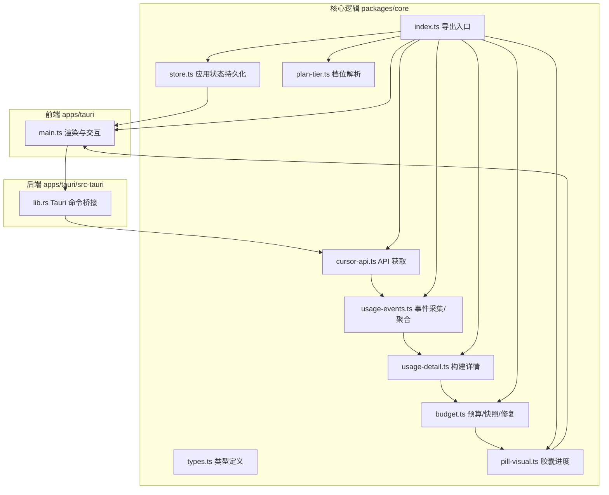
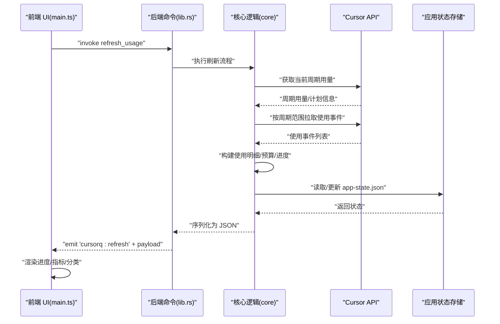
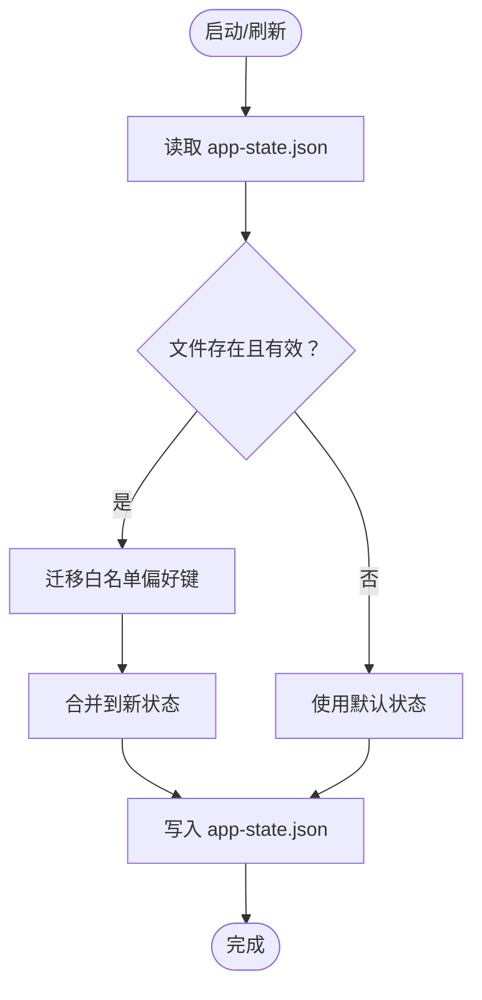
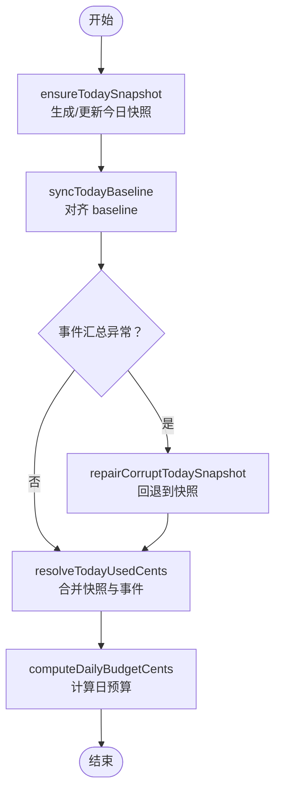
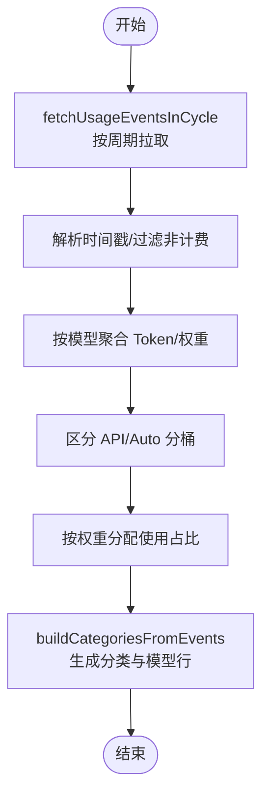
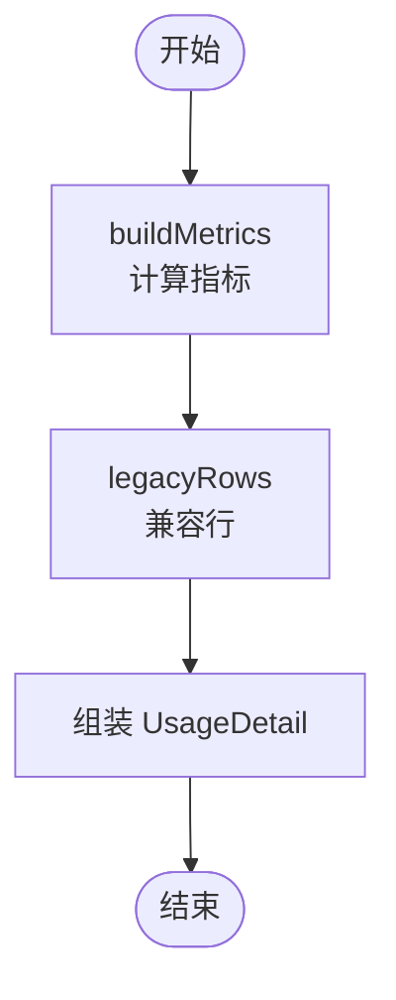
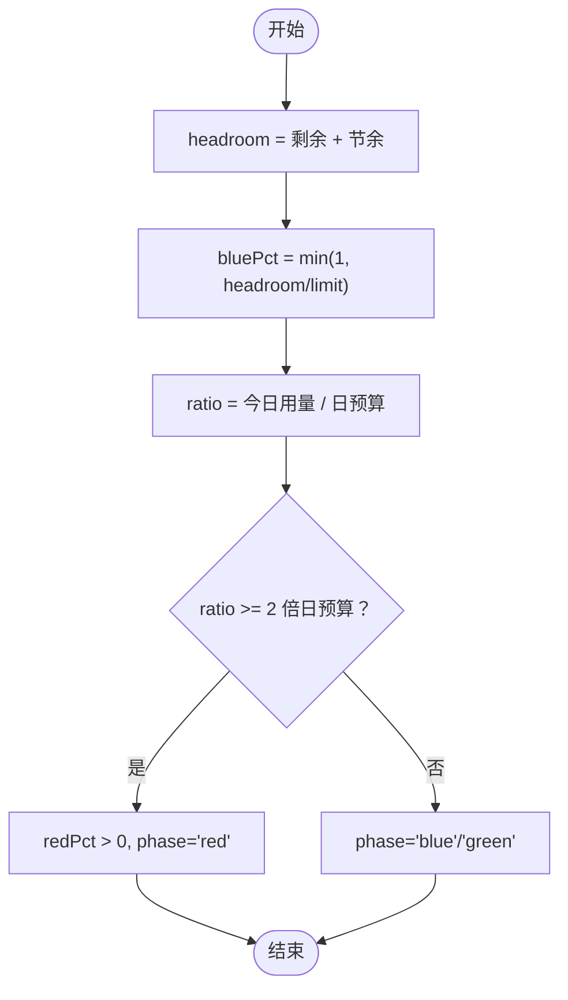
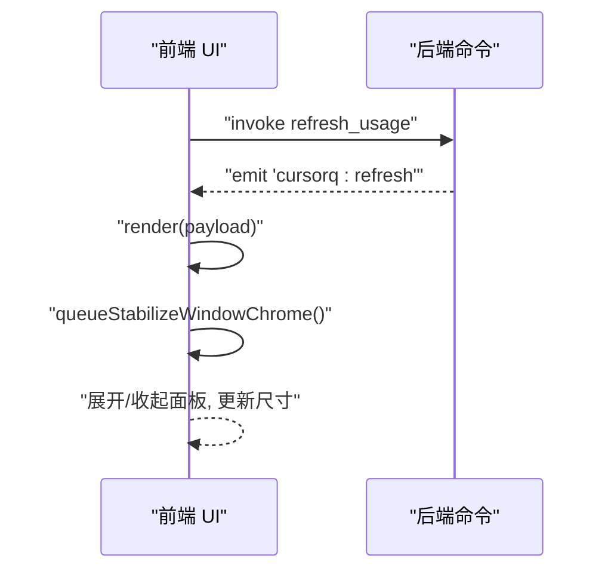
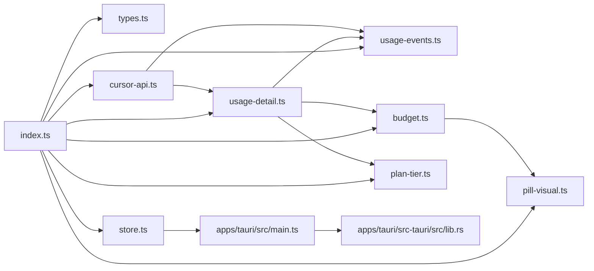

# 数据流与状态管理

<cite>
**本文引用的文件**
- [packages/core/src/index.ts](file://packages/core/src/index.ts)
- [packages/core/src/types.ts](file://packages/core/src/types.ts)
- [packages/core/src/store.ts](file://packages/core/src/store.ts)
- [packages/core/src/budget.ts](file://packages/core/src/budget.ts)
- [packages/core/src/pill-visual.ts](file://packages/core/src/pill-visual.ts)
- [packages/core/src/usage-events.ts](file://packages/core/src/usage-events.ts)
- [packages/core/src/usage-detail.ts](file://packages/core/src/usage-detail.ts)
- [packages/core/src/cursor-api.ts](file://packages/core/src/cursor-api.ts)
- [packages/core/src/plan-tier.ts](file://packages/core/src/plan-tier.ts)
- [apps/tauri/src/main.ts](file://apps/tauri/src/main.ts)
- [apps/tauri/src-tauri/src/lib.rs](file://apps/tauri/src-tauri/src/lib.rs)
</cite>

## 目录
1. [简介](#简介)
2. [项目结构](#项目结构)
3. [核心组件](#核心组件)
4. [架构总览](#架构总览)
5. [详细组件分析](#详细组件分析)
6. [依赖关系分析](#依赖关系分析)
7. [性能考量](#性能考量)
8. [故障排查指南](#故障排查指南)
9. [结论](#结论)
10. [附录](#附录)

## 简介
本文件系统性阐述 CursorQ 的数据流与状态管理设计，覆盖从 Cursor API 获取周期用量与计划信息、拉取使用事件、计算预算与进度、到前端渲染与响应式更新的完整链路。重点包括：
- 全局状态模型与持久化策略
- 预算与快照机制、今日用量对齐与修复
- 使用事件的采集、清洗、聚合与可视化
- 前端通过 Tauri 后端调用刷新数据、接收事件并驱动 UI 响应式更新

## 项目结构
核心逻辑集中在 packages/core，UI 与交互在 apps/tauri，跨端桥接在 apps/tauri/src-tauri。

**图表来源**
- [packages/core/src/index.ts:1-35](file://packages/core/src/index.ts#L1-L35)
- [packages/core/src/types.ts:1-140](file://packages/core/src/types.ts#L1-L140)
- [packages/core/src/store.ts:1-55](file://packages/core/src/store.ts#L1-L55)
- [packages/core/src/budget.ts:1-274](file://packages/core/src/budget.ts#L1-L274)
- [packages/core/src/pill-visual.ts:1-79](file://packages/core/src/pill-visual.ts#L1-L79)
- [packages/core/src/usage-events.ts:1-291](file://packages/core/src/usage-events.ts#L1-L291)
- [packages/core/src/usage-detail.ts:1-185](file://packages/core/src/usage-detail.ts#L1-L185)
- [packages/core/src/cursor-api.ts:1-251](file://packages/core/src/cursor-api.ts#L1-L251)
- [packages/core/src/plan-tier.ts:1-27](file://packages/core/src/plan-tier.ts#L1-L27)
- [apps/tauri/src/main.ts:1-711](file://apps/tauri/src/main.ts#L1-L711)
- [apps/tauri/src-tauri/src/lib.rs:617-648](file://apps/tauri/src-tauri/src/lib.rs#L617-L648)

**章节来源**
- [packages/core/src/index.ts:1-35](file://packages/core/src/index.ts#L1-L35)
- [apps/tauri/src/main.ts:1-711](file://apps/tauri/src/main.ts#L1-L711)

## 核心组件
- 类型与状态模型：定义周期用量、计划信息、使用明细、进度画布、应用状态等核心类型，确保前后端契约一致。
- API 获取层：统一从 Cursor Connect/REST 获取周期用量与计划信息，并进行兜底与合并。
- 事件采集与聚合：按日范围拉取计费事件，清洗与聚合为类别与模型维度的使用分布。
- 预算与快照：维护每日快照、对齐 baseline、修复异常、计算日预算与剩余天数。
- 进度与视觉：根据预算与用量计算胶囊进度与配色，输出面板指标。
- 应用状态持久化：加载/保存 app-state.json，支持偏好键迁移与容错。
- 前端渲染与交互：通过 Tauri 命令触发刷新，接收 payload 并渲染 UI，支持调试模式与动态更新。

**章节来源**
- [packages/core/src/types.ts:1-140](file://packages/core/src/types.ts#L1-L140)
- [packages/core/src/store.ts:1-55](file://packages/core/src/store.ts#L1-L55)
- [packages/core/src/budget.ts:1-274](file://packages/core/src/budget.ts#L1-L274)
- [packages/core/src/pill-visual.ts:1-79](file://packages/core/src/pill-visual.ts#L1-L79)
- [packages/core/src/usage-events.ts:1-291](file://packages/core/src/usage-events.ts#L1-L291)
- [packages/core/src/usage-detail.ts:1-185](file://packages/core/src/usage-detail.ts#L1-L185)
- [packages/core/src/cursor-api.ts:1-251](file://packages/core/src/cursor-api.ts#L1-L251)
- [packages/core/src/plan-tier.ts:1-27](file://packages/core/src/plan-tier.ts#L1-L27)
- [apps/tauri/src/main.ts:1-711](file://apps/tauri/src/main.ts#L1-L711)

## 架构总览
下图展示从 Cursor API 到前端渲染的端到端数据流与状态流转。

**图表来源**
- [apps/tauri/src/main.ts:524-560](file://apps/tauri/src/main.ts#L524-L560)
- [apps/tauri/src-tauri/src/lib.rs:617-648](file://apps/tauri/src-tauri/src/lib.rs#L617-L648)
- [packages/core/src/cursor-api.ts:173-217](file://packages/core/src/cursor-api.ts#L173-L217)
- [packages/core/src/usage-events.ts:166-186](file://packages/core/src/usage-events.ts#L166-L186)
- [packages/core/src/usage-detail.ts:104-180](file://packages/core/src/usage-detail.ts#L104-L180)
- [packages/core/src/budget.ts:102-147](file://packages/core/src/budget.ts#L102-L147)
- [packages/core/src/store.ts:10-54](file://packages/core/src/store.ts#L10-L54)

## 详细组件分析

### 全局状态模型与持久化
- 应用状态包含节余资金、每日快照、最后结算日期、通知记录、语言、笑话索引、上次周期 includedSpend 等字段，保证跨刷新与重启的一致性。
- 加载策略：若文件不存在或损坏，回退到默认状态；仅迁移白名单偏好键，避免覆盖新字段。
- 保存策略：合并现有配置中的白名单键，写入新状态，确保兼容性与最小化写入。

**图表来源**
- [packages/core/src/store.ts:10-54](file://packages/core/src/store.ts#L10-L54)

**章节来源**
- [packages/core/src/types.ts:99-110](file://packages/core/src/types.ts#L99-L110)
- [packages/core/src/store.ts:10-54](file://packages/core/src/store.ts#L10-L54)

### 预算与快照机制
- 今日快照：确保当日存在快照，基于周期剩余额度与可选初始 baseline 或当日事件汇总对齐 baseline。
- 基线同步：刷新后将今日 baseline 与 resolved 今日用量对齐，避免仪表盘与事件汇总差异导致的偏差。
- 异常修复：当事件汇总异常偏高时，回退到快照值，防止整周期误计。
- 日预算与剩余天数：按剩余天数均摊，结合周末宽限策略进行节余银行结算。

**图表来源**
- [packages/core/src/budget.ts:102-147](file://packages/core/src/budget.ts#L102-L147)
- [packages/core/src/budget.ts:194-207](file://packages/core/src/budget.ts#L194-L207)
- [packages/core/src/budget.ts:214-236](file://packages/core/src/budget.ts#L214-L236)

**章节来源**
- [packages/core/src/budget.ts:102-236](file://packages/core/src/budget.ts#L102-L236)

### 使用事件采集与聚合
- 事件采集：按周期范围或当天范围拉取计费事件，支持分页与总数校验。
- 清洗与权重：解析时间戳、过滤非计费项、按美分/请求成本/Token 数量确定权重。
- 聚合与分类：按模型聚合 Token 与权重，区分 API 与 Auto Composer 分桶，分配使用占比，补充缺失模型标签。

**图表来源**
- [packages/core/src/usage-events.ts:166-186](file://packages/core/src/usage-events.ts#L166-L186)
- [packages/core/src/usage-events.ts:192-290](file://packages/core/src/usage-events.ts#L192-L290)

**章节来源**
- [packages/core/src/usage-events.ts:1-291](file://packages/core/src/usage-events.ts#L1-L291)

### 使用明细与指标构建
- 指标计算：基于周期用量、日预算、剩余天数与计划限额，计算今日使用占比、周期使用占比、剩余占比、剩余天数占比与档位标签。
- 明细组装：合并 API 百分比与事件聚合结果，生成分类与模型行，补充历史兼容行。

**图表来源**
- [packages/core/src/usage-detail.ts:22-71](file://packages/core/src/usage-detail.ts#L22-L71)
- [packages/core/src/usage-detail.ts:73-97](file://packages/core/src/usage-detail.ts#L73-L97)
- [packages/core/src/usage-detail.ts:104-180](file://packages/core/src/usage-detail.ts#L104-L180)

**章节来源**
- [packages/core/src/usage-detail.ts:1-185](file://packages/core/src/usage-detail.ts#L1-L185)
- [packages/core/src/plan-tier.ts:1-27](file://packages/core/src/plan-tier.ts#L1-L27)

### 进度与胶囊视觉
- 胶囊配色：基于剩余额度与节余银行决定蓝色比例，基于今日用量与日预算比值决定红色比例，超过阈值进入红色阶段。
- 面板指标：输出总量使用百分比、今日使用百分比、剩余天数与紧迫度等，供 UI 渲染。

**图表来源**
- [packages/core/src/pill-visual.ts:29-63](file://packages/core/src/pill-visual.ts#L29-L63)

**章节来源**
- [packages/core/src/pill-visual.ts:1-79](file://packages/core/src/pill-visual.ts#L1-L79)

### 前端刷新与响应式更新
- 刷新触发：前端定时轮询与用户点击触发，通过 Tauri 命令调用后端执行刷新流程。
- 数据通道：后端执行完成后将 JSON payload 通过事件发送给前端，前端渲染进度条、指标与分类卡片。
- 动态更新：监听内容更新与窗口状态事件，稳定窗口样式并重绘。

**图表来源**
- [apps/tauri/src/main.ts:524-560](file://apps/tauri/src/main.ts#L524-L560)
- [apps/tauri/src/main.ts:700-710](file://apps/tauri/src/main.ts#L700-L710)
- [apps/tauri/src-tauri/src/lib.rs:617-648](file://apps/tauri/src-tauri/src/lib.rs#L617-L648)

**章节来源**
- [apps/tauri/src/main.ts:1-711](file://apps/tauri/src/main.ts#L1-L711)
- [apps/tauri/src-tauri/src/lib.rs:617-648](file://apps/tauri/src-tauri/src/lib.rs#L617-L648)

## 依赖关系分析
- 导出入口统一导出核心模块，便于前端按需引入。
- 类型定义贯穿所有模块，确保数据结构一致性。
- 预算与视觉模块依赖类型定义；事件与明细模块依赖预算与类型；API 模块为上游数据源；前端依赖后端命令桥接。

**图表来源**
- [packages/core/src/index.ts:1-35](file://packages/core/src/index.ts#L1-L35)
- [packages/core/src/types.ts:1-140](file://packages/core/src/types.ts#L1-L140)
- [packages/core/src/store.ts:1-55](file://packages/core/src/store.ts#L1-L55)
- [packages/core/src/budget.ts:1-274](file://packages/core/src/budget.ts#L1-L274)
- [packages/core/src/pill-visual.ts:1-79](file://packages/core/src/pill-visual.ts#L1-L79)
- [packages/core/src/usage-events.ts:1-291](file://packages/core/src/usage-events.ts#L1-L291)
- [packages/core/src/usage-detail.ts:1-185](file://packages/core/src/usage-detail.ts#L1-L185)
- [packages/core/src/cursor-api.ts:1-251](file://packages/core/src/cursor-api.ts#L1-L251)
- [packages/core/src/plan-tier.ts:1-27](file://packages/core/src/plan-tier.ts#L1-L27)
- [apps/tauri/src/main.ts:1-711](file://apps/tauri/src/main.ts#L1-L711)
- [apps/tauri/src-tauri/src/lib.rs:617-648](file://apps/tauri/src-tauri/src/lib.rs#L617-L648)

**章节来源**
- [packages/core/src/index.ts:1-35](file://packages/core/src/index.ts#L1-L35)

## 性能考量
- 事件拉取分页与总数校验，避免无限循环与重复网络请求。
- 今日用量合并策略在异常情况下回退到快照，减少整周期误计带来的重算成本。
- 前端定时轮询间隔较长，降低频繁刷新对 UI 与网络的影响。
- 胶囊进度计算仅依赖少量数值运算，渲染开销可控。

## 故障排查指南
- 登录态问题：若返回未登录错误，前端提示“请先登录 Cursor”，检查访问令牌有效性与会话 Cookie 生成。
- 网络异常：API 获取与事件拉取失败时，前端显示“刷新失败”，建议重试或检查网络代理。
- 状态损坏：app-state.json 文件损坏或格式异常时，自动回退默认状态并保留白名单偏好键。
- 事件汇总异常：当事件汇总明显高于日预算或快照值时，系统自动回退到快照，避免误计。

**章节来源**
- [apps/tauri/src/main.ts:524-560](file://apps/tauri/src/main.ts#L524-L560)
- [packages/core/src/store.ts:10-28](file://packages/core/src/store.ts#L10-L28)
- [packages/core/src/budget.ts:194-207](file://packages/core/src/budget.ts#L194-L207)

## 结论
CursorQ 的数据流与状态管理以清晰的模块边界与类型约束为基础，通过 API 获取、事件采集与聚合、预算与快照维护、进度计算与持久化，最终在前端实现响应式渲染。该设计在准确性、可维护性与用户体验之间取得平衡，适合进一步扩展与演进。

## 附录
- 关键流程路径参考
  - [API 获取周期用量与计划信息:173-217](file://packages/core/src/cursor-api.ts#L173-L217)
  - [按周期拉取使用事件:166-186](file://packages/core/src/usage-events.ts#L166-L186)
  - [构建使用明细与指标:104-180](file://packages/core/src/usage-detail.ts#L104-L180)
  - [预算快照与今日用量修复:102-207](file://packages/core/src/budget.ts#L102-L207)
  - [胶囊进度计算:29-63](file://packages/core/src/pill-visual.ts#L29-L63)
  - [应用状态加载/保存:10-54](file://packages/core/src/store.ts#L10-L54)
  - [前端刷新与事件监听:524-710](file://apps/tauri/src/main.ts#L524-L710)
  - [后端命令桥接:617-648](file://apps/tauri/src-tauri/src/lib.rs#L617-L648)