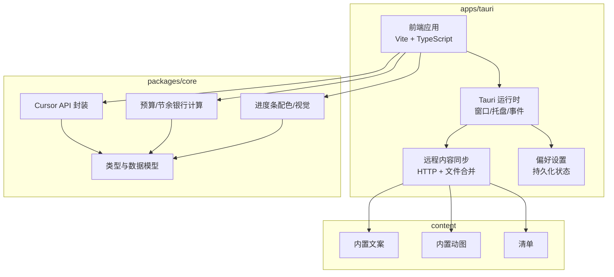
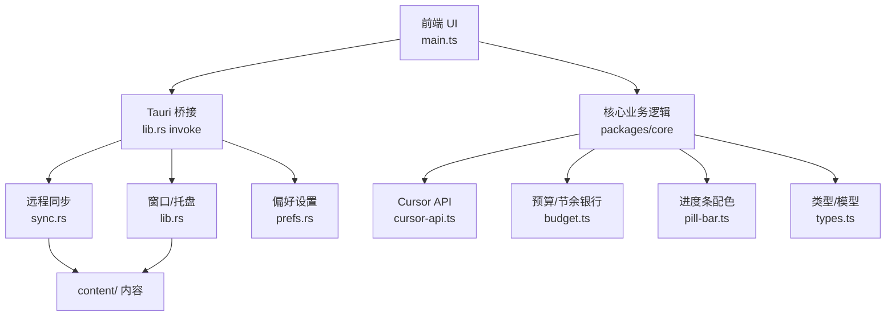
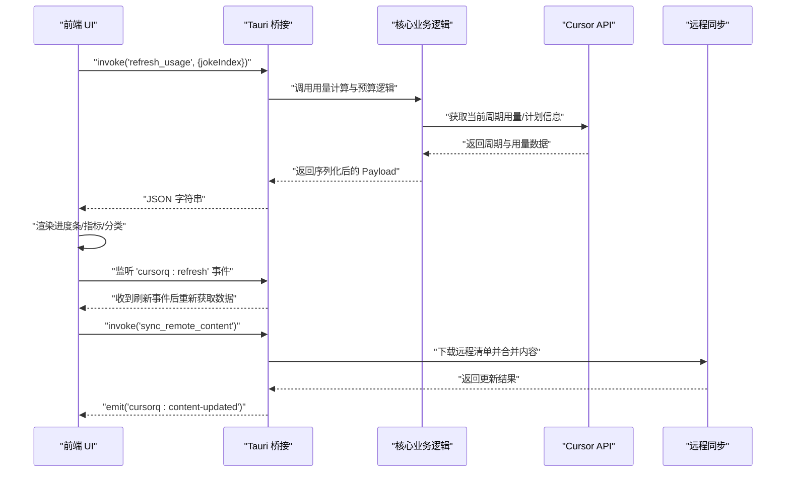
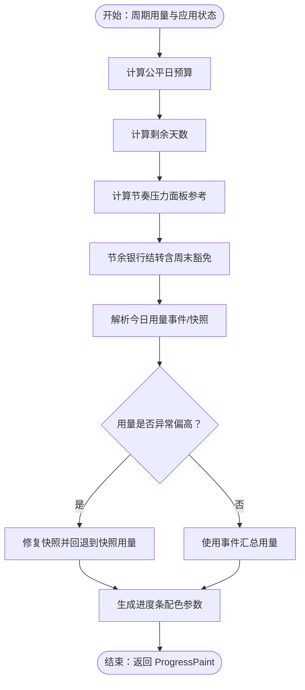
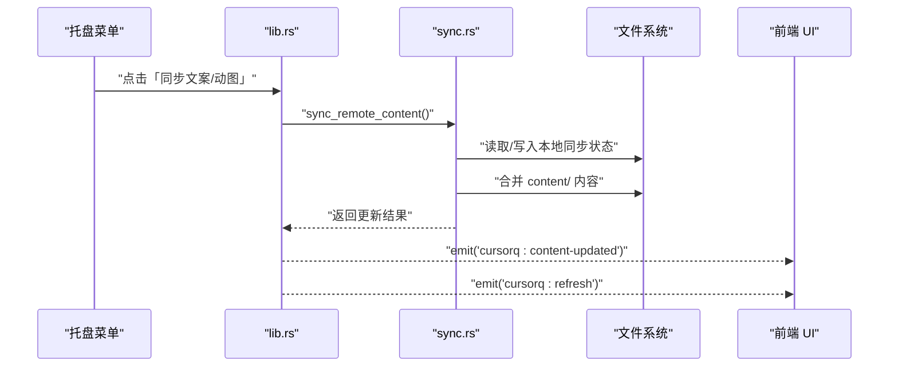
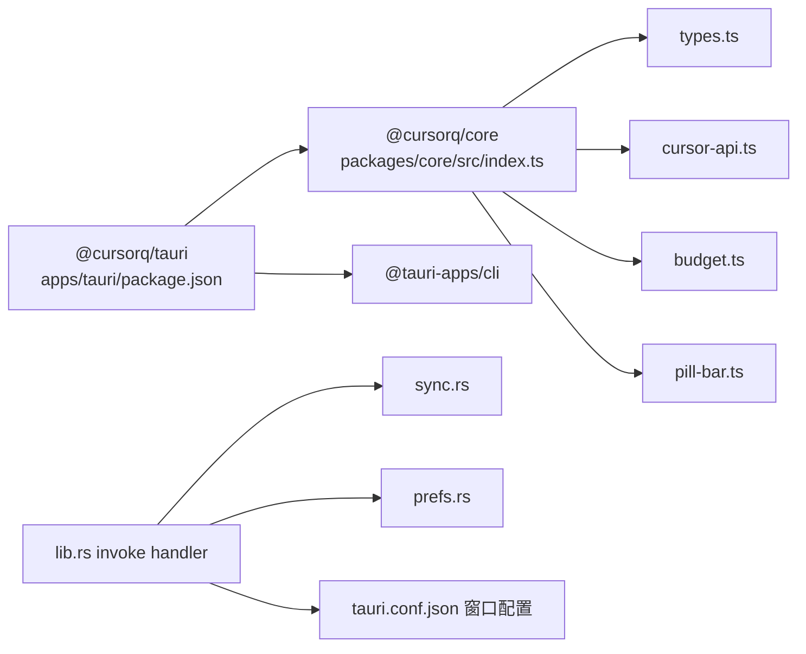

# 整体架构设计

<cite>
**本文引用的文件**
- [README.md](file://README.md)
- [main.ts](file://apps/tauri/src/main.ts)
- [lib.rs](file://apps/tauri/src-tauri/src/lib.rs)
- [main.rs](file://apps/tauri/src-tauri/src/main.rs)
- [Cargo.toml](file://apps/tauri/src-tauri/Cargo.toml)
- [tauri.conf.json](file://apps/tauri/src-tauri/tauri.conf.json)
- [index.ts](file://packages/core/src/index.ts)
- [types.ts](file://packages/core/src/types.ts)
- [cursor-api.ts](file://packages/core/src/cursor-api.ts)
- [budget.ts](file://packages/core/src/budget.ts)
- [pill-bar.ts](file://packages/core/src/pill-bar.ts)
- [sync.rs](file://apps/tauri/src-tauri/src/sync.rs)
- [prefs.rs](file://apps/tauri/src-tauri/src/prefs.rs)
- [package.json](file://apps/tauri/package.json)
- [package.json](file://package.json)
- [vite.config.ts](file://apps/tauri/vite.config.ts)
- [tsconfig.json](file://apps/tauri/tsconfig.json)
- [i18n.ts](file://apps/tauri/src/i18n.ts)
</cite>

## 目录
1. [引言](#引言)
2. [项目结构](#项目结构)
3. [核心组件](#核心组件)
4. [架构总览](#架构总览)
5. [详细组件分析](#详细组件分析)
6. [依赖关系分析](#依赖关系分析)
7. [性能考量](#性能考量)
8. [故障排查指南](#故障排查指南)
9. [结论](#结论)
10. [附录](#附录)

## 引言
本项目为 Cursor 订阅用量桌面胶囊挂件（Tauri 2），目标是在屏幕顶部以轻量、无边框、透明圆角的胶囊窗口展示 Cursor 订阅用量的周期余量、今日预算与状态文案，并通过系统托盘提供显示/隐藏、语言切换、置顶、开机启动、刷新与远程内容同步等功能。项目采用分层架构：前端应用层（Web UI + 交互）、核心业务逻辑层（用量计算、配色、文案与数据模型）、系统集成层（Tauri 原生能力、窗口管理、托盘、文件系统、网络同步）。本文档系统阐述各层职责、边界与交互关系，解释应用启动流程、初始化顺序与模块依赖，并总结架构设计原则与设计决策。

## 项目结构
项目采用 monorepo 结构，主要目录与职责如下：
- apps/tauri：Tauri 2 主程序，包含前端 Web 应用（Vite 构建）、原生 Rust 插件与命令、窗口与托盘逻辑、远程内容同步与偏好设置。
- packages/core：核心业务逻辑与数据模型，封装 Cursor 鉴权、API 调用、预算与节余银行计算、进度条配色、文案与国际化等。
- content：内置文案、吉祥物与清单，启动即用。
- config：远程内容配置示例。
- scripts/docs/release：开发脚本、打包与发布说明。
- data：运行时数据与日志（便携包位于 exe 同级）。

**图表来源**
- [main.ts:1-711](file://apps/tauri/src/main.ts#L1-L711)
- [lib.rs:715-800](file://apps/tauri/src-tauri/src/lib.rs#L715-L800)
- [sync.rs:260-372](file://apps/tauri/src-tauri/src/sync.rs#L260-L372)
- [index.ts:1-35](file://packages/core/src/index.ts#L1-L35)

**章节来源**
- [README.md:98-129](file://README.md#L98-L129)
- [package.json:6-24](file://package.json#L6-L24)

## 核心组件
- 前端应用层（apps/tauri）
  - 主入口与渲染：负责窗口尺寸与展开/收起、事件绑定（拖拽、点击、双击）、定时刷新、国际化文案与调试模式。
  - 原生桥接：通过 Tauri invoke 调用 Rust 命令，实现刷新用量、窗口形状调整、托盘菜单、远程内容同步、路径查询等。
- 核心业务逻辑层（packages/core）
  - 类型与数据模型：统一用量、周期、计划、进度等结构。
  - Cursor API：封装 Dashboard 与 Connect 协议调用，兼容 REST 回退。
  - 预算与节余银行：计算日预算、剩余天数、公平日预算、节余银行结转、今日用量解析与修复。
  - 进度条配色：基于蓝/红占比生成胶囊渐变。
- 系统集成层（apps/tauri/src-tauri）
  - 窗口与托盘：无边框透明窗口、DWM 形状与阴影控制、托盘菜单、始终置顶、开机启动。
  - 远程内容同步：下载远程清单与资源，合并内置与远程内容，保证不覆盖本地。
  - 偏好设置：持久化胶囊可见性、置顶、开机启动、语言等。

**章节来源**
- [main.ts:1-711](file://apps/tauri/src/main.ts#L1-L711)
- [index.ts:1-35](file://packages/core/src/index.ts#L1-L35)
- [types.ts:1-140](file://packages/core/src/types.ts#L1-L140)
- [cursor-api.ts:1-251](file://packages/core/src/cursor-api.ts#L1-L251)
- [budget.ts:1-274](file://packages/core/src/budget.ts#L1-L274)
- [pill-bar.ts:1-23](file://packages/core/src/pill-bar.ts#L1-L23)
- [lib.rs:715-800](file://apps/tauri/src-tauri/src/lib.rs#L715-L800)
- [sync.rs:260-372](file://apps/tauri/src-tauri/src/sync.rs#L260-L372)
- [prefs.rs:1-145](file://apps/tauri/src-tauri/src/prefs.rs#L1-L145)

## 架构总览
系统采用“前端应用层 + 核心业务逻辑层 + 系统集成层”的三层分层架构：
- 前端应用层：以 Web 技术构建 UI，通过 Tauri 与原生能力解耦，便于快速迭代与跨平台。
- 核心业务逻辑层：封装 Cursor 用量计算、预算与节余银行策略、进度条配色与文案，确保算法一致性与可测试性。
- 系统集成层：负责窗口、托盘、文件系统、网络同步、开机启动等系统能力，屏蔽平台差异。

**图表来源**
- [main.ts:1-711](file://apps/tauri/src/main.ts#L1-L711)
- [lib.rs:715-800](file://apps/tauri/src-tauri/src/lib.rs#L715-L800)
- [sync.rs:260-372](file://apps/tauri/src-tauri/src/sync.rs#L260-L372)
- [prefs.rs:1-145](file://apps/tauri/src-tauri/src/prefs.rs#L1-L145)
- [index.ts:1-35](file://packages/core/src/index.ts#L1-L35)

## 详细组件分析

### 前端应用层（Web UI 与交互）
- 初始化与窗口控制
  - 初始化窗口为 200x44 逻辑像素，禁用焦点与装饰，透明背景，始终置顶且跳过任务栏。
  - 通过 invoke 控制胶囊显示/隐藏、窗口拖拽、DWM 形状调整与阴影处理。
- 交互与事件
  - 长按/拖拽：长按约 480ms 或移动超过阈值触发拖拽；双击胶囊展开/收起详情面板。
  - 点击吉祥物：展开/收起详情；双击手动切换动图。
  - 点击文案：轮换内置段子；提示行三连击进入/退出调试模式。
- 渲染与更新
  - 定时刷新（30 分钟）与手动刷新；根据返回的进度、指标与分类数据渲染胶囊与详情面板。
  - 调试模式：通过滑条模拟不同用量状态，实时预览进度条与指标。
- 国际化与主题
  - 支持中/英双语；按档位动态应用主题类名；周期范围格式化。

**图表来源**
- [main.ts:524-560](file://apps/tauri/src/main.ts#L524-L560)
- [lib.rs:617-639](file://apps/tauri/src-tauri/src/lib.rs#L617-L639)
- [cursor-api.ts:173-217](file://packages/core/src/cursor-api.ts#L173-L217)
- [sync.rs:260-372](file://apps/tauri/src-tauri/src/sync.rs#L260-L372)

**章节来源**
- [main.ts:674-711](file://apps/tauri/src/main.ts#L674-L711)
- [i18n.ts:1-89](file://apps/tauri/src/i18n.ts#L1-L89)
- [tauri.conf.json:13-30](file://apps/tauri/src-tauri/tauri.conf.json#L13-L30)

### 核心业务逻辑层（packages/core）
- 类型与数据模型
  - 统一定义用量、周期、计划、进度、分类与模型行、快照、应用状态等结构，确保前后端契约一致。
- Cursor API 封装
  - 优先调用 Connect 协议接口，失败时回退到网页 Dashboard 的 REST 接口，保证稳定性。
  - 解析周期起止、包含用量、剩余、限额、总用量百分比、API/Auto 分桶占比等。
- 预算与节余银行
  - 计算公平日预算、剩余天数、日预算、节余银行结转（考虑周末与上限）、今日用量解析与修复。
  - 提供快照管理与跨日基线同步，避免事件汇总异常导致的误计。
- 进度条配色
  - 基于蓝/红占比生成胶囊渐变，当今日用量 ≥ 2× 日预算时显示红色警示。

**图表来源**
- [budget.ts:65-207](file://packages/core/src/budget.ts#L65-L207)
- [budget.ts:214-274](file://packages/core/src/budget.ts#L214-L274)
- [pill-bar.ts:8-22](file://packages/core/src/pill-bar.ts#L8-L22)

**章节来源**
- [types.ts:1-140](file://packages/core/src/types.ts#L1-L140)
- [cursor-api.ts:173-217](file://packages/core/src/cursor-api.ts#L173-L217)
- [budget.ts:1-274](file://packages/core/src/budget.ts#L1-L274)
- [pill-bar.ts:1-23](file://packages/core/src/pill-bar.ts#L1-L23)

### 系统集成层（apps/tauri/src-tauri）
- 窗口与托盘
  - 无边框透明窗口、禁用阴影与装饰、透明背景；Windows 下通过 DWM 调整窗口形状与置顶。
  - 托盘菜单包含显示/隐藏胶囊、中/英切换、置顶、开机启动、立即刷新、同步内容、退出。
- 远程内容同步
  - 读取 remote.json 配置，下载远程清单与资源，仅追加新条目，不覆盖本地已有内容。
  - 合并策略：文案 JSON 去重合并，二进制资源仅在本地不存在时写入。
- 偏好设置
  - 持久化胶囊可见性、置顶、开机启动、语言等；启动时应用偏好并同步系统设置。

**图表来源**
- [lib.rs:664-713](file://apps/tauri/src-tauri/src/lib.rs#L664-L713)
- [sync.rs:260-372](file://apps/tauri/src-tauri/src/sync.rs#L260-L372)

**章节来源**
- [lib.rs:715-800](file://apps/tauri/src-tauri/src/lib.rs#L715-L800)
- [sync.rs:260-372](file://apps/tauri/src-tauri/src/sync.rs#L260-L372)
- [prefs.rs:128-132](file://apps/tauri/src-tauri/src/prefs.rs#L128-L132)

## 依赖关系分析
- 前端依赖
  - apps/tauri/package.json 依赖 @cursorq/core 与 @tauri-apps/api，Vite 别名指向 packages/core/src/browser.ts。
- 核心依赖
  - packages/core/src/index.ts 导出类型、鉴权、API、预算、进度条、文案、存储、用量详情、档位与计划限制、用量事件等。
- 系统依赖
  - apps/tauri/src-tauri/Cargo.toml 引入 tauri、shell、autostart、reqwest、chrono、which、base64 等，Windows 平台引入 windows crate 以支持 DWM。

**图表来源**
- [package.json:12-21](file://apps/tauri/package.json#L12-L21)
- [index.ts:1-35](file://packages/core/src/index.ts#L1-L35)
- [Cargo.toml:15-33](file://apps/tauri/src-tauri/Cargo.toml#L15-L33)
- [tauri.conf.json:1-48](file://apps/tauri/src-tauri/tauri.conf.json#L1-L48)

**章节来源**
- [package.json:1-22](file://apps/tauri/package.json#L1-L22)
- [index.ts:1-35](file://packages/core/src/index.ts#L1-L35)
- [Cargo.toml:1-37](file://apps/tauri/src-tauri/Cargo.toml#L1-L37)
- [vite.config.ts:9-13](file://apps/tauri/vite.config.ts#L9-L13)

## 性能考量
- 前端渲染优化
  - 展开/收起详情时一次性设定窗口高度，避免 WebView 卷轴动画触发导致的白边问题。
  - 使用渐进式测量与缓存窗口布局，减少重排与重绘。
- 网络与 I/O
  - 远程同步采用阻塞 HTTP 客户端，后台线程执行以避免 UI 卡顿；合并策略仅追加新条目，降低冲突与写入开销。
- 资源加载
  - 动图为 data URL 直接加载，避免 asset:// 在部分环境失败。
- 计算复杂度
  - 预算与节余银行计算为 O(1)~O(n)（n 为快照数量，通常 ≤40），满足实时渲染需求。

[本节为通用性能讨论，无需具体文件分析]

## 故障排查指南
- 常见问题
  - 未登录 Cursor：前端渲染提示“请先登录 Cursor”，检查本地登录态与 token。
  - 刷新失败：查看日志文件（.data/logs/cursorq.log），确认 Node 可执行路径与工作目录。
  - 窗口白边/阴影异常：触发“修复窗口”事件或等待定时修复，确保 DWM 形状与阴影设置正确。
  - 远程内容未更新：确认 remote.json 配置、网络可达与清单版本号。
- 关键日志位置
  - 日志文件：apps/tauri/.data/logs/cursorq.log（开发时）或便携包同级 config/ 目录。
- 快速定位
  - 托盘菜单“立即刷新”触发后，前端监听 cursorq:refresh 事件重新获取数据。
  - 内容更新后，前端监听 cursorq:content-updated 事件并触发刷新。

**章节来源**
- [main.ts:524-560](file://apps/tauri/src/main.ts#L524-L560)
- [lib.rs:587-614](file://apps/tauri/src-tauri/src/lib.rs#L587-L614)
- [sync.rs:260-372](file://apps/tauri/src-tauri/src/sync.rs#L260-L372)

## 结论
本项目通过清晰的三层架构实现了功能完备、性能稳定、易于扩展的桌面胶囊挂件。前端应用层专注于用户体验与交互，核心业务逻辑层确保用量计算与配色的一致性，系统集成层屏蔽平台差异并提供系统级能力。选择 Tauri 而非 Electron 的原因在于更小的体积、更低的内存占用与更好的性能表现；模块化设计使核心算法与前端 UI 解耦，便于独立演进与测试。建议后续持续优化远程内容合并策略与日志输出，提升可维护性与可观测性。

[本节为总结，无需具体文件分析]

## 附录
- 开发与运行
  - 安装 Node.js 20+、Rust（MSVC 工具链）、WebView2；执行 npm install、npm run build、npm run dev。
- 打包发布（Windows）
  - 使用 npm run package:win 生成便携包，包含 exe、content、config 等。

**章节来源**
- [README.md:14-31](file://README.md#L14-L31)
- [README.md:111-119](file://README.md#L111-L119)