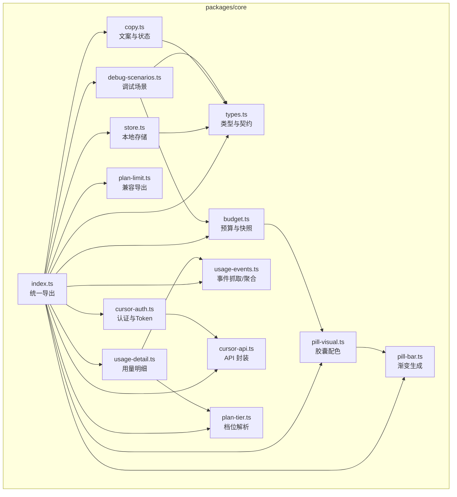
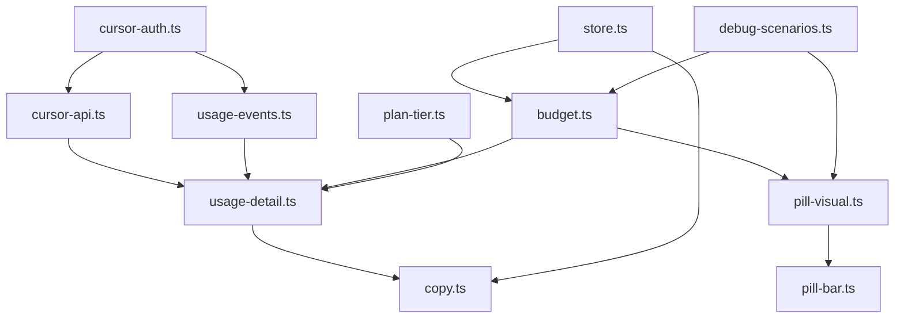
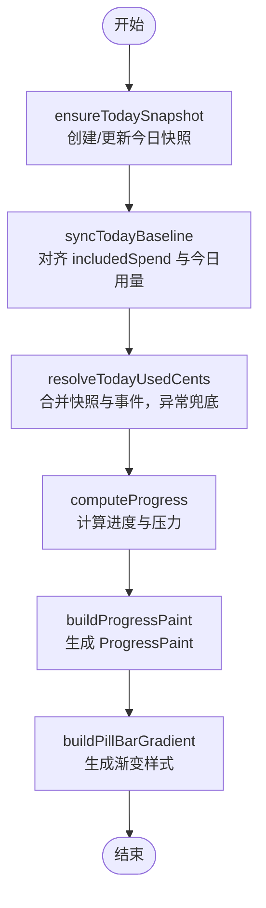
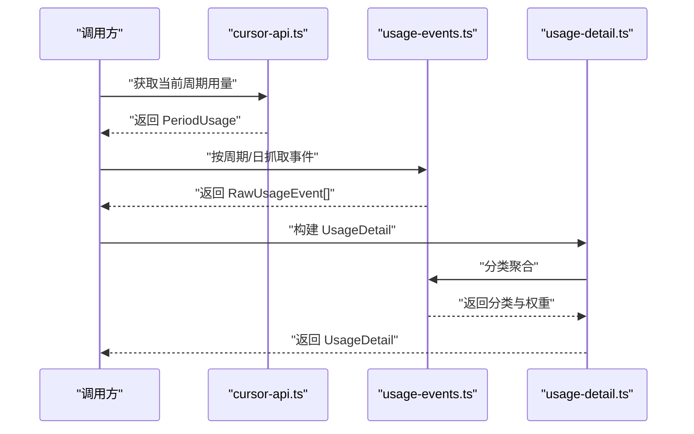
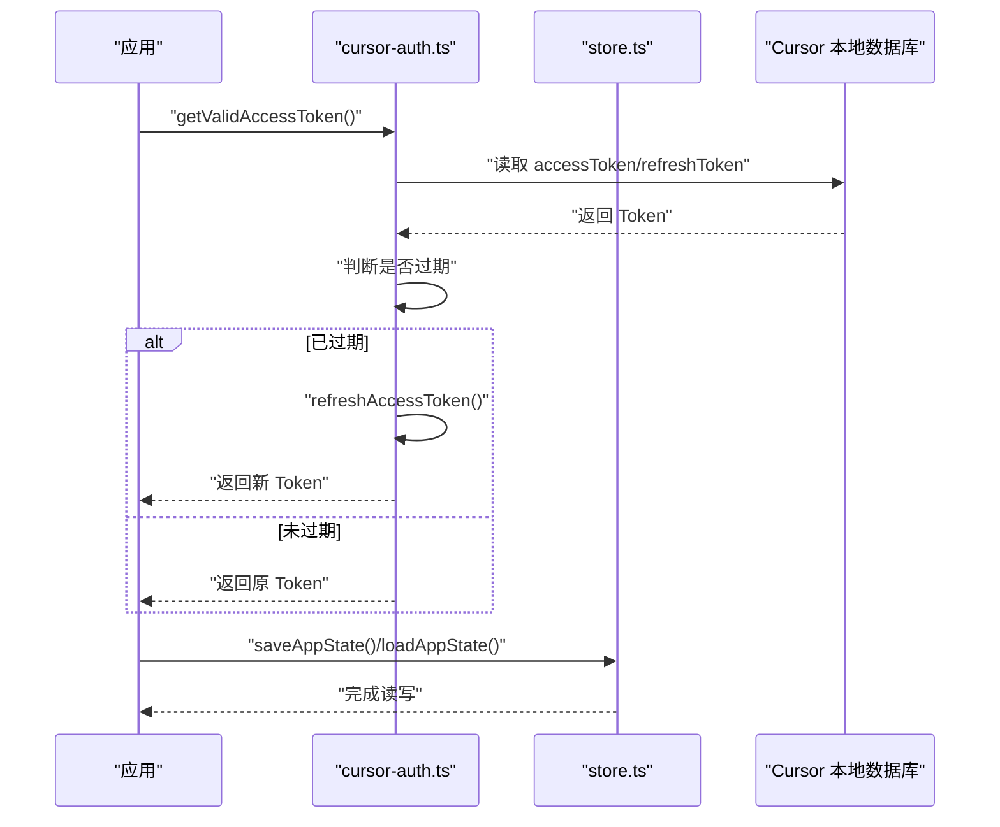
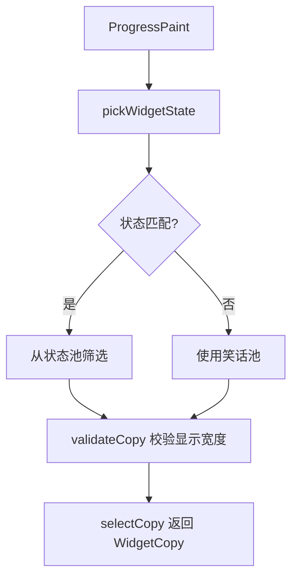
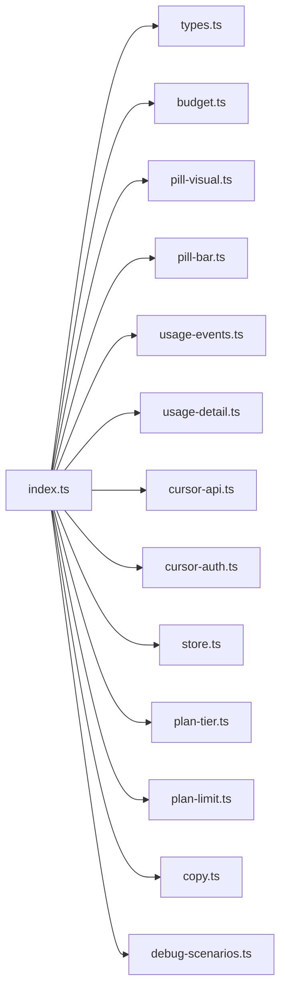

# 模块化设计

<cite>
**本文引用的文件**
- [packages/core/src/index.ts](file://packages/core/src/index.ts)
- [packages/core/src/types.ts](file://packages/core/src/types.ts)
- [packages/core/src/budget.ts](file://packages/core/src/budget.ts)
- [packages/core/src/pill-visual.ts](file://packages/core/src/pill-visual.ts)
- [packages/core/src/pill-bar.ts](file://packages/core/src/pill-bar.ts)
- [packages/core/src/usage-events.ts](file://packages/core/src/usage-events.ts)
- [packages/core/src/usage-detail.ts](file://packages/core/src/usage-detail.ts)
- [packages/core/src/store.ts](file://packages/core/src/store.ts)
- [packages/core/src/cursor-api.ts](file://packages/core/src/cursor-api.ts)
- [packages/core/src/cursor-auth.ts](file://packages/core/src/cursor-auth.ts)
- [packages/core/src/plan-tier.ts](file://packages/core/src/plan-tier.ts)
- [packages/core/src/plan-limit.ts](file://packages/core/src/plan-limit.ts)
- [packages/core/src/copy.ts](file://packages/core/src/copy.ts)
- [packages/core/src/debug-scenarios.ts](file://packages/core/src/debug-scenarios.ts)
- [packages/core/package.json](file://packages/core/package.json)
</cite>

## 目录
1. [引言](#引言)
2. [项目结构](#项目结构)
3. [核心组件](#核心组件)
4. [架构总览](#架构总览)
5. [详细组件分析](#详细组件分析)
6. [依赖分析](#依赖分析)
7. [性能考量](#性能考量)
8. [故障排查指南](#故障排查指南)
9. [结论](#结论)
10. [附录](#附录)

## 引言
本文件系统性阐述 CursorQ 的 packages/core 包的模块化设计理念与架构。该包以“预算管理、使用统计、状态与可视化、认证与存储”为主线，围绕统一的数据模型与清晰的职责边界，构建高内聚、低耦合的模块体系。通过对外暴露稳定的 API 接口与类型定义，确保上层应用（如 Tauri 桌面端或浏览器扩展）能够以一致的方式集成预算计算、用量聚合、UI 状态选择与本地持久化。

## 项目结构
packages/core 采用“按功能域划分”的模块化组织方式，每个模块聚焦单一职责，并通过 index.ts 统一导出公共 API，形成清晰的门面层。核心模块包括：
- 类型与契约：types.ts 定义所有跨模块共享的数据结构与枚举
- 预算与进度：budget.ts、pill-visual.ts、pill-bar.ts 提供预算计算、胶囊配色与进度绘制
- 使用统计：usage-events.ts、usage-detail.ts 负责事件抓取、聚合与明细构建
- 认证与存储：cursor-auth.ts、store.ts 处理 Token 获取与本地状态持久化
- 计划与档位：plan-tier.ts、plan-limit.ts 提供计划信息与档位解析
- 文案与状态：copy.ts、debug-scenarios.ts 提供文案选择与调试场景
- 导出入口：index.ts 统一导出公共 API，便于上层按需引入

图表来源
- [packages/core/src/index.ts:1-35](file://packages/core/src/index.ts#L1-L35)
- [packages/core/src/types.ts:1-140](file://packages/core/src/types.ts#L1-L140)
- [packages/core/src/budget.ts:1-274](file://packages/core/src/budget.ts#L1-L274)
- [packages/core/src/pill-visual.ts:1-79](file://packages/core/src/pill-visual.ts#L1-L79)
- [packages/core/src/pill-bar.ts:1-23](file://packages/core/src/pill-bar.ts#L1-L23)
- [packages/core/src/usage-events.ts:1-291](file://packages/core/src/usage-events.ts#L1-L291)
- [packages/core/src/usage-detail.ts:1-185](file://packages/core/src/usage-detail.ts#L1-L185)
- [packages/core/src/cursor-api.ts:1-251](file://packages/core/src/cursor-api.ts#L1-L251)
- [packages/core/src/cursor-auth.ts:1-163](file://packages/core/src/cursor-auth.ts#L1-L163)
- [packages/core/src/store.ts:1-55](file://packages/core/src/store.ts#L1-L55)
- [packages/core/src/plan-tier.ts:1-27](file://packages/core/src/plan-tier.ts#L1-L27)
- [packages/core/src/plan-limit.ts:1-3](file://packages/core/src/plan-limit.ts#L1-L3)
- [packages/core/src/copy.ts:1-77](file://packages/core/src/copy.ts#L1-L77)
- [packages/core/src/debug-scenarios.ts:1-89](file://packages/core/src/debug-scenarios.ts#L1-L89)

章节来源
- [packages/core/src/index.ts:1-35](file://packages/core/src/index.ts#L1-L35)
- [packages/core/package.json:1-32](file://packages/core/package.json#L1-L32)

## 核心组件
本节从“职责边界、接口设计、数据流与处理逻辑”三个维度，深入剖析核心模块。

- 类型与契约（types.ts）
  - 职责：定义全局数据结构（如 PeriodUsage、PlanUsage、UsageDetail、AppState、ProgressPaint 等），统一跨模块的数据契约
  - 设计要点：将“周期用量、计划信息、UI 指标、状态快照”等抽象为强类型，降低模块间耦合
  - 复杂度：O(1) 结构体定义，无算法复杂度
  - 可复用性：作为唯一真相源，被预算、统计、可视化、存储等模块直接依赖

- 预算与快照（budget.ts）
  - 职责：计算日预算、剩余天数、公平日预算、周期节奏压力、修复异常快照、同步基线等
  - 关键函数：ensureTodaySnapshot、syncTodayBaseline、resolveTodayUsedCents、computeProgress 等
  - 数据流：输入周期与当前状态，输出今日用量、日预算与进度指标
  - 错误处理：对异常事件汇总进行兜底校正，避免整周期误计

- 胶囊可视化（pill-visual.ts、pill-bar.ts）
  - 职责：根据预算与用量计算胶囊配色比例与阶段，生成渐变样式
  - 关键点：PILL_RED_RATIO 控制今日超支阈值；buildProgressPaint 输出 ProgressPaint；buildPillBarGradient 生成 CSS 渐变
  - 设计目标：将“蓝/绿/红”三段进度映射到 UI，保持与面板一致的视觉语义

- 使用统计（usage-events.ts、usage-detail.ts）
  - 职责：抓取 Cursor Dashboard 事件、按日聚合计费金额、构建分类与明细
  - 关键流程：fetchUsageEventsInCycle/fetchUsageEventsForDay → buildCategoriesFromEvents → buildUsageDetail
  - 数据质量：支持“日级事件”与“整周期事件”的差异处理，避免异常偏高导致的误计

- 认证与存储（cursor-auth.ts、store.ts）
  - 职责：从 Cursor 本地数据库读取 Token、刷新过期 Token、加载/保存本地应用状态
  - 关键点：configureSqlWasm 支持自定义 WASM 路径；loadAppState/saveAppState 保证偏好键迁移与容错

- 计划与档位（plan-tier.ts、plan-limit.ts）
  - 职责：根据计划限额与名称解析档位（Ultra/Pro+/Pro/Teams/Enterprise/Hobby）
  - 兼容性：plan-limit.ts 作为兼容导出，避免旧引用断链

- 文案与状态（copy.ts、debug-scenarios.ts）
  - 职责：根据 ProgressPaint 选择 UI 状态与文案；提供调试场景与固定时间点的进度计算

章节来源
- [packages/core/src/types.ts:1-140](file://packages/core/src/types.ts#L1-L140)
- [packages/core/src/budget.ts:1-274](file://packages/core/src/budget.ts#L1-L274)
- [packages/core/src/pill-visual.ts:1-79](file://packages/core/src/pill-visual.ts#L1-L79)
- [packages/core/src/pill-bar.ts:1-23](file://packages/core/src/pill-bar.ts#L1-L23)
- [packages/core/src/usage-events.ts:1-291](file://packages/core/src/usage-events.ts#L1-L291)
- [packages/core/src/usage-detail.ts:1-185](file://packages/core/src/usage-detail.ts#L1-L185)
- [packages/core/src/cursor-auth.ts:1-163](file://packages/core/src/cursor-auth.ts#L1-L163)
- [packages/core/src/store.ts:1-55](file://packages/core/src/store.ts#L1-L55)
- [packages/core/src/plan-tier.ts:1-27](file://packages/core/src/plan-tier.ts#L1-L27)
- [packages/core/src/plan-limit.ts:1-3](file://packages/core/src/plan-limit.ts#L1-L3)
- [packages/core/src/copy.ts:1-77](file://packages/core/src/copy.ts#L1-L77)
- [packages/core/src/debug-scenarios.ts:1-89](file://packages/core/src/debug-scenarios.ts#L1-L89)

## 架构总览
下图展示了核心模块之间的交互关系与数据流向，体现“高内聚、低耦合”的设计目标。

图表来源
- [packages/core/src/cursor-api.ts:1-251](file://packages/core/src/cursor-api.ts#L1-L251)
- [packages/core/src/usage-detail.ts:1-185](file://packages/core/src/usage-detail.ts#L1-L185)
- [packages/core/src/cursor-auth.ts:1-163](file://packages/core/src/cursor-auth.ts#L1-L163)
- [packages/core/src/usage-events.ts:1-291](file://packages/core/src/usage-events.ts#L1-L291)
- [packages/core/src/budget.ts:1-274](file://packages/core/src/budget.ts#L1-L274)
- [packages/core/src/pill-visual.ts:1-79](file://packages/core/src/pill-visual.ts#L1-L79)
- [packages/core/src/pill-bar.ts:1-23](file://packages/core/src/pill-bar.ts#L1-L23)
- [packages/core/src/store.ts:1-55](file://packages/core/src/store.ts#L1-L55)
- [packages/core/src/plan-tier.ts:1-27](file://packages/core/src/plan-tier.ts#L1-L27)
- [packages/core/src/debug-scenarios.ts:1-89](file://packages/core/src/debug-scenarios.ts#L1-L89)

## 详细组件分析

### 预算与进度模块（budget.ts、pill-visual.ts、pill-bar.ts）
- 设计模式：纯函数 + 不可变更新（返回新状态对象）
- 关键流程：ensureTodaySnapshot → syncTodayBaseline → resolveTodayUsedCents → computeProgress → buildProgressPaint → buildPillBarGradient
- 边界与职责：
  - budget.ts：负责预算计算、快照管理、异常修复与进度指标
  - pill-visual.ts：负责胶囊配色与阶段判定
  - pill-bar.ts：负责生成 CSS 渐变字符串
- 复杂度与性能：均为 O(1) 或 O(n)（n 为当日事件数量）；通过“快照缓存 + 限制窗口”控制内存占用

图表来源
- [packages/core/src/budget.ts:102-147](file://packages/core/src/budget.ts#L102-L147)
- [packages/core/src/budget.ts:214-236](file://packages/core/src/budget.ts#L214-L236)
- [packages/core/src/budget.ts:243-272](file://packages/core/src/budget.ts#L243-L272)
- [packages/core/src/pill-visual.ts:29-63](file://packages/core/src/pill-visual.ts#L29-L63)
- [packages/core/src/pill-bar.ts:8-22](file://packages/core/src/pill-bar.ts#L8-L22)

章节来源
- [packages/core/src/budget.ts:1-274](file://packages/core/src/budget.ts#L1-L274)
- [packages/core/src/pill-visual.ts:1-79](file://packages/core/src/pill-visual.ts#L1-L79)
- [packages/core/src/pill-bar.ts:1-23](file://packages/core/src/pill-bar.ts#L1-L23)

### 使用统计模块（usage-events.ts、usage-detail.ts）
- 设计模式：异步数据抓取 + 聚合计算 + 容错降级
- 关键流程：fetchUsageEventsInCycle/fetchUsageEventsForDay → buildCategoriesFromEvents → buildUsageDetail
- 边界与职责：
  - usage-events.ts：负责事件解析、时间范围过滤、分类聚合与格式化
  - usage-detail.ts：负责指标计算（百分比、剩余天数、档位）、明细组装与异常兜底
- 性能与可靠性：分页拉取、按日过滤、异常捕获，避免阻塞与崩溃

图表来源
- [packages/core/src/cursor-api.ts:173-217](file://packages/core/src/cursor-api.ts#L173-L217)
- [packages/core/src/usage-events.ts:166-186](file://packages/core/src/usage-events.ts#L166-L186)
- [packages/core/src/usage-events.ts:192-290](file://packages/core/src/usage-events.ts#L192-L290)
- [packages/core/src/usage-detail.ts:104-180](file://packages/core/src/usage-detail.ts#L104-L180)

章节来源
- [packages/core/src/usage-events.ts:1-291](file://packages/core/src/usage-events.ts#L1-L291)
- [packages/core/src/usage-detail.ts:1-185](file://packages/core/src/usage-detail.ts#L1-L185)

### 认证与存储模块（cursor-auth.ts、store.ts）
- 设计模式：配置注入（configureSqlWasm）+ 读写分离（读取/保存）
- 关键流程：getValidAccessToken → 读取 Cursor 本地数据库 → 刷新 Token → 保存/加载应用状态
- 边界与职责：
  - cursor-auth.ts：负责 Token 获取、刷新与安全解析
  - store.ts：负责应用状态的本地持久化与偏好键迁移
- 容错与兼容：对文件不存在、解析失败、WASM 加载失败等情况进行降级处理

图表来源
- [packages/core/src/cursor-auth.ts:101-162](file://packages/core/src/cursor-auth.ts#L101-L162)
- [packages/core/src/store.ts:10-54](file://packages/core/src/store.ts#L10-L54)

章节来源
- [packages/core/src/cursor-auth.ts:1-163](file://packages/core/src/cursor-auth.ts#L1-L163)
- [packages/core/src/store.ts:1-55](file://packages/core/src/store.ts#L1-L55)

### 文案与状态模块（copy.ts、debug-scenarios.ts）
- 设计模式：状态机 + 文案池轮换
- 关键流程：pickWidgetState → selectCopy → 输出 WidgetCopy
- 边界与职责：
  - copy.ts：根据 ProgressPaint 选择状态，从笑话池或状态池挑选合适文案
  - debug-scenarios.ts：提供固定场景与固定时间点的进度计算，便于 UI 调试
- 可复用性：WidgetCopy 与 WidgetState 作为稳定接口，便于 UI 组件消费

图表来源
- [packages/core/src/copy.ts:32-76](file://packages/core/src/copy.ts#L32-L76)
- [packages/core/src/debug-scenarios.ts:77-89](file://packages/core/src/debug-scenarios.ts#L77-L89)

章节来源
- [packages/core/src/copy.ts:1-77](file://packages/core/src/copy.ts#L1-L77)
- [packages/core/src/debug-scenarios.ts:1-89](file://packages/core/src/debug-scenarios.ts#L1-L89)

## 依赖分析
- 模块内聚性：各模块围绕单一职责，内部函数相互协作，外部依赖最小化
- 模块耦合性：通过 types.ts 统一契约，避免循环依赖；index.ts 作为门面，集中导出
- 外部依赖：sql.js（WASM 初始化）、Node 标准库（fs/path/os）、浏览器 Fetch（API 调用）
- 兼容性：package.json 中提供 browser 导出，便于在不同运行时使用

图表来源
- [packages/core/src/index.ts:1-35](file://packages/core/src/index.ts#L1-L35)
- [packages/core/package.json:8-17](file://packages/core/package.json#L8-L17)

章节来源
- [packages/core/src/index.ts:1-35](file://packages/core/src/index.ts#L1-L35)
- [packages/core/package.json:1-32](file://packages/core/package.json#L1-L32)

## 性能考量
- 预算计算：O(1)，快照窗口限制在近 40 天，避免无限增长
- 事件抓取：分页拉取，按日过滤，避免整周期大查询带来的延迟
- 可视化：纯函数计算，结果缓存于 UI 层，减少重复渲染
- 存储：JSON 文件读写，偏好键迁移策略避免频繁重写
- 认证：WASM 初始化一次性，支持路径配置以适配便携部署

## 故障排查指南
- Token 获取失败
  - 现象：无法从 Cursor 本地数据库读取 Token
  - 排查：确认 APPDATA 环境变量、数据库文件存在性；检查 configureSqlWasm 路径
  - 参考
    - [packages/core/src/cursor-auth.ts:29-41](file://packages/core/src/cursor-auth.ts#L29-L41)
    - [packages/core/src/cursor-auth.ts:101-118](file://packages/core/src/cursor-auth.ts#L101-L118)
- 事件抓取异常
  - 现象：网络错误或返回码非 2xx
  - 排查：检查访问令牌有效性、网络连通性；查看 API 返回文本
  - 参考
    - [packages/core/src/usage-events.ts:117-164](file://packages/core/src/usage-events.ts#L117-L164)
    - [packages/core/src/cursor-api.ts:24-43](file://packages/core/src/cursor-api.ts#L24-L43)
- 快照修复
  - 现象：今日用量异常偏高
  - 处理：调用 repairCorruptTodaySnapshot 进行修复
  - 参考
    - [packages/core/src/budget.ts:194-207](file://packages/core/src/budget.ts#L194-L207)
- 本地状态损坏
  - 现象：app-state.json 解析失败
  - 处理：loadAppState 回退到默认状态；重新保存
  - 参考
    - [packages/core/src/store.ts:10-28](file://packages/core/src/store.ts#L10-L28)
    - [packages/core/src/store.ts:32-54](file://packages/core/src/store.ts#L32-L54)

章节来源
- [packages/core/src/cursor-auth.ts:1-163](file://packages/core/src/cursor-auth.ts#L1-L163)
- [packages/core/src/usage-events.ts:1-291](file://packages/core/src/usage-events.ts#L1-L291)
- [packages/core/src/budget.ts:1-274](file://packages/core/src/budget.ts#L1-L274)
- [packages/core/src/store.ts:1-55](file://packages/core/src/store.ts#L1-L55)

## 结论
packages/core 通过“统一类型契约 + 单一职责模块 + 明确接口导出”的设计，实现了预算、统计、认证、存储与可视化的高内聚低耦合架构。其稳定且向后兼容的导出策略，使得上层应用可以以一致的方式集成核心能力，并具备良好的可维护性与可扩展性。

## 附录
- 使用示例与集成指南（步骤说明）
  - 获取 Token 并刷新
    - 调用 getValidAccessToken 获取有效 Token
    - 参考
      - [packages/core/src/cursor-auth.ts:155-162](file://packages/core/src/cursor-auth.ts#L155-L162)
  - 获取周期用量与计划信息
    - 调用 fetchCurrentPeriodUsage 获取周期用量
    - 调用 fetchPlanInfo 获取计划信息
    - 参考
      - [packages/core/src/cursor-api.ts:173-217](file://packages/core/src/cursor-api.ts#L173-L217)
      - [packages/core/src/cursor-api.ts:228-250](file://packages/core/src/cursor-api.ts#L228-L250)
  - 构建用量明细
    - 调用 buildUsageDetail，按需抓取事件或传入预取事件
    - 参考
      - [packages/core/src/usage-detail.ts:104-180](file://packages/core/src/usage-detail.ts#L104-L180)
  - 计算预算与进度
    - 调用 ensureTodaySnapshot/syncTodayBaseline/resolveTodayUsedCents/computeProgress
    - 参考
      - [packages/core/src/budget.ts:102-147](file://packages/core/src/budget.ts#L102-L147)
      - [packages/core/src/budget.ts:214-236](file://packages/core/src/budget.ts#L214-L236)
      - [packages/core/src/budget.ts:243-272](file://packages/core/src/budget.ts#L243-L272)
  - 生成胶囊渐变
    - 调用 buildProgressPaint 与 buildPillBarGradient
    - 参考
      - [packages/core/src/pill-visual.ts:29-63](file://packages/core/src/pill-visual.ts#L29-L63)
      - [packages/core/src/pill-bar.ts:8-22](file://packages/core/src/pill-bar.ts#L8-L22)
  - 选择文案与状态
    - 调用 pickWidgetState/selectCopy
    - 参考
      - [packages/core/src/copy.ts:32-76](file://packages/core/src/copy.ts#L32-L76)
  - 本地状态持久化
    - 调用 loadAppState/saveAppState
    - 参考
      - [packages/core/src/store.ts:10-28](file://packages/core/src/store.ts#L10-L28)
      - [packages/core/src/store.ts:32-54](file://packages/core/src/store.ts#L32-L54)