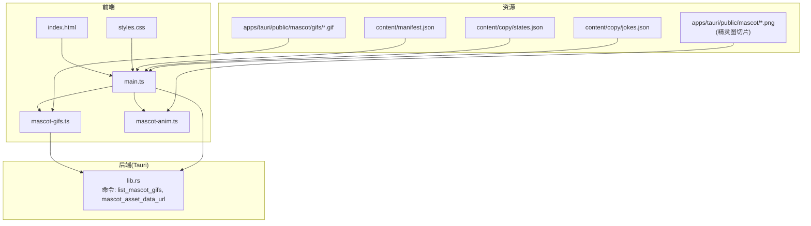
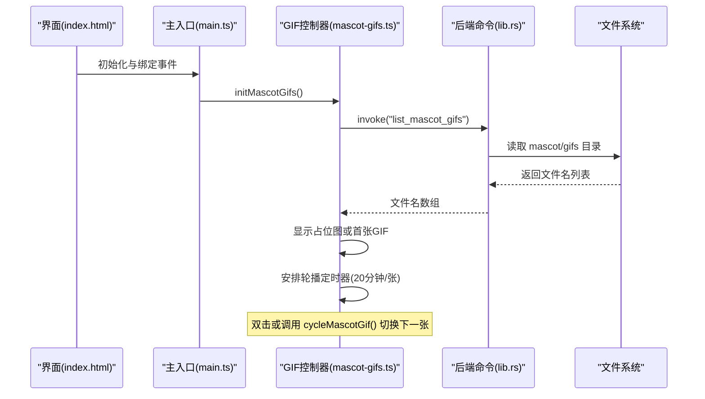
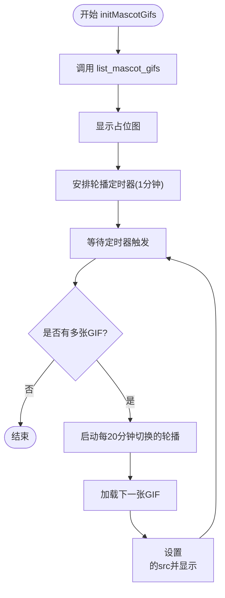
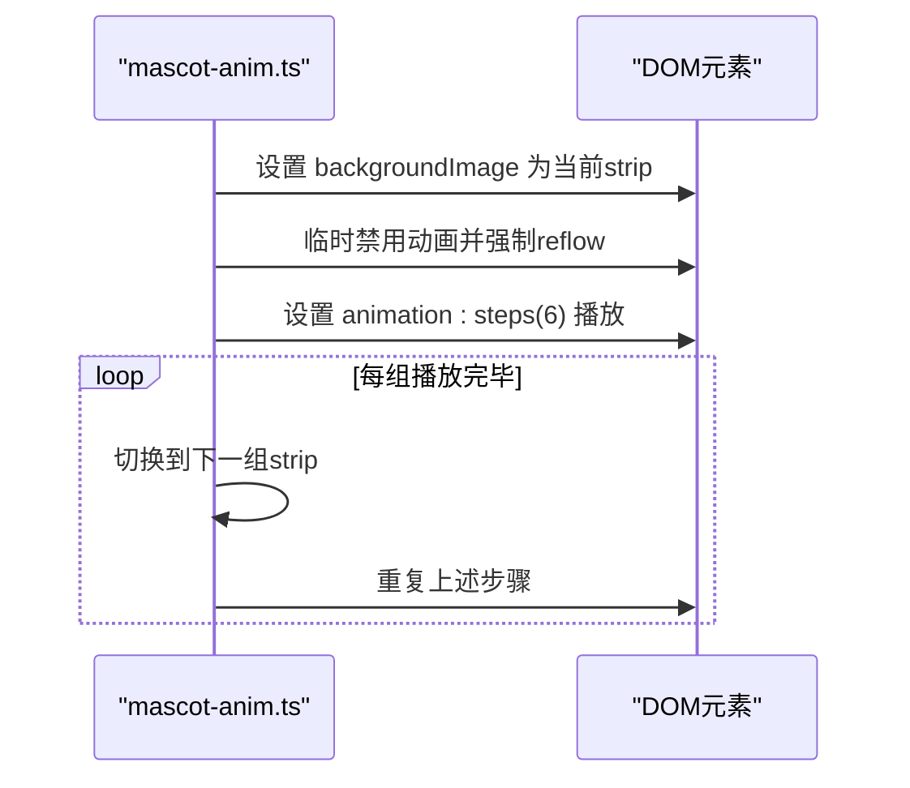
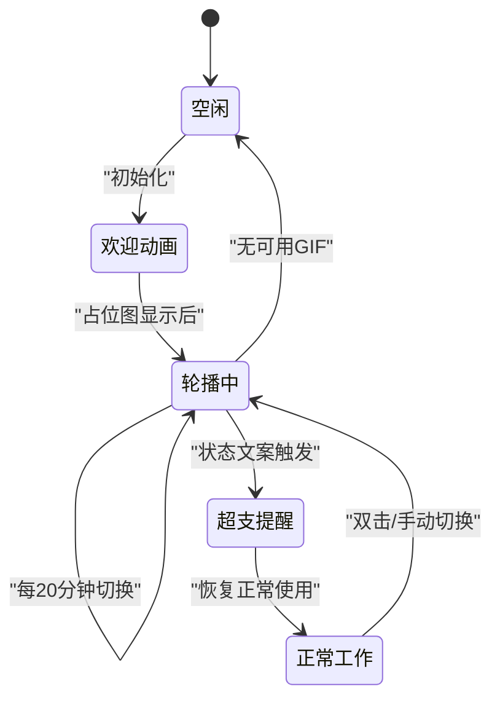
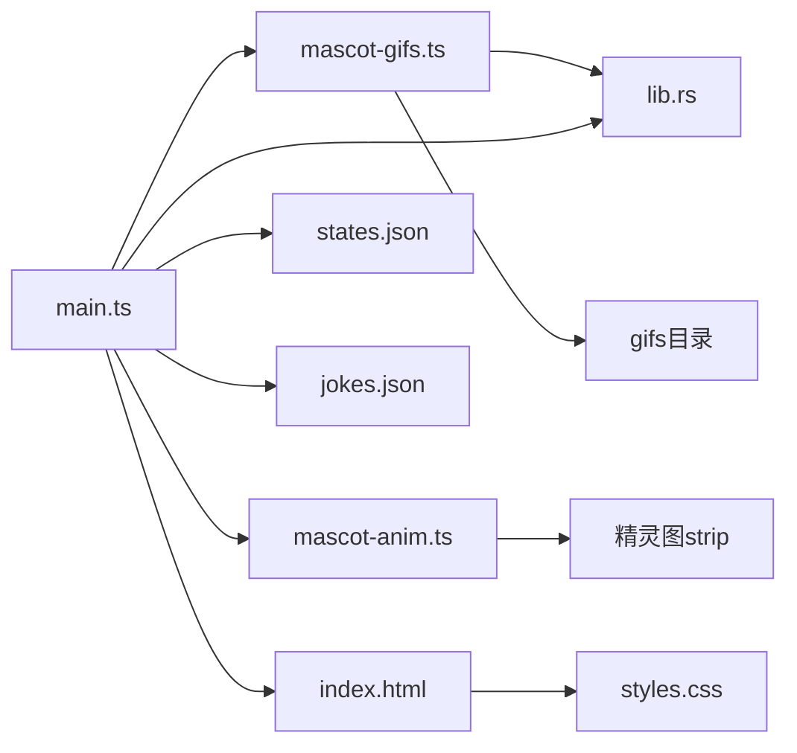

# 动物角色互动

<cite>
**本文引用的文件**
- [apps/tauri/src/mascot-anim.ts](file://apps/tauri/src/mascot-anim.ts)
- [apps/tauri/src/mascot-gifs.ts](file://apps/tauri/src/mascot-gifs.ts)
- [apps/tauri/src/main.ts](file://apps/tauri/src/main.ts)
- [apps/tauri/index.html](file://apps/tauri/index.html)
- [apps/tauri/src/styles.css](file://apps/tauri/src/styles.css)
- [apps/tauri/src-tauri/src/lib.rs](file://apps/tauri/src-tauri/src/lib.rs)
- [content/manifest.json](file://content/manifest.json)
- [content/copy/states.json](file://content/copy/states.json)
- [content/copy/jokes.json](file://content/copy/jokes.json)
- [scripts/slice-mascot-sprites.py](file://scripts/slice-mascot-sprites.py)
</cite>

## 目录
1. [简介](#简介)
2. [项目结构](#项目结构)
3. [核心组件](#核心组件)
4. [架构总览](#架构总览)
5. [组件详解](#组件详解)
6. [依赖关系分析](#依赖关系分析)
7. [性能考量](#性能考量)
8. [故障排查指南](#故障排查指南)
9. [结论](#结论)
10. [附录](#附录)

## 简介
本文件为“动物角色互动”系统的实现文档，聚焦于动物角色的动画系统架构与交互机制。内容涵盖：
- 动画系统：GIF资源管理、精灵图切片处理、动画播放控制
- 角色动画状态机：空闲状态、欢迎动画、超支提醒、正常工作等状态的动画序列
- 资源组织与加载：manifest.json 配置、资源缓存与内存管理
- 用户交互：点击、双击、悬停、键盘快捷键等
- 性能优化：帧率控制、资源预加载、内存释放
- 定制与扩展：新增动画、修改动画、主题切换
- 调试与测试：工具与方法

## 项目结构
该系统主要由前端渲染层、动画控制层、资源加载层与后端命令层构成。前端负责界面与交互，动画控制负责 GIF 与精灵图播放，资源加载通过 Tauri 命令访问本地资源目录，manifest.json 用于声明资源清单。

**图表来源**
- [apps/tauri/index.html:1-46](file://apps/tauri/index.html#L1-L46)
- [apps/tauri/src/styles.css:1-585](file://apps/tauri/src/styles.css#L1-L585)
- [apps/tauri/src/main.ts:1-711](file://apps/tauri/src/main.ts#L1-L711)
- [apps/tauri/src/mascot-gifs.ts:1-164](file://apps/tauri/src/mascot-gifs.ts#L1-L164)
- [apps/tauri/src/mascot-anim.ts:1-29](file://apps/tauri/src/mascot-anim.ts#L1-L29)
- [apps/tauri/src-tauri/src/lib.rs:31-120](file://apps/tauri/src-tauri/src/lib.rs#L31-L120)
- [content/manifest.json:1-12](file://content/manifest.json#L1-L12)
- [content/copy/states.json:1-14](file://content/copy/states.json#L1-L14)
- [content/copy/jokes.json:1-46](file://content/copy/jokes.json#L1-L46)
- [scripts/slice-mascot-sprites.py:1-54](file://scripts/slice-mascot-sprites.py#L1-L54)

**章节来源**
- [apps/tauri/index.html:1-46](file://apps/tauri/index.html#L1-L46)
- [apps/tauri/src/styles.css:1-585](file://apps/tauri/src/styles.css#L1-L585)
- [apps/tauri/src/main.ts:1-711](file://apps/tauri/src/main.ts#L1-L711)
- [apps/tauri/src/mascot-gifs.ts:1-164](file://apps/tauri/src/mascot-gifs.ts#L1-L164)
- [apps/tauri/src/mascot-anim.ts:1-29](file://apps/tauri/src/mascot-anim.ts#L1-L29)
- [apps/tauri/src-tauri/src/lib.rs:31-120](file://apps/tauri/src-tauri/src/lib.rs#L31-L120)
- [content/manifest.json:1-12](file://content/manifest.json#L1-L12)
- [content/copy/states.json:1-14](file://content/copy/states.json#L1-L14)
- [content/copy/jokes.json:1-46](file://content/copy/jokes.json#L1-L46)
- [scripts/slice-mascot-sprites.py:1-54](file://scripts/slice-mascot-sprites.py#L1-L54)

## 核心组件
- 动画控制（mascot-gifs.ts）：负责 GIF 列表枚举、占位图显示、按需加载、轮播调度与错误回退。
- 精灵动画（mascot-anim.ts）：基于精灵图切片的步进式动画播放，循环切换不同动作组。
- 主入口（main.ts）：绑定交互事件、初始化窗口与动画、监听后端事件、渲染面板数据。
- 资源命令（lib.rs）：提供列出 GIF、生成 data URL、解析 MIME 等能力。
- 资源清单（manifest.json）：声明内容目录中的静态资源，便于打包与校验。
- 状态文案（states.json）：定义不同使用阶段的提示文案，配合动画呈现。
- 界面模板（index.html）与样式（styles.css）：承载角色区域、笑话行、面板等 UI 结构与样式。

**章节来源**
- [apps/tauri/src/mascot-gifs.ts:1-164](file://apps/tauri/src/mascot-gifs.ts#L1-L164)
- [apps/tauri/src/mascot-anim.ts:1-29](file://apps/tauri/src/mascot-anim.ts#L1-L29)
- [apps/tauri/src/main.ts:562-711](file://apps/tauri/src/main.ts#L562-L711)
- [apps/tauri/src-tauri/src/lib.rs:31-120](file://apps/tauri/src-tauri/src/lib.rs#L31-L120)
- [content/manifest.json:1-12](file://content/manifest.json#L1-L12)
- [content/copy/states.json:1-14](file://content/copy/states.json#L1-L14)
- [apps/tauri/index.html:10-42](file://apps/tauri/index.html#L10-L42)
- [apps/tauri/src/styles.css:118-140](file://apps/tauri/src/styles.css#L118-L140)

## 架构总览
系统采用“前端控制 + 后端命令 + 资源清单”的分层架构：
- 前端通过 Tauri 命令访问本地资源目录，避免 asset:// 在某些环境的兼容性问题。
- GIF 资源以 data URL 形式注入到 ，确保跨平台一致性。
- 精灵图动画通过 CSS steps 步进播放，减少 JS 循环开销。
- 状态文案与面板数据驱动 UI 更新，交互事件触发刷新与轮播。

**图表来源**
- [apps/tauri/src/main.ts:695-711](file://apps/tauri/src/main.ts#L695-L711)
- [apps/tauri/src/mascot-gifs.ts:121-125](file://apps/tauri/src/mascot-gifs.ts#L121-L125)
- [apps/tauri/src-tauri/src/lib.rs:31-49](file://apps/tauri/src-tauri/src/lib.rs#L31-L49)

**章节来源**
- [apps/tauri/src/main.ts:695-711](file://apps/tauri/src/main.ts#L695-L711)
- [apps/tauri/src/mascot-gifs.ts:121-125](file://apps/tauri/src/mascot-gifs.ts#L121-L125)
- [apps/tauri/src-tauri/src/lib.rs:31-49](file://apps/tauri/src-tauri/src/lib.rs#L31-L49)

## 组件详解

### 动画系统：GIF 资源管理与轮播
- 资源枚举：通过命令列出 mascot/gifs 目录下的媒体文件，过滤隐藏与占位文件。
- 占位图显示：启动初期优先显示默认图片，随后进入轮播。
- 轮播策略：首次延迟 1 分钟，之后每 20 分钟切换一次；仅当存在多张 GIF 时启用自动轮播。
- 错误回退：data URL 获取失败或加载失败时回退到本地静态路径或占位图。
- 手动切换：双击角色区域或调用接口可立即切换到下一张。

**图表来源**
- [apps/tauri/src/mascot-gifs.ts:86-125](file://apps/tauri/src/mascot-gifs.ts#L86-L125)
- [apps/tauri/src/mascot-gifs.ts:101-111](file://apps/tauri/src/mascot-gifs.ts#L101-L111)
- [apps/tauri/src/mascot-gifs.ts:113-119](file://apps/tauri/src/mascot-gifs.ts#L113-L119)

**章节来源**
- [apps/tauri/src/mascot-gifs.ts:1-164](file://apps/tauri/src/mascot-gifs.ts#L1-L164)
- [apps/tauri/src-tauri/src/lib.rs:31-49](file://apps/tauri/src-tauri/src/lib.rs#L31-L49)

### 动画系统：精灵图切片与步进播放
- 精灵图来源：通过脚本将 3 行×6 列的原始图切分为 6 帧/组，生成 action-0/1/2-strip.png。
- 播放控制：固定帧时长与总时长，通过 CSS steps 实现步进播放；每组播放完毕后循环切换下一组。
- DOM 更新：动态设置背景图与动画属性，避免重绘闪烁。

**图表来源**
- [apps/tauri/src/mascot-anim.ts:12-28](file://apps/tauri/src/mascot-anim.ts#L12-L28)
- [scripts/slice-mascot-sprites.py:30-47](file://scripts/slice-mascot-sprites.py#L30-L47)

**章节来源**
- [apps/tauri/src/mascot-anim.ts:1-29](file://apps/tauri/src/mascot-anim.ts#L1-L29)
- [scripts/slice-mascot-sprites.py:1-54](file://scripts/slice-mascot-sprites.py#L1-L54)

### 角色动画状态机设计
- 空闲状态：显示占位图或默认静态图，等待用户交互。
- 欢迎动画：应用启动后短暂展示占位图，随后进入轮播。
- 超支提醒：结合状态文案（来自 states.json）与进度条颜色变化，提示额度紧张或周期超支。
- 正常工作：根据使用情况动态更新面板与角色动画，保持轻量化反馈。

**图表来源**
- [content/copy/states.json:1-14](file://content/copy/states.json#L1-L14)
- [apps/tauri/src/main.ts:430-461](file://apps/tauri/src/main.ts#L430-L461)

**章节来源**
- [content/copy/states.json:1-14](file://content/copy/states.json#L1-L14)
- [apps/tauri/src/main.ts:430-461](file://apps/tauri/src/main.ts#L430-L461)

### 资源组织与加载机制
- manifest.json：声明复制文案与 mascot 资源，便于打包与校验。
- 占位图与默认图：优先使用后端生成的 data URL，开发环境下回退到静态路径。
- MIME 解析：根据扩展名选择正确的 MIME 类型，保证 data URL 正确性。
- 内容更新：监听“内容更新”事件后重载 GIF 列表并恢复轮播。

**章节来源**
- [content/manifest.json:1-12](file://content/manifest.json#L1-L12)
- [apps/tauri/src-tauri/src/lib.rs:89-120](file://apps/tauri/src-tauri/src/lib.rs#L89-L120)
- [apps/tauri/src/mascot-gifs.ts:127-143](file://apps/tauri/src/mascot-gifs.ts#L127-L143)

### 用户交互触发机制
- 点击与双击：角色区域支持双击切换 GIF、单击展开/收起面板；面板头部与提示区支持三击进入调试模式。
- 拖拽：长按或拖动胶囊触发拖拽，避免误触。
- 键盘快捷键：三击提示区进入调试模式，调试模式内可调整滑杆模拟不同场景。

**章节来源**
- [apps/tauri/src/main.ts:562-672](file://apps/tauri/src/main.ts#L562-L672)
- [apps/tauri/src/debug-ui.ts:187-221](file://apps/tauri/src/debug-ui.ts#L187-L221)

## 依赖关系分析
- 前端依赖后端命令：mascot-gifs.ts 与 main.ts 通过 invoke 调用后端命令。
- 资源依赖清单：manifest.json 与 states.json/jokes.json 提供文案与状态数据。
- 样式依赖：styles.css 控制角色区域、面板与动画容器的布局与视觉效果。

**图表来源**
- [apps/tauri/src/main.ts:1-35](file://apps/tauri/src/main.ts#L1-L35)
- [apps/tauri/src/mascot-gifs.ts:1-10](file://apps/tauri/src/mascot-gifs.ts#L1-L10)
- [apps/tauri/src-tauri/src/lib.rs:31-120](file://apps/tauri/src-tauri/src/lib.rs#L31-L120)
- [apps/tauri/index.html:10-42](file://apps/tauri/index.html#L10-L42)
- [apps/tauri/src/styles.css:118-140](file://apps/tauri/src/styles.css#L118-L140)

**章节来源**
- [apps/tauri/src/main.ts:1-35](file://apps/tauri/src/main.ts#L1-L35)
- [apps/tauri/src/mascot-gifs.ts:1-10](file://apps/tauri/src/mascot-gifs.ts#L1-L10)
- [apps/tauri/src-tauri/src/lib.rs:31-120](file://apps/tauri/src-tauri/src/lib.rs#L31-L120)
- [apps/tauri/index.html:10-42](file://apps/tauri/index.html#L10-L42)
- [apps/tauri/src/styles.css:118-140](file://apps/tauri/src/styles.css#L118-L140)

## 性能考量
- 帧率控制：精灵图使用 CSS steps 固定帧时长，避免 JS 循环导致的抖动。
- 资源预加载：启动后延迟轮播（1 分钟），降低首屏压力；轮播间隔较长（20 分钟/张），减少频繁切换。
- 内存管理：GIF 加载失败时回退到占位图，避免长时间占用内存；轮播停止时清理定时器。
- 样式优化：全局禁用动画与过渡，避免 WebView 重绘白边；使用 contain: paint 减少重绘范围。

**章节来源**
- [apps/tauri/src/mascot-anim.ts:8-10](file://apps/tauri/src/mascot-anim.ts#L8-L10)
- [apps/tauri/src/mascot-gifs.ts:5-7](file://apps/tauri/src/mascot-gifs.ts#L5-L7)
- [apps/tauri/src/styles.css:18-24](file://apps/tauri/src/styles.css#L18-L24)
- [apps/tauri/src/styles.css:103-104](file://apps/tauri/src/styles.css#L103-L104)

## 故障排查指南
- GIF 无法显示：
  - 检查 mascot/gifs 目录是否存在有效文件，确认后端命令返回的文件名列表非空。
  - 开发环境下确认 data URL 回退到静态路径是否生效。
- 占位图不显示：
  - 确认后端命令“占位图路径”可用；若失败则检查静态资源路径。
- 轮播不启动：
  - 确认存在多张 GIF；检查定时器是否被清理；查看内容更新事件是否正确触发。
- 动画卡顿：
  - 检查是否启用了全局动画/过渡；确认 CSS steps 的帧时长设置合理。

**章节来源**
- [apps/tauri/src/mascot-gifs.ts:51-59](file://apps/tauri/src/mascot-gifs.ts#L51-L59)
- [apps/tauri/src/mascot-gifs.ts:101-111](file://apps/tauri/src/mascot-gifs.ts#L101-L111)
- [apps/tauri/src-tauri/src/lib.rs:52-59](file://apps/tauri/src-tauri/src/lib.rs#L52-L59)
- [apps/tauri/src/styles.css:18-24](file://apps/tauri/src/styles.css#L18-L24)

## 结论
该系统通过清晰的分层架构与稳健的资源加载机制，实现了跨平台一致的动物角色动画体验。GIF 与精灵图两种播放路径覆盖不同场景，结合状态文案与交互事件，形成完整的角色互动闭环。通过合理的性能策略与故障排查手段，可在多种运行环境中稳定提供动画服务。

## 附录

### 动画定制与扩展方法
- 新增 GIF：将新的媒体文件放入 mascot/gifs 目录，系统会自动枚举并在轮播中出现。
- 修改精灵图：使用切片脚本生成新的 strip 文件，替换旧的 action-*.png。
- 主题切换：通过样式变量与类名切换，适配不同主题的配色方案。

**章节来源**
- [apps/tauri/src-tauri/src/lib.rs:31-49](file://apps/tauri/src-tauri/src/lib.rs#L31-L49)
- [scripts/slice-mascot-sprites.py:30-47](file://scripts/slice-mascot-sprites.py#L30-L47)
- [apps/tauri/src/styles.css:1-16](file://apps/tauri/src/styles.css#L1-L16)

### 调试与测试工具
- 调试模式：三击提示区进入调试模式，可调整滑杆模拟不同使用场景。
- 事件监听：监听“内容更新”“窗口显示”等事件，验证资源重载与界面稳定性。
- 日志辅助：后端记录资产协议作用域与启动信息，便于定位问题。

**章节来源**
- [apps/tauri/src/debug-ui.ts:187-221](file://apps/tauri/src/debug-ui.ts#L187-L221)
- [apps/tauri/src/main.ts:701-710](file://apps/tauri/src/main.ts#L701-L710)
- [apps/tauri/src-tauri/src/lib.rs:737-757](file://apps/tauri/src-tauri/src/lib.rs#L737-L757)