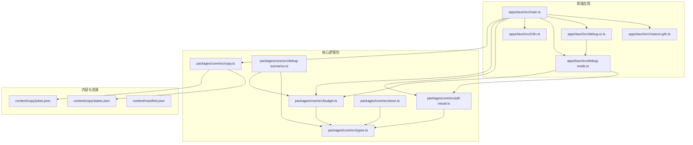
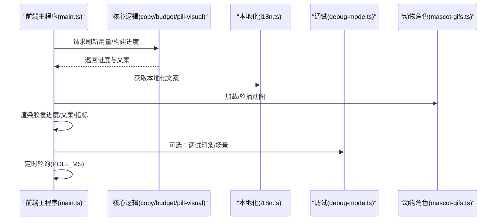
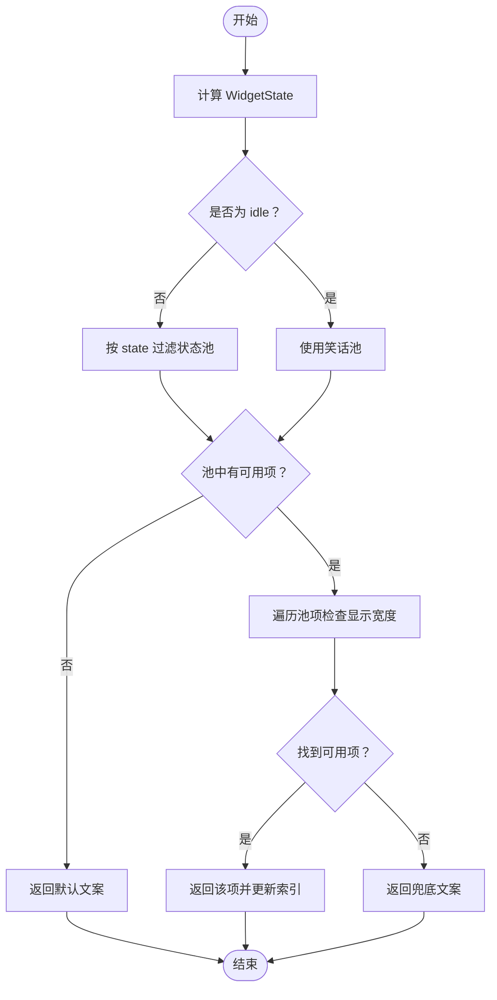
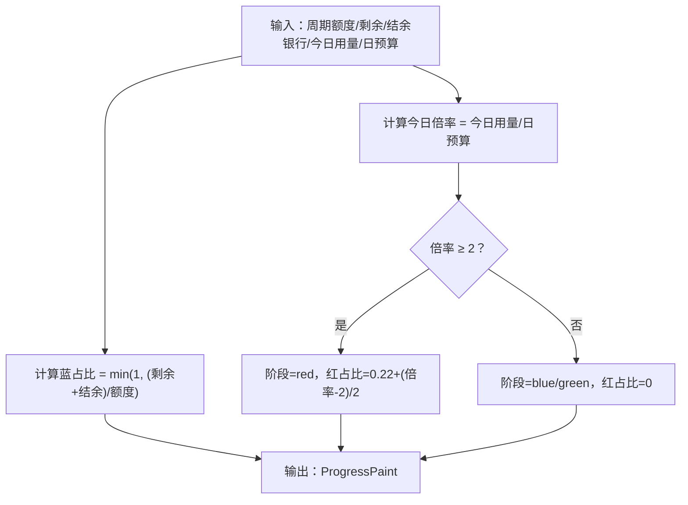
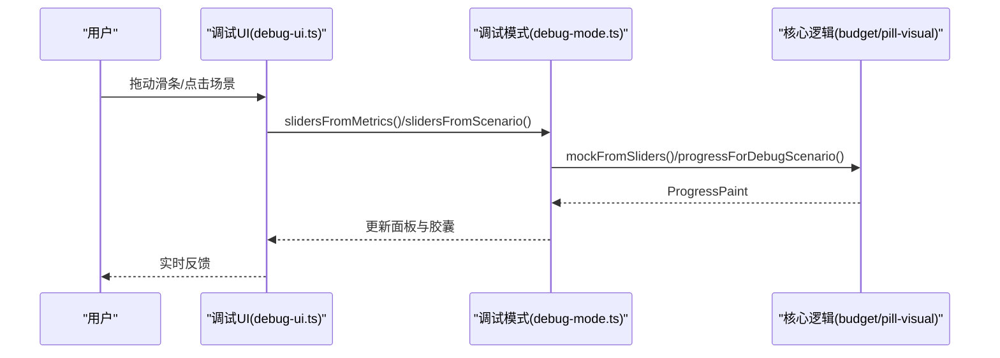
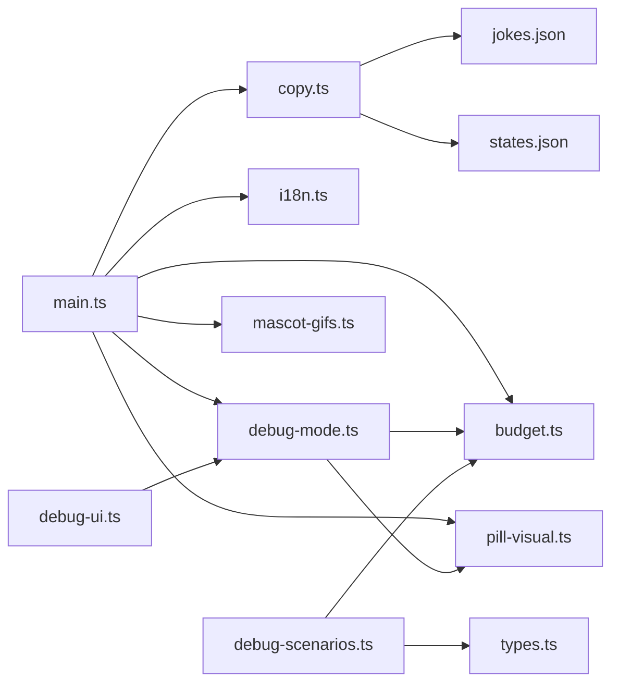

# 文案轮播系统

<cite>
**本文引用的文件列表**
- [jokes.json](file://content/copy/jokes.json)
- [states.json](file://content/copy/states.json)
- [copy.ts](file://packages/core/src/copy.ts)
- [budget.ts](file://packages/core/src/budget.ts)
- [types.ts](file://packages/core/src/types.ts)
- [pill-visual.ts](file://packages/core/src/pill-visual.ts)
- [i18n.ts](file://apps/tauri/src/i18n.ts)
- [main.ts](file://apps/tauri/src/main.ts)
- [debug-mode.ts](file://apps/tauri/src/debug-mode.ts)
- [debug-ui.ts](file://apps/tauri/src/debug-ui.ts)
- [mascot-gifs.ts](file://apps/tauri/src/mascot-gifs.ts)
- [manifest.json](file://content/manifest.json)
- [store.ts](file://packages/core/src/store.ts)
- [debug-scenarios.ts](file://packages/core/src/debug-scenarios.ts)
</cite>

## 目录
1. [简介](#简介)
2. [项目结构](#项目结构)
3. [核心组件](#核心组件)
4. [架构总览](#架构总览)
5. [详细组件分析](#详细组件分析)
6. [依赖关系分析](#依赖关系分析)
7. [性能考量](#性能考量)
8. [故障排查指南](#故障排查指南)
9. [结论](#结论)
10. [附录](#附录)

## 简介
本系统是一个“文案轮播”组件，结合 Cursor 订阅用量数据，动态选择合适的文案（幽默段子、状态描述、提示信息等），并通过胶囊式进度条直观展示当前用量状态。系统支持：
- 智能内容选择：基于用量状态、预算剩余比例、超支情况自动挑选文案
- 多类型内容池：幽默段子、状态描述、警告信息、鼓励话语等
- 触发与切换：定时轮播、状态变化触发、用户交互响应
- 多语言本地化：中英文文案与日期格式化
- 内容更新与自定义：通过 JSON 文件维护内容池，支持热更新
- 调试模式：可视化滑条与典型场景预设，便于测试与验证

## 项目结构
系统采用“前端应用 + 核心逻辑包”的分层设计：
- apps/tauri：Tauri 前端应用，负责 UI 渲染、交互、事件监听、本地化与调试工具
- packages/core：核心逻辑包，负责预算计算、进度构建、文案选择、状态管理与调试场景
- content/assets：静态资源与内容池（JSON 文件）

图表来源
- [main.ts:1-711](file://apps/tauri/src/main.ts#L1-L711)
- [copy.ts:1-77](file://packages/core/src/copy.ts#L1-L77)
- [budget.ts:1-274](file://packages/core/src/budget.ts#L1-L274)
- [pill-visual.ts:1-79](file://packages/core/src/pill-visual.ts#L1-L79)
- [i18n.ts:1-89](file://apps/tauri/src/i18n.ts#L1-L89)
- [debug-mode.ts:1-190](file://apps/tauri/src/debug-mode.ts#L1-L190)
- [debug-ui.ts:1-221](file://apps/tauri/src/debug-ui.ts#L1-L221)
- [mascot-gifs.ts:1-164](file://apps/tauri/src/mascot-gifs.ts#L1-L164)
- [jokes.json:1-46](file://content/copy/jokes.json#L1-L46)
- [states.json:1-14](file://content/copy/states.json#L1-L14)
- [manifest.json:1-12](file://content/manifest.json#L1-L12)

章节来源
- [main.ts:1-711](file://apps/tauri/src/main.ts#L1-L711)
- [copy.ts:1-77](file://packages/core/src/copy.ts#L1-L77)
- [budget.ts:1-274](file://packages/core/src/budget.ts#L1-L274)
- [pill-visual.ts:1-79](file://packages/core/src/pill-visual.ts#L1-L79)
- [i18n.ts:1-89](file://apps/tauri/src/i18n.ts#L1-L89)
- [debug-mode.ts:1-190](file://apps/tauri/src/debug-mode.ts#L1-L190)
- [debug-ui.ts:1-221](file://apps/tauri/src/debug-ui.ts#L1-L221)
- [mascot-gifs.ts:1-164](file://apps/tauri/src/mascot-gifs.ts#L1-L164)
- [jokes.json:1-46](file://content/copy/jokes.json#L1-L46)
- [states.json:1-14](file://content/copy/states.json#L1-L14)
- [manifest.json:1-12](file://content/manifest.json#L1-L12)

## 核心组件
- 文案选择器：根据当前用量状态选择合适文案，确保显示宽度合规
- 预算与进度：计算日预算、剩余天数、周期节奏压力，构建胶囊进度
- 本地化：中英文文案与日期格式化
- 调试工具：滑条与典型场景，便于测试不同状态
- 动物角色：静态占位与动图轮播，支持内容更新后的热替换

章节来源
- [copy.ts:32-77](file://packages/core/src/copy.ts#L32-L77)
- [budget.ts:243-274](file://packages/core/src/budget.ts#L243-L274)
- [pill-visual.ts:29-79](file://packages/core/src/pill-visual.ts#L29-L79)
- [i18n.ts:1-89](file://apps/tauri/src/i18n.ts#L1-L89)
- [debug-mode.ts:1-190](file://apps/tauri/src/debug-mode.ts#L1-L190)
- [mascot-gifs.ts:1-164](file://apps/tauri/src/mascot-gifs.ts#L1-L164)

## 架构总览
系统以“前端渲染 + 核心算法”为核心，通过 Tauri 事件与 RPC 与后端通信，周期性刷新用量并渲染 UI。

图表来源
- [main.ts:526-560](file://apps/tauri/src/main.ts#L526-L560)
- [copy.ts:40-77](file://packages/core/src/copy.ts#L40-L77)
- [budget.ts:243-274](file://packages/core/src/budget.ts#L243-L274)
- [pill-visual.ts:29-79](file://packages/core/src/pill-visual.ts#L29-L79)
- [i18n.ts:1-89](file://apps/tauri/src/i18n.ts#L1-L89)
- [debug-mode.ts:94-100](file://apps/tauri/src/debug-mode.ts#L94-L100)
- [mascot-gifs.ts:121-164](file://apps/tauri/src/mascot-gifs.ts#L121-L164)

## 详细组件分析

### 文案选择与内容池
- 内容池结构
  - 幽默段子：包含 line1、line2、tag 字段
  - 状态描述：包含 line1、line2、state 字段
- 选择策略
  - 根据当前 WidgetState 选择对应池
  - 若池为空，返回默认文案
  - 逐项校验显示宽度，确保 UI 适配
- 显示宽度规则
  - 中文/特殊字符按 1 宽度计，其他字符按 0.5 计，emoji 按 1 计
  - 单行最大宽度限制为 10

图表来源
- [copy.ts:32-77](file://packages/core/src/copy.ts#L32-L77)

章节来源
- [copy.ts:1-77](file://packages/core/src/copy.ts#L1-L77)
- [jokes.json:1-46](file://content/copy/jokes.json#L1-L46)
- [states.json:1-14](file://content/copy/states.json#L1-L14)

### 预算与进度计算
- 关键指标
  - 日预算：剩余额度按剩余天数均分
  - 周期节奏压力：剩余额度按剩余天数摊的日预算与公平日预算的对比
  - 今日用量占比：今日用量与日预算的倍数
- 胶囊配色
  - 蓝色占比：(剩余 + 结余银行) / 额度
  - 红色占比：当今日用量 ≥ 2 × 日预算 时启用
  - 阶段：蓝 > 0.02 → blue，否则 green；若红 > 0.02 → red

图表来源
- [pill-visual.ts:29-79](file://packages/core/src/pill-visual.ts#L29-L79)
- [budget.ts:243-274](file://packages/core/src/budget.ts#L243-L274)

章节来源
- [budget.ts:1-274](file://packages/core/src/budget.ts#L1-L274)
- [pill-visual.ts:1-79](file://packages/core/src/pill-visual.ts#L1-L79)
- [types.ts:112-124](file://packages/core/src/types.ts#L112-L124)

### 本地化与界面
- 本地化键值：包含用量、周期、令牌、占比、今日、超额、节奏、剩余天数、日预算、数据来源、调试提示、典型状态、点击切换文案、双击展开等
- 日期格式：根据语言环境格式化周期范围
- UI 组件：胶囊进度条、指标面板、分类使用明细、动物角色

章节来源
- [i18n.ts:1-89](file://apps/tauri/src/i18n.ts#L1-L89)
- [main.ts:216-278](file://apps/tauri/src/main.ts#L216-L278)

### 调试模式与典型场景
- 调试滑条：可调节周期已用百分比、今日用量占比、剩余天数紧迫度
- 典型场景：假期、下班、超支
- 工具函数：从滑条生成进度、从指标反推滑条、场景到滑条映射

图表来源
- [debug-ui.ts:111-185](file://apps/tauri/src/debug-ui.ts#L111-L185)
- [debug-mode.ts:98-138](file://apps/tauri/src/debug-mode.ts#L98-L138)
- [debug-scenarios.ts:77-86](file://packages/core/src/debug-scenarios.ts#L77-L86)

章节来源
- [debug-mode.ts:1-190](file://apps/tauri/src/debug-mode.ts#L1-L190)
- [debug-ui.ts:1-221](file://apps/tauri/src/debug-ui.ts#L1-L221)
- [debug-scenarios.ts:1-89](file://packages/core/src/debug-scenarios.ts#L1-L89)

### 动物角色与内容更新
- 初始化：启动后先显示占位图，1 分钟后开始轮播
- 轮播：每张动图停留 20 分钟，自动循环
- 更新：内容更新事件触发后重载 GIF 列表并恢复轮播

章节来源
- [mascot-gifs.ts:1-164](file://apps/tauri/src/mascot-gifs.ts#L1-L164)
- [main.ts:701-703](file://apps/tauri/src/main.ts#L701-L703)

## 依赖关系分析
- 前端依赖核心逻辑包：copy、budget、pill-visual、types
- 调试模块依赖核心预算与进度计算
- UI 依赖本地化与动物角色模块
- 内容池通过 JSON 文件维护，前端通过事件监听实现热更新

图表来源
- [main.ts:1-711](file://apps/tauri/src/main.ts#L1-L711)
- [copy.ts:1-77](file://packages/core/src/copy.ts#L1-L77)
- [budget.ts:1-274](file://packages/core/src/budget.ts#L1-L274)
- [pill-visual.ts:1-79](file://packages/core/src/pill-visual.ts#L1-L79)
- [i18n.ts:1-89](file://apps/tauri/src/i18n.ts#L1-L89)
- [debug-mode.ts:1-190](file://apps/tauri/src/debug-mode.ts#L1-L190)
- [debug-ui.ts:1-221](file://apps/tauri/src/debug-ui.ts#L1-L221)
- [debug-scenarios.ts:1-89](file://packages/core/src/debug-scenarios.ts#L1-L89)
- [jokes.json:1-46](file://content/copy/jokes.json#L1-L46)
- [states.json:1-14](file://content/copy/states.json#L1-L14)

章节来源
- [main.ts:1-711](file://apps/tauri/src/main.ts#L1-L711)
- [copy.ts:1-77](file://packages/core/src/copy.ts#L1-L77)
- [budget.ts:1-274](file://packages/core/src/budget.ts#L1-L274)
- [pill-visual.ts:1-79](file://packages/core/src/pill-visual.ts#L1-L79)
- [i18n.ts:1-89](file://apps/tauri/src/i18n.ts#L1-L89)
- [debug-mode.ts:1-190](file://apps/tauri/src/debug-mode.ts#L1-L190)
- [debug-ui.ts:1-221](file://apps/tauri/src/debug-ui.ts#L1-L221)
- [debug-scenarios.ts:1-89](file://packages/core/src/debug-scenarios.ts#L1-L89)
- [jokes.json:1-46](file://content/copy/jokes.json#L1-L46)
- [states.json:1-14](file://content/copy/states.json#L1-L14)

## 性能考量
- 文案选择：线性扫描池并进行显示宽度校验，时间复杂度 O(n)，n 为池大小
- 进度计算：纯数学运算，常数级复杂度
- UI 渲染：使用最小必要 DOM 更新，避免频繁重排
- 轮播：延迟启动与间隔控制，降低资源占用
- 本地化：键值查找 O(1)，字符串拼接与格式化成本低

## 故障排查指南
- 登录状态问题：当后端返回未登录错误时，前端显示提示文案并停止刷新
- 刷新失败：捕获异常并显示简短错误摘要
- 调试模式：三击提示区域进入调试，使用滑条与场景按钮快速定位问题
- 内容更新：收到内容更新事件后自动重载动物角色动图，保持轮播连续性
- 状态持久化：应用状态保存在本地 JSON 文件，重启后恢复上次状态

章节来源
- [main.ts:526-560](file://apps/tauri/src/main.ts#L526-L560)
- [main.ts:653-671](file://apps/tauri/src/main.ts#L653-L671)
- [main.ts:701-703](file://apps/tauri/src/main.ts#L701-L703)
- [store.ts:10-54](file://packages/core/src/store.ts#L10-L54)

## 结论
该文案轮播系统通过清晰的职责分离与模块化设计，实现了从预算计算到文案选择再到 UI 渲染的完整闭环。其智能内容选择机制与多语言支持提升了用户体验，调试工具与热更新能力则保障了开发与维护效率。建议在后续迭代中进一步扩展内容池类型与标签体系，增强个性化与可配置性。

## 附录

### 内容分类与字段说明
- 幽默段子（jokes.json）
  - 字段：line1、line2、tag
  - 示例：tag 包含 dry、meme、kao、poetry 等
- 状态描述（states.json）
  - 字段：line1、line2、state
  - 示例：state 包含 surplus_vibe、warn80、done_today、over_cycle 等

章节来源
- [jokes.json:1-46](file://content/copy/jokes.json#L1-L46)
- [states.json:1-14](file://content/copy/states.json#L1-L14)

### 触发条件与切换逻辑
- 定时轮播：每 30 分钟自动刷新
- 状态变化：用量状态改变时重新选择文案
- 用户交互：点击文案切换、双击胶囊展开详情、三击进入调试模式、双击动物角色切换动图

章节来源
- [main.ts:43-44](file://apps/tauri/src/main.ts#L43-L44)
- [main.ts:638-648](file://apps/tauri/src/main.ts#L638-L648)
- [main.ts:625-631](file://apps/tauri/src/main.ts#L625-L631)
- [main.ts:653-671](file://apps/tauri/src/main.ts#L653-L671)

### 内容更新与自定义
- 更新方式：通过 content/copy 下的 JSON 文件维护内容池
- 热更新：前端监听内容更新事件，自动重载动物角色动图
- manifest：声明内容清单，便于打包与部署

章节来源
- [manifest.json:1-12](file://content/manifest.json#L1-L12)
- [main.ts:701-703](file://apps/tauri/src/main.ts#L701-L703)
- [mascot-gifs.ts:127-143](file://apps/tauri/src/mascot-gifs.ts#L127-L143)

### 调试模式下的测试与验证
- 滑条：实时调整周期已用、今日用量、剩余天数
- 场景：一键切换典型状态（假期、下班、超支）
- 输出：同步更新面板指标与胶囊颜色

章节来源
- [debug-mode.ts:98-138](file://apps/tauri/src/debug-mode.ts#L98-L138)
- [debug-ui.ts:111-185](file://apps/tauri/src/debug-ui.ts#L111-L185)
- [debug-scenarios.ts:55-86](file://packages/core/src/debug-scenarios.ts#L55-L86)