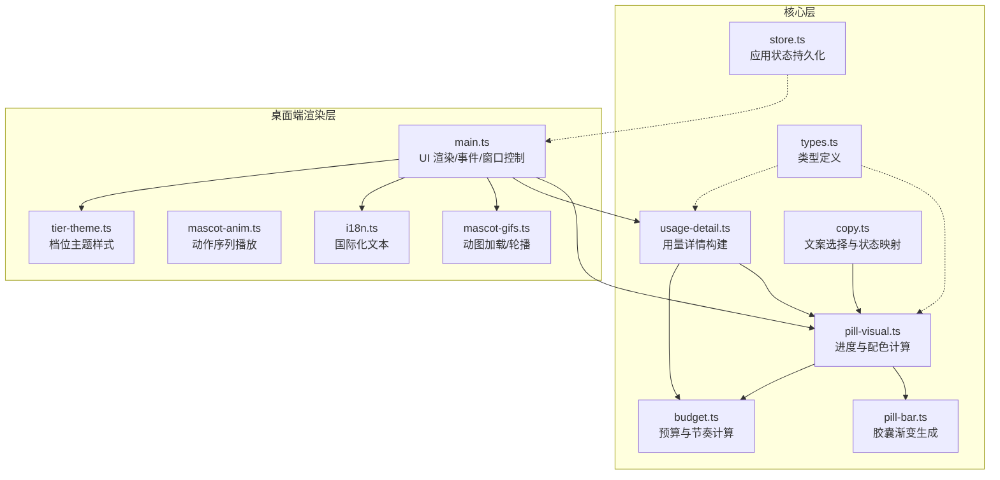
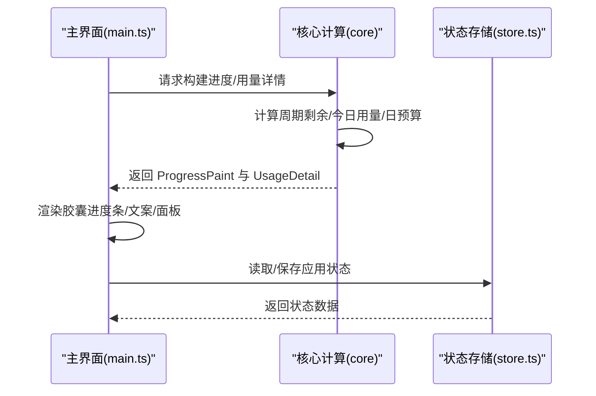
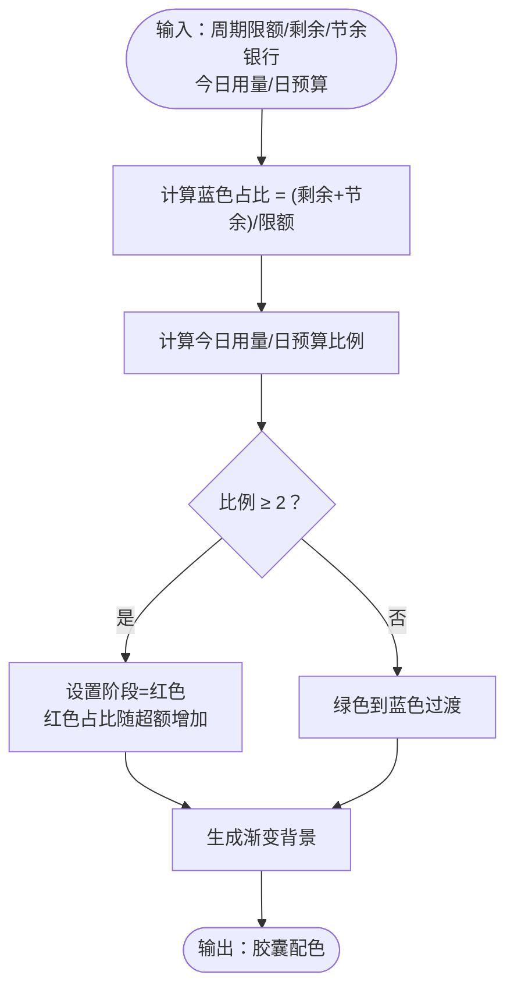
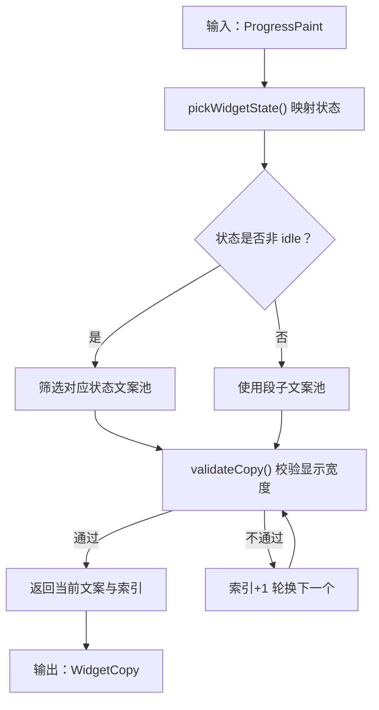
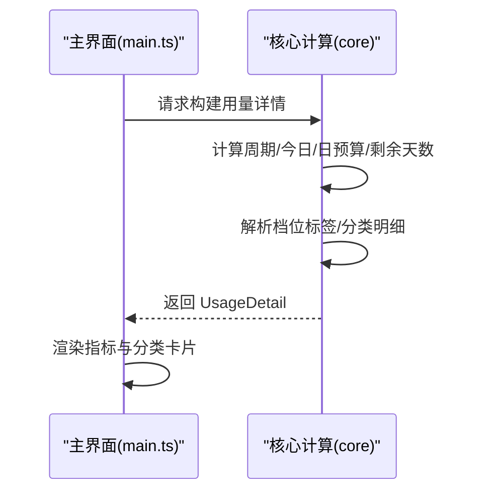
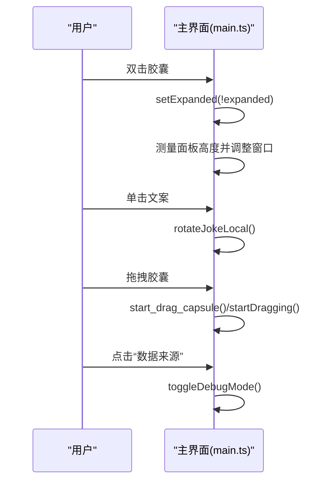
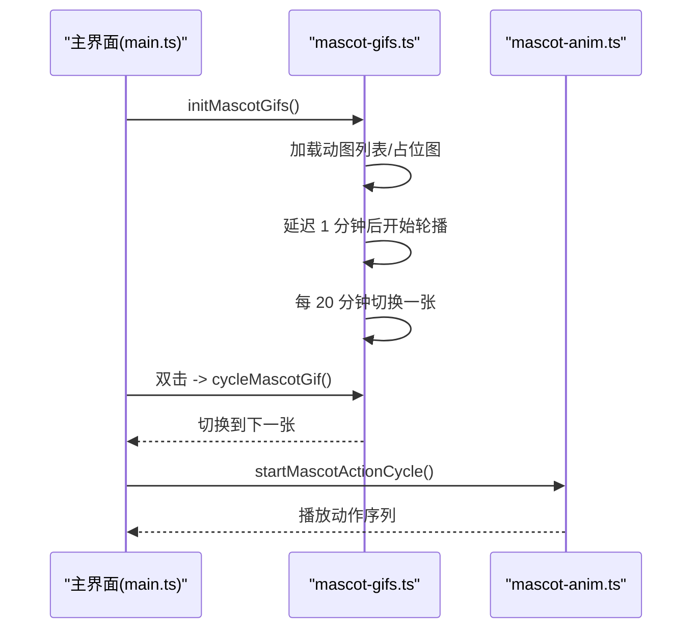
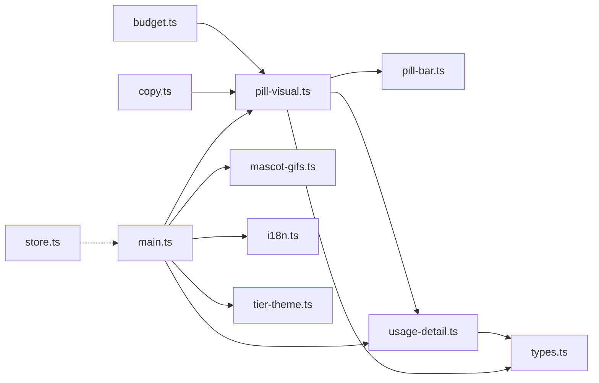

# 核心功能

<cite>
**本文引用的文件**
- [pill-visual.ts](file://packages/core/src/pill-visual.ts)
- [pill-bar.ts](file://packages/core/src/pill-bar.ts)
- [budget.ts](file://packages/core/src/budget.ts)
- [usage-detail.ts](file://packages/core/src/usage-detail.ts)
- [copy.ts](file://packages/core/src/copy.ts)
- [types.ts](file://packages/core/src/types.ts)
- [main.ts](file://apps/tauri/src/main.ts)
- [mascot-gifs.ts](file://apps/tauri/src/mascot-gifs.ts)
- [mascot-anim.ts](file://apps/tauri/src/mascot-anim.ts)
- [i18n.ts](file://apps/tauri/src/i18n.ts)
- [tier-theme.ts](file://apps/tauri/src/tier-theme.ts)
- [store.ts](file://packages/core/src/store.ts)
- [jokes.json](file://content/copy/jokes.json)
- [states.json](file://content/copy/states.json)
</cite>

## 目录
1. [简介](#简介)
2. [项目结构](#项目结构)
3. [核心组件](#核心组件)
4. [架构总览](#架构总览)
5. [详细组件分析](#详细组件分析)
6. [依赖关系分析](#依赖关系分析)
7. [性能考量](#性能考量)
8. [故障排查指南](#故障排查指南)
9. [结论](#结论)
10. [附录](#附录)

## 简介
本文件面向 CursorQ 的核心功能模块，围绕以下主题提供系统化说明：
- 胶囊进度条的工作原理与视觉含义（绿色/蓝色表示周期余量，红色警示条表示超支）
- 单行文案轮播系统（根据用量状态智能选择与展示段子与提示信息）
- 用量详情面板（计费周期、今日/周期用量、日预算、剩余天数等关键指标）
- 系统托盘集成（窗口交互、展开/收起、拖拽、刷新等）
- 动物角色互动系统（动态 GIF 轮播、点击/双击行为）
- 使用示例与操作指南

## 项目结构
CursorQ 采用前端渲染 + 核心计算分离的架构：
- 核心逻辑位于 packages/core，负责进度计算、文案选择、用量聚合与预算推导
- 桌面端渲染位于 apps/tauri，负责 UI 渲染、事件绑定、系统托盘交互、动图播放与国际化

图表来源
- [pill-visual.ts:1-79](file://packages/core/src/pill-visual.ts#L1-L79)
- [pill-bar.ts:1-23](file://packages/core/src/pill-bar.ts#L1-L23)
- [budget.ts:1-274](file://packages/core/src/budget.ts#L1-L274)
- [usage-detail.ts:1-185](file://packages/core/src/usage-detail.ts#L1-L185)
- [copy.ts:1-77](file://packages/core/src/copy.ts#L1-L77)
- [main.ts:1-711](file://apps/tauri/src/main.ts#L1-L711)
- [mascot-gifs.ts:1-164](file://apps/tauri/src/mascot-gifs.ts#L1-L164)
- [mascot-anim.ts:1-29](file://apps/tauri/src/mascot-anim.ts#L1-L29)
- [i18n.ts:1-89](file://apps/tauri/src/i18n.ts#L1-L89)
- [tier-theme.ts:1-14](file://apps/tauri/src/tier-theme.ts#L1-L14)
- [store.ts:1-55](file://packages/core/src/store.ts#L1-L55)
- [types.ts:1-140](file://packages/core/src/types.ts#L1-L140)

章节来源
- [main.ts:1-711](file://apps/tauri/src/main.ts#L1-L711)
- [pill-visual.ts:1-79](file://packages/core/src/pill-visual.ts#L1-L79)
- [pill-bar.ts:1-23](file://packages/core/src/pill-bar.ts#L1-L23)
- [budget.ts:1-274](file://packages/core/src/budget.ts#L1-L274)
- [usage-detail.ts:1-185](file://packages/core/src/usage-detail.ts#L1-L185)
- [copy.ts:1-77](file://packages/core/src/copy.ts#L1-L77)
- [mascot-gifs.ts:1-164](file://apps/tauri/src/mascot-gifs.ts#L1-L164)
- [mascot-anim.ts:1-29](file://apps/tauri/src/mascot-anim.ts#L1-L29)
- [i18n.ts:1-89](file://apps/tauri/src/i18n.ts#L1-L89)
- [tier-theme.ts:1-14](file://apps/tauri/src/tier-theme.ts#L1-L14)
- [store.ts:1-55](file://packages/core/src/store.ts#L1-L55)
- [types.ts:1-140](file://packages/core/src/types.ts#L1-L140)

## 核心组件
- 胶囊进度条与配色：基于周期剩余、节余银行、今日用量与日预算，生成蓝色/绿色/红色渐变，并通过 UI 展示
- 文案轮播系统：根据当前状态（节余、预警、今日完成、周期偏紧）智能挑选文案，保证显示宽度适配
- 用量详情面板：展示计费周期、今日/周期用量、日预算、剩余天数、档位与分类明细
- 系统托盘交互：支持胶囊拖拽、双击展开/收起、单击切换文案、右键菜单（通过 Tauri 命令）
- 动物角色互动：动态 GIF 轮播与动作序列播放，支持双击切换动图、点击展开详情

章节来源
- [pill-visual.ts:1-79](file://packages/core/src/pill-visual.ts#L1-L79)
- [pill-bar.ts:1-23](file://packages/core/src/pill-bar.ts#L1-L23)
- [copy.ts:1-77](file://packages/core/src/copy.ts#L1-L77)
- [usage-detail.ts:1-185](file://packages/core/src/usage-detail.ts#L1-L185)
- [main.ts:1-711](file://apps/tauri/src/main.ts#L1-L711)
- [mascot-gifs.ts:1-164](file://apps/tauri/src/mascot-gifs.ts#L1-L164)

## 架构总览
核心计算与渲染分离，核心层提供纯函数式计算，渲染层负责 UI 与交互。

图表来源
- [main.ts:104-188](file://apps/tauri/src/main.ts#L104-L188)
- [pill-visual.ts:29-63](file://packages/core/src/pill-visual.ts#L29-L63)
- [usage-detail.ts:104-180](file://packages/core/src/usage-detail.ts#L104-L180)
- [store.ts:10-54](file://packages/core/src/store.ts#L10-L54)

## 详细组件分析

### 胶囊进度条与视觉含义
- 蓝色区域：周期剩余 + 节余银行占总限额的比例，决定蓝色占比
- 红色警示：当今日用量 ≥ 2 × 日预算 时，胶囊变为红色，红色占比随超额幅度增加
- 绿色到蓝色过渡：在未超支时，绿色向蓝色过渡，体现“余量充裕”的视觉反馈
- 渐变生成：根据蓝色与红色占比生成线性渐变，确保视觉连续与可读性

图表来源
- [pill-visual.ts:29-63](file://packages/core/src/pill-visual.ts#L29-L63)
- [pill-bar.ts:8-22](file://packages/core/src/pill-bar.ts#L8-L22)

章节来源
- [pill-visual.ts:1-79](file://packages/core/src/pill-visual.ts#L1-L79)
- [pill-bar.ts:1-23](file://packages/core/src/pill-bar.ts#L1-L23)
- [budget.ts:38-49](file://packages/core/src/budget.ts#L38-L49)

### 单行文案轮播系统
- 状态映射：根据 ProgressPaint 的 bluePct、phase、warnYellowPct、周期剩余等，映射到不同 WidgetState
- 文案池：分为“状态文案”和“段子文案”，分别对应不同状态与日常幽默
- 显示宽度校验：确保两行文案在 UI 中可完整显示
- 轮换策略：按顺序轮换，若当前文案不可用则跳过，直至找到可用文案或回退默认文案

图表来源
- [copy.ts:32-76](file://packages/core/src/copy.ts#L32-L76)
- [jokes.json:1-46](file://content/copy/jokes.json#L1-L46)
- [states.json:1-14](file://content/copy/states.json#L1-L14)

章节来源
- [copy.ts:1-77](file://packages/core/src/copy.ts#L1-L77)
- [jokes.json:1-46](file://content/copy/jokes.json#L1-L46)
- [states.json:1-14](file://content/copy/states.json#L1-L14)

### 用量详情面板
- 关键指标：
  - 计费周期：起止日期范围
  - 今日用量：今日已用金额与日预算，以及今日用量占日预算的百分比
  - 周期用量：周期内已用金额、剩余金额、周期限额、周期用量百分比
  - 剩余天数：剩余天数与天数紧迫度（仅面板参考，不影响胶囊颜色）
  - 档位标签：根据计划与会员类型解析档位，用于主题样式
- 分类明细：按 API/Auto 等维度聚合用量，并可展开查看具体模型用量
- 数据来源：优先使用周期事件聚合，失败时回退到 API 百分比

图表来源
- [usage-detail.ts:104-180](file://packages/core/src/usage-detail.ts#L104-L180)
- [i18n.ts:74-88](file://apps/tauri/src/i18n.ts#L74-L88)
- [tier-theme.ts:2-13](file://apps/tauri/src/tier-theme.ts#L2-L13)

章节来源
- [usage-detail.ts:1-185](file://packages/core/src/usage-detail.ts#L1-L185)
- [types.ts:57-91](file://packages/core/src/types.ts#L57-L91)
- [i18n.ts:1-89](file://apps/tauri/src/i18n.ts#L1-L89)
- [tier-theme.ts:1-14](file://apps/tauri/src/tier-theme.ts#L1-L14)

### 系统托盘与窗口交互
- 胶囊拖拽：长按或轻微移动触发拖拽，支持跨平台拖拽
- 双击胶囊：展开/收起详情面板，自动测量面板高度并调整窗口尺寸
- 单击文案：轮换当前段子/提示
- 刷新：定时刷新与手动刷新，处理未登录等错误状态
- 国际化提示：点击“数据来源”可进入/退出调试模式（三击）

图表来源
- [main.ts:562-672](file://apps/tauri/src/main.ts#L562-L672)
- [main.ts:492-522](file://apps/tauri/src/main.ts#L492-L522)
- [main.ts:526-560](file://apps/tauri/src/main.ts#L526-L560)
- [i18n.ts:68-72](file://apps/tauri/src/i18n.ts#L68-L72)

章节来源
- [main.ts:1-711](file://apps/tauri/src/main.ts#L1-L711)
- [i18n.ts:1-89](file://apps/tauri/src/i18n.ts#L1-L89)

### 动物角色互动系统
- 动态 GIF 轮播：启动后延迟 1 分钟开始轮播，每 20 分钟切换一张动图
- 资源加载：优先通过 Tauri 命令获取资源，开发环境回退到静态路径
- 手动切换：双击动图区域切换到下一张
- 动作序列：提供动作序列播放（每组 6 帧，每帧 0.5 秒），循环播放

图表来源
- [mascot-gifs.ts:121-164](file://apps/tauri/src/mascot-gifs.ts#L121-L164)
- [mascot-gifs.ts:145-159](file://apps/tauri/src/mascot-gifs.ts#L145-L159)
- [mascot-anim.ts:12-28](file://apps/tauri/src/mascot-anim.ts#L12-L28)

章节来源
- [mascot-gifs.ts:1-164](file://apps/tauri/src/mascot-gifs.ts#L1-L164)
- [mascot-anim.ts:1-29](file://apps/tauri/src/mascot-anim.ts#L1-L29)

## 依赖关系分析
- 进度计算依赖预算与状态快照，预算层提供日预算、剩余天数与节奏压力
- 文案选择依赖状态映射与文案池，确保 UI 可读性
- 用量详情依赖事件聚合与计划信息，回退到 API 百分比
- 渲染层依赖核心计算结果与国际化配置，同时管理窗口尺寸与动图资源

图表来源
- [budget.ts:243-272](file://packages/core/src/budget.ts#L243-L272)
- [pill-visual.ts:29-63](file://packages/core/src/pill-visual.ts#L29-L63)
- [pill-bar.ts:8-22](file://packages/core/src/pill-bar.ts#L8-L22)
- [usage-detail.ts:104-180](file://packages/core/src/usage-detail.ts#L104-L180)
- [copy.ts:32-76](file://packages/core/src/copy.ts#L32-L76)
- [main.ts:104-188](file://apps/tauri/src/main.ts#L104-L188)
- [mascot-gifs.ts:121-164](file://apps/tauri/src/mascot-gifs.ts#L121-L164)
- [i18n.ts:1-89](file://apps/tauri/src/i18n.ts#L1-L89)
- [tier-theme.ts:1-14](file://apps/tauri/src/tier-theme.ts#L1-L14)
- [store.ts:10-54](file://packages/core/src/store.ts#L10-L54)
- [types.ts:1-140](file://packages/core/src/types.ts#L1-L140)

章节来源
- [budget.ts:1-274](file://packages/core/src/budget.ts#L1-L274)
- [pill-visual.ts:1-79](file://packages/core/src/pill-visual.ts#L1-L79)
- [pill-bar.ts:1-23](file://packages/core/src/pill-bar.ts#L1-L23)
- [usage-detail.ts:1-185](file://packages/core/src/usage-detail.ts#L1-L185)
- [copy.ts:1-77](file://packages/core/src/copy.ts#L1-L77)
- [main.ts:1-711](file://apps/tauri/src/main.ts#L1-L711)
- [mascot-gifs.ts:1-164](file://apps/tauri/src/mascot-gifs.ts#L1-L164)
- [i18n.ts:1-89](file://apps/tauri/src/i18n.ts#L1-L89)
- [tier-theme.ts:1-14](file://apps/tauri/src/tier-theme.ts#L1-L14)
- [store.ts:1-55](file://packages/core/src/store.ts#L1-L55)
- [types.ts:1-140](file://packages/core/src/types.ts#L1-L140)

## 性能考量
- 渐变生成：仅在进度变化时更新，避免频繁重排
- 文案轮换：按需轮换，避免无效 DOM 更新
- 动图轮播：延迟启动与间隔切换，降低资源占用
- 面板展开：测量后一次性设置最大高度，减少滚动白边
- 定时刷新：30 分钟间隔，避免频繁请求

## 故障排查指南
- 未登录状态：刷新返回“未登录”错误时，界面显示引导文案并保持稳定
- 资源加载失败：动图加载失败时回退到占位图或开发环境静态资源
- 文案不可用：文案宽度校验失败时自动跳过，直至找到可用文案
- 窗口尺寸异常：通过稳定化机制与最小/最大高度限制，避免 WebView 白边

章节来源
- [main.ts:526-560](file://apps/tauri/src/main.ts#L526-L560)
- [mascot-gifs.ts:42-59](file://apps/tauri/src/mascot-gifs.ts#L42-L59)
- [copy.ts:16-18](file://packages/core/src/copy.ts#L16-L18)

## 结论
CursorQ 的核心功能以“可视化反馈 + 智能文案 + 交互体验”为核心目标，通过清晰的职责划分与稳健的实现，为用户提供直观、及时且富有趣味性的用量监控体验。胶囊进度条、文案轮播与用量面板共同构成完整的“用量心智模型”，配合动物角色互动提升使用愉悦度。

## 附录

### 使用示例与操作指南
- 展开/收起详情：双击胶囊或点击“双击展开详情”提示
- 切换文案：单击当前文案或点击“单击切换文案”
- 拖拽胶囊：长按或轻微移动以拖拽窗口
- 查看动图：双击动物角色区域切换动图，点击切换展开详情
- 切换语言：界面根据系统语言自动选择中文/英文
- 调试模式：点击“数据来源”提示进入/退出调试模式（三击）

章节来源
- [i18n.ts:34-66](file://apps/tauri/src/i18n.ts#L34-L66)
- [main.ts:625-642](file://apps/tauri/src/main.ts#L625-L642)
- [main.ts:644-648](file://apps/tauri/src/main.ts#L644-L648)
- [main.ts:653-671](file://apps/tauri/src/main.ts#L653-L671)