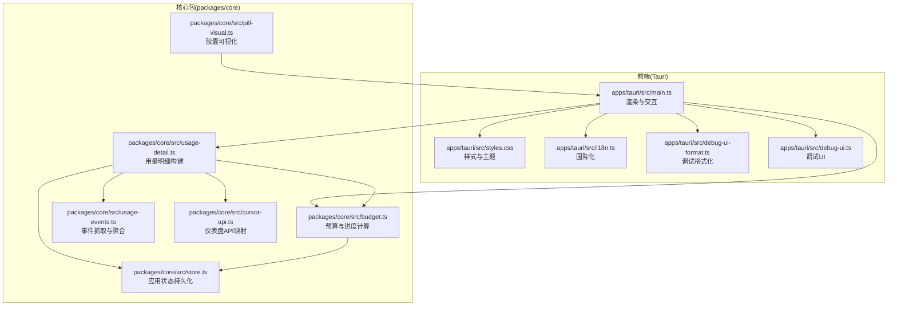
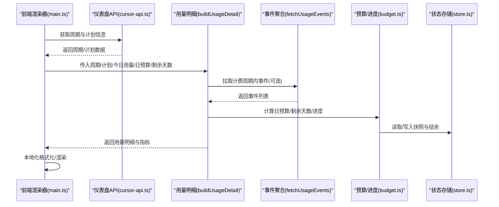
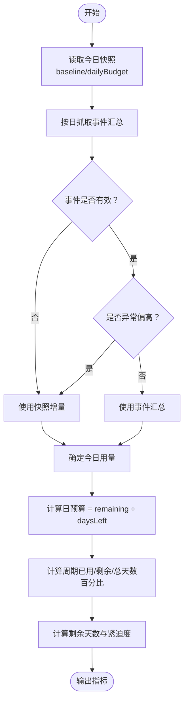
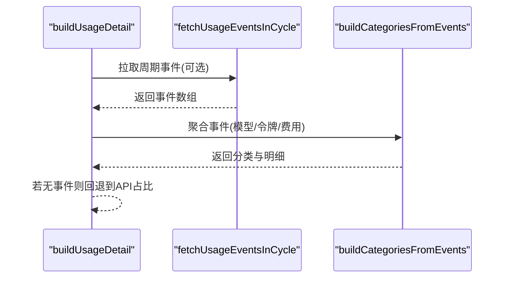
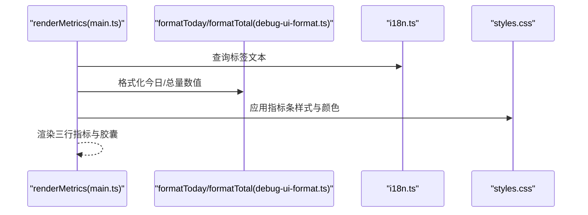
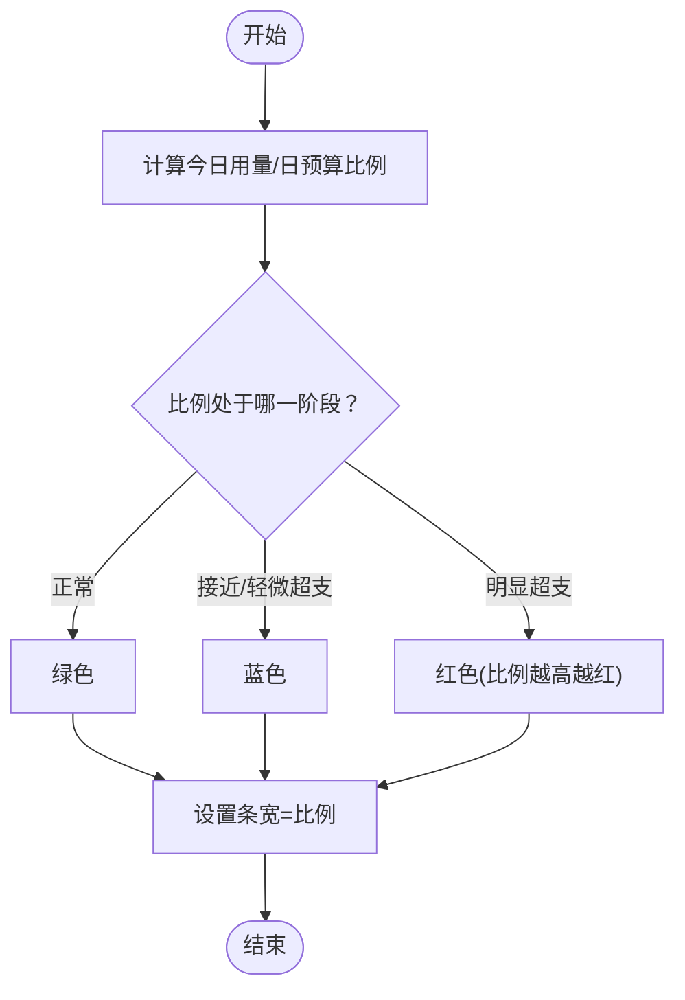
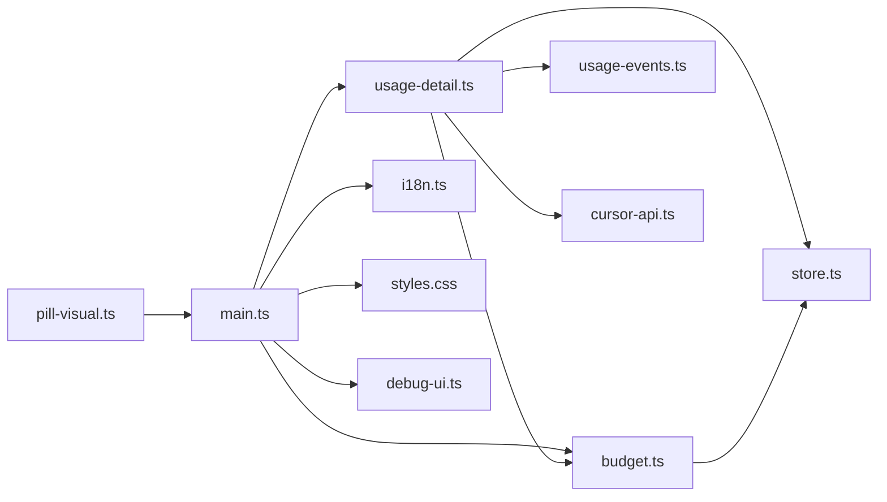

# 用量详情面板

<cite>
**本文引用的文件**
- [apps/tauri/src/main.ts](file://apps/tauri/src/main.ts)
- [apps/tauri/src/styles.css](file://apps/tauri/src/styles.css)
- [apps/tauri/src/debug-ui-format.ts](file://apps/tauri/src/debug-ui-format.ts)
- [apps/tauri/src/i18n.ts](file://apps/tauri/src/i18n.ts)
- [apps/tauri/src/debug-ui.ts](file://apps/tauri/src/debug-ui.ts)
- [packages/core/src/budget.ts](file://packages/core/src/budget.ts)
- [packages/core/src/usage-events.ts](file://packages/core/src/usage-events.ts)
- [packages/core/src/usage-detail.ts](file://packages/core/src/usage-detail.ts)
- [packages/core/src/cursor-api.ts](file://packages/core/src/cursor-api.ts)
- [packages/core/src/pill-visual.ts](file://packages/core/src/pill-visual.ts)
- [packages/core/src/store.ts](file://packages/core/src/store.ts)
</cite>

## 目录
1. [简介](#简介)
2. [项目结构](#项目结构)
3. [核心组件](#核心组件)
4. [架构总览](#架构总览)
5. [详细组件分析](#详细组件分析)
6. [依赖关系分析](#依赖关系分析)
7. [性能考量](#性能考量)
8. [故障排查指南](#故障排查指南)
9. [结论](#结论)
10. [附录](#附录)

## 简介
本文件为“用量详情面板”的用户界面与数据处理文档，面向终端用户与开发者，系统阐述以下内容：
- 面板关键指标的含义与展示方式：计费周期起止时间、今日用量与周期总用量的计算逻辑、日预算的分配与使用、剩余天数的精确计算。
- 数据聚合与统计算法：如何从原始使用事件中提取与计算各项指标，以及异常值处理策略。
- 面板布局与信息层级：关键指标的突出显示、辅助信息的组织方式、数据更新的实时性保障。
- 格式化与本地化：数字格式、单位换算、时间显示等实现细节。
- 交互功能：数据刷新、导出能力、详细视图切换等。

## 项目结构
用量详情面板位于 Tauri 应用前端，核心数据与算法由核心包提供，前端负责渲染与交互。整体结构如下：

图表来源
- [apps/tauri/src/main.ts:181-321](file://apps/tauri/src/main.ts#L181-L321)
- [apps/tauri/src/styles.css:246-318](file://apps/tauri/src/styles.css#L246-L318)
- [packages/core/src/usage-detail.ts:104-152](file://packages/core/src/usage-detail.ts#L104-L152)
- [packages/core/src/budget.ts:243-248](file://packages/core/src/budget.ts#L243-L248)
- [packages/core/src/usage-events.ts:166-186](file://packages/core/src/usage-events.ts#L166-L186)
- [packages/core/src/cursor-api.ts:63-84](file://packages/core/src/cursor-api.ts#L63-L84)
- [packages/core/src/store.ts:10-54](file://packages/core/src/store.ts#L10-L54)
- [packages/core/src/pill-visual.ts:38-78](file://packages/core/src/pill-visual.ts#L38-L78)

章节来源
- [apps/tauri/src/main.ts:181-321](file://apps/tauri/src/main.ts#L181-L321)
- [apps/tauri/src/styles.css:246-318](file://apps/tauri/src/styles.css#L246-L318)
- [packages/core/src/usage-detail.ts:104-152](file://packages/core/src/usage-detail.ts#L104-L152)

## 核心组件
- 指标构建器：从周期与计划信息、今日用量、日预算、剩余天数等输入，计算百分比与占比，生成用量指标对象。
- 事件聚合器：抓取并聚合计费周期内的使用事件，按模型维度统计令牌与费用权重。
- 进度计算器：计算日预算、剩余天数、周期进度压力、是否超前等。
- 渲染器：将指标与可视化结果渲染到面板，支持调试模式与本地化。
- 可视化胶囊：根据今日用量与日预算比例，动态绘制胶囊颜色与分段比例。

章节来源
- [packages/core/src/usage-detail.ts:22-54](file://packages/core/src/usage-detail.ts#L22-L54)
- [packages/core/src/usage-events.ts:192-218](file://packages/core/src/usage-events.ts#L192-L218)
- [packages/core/src/budget.ts:243-248](file://packages/core/src/budget.ts#L243-L248)
- [apps/tauri/src/main.ts:216-278](file://apps/tauri/src/main.ts#L216-L278)
- [packages/core/src/pill-visual.ts:38-78](file://packages/core/src/pill-visual.ts#L38-L78)

## 架构总览
用量详情面板的数据流自上而下分为三层：
- 输入层：周期起止时间、计划限额、已用/剩余、自动分桶模型、访问令牌。
- 处理层：抓取事件、聚合统计、计算指标、生成可视化参数。
- 展示层：本地化格式化、UI 渲染、调试工具与交互。

图表来源
- [apps/tauri/src/main.ts:216-278](file://apps/tauri/src/main.ts#L216-L278)
- [packages/core/src/cursor-api.ts:63-84](file://packages/core/src/cursor-api.ts#L63-L84)
- [packages/core/src/usage-detail.ts:104-152](file://packages/core/src/usage-detail.ts#L104-L152)
- [packages/core/src/usage-events.ts:166-186](file://packages/core/src/usage-events.ts#L166-L186)
- [packages/core/src/budget.ts:243-248](file://packages/core/src/budget.ts#L243-L248)
- [packages/core/src/store.ts:10-54](file://packages/core/src/store.ts#L10-L54)

## 详细组件分析

### 指标构建与计算
- 今日用量与日预算
  - 今日用量来自快照增量与事件汇总的融合，具备异常值修复机制，避免事件汇总偏高导致误判。
  - 日预算按“剩余金额 ÷ 剩余天数”计算，并确保最小值。
- 周期总用量
  - 周期已用金额与配额上限的比例，结合“按时间均匀消耗”的进度进行对比，判断是否“超前”。
- 剩余天数
  - 基于计费周期结束时间与当前时间计算，支持调试场景固定基准时刻。
- 百分比与占比
  - 所有百分比均保留一位小数并四舍五入，限制在 0–100 区间。

图表来源
- [packages/core/src/budget.ts:214-236](file://packages/core/src/budget.ts#L214-L236)
- [packages/core/src/budget.ts:51-57](file://packages/core/src/budget.ts#L51-L57)
- [packages/core/src/budget.ts:243-248](file://packages/core/src/budget.ts#L243-L248)
- [packages/core/src/usage-detail.ts:22-54](file://packages/core/src/usage-detail.ts#L22-L54)

章节来源
- [packages/core/src/budget.ts:51-57](file://packages/core/src/budget.ts#L51-L57)
- [packages/core/src/budget.ts:214-236](file://packages/core/src/budget.ts#L214-L236)
- [packages/core/src/usage-detail.ts:22-54](file://packages/core/src/usage-detail.ts#L22-L54)

### 事件抓取与聚合
- 抓取范围
  - 计费周期内事件：用于构建完整分类与明细。
  - 今日事件：用于修正今日用量，避免整周期汇总偏高。
- 聚合规则
  - 按模型分组，累加输入/输出/缓存读写令牌数与费用权重。
  - 自动分桶模型与 API/自动使用占比参与分类权重分配。

图表来源
- [packages/core/src/usage-detail.ts:104-152](file://packages/core/src/usage-detail.ts#L104-L152)
- [packages/core/src/usage-events.ts:166-186](file://packages/core/src/usage-events.ts#L166-L186)
- [packages/core/src/usage-events.ts:192-218](file://packages/core/src/usage-events.ts#L192-L218)

章节来源
- [packages/core/src/usage-events.ts:166-186](file://packages/core/src/usage-events.ts#L166-L186)
- [packages/core/src/usage-events.ts:192-218](file://packages/core/src/usage-events.ts#L192-L218)
- [packages/core/src/usage-detail.ts:104-152](file://packages/core/src/usage-detail.ts#L104-L152)

### 面板渲染与本地化
- 指标行渲染
  - 总量：显示“周期已用百分比”，若超前则标注提示。
  - 今日：显示“今日用量百分比 · 今日已用/日预算”的本地化格式。
  - 剩余天数：显示天数与紧迫度条形图。
- 本地化
  - 使用国际化键值，美元金额以美分换算为美元并保留两位小数。
- 调试模式
  - 支持滑条调整今日用量百分比、周期用量百分比、剩余天数紧迫度，实时预览胶囊颜色与条形宽度。

图表来源
- [apps/tauri/src/main.ts:216-278](file://apps/tauri/src/main.ts#L216-L278)
- [apps/tauri/src/debug-ui-format.ts:8-33](file://apps/tauri/src/debug-ui-format.ts#L8-L33)
- [apps/tauri/src/i18n.ts](file://apps/tauri/src/i18n.ts)
- [apps/tauri/src/styles.css:246-318](file://apps/tauri/src/styles.css#L246-L318)

章节来源
- [apps/tauri/src/main.ts:216-278](file://apps/tauri/src/main.ts#L216-L278)
- [apps/tauri/src/debug-ui-format.ts:8-33](file://apps/tauri/src/debug-ui-format.ts#L8-L33)
- [apps/tauri/src/styles.css:246-318](file://apps/tauri/src/styles.css#L246-L318)

### 胶囊可视化与颜色策略
- 胶囊颜色由“今日用量/日预算”比例决定：
  - 正常：绿色渐变。
  - 超过阈值：红色渐变，比例越高红色占比越大。
  - 中间区间：蓝色或琥珀色过渡。
- 条形宽度：今日用量百分比上限为 100%，用于直观显示进度。

图表来源
- [packages/core/src/pill-visual.ts:38-78](file://packages/core/src/pill-visual.ts#L38-L78)
- [apps/tauri/src/main.ts:181-188](file://apps/tauri/src/main.ts#L181-L188)

章节来源
- [packages/core/src/pill-visual.ts:38-78](file://packages/core/src/pill-visual.ts#L38-L78)
- [apps/tauri/src/main.ts:181-188](file://apps/tauri/src/main.ts#L181-L188)

### 计费周期与时间显示
- 计费周期起止时间来自仪表盘 API 映射，统一解析为毫秒时间戳。
- 时间显示遵循本地化：中文环境显示“天”，英文环境显示“d”。

章节来源
- [packages/core/src/cursor-api.ts:63-84](file://packages/core/src/cursor-api.ts#L63-L84)
- [apps/tauri/src/main.ts:252-257](file://apps/tauri/src/main.ts#L252-L257)

### 交互功能
- 数据刷新：通过重新拉取周期与计划信息、事件并重建指标完成。
- 导出功能：当前仓库未提供导出实现，建议在前端增加导出按钮并调用系统保存接口。
- 详细视图切换：面板支持展开/收起，调试模式下提供滑条与预设场景切换。

章节来源
- [apps/tauri/src/main.ts:290-317](file://apps/tauri/src/main.ts#L290-L317)
- [apps/tauri/src/debug-ui.ts:111-177](file://apps/tauri/src/debug-ui.ts#L111-L177)

## 依赖关系分析
- 前端渲染依赖核心包的指标与可视化函数，同时依赖国际化与样式模块。
- 核心包内部依赖事件抓取、预算计算、状态存储与 API 映射。
- 调试模式依赖预设场景与滑条模拟，不影响主流程。

图表来源
- [apps/tauri/src/main.ts:216-278](file://apps/tauri/src/main.ts#L216-L278)
- [packages/core/src/usage-detail.ts:104-152](file://packages/core/src/usage-detail.ts#L104-L152)
- [packages/core/src/budget.ts:243-248](file://packages/core/src/budget.ts#L243-L248)
- [packages/core/src/usage-events.ts:166-186](file://packages/core/src/usage-events.ts#L166-L186)
- [packages/core/src/cursor-api.ts:63-84](file://packages/core/src/cursor-api.ts#L63-L84)
- [packages/core/src/store.ts:10-54](file://packages/core/src/store.ts#L10-L54)
- [packages/core/src/pill-visual.ts:38-78](file://packages/core/src/pill-visual.ts#L38-L78)

章节来源
- [apps/tauri/src/main.ts:216-278](file://apps/tauri/src/main.ts#L216-L278)
- [packages/core/src/usage-detail.ts:104-152](file://packages/core/src/usage-detail.ts#L104-L152)

## 性能考量
- 事件抓取分页与最大页数限制，避免一次性拉取过多数据。
- 优先使用 API 百分比构建分类，必要时再拉取整周期事件，平衡刷新速度与准确性。
- 指标计算与格式化均为纯函数，避免重复计算，渲染时仅更新变化部分。

## 故障排查指南
- 今日用量异常偏高
  - 现象：事件汇总远高于日预算倍数。
  - 处理：采用异常值检测与修复，回退到快照增量；必要时清理异常快照。
- 周期“超前”提示频繁
  - 现象：总量百分比高于按时间均匀消耗的进度。
  - 处理：检查当前时间点与周期进度，确认是否为节假日或周末影响。
- 胶囊颜色未变红
  - 现象：今日用量已超日预算但胶囊仍为绿/蓝。
  - 处理：确认比例阈值与日预算计算是否正确，检查调试模式下的比例上限。

章节来源
- [packages/core/src/budget.ts:214-236](file://packages/core/src/budget.ts#L214-L236)
- [packages/core/src/budget.ts:170-181](file://packages/core/src/budget.ts#L170-L181)
- [packages/core/src/pill-visual.ts:46-49](file://packages/core/src/pill-visual.ts#L46-L49)

## 结论
用量详情面板通过清晰的指标体系与稳健的数据处理流程，实现了对计费周期内资源使用的可视化监控。前端负责本地化与交互，核心包提供可靠的预算、进度与事件聚合能力。建议后续增强导出与通知能力，进一步提升用户体验。

## 附录

### 关键指标与计算公式
- 日预算：remaining ÷ daysLeft（最小值保护）
- 今日用量：min(快照增量, 事件汇总)，异常值修复
- 周期已用百分比：used ÷ limit × 100（保留一位小数）
- 周期剩余百分比：remaining ÷ limit × 100（保留一位小数）
- 剩余天数百分比：daysLeft ÷ cycleTotalDays × 100（保留一位小数）
- 胶囊颜色：依据今日用量/日预算比例分级

章节来源
- [packages/core/src/budget.ts:51-57](file://packages/core/src/budget.ts#L51-L57)
- [packages/core/src/budget.ts:214-236](file://packages/core/src/budget.ts#L214-L236)
- [packages/core/src/usage-detail.ts:22-54](file://packages/core/src/usage-detail.ts#L22-L54)
- [packages/core/src/pill-visual.ts:38-78](file://packages/core/src/pill-visual.ts#L38-L78)