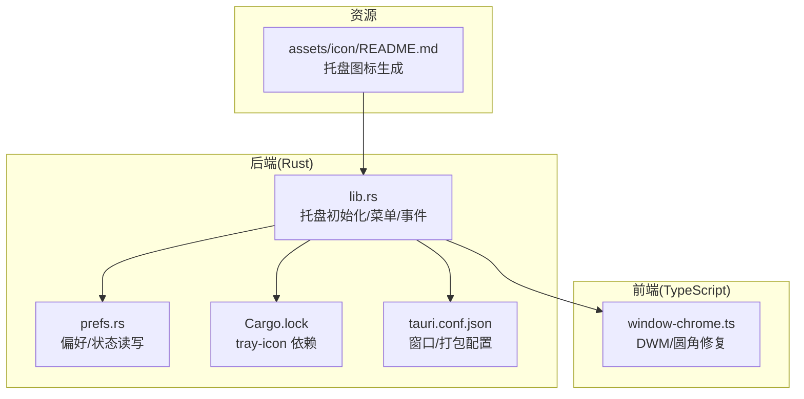
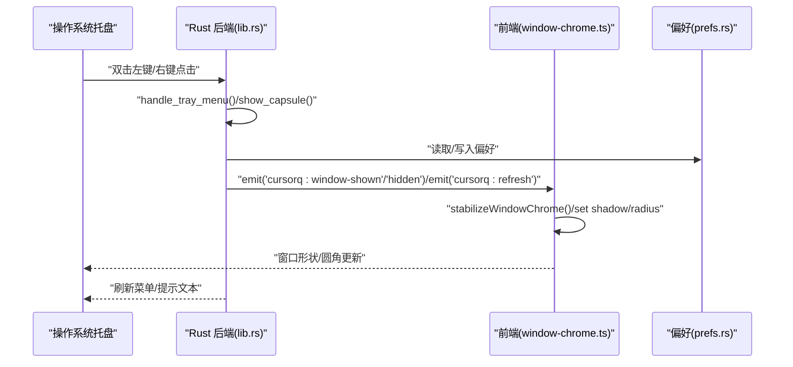
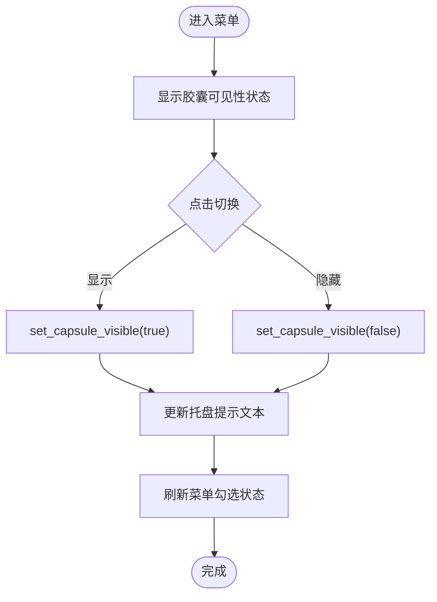
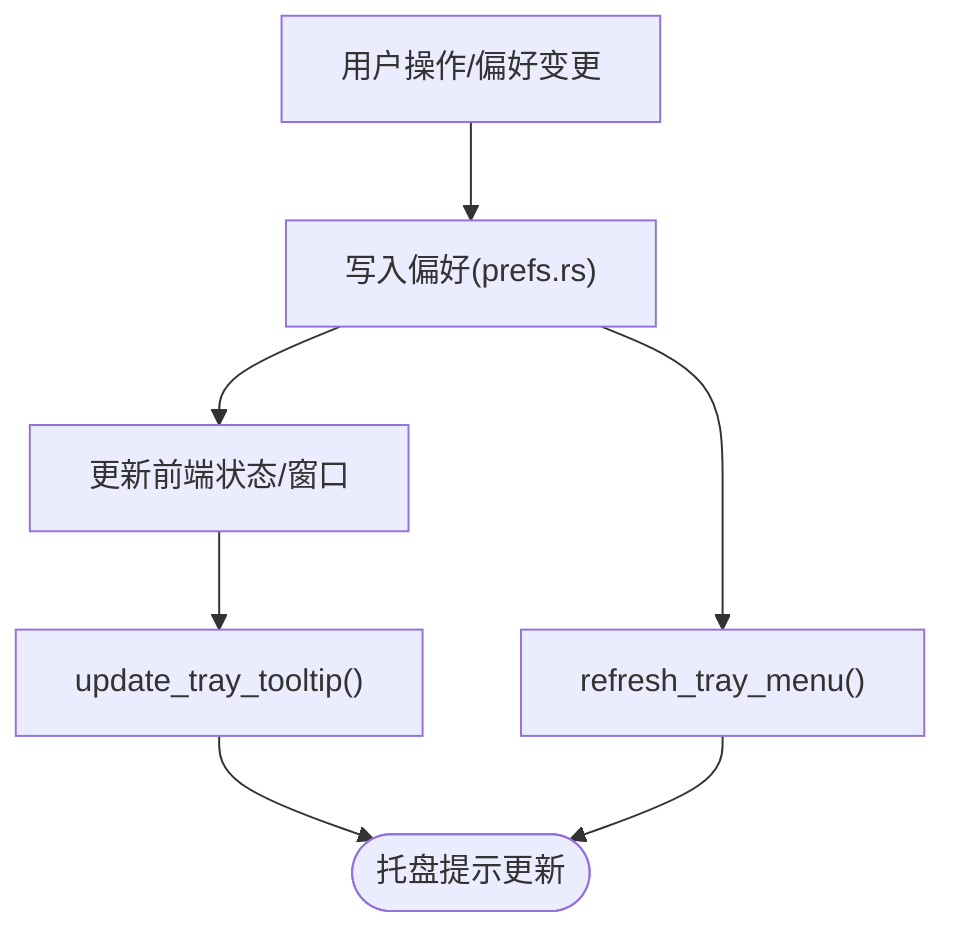
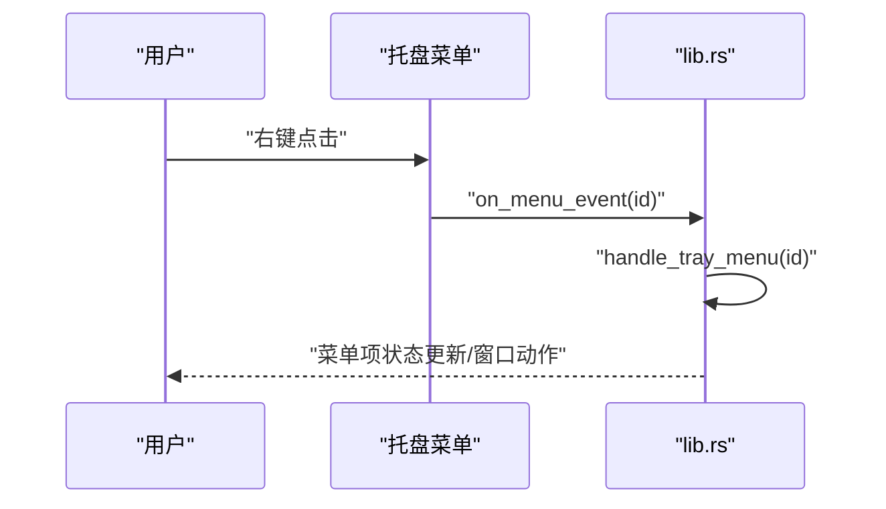
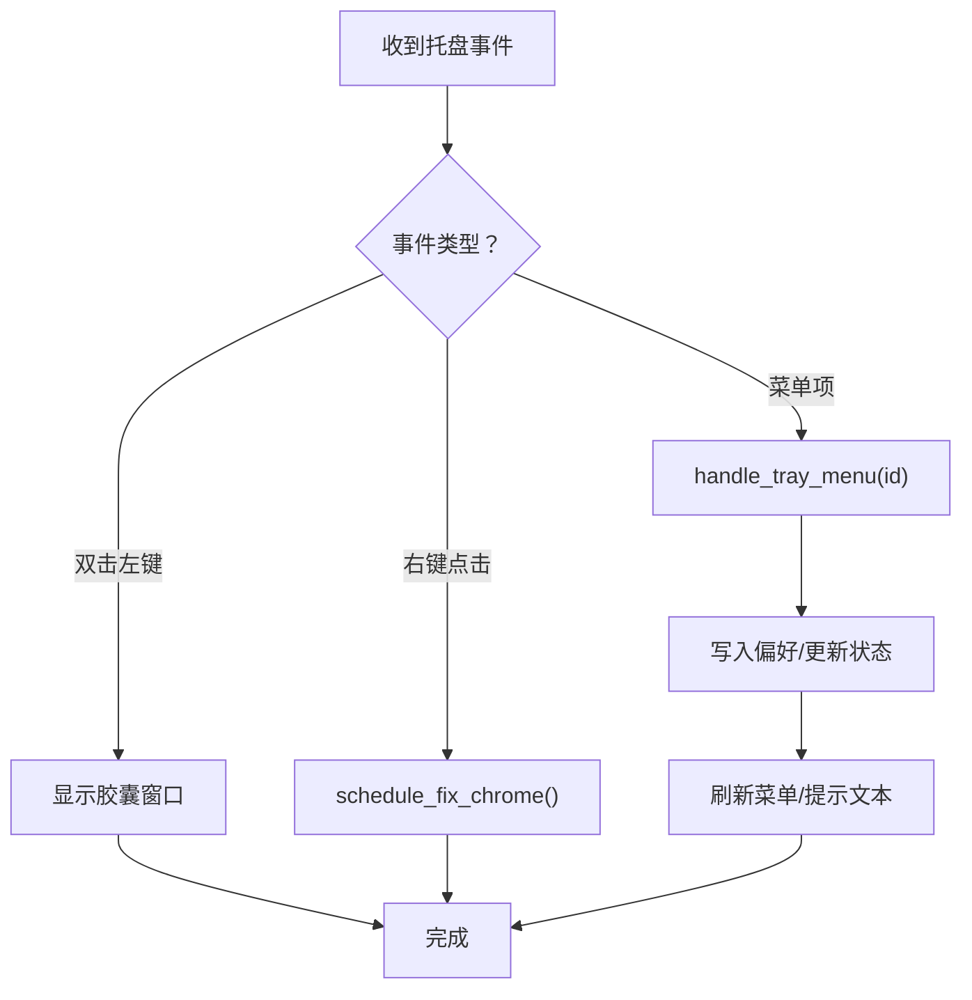
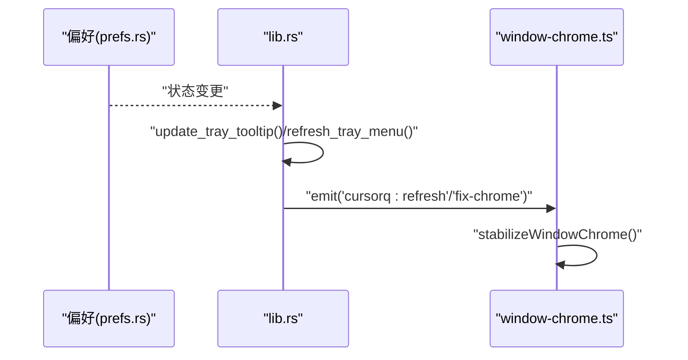
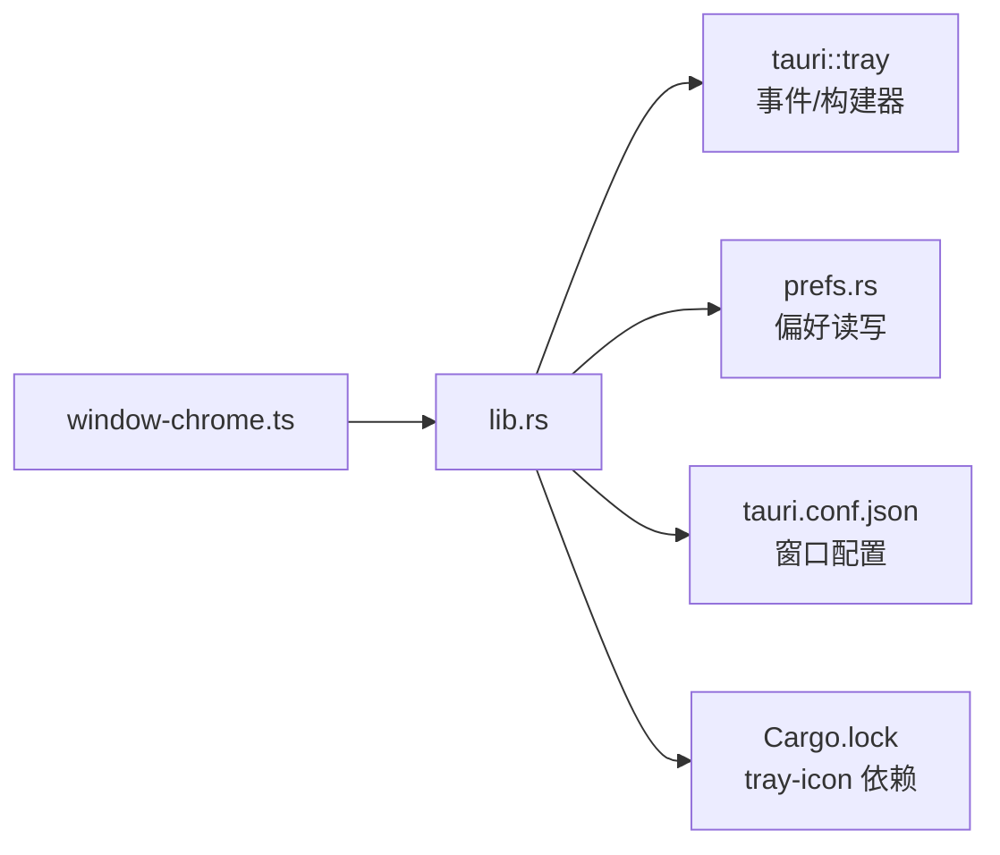

# 系统托盘集成

<cite>
**本文引用的文件**
- [apps/tauri/src-tauri/src/lib.rs](file://apps/tauri/src-tauri/src/lib.rs)
- [apps/tauri/src-tauri/src/prefs.rs](file://apps/tauri/src-tauri/src/prefs.rs)
- [apps/tauri/src-tauri/Cargo.lock](file://apps/tauri/src-tauri/Cargo.lock)
- [apps/tauri/src-tauri/tauri.conf.json](file://apps/tauri/src-tauri/tauri.conf.json)
- [apps/tauri/src/window-chrome.ts](file://apps/tauri/src/window-chrome.ts)
- [assets/icon/README.md](file://assets/icon/README.md)
</cite>

## 目录
1. [简介](#简介)
2. [项目结构](#项目结构)
3. [核心组件](#核心组件)
4. [架构总览](#架构总览)
5. [详细组件分析](#详细组件分析)
6. [依赖关系分析](#依赖关系分析)
7. [性能考量](#性能考量)
8. [故障排查指南](#故障排查指南)
9. [结论](#结论)
10. [附录](#附录)

## 简介
本文件针对 CursorQ 应用的系统托盘集成功能进行完整实现文档化，覆盖托盘菜单设计与功能、动态图标与状态指示、右键菜单上下文操作、托盘与主应用状态同步机制、跨平台差异处理、配置项与用户自定义能力，以及事件处理与错误处理流程。目标是帮助开发者与维护者快速理解并扩展托盘相关能力。

## 项目结构
托盘功能主要位于 Rust 后端（Tauri）侧，前端通过命令调用与状态同步配合完成。关键位置如下：
- 后端托盘初始化与事件处理：apps/tauri/src-tauri/src/lib.rs
- 配置与状态持久化：apps/tauri/src-tauri/src/prefs.rs
- 构建配置与窗口属性：apps/tauri/src-tauri/tauri.conf.json
- 前端透明胶囊窗口的 Chrome 修复逻辑：apps/tauri/src/window-chrome.ts
- 托盘图标源文件与生成说明：assets/icon/README.md
- 托盘图标库依赖：apps/tauri/src-tauri/Cargo.lock

图表来源
- [apps/tauri/src-tauri/src/lib.rs:715-812](file://apps/tauri/src-tauri/src/lib.rs#L715-L812)
- [apps/tauri/src-tauri/src/prefs.rs:1-56](file://apps/tauri/src-tauri/src/prefs.rs#L1-L56)
- [apps/tauri/src-tauri/Cargo.lock:4006-4026](file://apps/tauri/src-tauri/Cargo.lock#L4006-L4026)
- [apps/tauri/src-tauri/tauri.conf.json:1-47](file://apps/tauri/src-tauri/tauri.conf.json#L1-L47)
- [apps/tauri/src/window-chrome.ts:1-98](file://apps/tauri/src/window-chrome.ts#L1-L98)
- [assets/icon/README.md:1-12](file://assets/icon/README.md#L1-L12)

章节来源
- [apps/tauri/src-tauri/src/lib.rs:715-812](file://apps/tauri/src-tauri/src/lib.rs#L715-L812)
- [apps/tauri/src-tauri/src/prefs.rs:1-56](file://apps/tauri/src-tauri/src/prefs.rs#L1-L56)
- [apps/tauri/src-tauri/Cargo.lock:4006-4026](file://apps/tauri/src-tauri/Cargo.lock#L4006-L4026)
- [apps/tauri/src-tauri/tauri.conf.json:1-47](file://apps/tauri/src-tauri/tauri.conf.json#L1-L47)
- [apps/tauri/src/window-chrome.ts:1-98](file://apps/tauri/src/window-chrome.ts#L1-L98)
- [assets/icon/README.md:1-12](file://assets/icon/README.md#L1-L12)

## 核心组件
- 托盘图标与菜单构建：负责创建主托盘图标、构建右键菜单、设置提示文本。
- 托盘事件处理器：处理双击、点击等事件，触发显示/隐藏胶囊窗口、菜单事件路由等。
- 菜单项与状态同步：菜单项勾选/切换与应用状态（置顶、开机启动、语言、可见性）保持一致。
- 状态持久化与默认值：通过偏好模块读写应用状态，提供默认值保障首次运行体验。
- 透明胶囊窗口与 DWM 修复：前端负责窗口圆角、阴影与 DWM 形状同步，确保视觉一致性。

章节来源
- [apps/tauri/src-tauri/src/lib.rs:282-387](file://apps/tauri/src-tauri/src/lib.rs#L282-L387)
- [apps/tauri/src-tauri/src/lib.rs:663-713](file://apps/tauri/src-tauri/src/lib.rs#L663-L713)
- [apps/tauri/src-tauri/src/prefs.rs:41-56](file://apps/tauri/src-tauri/src/prefs.rs#L41-L56)
- [apps/tauri/src/window-chrome.ts:46-77](file://apps/tauri/src/window-chrome.ts#L46-L77)

## 架构总览
托盘功能采用“后端菜单/事件 + 前端状态/渲染”的协作模式：
- 后端负责托盘生命周期、菜单构建、事件分发与状态持久化。
- 前端负责窗口样式、DWM 形状与圆角修复，以及与后端的命令交互。

图表来源
- [apps/tauri/src-tauri/src/lib.rs:785-801](file://apps/tauri/src-tauri/src/lib.rs#L785-L801)
- [apps/tauri/src-tauri/src/lib.rs:389-394](file://apps/tauri/src-tauri/src/lib.rs#L389-L394)
- [apps/tauri/src-tauri/src/lib.rs:242-273](file://apps/tauri/src-tauri/src/lib.rs#L242-L273)
- [apps/tauri/src/window-chrome.ts:46-77](file://apps/tauri/src/window-chrome.ts#L46-L77)

## 详细组件分析

### 托盘菜单设计与功能
- 快速状态查看：菜单顶部显示胶囊可见性状态，便于一目了然了解当前状态。
- 显示/隐藏胶囊：通过切换菜单项快速控制主窗口的显示与隐藏，并同步更新托盘提示文本。
- 语言切换：支持中英文菜单项，勾选状态与当前语言一致。
- 应用行为控制：置顶窗口与开机启动的勾选状态与实际行为一致，修改后即时生效。
- 运维操作：提供“立即刷新”“同步文案/动图”等快捷入口。
- 退出应用：安全退出应用，确保窗口被隐藏并释放资源。

图表来源
- [apps/tauri/src-tauri/src/lib.rs:282-368](file://apps/tauri/src-tauri/src/lib.rs#L282-L368)
- [apps/tauri/src-tauri/src/lib.rs:242-273](file://apps/tauri/src-tauri/src/lib.rs#L242-L273)
- [apps/tauri/src-tauri/src/lib.rs:370-387](file://apps/tauri/src-tauri/src/lib.rs#L370-L387)

章节来源
- [apps/tauri/src-tauri/src/lib.rs:282-368](file://apps/tauri/src-tauri/src/lib.rs#L282-L368)
- [apps/tauri/src-tauri/src/lib.rs:370-387](file://apps/tauri/src-tauri/src/lib.rs#L370-L387)

### 动态更新机制（状态指示器、提示文本）
- 提示文本：根据胶囊可见性动态更新托盘提示文本，便于用户快速识别当前状态。
- 菜单勾选：语言、置顶、开机启动等菜单项勾选状态与实际偏好一致，每次状态变更后刷新菜单。
- 防抖与互斥：菜单动作设有时间窗口互斥，避免频繁切换导致的闪烁或误触。

图表来源
- [apps/tauri/src-tauri/src/lib.rs:378-387](file://apps/tauri/src-tauri/src/lib.rs#L378-L387)
- [apps/tauri/src-tauri/src/lib.rs:370-376](file://apps/tauri/src-tauri/src/lib.rs#L370-L376)
- [apps/tauri/src-tauri/src/prefs.rs:24-39](file://apps/tauri/src-tauri/src/prefs.rs#L24-L39)

章节来源
- [apps/tauri/src-tauri/src/lib.rs:378-387](file://apps/tauri/src-tauri/src/lib.rs#L378-L387)
- [apps/tauri/src-tauri/src/lib.rs:370-376](file://apps/tauri/src-tauri/src/lib.rs#L370-L376)
- [apps/tauri/src-tauri/src/prefs.rs:24-39](file://apps/tauri/src-tauri/src/prefs.rs#L24-L39)

### 右键菜单上下文操作
- 快速设置：语言切换、置顶、开机启动等。
- 快捷运维：立即刷新、同步内容。
- 帮助与退出：提供退出应用的安全路径。

图表来源
- [apps/tauri/src-tauri/src/lib.rs:785-785](file://apps/tauri/src-tauri/src/lib.rs#L785-L785)
- [apps/tauri/src-tauri/src/lib.rs:663-713](file://apps/tauri/src-tauri/src/lib.rs#L663-L713)

章节来源
- [apps/tauri/src-tauri/src/lib.rs:785-785](file://apps/tauri/src-tauri/src/lib.rs#L785-L785)
- [apps/tauri/src-tauri/src/lib.rs:663-713](file://apps/tauri/src-tauri/src/lib.rs#L663-L713)

### 事件处理流程与错误处理
- 事件类型：支持点击、双击、进入、移动、离开等事件。
- 处理策略：
  - 双击左键：显示胶囊窗口。
  - 右键点击：触发前端修复流程，避免白边。
  - 菜单事件：根据 id 分派到具体处理函数，更新状态并刷新菜单。
- 错误处理：对窗口隐藏失败、偏好写入失败等情况记录日志，保证流程不中断。

图表来源
- [apps/tauri/src-tauri/src/lib.rs:785-801](file://apps/tauri/src-tauri/src/lib.rs#L785-L801)
- [apps/tauri/src-tauri/src/lib.rs:663-713](file://apps/tauri/src-tauri/src/lib.rs#L663-L713)

章节来源
- [apps/tauri/src-tauri/src/lib.rs:785-801](file://apps/tauri/src-tauri/src/lib.rs#L785-L801)
- [apps/tauri/src-tauri/src/lib.rs:663-713](file://apps/tauri/src-tauri/src/lib.rs#L663-L713)

### 托盘与主应用状态同步
- 窗口可见性与托盘提示：窗口显示/隐藏时同步更新托盘提示文本与菜单项状态。
- 偏好驱动：置顶、开机启动、语言等偏好变更后，菜单勾选与窗口行为实时更新。
- 前端修复链路：窗口大小/展开状态变化后，前端通过命令修复 DWM 形状与圆角，避免白边。

图表来源
- [apps/tauri/src-tauri/src/lib.rs:275-280](file://apps/tauri/src-tauri/src/lib.rs#L275-L280)
- [apps/tauri/src-tauri/src/lib.rs:378-387](file://apps/tauri/src-tauri/src/lib.rs#L378-L387)
- [apps/tauri/src-tauri/src/lib.rs:370-376](file://apps/tauri/src-tauri/src/lib.rs#L370-L376)
- [apps/tauri/src/window-chrome.ts:46-77](file://apps/tauri/src/window-chrome.ts#L46-L77)

章节来源
- [apps/tauri/src-tauri/src/lib.rs:275-280](file://apps/tauri/src-tauri/src/lib.rs#L275-L280)
- [apps/tauri/src-tauri/src/lib.rs:378-387](file://apps/tauri/src-tauri/src/lib.rs#L378-L387)
- [apps/tauri/src-tauri/src/lib.rs:370-376](file://apps/tauri/src-tauri/src/lib.rs#L370-L376)
- [apps/tauri/src/window-chrome.ts:46-77](file://apps/tauri/src/window-chrome.ts#L46-L77)

### 跨平台兼容性
- Windows：
  - 使用 DWM 接口进行窗口无激活显示与形状同步，减少闪烁与白边。
  - 通过 Win32 API 控制窗口显示/隐藏。
- macOS/Linux：
  - 使用通用窗口显示/隐藏接口，托盘图标与菜单由底层库适配。
  - Linux 平台托盘图标临时目录由系统决定，遵循 XDG 规范。

章节来源
- [apps/tauri/src-tauri/src/lib.rs:250-269](file://apps/tauri/src-tauri/src/lib.rs#L250-L269)
- [apps/tauri/src-tauri/Cargo.lock:4006-4026](file://apps/tauri/src-tauri/Cargo.lock#L4006-L4026)

### 配置选项与用户自定义
- 默认行为：
  - 总是置顶：默认开启。
  - 开机启动：默认关闭。
  - 胶囊可见：默认开启。
- 用户可配置项：
  - 语言：中/英。
  - 置顶：全局窗口置顶。
  - 开机启动：随系统启动。
- 自定义图标：
  - 提供托盘图标源文件与生成脚本，支持重新生成多尺寸图标。

章节来源
- [apps/tauri/src-tauri/src/prefs.rs:41-56](file://apps/tauri/src-tauri/src/prefs.rs#L41-L56)
- [assets/icon/README.md:1-12](file://assets/icon/README.md#L1-L12)

## 依赖关系分析
- 托盘图标库：tray-icon 0.23.1，提供跨平台托盘图标与菜单支持。
- 事件类型：Click/DoubleClick/Enter/Move/Leave 等事件类型定义。
- 依赖导入：后端通过 tauri::tray 引入托盘事件与构建器。

图表来源
- [apps/tauri/src-tauri/src/lib.rs:16-21](file://apps/tauri/src-tauri/src/lib.rs#L16-L21)
- [apps/tauri/src-tauri/Cargo.lock:4006-4026](file://apps/tauri/src-tauri/Cargo.lock#L4006-L4026)

章节来源
- [apps/tauri/src-tauri/src/lib.rs:16-21](file://apps/tauri/src-tauri/src/lib.rs#L16-L21)
- [apps/tauri/src-tauri/Cargo.lock:4006-4026](file://apps/tauri/src-tauri/Cargo.lock#L4006-L4026)

## 性能考量
- 菜单刷新去抖：通过互斥时间窗口避免频繁刷新菜单导致的 UI 抖动。
- 前端修复链路：使用 Promise 链与 requestAnimationFrame 保证修复过程串行执行，减少重排与闪烁。
- DWM 形状同步：仅在窗口可见且状态变化时执行修复，降低无效调用。

章节来源
- [apps/tauri/src-tauri/src/lib.rs:215-230](file://apps/tauri/src-tauri/src/lib.rs#L215-L230)
- [apps/tauri/src/window-chrome.ts:46-77](file://apps/tauri/src/window-chrome.ts#L46-L77)

## 故障排查指南
- 托盘菜单不更新：
  - 检查是否调用刷新函数与更新提示文本。
  - 确认偏好写入成功，必要时查看日志。
- 右键菜单无效：
  - 确认事件监听已注册，菜单项 ID 与处理函数匹配。
- 窗口隐藏后仍可见：
  - 检查平台特定的窗口显示/隐藏逻辑（Windows 使用 Win32 API）。
- 白边/圆角异常：
  - 确保前端修复链路正常执行，且窗口处于可见状态。
- 日志定位：
  - 对于窗口隐藏失败、偏好写入失败等错误，后端会记录日志，便于定位问题。

章节来源
- [apps/tauri/src-tauri/src/lib.rs:266-268](file://apps/tauri/src-tauri/src/lib.rs#L266-L268)
- [apps/tauri/src-tauri/src/lib.rs:690-692](file://apps/tauri/src-tauri/src/lib.rs#L690-L692)

## 结论
该托盘集成功能以清晰的职责划分实现了菜单构建、事件处理、状态同步与跨平台适配。通过前后端协同与完善的错误处理，提供了稳定可靠的用户体验。建议后续可扩展更多上下文操作（如快速设置预算、临时禁用提醒等），并在前端增加更细粒度的修复策略与可视化调试手段。

## 附录
- 托盘图标生成步骤与输出路径说明见资源文档。
- 窗口配置与打包信息见应用配置文件。

章节来源
- [assets/icon/README.md:1-12](file://assets/icon/README.md#L1-L12)
- [apps/tauri/src-tauri/tauri.conf.json:1-47](file://apps/tauri/src-tauri/tauri.conf.json#L1-L47)