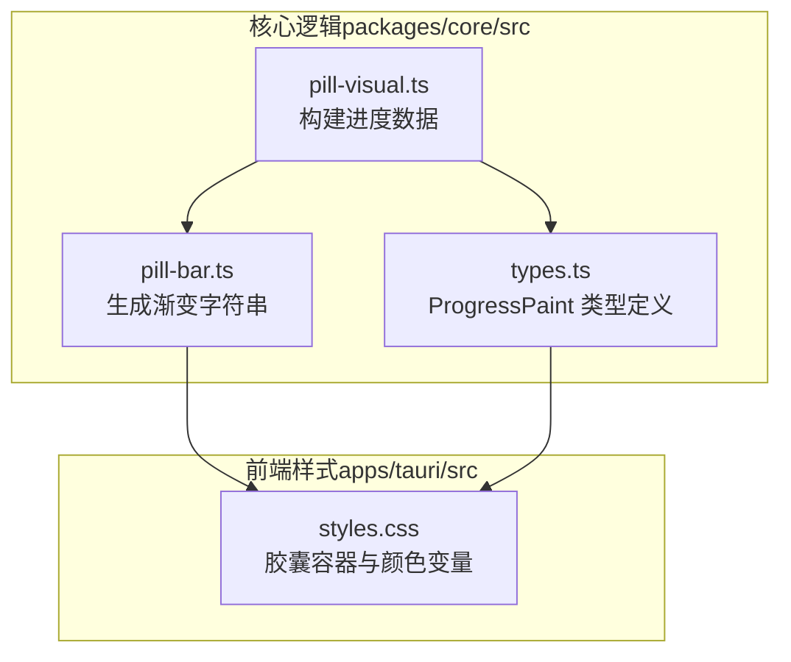
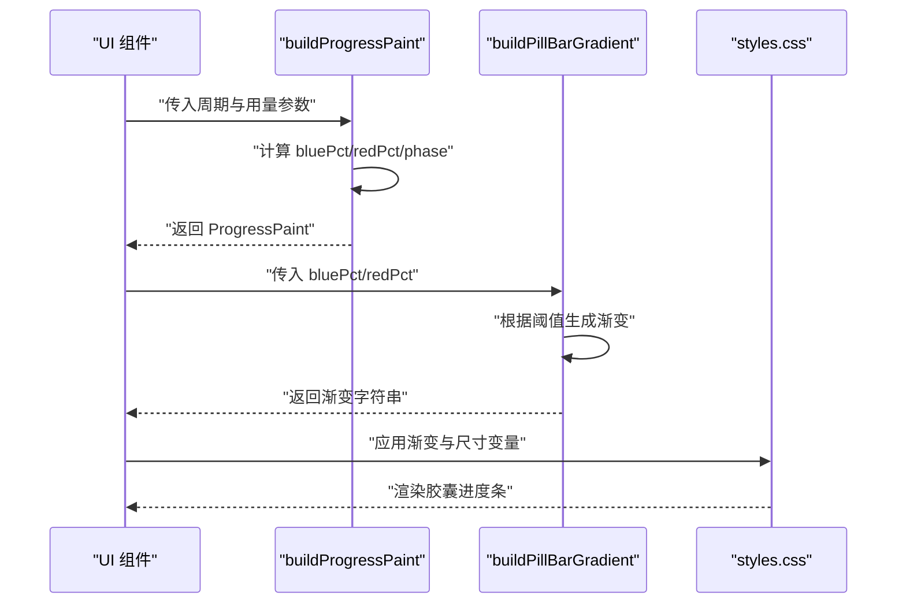
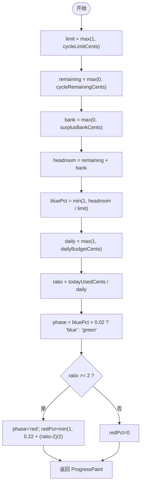
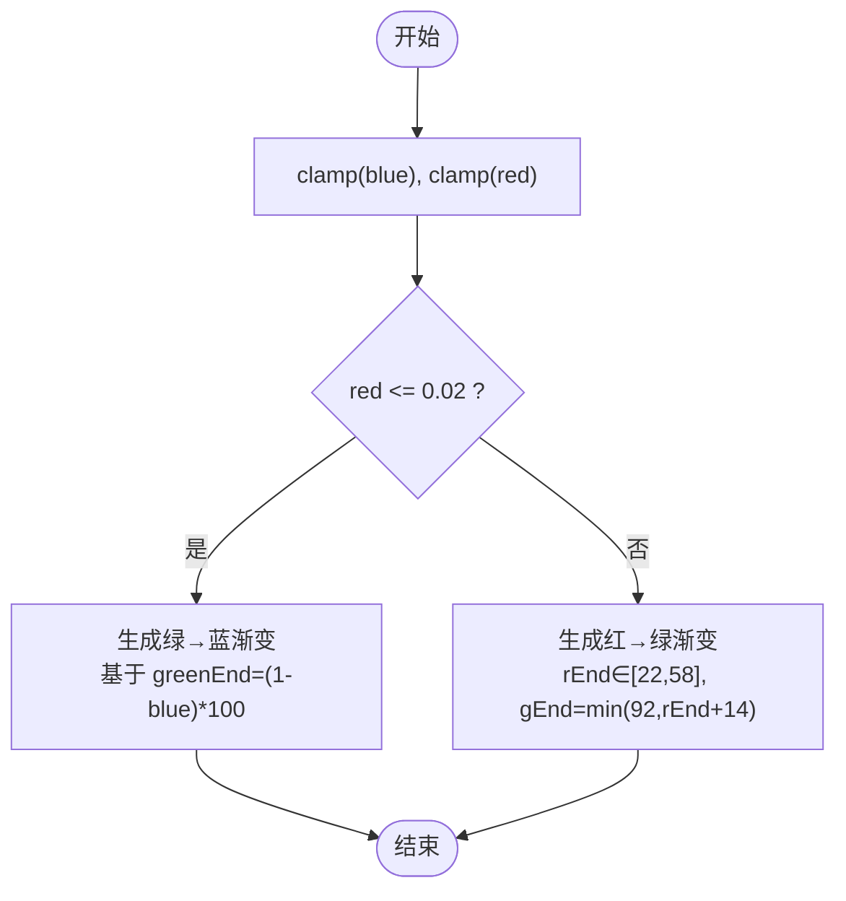
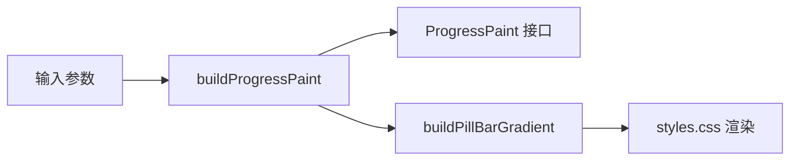

# 胶囊进度条

<cite>
**本文引用的文件**
- [pill-bar.ts](file://packages/core/src/pill-bar.ts)
- [pill-visual.ts](file://packages/core/src/pill-visual.ts)
- [types.ts](file://packages/core/src/types.ts)
- [styles.css](file://apps/tauri/src/styles.css)
- [pill-visual.test.ts](file://packages/core/src/pill-visual.test.ts)
</cite>

## 目录
1. [简介](#简介)
2. [项目结构](#项目结构)
3. [核心组件](#核心组件)
4. [架构总览](#架构总览)
5. [详细组件分析](#详细组件分析)
6. [依赖关系分析](#依赖关系分析)
7. [性能考量](#性能考量)
8. [故障排查指南](#故障排查指南)
9. [结论](#结论)
10. [附录](#附录)

## 简介
本技术文档围绕“胶囊进度条”的视觉设计与实现进行系统化说明，重点涵盖以下方面：
- 视觉设计原理：从绿色到蓝色的颜色渐变如何表示周期剩余量，红色警示条如何显示超支状态
- 进度条计算逻辑：当前用量占周期预算的比例计算、颜色过渡算法、阈值判断机制
- 不同状态下的视觉反馈：正常状态（绿色）、警告状态（黄色渐变）、严重超支（红色）
- UI 渲染实现：CSS 样式、动画与过渡策略、响应式适配
- 尺寸、颜色方案与交互行为的最佳实践

## 项目结构
胶囊进度条功能由核心逻辑与前端样式两部分组成：
- 核心逻辑位于 packages/core/src，负责进度数据计算与颜色渐变生成
- 前端样式位于 apps/tauri/src，负责胶囊容器、进度条背景与颜色变量定义

图表来源
- [pill-visual.ts:1-79](file://packages/core/src/pill-visual.ts#L1-L79)
- [pill-bar.ts:1-23](file://packages/core/src/pill-bar.ts#L1-L23)
- [types.ts:112-124](file://packages/core/src/types.ts#L112-L124)
- [styles.css:1-117](file://apps/tauri/src/styles.css#L1-L117)

章节来源
- [pill-visual.ts:1-79](file://packages/core/src/pill-visual.ts#L1-L79)
- [pill-bar.ts:1-23](file://packages/core/src/pill-bar.ts#L1-L23)
- [types.ts:112-124](file://packages/core/src/types.ts#L112-L124)
- [styles.css:1-117](file://apps/tauri/src/styles.css#L1-L117)

## 核心组件
- 进度数据构建器：根据周期额度、剩余金额、节余银行、今日用量与日预算，计算蓝色占比、红色占比与阶段状态
- 渐变生成器：依据蓝色与红色占比，输出线性渐变字符串，决定胶囊的最终颜色分布
- 类型定义：统一 ProgressPaint 结构，确保前后端一致的数据契约
- 样式层：定义胶囊容器、进度条背景、颜色变量与响应式尺寸

章节来源
- [pill-visual.ts:29-63](file://packages/core/src/pill-visual.ts#L29-L63)
- [pill-bar.ts:8-22](file://packages/core/src/pill-bar.ts#L8-L22)
- [types.ts:112-124](file://packages/core/src/types.ts#L112-L124)
- [styles.css:95-116](file://apps/tauri/src/styles.css#L95-L116)

## 架构总览
胶囊进度条的运行流程如下：
- 输入：周期额度、剩余金额、节余银行、今日用量、日预算、剩余天数等
- 处理：计算蓝色占比（周期剩余+节余占额度）、判断今日是否超支（≥2 倍日预算），确定阶段状态
- 输出：生成渐变字符串，渲染到胶囊进度条背景
- 展示：通过 CSS 变量控制胶囊尺寸与颜色，避免动画导致的重绘问题

图表来源
- [pill-visual.ts:29-63](file://packages/core/src/pill-visual.ts#L29-L63)
- [pill-bar.ts:8-22](file://packages/core/src/pill-bar.ts#L8-L22)
- [styles.css:1-117](file://apps/tauri/src/styles.css#L1-L117)

## 详细组件分析

### 进度数据构建器（buildProgressPaint）
- 计算蓝色占比：(周期剩余 + 节余银行) / 周期额度，限制在 0~1 区间
- 判断今日超支：当 今日用量 / 日预算 ≥ 2 时进入红色阶段，并按比例增加红色占比
- 阶段状态：蓝色占比 > 0.02 时为蓝色，否则为绿色；一旦超支则为红色
- 返回值：包含 bluePct、redPct、phase、今日用量、日预算、周期剩余、周期额度、剩余天数等字段

图表来源
- [pill-visual.ts:29-63](file://packages/core/src/pill-visual.ts#L29-L63)

章节来源
- [pill-visual.ts:29-63](file://packages/core/src/pill-visual.ts#L29-L63)

### 渐变生成器（buildPillBarGradient）
- 当红色占比 ≤ 0.02：采用绿色到蓝色的渐变，绿色结束位置由蓝色占比决定，确保胶囊左侧始终为绿色
- 当红色占比 > 0.02：采用从红棕色到鲜红再到绿色的渐变，红色与绿色的分割点随红色占比动态调整
- 使用 clamp01 对输入进行边界约束，保证渐变参数合法

图表来源
- [pill-bar.ts:3-22](file://packages/core/src/pill-bar.ts#L3-L22)

章节来源
- [pill-bar.ts:8-22](file://packages/core/src/pill-bar.ts#L8-L22)

### 类型定义（ProgressPaint）
- 字段：bluePct、redPct、warnYellowPct、paceStressPct、phase、todayUsedCents、dailyBudgetCents、cycleRemainingCents、cycleLimitCents、daysLeft
- 作用：统一前后端数据结构，确保计算与渲染的一致性

章节来源
- [types.ts:112-124](file://packages/core/src/types.ts#L112-L124)

### 样式与渲染（styles.css）
- 胶囊容器与进度条：定义胶囊尺寸（宽、高、圆角）、进度条绝对定位与溢出隐藏
- 颜色变量：通过 CSS 变量集中管理主色调与渐变，便于主题切换
- 性能优化：禁用所有动画与过渡，避免 WebView 重绘时出现白边
- 响应式适配：使用 CSS 变量控制尺寸，支持不同分辨率与缩放

章节来源
- [styles.css:1-117](file://apps/tauri/src/styles.css#L1-L117)

### 测试验证（pill-visual.test.ts）
- 覆盖场景：100% 日预算用量不触发红色、200% 日预算用量触发红色、低剩余量降低蓝色占比、阈值常量为 2
- 价值：确保计算逻辑与阈值判断符合预期，保障 UI 表现稳定

章节来源
- [pill-visual.test.ts:1-62](file://packages/core/src/pill-visual.test.ts#L1-L62)

## 依赖关系分析
- 模块耦合
  - buildProgressPaint 依赖 types.ts 中的 ProgressPaint 接口
  - buildPillBarGradient 依赖 ProgressPaint 的 bluePct 与 redPct 字段
  - styles.css 依赖渐变字符串与 CSS 变量
- 数据流
  - 输入参数 → 进度数据 → 渐变字符串 → 样式渲染
- 外部依赖
  - 无第三方依赖，纯前端与核心逻辑自洽

图表来源
- [pill-visual.ts:29-63](file://packages/core/src/pill-visual.ts#L29-L63)
- [pill-bar.ts:8-22](file://packages/core/src/pill-bar.ts#L8-L22)
- [types.ts:112-124](file://packages/core/src/types.ts#L112-L124)
- [styles.css:95-116](file://apps/tauri/src/styles.css#L95-L116)

章节来源
- [pill-visual.ts:29-63](file://packages/core/src/pill-visual.ts#L29-L63)
- [pill-bar.ts:8-22](file://packages/core/src/pill-bar.ts#L8-L22)
- [types.ts:112-124](file://packages/core/src/types.ts#L112-L124)
- [styles.css:95-116](file://apps/tauri/src/styles.css#L95-L116)

## 性能考量
- 禁用动画与过渡：避免 WebView 在重绘时出现白边或闪烁
- 使用 CSS 变量：减少重复计算，提升主题切换与尺寸适配效率
- 渐变预计算：将颜色计算集中在核心模块，UI 层只负责应用结果
- 最小化 DOM 更新：通过一次性设置背景渐变，避免频繁变更样式属性

## 故障排查指南
- 现象：胶囊始终为绿色
  - 可能原因：周期剩余与节余银行合计接近额度，导致 bluePct 接近 1，但未触发红色阈值
  - 排查步骤：检查今日用量与日预算比值是否达到 2 倍
- 现象：胶囊突然变为红色
  - 可能原因：今日用量超过日预算的 2 倍
  - 排查步骤：核对 todayUsedCents 与 dailyBudgetCents 的单位与换算
- 现象：颜色过渡不自然
  - 可能原因：bluePct 或 redPct 超出 0~1 边界
  - 排查步骤：确认 clamp01 的使用与调用顺序

章节来源
- [pill-visual.ts:33-49](file://packages/core/src/pill-visual.ts#L33-L49)
- [pill-bar.ts:11-12](file://packages/core/src/pill-bar.ts#L11-L12)

## 结论
胶囊进度条通过“周期剩余蓝色占比 + 今日超支红色占比”的双因子设计，实现了从绿色到蓝色的平滑过渡与超支时的警示红色。核心逻辑清晰、阈值明确、样式简洁，配合 CSS 变量与禁用动画的策略，在保证视觉一致性的同时兼顾了性能与可维护性。

## 附录

### 视觉状态与阈值对照
- 正常状态（绿色）：bluePct > 0.02 且 redPct ≤ 0.02
- 警告状态（黄色渐变）：bluePct > 0.02 且 redPct > 0.02
- 严重超支（红色）：redPct > 0.02（阈值为 2 倍日预算）

章节来源
- [pill-visual.ts:44-49](file://packages/core/src/pill-visual.ts#L44-L49)
- [pill-visual.test.ts:20-33](file://packages/core/src/pill-visual.test.ts#L20-L33)

### UI 渲染最佳实践
- 尺寸：使用 CSS 变量控制胶囊宽度、高度与圆角，便于响应式适配
- 颜色：通过 CSS 变量集中管理主色调与渐变，避免硬编码
- 动画：禁用所有动画与过渡，确保在 WebView 环境中的稳定性
- 交互：胶囊作为拖拽容器，需保持 touch-action 与指针事件的合理配置

章节来源
- [styles.css:1-117](file://apps/tauri/src/styles.css#L1-L117)